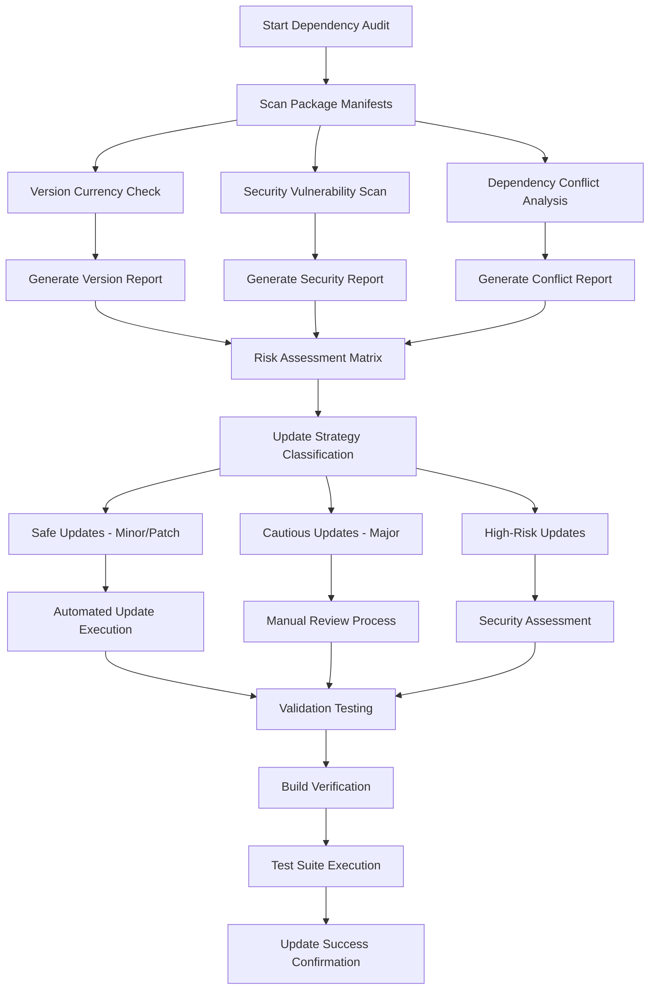
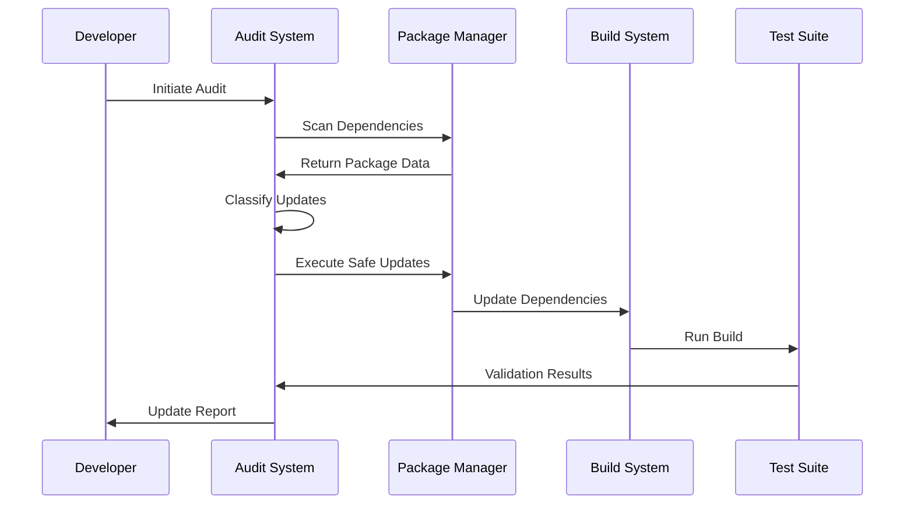

# Dependency Audit and Update System Design

## Overview

This document outlines the design for a comprehensive dependency audit and update system for the Fleetify Fleet Management Application. The system addresses dependency health, security vulnerabilities, version compatibility, and automated update workflows to maintain a secure and stable codebase.

The Fleetify application is a React-based TypeScript application using Vite as the build tool and npm as the package manager. The system includes 67 production dependencies and 17 development dependencies, with a focus on modern web development tools including React 18, TypeScript, Tailwind CSS, Supabase backend services, and Capacitor for mobile deployment.

## Technology Stack Analysis

### Primary Package Manager
- **Manager**: npm (Node Package Manager)
- **Configuration**: package.json with scripts for development, build, and mobile deployment
- **Lock File Status**: No lock file detected (npm-lock.json, yarn.lock, or pnpm-lock.yaml)
- **Mobile Integration**: Capacitor-based mobile builds for Android and iOS

### Core Dependencies Assessment

| Category | Package | Current Version | Purpose | Risk Level |
|----------|---------|-----------------|---------|------------|
| **Frontend Framework** | react | ^18.3.1 | Core UI framework | Low |
| **Frontend Framework** | react-dom | ^18.3.1 | DOM rendering | Low |
| **Build Tool** | vite | ^5.4.1 | Development and build | Medium |
| **Type System** | typescript | ^5.9.2 | Type safety | Low |
| **Backend Integration** | @supabase/supabase-js | ^2.57.4 | Database and auth | Medium |
| **State Management** | @tanstack/react-query | ^5.87.4 | Server state management | Low |
| **Styling Framework** | tailwindcss | ^3.4.15 | CSS framework | Low |
| **Mobile Framework** | @capacitor/core | ^6.1.2 | Mobile deployment | Medium |

## Dependency Audit Strategy

### Audit Scope Definition

The dependency audit encompasses multiple analysis dimensions:

#### Version Currency Analysis
- Compare current versions against latest stable releases
- Identify packages with significant version gaps (>1 major version behind)
- Assess semver compliance and breaking change impact
- Evaluate pre-release and beta dependencies

#### Security Vulnerability Assessment
- Scan for known CVE (Common Vulnerabilities and Exposures)
- Identify packages with security advisories
- Assess dependency chain vulnerabilities
- Review license compatibility and legal implications

#### Dependency Conflict Detection
- Analyze peer dependency mismatches
- Identify duplicate dependencies in the tree
- Detect version conflicts between packages
- Evaluate transitive dependency impacts

#### Performance Impact Evaluation
- Assess bundle size impact of outdated packages
- Identify packages with performance regressions
- Evaluate tree-shaking compatibility
- Review build-time dependency performance

### Audit Process Workflow

## Update Classification Framework

### Safe Updates (Automated)
- **Patch versions** (1.0.x → 1.0.y where y > x)
- **Minor versions** (1.x.0 → 1.y.0 where y > x)
- Dependencies with strong semver compliance
- Well-maintained packages with comprehensive test suites

### Cautious Updates (Semi-Automated)
- **Major versions** (x.0.0 → y.0.0 where y > x)
- Dependencies with breaking changes
- Core framework updates (React, Vite, TypeScript)
- Packages affecting build configuration

### High-Risk Updates (Manual Review)
- Dependencies with known breaking changes
- Packages with limited maintenance
- Security-critical updates requiring validation
- Dependencies affecting mobile build compatibility

## Security Assessment Framework

### Vulnerability Priority Matrix

| Severity | CVSS Score | Action Required | Timeline |
|----------|------------|-----------------|----------|
| Critical | 9.0 - 10.0 | Immediate update | < 24 hours |
| High | 7.0 - 8.9 | Priority update | < 7 days |
| Medium | 4.0 - 6.9 | Scheduled update | < 30 days |
| Low | 0.1 - 3.9 | Routine update | Next cycle |

### Security Validation Process

#### Dependency Chain Analysis
- Map complete dependency trees for security assessment
- Identify indirect vulnerabilities through transitive dependencies
- Assess supply chain security for critical packages
- Validate package authenticity and integrity

#### License Compliance Review
- Verify license compatibility with commercial use
- Identify GPL or copyleft license conflicts
- Document license changes in major updates
- Maintain license compliance documentation

## Update Execution Strategy

### Automated Update Pipeline

#### Pre-Update Validation
- Create dependency snapshot for rollback capability
- Verify current build and test suite status
- Generate comprehensive dependency report
- Establish baseline performance metrics

#### Update Execution Sequence

#### Post-Update Verification
- Execute complete build process
- Run full test suite including integration tests
- Verify mobile build compatibility
- Validate performance benchmarks
- Generate update success report

### Manual Review Process

#### Breaking Change Assessment
- Review changelog and migration guides
- Identify API changes affecting application code
- Assess TypeScript type definition updates
- Evaluate build configuration modifications

#### Compatibility Validation
- Test with existing application features
- Verify mobile platform compatibility
- Validate browser support requirements
- Ensure development tool compatibility

## Monitoring and Maintenance

### Continuous Monitoring Framework

#### Automated Scanning Schedule
- **Daily**: Security vulnerability checks
- **Weekly**: Version currency assessment
- **Monthly**: Comprehensive dependency audit
- **Quarterly**: License compliance review

#### Alert System Configuration
- Critical security vulnerabilities: Immediate notification
- Major version releases: Weekly digest
- Deprecated packages: Monthly report
- License changes: Immediate notification

### Maintenance Procedures

#### Regular Maintenance Tasks
- Update package manager and tools
- Clean unused dependencies
- Optimize dependency tree structure
- Maintain dependency documentation

#### Emergency Response Procedures
- Critical security vulnerability response protocol
- Emergency rollback procedures
- Hotfix deployment strategies
- Communication protocols for security incidents

## Risk Mitigation Strategies

### Dependency Selection Criteria

#### Package Evaluation Matrix
| Criteria | Weight | Evaluation Method |
|----------|--------|-------------------|
| Security Record | 25% | CVE history and response time |
| Maintenance Activity | 20% | Commit frequency and issue resolution |
| Community Support | 15% | GitHub stars, downloads, community size |
| Documentation Quality | 15% | API docs, examples, migration guides |
| Performance Impact | 15% | Bundle size, runtime performance |
| License Compatibility | 10% | Legal compliance assessment |

#### Alternative Package Assessment
- Maintain inventory of alternative packages for critical dependencies
- Regular evaluation of emerging packages in the ecosystem
- Cost-benefit analysis for package migrations
- Community feedback and adoption patterns

### Rollback and Recovery Procedures

#### Rollback Strategy Implementation
- Automated snapshot creation before updates
- Quick rollback commands for emergency situations
- Dependency lock file management
- Version pinning for critical packages

#### Recovery Validation Process
- Verify application functionality after rollback
- Validate mobile build integrity
- Confirm development environment stability
- Update documentation with rollback decisions

## Implementation Roadmap

### Phase 1: Foundation Setup (Week 1-2)
- Establish dependency scanning infrastructure
- Implement automated vulnerability detection
- Create baseline dependency inventory
- Set up monitoring and alerting systems

### Phase 2: Automated Updates (Week 3-4)
- Implement safe update automation
- Configure build and test validation
- Establish rollback procedures
- Create update reporting mechanisms

### Phase 3: Security Integration (Week 5-6)
- Integrate security advisory feeds
- Implement emergency update procedures
- Configure compliance monitoring
- Establish incident response protocols

### Phase 4: Optimization and Monitoring (Week 7-8)
- Optimize update processes based on initial results
- Fine-tune monitoring thresholds
- Implement performance tracking
- Create comprehensive documentation

## Success Metrics and KPIs

### Security Metrics
- Time to patch critical vulnerabilities: Target < 24 hours
- Security advisory coverage: Target 100%
- Vulnerable dependency count: Target 0
- Security incident response time: Target < 2 hours

### Operational Metrics
- Successful automated updates: Target > 95%
- Build failure rate post-update: Target < 5%
- Rollback frequency: Target < 2% of updates
- Update cycle time: Target < 7 days for non-critical updates

### Quality Metrics
- Dependency freshness score: Target > 80%
- License compliance rate: Target 100%
- Deprecated package elimination: Target 100%
- Documentation coverage: Target > 90%