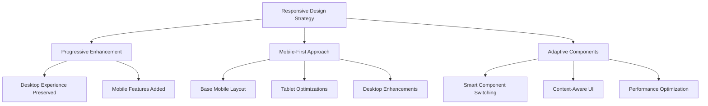
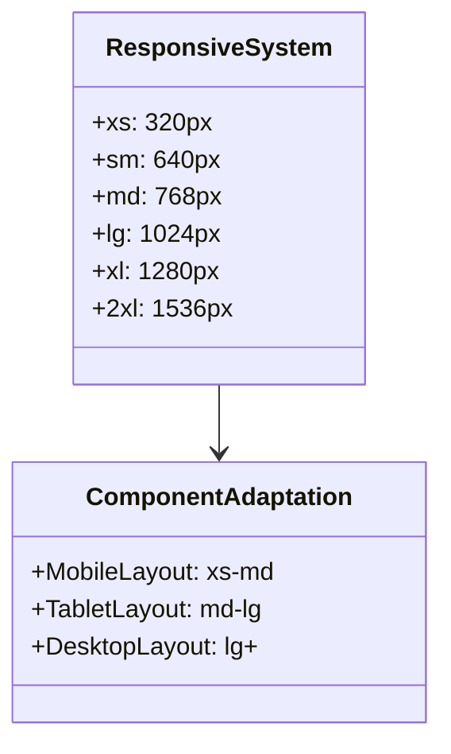
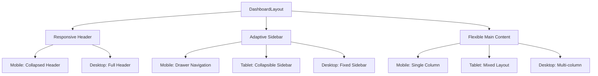
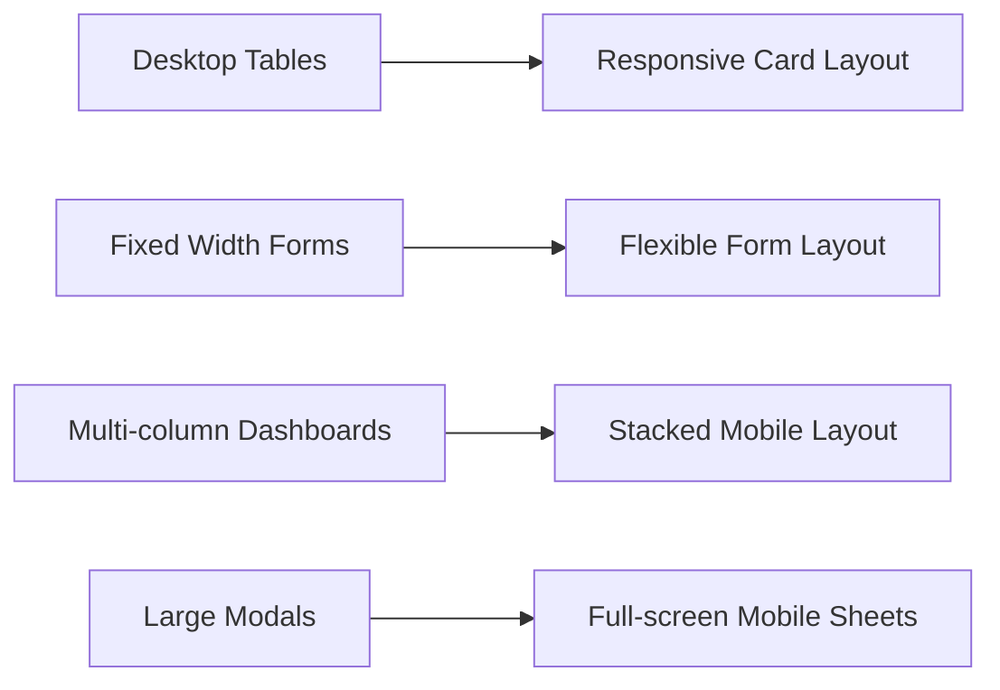
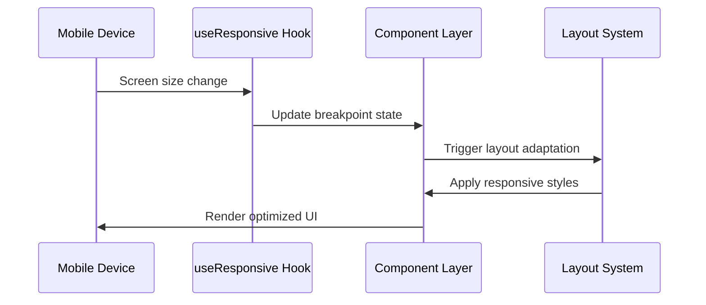
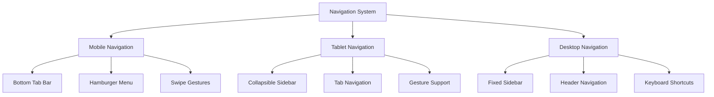
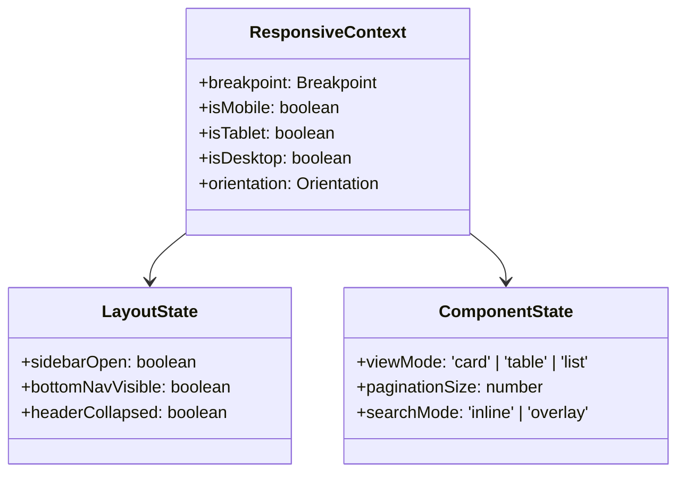
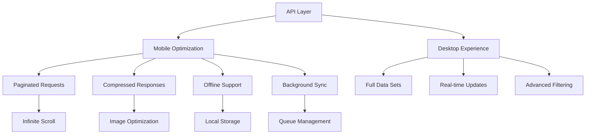
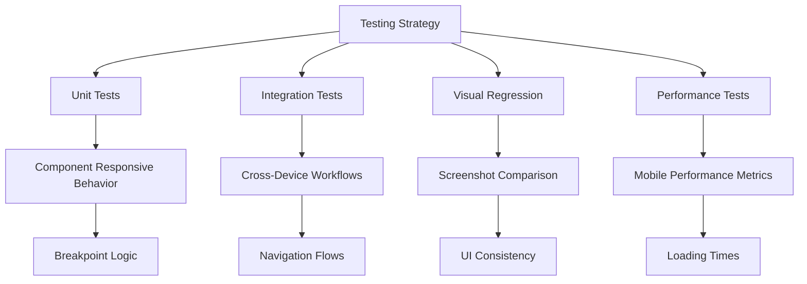

# Fleetify Mobile Responsive Redesign Plan

## Overview

This document outlines a comprehensive plan to transform the Fleetify system into a fully mobile-responsive application without changing the overall design aesthetic or disrupting current services. The plan focuses on progressive enhancement, maintaining the existing UI/UX while ensuring optimal functionality across all device sizes.

## Architecture

### Current System Assessment

The Fleetify system currently uses:
- **Frontend**: React 18 + TypeScript + Tailwind CSS
- **Component Library**: shadcn-ui components
- **Build Tool**: Vite
- **Mobile Framework**: Capacitor for native mobile apps
- **Design System**: Arabic-first RTL design with semantic tokens

### Responsive Architecture Strategy



## Technology Stack & Dependencies

### Enhanced Responsive Infrastructure

| Component | Current | Enhancement |
|-----------|---------|-------------|
| Breakpoint System | Basic (768px mobile) | Advanced 5-tier system |
| Layout Components | Fixed desktop layout | Adaptive grid system |
| Navigation | Sidebar + header | Collapsible mobile nav |
| Data Tables | Fixed width tables | Responsive card layouts |
| Modals/Dialogs | Desktop-sized | Mobile-optimized sheets |
| Form Layouts | Multi-column | Single-column mobile |

### Tailwind CSS Breakpoint Enhancement



## Component Architecture

### Unified Component Enhancement Strategy

#### Layout Components Transformation



#### Navigation Enhancement

| Screen Size | Navigation Pattern | Implementation |
|-------------|-------------------|----------------|
| Mobile (xs-sm) | Bottom Tab Bar + Hamburger Menu | `BottomNavigation` component |
| Tablet (md-lg) | Collapsible Sidebar | Enhanced `AppSidebar` |
| Desktop (lg+) | Fixed Sidebar | Current implementation |

#### Data Display Transformation



### Component Responsive Patterns

#### 1. UnifiedFinancialDashboard Enhancement

- **Mobile**: Vertical card stack with swipe navigation
- **Tablet**: 2-column grid with expandable cards
- **Desktop**: Current multi-column layout preserved

#### 2. EnhancedLegalAIInterface_v2 Adaptation

- **Mobile**: Full-screen chat interface with collapsible history
- **Tablet**: Split-screen chat with sidebar
- **Desktop**: Current three-column layout maintained

#### 3. Enhanced Form Components

- **Mobile**: Single-column with input grouping
- **Tablet**: Two-column with logical field grouping
- **Desktop**: Current multi-column layout preserved

## Data Flow Between Layers

### Responsive State Management



### Context-Aware Rendering

| Context | Mobile Behavior | Desktop Behavior |
|---------|----------------|------------------|
| Data Tables | Card grid with pagination | Full table with sorting |
| Navigation | Bottom tabs + drawer | Fixed sidebar |
| Forms | Stepped form wizard | Multi-column layout |
| Charts | Simplified view | Full detailed charts |
| Search | Full-screen overlay | Inline search bar |

## Routing & Navigation

### Adaptive Navigation Architecture



### Navigation Hierarchy

#### Primary Navigation (Bottom Tabs - Mobile)
- Dashboard (Home)
- Customers (Users)
- Fleet (Car)
- Finance (Dollar)
- More (Menu for additional items)

#### Secondary Navigation (Drawer Menu - Mobile)
- Legal AI
- Contracts
- HR Management
- Reports & Analytics
- Settings
- Admin Functions

### Route Adaptation Strategy

| Route Pattern | Mobile Layout | Tablet Layout | Desktop Layout |
|---------------|---------------|---------------|----------------|
| `/dashboard` | Single-column cards | Grid layout | Multi-column dashboard |
| `/customers` | List + floating action | Split view | Table + sidebar |
| `/fleet` | Card carousel | Grid + filters | Table + detailed view |
| `/finance/*` | Tabbed interface | Split layout | Multi-panel interface |

## State Management

### Responsive State Architecture



### Enhanced Mobile Hooks

```typescript
// useResponsiveBreakpoint Hook Enhancement
interface ResponsiveBreakpoint {
  xs: boolean;    // 320px+
  sm: boolean;    // 640px+
  md: boolean;    // 768px+
  lg: boolean;    // 1024px+
  xl: boolean;    // 1280px+
  xxl: boolean;   // 1536px+
  isMobile: boolean;
  isTablet: boolean;
  isDesktop: boolean;
}

// useAdaptiveLayout Hook
interface AdaptiveLayoutConfig {
  mobileViewMode: 'stack' | 'carousel' | 'grid';
  tabletColumns: 1 | 2 | 3;
  desktopColumns: 2 | 3 | 4;
  enableSwipeGestures: boolean;
  showMobileToolbar: boolean;
}
```

## API Integration Layer

### Mobile-Optimized Data Fetching



### Response Adaptation Strategy

| Data Type | Mobile Response | Desktop Response |
|-----------|----------------|------------------|
| Customer Lists | Paginated (20 items) | Full list with virtual scrolling |
| Financial Data | Summary + drill-down | Complete dashboard |
| Vehicle Data | Essential fields only | All metadata included |
| Reports | Chart images | Interactive charts |

## Testing Strategy

### Multi-Device Testing Framework



### Device Testing Matrix

| Device Category | Screen Sizes | Test Focus |
|----------------|--------------|------------|
| Mobile Phones | 320px - 480px | Touch interaction, single-hand use |
| Large Phones | 480px - 640px | Thumb navigation, content readability |
| Tablets | 640px - 1024px | Split-screen functionality |
| Small Laptops | 1024px - 1280px | Transition behavior |
| Desktop | 1280px+ | Full feature preservation |

### Performance Testing

| Metric | Mobile Target | Desktop Target |
|--------|---------------|----------------|
| First Contentful Paint | < 2s | < 1s |
| Largest Contentful Paint | < 3s | < 2s |
| Bundle Size | < 200KB initial | < 500KB initial |
| JavaScript Execution | < 100ms | < 50ms |
| Touch Response | < 100ms | N/A |

## Implementation Plan

### Phase 1: Foundation Enhancement (Weeks 1-2)

#### Core Infrastructure
1. **Enhanced Breakpoint System**
   - Extend Tailwind config with comprehensive breakpoints
   - Create responsive utility classes
   - Update CSS custom properties for mobile

2. **Responsive Hooks Development**
   - Enhance `useIsMobile` hook with full breakpoint support
   - Create `useResponsiveLayout` hook
   - Implement `useAdaptiveContent` hook

3. **Layout Component Updates**
   - Enhance `DashboardLayout` with responsive behavior
   - Update `AppSidebar` with mobile drawer functionality
   - Create `MobileBottomNavigation` component

### Phase 2: Navigation & Core Components (Weeks 3-4)

#### Navigation Enhancement
1. **Mobile Navigation System**
   - Implement bottom tab navigation
   - Create hamburger menu for secondary navigation
   - Add swipe gesture support

2. **Core Component Adaptation**
   - Update all unified components with responsive behavior
   - Implement mobile-first form layouts
   - Create responsive data display patterns

### Phase 3: Feature Modules Enhancement (Weeks 5-8)

#### Module-by-Module Enhancement

##### Week 5: Finance Module
- `UnifiedFinancialDashboard` mobile adaptation
- Responsive chart components
- Mobile-optimized calculation interfaces

##### Week 6: Fleet Module
- Vehicle list card layout for mobile
- Touch-friendly maintenance interfaces
- Mobile dispatch permit system

##### Week 7: Customer & Contract Modules
- `EnhancedCustomerForm` mobile optimization
- `EnhancedContractForm` responsive layout
- Mobile customer search and selection

##### Week 8: Legal & HR Modules
- `EnhancedLegalAIInterface_v2` mobile chat interface
- HR management mobile workflows
- Responsive reporting interfaces

### Phase 4: Advanced Features & Optimization (Weeks 9-10)

#### Advanced Mobile Features
1. **Touch Interactions**
   - Implement swipe gestures for navigation
   - Add pull-to-refresh functionality
   - Touch-optimized input controls

2. **Performance Optimization**
   - Lazy loading for mobile components
   - Image optimization for different screen densities
   - Code splitting for mobile-specific features

3. **Offline Support**
   - Service worker implementation
   - Offline data caching
   - Background sync capabilities

### Phase 5: Testing & Refinement (Weeks 11-12)

#### Comprehensive Testing
1. **Multi-Device Testing**
   - Cross-browser compatibility testing
   - Device-specific behavior validation
   - Performance benchmarking

2. **User Experience Validation**
   - Accessibility compliance testing
   - Touch interaction validation
   - Navigation flow optimization

## Risk Assessment & Mitigation

### Technical Risks

| Risk | Probability | Impact | Mitigation Strategy |
|------|-------------|---------|-------------------|
| Layout Breaking | Medium | High | Progressive enhancement with fallbacks |
| Performance Degradation | Low | Medium | Performance monitoring and optimization |
| Component Conflicts | Medium | Medium | Thorough testing of unified components |
| Data Loading Issues | Low | High | Incremental data loading strategies |

### Business Continuity

| Concern | Mitigation |
|---------|------------|
| Service Disruption | Progressive rollout with feature flags |
| User Confusion | Gradual UI transition with user guidance |
| Data Integrity | Comprehensive backup and rollback plans |
| Training Requirements | Built-in help system and documentation |

## Success Metrics

### User Experience Metrics

| Metric | Current Baseline | Target Improvement |
|--------|------------------|-------------------|
| Mobile Task Completion Rate | N/A | 95%+ |
| Touch Interaction Success | N/A | 98%+ |
| Mobile Page Load Time | N/A | < 2 seconds |
| User Satisfaction Score | N/A | 4.5/5.0 |

### Technical Performance Metrics

| Metric | Mobile Target | Desktop Baseline |
|--------|---------------|------------------|
| Bundle Size | < 200KB initial | Maintain current |
| Memory Usage | < 100MB | Maintain current |
| Battery Impact | Minimal | N/A |
| Offline Capability | Core features available | Not required |

### Business Impact Metrics

| Metric | Target |
|--------|--------|
| Mobile User Adoption | 60% of users accessing via mobile |
| Feature Usage Parity | 90% of desktop features accessible on mobile |
| Support Ticket Reduction | 30% fewer mobile-related issues |
| User Retention | 15% improvement in mobile user retention |

## Maintenance & Evolution

### Ongoing Responsibilities

#### Development Team
- Regular responsive testing across devices
- Performance monitoring and optimization
- Accessibility compliance maintenance
- New feature mobile-first development

#### Design System Evolution
- Quarterly review of mobile patterns
- User feedback integration
- Emerging mobile technology adoption
- Continuous accessibility improvements

### Future Enhancements

#### Short-term (3-6 months)
- Voice command integration for mobile
- Advanced gesture controls
- Improved offline capabilities
- Mobile-specific shortcuts

#### Long-term (6-12 months)
- PWA (Progressive Web App) features
- Mobile-specific AI interactions
- Advanced mobile analytics
- Cross-device synchronization