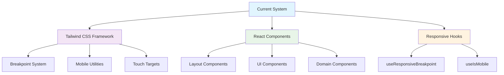
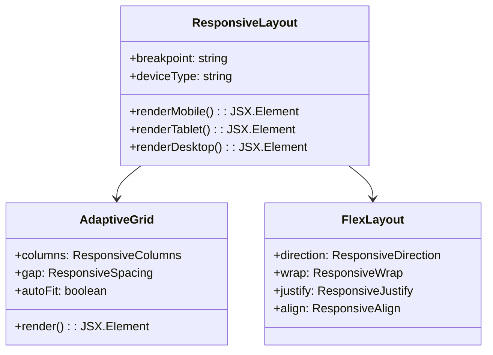
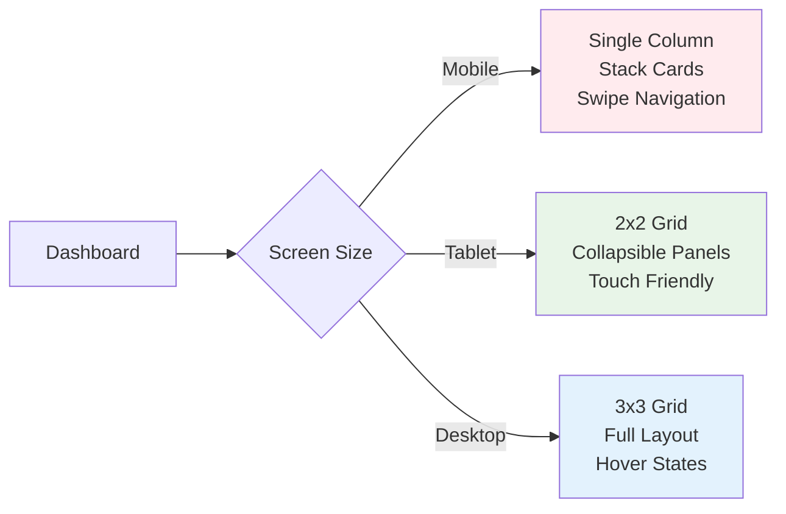
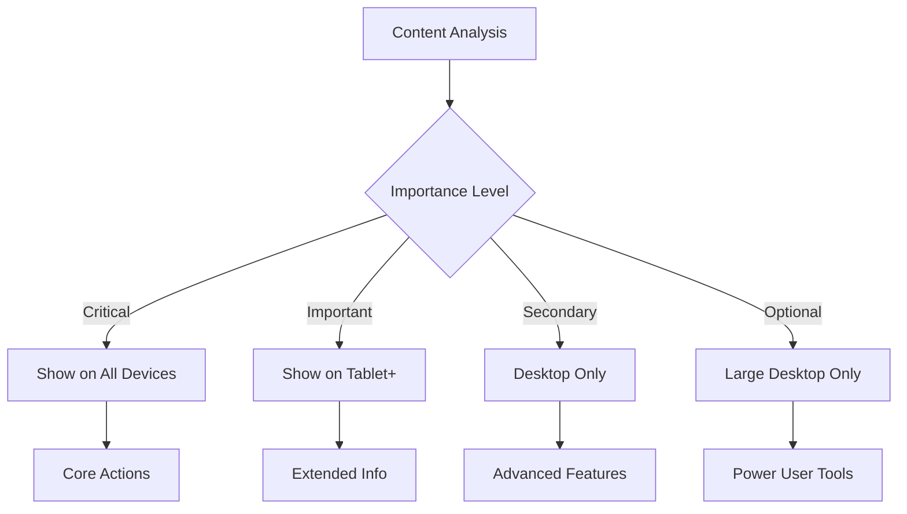

# Responsive Design Migration Plan for FleetifyApp

## Overview

This document outlines a comprehensive strategy for migrating FleetifyApp to a fully responsive design system while maintaining the existing design integrity and ensuring zero service disruption. The migration will be implemented in phases, leveraging the existing Tailwind CSS framework and enhancing the current responsive capabilities.

## Current System Analysis

### Technology Stack Assessment
- **Frontend**: React 18 with TypeScript
- **Styling**: Tailwind CSS with shadcn-ui components
- **Build Tool**: Vite
- **State Management**: React Context (AuthContext, CompanyContext)
- **Backend**: Supabase with Edge Functions
- **Mobile Support**: Capacitor for native app packaging

### Existing Responsive Infrastructure
The system already has a solid foundation with:
- Comprehensive breakpoint system (xs: 320px to 2xl: 1536px)
- Mobile-specific breakpoints (mobile-sm: 375px, mobile-md: 414px, mobile-lg: 428px)
- Responsive hooks (`useResponsiveBreakpoint`, `useIsMobile`)
- Touch-friendly sizing (minimum 44px touch targets)
- CSS custom properties for theming
- Arabic typography support with RTL layout



## Migration Strategy

### Phase 1: Foundation Enhancement (Weeks 1-2)

#### 1.1 Enhanced Responsive Hook System
Extend the existing `useResponsiveBreakpoint` hook with additional capabilities:

```tsx
interface EnhancedResponsiveHook {
  // Existing properties
  isMobile: boolean
  isTablet: boolean 
  isDesktop: boolean
  
  // New capabilities
  deviceType: 'mobile' | 'tablet' | 'desktop'
  touchDevice: boolean
  reducedMotion: boolean
  orientation: 'portrait' | 'landscape'
  safeAreaSupport: boolean
  viewportHeight: number
  availableHeight: number
}
```

#### 1.2 Component Responsive Architecture
Create a component classification system:

| Component Type | Mobile Strategy | Tablet Strategy | Desktop Strategy |
|---------------|----------------|-----------------|------------------|
| Navigation | Bottom tabs + hamburger | Sidebar collapse | Full sidebar |
| Data Tables | Cards/List view | Horizontal scroll | Full table |
| Forms | Stack vertically | Two columns | Multi-column |
| Dashboards | Single column | Grid 2x2 | Grid 3x3 |
| Modals | Full screen | Standard size | Large modals |

### Phase 2: Layout System Overhaul (Weeks 3-4)

#### 2.1 Responsive Layout Components

Create adaptive layout wrappers:



#### 2.2 Navigation System Enhancement

| Screen Size | Navigation Pattern | Implementation |
|-------------|-------------------|----------------|
| Mobile (< 768px) | Bottom navigation + slide-out drawer | Full-screen overlay |
| Tablet (768px - 1024px) | Collapsible sidebar | Icon + label collapse |
| Desktop (> 1024px) | Fixed sidebar | Full sidebar with sections |

### Phase 3: Component Responsiveness (Weeks 5-8)

#### 3.1 Core Component Adaptations

**Dashboard Components:**


**Data Tables:**
- Mobile: Transform to card-based list with expandable details
- Tablet: Horizontal scrolling with sticky columns
- Desktop: Full table with all columns visible

**Forms:**
- Mobile: Single column, large inputs, native controls
- Tablet: Two-column layout where appropriate
- Desktop: Multi-column with optimized spacing

#### 3.2 Business Module Adaptations

| Module | Mobile Approach | Tablet Approach | Desktop Approach |
|--------|----------------|-----------------|------------------|
| Fleet Management | List view with quick actions | Grid + detail panel | Table + sidebar details |
| Financial Operations | Card summaries | Dashboard tiles | Full analytics view |
| Contract Management | Timeline view | Split view | Multi-panel layout |
| Legal AI System | Chat interface | Side-by-side | Full workspace |
| HR Management | Profile cards | Grid layout | Table + forms |

### Phase 4: Advanced Responsive Features (Weeks 9-10)

#### 4.1 Adaptive Content Strategy

**Content Prioritization:**


#### 4.2 Performance Optimization

**Image and Asset Management:**
- Mobile: WebP format, lazy loading, smaller dimensions
- Tablet: Medium resolution, optimized compression
- Desktop: Full resolution with progressive loading

**Code Splitting by Device:**
- Mobile-specific components bundle
- Desktop-only features lazy loaded
- Shared components optimized for all devices

### Phase 5: Testing and Quality Assurance (Weeks 11-12)

#### 5.1 Device Testing Matrix

| Device Category | Test Devices | Viewports | Orientations |
|----------------|-------------|-----------|--------------|
| Mobile Phones | iPhone SE, iPhone 14, Samsung Galaxy S23 | 320px - 428px | Portrait, Landscape |
| Tablets | iPad Mini, iPad Pro, Surface Pro | 768px - 1024px | Portrait, Landscape |
| Desktops | MacBook, Windows Laptop, Large Monitor | 1280px - 2560px | Landscape only |

#### 5.2 Testing Checklist

**Functional Testing:**
- [ ] Navigation works on all breakpoints
- [ ] Forms submit correctly on all devices
- [ ] Data tables are accessible and usable
- [ ] Touch interactions are responsive
- [ ] Keyboard navigation functions properly

**Visual Testing:**
- [ ] Text remains readable at all sizes
- [ ] Images scale appropriately
- [ ] Layouts don't break at breakpoint boundaries
- [ ] Spacing and alignment are consistent
- [ ] Colors and contrast meet accessibility standards

**Performance Testing:**
- [ ] Page load times under 3 seconds on mobile
- [ ] Smooth animations and transitions
- [ ] No layout shifts during load
- [ ] Efficient image loading and display

## Implementation Methodology

### Zero-Downtime Migration Strategy

#### Progressive Enhancement Approach
1. **Feature Flags**: Use environment variables to control responsive features
2. **Component Variants**: Create responsive versions alongside existing components
3. **Gradual Rollout**: Enable responsive features module by module
4. **A/B Testing**: Compare performance between old and new layouts

#### Rollback Strategy
- Maintain original components as fallbacks
- Version control for easy rollback
- Monitor performance metrics continuously
- Quick disable switches for problematic features

### Development Workflow

#### Component Development Process
1. **Analysis**: Assess current component behavior
2. **Design**: Create responsive wireframes and mockups
3. **Development**: Implement using existing design system
4. **Testing**: Verify across all target devices
5. **Integration**: Merge with feature flags enabled
6. **Monitoring**: Track performance and user feedback

#### Code Organization
```
src/
├── components/
│   ├── responsive/           # New responsive components
│   │   ├── layouts/
│   │   ├── navigation/
│   │   └── common/
│   ├── adaptive/            # Enhanced existing components
│   └── legacy/              # Original components (fallback)
├── hooks/
│   ├── useResponsive.ts     # Enhanced responsive hook
│   └── useAdaptiveLayout.ts # Layout management
└── utils/
    ├── responsive.ts        # Utility functions
    └── breakpoints.ts       # Breakpoint helpers
```

## Quality Assurance Framework

### Automated Testing
- **Unit Tests**: Responsive hook behavior
- **Integration Tests**: Component rendering across breakpoints
- **Visual Regression Tests**: Screenshot comparison
- **Performance Tests**: Bundle size and load time monitoring

### Manual Testing Protocol
- **Cross-browser Testing**: Chrome, Firefox, Safari, Edge
- **Device Testing**: Physical devices and emulators
- **Accessibility Testing**: Screen readers and keyboard navigation
- **User Experience Testing**: Task completion across devices

### Monitoring and Analytics
- **Performance Metrics**: Core Web Vitals tracking
- **User Behavior**: Interaction patterns by device type
- **Error Tracking**: Device-specific issues monitoring
- **Conversion Metrics**: Business impact measurement

## Risk Mitigation

### Technical Risks
| Risk | Impact | Probability | Mitigation Strategy |
|------|--------|-------------|-------------------|
| Layout Breaking | High | Medium | Comprehensive testing, feature flags |
| Performance Degradation | Medium | Low | Performance monitoring, optimization |
| Browser Compatibility | Medium | Medium | Progressive enhancement, polyfills |
| User Confusion | High | Low | Gradual rollout, user training |

### Business Continuity
- **Service Availability**: 99.9% uptime maintained during migration
- **Data Integrity**: No data loss or corruption
- **User Experience**: Minimal learning curve for existing users
- **Feature Parity**: All existing functionality preserved

## Success Metrics

### Technical Metrics
- **Performance**: 30% improvement in mobile load times
- **Usability**: 95% task completion rate across all devices
- **Accessibility**: WCAG 2.1 AA compliance
- **Code Quality**: 90% test coverage for responsive components

### Business Metrics
- **User Engagement**: 25% increase in mobile usage
- **Customer Satisfaction**: 4.5+ star rating maintenance
- **Support Tickets**: 50% reduction in UI-related issues
- **Conversion Rates**: Maintained or improved across all devices

## Maintenance and Evolution

### Ongoing Responsibilities
- **Design System Updates**: Regular component library updates
- **Browser Support**: Continuous compatibility monitoring
- **Performance Optimization**: Regular performance audits
- **User Feedback Integration**: Continuous improvement based on usage data

### Future Enhancements
- **Advanced Interactions**: Gesture support, voice commands
- **Accessibility Features**: Enhanced screen reader support
- **Performance**: Progressive Web App capabilities
- **Device-Specific Features**: Camera integration, offline support

This comprehensive responsive design migration plan ensures FleetifyApp evolves into a fully responsive application while maintaining service quality and user satisfaction across all devices and screen sizes.