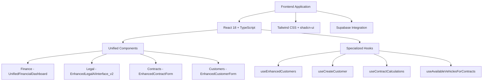
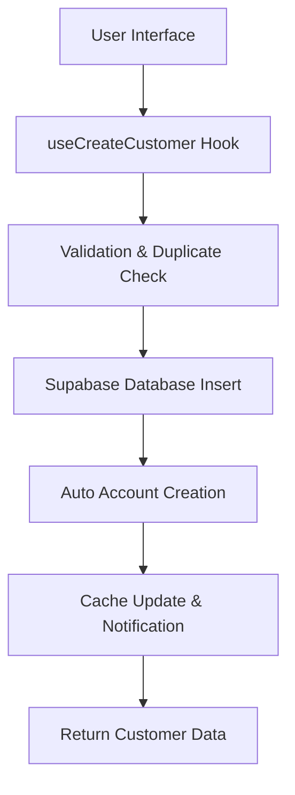

# System Audit and Refactoring Plan

## 1. Overview

This document outlines the findings from a comprehensive audit of the Fleetify application, focusing on identifying code duplication, integration issues, and opportunities for system improvement. The audit specifically examines customer creation workflows across different modules to ensure consistency and eliminate redundant implementations.

## 2. Architecture Review

### 2.1 Current System Structure

The Fleetify application follows a unified component architecture with the following key components:



### 2.2 Identified Issues

1. **Code Duplication in Customer Creation**: Multiple implementations of customer creation logic exist across different modules
2. **Inconsistent Data Flow**: Different modules use different hooks and approaches for the same functionality
3. **Lack of Centralized Customer Management**: Customer creation is handled differently in contracts vs. customer management modules

## 3. Code Duplication Analysis

### 3.1 Customer Creation Functions

After analyzing the codebase, several implementations of customer creation were identified:

1. **Primary Implementation**: `useCreateCustomer` in `src/hooks/useEnhancedCustomers.ts` (Enhanced implementation with duplicate checking and auto-account creation)
2. **Legacy Implementation**: `useCreateCustomer` in `src/hooks/useCustomers.ts` (Simpler implementation without advanced features)
3. **Contract Module Implementation**: Direct Supabase calls in `src/hooks/useContractCSVUpload.ts` (Minimal implementation for CSV imports)
4. **Executive AI Implementation**: Direct Supabase calls in `src/hooks/useExecutiveAISystem.ts` (Simplified implementation for AI operations)

### 3.2 Integration Issues

1. **Contracts Module**: Uses `CustomerSelector` component which opens `CreateCustomerDialog`, but this bypasses some validation logic
2. **CSV Upload Module**: Implements its own customer creation logic without using the unified hooks
3. **Executive AI Module**: Creates customers directly without proper validation or duplicate checking

## 4. Refactoring Plan

### 4.1 Phase 1: Unify Customer Creation Logic

#### 4.1.1 Problem Statement
Multiple implementations of customer creation exist with varying levels of functionality and validation.

#### 4.1.2 Solution
Consolidate all customer creation logic into the `useEnhancedCustomers.ts` hook which provides the most comprehensive implementation.

#### 4.1.3 Implementation Steps

1. **Update Contract CSV Upload Module**:
   ```typescript
   // Before: Direct Supabase calls in useContractCSVUpload.ts
   const { data: newCustomer, error: createError } = await supabase
     .from('customers')
     .insert([customerData])
     .select('id')
     .single();
   
   // After: Use useCreateCustomer hook
   const createCustomer = useCreateCustomer();
   const result = await createCustomer.mutateAsync(customerData);
   ```

2. **Update Executive AI System**:
   ```typescript
   // Before: Direct Supabase calls in useExecutiveAISystem.ts
   const { data: newCustomer, error: customerError } = await supabase
     .from('customers')
     .insert({
       company_id: companyId,
       first_name: params.customerName,
       last_name: '',
       phone: '0000000000',
       customer_type: 'individual',
       created_by: userId
     })
     .select()
     .single();
   
   // After: Use useCreateCustomer hook with proper data preparation
   const createCustomer = useCreateCustomer();
   const customerData = {
     company_id: companyId,
     first_name: firstName,
     last_name: lastName,
     phone: params.phone || '0000000000',
     customer_type: params.customerType || 'individual',
     created_by: userId
   };
   const result = await createCustomer.mutateAsync(customerData);
   ```

3. **Remove Legacy Hook**:
   - Deprecate `useCreateCustomer` in `src/hooks/useCustomers.ts`
   - Update all references to use `useCreateCustomer` from `src/hooks/useEnhancedCustomers.ts`

### 4.2 Phase 2: Standardize Data Flow

#### 4.2.1 Problem Statement
Different modules use different approaches to fetch and manipulate customer data, leading to inconsistencies.

#### 4.2.2 Solution
Implement a unified data flow pattern using React Query hooks for all customer-related operations.

#### 4.2.3 Implementation Steps

1. **Standardize Customer Fetching**:
   ```typescript
   // Use a single hook for all customer data fetching
   import { useCustomers } from '@/hooks/useEnhancedCustomers';
   
   const { data: customers, isLoading, error } = useCustomers(filters);
   ```

2. **Centralize Customer Updates**:
   ```typescript
   // Use the unified update hook
   import { useUpdateCustomer } from '@/hooks/useEnhancedCustomers';
   
   const updateCustomer = useUpdateCustomer();
   await updateCustomer.mutateAsync({ customerId, data });
   ```

### 4.3 Phase 3: Improve Integration Points

#### 4.3.1 Problem Statement
Integration between modules is inconsistent, with some modules bypassing established patterns.

#### 4.3.2 Solution
Ensure all modules use the same integration patterns and respect module boundaries.

#### 4.3.3 Implementation Steps

1. **Update Contract Module Customer Selector**:
   - Ensure `CustomerSelector` component properly integrates with the unified customer management system
   - Add proper error handling and validation

2. **Enhance Error Handling**:
   - Implement consistent error handling across all modules
   - Add proper logging for debugging purposes

## 5. Data Models and Integration

### 5.1 Customer Model Consistency

All customer creation should follow the same data model:

```typescript
interface CustomerFormData {
  company_id: string;
  customer_type: 'individual' | 'corporate';
  first_name?: string;
  last_name?: string;
  company_name?: string;
  national_id?: string;
  passport_number?: string;
  license_number?: string;
  phone: string;
  email?: string;
  date_of_birth?: Date;
  national_id_expiry?: Date;
  license_expiry?: Date;
  credit_limit?: number;
  is_active: boolean;
  is_blacklisted?: boolean;
}
```

### 5.2 Integration Flow



## 6. Business Logic Layer

### 6.1 Customer Creation Workflow

The unified customer creation workflow should include:

1. **Data Validation**:
   - Required field validation
   - Format validation (phone, email, dates)
   - Business rule validation (document expiry dates)

2. **Duplicate Detection**:
   - Check for existing customers with same identifiers
   - Provide user options to proceed or cancel

3. **Account Creation**:
   - Automatic creation of accounting records
   - Linking to appropriate chart of accounts

4. **Cache Management**:
   - Update local cache immediately
   - Invalidate relevant queries

### 6.2 Error Handling

All customer creation operations should implement consistent error handling:

```typescript
try {
  const result = await createCustomer.mutateAsync(data);
  // Success handling
} catch (error) {
  // Error handling based on error type
  if (error.message.includes('duplicate')) {
    // Handle duplicate customer
  } else if (error.message.includes('validation')) {
    // Handle validation errors
  } else {
    // Handle other errors
  }
}
```

## 7. Testing Strategy

### 7.1 Unit Tests

1. **Customer Creation Hook Tests**:
   - Test successful creation scenarios
   - Test duplicate detection
   - Test validation errors
   - Test account auto-creation

2. **Integration Tests**:
   - Test end-to-end customer creation flow
   - Test integration with contract creation
   - Test CSV import functionality

### 7.2 Test Scenarios

1. **Basic Customer Creation**:
   - Create individual customer
   - Create corporate customer
   - Validate required fields

2. **Duplicate Handling**:
   - Detect duplicate customers
   - Allow forced creation
   - Show appropriate warnings

3. **Account Creation**:
   - Auto-create accounts
   - Handle account creation failures
   - Validate account linking

## 8. Migration Plan

### 8.1 Phase 1: Preparation (Week 1)
- Audit all current implementations
- Create migration scripts
- Set up testing environment

### 8.2 Phase 2: Implementation (Week 2-3)
- Refactor contract CSV upload module
- Refactor executive AI system
- Remove legacy hooks
- Update integration points

### 8.3 Phase 3: Testing (Week 4)
- Unit testing
- Integration testing
- User acceptance testing

### 8.4 Phase 4: Deployment (Week 5)
- Deploy to staging environment
- Monitor for issues
- Deploy to production

## 9. Risk Mitigation

### 9.1 Potential Risks

1. **Data Inconsistency**: Risk of data inconsistency during migration
   - Mitigation: Implement thorough testing and rollback procedures

2. **Performance Impact**: Unified hooks might impact performance
   - Mitigation: Optimize queries and implement proper caching

3. **User Experience**: Changes might affect user experience
   - Mitigation: Maintain consistent UI patterns and provide user training

### 9.2 Monitoring Plan

1. **Error Tracking**: Monitor for new errors after deployment
2. **Performance Monitoring**: Track response times and database queries
3. **User Feedback**: Collect user feedback on the new implementation

## 10. Conclusion

This refactoring plan addresses the identified code duplication and integration issues in the Fleetify application. By unifying the customer creation logic and standardizing data flows, we can improve maintainability, reduce bugs, and ensure consistent behavior across all modules. The implementation should follow the phased approach to minimize risk and ensure a smooth transition.