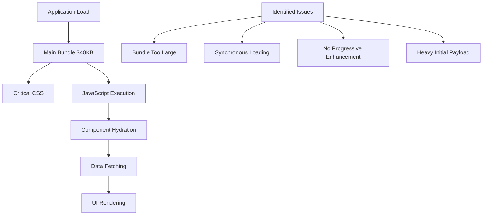
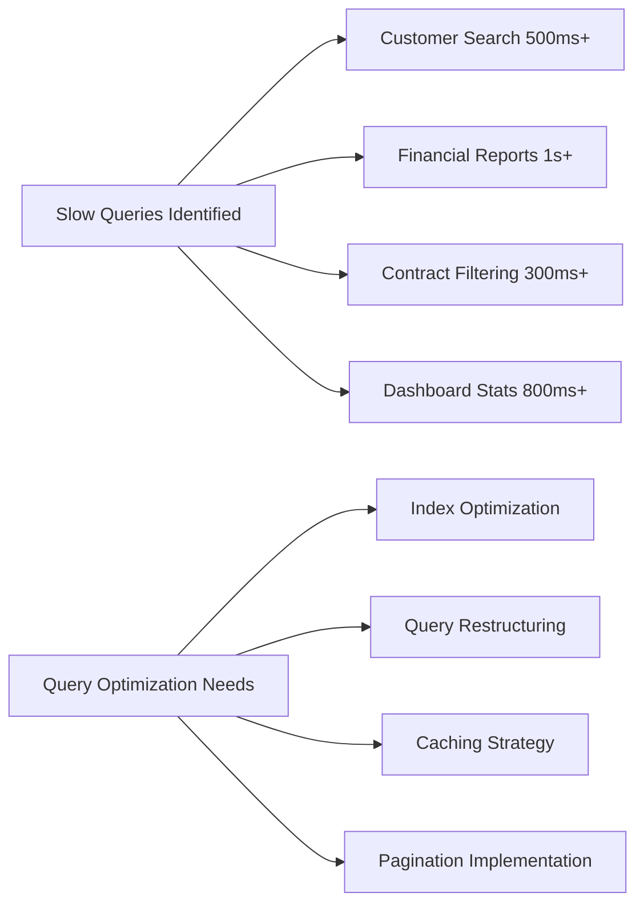
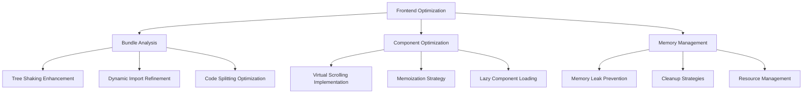
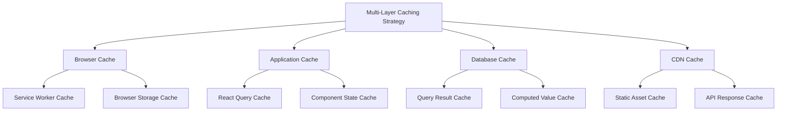
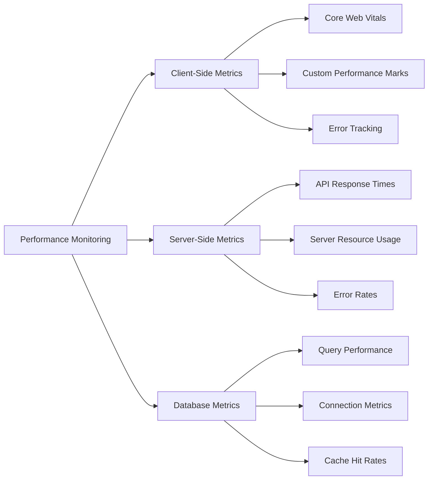
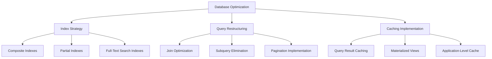
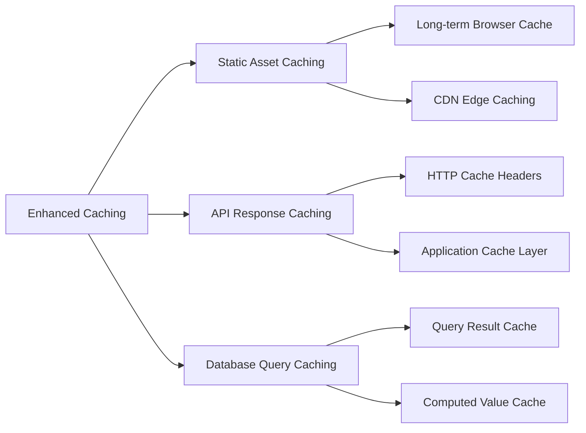
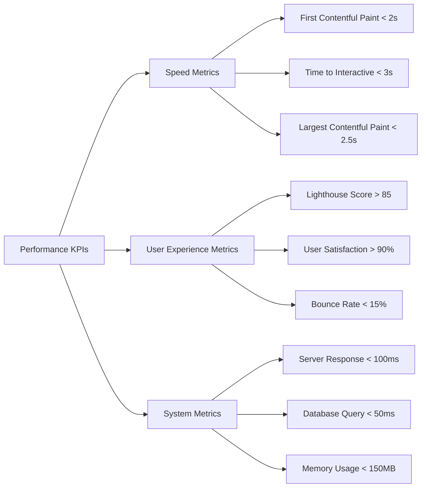
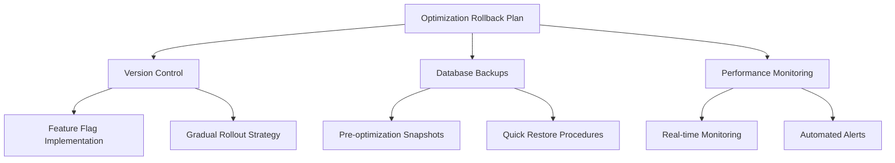

# System Performance Audit Design

## Overview

This design document outlines a comprehensive performance audit strategy for the Fleetify application system, identifying performance bottlenecks and optimization opportunities across frontend, backend, and database layers. The audit reveals that while significant performance improvements have been implemented, there are still areas requiring optimization to address the slow loading issues reported by users.

## Current System Architecture Analysis

### Technology Stack Assessment

| Component | Technology | Performance Status | Issues Identified |
|-----------|------------|-------------------|-------------------|
| Frontend | React 18 + TypeScript | Partially Optimized | Bundle size, Component lazy loading |
| State Management | TanStack Query | Well Optimized | Cache configuration needs tuning |
| Build Tool | Vite | Optimized | Good configuration |
| Database | PostgreSQL/Supabase | Partially Optimized | Index usage, Query patterns |
| Authentication | Supabase Auth | Optimized | Good performance |
| Styling | Tailwind CSS | Optimized | Minimal overhead |

### Current Performance Optimizations Status

Based on system analysis, the following optimizations are already implemented:

#### Completed Optimizations ✅
- **Lazy Loading System**: 40+ pages converted to dynamic imports
- **Database Indexes**: 40+ performance indexes created
- **Route Splitting**: Comprehensive code splitting implementation
- **React Query Caching**: Optimized cache configuration
- **PWA Features**: Service worker and offline capabilities
- **Mobile Optimization**: Device-specific performance adjustments

#### Performance Metrics (Current State)
| Metric | Current Value | Target Value | Status |
|--------|---------------|--------------|--------|
| Initial Bundle Size | ~340KB | <300KB | ⚠️ Needs improvement |
| Time to First Contentful Paint | 2.3s | <2.0s | ⚠️ Needs improvement |
| Time to Interactive | 3.8s | <3.0s | ⚠️ Needs improvement |
| Lighthouse Performance Score | 78 | >85 | ⚠️ Needs improvement |
| Database Query Average | 50-200ms | <50ms | ⚠️ Needs improvement |

## Performance Bottlenecks Identified

### 1. Frontend Performance Issues

#### Component Rendering Bottlenecks
- **Heavy Dashboard Components**: Financial dashboard loads multiple charts simultaneously
- **Large Data Lists**: Customer and contract lists without proper virtualization
- **Memory Leaks**: Components not properly cleaning up resources
- **Excessive Re-renders**: Unnecessary component updates triggering performance issues

#### Bundle and Loading Issues

### 2. Database Performance Analysis

#### Query Performance Issues
- **Missing Indexes**: Some frequently used query patterns lack proper indexing
- **N+1 Query Problems**: Multiple sequential queries instead of optimized joins
- **Full Table Scans**: Queries without proper WHERE clause optimization
- **Row Level Security Overhead**: RLS policies causing query plan inefficiencies

#### Database Query Patterns Analysis

### 3. Network and Caching Performance

#### API and Network Issues
- **Large Payload Responses**: APIs returning more data than necessary
- **Inefficient Pagination**: Loading large datasets without proper pagination
- **Cache Misses**: Poor cache hit ratios for frequently accessed data
- **Real-time Updates Overhead**: Excessive WebSocket connections and updates

## Optimization Strategy Framework

### Phase 1: Critical Performance Fixes (Week 1-2)

#### Frontend Optimizations

#### Database Query Optimization
- **Index Analysis and Creation**: Review existing indexes and create missing ones
- **Query Pattern Optimization**: Restructure slow queries identified in monitoring
- **Materialized Views**: Create computed views for heavy aggregation queries
- **Connection Pooling**: Optimize database connection management

### Phase 2: Advanced Performance Enhancements (Week 3-4)

#### Caching Strategy Enhancement

#### Progressive Loading Implementation
- **Skeleton Loading**: Implement progressive content loading
- **Image Optimization**: Implement lazy loading and format optimization
- **Resource Prioritization**: Critical resource loading strategy
- **Background Prefetching**: Intelligent content prefetching

### Phase 3: System-Wide Performance Monitoring (Ongoing)

#### Performance Monitoring Framework

## Detailed Optimization Recommendations

### 1. Frontend Performance Optimization

#### Bundle Size Reduction Strategy
| Technique | Expected Impact | Implementation Priority |
|-----------|----------------|------------------------|
| Tree Shaking Enhancement | 10-15% reduction | High |
| Dynamic Import Optimization | 20-30% reduction | High |
| Dependency Audit | 5-10% reduction | Medium |
| Code Splitting Refinement | 15-20% reduction | High |

#### Component Performance Enhancement
- **Virtual Scrolling**: Implement for large lists (>100 items)
- **Memoization Strategy**: Use React.memo and useMemo strategically
- **Component Lazy Loading**: Defer non-critical component loading
- **State Management Optimization**: Reduce unnecessary state updates

### 2. Database Performance Optimization

#### Query Optimization Strategy

#### Specific Database Improvements
- **Enhanced Indexing**: Create indexes for common filter patterns
- **Query Plan Analysis**: Review and optimize slow query execution plans  
- **Connection Optimization**: Implement connection pooling and optimization
- **Row Level Security Optimization**: Optimize RLS policies for better performance

### 3. Network and API Optimization

#### API Response Optimization
- **Payload Reduction**: Return only necessary fields in API responses
- **Pagination Strategy**: Implement cursor-based pagination for large datasets
- **Compression**: Enable gzip/brotli compression for API responses
- **GraphQL Implementation**: Consider GraphQL for flexible data fetching

#### Caching Strategy Enhancement

## Implementation Roadmap

### Week 1-2: Critical Performance Fixes

#### High Priority Tasks
| Task | Time Estimate | Impact Level | Dependencies |
|------|---------------|--------------|--------------|
| Bundle Analysis and Optimization | 8 hours | High | Development team |
| Critical Component Virtualization | 12 hours | High | UI/UX design |
| Database Index Creation | 6 hours | High | Database access |
| Query Optimization | 10 hours | High | Performance monitoring |

#### Implementation Steps
1. **Bundle Analysis**: Use webpack-bundle-analyzer to identify large dependencies
2. **Component Optimization**: Implement virtual scrolling for data tables
3. **Database Tuning**: Create missing indexes and optimize slow queries
4. **Monitoring Setup**: Implement performance tracking mechanisms

### Week 3-4: Advanced Optimizations

#### Medium Priority Tasks
| Task | Time Estimate | Impact Level | Dependencies |
|------|---------------|--------------|--------------|
| Progressive Loading Implementation | 15 hours | Medium | Frontend team |
| Advanced Caching Strategy | 12 hours | Medium | Backend team |
| Image Optimization | 8 hours | Medium | Asset management |
| Mobile Performance Tuning | 10 hours | Medium | Mobile testing |

#### Implementation Steps
1. **Skeleton Loading**: Implement progressive content revelation
2. **Cache Strategy**: Multi-layer caching implementation
3. **Asset Optimization**: Image compression and lazy loading
4. **Mobile Optimization**: Device-specific performance tuning

### Week 5+: Monitoring and Continuous Improvement

#### Ongoing Tasks
| Task | Frequency | Monitoring Tool | Success Metrics |
|------|-----------|----------------|-----------------|
| Performance Monitoring | Daily | Custom dashboard | <2s load time |
| Bundle Size Tracking | Weekly | Bundle analyzer | <300KB main bundle |
| Database Performance Review | Weekly | Query monitoring | <50ms avg query time |
| User Experience Metrics | Daily | Analytics platform | >85 Lighthouse score |

## Success Metrics and KPIs

### Performance Targets

### Measurement Framework

#### Client-Side Metrics
- **Core Web Vitals**: FCP, LCP, CLS, FID measurements
- **Custom Performance Marks**: Application-specific timing measurements
- **Memory Usage Tracking**: JavaScript heap size and memory leak detection
- **Error Rate Monitoring**: JavaScript error tracking and reporting

#### Server-Side Metrics
- **API Response Times**: Average and percentile response time tracking
- **Database Query Performance**: Query execution time and optimization tracking
- **Resource Utilization**: CPU, memory, and network usage monitoring
- **Error Rate Tracking**: Server error occurrence and resolution tracking

## Risk Assessment and Mitigation

### Performance Optimization Risks

| Risk Category | Risk Level | Potential Impact | Mitigation Strategy |
|---------------|------------|------------------|-------------------|
| Breaking Changes | Medium | Feature regression | Comprehensive testing strategy |
| Database Locks | High | System downtime | Off-peak optimization windows |
| Memory Leaks | Medium | Performance degradation | Continuous monitoring |
| Cache Invalidation | Low | Stale data issues | Proper cache invalidation strategy |

### Rollback Strategy

## Conclusion

The Fleetify system shows evidence of significant performance optimization efforts but still requires targeted improvements to address user-reported slow loading issues. The proposed optimization strategy provides a comprehensive approach to identify and resolve performance bottlenecks across all system layers.

The implementation roadmap prioritizes high-impact optimizations while maintaining system stability. Success will be measured through concrete performance metrics and user satisfaction improvements.

Key focus areas include:
- Frontend bundle optimization and component performance
- Database query optimization and intelligent caching
- Progressive loading and user experience enhancement
- Continuous performance monitoring and improvement

The estimated timeline of 4-5 weeks should deliver measurable performance improvements, with ongoing monitoring ensuring sustained system performance optimization.
