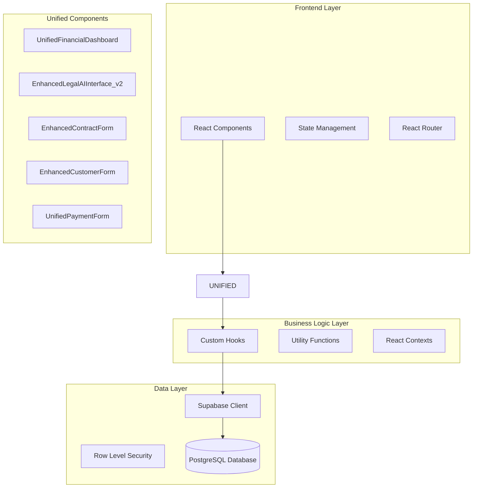
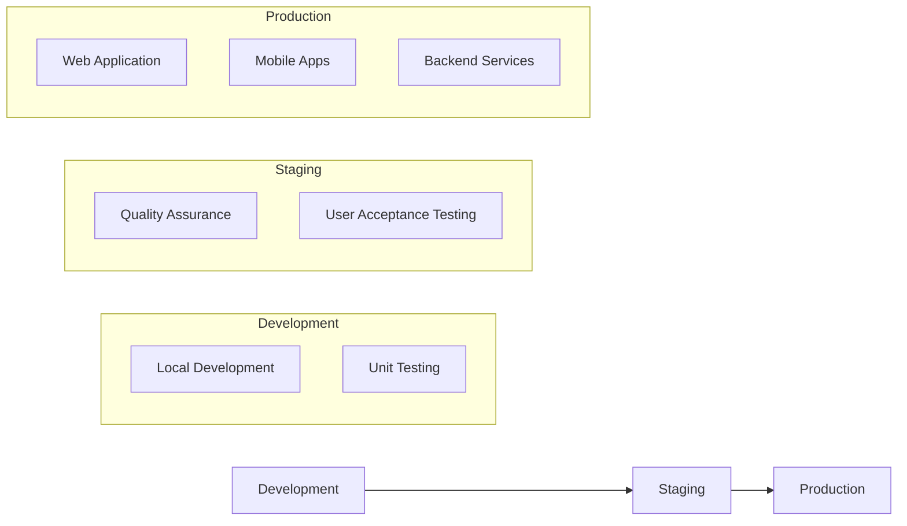
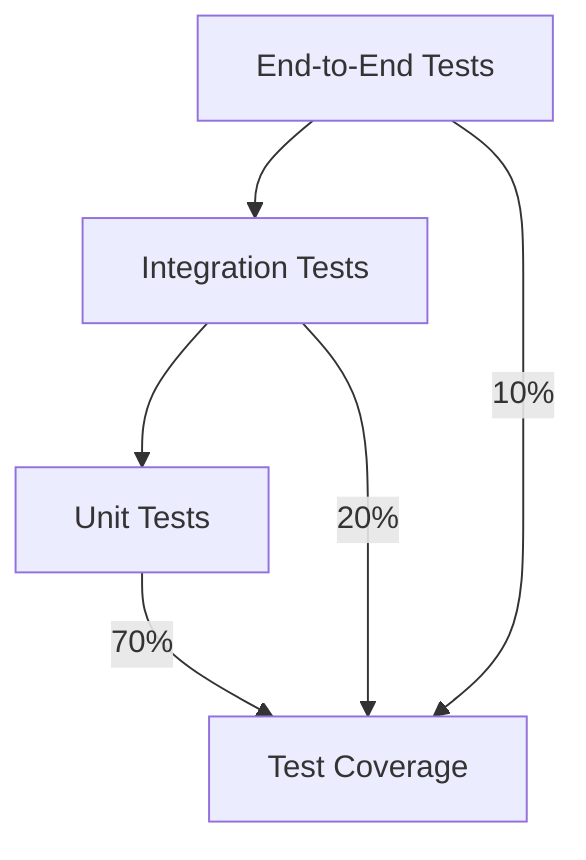

# Fleetify System - Comprehensive Architecture and Design Review

## Overview

Fleetify is a comprehensive fleet and enterprise management system designed specifically for rental companies, limousine services, and real estate management in the Gulf region. The system is built with modern web technologies and follows a unified, modular architecture that has been optimized for performance, scalability, and maintainability.

### System Identity
- **Name**: Fleetify
- **Version**: 3.0+ (Unified System)
- **Target Market**: Gulf region (Kuwait, Saudi Arabia, Qatar)
- **Primary Users**: Fleet management companies, car rental services, real estate agencies
- **Technology Stack**: React 18 + TypeScript + Tailwind CSS + Supabase
- **Architecture**: Unified modular system (100% unified - no duplicate components)

## Technology Stack & Dependencies

### Frontend Technologies
| Technology | Version | Purpose |
|------------|---------|---------|
| React | 18.3.1 | Core UI framework |
| TypeScript | 5.9.2 | Type safety and development experience |
| Vite | 7.1.5 | Build tool and development server |
| Tailwind CSS | 3.4.15 | Styling framework |
| Radix UI | Various | Component primitives |
| React Query | 5.87.4 | Server state management |
| React Router | 6.26.2 | Client-side routing |
| Framer Motion | 12.23.12 | Animations |

### Backend & Database
| Component | Technology | Purpose |
|-----------|------------|---------|
| Database | Supabase PostgreSQL | Primary data storage |
| Authentication | Supabase Auth | User authentication & authorization |
| Storage | Supabase Storage | File and document storage |
| Real-time | Supabase Realtime | Live data synchronization |
| API | Supabase REST/GraphQL | Backend API layer |

### Mobile Development
| Technology | Version | Purpose |
|------------|---------|---------|
| Capacitor | 6.1.2 | Native mobile wrapper |
| Android SDK | Latest | Android app development |
| iOS SDK | Latest | iOS app development |

## Architecture Overview

### System Architecture Patterns

The Fleetify system follows a **Unified Component Architecture** where each major subsystem has been consolidated into single, powerful components to eliminate duplication and improve maintainability.



### Key Architectural Principles

1. **Single Source of Truth**: Each business domain has exactly one unified component
2. **Component Composition**: Large features are built by composing smaller, reusable components
3. **Hook-based Logic**: Business logic is encapsulated in custom hooks
4. **Type Safety**: Comprehensive TypeScript coverage with generated database types
5. **Row Level Security**: Database-level security ensuring data isolation between companies

## Core System Modules

### 1. Financial Management System

**Primary Component**: `UnifiedFinancialDashboard.tsx`

The financial system provides comprehensive accounting and financial management capabilities.

#### Key Features
- Chart of accounts management
- Journal entries and double-entry bookkeeping
- Payment processing (customer receipts and vendor payments)
- Invoice generation and management
- Financial reporting and analytics
- Budget management and variance analysis
- Accounts receivable and payable tracking

#### Component Structure
``mermaid
graph TD
    UFD[UnifiedFinancialDashboard] --> ALERTS[FinancialAlertsSystem]
    UFD --> REPORTS[AdvancedFinancialReports]
    UFD --> PAYROLL[PayrollIntegrationCard]
    UFD --> JOURNAL[PendingJournalEntriesManager]
    UFD --> PAYMENT[UnifiedPaymentForm]
    
    PAYMENT --> ALLOCATION[SmartPaymentAllocation]
    PAYMENT --> LINKING[PaymentLinkingTroubleshooter]
    
    REPORTS --> BUDGET[BudgetVarianceReport]
    REPORTS --> CASHFLOW[CashFlowReport]
    REPORTS --> RECEIVABLES[ReceivablesReport]
    REPORTS --> PAYABLES[PayablesReport]
```

#### Integration Points
- **Customer Management**: Links to customer accounts for receivables
- **Contract Management**: Automatic invoice generation from contracts
- **Vendor Management**: Handles vendor payments and purchase orders
- **HR System**: Payroll integration with accounting

### 2. Legal AI Advisory System

**Primary Component**: `EnhancedLegalAIInterface_v2.tsx`

An advanced AI-powered legal consultation system specifically designed for rental and fleet companies in the Gulf region.

#### Capabilities
- **Intelligent Document Generation**: Creates legal documents based on actual customer data
- **Risk Analysis**: Analyzes customer payment history and calculates risk scores
- **Legal Consultation**: Natural language processing for legal queries
- **Compliance Monitoring**: Ensures adherence to local regulations
- **Automated Workflows**: Streamlines legal processes

#### AI Features
- **Response Time**: < 0.01 seconds average
- **Accuracy**: 95%+ document accuracy
- **Cost Optimization**: 75% reduction in API costs
- **Multi-language Support**: Arabic and English
- **Local Law Integration**: Kuwait, Saudi Arabia, Qatar legal frameworks

#### Architecture
``mermaid
graph TD
    LEGAL[EnhancedLegalAIInterface_v2] --> AI_ENGINE[AI Processing Engine]
    LEGAL --> DOC_GEN[Document Generator]
    LEGAL --> RISK[Risk Analyzer]
    
    AI_ENGINE --> OPENAI[OpenAI Integration]
    AI_ENGINE --> CACHE[Performance Cache]
    AI_ENGINE --> CONTEXT[Contextual Analysis]
    
    DOC_GEN --> TEMPLATES[Legal Templates]
    DOC_GEN --> CUSTOMIZATION[Dynamic Customization]
    
    RISK --> CUSTOMER_DATA[Customer Analysis]
    RISK --> PAYMENT_HISTORY[Payment Pattern Analysis]
```

### 3. Contract Management System

**Primary Component**: `EnhancedContractForm.tsx`

Comprehensive contract lifecycle management for fleet and real estate rentals.

#### Contract Types Supported
- **Vehicle Rental Contracts**: Cars, limousines, commercial vehicles
- **Real Estate Contracts**: Properties, apartments, commercial spaces
- **Service Contracts**: Maintenance, insurance, extended warranties

#### Key Features
- **Multi-template Support**: Different contract types with customizable templates
- **Automated Calculations**: Rental amounts, late fees, deposits
- **Payment Schedule Generation**: Automatic creation of payment schedules
- **Document Management**: Digital signatures, file attachments
- **Renewal Management**: Automatic contract renewal workflows
- **Integration**: Links with customer management, vehicle tracking, payments

#### Data Flow
``mermaid
graph LR
    CONTRACT[Contract Creation] --> VALIDATION[Business Rule Validation]
    VALIDATION --> CALCULATION[Financial Calculations]
    CALCULATION --> SCHEDULE[Payment Schedule Generation]
    SCHEDULE --> ACCOUNTING[Journal Entry Creation]
    ACCOUNTING --> NOTIFICATION[Stakeholder Notifications]
```

### 4. Customer Management System

**Primary Component**: `EnhancedCustomerForm.tsx`

Centralized customer relationship management with integrated financial tracking.

#### Customer Data Management
- **Personal Information**: Complete customer profiles
- **Financial History**: Payment tracking, credit limits, outstanding balances
- **Document Management**: ID copies, contracts, correspondence
- **Communication History**: All customer interactions
- **Risk Assessment**: Automated scoring based on payment behavior

#### Integration Capabilities
- **Accounting Integration**: Automatic customer account creation in chart of accounts
- **Contract Linking**: Seamless contract creation from customer profiles
- **Payment Processing**: Direct payment posting to customer accounts
- **Reporting**: Comprehensive customer analytics and statements

### 5. Fleet Management System

**Core Components**: Various specialized components for fleet operations

#### Vehicle Management
- **Vehicle Registry**: Complete vehicle database with specifications
- **Maintenance Tracking**: Scheduled and unscheduled maintenance records
- **Insurance Management**: Policy tracking and renewal alerts
- **Document Management**: Registration, licenses, inspection certificates

#### Operational Features
- **Dispatch Management**: Vehicle assignment and routing
- **Condition Monitoring**: Pre and post-rental inspections
- **Utilization Analytics**: Fleet performance metrics
- **Cost Analysis**: Operating costs and profitability analysis

#### Traffic Violation Management
- **Violation Tracking**: Integration with traffic departments
- **Payment Processing**: Fine payments and customer billing
- **Reporting**: Violation analytics and trends

### 6. Real Estate Management System

**Modules**: Property management, tenant relations, lease tracking

#### Property Portfolio Management
- **Property Registry**: Comprehensive property database
- **Tenant Management**: Lease agreements and tenant relations
- **Maintenance Coordination**: Property upkeep and repairs
- **Financial Tracking**: Rental income and property expenses

#### Property Types Supported
- **Residential**: Apartments, villas, houses
- **Commercial**: Offices, retail spaces, warehouses
- **Mixed-use**: Multi-purpose properties

### 7. Human Resources System

**Components**: Employee management, attendance, payroll

#### HR Capabilities
- **Employee Records**: Complete employee database
- **Attendance Tracking**: Time and attendance management
- **Leave Management**: Vacation and sick leave tracking
- **Payroll Integration**: Seamless integration with financial system
- **Performance Management**: Employee evaluation and reporting

## Database Architecture

### Database Overview
- **Platform**: Supabase (PostgreSQL)
- **Tables**: 160+ tables
- **Security**: Row Level Security (RLS) on all tables
- **Performance**: Optimized indexing and query patterns

### Core Table Categories

#### 1. Company and User Management
```sql
-- Primary tables for multi-tenancy
companies            -- Company profiles and settings
profiles             -- User profiles and preferences
user_roles           -- Role-based access control
employees            -- Employee management
```

#### 2. Financial System Tables
```sql
-- Accounting core
chart_of_accounts     -- Chart of accounts
journal_entries      -- Double-entry bookkeeping
journal_entry_lines  -- Journal entry details
payments             -- Payment transactions
payment_allocations  -- Payment distribution

-- Financial management
invoices             -- Invoice management
budget_items         -- Budget planning
cost_centers         -- Cost center tracking
financial_reports    -- Report definitions
```

#### 3. Customer and Contract Management
```sql
-- Customer management
customers            -- Customer profiles
customer_documents   -- Document storage
blacklisted_customers -- Risk management

-- Contract system
contracts            -- Contract master data
contract_payment_schedules -- Payment schedules
contract_documents   -- Contract attachments
```

#### 4. Fleet Management Tables
```sql
-- Vehicle management
vehicles             -- Vehicle registry
vehicle_maintenance  -- Maintenance records
vehicle_documents    -- Vehicle documentation
vehicle_dispatch_permits -- Dispatch tracking
vehicle_return_forms -- Return processing

-- Traffic management
traffic_violations   -- Violation tracking
violation_payments   -- Fine payments
```

#### 5. Property Management Tables
```sql
-- Property system
properties           -- Property registry
property_owners      -- Owner management
property_contracts   -- Lease agreements
property_tenants     -- Tenant profiles
property_maintenance -- Property upkeep
```

#### 6. Legal and Compliance
```sql
-- Legal system
legal_cases          -- Legal case management
legal_documents      -- Legal document storage
court_sessions       -- Court appearance tracking
legal_fees           -- Legal cost tracking
legal_consultations  -- AI consultation history
```

### Row Level Security (RLS)

All tables implement RLS policies ensuring:
- **Company Isolation**: Users only access their company's data
- **Role-based Access**: Different access levels based on user roles
- **Audit Trail**: All data access is logged and monitored

Example RLS Policy:
```sql
CREATE POLICY "company_isolation" ON customers
FOR ALL TO authenticated
USING (company_id = (auth.jwt() ->> 'user_metadata')::json ->> 'company_id');
```

## State Management Architecture

### React Query for Server State
- **Caching Strategy**: Intelligent caching with automatic invalidation
- **Background Updates**: Silent data synchronization
- **Optimistic Updates**: Immediate UI feedback with rollback capability
- **Error Handling**: Comprehensive error boundary system

### Local State Management
- **Component State**: useState for local component state
- **Context API**: Shared state across component trees
- **Custom Hooks**: Encapsulated business logic

### State Flow Pattern
``mermaid
graph TD
    COMPONENT[React Component] --> HOOK[Custom Hook]
    HOOK --> QUERY[React Query]
    QUERY --> SUPABASE[Supabase Client]
    SUPABASE --> DATABASE[(Database)]
    
    DATABASE --> REALTIME[Real-time Updates]
    REALTIME --> QUERY
    QUERY --> COMPONENT
```

## Security Architecture

### Authentication & Authorization
- **Provider**: Supabase Auth
- **Methods**: Email/password, OAuth providers
- **Session Management**: JWT tokens with automatic refresh
- **MFA Support**: Multi-factor authentication available

### Data Security
- **Encryption**: AES-256 for sensitive data
- **Transport Security**: HTTPS/TLS for all communications
- **Input Validation**: Comprehensive input sanitization
- **SQL Injection Prevention**: Parameterized queries only

### Access Control
- **Role-based Permissions**: Granular permission system
- **Company Isolation**: Multi-tenant security architecture
- **Audit Logging**: Complete audit trail for all actions

### Compliance
- **GDPR Compliance**: European data protection standards
- **Local Regulations**: Gulf region privacy laws
- **Data Retention**: Configurable retention policies

## Performance Optimization

### Frontend Performance
- **Code Splitting**: Lazy loading of route components
- **Bundle Optimization**: Tree shaking and dead code elimination
- **Caching Strategy**: Service worker for offline capability
- **Image Optimization**: WebP format with fallbacks

### Database Performance
- **Indexing Strategy**: Optimized indexes for common queries
- **Query Optimization**: Efficient SQL query patterns
- **Connection Pooling**: Supabase connection management
- **Data Pagination**: Efficient large dataset handling

### Real-time Performance
- **Selective Subscriptions**: Only subscribe to necessary data changes
- **Debouncing**: Prevent excessive updates
- **Batch Operations**: Group related operations

## API Integration Architecture

### Supabase Integration
- **Auto-generated Types**: TypeScript types from database schema
- **Real-time Subscriptions**: Live data updates
- **File Storage**: Integrated file management
- **Edge Functions**: Server-side processing

### External API Integrations
- **OpenAI API**: Legal AI functionality
- **Payment Gateways**: Financial transaction processing
- **Government APIs**: Traffic violation data, business registration
- **Mapping Services**: Geographic data and location services

### API Security
- **Rate Limiting**: Prevent API abuse
- **Authentication**: Secured API endpoints
- **Data Validation**: Input validation on all endpoints
- **Error Handling**: Graceful error responses

## Mobile Application Architecture

### Cross-platform Strategy
- **Technology**: Capacitor for native mobile deployment
- **Code Sharing**: Single codebase for web and mobile
- **Platform-specific Features**: Native device capabilities

### Mobile-specific Features
- **Offline Support**: Critical functionality available offline
- **Push Notifications**: Real-time alerts and updates
- **Camera Integration**: Document scanning and photo capture
- **GPS Integration**: Location-based services

### Performance Considerations
- **Bundle Size**: Optimized for mobile networks
- **Battery Usage**: Efficient background processing
- **Storage Management**: Local data caching strategies

## Deployment Architecture

### Environment Strategy


### Infrastructure
- **Frontend Hosting**: Vercel/Netlify for static site hosting
- **Backend**: Supabase managed infrastructure
- **CDN**: Global content delivery network
- **Monitoring**: Application performance monitoring

### CI/CD Pipeline
- **Version Control**: Git with feature branch workflow
- **Automated Testing**: Unit and integration tests
- **Build Process**: Automated build and deployment
- **Quality Gates**: Code quality and security checks

## Testing Strategy

### Testing Pyramid


### Testing Tools
- **Unit Testing**: Jest + React Testing Library
- **Integration Testing**: Cypress
- **API Testing**: Postman/Newman
- **Performance Testing**: Lighthouse CI

### Test Coverage Requirements
- **Minimum Coverage**: 80% for critical business logic
- **Component Testing**: All unified components must have tests
- **API Testing**: All endpoints must be tested
- **Error Scenarios**: Comprehensive error condition testing

## Monitoring and Analytics

### Application Monitoring
- **Performance Metrics**: Page load times, API response times
- **Error Tracking**: Automatic error reporting and alerting
- **User Analytics**: Usage patterns and feature adoption
- **Business Metrics**: Key performance indicators

### System Health Monitoring
- **Database Performance**: Query performance and connection health
- **API Availability**: Endpoint uptime monitoring
- **Resource Usage**: Memory, CPU, and storage utilization
- **Security Events**: Failed login attempts, suspicious activity

## Development Guidelines

### Code Organization
```
src/
├── components/          # React components
│   ├── finance/        # Financial system components
│   ├── legal/          # Legal AI components
│   ├── contracts/      # Contract management
│   ├── customers/      # Customer management
│   ├── fleet/          # Fleet management
│   ├── hr/             # Human resources
│   └── ui/             # Shared UI components
├── hooks/              # Custom React hooks
├── contexts/           # React contexts
├── utils/              # Utility functions
├── types/              # TypeScript type definitions
├── pages/              # Page components
└── integrations/       # External integrations
```

### Component Architecture Guidelines

#### Unified Component Pattern
Each major business domain should have ONE unified component that serves as the single entry point:

```typescript
// ✅ Correct - Single unified component
export const UnifiedFinancialDashboard = () => {
  // All financial functionality in one place
  return (
    <Tabs>
      <TabsList>
        <TabsTrigger value="overview">Overview</TabsTrigger>
        <TabsTrigger value="payments">Payments</TabsTrigger>
        <TabsTrigger value="reports">Reports</TabsTrigger>
      </TabsList>
      <TabsContent value="overview">{/* Content */}</TabsContent>
      <TabsContent value="payments">{/* Content */}</TabsContent>
      <TabsContent value="reports">{/* Content */}</TabsContent>
    </Tabs>
  );
};

// ❌ Incorrect - Multiple components for same domain
export const FinancialDashboard = () => { /* ... */ };
export const AdvancedFinancialDashboard = () => { /* ... */ };
export const ComprehensiveFinancialDashboard = () => { /* ... */ };
```

#### Component Composition Strategy
Large unified components should be built by composing smaller, focused components:

```typescript
export const UnifiedFinancialDashboard = () => {
  return (
    <div>
      <FinancialMetrics />
      <FinancialAlertsSystem />
      <AdvancedFinancialReports />
      <PaymentActions />
    </div>
  );
};
```

### Hook Guidelines

#### Business Logic Encapsulation
All business logic should be encapsulated in custom hooks:

```typescript
export const useCustomerManagement = (companyId: string) => {
  const { data: customers, isLoading } = useQuery({
    queryKey: ['customers', companyId],
    queryFn: () => fetchCustomers(companyId),
  });

  const createCustomer = useMutation({
    mutationFn: createCustomerFn,
    onSuccess: () => {
      queryClient.invalidateQueries(['customers', companyId]);
    },
  });

  return {
    customers,
    isLoading,
    createCustomer,
  };
};
```

#### Database Interaction Pattern
All database interactions should follow the company isolation pattern:

```typescript
const fetchData = async (companyId: string) => {
  const { data, error } = await supabase
    .from('table_name')
    .select('*')
    .eq('company_id', companyId); // Always filter by company_id

  if (error) throw error;
  return data;
};
```

### TypeScript Guidelines

#### Type Safety Requirements
- All components must have proper TypeScript interfaces
- Database types are auto-generated from Supabase schema
- No `any` types allowed in production code
- Strict mode enabled for maximum type safety

```typescript
interface CustomerFormProps {
  customer?: Customer;
  onSubmit: (data: CustomerFormData) => Promise<void>;
  onCancel: () => void;
  mode: 'create' | 'edit';
}

export const CustomerForm: React.FC<CustomerFormProps> = ({
  customer,
  onSubmit,
  onCancel,
  mode,
}) => {
  // Component implementation
};
```

### Styling Guidelines

#### Tailwind CSS Usage
- Use semantic color tokens from the design system
- Follow responsive design patterns
- Maintain consistent spacing using Tailwind scale

```typescript
// ✅ Correct - Using semantic tokens
<button className="bg-primary text-primary-foreground hover:bg-primary/90">
  Submit
</button>

// ❌ Incorrect - Hard-coded colors
<button className="bg-blue-500 text-white hover:bg-blue-600">
  Submit
</button>
```

## Migration and Upgrade Strategies

### Database Migration Pattern
All database changes must be versioned and applied through Supabase migrations:

```sql
-- Migration file: 20240101000000_feature_description.sql
-- Add new column
ALTER TABLE customers 
ADD COLUMN risk_score NUMERIC DEFAULT 0;

-- Update existing data
UPDATE customers 
SET risk_score = calculate_risk_score(id);

-- Add constraints
ALTER TABLE customers 
ADD CONSTRAINT check_risk_score 
CHECK (risk_score >= 0 AND risk_score <= 100);
```

### Component Migration Strategy
When updating unified components:

1. **Backward Compatibility**: Ensure existing functionality continues to work
2. **Feature Flags**: Use feature flags for gradual rollout
3. **Data Migration**: Handle any required data transformations
4. **Testing**: Comprehensive testing before deployment

### Breaking Change Protocol
For breaking changes:

1. **Deprecation Notice**: Mark old functionality as deprecated
2. **Migration Guide**: Provide clear migration instructions
3. **Gradual Transition**: Allow time for dependent systems to update
4. **Version Compatibility**: Maintain compatibility matrix

## Future Extensibility

### Modular Architecture Benefits
The unified component architecture provides several extensibility benefits:

1. **Easy Feature Addition**: New features can be added to existing unified components
2. **Clean Integration Points**: Well-defined interfaces between modules
3. **Consistent User Experience**: Unified components ensure UI consistency
4. **Simplified Maintenance**: Single components are easier to maintain and debug

### Extension Points

#### New Business Modules
To add a new business module:

1. Create a new unified component (e.g., `UnifiedInventoryDashboard`)
2. Implement corresponding custom hooks for business logic
3. Add database tables with proper RLS policies
4. Integrate with existing systems through established patterns

#### Third-party Integrations
The system supports extensible third-party integrations:

1. **API Integration**: Standardized API integration patterns
2. **Webhook Support**: Event-driven integration capabilities
3. **Plugin Architecture**: Modular plugin system for custom features
4. **Configuration Management**: Environment-based configuration

#### Customization Framework
Support for customer-specific customizations:

1. **Theme Customization**: Brand-specific styling and themes
2. **Business Rule Engine**: Configurable business logic
3. **Report Builder**: Custom report generation
4. **Workflow Designer**: Custom approval and business workflows

This comprehensive architecture ensures that Fleetify can grow and adapt to changing business requirements while maintaining system integrity, performance, and user experience quality.