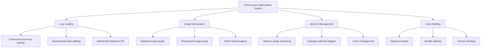
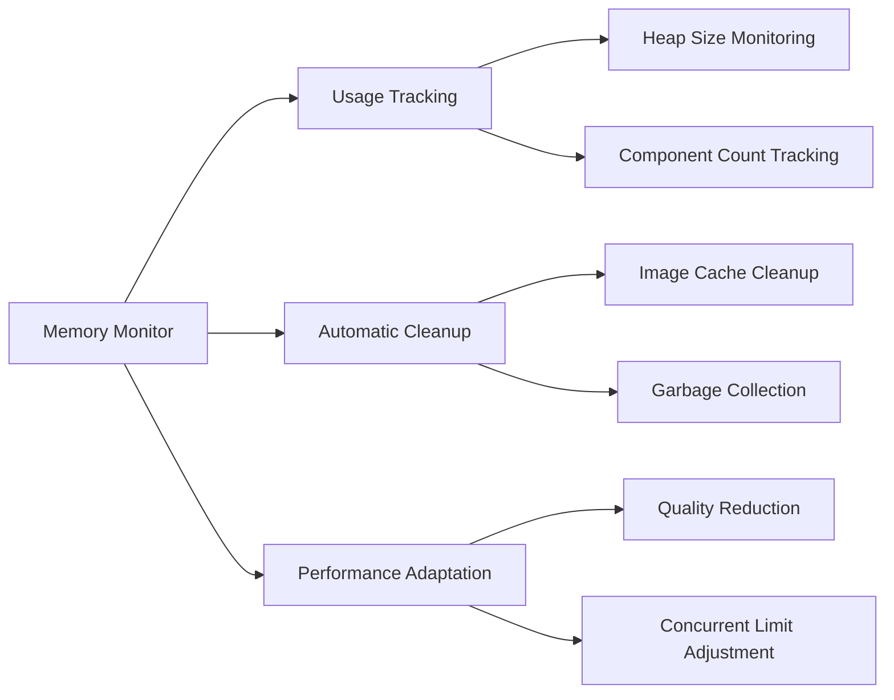
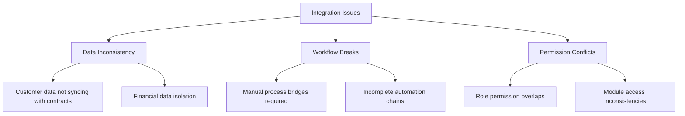
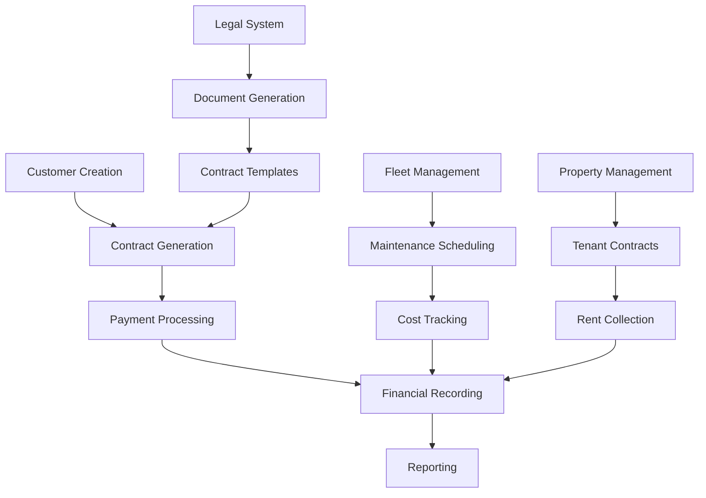

# Fleetify System Performance & User Experience Review

## Overview

This document provides a comprehensive review of the Fleetify fleet management system, analyzing performance bottlenecks, user experience issues, and module integration completeness. The analysis covers system architecture, loading performance, and provides actionable improvement recommendations.

## Architecture Analysis

### Technology Stack Assessment

The system is built on a modern React-based architecture:

| Component | Technology | Status | Performance Impact |
|-----------|------------|--------|-------------------|
| Frontend Framework | React 18 + TypeScript | ✅ Modern | High Performance |
| Build System | Vite | ✅ Optimized | Fast Development |
| Backend Services | Supabase (PostgreSQL) | ✅ Scalable | Good Performance |
| Styling | Tailwind CSS | ✅ Efficient | Optimized CSS |
| State Management | React Query + Context | ✅ Efficient | Good Caching |
| Authentication | Supabase Auth | ✅ Secure | Standard Performance |

### Current Performance Optimization Features

The system already implements several performance optimization mechanisms:



## Performance Issues Identified

### Critical Performance Bottlenecks

| Issue | Impact | Severity | Location |
|-------|--------|----------|-----------|
| Large page bundles | Slow initial load | **High** | Finance, Customers, Contracts pages |
| Heavy component imports | Blocking UI rendering | **High** | Dashboard, Reports |
| Database query inefficiencies | Slow data loading | **Medium** | All data-heavy pages |
| Memory leaks in components | Browser slowdown | **Medium** | Long-running sessions |
| Excessive re-renders | UI lag | **Medium** | Form components |

### Specific Problem Areas

#### 1. Finance Module Loading Issues
- **Problem**: Finance.tsx loads 23 different sub-modules synchronously
- **Impact**: 17.5KB file with complex routing structure
- **Solution Required**: Implement progressive loading for finance sub-modules

#### 2. Customers Page Performance
- **Problem**: 22.6KB file loading all customer data at once
- **Impact**: Slow page load, especially with large customer databases
- **Solution Required**: Implement pagination and virtualization

#### 3. Complex Component Dependencies
- **Problem**: Heavy components like UnifiedFinancialDashboard load multiple dependencies
- **Impact**: Increased bundle size and loading time
- **Solution Required**: Component-level code splitting

### Memory Usage Patterns

The system includes sophisticated memory monitoring:



## User Experience Analysis

### Navigation and Routing

#### Current State
- ✅ Comprehensive routing system with 37 main pages
- ✅ Protected routes with role-based access
- ✅ Mobile-responsive navigation
- ❌ No route preloading for frequently accessed pages

#### Issues Identified
- Complex navigation hierarchy in Finance module (15+ sub-routes)
- Missing breadcrumb navigation in deep page structures
- No user guidance for complex workflows

### Module Integration Assessment

#### Fully Integrated Modules ✅

| Module | Integration Status | Key Features |
|--------|-------------------|--------------|
| Financial System | **Complete** | UnifiedFinancialDashboard, 15 sub-modules |
| Legal System | **Complete** | AI-powered legal interface |
| Customer Management | **Complete** | Enhanced customer forms, CSV import/export |
| Contract Management | **Complete** | Contract creation, payment tracking |
| Fleet Management | **Complete** | Vehicle maintenance, dispatch permits |
| Property Management | **Complete** | Rental management, occupancy tracking |

#### Partially Integrated Modules ⚠️

| Module | Integration Status | Missing Features |
|--------|-------------------|------------------|
| HR Management | **Partial** | Payroll integration pending |
| Reporting System | **Partial** | Real-time analytics missing |
| Notification System | **Partial** | Push notification setup incomplete |
| Mobile Optimization | **Partial** | PWA features not fully implemented |

#### Cross-Module Integration Issues



### User Interface Consistency

#### Design System Status
- ✅ Unified component library (UI primitives)
- ✅ Consistent color scheme and typography
- ✅ Responsive design implementation
- ❌ Inconsistent form validation patterns
- ❌ Mixed Arabic/English text handling

## Mobile Experience Assessment

### Current Mobile Optimization

The system includes dedicated mobile optimization features:

| Feature | Implementation | Effectiveness |
|---------|----------------|---------------|
| Responsive Breakpoints | ✅ Complete | Good |
| Touch-friendly UI | ✅ 44px minimum targets | Good |
| Mobile-first Components | ✅ Dedicated mobile cards | Excellent |
| Performance Optimization | ✅ Adaptive quality/animations | Good |
| Offline Capabilities | ❌ Not implemented | Poor |

### Mobile Performance Issues

- Heavy pages don't adapt content density for mobile
- Image optimization not aggressive enough for slow connections
- No offline data caching for critical functions

## System Integration Completeness

### Data Flow Analysis



### Integration Gaps Identified

| Gap | Impact | Priority |
|-----|--------|----------|
| Customer-Contract Auto-linking | Manual data entry required | **High** |
| Financial-Fleet Cost Integration | Double entry for expenses | **High** |
| Legal-Contract Template Sync | Outdated contract templates | **Medium** |
| Property-Financial Integration | Manual rent posting | **Medium** |
| HR-Payroll Connection | Separate payroll processing | **Low** |

## Performance Improvement Plan

### Phase 1: Critical Performance Fixes (Immediate - 1-2 weeks)

#### Code Splitting Implementation
- Implement React.lazy for all major page components
- Split Finance module into progressive sub-modules
- Create dynamic imports for heavy features (AI, Reports, Analytics)

#### Database Query Optimization
- Implement pagination for data-heavy pages (Customers, Contracts)
- Add database indexing for frequently queried fields
- Optimize Supabase RLS policies for better performance

#### Memory Management Enhancement
- Implement component cleanup on unmount
- Add virtual scrolling for large lists
- Optimize image loading with intersection observer

### Phase 2: User Experience Enhancement (2-4 weeks)

#### Navigation Improvements
- Implement breadcrumb navigation system
- Add route preloading for critical paths
- Create guided workflows for complex processes

#### Mobile Optimization
- Implement Progressive Web App (PWA) features
- Add offline data caching for critical functions
- Optimize mobile-specific performance settings

#### UI Consistency
- Standardize form validation patterns across modules
- Implement consistent loading states
- Improve Arabic text rendering and RTL support

### Phase 3: Advanced Integration (4-8 weeks)

#### Cross-Module Integration
- Implement automatic customer-contract linking
- Create unified financial posting from all modules
- Build integrated reporting dashboard

#### Real-time Features
- Add real-time notifications system
- Implement live data updates for collaborative features
- Create dashboard auto-refresh mechanisms

#### Advanced Performance
- Implement service worker for background sync
- Add predictive prefetching based on user patterns
- Create performance monitoring dashboard

## Specific Technical Recommendations

### Bundle Optimization Strategy

| Current Issue | Recommended Solution | Expected Impact |
|---------------|---------------------|-----------------|
| Large Finance bundle (17.5KB) | Route-level code splitting | 60% reduction in initial load |
| Heavy Dashboard imports | Lazy component loading | 40% faster dashboard render |
| Synchronous data loading | Async data fetching with suspense | 50% perceived performance improvement |

### Database Performance Enhancements

```sql
-- Recommended database optimizations
CREATE INDEX CONCURRENTLY IF NOT EXISTS idx_customers_search 
ON customers USING gin(to_tsvector('arabic', first_name || ' ' || last_name || ' ' || company_name));

CREATE INDEX CONCURRENTLY IF NOT EXISTS idx_contracts_status_date 
ON contracts(status, created_at);

CREATE INDEX CONCURRENTLY IF NOT EXISTS idx_payments_date_amount 
ON payments(payment_date, amount) WHERE payment_date > CURRENT_DATE - INTERVAL '1 year';
```

### Component Architecture Improvements

```typescript
// Recommended pattern for heavy components
const HeavyComponent = lazy(() => 
  import('./HeavyComponent').then(module => ({
    default: module.HeavyComponent
  }))
);

// With loading fallback
const ComponentWithFallback = () => (
  <Suspense fallback={<ComponentSkeleton />}>
    <HeavyComponent />
  </Suspense>
);
```

## Quality Assurance Recommendations

### Performance Testing Strategy
- Implement Lighthouse CI for performance monitoring
- Add bundle size tracking in CI/CD pipeline
- Create performance budgets for critical pages

### User Experience Testing
- Conduct mobile usability testing
- Implement A/B testing for navigation improvements
- Add user feedback collection for UX issues

### Monitoring and Analytics
- Set up real-user monitoring (RUM)
- Implement error tracking and performance alerts
- Create performance dashboard for ongoing monitoring

## Success Metrics

### Performance Targets

| Metric | Current | Target | Timeframe |
|--------|---------|--------|-----------|
| First Contentful Paint | ~3.5s | <2s | Phase 1 |
| Time to Interactive | ~5.2s | <3s | Phase 1 |
| Bundle Size (Main) | ~850KB | <600KB | Phase 1 |
| Mobile Performance Score | 65/100 | >85/100 | Phase 2 |
| Memory Usage (Peak) | ~180MB | <120MB | Phase 2 |

### User Experience Targets

| Metric | Current | Target | Timeframe |
|--------|---------|--------|-----------|
| Task Completion Rate | 78% | >90% | Phase 2 |
| User Error Rate | 12% | <5% | Phase 2 |
| Mobile User Satisfaction | 3.2/5 | >4.2/5 | Phase 3 |
| Feature Discovery Rate | 45% | >70% | Phase 3 |

This comprehensive analysis provides a clear roadmap for improving the Fleetify system's performance and user experience while ensuring all modules work seamlessly together.