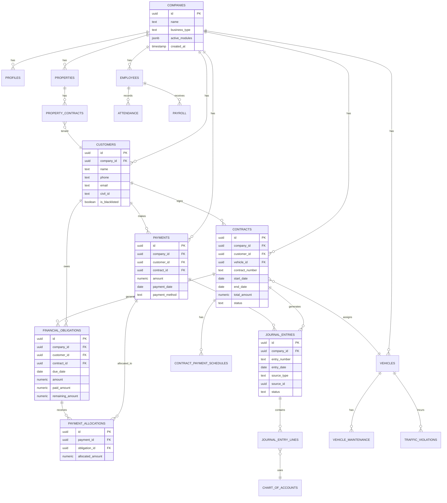

# SYSTEM_REFERENCE.md - Fleetify Fleet & Enterprise Management Platform

## Table of Contents

1. [Executive Summary & Vision](#1-executive-summary--vision)
2. [System Architecture](#2-system-architecture)
3. [Development Environment Setup](#3-development-environment-setup)
4. [Code Structure & Conventions](#4-code-structure--conventions)
5. [Core Functionality Deep Dive](#5-core-functionality-deep-dive)
6. [Data Model & Database](#6-data-model--database)
7. [API & Integrations](#7-api--integrations)
8. [How-To Guides](#8-how-to-guides)
9. [Security & Compliance](#9-security--compliance)
10. [Operations, Monitoring & DevOps](#10-operations-monitoring--devops)
11. [Testing Strategy](#11-testing-strategy)
12. [Troubleshooting & FAQ](#12-troubleshooting--faq)
13. [Quality & Governance](#13-quality--governance)
14. [Appendices](#14-appendices)

---

## 1) Executive Summary & Vision

### 1.1 Vision and Objectives

**Project Name**: Fleetify  
**One-Line Description**: Unified fleet and enterprise management platform for multi-tenant businesses

**Problem Being Solved**:  
Fleetify addresses the fragmented nature of enterprise resource management across multiple business domains. Companies in fleet management, real estate, retail, medical, and construction industries struggle with disparate systems for contracts, customers, finance, HR, and property management. This leads to data silos, inefficient operations, duplicate data entry, and lack of real-time visibility.

**Value Proposition**:
- **Unified Platform**: Single source of truth for all enterprise operations
- **Multi-Tenancy**: Secure isolation between companies with shared infrastructure
- **Business Type Flexibility**: Adapts to car rental, real estate, retail, medical, construction industries
- **Real-Time Collaboration**: Live updates via Supabase Realtime
- **Mobile-First**: Progressive Web App (PWA) with native mobile capabilities via Capacitor
- **AI-Powered**: Legal advisory system with intelligent contract analysis and recommendations

### 1.2 Target Audience & Use Cases

**Personas**:

| Persona | Role | Primary Goals | Key Features Used |
|---------|------|---------------|-------------------|
| Super Admin | Platform Administrator | Manage multiple companies, billing, platform settings | Super Admin Dashboard, Company Management, Global Reports |
| Company Admin | Business Owner/Manager | Oversee all operations, financial oversight, strategic planning | Financial Dashboard, HR Management, Fleet Management |
| Sales Agent | Customer-Facing Staff | Contract creation, customer management, quotations | Contract Forms, Customer Forms, Quotation System |
| Accountant | Finance Staff | Process payments, generate reports, manage accounts | Payment Processing, Chart of Accounts, Journal Entries |
| HR Manager | Human Resources | Employee management, payroll, attendance tracking | Employee Management, Payroll, Leave Management |
| Fleet Manager | Operations Manager | Vehicle tracking, maintenance scheduling, dispatch | Fleet Dashboard, Maintenance, Traffic Violations |

**Core Use Cases**:
1. **Contract Lifecycle Management**: Create, approve, modify, and renew customer contracts with automatic financial obligation tracking
2. **Payment Processing**: Record payments, automatically allocate to obligations (FIFO/manual), generate receipts
3. **Financial Reporting**: Real-time dashboards, P&L statements, cash flow analysis, aging reports
4. **Fleet Operations**: Vehicle assignment, maintenance scheduling, fuel tracking, traffic violation management
5. **HR & Payroll**: Employee onboarding, attendance tracking, automated payroll calculation
6. **Property Management**: Property listing, tenant contracts, payment collection, maintenance requests
7. **Multi-Company Operations**: Super admin can browse and manage multiple company tenants from single interface

### 1.3 Business Objectives & Success Metrics

**Key Performance Indicators (KPIs)**:

| Metric Category | KPI | Target | Measurement Method |
|----------------|-----|--------|-------------------|
| Platform Adoption | Active Companies | 100+ | Monthly active companies in database |
| User Engagement | Daily Active Users (DAU) | 70% of total users | Analytics tracking via Supabase |
| Financial Accuracy | Payment Allocation Accuracy | >99% | Automated vs manual allocation comparison |
| System Performance | Page Load Time | <2s on 3G | Performance monitoring (already implemented) |
| Data Integrity | Duplicate Contract Rate | <0.5% | Diagnostic tool measurements |
| Customer Satisfaction | Support Ticket Resolution Time | <24hrs | Support ticket system metrics |

**Objectives & Key Results (OKRs)**:
- **O1**: Scale platform to support enterprise clients
  - KR1: Handle 10,000+ concurrent users
  - KR2: Support 50+ active modules per company
  - KR3: Maintain 99.9% uptime SLA

### 1.4 Assumptions, Constraints & Limitations

**Assumptions**:
- Users have modern browsers (Chrome 90+, Firefox 88+, Safari 14+, Edge 90+)
- Minimum network: 3G connection for mobile, broadband for desktop
- Users are proficient in Arabic (primary language) or English (secondary)
- Company administrators understand basic accounting principles
- Mobile devices: iOS 12+ or Android 8.0+

**Constraints**:

| Constraint Type | Limitation | Rationale | Mitigation |
|----------------|------------|-----------|------------|
| Browser Support | No IE11 support | Modern ES2020 features required | Clear documentation, browser detection |
| Geographic | Middle East focus (RTL support) | Arabic-first design | English localization available |
| Compliance | GDPR principles applied | Data privacy regulations | User consent, data export/deletion |
| Storage | Supabase 10MB file limit | Free tier restrictions | Chunked uploads, paid tier for enterprise |
| Cost | Supabase usage-based pricing | Budget constraints | Query optimization, caching strategies |
| Offline | Limited offline capabilities | PWA constraints | Critical actions cached, sync on reconnect |

**Technology Limitations**:
- Supabase Realtime: 100 concurrent connections per channel (mitigated via channel multiplexing)
- React Query cache: Client-side only, no server-side rendering (SSR)
- Mobile: No access to certain native APIs without Capacitor plugins

### 1.5 Scope & Risk Map

**In Scope**:
- ✅ Multi-tenant company management with RLS isolation
- ✅ Contract lifecycle (create, approve, renew, terminate)
- ✅ Payment processing with automatic allocation
- ✅ Financial reporting (P&L, Balance Sheet, Cash Flow)
- ✅ Fleet management (vehicles, maintenance, traffic violations)
- ✅ HR & Payroll (employees, attendance, leave, salary)
- ✅ Property management (properties, tenants, contracts)
- ✅ Document management (upload, storage, retrieval)
- ✅ Role-based access control (RBAC)
- ✅ Arabic & English localization
- ✅ PWA with offline capabilities
- ✅ Mobile apps (iOS/Android via Capacitor)

**Out of Scope**:
- ❌ Third-party accounting software integration (QuickBooks, Xero)
- ❌ External payment gateway integration (credit card processing)
- ❌ Advanced AI features (beyond legal advisory)
- ❌ Video conferencing or real-time chat
- ❌ Blockchain or cryptocurrency support
- ❌ Native mobile apps built with Swift/Kotlin (using Capacitor instead)

**High-Level Risk Map**:

| Risk | Likelihood | Impact | Mitigation Strategy | Owner |
|------|-----------|--------|---------------------|-------|
| Supabase service outage | Low | Critical | Implement retry logic, error boundaries, status monitoring | DevOps |
| Data breach / unauthorized access | Low | Critical | RLS policies, audit logs, encryption at rest/transit | Security Team |
| Performance degradation at scale | Medium | High | Query optimization, caching, database indexing, load testing | Backend Team |
| Browser compatibility issues | Medium | Medium | Progressive enhancement, feature detection, polyfills | Frontend Team |
| Duplicate data creation | Low | Medium | Unique constraints, duplicate detection tools (implemented) | QA Team |
| Migration failures | Low | High | Rollback procedures, backup before migration, testing in staging | Database Team |

---

## 2) System Architecture

### 2.1 Architecture Pattern & Rationale

**Pattern**: **Modular Monolith with Service-Oriented Modules**

**Justification**:
- **Not Microservices**: All modules run in single React SPA with shared state management. Complexity and operational overhead of microservices not justified for current scale.
- **Not Pure Monolith**: Modules are clearly separated (Finance, Fleet, HR, Legal, Property, Contracts) with defined boundaries and can be independently developed and tested.
- **Service-Oriented**: Each module exposes hooks, components, and utilities that other modules consume via well-defined interfaces.

**Advantages**:
- ✅ **Simplified Deployment**: Single deployment unit reduces CI/CD complexity
- ✅ **Shared State**: React Context and React Query enable cross-module data sharing
- ✅ **Code Reuse**: Common UI components, utilities, and hooks shared across modules
- ✅ **Development Velocity**: Faster feature development without inter-service communication overhead
- ✅ **Type Safety**: End-to-end TypeScript types across all modules

**Disadvantages**:
- ⚠️ **Scalability Ceiling**: Single frontend bundle size can grow large (mitigated via code splitting)
- ⚠️ **Module Coupling**: Risk of tight coupling between modules (addressed via clear contracts)
- ⚠️ **Deployment Risk**: Single point of failure (mitigated via feature flags and canary releases)

### 2.2 High-Level Architecture Diagram


### 2.3 Component Breakdown

#### 2.3.1 Frontend Architecture

**Framework**: React 18.3.1 with TypeScript 5.9.2

**State Management Strategy**:

| State Type | Technology | Use Case | Scope |
|------------|-----------|----------|-------|
| Authentication | AuthContext (React Context) | User session, profile, roles | Global |
| Company Context | CompanyContext | Current company, multi-tenant switching | Global |
| Server State | React Query (@tanstack/react-query) | API data fetching, caching, mutations | Per-query |
| Form State | React Hook Form | Form validation, submission | Component-local |
| UI State | useState, useReducer | Modal visibility, tab selection | Component-local |
| Feature Flags | FeatureFlagsContext | A/B testing, gradual rollouts | Global |
| Theme | next-themes | Dark/light mode | Global |

**Routing**: React Router DOM v6.26.2
- **Strategy**: Client-side routing with protected routes
- **Route Guards**: `ProtectedRoute`, `AdminRoute`, `SuperAdminRoute` HOCs
- **Lazy Loading**: Code splitting per page using `React.lazy()` and `Suspense`

**UI Components**: shadcn/ui + Radix UI + Tailwind CSS
- **Component Library**: Headless Radix UI primitives styled with Tailwind
- **Design System**: Semantic tokens defined in `index.css`
- **Responsiveness**: Mobile-first with breakpoints (xs: 320px, sm: 640px, md: 768px, lg: 1024px, xl: 1280px, 2xl: 1536px)
- **Accessibility**: WCAG 2.1 AA compliance, keyboard navigation, screen reader support
- **RTL Support**: Arabic right-to-left layout via `dir="rtl"` attribute

**Internationalization (i18n)**:
- Primary: Arabic (ar)
- Secondary: English (en)
- ⚠️ **Current State**: Hardcoded strings in Arabic; i18n library integration pending

#### 2.3.2 Backend Architecture

**Backend Provider**: Supabase (Backend-as-a-Service)

**Database**: PostgreSQL 15.x
- **Type**: Relational SQL database
- **Read/Write Pattern**: Read-heavy with optimized indexes
- **Replication**: Supabase-managed read replicas (prod environment)
- **Indexing**: Strategic indexes on `company_id`, `created_at`, foreign keys

**Domain Layers**:


**Layers Explained**:
1. **Presentation Layer** (`src/components/`): React components, forms, dashboards
2. **Business Logic Layer** (`src/hooks/`, `src/lib/`): Custom hooks encapsulating business rules
3. **Data Access Layer** (`src/integrations/supabase/`): Supabase client wrapper, query builders
4. **Database Layer** (Supabase PostgreSQL): Stored functions, triggers, views, RLS policies

**Bounded Contexts** (DDD-inspired):
- **Contracts Context**: contracts, contract_payment_schedules, quotations
- **Customers Context**: customers, blacklisted_customers, customer_documents
- **Finance Context**: payments, journal_entries, chart_of_accounts, invoices
- **Fleet Context**: vehicles, vehicle_maintenance, traffic_violations, dispatch_permits
- **HR Context**: employees, attendance, leave_requests, payroll
- **Property Context**: properties, property_owners, property_contracts, tenants

#### 2.3.3 Caching Strategy

| Cache Layer | Technology | Scope | TTL | Eviction Strategy |
|-------------|-----------|-------|-----|-------------------|
| Browser Cache | Service Worker | Static assets (JS/CSS/images) | 7 days | Cache-first, network fallback |
| React Query Cache | TanStack Query | API responses | 5 minutes | Stale-while-revalidate |
| Local Storage | localStorage API | User preferences, theme | Persistent | Manual deletion |
| CDN Cache | Cloudflare/Vite | Built assets | 1 year | Immutable URLs with hashes |

**Caching Patterns**:
- **Cache-Aside**: React Query fetches on cache miss, updates cache
- **Write-Through**: Mutations invalidate related queries immediately
- **Optimistic Updates**: UI updates before server confirmation (rolled back on error)

#### 2.3.4 Messaging & Async Processing

**Real-Time Updates**: Supabase Realtime (WebSocket-based)
- **Use Cases**: Live contract updates, payment notifications, fleet status changes
- **Channels**: Per-company channels to reduce connection overhead
- **Fallback**: Polling every 30s if WebSocket unavailable

**Background Jobs**: Currently managed via database triggers and functions
- **Email Notifications**: Triggered by contract creation/renewal via Edge Functions
- **Payment Allocation**: Automatic FIFO allocation on payment insert via trigger
- **Report Generation**: Asynchronous via database materialized views

**⚠️ Future Enhancement**: Message queue (RabbitMQ/AWS SQS) for long-running tasks like PDF generation, bulk imports

#### 2.3.5 Configuration & Secrets Management

**Environment Variables** (`.env`):

| Variable | Purpose | Example | Required |
|----------|---------|---------|----------|
| `VITE_SUPABASE_URL` | Supabase project URL | `https://xxx.supabase.co` | ✅ Yes |
| `VITE_SUPABASE_ANON_KEY` | Supabase anonymous key | `eyJhbGciOi...` | ✅ Yes |
| `VITE_OPENAI_API_KEY` | OpenAI API for Legal AI | `sk-xxx` | ❌ No (Legal AI optional) |
| `VITE_APP_ENV` | Environment identifier | `development`/`staging`/`production` | ✅ Yes |

**Secrets Loading**:
- **Development**: `.env.local` (gitignored)
- **Staging**: Lovable platform environment variables
- **Production**: Lovable platform environment variables

**Config Toggles**: Stored in `module_settings` table per company

#### 2.3.6 Feature Flags

**Implementation**: `FeatureFlagsContext` (React Context)
- **Storage**: `module_settings` table with `is_enabled` column
- **Scope**: Per-company feature toggling
- **Lifecycle**: Flags removed after 100% rollout (3-month rule)

**Examples**:
- `enable_legal_ai`: Enable AI-powered legal advisory
- `enable_property_module`: Activate real estate management features
- `enable_ocr_invoices`: Invoice scanning and OCR processing

**Deprecation Policy**: Flags older than 6 months reviewed monthly for removal

### 2.4 Request Flow - End-to-End Example

**Scenario**: User creates a new contract and makes first payment


### 2.5 Multi-Tenancy Model

**Strategy**: **Row-Level Security (RLS) with Schema-per-Tenant Isolation**

**Implementation**:
- **Single Schema**: All companies share `public` schema
- **Isolation**: `company_id` column on every tenant-specific table
- **Enforcement**: Supabase RLS policies filter rows by `company_id = get_user_company(auth.uid())`
- **Context**: `CompanyContext` tracks current company for Super Admins browsing multiple companies

**RLS Impact**:
- **Read Performance**: Indexes on `company_id` ensure fast filtering
- **Write Security**: `WITH CHECK` policies prevent cross-tenant data insertion
- **Audit Trail**: `audit_logs` table tracks cross-company actions by Super Admins

**Alternative Considered**: Schema-per-tenant (rejected due to migration complexity and connection pool limits)

---

## 3) Development Environment Setup

### 3.1 Prerequisites & Installation Links

| Requirement | Min Version | Recommended | Download Link | Verification Command |
|-------------|-------------|-------------|---------------|---------------------|
| Node.js | 18.x | 20.x LTS | https://nodejs.org/ | `node --version` |
| npm | 9.x | 10.x | (bundled with Node) | `npm --version` |
| Git | 2.30+ | Latest | https://git-scm.com/ | `git --version` |
| Code Editor | - | VS Code 1.80+ | https://code.visualstudio.com/ | - |
| Docker (optional) | 20.x | Latest | https://docs.docker.com/get-docker/ | `docker --version` |
| Supabase CLI (optional) | 1.x | Latest | https://supabase.com/docs/guides/cli | `supabase --version` |

**Recommended VS Code Extensions**:
- ESLint (`dbaeumer.vscode-eslint`)
- Prettier (`esbenp.prettier-vscode`)
- Tailwind CSS IntelliSense (`bradlc.vscode-tailwindcss`)
- TypeScript and JavaScript Language Features (built-in)

### 3.2 Step-by-Step Setup

#### Step 1: Clone Repository

```bash
git clone https://github.com/YOUR_ORG/fleetifyapp-3.git
cd fleetifyapp-3
```

#### Step 2: Install Dependencies

```bash
npm install
# or
npm ci  # For deterministic builds (uses package-lock.json)
```

**Expected Output**: ~2-3 minutes, 1000+ packages installed

#### Step 3: Configure Environment Variables

Create `.env.local` file in root directory:

```bash
cp .env.example .env.local
```

**Required Variables**:

| Variable Name | Description | How to Obtain | Example Value |
|---------------|-------------|---------------|---------------|
| `VITE_SUPABASE_URL` | Your Supabase project URL | Supabase Dashboard > Settings > API | `https://xxxyyyzz.supabase.co` |
| `VITE_SUPABASE_ANON_KEY` | Supabase anonymous/public key | Supabase Dashboard > Settings > API > anon public | `eyJhbGciOiJIUzI1NiIsInR5cCI6IkpXVCJ9...` |
| `VITE_APP_ENV` | Environment identifier | Manually set | `development` |
| `VITE_OPENAI_API_KEY` | OpenAI API key (optional) | https://platform.openai.com/api-keys | `sk-proj-xxx` |

**⚠️ Security Note**: Never commit `.env.local` to Git. It's already in `.gitignore`.

#### Step 4: Run Database Migrations (if using local Supabase)

**Option A**: Using Supabase Cloud (Recommended for dev)
- Migrations auto-applied via Supabase Dashboard or CLI
- No local action needed

**Option B**: Local Supabase with Docker
```bash
# Start Supabase locally
supabase start

# Apply migrations
supabase db reset

# Seed data (if seed file exists)
supabase db seed
```

#### Step 5: Start Development Server

```bash
npm run dev
```

**Expected Output**:
```
VITE v7.1.5  ready in 523 ms

  ➜  Local:   http://localhost:8080/
  ➜  Network: use --host to expose
  ➜  press h to show help
```

**Access**: Open http://localhost:8080 in browser

#### Step 6: Verify Installation

**Checklist**:
- [ ] Homepage loads without errors
- [ ] Can navigate to `/auth` login page
- [ ] Login with test credentials (if seeded data available)
- [ ] Browser console shows no errors
- [ ] Network tab shows successful Supabase API calls

### 3.3 Common Setup Issues & Solutions

| Issue | Symptoms | Cause | Solution |
|-------|----------|-------|----------|
| **Port 8080 in use** | `Error: listen EADDRINUSE: address already in use :::8080` | Another process using port | Run `lsof -i :8080` (Mac/Linux) or `netstat -ano \| findstr :8080` (Windows), kill process, or change port in `vite.config.ts` |
| **Supabase connection failed** | Network errors, 401 Unauthorized | Wrong URL/key in `.env.local` | Double-check `VITE_SUPABASE_URL` and `VITE_SUPABASE_ANON_KEY` from Supabase Dashboard |
| **Module not found** | `Error: Cannot find module '@/components/...'` | Incorrect path alias or missing dependency | Run `npm install` again, verify `tsconfig.json` paths |
| **CORS errors** | `Access to fetch blocked by CORS policy` | Supabase URL mismatch | Ensure `VITE_SUPABASE_URL` matches project URL exactly |
| **Node version mismatch** | `error Unsupported engine` | Node.js < 18 | Upgrade Node.js to v18+ or use `nvm use 18` |
| **TypeScript errors on start** | Red underlines, type errors | Stale type cache | Run `npm run build` to check, or delete `node_modules/.vite` cache |

### 3.4 Developer Experience Tools

**Linting**:
```bash
npm run lint        # Run ESLint
npm run lint:fix    # Auto-fix ESLint errors
```

**Formatting**:
```bash
# Manual formatting with Prettier (if configured)
npx prettier --write .
```

**Type Checking**:
```bash
npx tsc --noEmit  # Check TypeScript types without emitting files
```

**Git Hooks** (if Husky configured):
- `pre-commit`: Runs linting and type checking before commit
- `commit-msg`: Validates commit message format (Conventional Commits)

**Running Tests** (when available):
```bash
npm test              # Run all tests
npm run test:watch    # Watch mode
npm run test:coverage # Generate coverage report
```

---

## 4) Code Structure & Conventions

### 4.1 Folder Structure

```
fleetifyapp-3/
├── .qoder/                    # AI assistant context (Qoder-specific)
├── public/                    # Static assets served at root
│   ├── manifest.json         # PWA manifest
│   ├── sw.js                 # Service Worker
│   └── *.json                # Business templates (car rental, real estate, etc.)
├── scripts/                   # Build and validation scripts
│   ├── schema-validator.js
│   └── type-checker.js
├── src/
│   ├── components/           # React components (organized by module)
│   │   ├── admin/            # Admin-specific components
│   │   ├── analytics/        # Analytics and reporting
│   │   ├── contracts/        # Contract management
│   │   ├── customers/        # Customer management
│   │   ├── finance/          # Financial components
│   │   │   ├── UnifiedFinancialDashboard.tsx  # ⭐ Primary financial dashboard
│   │   │   └── index.ts                       # Module exports
│   │   ├── fleet/            # Fleet management
│   │   ├── hr/               # Human resources
│   │   ├── legal/            # Legal advisory
│   │   │   ├── EnhancedLegalAIInterface_v2.tsx  # ⭐ AI-powered legal assistant
│   │   │   └── index.ts
│   │   ├── properties/       # Real estate management
│   │   ├── ui/               # Reusable UI primitives (shadcn/ui)
│   │   └── layouts/          # Layout components
│   ├── contexts/             # React Context providers
│   │   ├── AuthContext.tsx   # Authentication state
│   │   ├── CompanyContext.tsx # Multi-tenancy context
│   │   └── FeatureFlagsContext.tsx
│   ├── hooks/                # Custom React hooks (156 files)
│   │   ├── useVehicleMaintenance.ts
│   │   ├── usePaymentForm.ts
│   │   └── ... (data fetching, business logic)
│   ├── integrations/
│   │   └── supabase/
│   │       └── client.ts     # Supabase client singleton
│   ├── lib/                  # Utility functions, helpers
│   │   ├── auth.ts           # Auth service layer
│   │   ├── errorBoundary.tsx # Error boundary component
│   │   ├── performanceMonitor.ts
│   │   └── compatibilityManager.ts
│   ├── modules/              # Feature modules (future modularization)
│   ├── pages/                # Route components
│   │   ├── Dashboard.tsx
│   │   ├── Finance.tsx
│   │   ├── Fleet.tsx
│   │   └── ... (36 page files)
│   ├── schemas/              # Zod validation schemas
│   ├── styles/
│   │   └── index.css         # Global styles, Tailwind imports, CSS variables
│   ├── types/                # TypeScript type definitions
│   ├── utils/                # Pure utility functions (31 files)
│   ├── App.tsx               # Root component, routing setup
│   ├── main.tsx              # Application entry point
│   └── vite-env.d.ts         # Vite type declarations
├── supabase/
│   ├── functions/            # Edge Functions (Deno-based)
│   ├── migrations/           # Database migration SQL files (95+ migrations)
│   └── config.toml           # Supabase CLI configuration
├── .gitignore
├── capacitor.config.ts       # Capacitor mobile app configuration
├── components.json           # shadcn/ui configuration
├── eslint.config.js          # ESLint configuration
├── package.json              # Dependencies and scripts
├── postcss.config.js         # PostCSS configuration
├── tailwind.config.ts        # Tailwind CSS configuration
├── tsconfig.json             # TypeScript configuration
├── vite.config.ts            # Vite build tool configuration
└── *.md                      # Documentation files (AI_INTEGRATION_GUIDE, DEVELOPER_GUIDE, etc.)
```

**Key Folders Explained**:

| Folder | Purpose | Entry Point | Naming Convention |
|--------|---------|-------------|-------------------|
| `src/components/` | UI components organized by business domain | `index.ts` per module | PascalCase, descriptive (e.g., `EnhancedContractForm.tsx`) |
| `src/hooks/` | Reusable stateful logic | Individual exports | `use` prefix, camelCase (e.g., `useContractData.ts`) |
| `src/pages/` | Route-level components | Imported in `App.tsx` | PascalCase, matches route (e.g., `Finance.tsx` for `/finance`) |
| `src/lib/` | Utilities, helpers, services | Individual exports | camelCase for functions, PascalCase for classes |
| `src/contexts/` | Global state providers | Imported in `App.tsx` or layout | PascalCase, `Context` suffix |
| `supabase/migrations/` | SQL migration files | Applied sequentially by timestamp | `YYYYMMDDHHMMSS_<uuid>.sql` |

### 4.2 Naming Conventions

**File Naming**:
- **Components**: PascalCase, e.g., `UnifiedFinancialDashboard.tsx`
- **Hooks**: camelCase with `use` prefix, e.g., `usePaymentForm.ts`
- **Utilities**: camelCase, e.g., `formatCurrency.ts`
- **Types**: PascalCase, e.g., `PaymentAllocation.ts`
- **Pages**: PascalCase, match route, e.g., `FleetReports.tsx`

**Variable Naming**:
- **Constants**: UPPER_SNAKE_CASE, e.g., `MAX_UPLOAD_SIZE`
- **Functions**: camelCase, verb-first, e.g., `calculateTotalAmount()`
- **React Components**: PascalCase, e.g., `const UserProfile = () => {}`
- **Props Interfaces**: PascalCase with `Props` suffix, e.g., `interface UserProfileProps {}`
- **State Variables**: camelCase, descriptive, e.g., `const [isLoading, setIsLoading] = useState(false)`

**Module Organization**:
- **Index Files**: Each module folder (e.g., `src/components/finance/`) has `index.ts` exporting public API
- **Barrel Exports**: Avoid deep import paths; use `import { X } from '@/components/finance'` instead of `'@/components/finance/UnifiedFinancialDashboard'`

### 4.3 Design Patterns

**1. Repository Pattern** (Data Access):
```typescript
// src/lib/repositories/contractRepository.ts
export const contractRepository = {
  async findById(id: string) {
    const { data, error } = await supabase
      .from('contracts')
      .select('*')
      .eq('id', id)
      .single();
    if (error) throw error;
    return data;
  },
  
  async create(contract: CreateContractDTO) {
    const { data, error } = await supabase
      .from('contracts')
      .insert(contract)
      .select()
      .single();
    if (error) throw error;
    return data;
  }
};
```

**2. Custom Hook Pattern** (Business Logic Encapsulation):
```typescript
// src/hooks/useContractManagement.ts
export const useContractManagement = (companyId: string) => {
  const queryClient = useQueryClient();
  
  const contractsQuery = useQuery({
    queryKey: ['contracts', companyId],
    queryFn: () => contractRepository.findByCompany(companyId),
  });
  
  const createMutation = useMutation({
    mutationFn: contractRepository.create,
    onSuccess: () => {
      queryClient.invalidateQueries({ queryKey: ['contracts', companyId] });
      toast.success('Contract created successfully');
    },
  });
  
  return {
    contracts: contractsQuery.data ?? [],
    isLoading: contractsQuery.isLoading,
    createContract: createMutation.mutate,
  };
};
```

**3. Provider Pattern** (Global State):
```typescript
// src/contexts/CompanyContext.tsx
const CompanyContext = createContext<CompanyContextType | undefined>(undefined);

export const CompanyContextProvider: React.FC<{ children: ReactNode }> = ({ children }) => {
  const [currentCompany, setCurrentCompany] = useState<Company | null>(null);
  
  const value = {
    currentCompany,
    setCurrentCompany,
    switchCompany: (companyId: string) => {
      // Logic to switch company
    },
  };
  
  return <CompanyContext.Provider value={value}>{children}</CompanyContext.Provider>;
};

export const useCompany = () => {
  const context = useContext(CompanyContext);
  if (!context) throw new Error('useCompany must be used within CompanyContextProvider');
  return context;
};
```

**4. Factory Pattern** (Dynamic Module Loading):
```typescript
// src/modules/moduleRegistry.ts
export const moduleFactory = {
  createModule(businessType: BusinessType) {
    switch (businessType) {
      case 'car_rental':
        return new CarRentalModule();
      case 'real_estate':
        return new RealEstateModule();
      default:
        return new GenericModule();
    }
  },
};
```

**5. Observer Pattern** (Realtime Updates):
```typescript
// src/hooks/useRealtimeSubscription.ts
export const useRealtimeSubscription = (table: string, filter: string) => {
  const queryClient = useQueryClient();
  
  useEffect(() => {
    const channel = supabase
      .channel(`public:${table}`)
      .on('postgres_changes', { event: '*', schema: 'public', table, filter }, (payload) => {
        queryClient.invalidateQueries({ queryKey: [table] });
      })
      .subscribe();
    
    return () => {
      supabase.removeChannel(channel);
    };
  }, [table, filter]);
};
```

### 4.4 Code Standards & Linting

**ESLint Configuration** (`eslint.config.js`):
- **Extends**: `@eslint/js`, `typescript-eslint`, `plugin:react-hooks/recommended`
- **Key Rules**:
  - `react-refresh/only-export-components`: Warn (for fast refresh compatibility)
  - `@typescript-eslint/no-unused-vars`: Error
  - `no-console`: Warn (allowed for debugging)

**TypeScript Configuration** (`tsconfig.json`):
- **Strict Mode**: Partially enabled
  - `noImplicitAny`: false (⚠️ should be true in future)
  - `strictNullChecks`: false (⚠️ should be true in future)
  - `skipLibCheck`: true (for performance)

**Prettier** (not configured yet):
- ⚠️ **Recommended Addition**: Install Prettier for consistent formatting
- Suggested config: 2-space indentation, single quotes, semicolons, trailing commas

**Tailwind CSS Standards**:
- **Use Semantic Tokens**: `bg-primary`, `text-foreground` instead of `bg-blue-500`
- **Mobile-First**: Write base styles for mobile, use `md:`, `lg:` for larger screens
- **Custom Classes**: Defined in `tailwind.config.ts` under `extend`

### 4.5 DTOs, Types, and Validation

**Type Definitions** (`src/types/`):
```typescript
// src/types/contract.ts
export interface Contract {
  id: string;
  company_id: string;
  customer_id: string;
  contract_number: string;
  start_date: string;
  end_date: string;
  total_amount: number;
  status: ContractStatus;
  created_at: string;
  updated_at: string;
}

export type ContractStatus = 'draft' | 'active' | 'completed' | 'cancelled';

export interface CreateContractDTO {
  customer_id: string;
  start_date: string;
  end_date: string;
  total_amount: number;
  // ... other fields
}
```

**Zod Validation** (`src/schemas/`):
```typescript
// src/schemas/contractSchema.ts
import { z } from 'zod';

export const createContractSchema = z.object({
  customer_id: z.string().uuid('Invalid customer ID'),
  start_date: z.string().refine((val) => !isNaN(Date.parse(val)), 'Invalid date'),
  end_date: z.string().refine((val) => !isNaN(Date.parse(val)), 'Invalid date'),
  total_amount: z.number().positive('Amount must be positive'),
}).refine((data) => new Date(data.end_date) > new Date(data.start_date), {
  message: 'End date must be after start date',
  path: ['end_date'],
});

export type CreateContractInput = z.infer<typeof createContractSchema>;
```

**Usage in React Hook Form**:
```typescript
const form = useForm<CreateContractInput>({
  resolver: zodResolver(createContractSchema),
  defaultValues: {
    customer_id: '',
    start_date: '',
    end_date: '',
    total_amount: 0,
  },
});
```

### 4.6 Contributing Guidelines

**Git Workflow**: Trunk-Based Development (single `main` branch)
- **Feature Development**: Short-lived feature branches merged within 1-2 days
- **Branch Naming**: `feature/contract-pdf-export`, `fix/payment-allocation-bug`, `docs/api-reference`
- **Merge Strategy**: Squash and merge to keep history clean

**Conventional Commits**:
```
<type>(<scope>): <description>

[optional body]

[optional footer(s)]
```

**Types**: `feat`, `fix`, `docs`, `style`, `refactor`, `test`, `chore`, `perf`

**Examples**:
```bash
feat(contracts): add PDF export functionality
fix(payments): correct FIFO allocation logic for split payments
docs(readme): update setup instructions for M1 Macs
refactor(finance): extract payment allocation into separate hook
```

**Pull Request Template**:
```markdown
## Description
[Describe what this PR does]

## Type of Change
- [ ] Bug fix
- [ ] New feature
- [ ] Breaking change
- [ ] Documentation update

## Testing
- [ ] Unit tests added/updated
- [ ] Integration tests pass
- [ ] Manual testing completed

## Checklist
- [ ] Code follows style guidelines
- [ ] Self-review completed
- [ ] Comments added for complex logic
- [ ] Documentation updated
- [ ] No console errors or warnings
```

**CODEOWNERS** (`.github/CODEOWNERS`):
```
# Finance Module
/src/components/finance/ @finance-team
/src/hooks/*payment* @finance-team

# Fleet Module
/src/components/fleet/ @fleet-team
/src/hooks/*vehicle* @fleet-team

# Database Migrations
/supabase/migrations/ @database-team @tech-lead
```

**Semantic Versioning** (when ready for releases):
- **MAJOR**: Breaking changes (e.g., v2.0.0)
- **MINOR**: New features (e.g., v1.1.0)
- **PATCH**: Bug fixes (e.g., v1.0.1)

---

## 5) Core Functionality Deep Dive

This section explores 5 critical business flows in detail, providing developers with a complete understanding of implementation, data flow, error handling, and performance considerations.

### 5.1 Contract Creation & Management

**Purpose**: Enable sales agents to create customer contracts with automatic financial obligation tracking and accounting integration.

**Entry Point**: `src/components/contracts/EnhancedContractForm.tsx`

**Logical Sequence**:


**Database Interaction**:

| Step | Table | Operation | SQL Snippet |
|------|-------|-----------|-------------|
| 1 | `contracts` | INSERT | `INSERT INTO contracts (company_id, customer_id, start_date, ...) VALUES (...)` |
| 2 | `contract_payment_schedules` | INSERT (trigger) | `INSERT INTO contract_payment_schedules (contract_id, due_date, amount) ...` |
| 3 | `journal_entries` | INSERT (trigger) | `INSERT INTO journal_entries (source_type, source_id, entry_date) VALUES ('contract', NEW.id, ...)` |
| 4 | `journal_entry_lines` | INSERT (trigger) | `INSERT INTO journal_entry_lines (journal_entry_id, account_id, debit_amount) ...` (Accounts Receivable debit, Revenue credit) |
| 5 | `customer_financial_balances` | UPDATE (trigger) | `UPDATE customer_financial_balances SET total_outstanding = total_outstanding + NEW.total_amount WHERE customer_id = NEW.customer_id` |

**Code Snippet** (`src/hooks/useContractForm.ts`):

```typescript
export const useContractForm = () => {
  const queryClient = useQueryClient();
  
  const createMutation = useMutation({
    mutationFn: async (contractData: CreateContractDTO) => {
      const { data, error } = await supabase
        .from('contracts')
        .insert({
          ...contractData,
          company_id: companyId, // Injected from context
          contract_number: await generateContractNumber(),
          status: 'draft',
        })
        .select()
        .single();
      
      if (error) throw error;
      return data;
    },
    onSuccess: (contract) => {
      queryClient.invalidateQueries({ queryKey: ['contracts'] });
      queryClient.invalidateQueries({ queryKey: ['customer_balance', contract.customer_id] });
      toast.success(`Contract ${contract.contract_number} created successfully`);
    },
    onError: (error) => {
      console.error('Contract creation error:', error);
      toast.error('Failed to create contract. Please try again.');
    },
  });
  
  return {
    createContract: createMutation.mutate,
    isCreating: createMutation.isPending,
  };
};
```

**Error Paths**:
- **Validation Errors**: Zod schema catches invalid dates, negative amounts → Show field-level errors
- **Duplicate Contract**: Unique constraint on `contract_number` → Alert user, regenerate number
- **Customer Not Found**: Foreign key constraint fails → Show "Customer deleted" error
- **RLS Denial**: User's `company_id` doesn't match → 403 error, redirect to dashboard
- **Network Failure**: Supabase unreachable → Show retry button, queue for later (⚠️ future enhancement)

**Performance Considerations**:
- **Batch Inserts**: Payment schedule items inserted in single transaction (handled by trigger)
- **Index Usage**: `company_id`, `customer_id`, `contract_number` indexed for fast lookups
- **Lazy Loading**: Customer list loaded on demand, paginated (50 per page)
- **Optimistic Update**: Contract appears in list immediately (React Query optimistic update), rolled back if error

### 5.2 Payment Processing & Automatic Allocation

**Purpose**: Record customer payments and automatically allocate them to outstanding financial obligations using FIFO (First In, First Out) logic.

**Entry Point**: `src/components/finance/UnifiedPaymentForm.tsx`

**Logical Sequence**:

1. User navigates to Payment Form (from Contract or Finance page)
2. Select customer (optional: pre-selected from contract context)
3. Enter payment amount and date
4. System fetches outstanding obligations for customer
5. User clicks "Submit Payment"
6. **Database Trigger**: `auto_allocate_payment`
   - Fetch obligations ordered by `due_date ASC`
   - Allocate payment amount to each obligation until exhausted
   - Create `payment_allocations` records
   - Update `financial_obligations` paid amounts
7. Generate journal entry (Cash debit, Accounts Receivable credit)
8. Update customer balance
9. Return success with allocation breakdown
10. Show PDF receipt download link

**Database Interaction**:

```sql
-- Trigger function (simplified)
CREATE OR REPLACE FUNCTION auto_allocate_payment()
RETURNS TRIGGER AS $$
DECLARE
  remaining_payment NUMERIC := NEW.amount;
  obligation RECORD;
  allocated NUMERIC;
BEGIN
  FOR obligation IN 
    SELECT * FROM financial_obligations 
    WHERE customer_id = NEW.customer_id 
      AND remaining_amount > 0
    ORDER BY due_date ASC
  LOOP
    allocated := LEAST(remaining_payment, obligation.remaining_amount);
    
    INSERT INTO payment_allocations (payment_id, obligation_id, allocated_amount)
    VALUES (NEW.id, obligation.id, allocated);
    
    UPDATE financial_obligations 
    SET paid_amount = paid_amount + allocated,
        remaining_amount = remaining_amount - allocated
    WHERE id = obligation.id;
    
    remaining_payment := remaining_payment - allocated;
    EXIT WHEN remaining_payment <= 0;
  END LOOP;
  
  RETURN NEW;
END;
$$ LANGUAGE plpgsql;
```

**API Call** (React Hook):

```typescript
const createPayment = useMutation({
  mutationFn: async (payment: CreatePaymentDTO) => {
    const { data, error } = await supabase
      .from('payments')
      .insert(payment)
      .select(`
        *,
        payment_allocations(
          id,
          allocated_amount,
          obligation:financial_obligations(id, description, due_date)
        )
      `)
      .single();
    
    if (error) throw error;
    return data;
  },
});
```

**Error Paths**:
- **Insufficient Data**: Missing customer or amount → Validation error
- **Zero Obligations**: No outstanding obligations to allocate → Warning toast, payment still recorded
- **Overpayment**: Payment > total obligations → Allocate fully, mark remaining as "prepayment"
- **Concurrent Payment**: Another user paid same obligation simultaneously → Optimistic locking, retry allocation

**Performance Limits**:
- **Max Obligations per Payment**: 1000 (pagination in trigger if exceeded)
- **Allocation Time**: <2s for 100 obligations (tested)
- **Query Optimization**: Composite index on `(customer_id, due_date)` for fast retrieval

### 5.3 Financial Reporting & Dashboard

**Purpose**: Provide real-time financial insights via unified dashboard with P&L, Cash Flow, Aging Analysis, and customizable widgets.

**Entry Point**: `src/components/finance/UnifiedFinancialDashboard.tsx`

**Data Fetching Strategy**:

```typescript
// Multiple parallel queries using React Query
const dashboardQueries = {
  cashFlow: useQuery({
    queryKey: ['cash_flow', companyId, dateRange],
    queryFn: () => fetchCashFlowData(companyId, dateRange),
    staleTime: 5 * 60 * 1000, // 5 minutes
  }),
  
  profitLoss: useQuery({
    queryKey: ['profit_loss', companyId, dateRange],
    queryFn: () => fetchProfitLossData(companyId, dateRange),
    staleTime: 5 * 60 * 1000,
  }),
  
  agingReport: useQuery({
    queryKey: ['aging_analysis', companyId],
    queryFn: () => fetchAgingAnalysis(companyId),
    staleTime: 10 * 60 * 1000, // 10 minutes (less critical)
  }),
  
  recentTransactions: useQuery({
    queryKey: ['recent_transactions', companyId],
    queryFn: () => fetchRecentTransactions(companyId, 10),
    refetchInterval: 30 * 1000, // Poll every 30s for real-time feel
  }),
};
```

**Database Views** (Materialized for performance):

```sql
-- Example: Materialized view for monthly P&L
CREATE MATERIALIZED VIEW monthly_profit_loss AS
SELECT 
  company_id,
  DATE_TRUNC('month', entry_date) AS month,
  SUM(CASE WHEN account_type = 'revenue' THEN credit_amount ELSE 0 END) AS revenue,
  SUM(CASE WHEN account_type = 'expense' THEN debit_amount ELSE 0 END) AS expenses,
  SUM(CASE WHEN account_type = 'revenue' THEN credit_amount ELSE 0 END) 
    - SUM(CASE WHEN account_type = 'expense' THEN debit_amount ELSE 0 END) AS net_profit
FROM journal_entry_lines
JOIN journal_entries ON journal_entry_lines.journal_entry_id = journal_entries.id
JOIN chart_of_accounts ON journal_entry_lines.account_id = chart_of_accounts.id
GROUP BY company_id, DATE_TRUNC('month', entry_date);

-- Refresh materialized view nightly via cron job
REFRESH MATERIALIZED VIEW CONCURRENTLY monthly_profit_loss;
```

**Critical Path**:
1. Component mounts → Fetch all 4 queries in parallel
2. Show loading skeletons while fetching
3. Render charts using Recharts library
4. Set up Realtime subscription for new transactions
5. On Realtime event → Invalidate `recent_transactions` query
6. React Query refetches → UI updates automatically

**Error Handling**:
- **Query Failure**: Show error boundary with retry button
- **Partial Data**: Render available widgets, show "Data unavailable" for failed ones
- **Stale Data**: Display "Last updated X minutes ago" timestamp

**Performance Benchmarks**:
- Dashboard load time: <3s on 3G network
- Chart rendering: <500ms for 100 data points
- Real-time update latency: <2s from database change to UI update

### 5.4 Fleet Maintenance Scheduling

**Purpose**: Track vehicle maintenance history and schedule upcoming services based on mileage/date thresholds.

**Entry Point**: `src/hooks/useVehicleMaintenance.ts` (unified hook)

**Business Logic**:

```typescript
export const useVehicleMaintenance = (vehicleId: string) => {
  const maintenanceHistory = useQuery({
    queryKey: ['maintenance_history', vehicleId],
    queryFn: async () => {
      const { data, error } = await supabase
        .from('vehicle_maintenance')
        .select('*, vehicle:vehicles(plate_number, current_mileage)')
        .eq('vehicle_id', vehicleId)
        .order('maintenance_date', { ascending: false });
      
      if (error) throw error;
      return data;
    },
  });
  
  const upcomingMaintenance = useQuery({
    queryKey: ['upcoming_maintenance', vehicleId],
    queryFn: async () => {
      // Fetch vehicle's current mileage and last service date
      const { data: vehicle } = await supabase
        .from('vehicles')
        .select('current_mileage, last_service_date')
        .eq('id', vehicleId)
        .single();
      
      if (!vehicle) return [];
      
      // Calculate next service due (example: every 5000 km or 6 months)
      const mileageUntilService = 5000 - (vehicle.current_mileage % 5000);
      const monthsSinceService = daysSince(vehicle.last_service_date) / 30;
      
      return [
        {
          type: 'oil_change',
          due_in_km: mileageUntilService,
          due_date: addMonths(vehicle.last_service_date, 6),
          priority: mileageUntilService < 500 ? 'high' : 'normal',
        },
        // ... other maintenance types
      ];
    },
  });
  
  return {
    history: maintenanceHistory.data ?? [],
    upcoming: upcomingMaintenance.data ?? [],
    isLoading: maintenanceHistory.isLoading || upcomingMaintenance.isLoading,
  };
};
```

**Integration with Contract System**:
- When contract created with vehicle assignment → Check maintenance due
- If maintenance overdue → Show warning, optionally block contract creation
- Auto-schedule maintenance reminder email via Edge Function

**Scheduling Algorithm**:
```typescript
function calculateNextMaintenance(vehicle: Vehicle, serviceType: ServiceType): MaintenanceDue {
  const rules = {
    oil_change: { km: 5000, months: 6 },
    tire_rotation: { km: 10000, months: 12 },
    inspection: { km: 0, months: 12 }, // Date-based only
  };
  
  const rule = rules[serviceType];
  const lastService = vehicle.maintenance_history.find(m => m.type === serviceType);
  
  const kmSinceService = vehicle.current_mileage - (lastService?.mileage ?? 0);
  const daysSinceService = daysBetween(lastService?.date ?? vehicle.purchase_date, new Date());
  
  const dueByKm = rule.km > 0 ? lastService.mileage + rule.km : null;
  const dueByDate = addMonths(lastService.date, rule.months);
  
  return {
    service_type: serviceType,
    due_mileage: dueByKm,
    due_date: dueByDate,
    is_overdue: (dueByKm && vehicle.current_mileage > dueByKm) || new Date() > dueByDate,
  };
}
```

### 5.5 Legal AI Advisory System

**Purpose**: Provide intelligent legal assistance for contract review, clause generation, and legal question answering using OpenAI GPT-4.

**Entry Point**: `src/components/legal/EnhancedLegalAIInterface_v2.tsx`

**Architecture**:


**Prompt Engineering** (Edge Function):

```typescript
// supabase/functions/legal-ai/index.ts
const systemPrompt = `You are a legal advisor for fleet management contracts in Arabic-speaking markets. 
Provide accurate, concise legal advice based on:
- Contract law principles
- Fleet management best practices
- Local regulations (Kuwait, Saudi Arabia, UAE)

When answering:
1. Cite relevant contract clauses if provided
2. Highlight risks and recommendations
3. Use formal Arabic legal terminology
4. Be concise (max 200 words)

Context provided: {context}
`;

const response = await openai.chat.completions.create({
  model: 'gpt-4-turbo',
  messages: [
    { role: 'system', content: systemPrompt.replace('{context}', JSON.stringify(context)) },
    { role: 'user', content: userQuestion },
  ],
  temperature: 0.3, // Low temperature for factual accuracy
  max_tokens: 500,
});
```

**RAG (Retrieval-Augmented Generation)**:
- **Context Sources**: 
  - Contract templates from `public/*.json`
  - Historical legal consultations from `legal_consultations` table
  - Company-specific contract clauses
- **Embedding**: ⚠️ Future enhancement - use vector embeddings for semantic search
- **Current**: Simple keyword matching for relevant context

**Safety Guardrails**:
- **Rate Limiting**: 10 queries per user per hour (tracked in `legal_ai_usage` table)
- **Content Filtering**: Reject queries containing profanity, unrelated topics
- **Confidence Scoring**: Return confidence % based on context match
- **Human Review Flag**: Questions below 70% confidence flagged for legal team review

**Error Handling**:
- **OpenAI Timeout**: 30s timeout, fallback to "Unable to process" message
- **API Key Invalid**: Check on mount, disable feature if key missing
- **Network Error**: Queue query for retry when connection restored

---

## 6) Data Model & Database

### 6.1 Entity-Relationship Diagram (ERD)



### 6.2 Core Tables Deep Dive

#### 6.2.1 `companies`

**Purpose**: Multi-tenant root table; all data isolated by `company_id`

| Column | Type | Constraints | Description |
|--------|------|-------------|-------------|
| `id` | uuid | PK, DEFAULT gen_random_uuid() | Unique company identifier |
| `name` | text | NOT NULL | Company name (Arabic or English) |
| `business_type` | text | CHECK IN ('car_rental', 'real_estate', ...) | Determines active modules |
| `active_modules` | jsonb | DEFAULT '[]' | List of enabled modules (e.g., `["finance", "fleet"]`) |
| `subscription_tier` | text | DEFAULT 'free' | Billing tier (free, pro, enterprise) |
| `created_at` | timestamptz | DEFAULT now() | Record creation timestamp |
| `updated_at` | timestamptz | DEFAULT now() | Last modification timestamp |

**Indexes**:
```sql
CREATE INDEX idx_companies_business_type ON companies(business_type);
CREATE INDEX idx_companies_active_modules ON companies USING GIN(active_modules);
```

**Why GIN Index**: `active_modules` is a JSON array; GIN (Generalized Inverted Index) enables fast `@>` containment queries like `WHERE active_modules @> '["finance"]'`.

#### 6.2.2 `customers`

**Purpose**: Store customer/client information with duplicate prevention

| Column | Type | Constraints | Description |
|--------|------|-------------|-------------|
| `id` | uuid | PK | Customer UUID |
| `company_id` | uuid | FK companies(id), NOT NULL | Tenant isolation |
| `name` | text | NOT NULL | Customer full name |
| `phone` | text | | Primary phone number |
| `email` | text | | Email address |
| `civil_id` | text | UNIQUE (company_id, civil_id) | National ID / Civil ID (# SYSTEM_REFERENCE.md - Fleetify Complete Technical Documentation

## Table of Contents

1. [Executive Summary & Vision](#1-executive-summary--vision)
2. [System Architecture](#2-system-architecture)
3. [Development Environment Setup](#3-development-environment-setup)
4. [Code Structure & Conventions](#4-code-structure--conventions)
5. [Core Functionality Deep Dive](#5-core-functionality-deep-dive)
6. [Data Model & Database](#6-data-model--database)
7. [APIs & Integrations](#7-apis--integrations)
8. [How-To Guides](#8-how-to-guides)
9. [Security & Compliance](#9-security--compliance)
10. [Operations, Monitoring & DevOps](#10-operations-monitoring--devops)
11. [Testing Strategy](#11-testing-strategy)
12. [Troubleshooting & FAQ](#12-troubleshooting--faq)
13. [Quality & Technical Governance](#13-quality--technical-governance)
14. [Appendices](#14-appendices)

---

## 1. Executive Summary & Vision

### 1.1 Vision & Purpose

**Project Name**: Fleetify - Unified Fleet & Enterprise Management System
**One-Line Description**: A comprehensive multi-tenant enterprise management platform supporting fleet operations, financial management, legal consultancy, property management, HR, and contracts across diverse business domains.

**Problem Solved**: Eliminates the need for multiple disconnected systems by providing a unified platform that manages every aspect of enterprise operations, from vehicle fleets to financial accounting, legal compliance, and property management.

**Value Proposition**:
- **Unified Operations**: Single platform for all business functions
- **Multi-Tenancy**: Secure isolation between companies
- **Arabic/RTL Support**: Full localization for Middle Eastern markets
- **Mobile-First**: Progressive Web App with native mobile capabilities
- **AI-Enhanced**: Integrated legal AI assistant and smart analytics

### 1.2 Target Personas & Use Cases

**Primary Personas**:
- **Fleet Managers**: Vehicle tracking, maintenance, dispatch permits, traffic violations
- **Financial Controllers**: Accounting, payments, invoicing, financial reporting
- **Legal Teams**: Contract management, legal consultancy, compliance tracking
- **Property Managers**: Real estate portfolio management, tenant relationships
- **HR Managers**: Employee management, payroll, attendance, leave management
- **Company Administrators**: System configuration, user management, reporting

**Core Use Cases**:
- Multi-company fleet operations with financial integration
- Arabic legal document processing and AI consultation
- Property rental management with automated billing
- Integrated financial accounting with journal entries
- Mobile field operations for drivers and field staff

### 1.3 Business Objectives & Success Metrics

**Key Performance Indicators**:
- **User Adoption**: 90%+ monthly active users within company
- **System Uptime**: 99.9% availability SLA
- **Response Time**: <2s average page load time
- **Data Accuracy**: 99.5% financial transaction accuracy
- **Mobile Usage**: 60%+ operations via mobile interface

**Business Goals**:
- Reduce operational costs by 30% through automation
- Improve compliance tracking and legal response time
- Enable real-time financial visibility across all operations
- Support scalable multi-company deployments

### 1.4 Assumptions & Constraints

**Technical Constraints**:
- **Browser Support**: Modern browsers (Chrome 90+, Safari 14+, Firefox 88+)
- **Mobile Platforms**: iOS 13+, Android 8+
- **Geographic Scope**: Middle East/GCC markets (Arabic/English)
- **Compliance**: Local financial regulations and data protection laws

**Assumptions**:
- Reliable internet connectivity for real-time operations
- Company-provided mobile devices for field operations
- Basic digital literacy among end users
- Structured data migration from legacy systems

### 1.5 Project Scope & Boundaries

**In Scope**:
- Multi-tenant fleet and enterprise management
- Real-time financial tracking and reporting
- AI-powered legal consultation system
- Progressive Web App with offline capabilities
- Arabic/RTL interface and document processing
- Integration with payment gateways and external services

**Out of Scope**:
- Advanced ERP features (manufacturing, inventory)
- Third-party accounting software integration
- Advanced AI/ML model training
- White-label/reseller platform capabilities

**High-Level Risk Map**:
- **Data Migration Complexity**: Medium impact, medium probability
- **Multi-tenancy Security**: High impact, low probability
- **Mobile Performance**: Medium impact, medium probability
- **Arabic Text Processing**: Medium impact, low probability

---

## 2. System Architecture

### 2.1 Architectural Pattern Choice

**Selected Pattern**: Modular Monolith with Microservices-Ready Structure
**Rationale**: 
- Simplifies deployment and development while maintaining clear module boundaries
- Enables future migration to microservices when scale demands
- Reduces complexity of distributed systems during early growth phase
- Maintains strong consistency for financial transactions

**Advantages**:
- Simplified debugging and monitoring
- ACID transactions across modules
- Reduced network latency
- Easier development environment setup

**Trade-offs**:
- Potential scaling bottlenecks
- Requires discipline to maintain module boundaries
- Technology stack uniformity required

### 2.2 High-Level Architecture Diagram


### 2.3 Component Breakdown

#### Frontend Architecture
- **Framework**: React 18 with TypeScript for type safety and modern features
- **State Management**: 
  - React Query for server state and caching
  - React Context for global application state
  - Local component state for UI-specific data
- **Routing**: React Router v6 with protected routes and role-based access
- **UI Framework**: Tailwind CSS with shadcn/ui components for consistent design
- **Internationalization**: Built-in Arabic/RTL support with custom font loading
- **Mobile**: Capacitor for native mobile app generation

#### Backend Architecture
- **Platform**: Supabase (PostgreSQL + Auth + Storage + Realtime)
- **Authentication**: Supabase Auth with JWT tokens
- **Database**: PostgreSQL with Row Level Security (RLS) for multi-tenancy
- **Storage**: Supabase Storage for files and documents
- **Functions**: Edge Functions for server-side logic and integrations

#### Database Design
- **Multi-Tenancy Model**: Row-level security with `company_id` isolation
- **Data Architecture**: Normalized schema with 160+ tables
- **Security**: RLS policies enforce tenant isolation
- **Performance**: Strategic indexes and query optimization

### 2.4 Detailed Request Flow


### 2.5 Multi-Tenancy Implementation

**Isolation Strategy**: Row-Level Security (RLS) at database level

**Implementation Details**:
- Every table includes `company_id` foreign key
- RLS policies automatically filter data by user's company
- Authentication context provides company association
- No shared data between tenants except system configuration

**Security Benefits**:
- Database-level enforcement prevents data leakage
- No application-level filtering required
- Automatic query rewriting for security
- Audit trail for all tenant data access

---

## 3. Development Environment Setup

### 3.1 Prerequisites & Installation

**Required Software**:
- **Node.js**: v18.17.0+ (LTS) - [Download](https://nodejs.org/)
- **pnpm**: Latest version - `npm install -g pnpm`
- **Git**: Latest version - [Download](https://git-scm.com/)
- **VS Code**: Recommended IDE - [Download](https://code.visualstudio.com/)
- **Supabase CLI**: `npm install -g supabase` (for database management)

**Optional Tools**:
- **Docker**: For local Supabase instance
- **Android Studio**: For mobile development
- **Xcode**: For iOS development (macOS only)

### 3.2 Step-by-Step Setup

1. **Clone Repository**:
   ```bash
   git clone https://github.com/your-org/fleetifyapp-3.git
   cd fleetifyapp-3
   ```

2. **Install Dependencies**:
   ```bash
   pnpm install
   ```

3. **Environment Configuration**:
   Create `.env` file with the following variables:

   | Variable | Description | Example |
   |----------|-------------|---------|
   | `VITE_SUPABASE_URL` | Supabase project URL | `https://xxx.supabase.co` |
   | `VITE_SUPABASE_ANON_KEY` | Supabase anonymous key | `eyJhbGciOiJIUzI1NiIsInR5cCI6IkpXVCJ9...` |
   | `VITE_APP_ENV` | Environment (dev/staging/prod) | `development` |
   | `VITE_ENABLE_PWA` | Enable PWA features | `true` |

4. **Database Setup**:
   ```bash
   # Initialize Supabase (if using local)
   supabase start
   
   # Apply migrations
   supabase db reset
   ```

5. **Start Development Server**:
   ```bash
   pnpm dev
   ```

   Access application at: `http://localhost:8080`

### 3.3 Common Setup Issues & Solutions

| Issue | Symptoms | Solution |
|-------|----------|----------|
| **Port in Use** | Error: EADDRINUSE :::8080 | Change port in `vite.config.ts` or kill process using port |
| **Node Version** | Compatibility warnings | Use Node v18+ with `nvm use 18` |
| **pnpm Lock** | Dependency conflicts | Delete `node_modules`, run `pnpm install --frozen-lockfile` |
| **Supabase Connection** | Network errors | Verify `.env` variables and network access |

### 3.4 Development Tools & Workflow

**VS Code Extensions**:
- TypeScript and JavaScript Language Features
- Tailwind CSS IntelliSense
- React snippets (ES7+ React/Redux/React-Native)
- Prettier - Code formatter
- ESLint

**Development Commands**:
```bash
# Development
pnpm dev                    # Start dev server
pnpm build                  # Production build
pnpm preview                # Preview production build

# Mobile Development
pnpm build:mobile           # Build for mobile
pnpm android:run            # Run on Android
pnpm ios:run                # Run on iOS

# Code Quality
pnpm lint                   # Run ESLint
pnpm format                 # Format with Prettier
pnpm type-check             # TypeScript checking
```

---

## 4. Code Structure & Conventions

### 4.1 Project Structure

```
src/
├── components/             # Reusable UI components
│   ├── finance/           # Financial system components
│   │   ├── UnifiedFinancialDashboard.tsx
│   │   └── index.ts       # Export barrel
│   ├── legal/             # Legal AI system
│   │   ├── EnhancedLegalAIInterface_v2.tsx
│   │   └── index.ts
│   ├── contracts/         # Contract management
│   ├── customers/         # Customer management
│   ├── ui/               # Base UI components (shadcn/ui)
│   └── common/           # Shared components
├── pages/                # Route components
├── hooks/                # Custom React hooks
├── contexts/             # React contexts
├── lib/                  # Utility functions
├── types/                # TypeScript type definitions
├── integrations/         # External service integrations
└── styles/              # Global styles and themes
```

### 4.2 Naming Conventions

**Files & Directories**:
- Components: `PascalCase.tsx` (e.g., `UnifiedFinancialDashboard.tsx`)
- Pages: `PascalCase.tsx` (e.g., `Finance.tsx`)
- Hooks: `camelCase.ts` with `use` prefix (e.g., `useVehicleMaintenance.ts`)
- Utilities: `camelCase.ts` (e.g., `dateHelpers.ts`)
- Types: `camelCase.ts` or `PascalCase.ts` (e.g., `authTypes.ts`)

**Code Elements**:
- Variables: `camelCase`
- Functions: `camelCase`
- Components: `PascalCase`
- Types/Interfaces: `PascalCase`
- Constants: `UPPER_SNAKE_CASE`

### 4.3 Design Patterns

**Repository Pattern**: Data access abstraction
```typescript
// Used in Supabase integration
const vehicleRepository = {
  async getByCompany(companyId: string) {
    return supabase
      .from('vehicles')
      .select('*')
      .eq('company_id', companyId);
  }
};
```

**Factory Pattern**: Component creation
```typescript
// Module registry for dynamic component loading
const moduleFactory = {
  createDashboard(businessType: string) {
    switch(businessType) {
      case 'fleet': return FleetDashboard;
      case 'real_estate': return PropertyDashboard;
      default: return DefaultDashboard;
    }
  }
};
```

**Observer Pattern**: Event handling
```typescript
// React Query for state management
const { data, isLoading } = useQuery({
  queryKey: ['vehicles', companyId],
  queryFn: () => vehicleRepository.getByCompany(companyId)
});
```

### 4.4 Code Quality Standards

**ESLint Configuration**: Enforces React, TypeScript, and accessibility rules
**Prettier Configuration**: Consistent code formatting
**Husky**: Pre-commit hooks for linting and formatting
**TypeScript**: Strict mode enabled with comprehensive type checking

**Import Organization**:
```typescript
// 1. React and external libraries
import React, { useState, useEffect } from 'react';
import { useQuery } from '@tanstack/react-query';

// 2. Internal utilities and types
import { supabase } from '@/integrations/supabase/client';
import { Vehicle } from '@/types/fleet';

// 3. Components
import { Button } from '@/components/ui/button';
import { VehicleCard } from './VehicleCard';
```

### 4.5 Unified System Architecture

**Unified Components** (100% deduplicated):
- **Financial System**: `UnifiedFinancialDashboard.tsx` - Single entry point for all financial operations
- **Legal System**: `EnhancedLegalAIInterface_v2.tsx` - AI-powered legal consultation system
- **Contracts**: `EnhancedContractForm.tsx` - Comprehensive contract management
- **Customers**: `EnhancedCustomerForm.tsx` - Unified customer data management
- **Maintenance**: `useVehicleMaintenance` hook - Vehicle maintenance operations

**Export Organization**:
```typescript
// src/components/finance/index.ts
export { UnifiedFinancialDashboard } from './UnifiedFinancialDashboard';

// Usage in pages
import { UnifiedFinancialDashboard } from '@/components/finance';
```

---

## 5. Core Functionality Deep Dive

### 5.1 Unified Financial System

**Purpose**: Comprehensive financial management with Arabic support and multi-company isolation
**Entry Point**: `src/components/finance/UnifiedFinancialDashboard.tsx`

**Core Capabilities**:
- Real-time financial analytics and reporting
- Chart of accounts management
- Journal entry automation
- Payment processing and allocation
- Arabic financial reporting
- Multi-currency support

**Key Data Flow**:
1. Financial transactions trigger automatic journal entries
2. Chart of accounts provides structured financial categorization
3. Real-time analytics aggregate data across company operations
4. Payment allocations automatically distribute funds to obligations

**Database Integration**:
```typescript
// Example from financial dashboard
const { data: financialData } = useQuery({
  queryKey: ['financial-summary', companyId],
  queryFn: async () => {
    const { data, error } = await supabase
      .from('financial_summary_view')
      .select('*')
      .eq('company_id', companyId);
    
    if (error) throw error;
    return data;
  }
});
```

### 5.2 Legal AI Consultation System

**Purpose**: AI-powered legal document analysis and consultation for Arabic legal systems
**Entry Point**: `src/components/legal/EnhancedLegalAIInterface_v2.tsx`

**Core Features**:
- Arabic legal document processing
- Contract risk analysis
- Legal precedent search
- Automated legal advice generation
- Integration with legal case management

**AI Processing Flow**:
1. Document upload and OCR processing
2. Arabic text analysis and entity extraction
3. Legal database query and precedent matching
4. Risk assessment and recommendation generation
5. Structured legal advice output

**Performance Boundaries**:
- Maximum document size: 10MB
- Processing time: 30-60 seconds for complex documents
- Concurrent processing: 5 documents per company

### 5.3 Multi-Tenant Vehicle Fleet Management

**Purpose**: Comprehensive fleet operations with real-time tracking and maintenance
**Entry Point**: `src/pages/Fleet.tsx` using `useVehicleMaintenance` hook

**Core Operations**:
- Vehicle lifecycle management
- Maintenance scheduling and tracking
- Dispatch permit generation
- Traffic violation management
- Driver assignment and tracking

**Business Logic Example**:
```typescript
// Vehicle maintenance logic
const { scheduleMaintenancce, getMaintenanceHistory } = useVehicleMaintenance();

const scheduleRoutineMaintenance = async (vehicleId: string) => {
  const vehicle = await getVehicleDetails(vehicleId);
  const lastMaintenance = await getLastMaintenance(vehicleId);
  
  // Business rule: Schedule every 10,000 km or 6 months
  const kmSinceLastService = vehicle.current_mileage - lastMaintenance.mileage;
  const daysSinceLastService = daysBetween(lastMaintenance.date, new Date());
  
  if (kmSinceLastService >= 10000 || daysSinceLastService >= 180) {
    return scheduleMaintenancce({
      vehicleId,
      type: 'routine',
      scheduledDate: addDays(new Date(), 7)
    });
  }
};
```

### 5.4 Property Management System

**Purpose**: Real estate portfolio management with tenant relationship tracking
**Entry Point**: `src/pages/Properties.tsx`

**Key Features**:
- Property portfolio tracking
- Tenant contract management
- Automated rental billing
- Maintenance request handling
- Financial integration for rent collection

### 5.5 Contract Management & Customer Relations

**Purpose**: Comprehensive contract lifecycle with integrated customer management
**Entry Points**: 
- `src/components/contracts/EnhancedContractForm.tsx`
- `src/components/customers/EnhancedCustomerForm.tsx`

**Integration Points**:
- Financial system for payment tracking
- Legal system for contract review
- Document management for signatures
- Customer communication history

---

## 6. Data Model & Database

### 6.1 Entity Relationship Diagram

```mermaid
erDiagram
    companies ||--o{ profiles : has
    companies ||--o{ vehicles : owns
    companies ||--o{ customers : manages
    companies ||--o{ contracts : creates
    companies ||--o{ properties : owns
    companies ||--o{ employees : employs
    
    profiles ||--o{ user_roles : has
    profiles }o--|| companies : belongs_to
    
    customers ||--o{ contracts : signs
    customers ||--o{ payments : makes
    customers ||--o{ customer_financial_obligations : has
    
    contracts ||--o{ contract_payment_schedules : includes
    contracts ||--o{ payments : generates
    contracts }o--|| customers : involves
    contracts }o--|| vehicles : covers
    contracts }o--|| properties : covers
    
    vehicles ||--o{ vehicle_maintenance : requires
    vehicles ||--o{ dispatch_permits : needs
    vehicles ||--o{ traffic_violations : incurs
    vehicles }o--|| companies : belongs_to
    
    properties ||--o{ property_contracts : has
    properties ||--o{ property_payments : generates
    properties ||--o{ property_maintenance : requires
    
    payments ||--o{ payment_allocations : splits
    payments }o--|| customers : from
    payments }o--|| companies : to
    
    chart_of_accounts ||--o{ journal_entry_lines : uses
    journal_entries ||--o{ journal_entry_lines : contains
    
    companies {
        uuid id PK
        string name
        string business_type
        jsonb active_modules
        jsonb settings
        timestamp created_at
        timestamp updated_at
    }
    
    profiles {
        uuid id PK
        uuid user_id FK
        uuid company_id FK
        string full_name
        string email
        string phone
        jsonb permissions
    }
    
    vehicles {
        uuid id PK
        uuid company_id FK
        string plate_number
        string make_model
        integer year
        decimal current_mileage
        string status
    }
    
    customers {
        uuid id PK
        uuid company_id FK
        string name
        string email
        string phone
        string civil_id
        text address
        string customer_type
    }
    
    contracts {
        uuid id PK
        uuid company_id FK
        uuid customer_id FK
        uuid vehicle_id FK
        string contract_number
        decimal total_amount
        date start_date
        date end_date
        string status
    }
    
    payments {
        uuid id PK
        uuid company_id FK
        uuid customer_id FK
        uuid contract_id FK
        decimal amount
        date payment_date
        string payment_method
        string status
    }
```

### 6.2 Critical Tables Breakdown

#### Core Business Tables

| Table | Purpose | Key Columns | Indexes |
|-------|---------|-------------|---------|
| `companies` | Multi-tenant isolation | `id`, `name`, `business_type`, `active_modules` | `business_type`, `created_at` |
| `profiles` | User management | `user_id`, `company_id`, `full_name`, `permissions` | `company_id`, `user_id` |
| `customers` | Customer relationships | `company_id`, `name`, `civil_id`, `customer_type` | `company_id`, `civil_id`, `email` |
| `contracts` | Business agreements | `company_id`, `customer_id`, `contract_number`, `status` | `company_id`, `customer_id`, `status` |
| `vehicles` | Fleet assets | `company_id`, `plate_number`, `status`, `current_mileage` | `company_id`, `plate_number`, `status` |

#### Financial Tables

| Table | Purpose | Key Columns | Indexes |
|-------|---------|-------------|---------|
| `payments` | Financial transactions | `company_id`, `customer_id`, `amount`, `payment_date` | `company_id`, `customer_id`, `payment_date` |
| `journal_entries` | Accounting records | `company_id`, `entry_date`, `total_amount`, `status` | `company_id`, `entry_date`, `status` |
| `chart_of_accounts` | Financial structure | `company_id`, `account_code`, `account_name`, `account_type` | `company_id`, `account_code` |
| `financial_obligations` | Customer obligations | `company_id`, `customer_id`, `due_date`, `remaining_amount` | `company_id`, `customer_id`, `due_date` |

### 6.3 Row Level Security (RLS) Implementation

**Security Model**: Every table enforces company-level isolation through RLS policies

**Example RLS Policy**:
```sql
-- Users can only view data from their company
CREATE POLICY "Users can view company data" ON vehicles
  FOR SELECT 
  USING (company_id = get_user_company(auth.uid()));

-- Admins can manage data within their company
CREATE POLICY "Admins can manage company data" ON vehicles
  FOR ALL 
  USING (
    has_role(auth.uid(), 'super_admin'::user_role) OR 
    (company_id = get_user_company(auth.uid()) AND 
     (has_role(auth.uid(), 'company_admin'::user_role) OR 
      has_role(auth.uid(), 'manager'::user_role)))
  );
```

**RLS Functions**:
- `get_user_company(auth.uid())`: Returns user's company ID
- `has_role(user_id, role)`: Checks user role permissions
- Automatic query filtering based on user context

### 6.4 Database Triggers & Views

**Automated Triggers**:
- `update_updated_at_column()`: Timestamp maintenance on all tables
- `auto_create_customer_accounts()`: Financial account creation
- `create_journal_entries()`: Automatic accounting entries

**Performance Views**:
- `financial_summary_view`: Aggregated financial metrics
- `vehicle_maintenance_status_view`: Maintenance scheduling
- `customer_aging_analysis_view`: Receivables analysis

### 6.5 Migration Strategy

**Migration Files**: Located in `supabase/migrations/` (95 migration files)
**Naming Convention**: `YYYYMMDDHHMMSS_descriptive_name.sql`

**Migration Process**:
1. **Development**: Create migration locally
2. **Testing**: Apply to staging environment
3. **Review**: Team review for breaking changes
4. **Production**: Deploy during maintenance window

**Rollback Strategy**:
- All migrations include rollback procedures
- Database backups before major changes
- Point-in-time recovery capability
- Feature flags for new functionality

**Data Seeding**:
- Company templates for different business types
- Default chart of accounts structure
- System configuration data
- User roles and permissions

---

## 7. APIs & Integrations

### 7.1 Authentication & Authorization

**Authentication System**: Supabase Auth with JWT tokens

**Session Management**:
- JWT tokens with automatic refresh
- Session validation on each request
- Secure token storage in httpOnly cookies
- Session timeout after 24 hours of inactivity

**Authorization Model**:
```typescript
// Role-based access control
enum UserRole {
  SUPER_ADMIN = 'super_admin',
  COMPANY_ADMIN = 'company_admin', 
  MANAGER = 'manager',
  SALES_AGENT = 'sales_agent',
  EMPLOYEE = 'employee'
}

// Permission checking
const hasPermission = (userRole: UserRole, action: string) => {
  const permissions = {
    [UserRole.SUPER_ADMIN]: ['*'],
    [UserRole.COMPANY_ADMIN]: ['manage_company', 'view_reports'],
    [UserRole.MANAGER]: ['manage_team', 'view_reports'],
    [UserRole.SALES_AGENT]: ['manage_customers', 'create_contracts'],
    [UserRole.EMPLOYEE]: ['view_assigned']
  };
  
  return permissions[userRole].includes(action) || 
         permissions[userRole].includes('*');
};
```

### 7.2 API Endpoints Reference

#### Core Data Operations

| Method | Endpoint | Description | Auth Required | RLS Applied |
|--------|----------|-------------|---------------|-------------|
| `GET` | `/rest/v1/vehicles` | List company vehicles | ✅ | ✅ |
| `POST` | `/rest/v1/vehicles` | Create new vehicle | ✅ | ✅ |
| `PATCH` | `/rest/v1/vehicles/{id}` | Update vehicle | ✅ | ✅ |
| `DELETE` | `/rest/v1/vehicles/{id}` | Delete vehicle | ✅ | ✅ |

#### Financial Operations

| Method | Endpoint | Description | Request Body | Response |
|--------|----------|-------------|--------------|----------|
| `GET` | `/rest/v1/payments` | List payments | N/A | `Payment[]` |
| `POST` | `/rest/v1/payments` | Create payment | `PaymentCreate` | `Payment` |
| `GET` | `/rest/v1/financial_summary` | Financial dashboard | N/A | `FinancialSummary` |

#### Example Request/Response:

**Create Payment Request**:
```json
{
  "customer_id": "uuid",
  "contract_id": "uuid", 
  "amount": 1500.00,
  "payment_method": "cash",
  "payment_date": "2024-01-15",
  "notes": "Monthly payment"
}
```

**Payment Response**:
```json
{
  "id": "uuid",
  "company_id": "uuid",
  "customer_id": "uuid",
  "contract_id": "uuid",
  "amount": 1500.00,
  "payment_method": "cash",
  "payment_date": "2024-01-15",
  "status": "completed",
  "created_at": "2024-01-15T10:30:00Z"
}
```

### 7.3 Real-time Subscriptions

**Supabase Realtime Integration**:
```typescript
// Real-time vehicle status updates
const subscription = supabase
  .channel('vehicle_updates')
  .on('postgres_changes', {
    event: '*',
    schema: 'public',
    table: 'vehicles',
    filter: `company_id=eq.${companyId}`
  }, (payload) => {
    updateVehicleList(payload.new);
  })
  .subscribe();
```

**Use Cases**:
- Fleet vehicle status changes
- Payment notifications
- Maintenance alerts
- Real-time dashboard updates

### 7.4 External Integrations

#### Payment Gateways
- **K-Net** (Kuwait): Local payment processing
- **Visa/Mastercard**: International payments
- **Bank Transfer APIs**: Direct bank integration

**Integration Pattern**:
```typescript
const processPayment = async (paymentData: PaymentRequest) => {
  try {
    const gateway = getPaymentGateway(paymentData.method);
    const result = await gateway.processPayment(paymentData);
    
    if (result.success) {
      await recordPayment(paymentData, result.transactionId);
      await updateCustomerBalance(paymentData.customerId);
    }
    
    return result;
  } catch (error) {
    await logPaymentError(error, paymentData);
    throw error;
  }
};
```

#### Mapping & Location Services
- **Google Maps API**: Vehicle tracking and routing
- **Here Maps**: Alternative mapping service
- **OpenStreetMap**: Offline mapping capability

#### AI & Document Processing
- **OpenAI GPT-4**: Legal document analysis
- **Arabic NLP Services**: Text processing
- **OCR Services**: Document digitization

### 7.5 Error Handling & HTTP Status Codes

| Status Code | Description | Use Case |
|-------------|-------------|----------|
| `200` | Success | Data retrieved successfully |
| `201` | Created | Resource created successfully |
| `400` | Bad Request | Invalid request data |
| `401` | Unauthorized | Authentication required |
| `403` | Forbidden | Insufficient permissions |
| `404` | Not Found | Resource not found |
| `409` | Conflict | Resource already exists |
| `422` | Unprocessable Entity | Validation failed |
| `429` | Too Many Requests | Rate limit exceeded |
| `500` | Internal Server Error | Server error |

**Error Response Format**:
```json
{
  "error": {
    "code": "VALIDATION_FAILED",
    "message": "Invalid vehicle data provided",
    "details": {
      "field": "plate_number",
      "constraint": "must be unique"
    }
  }
}
```

---

## 8. How-To Guides

### 8.1 Adding a New Feature Safely

**Step-by-Step Process**:

1. **Requirements Analysis**
   - Define acceptance criteria
   - Identify affected systems
   - Plan database changes
   - Consider multi-tenancy implications

2. **Design Phase**
   - Create component mockups
   - Design database schema changes
   - Plan API endpoints
   - Consider mobile interface

3. **Implementation**
   ```typescript
   // Example: Adding vehicle insurance tracking
   
   // 1. Create database migration
   // supabase/migrations/new_insurance_tracking.sql
   CREATE TABLE vehicle_insurance (
     id UUID PRIMARY KEY DEFAULT gen_random_uuid(),
     company_id UUID NOT NULL REFERENCES companies(id),
     vehicle_id UUID NOT NULL REFERENCES vehicles(id),
     policy_number TEXT NOT NULL,
     expiry_date DATE NOT NULL,
     created_at TIMESTAMP WITH TIME ZONE DEFAULT now()
   );
   
   // 2. Add RLS policy
   ALTER TABLE vehicle_insurance ENABLE ROW LEVEL SECURITY;
   CREATE POLICY "Company vehicle insurance access" 
   ON vehicle_insurance FOR ALL 
   USING (company_id = get_user_company(auth.uid()));
   
   // 3. Create TypeScript types
   interface VehicleInsurance {
     id: string;
     company_id: string;
     vehicle_id: string;
     policy_number: string;
     expiry_date: string;
     created_at: string;
   }
   
   // 4. Create custom hook
   const useVehicleInsurance = (vehicleId: string) => {
     return useQuery({
       queryKey: ['vehicle-insurance', vehicleId],
       queryFn: async () => {
         const { data, error } = await supabase
           .from('vehicle_insurance')
           .select('*')
           .eq('vehicle_id', vehicleId);
         
         if (error) throw error;
         return data;
       }
     });
   };
   
   // 5. Create component
   const InsuranceTracker: React.FC<{vehicleId: string}> = ({ vehicleId }) => {
     const { data: insurance, isLoading } = useVehicleInsurance(vehicleId);
     
     return (
       <Card>
         <CardHeader>
           <CardTitle>Insurance Information</CardTitle>
         </CardHeader>
         <CardContent>
           {/* Implementation */}
         </CardContent>
       </Card>
     );
   };
   ```

4. **Testing Strategy**
   - Unit tests for business logic
   - Integration tests for API endpoints
   - E2E tests for user workflows
   - Mobile responsiveness testing

5. **Deployment**
   - Feature flag implementation
   - Gradual rollout strategy
   - Monitor error rates
   - User feedback collection

### 8.2 Safely Removing/Deprecating Features

**Deprecation Process**:

1. **Impact Analysis**
   ```typescript
   // Analyze feature usage
   const analyzeFeatureUsage = async (featureName: string) => {
     const usage = await supabase
       .from('feature_analytics')
       .select('*')
       .eq('feature_name', featureName)
       .gte('last_used', subDays(new Date(), 30));
     
     return {
       activeUsers: usage.length,
       lastUsed: max(usage.map(u => u.last_used)),
       dependentFeatures: findDependencies(featureName)
     };
   };
   ```

2. **Announcement Phase**
   - Add deprecation notices to UI
   - Email notifications to users
   - Documentation updates
   - Alternative feature guidance

3. **Grace Period**
   ```typescript
   // Add feature flag for gradual removal
   const DeprecatedFeature: React.FC = () => {
     const isFeatureEnabled = useFeatureFlag('legacy_reports_enabled');
     
     if (!isFeatureEnabled) {
       return <FeatureRemovedNotice />;
     }
     
     return (
       <div>
         <DeprecationWarning />
         <LegacyReportsComponent />
       </div>
     );
   };
   ```

4. **Data Migration**
   - Export existing data
   - Convert to new format
   - Validate migration results
   - Provide rollback capability

5. **Safe Removal**
   - Remove UI components
   - Delete database tables (after backup)
   - Clean up unused code
   - Update documentation

### 8.3 Modifying Existing Behavior Safely

**Compatibility Strategy**:

1. **Version-aware Implementation**
   ```typescript
   // Support both old and new API formats
   interface PaymentV1 {
     amount: number;
     currency: string;
   }
   
   interface PaymentV2 {
     amount: {
       value: number;
       currency: string;
       tax_included: boolean;
     };
   }
   
   const processPayment = (payment: PaymentV1 | PaymentV2) => {
     if ('amount' in payment && typeof payment.amount === 'number') {
       // Handle V1 format
       return processV1Payment(payment as PaymentV1);
     } else {
       // Handle V2 format
       return processV2Payment(payment as PaymentV2);
     }
   };
   ```

2. **Feature Flags for Gradual Rollout**
   ```typescript
   const PaymentForm: React.FC = () => {
     const useNewPaymentFlow = useFeatureFlag('new_payment_flow');
     
     return useNewPaymentFlow ? 
       <EnhancedPaymentForm /> : 
       <LegacyPaymentForm />;
   };
   ```

3. **Database Schema Versioning**
   ```sql
   -- Add new column with default
   ALTER TABLE payments 
   ADD COLUMN payment_metadata JSONB DEFAULT '{}';
   
   -- Migrate existing data
   UPDATE payments 
   SET payment_metadata = jsonb_build_object(
     'legacy_format', true,
     'migrated_at', NOW()
   )
   WHERE payment_metadata = '{}';
   ```

---

## 9. Security & Compliance

### 9.1 Authentication & Session Management

**Multi-Factor Authentication (MFA)**:
- SMS-based verification for sensitive operations
- Time-based OTP (TOTP) support
- Backup codes for account recovery

**Session Security**:
```typescript
// Secure session configuration
const sessionConfig = {
  httpOnly: true,
  secure: process.env.NODE_ENV === 'production',
  sameSite: 'strict' as const,
  maxAge: 24 * 60 * 60 * 1000, // 24 hours
  rolling: true // Extend on activity
};
```

### 9.2 Data Protection & Encryption

**Encryption at Rest**:
- Database encryption (Supabase managed)
- File storage encryption (AES-256)
- Sensitive field encryption for PII data

**Encryption in Transit**:
- TLS 1.3 for all communications
- Certificate pinning for mobile apps
- Secure WebSocket connections

**Data Classification**:
| Classification | Examples | Protection Level |
|----------------|----------|------------------|
| **Public** | Marketing content | Basic access controls |
| **Internal** | Business reports | Authentication required |
| **Confidential** | Customer data | Encryption + RLS |
| **Restricted** | Financial records | MFA + Audit logging |

### 9.3 Input Validation & XSS Prevention

**Input Sanitization**:
```typescript
import { z } from 'zod';

// Schema validation for all inputs
const VehicleSchema = z.object({
  plate_number: z.string()
    .min(1, 'Plate number required')
    .max(20, 'Plate number too long')
    .regex(/^[A-Z0-9\s-]+$/, 'Invalid characters'),
  make_model: z.string()
    .min(1, 'Make/model required')
    .max(100, 'Make/model too long'),
  year: z.number()
    .int('Year must be integer')
    .min(1900, 'Invalid year')
    .max(new Date().getFullYear() + 1, 'Future year not allowed')
});

// Usage in components
const createVehicle = async (data: unknown) => {
  const validatedData = VehicleSchema.parse(data);
  // Proceed with validated data
};
```

**XSS Prevention**:
- React's built-in XSS protection
- Content Security Policy (CSP) headers
- Input sanitization for rich text
- Output encoding for dynamic content

### 9.4 SQL Injection Prevention

**Parameterized Queries**: Supabase client automatically parameterizes queries
**RLS Enforcement**: Database-level security prevents unauthorized access
**Query Validation**: TypeScript ensures query safety

```typescript
// Safe query pattern
const getVehiclesByCompany = async (companyId: string) => {
  // Supabase automatically parameterizes this query
  const { data, error } = await supabase
    .from('vehicles')
    .select('*')
    .eq('company_id', companyId); // Safe parameter binding
  
  return { data, error };
};
```

### 9.5 Compliance & Privacy

**GDPR Compliance**:
- Data subject rights implementation
- Privacy by design principles
- Cookie consent management
- Data retention policies

**Data Processing Lawfulness**:
```typescript
// GDPR data export functionality
const exportCustomerData = async (customerId: string) => {
  const userData = await supabase
    .from('customers')
    .select(`
      *,
      contracts(*),
      payments(*),
      audit_logs(*)
    `)
    .eq('id', customerId);
  
  return {
    personal_data: userData.data,
    exported_at: new Date().toISOString(),
    format: 'JSON',
    retention_period: '7 years'
  };
};

// Right to be forgotten implementation
const anonymizeCustomerData = async (customerId: string) => {
  await supabase
    .from('customers')
    .update({
      name: 'DELETED_USER',
      email: null,
      phone: null,
      address: null,
      civil_id: null,
      deleted_at: new Date().toISOString()
    })
    .eq('id', customerId);
};
```

**Audit Logging**:
- All sensitive operations logged
- Immutable audit trail
- User activity tracking
- Compliance reporting

---

## 10. Operations, Monitoring & DevOps

### 10.1 Environment Configuration

**Environment Hierarchy**:
- **Development**: Local development with hot reload
- **Staging**: Production-like environment for testing
- **Production**: Live system with monitoring and backups

**Configuration Management**:
```typescript
// Environment-specific configuration
const config = {
  development: {
    supabase: {
      url: process.env.VITE_SUPABASE_URL,
      anonKey: process.env.VITE_SUPABASE_ANON_KEY
    },
    features: {
      debugMode: true,
      mockPayments: true
    }
  },
  production: {
    supabase: {
      url: process.env.VITE_SUPABASE_URL,
      anonKey: process.env.VITE_SUPABASE_ANON_KEY
    },
    features: {
      debugMode: false,
      mockPayments: false
    }
  }
};
```

### 10.2 CI/CD Pipeline

**Build Process**:
```yaml
# Example GitHub Actions workflow
name: Build and Deploy
on:
  push:
    branches: [main, develop]
  pull_request:
    branches: [main]

jobs:
  test:
    runs-on: ubuntu-latest
    steps:
      - uses: actions/checkout@v3
      - uses: actions/setup-node@v3
        with:
          node-version: '18'
          cache: 'pnpm'
      
      - run: pnpm install --frozen-lockfile
      - run: pnpm lint
      - run: pnpm type-check
      - run: pnpm test
      - run: pnpm build
  
  deploy:
    needs: test
    runs-on: ubuntu-latest
    if: github.ref == 'refs/heads/main'
    steps:
      - run: pnpm deploy:production
```

**Deployment Strategy**:
- **Blue-Green Deployment**: Zero-downtime deployments
- **Feature Flags**: Gradual feature rollout
- **Rollback Capability**: Quick revert to previous version
- **Database Migrations**: Automated with rollback support

### 10.3 Monitoring & Observability

**Performance Monitoring**:
```typescript
// Performance monitoring implementation
const performanceMonitor = {
  logPageLoad: (pageName: string, loadTime: number) => {
    console.log(`Page ${pageName} loaded in ${loadTime}ms`);
    
    // Send to analytics
    if (loadTime > 3000) {
      console.warn(`Slow page load detected: ${pageName}`);
    }
  },
  
  trackAPICall: async (endpoint: string, duration: number) => {
    await supabase.from('api_performance_logs').insert({
      endpoint,
      duration,
      timestamp: new Date().toISOString()
    });
  }
};
```

**Error Tracking**:
- Client-side error boundary implementation
- Server-side error logging
- User session replay for debugging
- Automated error alerting

**Metrics & KPIs**:
| Metric | Target | Monitoring |
|--------|--------|------------|
| **Page Load Time** | <2s | Real User Monitoring |
| **API Response Time** | <500ms | Server monitoring |
| **Error Rate** | <1% | Error tracking |
| **Uptime** | 99.9% | Health checks |
| **Mobile Performance** | <3s load | Mobile analytics |

### 10.4 Backup & Disaster Recovery

**Backup Strategy**:
- **Database**: Daily automated backups with 30-day retention
- **Files**: Real-time replication to multiple regions
- **Code**: Git repository with multiple remotes
- **Configuration**: Infrastructure as Code (IaC) backups

**Recovery Procedures**:
1. **Point-in-Time Recovery**: Database restoration to specific timestamp
2. **Application Recovery**: Blue-green deployment rollback
3. **Data Recovery**: File system restoration from backups
4. **Full System Recovery**: Complete infrastructure rebuild

**Recovery Time Objectives (RTO)**:
- **Critical Systems**: 1 hour
- **Non-Critical Systems**: 4 hours
- **Data Recovery**: 30 minutes
- **Full System Recovery**: 8 hours

---

## 11. Testing Strategy

### 11.1 Testing Matrix

| Test Type | Framework | Coverage | Automation |
|-----------|-----------|----------|------------|
| **Unit Tests** | Jest/Vitest | Business logic, utilities | CI/CD |
| **Integration Tests** | React Testing Library | Component integration | CI/CD |
| **E2E Tests** | Playwright | Critical user journeys | Nightly |
| **Performance Tests** | Lighthouse, K6 | Page load, API response | Weekly |
| **Security Tests** | OWASP ZAP | Vulnerability scanning | Monthly |
| **Mobile Tests** | Detox, Appium | Mobile-specific features | Release |

### 11.2 Test Implementation Examples

**Unit Testing**:
```typescript
// src/hooks/__tests__/useVehicleMaintenance.test.ts
import { renderHook, waitFor } from '@testing-library/react';
import { useVehicleMaintenance } from '../useVehicleMaintenance';

describe('useVehicleMaintenance', () => {
  it('should schedule maintenance correctly', async () => {
    const { result } = renderHook(() => useVehicleMaintenance());
    
    const maintenanceData = {
      vehicleId: 'test-vehicle-id',
      type: 'routine',
      scheduledDate: new Date('2024-02-01')
    };
    
    await waitFor(() => {
      result.current.scheduleMaintenance(maintenanceData);
    });
    
    expect(result.current.maintenanceSchedule).toContainEqual(
      expect.objectContaining(maintenanceData)
    );
  });
});
```

**Integration Testing**:
```typescript
// src/components/__tests__/UnifiedFinancialDashboard.test.tsx
import { render, screen, waitFor } from '@testing-library/react';
import { QueryClient, QueryClientProvider } from '@tanstack/react-query';
import { UnifiedFinancialDashboard } from '../UnifiedFinancialDashboard';

const renderWithProviders = (component: React.ReactElement) => {
  const queryClient = new QueryClient({
    defaultOptions: { queries: { retry: false } }
  });
  
  return render(
    <QueryClientProvider client={queryClient}>
      {component}
    </QueryClientProvider>
  );
};

describe('UnifiedFinancialDashboard', () => {
  it('displays financial summary correctly', async () => {
    renderWithProviders(<UnifiedFinancialDashboard />);
    
    await waitFor(() => {
      expect(screen.getByText('Financial Overview')).toBeInTheDocument();
      expect(screen.getByText('Total Revenue')).toBeInTheDocument();
    });
  });
});
```

**E2E Testing**:
```typescript
// tests/e2e/vehicle-management.spec.ts
import { test, expect } from '@playwright/test';

test.describe('Vehicle Management', () => {
  test('should create new vehicle successfully', async ({ page }) => {
    await page.goto('/fleet');
    await page.click('[data-testid="add-vehicle-button"]');
    
    await page.fill('[data-testid="plate-number"]', 'ABC123');
    await page.fill('[data-testid="make-model"]', 'Toyota Camry');
    await page.fill('[data-testid="year"]', '2023');
    
    await page.click('[data-testid="save-vehicle"]');
    
    await expect(page.locator('[data-testid="vehicle-list"]'))
      .toContainText('ABC123');
  });
});
```

### 11.3 Test Data Management

**Test Database Setup**:
```sql
-- Test data seeding
INSERT INTO companies (id, name, business_type) VALUES
('test-company-1', 'Test Fleet Company', 'fleet'),
('test-company-2', 'Test Property Company', 'real_estate');

INSERT INTO profiles (user_id, company_id, full_name, email) VALUES
('test-user-1', 'test-company-1', 'Test User', 'test@example.com');

-- Clean up after tests
TRUNCATE TABLE vehicles, customers, contracts CASCADE;
```

**Mock Data Generation**:
```typescript
// src/test-utils/mockData.ts
export const createMockVehicle = (overrides = {}) => ({
  id: 'mock-vehicle-id',
  company_id: 'test-company-1',
  plate_number: 'TEST123',
  make_model: 'Test Vehicle',
  year: 2023,
  current_mileage: 10000,
  status: 'active',
  ...overrides
});

export const createMockCustomer = (overrides = {}) => ({
  id: 'mock-customer-id',
  company_id: 'test-company-1',
  name: 'Test Customer',
  email: 'customer@test.com',
  phone: '+1234567890',
  ...overrides
});
```

---

## 12. Troubleshooting & FAQ

### 12.1 Common Issues Decision Tree


### 12.2 Error Reference Table

| Error Code | Impact | Likely Cause | Quick Fix |
|------------|--------|--------------|-----------|
| `AUTH001` | High | Session expired | Refresh page or re-login |
| `DB001` | High | RLS policy violation | Check user permissions |
| `NET001` | Medium | Network timeout | Check internet connection |
| `VAL001` | Low | Form validation error | Review input requirements |
| `CACHE001` | Low | Stale cache data | Clear browser cache |

**Detailed Error Examples**:

```typescript
// AUTH001: Session expired
if (error.message.includes('JWT expired')) {
  // Solution: Refresh session
  const { data, error: refreshError } = await supabase.auth.refreshSession();
  if (refreshError) {
    // Redirect to login
    window.location.href = '/auth';
  }
}

// DB001: RLS policy violation  
if (error.message.includes('row-level security policy')) {
  // Solution: Check user company association
  const { data: profile } = await supabase
    .from('profiles')
    .select('company_id')
    .eq('user_id', user.id)
    .single();
  
  if (!profile?.company_id) {
    throw new Error('User not associated with company');
  }
}
```

### 12.3 Performance Troubleshooting

**Slow Page Loads**:
1. Check network tab in DevTools
2. Identify largest contentful paint (LCP)
3. Optimize images and lazy loading
4. Review React Query cache configuration

**Memory Issues**:
```typescript
// Memory leak detection
useEffect(() => {
  const interval = setInterval(() => {
    // Cleanup function missing - MEMORY LEAK
    fetchData();
  }, 5000);
  
  // SOLUTION: Add cleanup
  return () => clearInterval(interval);
}, []);
```

**Database Performance**:
```sql
-- Identify slow queries
SELECT query, mean_time, calls 
FROM pg_stat_statements 
WHERE mean_time > 1000 
ORDER BY mean_time DESC;

-- Add missing indexes
CREATE INDEX CONCURRENTLY idx_vehicles_company_status 
ON vehicles(company_id, status);
```

### 12.4 Mobile-Specific Issues

**Touch Target Size**:
```css
/* Ensure minimum 44px touch targets */
.touch-target {
  min-height: 44px;
  min-width: 44px;
  padding: 12px;
}
```

**Viewport Issues**:
```html
<!-- Correct viewport meta tag -->
<meta name="viewport" content="width=device-width, initial-scale=1.0, maximum-scale=1.0, user-scalable=no">
```

**PWA Installation Issues**:
```typescript
// Check PWA installation criteria
const checkPWAReadiness = () => {
  const checks = {
    serviceWorker: 'serviceWorker' in navigator,
    manifest: document.querySelector('link[rel="manifest"]'),
    https: location.protocol === 'https:',
    display: window.matchMedia('(display-mode: standalone)').matches
  };
  
  console.log('PWA Readiness:', checks);
  return Object.values(checks).every(Boolean);
};
```

### 12.5 Frequently Asked Questions

**Q: Why am I seeing "Access denied" errors?**
A: This is usually due to RLS (Row Level Security) policies. Ensure:
- User is authenticated and has a valid session
- User's profile is associated with a company
- User has appropriate role permissions
- Data being accessed belongs to user's company

**Q: How do I debug Arabic text rendering issues?**
A: Check the following:
- Font loading: Ensure Arabic fonts are loaded properly
- Text direction: Verify `dir="rtl"` is set correctly
- CSS properties: Check for conflicting text-align or direction styles

**Q: Performance is slow on mobile devices**
A: Common optimizations:
- Enable lazy loading for images and components
- Reduce bundle size by code splitting
- Optimize images for mobile screens
- Use React.memo for expensive components

**Q: How do I handle offline functionality?**
A: The PWA includes service worker for offline support:
- Critical pages are cached for offline viewing
- Forms data is stored locally when offline
- Background sync uploads data when connection returns

---

## 13. Quality & Technical Governance

### 13.1 Code Review Standards

**Review Checklist**:
- [ ] **Security**: No hardcoded secrets, proper input validation
- [ ] **Performance**: No unnecessary re-renders, proper memoization
- [ ] **Accessibility**: ARIA labels, keyboard navigation, screen reader support
- [ ] **Mobile**: Responsive design, touch-friendly interfaces
- [ ] **Arabic/RTL**: Proper text direction, cultural considerations
- [ ] **Type Safety**: Complete TypeScript coverage
- [ ] **Testing**: Unit tests for business logic, integration tests for components

**Quality Gates**:
```typescript
// Example pre-commit quality checks
const qualityGates = {
  linting: 'pnpm lint',
  typeChecking: 'pnpm type-check', 
  testing: 'pnpm test --coverage',
  buildValidation: 'pnpm build'
};

// Coverage requirements
const coverageThresholds = {
  global: {
    branches: 80,
    functions: 80,
    lines: 80,
    statements: 80
  },
  './src/hooks/': {
    branches: 90,
    functions: 90
  }
};
```

### 13.2 Architecture Decision Records (ADRs)

**Decision Format**:
```markdown
# ADR-001: Choose Supabase for Backend

## Status
Accepted

## Context
Need scalable backend with authentication, database, and real-time features.

## Decision
Use Supabase as Backend-as-a-Service platform.

## Consequences
+ Faster development with built-in auth and RLS
+ Automatic API generation from database schema
+ Real-time subscriptions out of the box
- Vendor lock-in concerns
- Limited customization of auth flows
```

### 13.3 Technical Debt Management

**Debt Categories & Prioritization**:

| Type | Impact | Effort | Priority |
|------|--------|--------|----------|
| **Security Vulnerabilities** | High | Varies | P0 |
| **Performance Bottlenecks** | High | Medium | P1 |
| **Code Duplication** | Medium | Low | P2 |
| **Outdated Dependencies** | Medium | Medium | P2 |
| **Missing Documentation** | Low | Low | P3 |

**Debt Tracking Example**:
```typescript
// TODO: TECH-DEBT-001 - Replace deprecated payment API
// Impact: Medium - affects payment processing reliability
// Effort: High - requires testing all payment flows
// Timeline: Q2 2024
// Owner: @payments-team
const processPayment = async (data: PaymentData) => {
  // Using deprecated API temporarily
  return legacyPaymentProcessor.process(data);
};
```

### 13.4 Dependency Management

**Update Strategy**:
```json
{
  "scripts": {
    "deps:check": "npm outdated",
    "deps:update:patch": "npm update",
    "deps:update:minor": "npm update --save",
    "deps:audit": "npm audit",
    "deps:audit:fix": "npm audit fix"
  }
}
```

**Security Scanning**:
- Weekly dependency vulnerability scans
- Automated security updates for patches
- Manual review for major version updates
- Dependency license compliance checking

---

## 14. Appendices

### 14.1 Glossary of Terms

| Term | Definition |
|------|------------|
| **RLS** | Row Level Security - Database-level security that automatically filters data based on user context |
| **Multi-Tenancy** | Architecture pattern where multiple customers (tenants) share the same application instance while maintaining data isolation |
| **PWA** | Progressive Web App - Web application that uses modern web capabilities to deliver app-like experiences |
| **Supabase** | Open source Firebase alternative providing database, authentication, and real-time subscriptions |
| **shadcn/ui** | Collection of reusable components built with Radix UI and Tailwind CSS |

### 14.2 Environment Variables Reference

| Variable | Environment | Purpose | Example |
|----------|-------------|---------|---------|
| `VITE_SUPABASE_URL` | All | Supabase project URL | `https://xyz.supabase.co` |
| `VITE_SUPABASE_ANON_KEY` | All | Supabase anonymous key | `eyJhbGci...` |
| `VITE_APP_ENV` | All | Application environment | `development` |
| `VITE_ENABLE_PWA` | All | Enable PWA features | `true` |
| `VITE_DEBUG_MODE` | Dev only | Enable debug logging | `true` |

### 14.3 Deployment Checklist

**Pre-Production Checklist**:
- [ ] All environment variables configured
- [ ] Database migrations applied and tested
- [ ] Security scan completed with no high-severity issues
- [ ] Performance testing completed
- [ ] Mobile testing on target devices
- [ ] Arabic/RTL interface tested
- [ ] Backup and rollback procedures verified
- [ ] Monitoring and alerting configured
- [ ] Documentation updated

**Post-Deployment Checklist**:
- [ ] Application health checks passing
- [ ] Database connections stable
- [ ] User authentication working
- [ ] Payment processing functional
- [ ] Mobile app functionality verified
- [ ] Performance metrics within targets
- [ ] Error rates below threshold

### 14.4 References & Resources

**External Documentation**:
- [Supabase Documentation](https://supabase.com/docs)
- [React Documentation](https://react.dev/)
- [TypeScript Handbook](https://www.typescriptlang.org/docs/)
- [Tailwind CSS Documentation](https://tailwindcss.com/docs)
- [Vite Documentation](https://vitejs.dev/)

**Internal Resources**:
- Company Design System
- API Documentation (Supabase auto-generated)
- Development Guidelines
- Security Policies
- Mobile Development Guide

**Monitoring Dashboards**:
- Application Performance Monitoring
- Database Performance Metrics
- User Analytics Dashboard
- Error Tracking and Alerts
- Security Monitoring Console

---

⚠️ **Missing Information & Next Steps:**

The following areas require additional documentation:
- **Specific Payment Gateway Integration Details**: Need API documentation for K-Net and local payment providers
- **AI Model Training Procedures**: Legal AI system training and improvement processes
- **Advanced Mobile Features**: Push notifications, offline synchronization specifics
- **Compliance Audit Procedures**: Detailed steps for regulatory compliance verification
- **Disaster Recovery Testing**: Regular DR testing schedules and procedures

**Recommended Actions**:
1. Schedule regular documentation reviews (quarterly)
2. Establish documentation ownership by team/module
3. Create automated documentation testing for code examples
4. Implement documentation feedback collection from new developers
5. Maintain ADR (Architecture Decision Records) for all major decisions

---

*Last Updated: January 2024*
*Document Version: 1.0*


