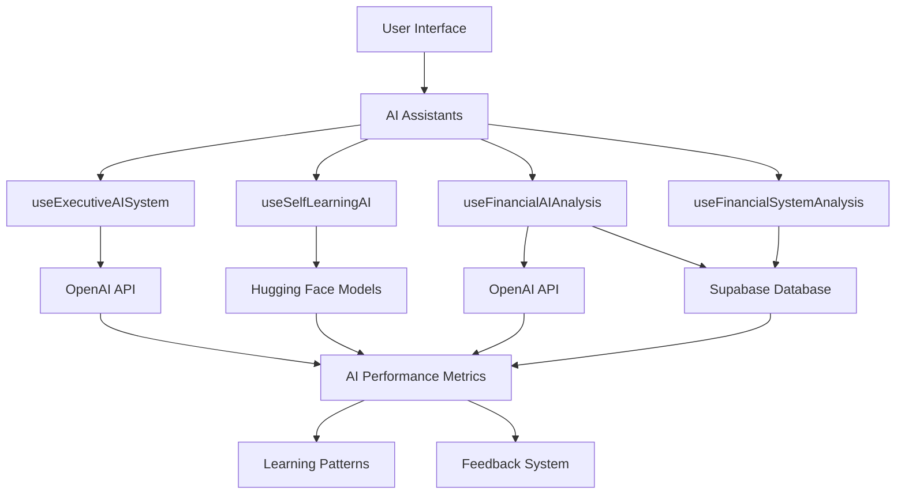
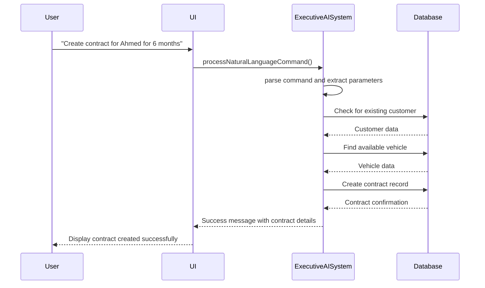
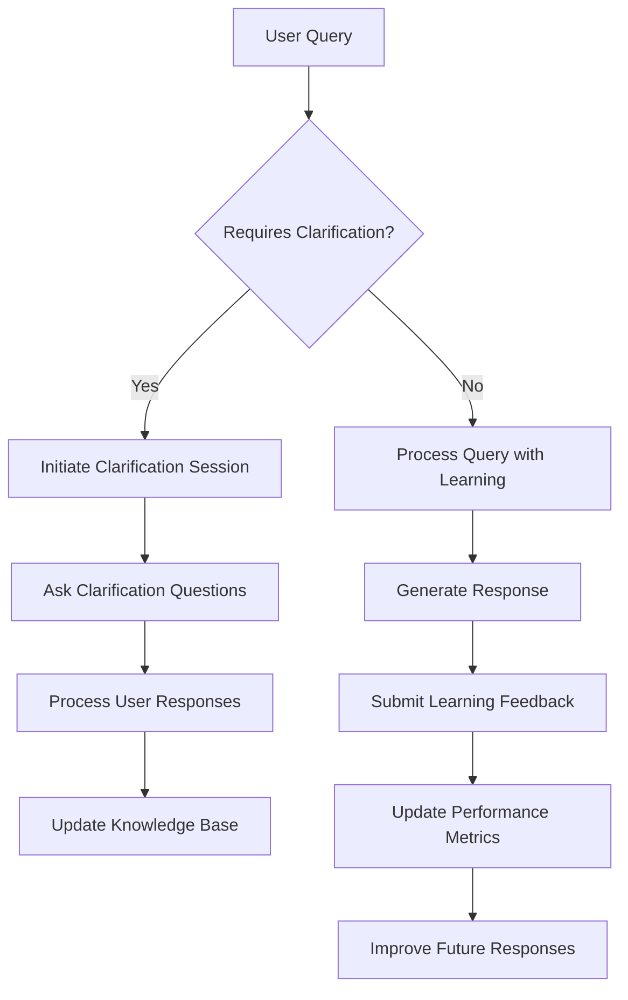
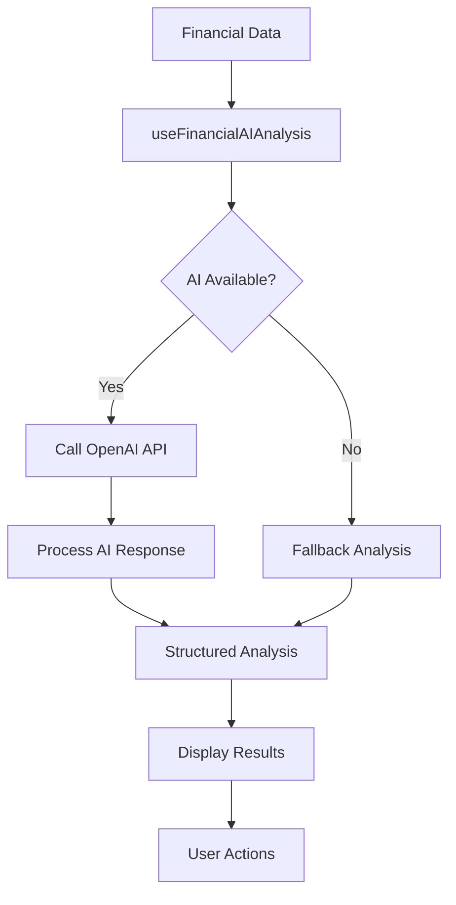
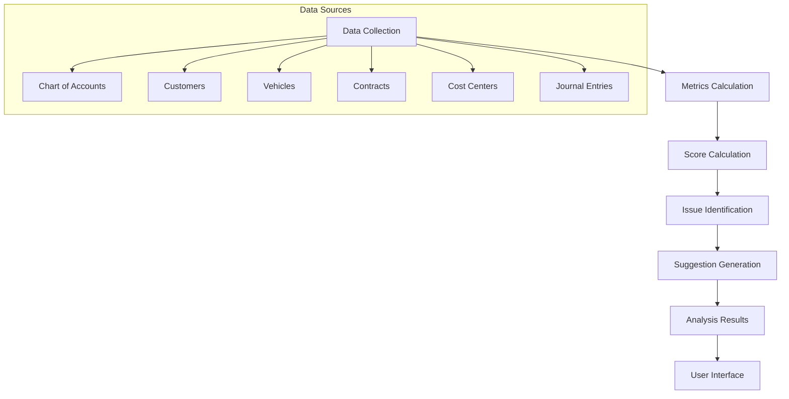
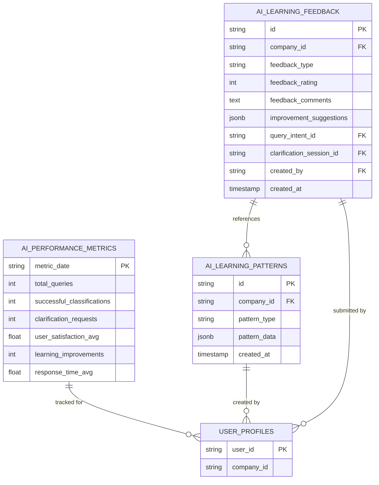

# AI System

<cite>
**Referenced Files in This Document**   
- [useExecutiveAISystem.ts](file://src\hooks\useExecutiveAISystem.ts) - *Updated in recent commit*
- [useSelfLearningAI.ts](file://src\hooks\useSelfLearningAI.ts) - *Updated in recent commit*
- [AI_INTEGRATION_GUIDE.md](file://AI_INTEGRATION_GUIDE.md) - *Updated in recent commit*
- [FleetifyAI_Dashboard.tsx](file://src\components\finance\FleetifyAI_Dashboard.tsx) - *Updated in recent commit*
- [useFinancialAIAnalysis.ts](file://src\hooks\useFinancialAIAnalysis.ts) - *Added in recent commit*
- [useFinancialSystemAnalysis.ts](file://src\hooks\useFinancialSystemAnalysis.ts) - *Added in recent commit*
- [supabase/functions/financial-analysis-ai/index.ts](file://supabase\functions\financial-analysis-ai\index.ts) - *Added in recent commit*
</cite>

## Update Summary
**Changes Made**   
- Added new section on Financial AI Analysis System to document the newly implemented financial analysis capabilities
- Added new section on Financial System Analysis to document the smart financial system analysis implementation
- Updated Introduction to include new AI capabilities for financial analysis
- Updated AI System Architecture to include new financial AI components
- Added new diagram for Financial AI Analysis System architecture
- Updated Implementation Patterns to include financial AI usage examples
- Added new configuration details for financial AI system
- Updated Section sources and Diagram sources to include newly added files

## Table of Contents
1. [Introduction](#introduction)
2. [AI System Architecture](#ai-system-architecture)
3. [Executive Decision Support](#executive-decision-support)
4. [Self-Learning Capabilities](#self-learning-capabilities)
5. [Business Module Integration](#business-module-integration)
6. [Financial AI Analysis System](#financial-ai-analysis-system)
7. [Financial System Analysis](#financial-system-analysis)
8. [Implementation Patterns](#implementation-patterns)
9. [Configuration and Usage](#configuration-and-usage)
10. [Error Handling and Solutions](#error-handling-and-solutions)

## Introduction

The FleetifyApp AI system provides intelligent decision support and automation capabilities for enterprise management. The system integrates artificial intelligence through OpenAI API and Hugging Face models using custom React hooks such as `useExecutiveAISystem.ts` and `useSelfLearningAI.ts`. This AI integration enables natural language processing, executive decision support, and self-learning capabilities across various business modules including finance, contracts, and customer management.

The AI system implements the six fundamental AI primitives: Content Creation, Research, Data Analysis, Automation, Coding, and Ideation/Strategy. These primitives are applied across all modules to provide comprehensive intelligent support. The system supports 8 specialized AI assistants that deliver value through interactive interfaces, smart suggestions, and automated workflows.

Recent updates have expanded the AI system with advanced financial analysis capabilities, including the Financial AI Analysis System and Smart Financial System Analysis. These new components provide deep insights into financial health, identify issues, and offer actionable recommendations for improvement.

**Section sources**
- [AI_INTEGRATION_GUIDE.md](file://AI_INTEGRATION_GUIDE.md#L0-L36)
- [useFinancialAIAnalysis.ts](file://src\hooks\useFinancialAIAnalysis.ts#L34-L145)
- [useFinancialSystemAnalysis.ts](file://src\hooks\useFinancialSystemAnalysis.ts#L49-L154)

## AI System Architecture

The AI system in FleetifyApp follows a modular architecture with specialized hooks for different AI capabilities. The core components include the Executive AI System for command processing, the Self-Learning AI system for adaptive intelligence, and the newly added Financial AI Analysis System for financial insights.



**Diagram sources**
- [useExecutiveAISystem.ts](file://src\hooks\useExecutiveAISystem.ts#L0-L885)
- [useSelfLearningAI.ts](file://src\hooks\useSelfLearningAI.ts#L0-L329)
- [useFinancialAIAnalysis.ts](file://src\hooks\useFinancialAIAnalysis.ts#L34-L145)
- [useFinancialSystemAnalysis.ts](file://src\hooks\useFinancialSystemAnalysis.ts#L49-L154)

The architecture consists of client-side hooks that interface with backend services through Supabase. The system uses edge functions for AI processing, ensuring low latency and secure data handling. AI performance metrics are stored in the database to track system effectiveness and guide improvements.

**Section sources**
- [useExecutiveAISystem.ts](file://src\hooks\useExecutiveAISystem.ts#L0-L885)
- [useSelfLearningAI.ts](file://src\hooks\useSelfLearningAI.ts#L0-L329)
- [useFinancialAIAnalysis.ts](file://src\hooks\useFinancialAIAnalysis.ts#L34-L145)
- [useFinancialSystemAnalysis.ts](file://src\hooks\useFinancialSystemAnalysis.ts#L49-L154)

## Executive Decision Support

The Executive AI System provides intelligent command processing and decision support through natural language understanding. The `useExecutiveAISystem` hook enables users to perform complex operations using natural language commands.

The system supports various executive operations including:
- Customer management (create, update, blacklist)
- Contract lifecycle management (create, renew, suspend, terminate)
- Vehicle operations (create, update status, assign driver)
- Financial transactions (create invoice, record payment)
- Maintenance scheduling and violation registration



**Diagram sources**
- [useExecutiveAISystem.ts](file://src\hooks\useExecutiveAISystem.ts#L62-L882)

The system analyzes natural language input to identify operations and extract parameters. Commands are processed through a parsing engine that identifies key entities and intents. The system then executes operations through Supabase database interactions, providing real-time feedback on success or failure.

**Section sources**
- [useExecutiveAISystem.ts](file://src\hooks\useExecutiveAISystem.ts#L62-L882)

## Self-Learning Capabilities

The Self-Learning AI system enables adaptive intelligence through continuous learning from user interactions. The `useSelfLearningAI` hook provides capabilities for query processing, clarification sessions, and feedback collection.

Key features of the self-learning system include:
- Intent classification with confidence scoring
- Clarification sessions for ambiguous queries
- Performance metrics tracking
- Learning feedback submission
- Adaptive response improvement



**Diagram sources**
- [useSelfLearningAI.ts](file://src\hooks\useSelfLearningAI.ts#L73-L328)

The system uses edge functions to process queries and generate responses. When a query requires clarification, the system initiates a clarification session to gather additional information. User feedback is collected and used to improve future responses. Performance metrics are tracked over time to measure system effectiveness.

**Section sources**
- [useSelfLearningAI.ts](file://src\hooks\useSelfLearningAI.ts#L73-L328)

## Business Module Integration

The AI system is integrated across various business modules in FleetifyApp, providing specialized capabilities for each domain.

### Finance Module Integration
The AI system enhances financial operations through intelligent suggestions and automated processing. The FleetifyAI Dashboard provides comprehensive financial insights and recommendations.

```mermaid
classDiagram
class FleetifyAI_Dashboard {
+processSelectedItems()
+handleProcessSelected()
+renderResultsTable()
+displayAnalytics()
}
class AISmartParentSelector {
+getIconForCategory()
+getCategoryColor()
+getConfidenceColor()
}
class SuggestionAnalyticsDashboard {
+displayAccuracyMetrics()
+showLearningNotifications()
+analyzeAccountNames()
}
FleetifyAI_Dashboard --> AISmartParentSelector : "uses"
FleetifyAI_Dashboard --> SuggestionAnalyticsDashboard : "includes"
AISmartParentSelector --> "AI Suggestions" : "displays"
```

**Diagram sources**
- [FleetifyAI_Dashboard.tsx](file://src\components\finance\FleetifyAI_Dashboard.tsx#L320-L352)
- [AISmartParentSelector.tsx](file://src\components\finance\enhanced-editing\AISmartParentSelector.tsx#L27-L71)
- [SuggestionAnalyticsDashboard.tsx](file://src\components\finance\enhanced-editing\SuggestionAnalyticsDashboard.tsx#L146-L174)

### Contracts Module Integration
The AI system provides intelligent contract processing, including risk analysis, clause suggestions, and automated contract generation. The system can extract key terms from natural language input and populate contract templates accordingly.

### Customer Management Integration
AI capabilities enhance customer management through intelligent customer creation, account linking, and financial analysis. The system provides smart suggestions for customer accounts and identifies potential duplicates.

**Section sources**
- [FleetifyAI_Dashboard.tsx](file://src\components\finance\FleetifyAI_Dashboard.tsx#L320-L352)
- [AISmartParentSelector.tsx](file://src\components\finance\enhanced-editing\AISmartParentSelector.tsx#L27-L71)

## Financial AI Analysis System

The Financial AI Analysis System provides advanced financial insights and recommendations through integration with OpenAI's API. The `useFinancialAIAnalysis` hook enables deep analysis of financial system health, identifying issues and providing actionable recommendations.

Key features of the Financial AI Analysis System include:
- Comprehensive financial system assessment
- Risk level evaluation (low, medium, high, critical)
- Confidence scoring based on data quality
- Structured recommendations for improvement
- Urgent action identification
- Fallback analysis when AI is unavailable



**Diagram sources**
- [useFinancialAIAnalysis.ts](file://src\hooks\useFinancialAIAnalysis.ts#L34-L145)
- [supabase/functions/financial-analysis-ai/index.ts](file://supabase\functions\financial-analysis-ai\index.ts#L0-L197)

The system works by collecting financial metrics from various sources and sending them to the OpenAI API for analysis. The response is then parsed into a structured format with confidence scores, risk levels, and actionable recommendations. If the AI service is unavailable, a fallback analysis is provided based on the raw data.

**Section sources**
- [useFinancialAIAnalysis.ts](file://src\hooks\useFinancialAIAnalysis.ts#L34-L145)
- [supabase/functions/financial-analysis-ai/index.ts](file://supabase\functions\financial-analysis-ai\index.ts#L0-L197)

## Financial System Analysis

The Financial System Analysis component provides a comprehensive assessment of the financial system's health and performance. The `useFinancialSystemAnalysis` hook collects data from multiple tables and calculates various metrics to evaluate different aspects of the financial system.

Key metrics calculated by the Financial System Analysis include:
- Chart of Accounts Score: Evaluates the completeness and structure of the chart of accounts
- Linkage Score: Measures how well entities are linked to accounting records
- Cost Centers Score: Assesses the effectiveness of cost center implementation
- Operations Score: Evaluates the quality and completeness of financial operations
- Overall Score: Composite score combining all metrics



**Diagram sources**
- [useFinancialSystemAnalysis.ts](file://src\hooks\useFinancialSystemAnalysis.ts#L49-L154)

The system identifies specific issues such as missing accounts, unlinked entities, and improperly configured cost centers. It also generates targeted suggestions for improvement, prioritized by impact and urgency. This analysis serves as the foundation for the Financial AI Analysis System, providing the raw data for deeper AI-powered insights.

**Section sources**
- [useFinancialSystemAnalysis.ts](file://src\hooks\useFinancialSystemAnalysis.ts#L49-L154)

## Implementation Patterns

The AI system follows consistent implementation patterns across the application, making it easy to extend and maintain.

### Hook Usage Pattern
The custom AI hooks follow a standard pattern for initialization and usage:

```typescript
// Configuration interface
interface AIConfig {
  module: string;
  primitives: string[];
  context: Record<string, any>;
  priority: string;
  enabledFeatures: string[];
}

// Hook usage for financial AI analysis
const { data: aiAnalysis, isLoading } = useFinancialAIAnalysis(financialData);

// Hook usage for financial system analysis
const { data: systemAnalysis, isLoading } = useFinancialSystemAnalysis();

// Hook usage for executive AI system
const { 
  executeTask, 
  analyzeData, 
  generateContent, 
  isLoading 
} = useAIAssistant(aiConfig);
```

### Floating AI Assistant
The system includes a floating AI assistant component that provides interactive support across all pages:

```typescript
<FloatingAIAssistant 
  config={aiConfig}
  defaultPosition={{ x: 400, y: 100 }}
/>
```

This component provides a consistent user interface for AI interactions, with drag-and-drop functionality and context-aware suggestions.

**Section sources**
- [AI_INTEGRATION_GUIDE.md](file://AI_INTEGRATION_GUIDE.md#L196-L248)
- [useFinancialAIAnalysis.ts](file://src\hooks\useFinancialAIAnalysis.ts#L34-L145)
- [useFinancialSystemAnalysis.ts](file://src\hooks\useFinancialSystemAnalysis.ts#L49-L154)

## Configuration and Usage

The AI system provides flexible configuration options for different use cases and business requirements.

### AI Provider Configuration
The system supports multiple AI providers through configuration settings. Providers can be configured for specific modules or globally across the application. The Financial AI Analysis System uses OpenAI's API with configurable model parameters:

```typescript
// Configuration in edge function
const response = await fetch('https://api.openai.com/v1/chat/completions', {
  method: 'POST',
  headers: {
    'Authorization': `Bearer ${openAIApiKey}`,
    'Content-Type': 'application/json',
  },
  body: JSON.stringify({
    model: 'gpt-4o-mini',
    messages: [
      { role: 'system', content: systemPrompt },
      { role: 'user', content: userPrompt }
    ],
    temperature: 0.3,
    max_tokens: 2000,
  }),
});
```

### Usage Patterns
AI-powered features are implemented through consistent usage patterns:

1. **Command Processing**: Natural language commands are processed through the Executive AI System
2. **Smart Suggestions**: Context-aware suggestions are provided in forms and data entry interfaces
3. **Automated Workflows**: Routine tasks are automated based on user behavior patterns
4. **Intelligent Analysis**: Data analysis and insights are generated automatically
5. **Financial Assessment**: Comprehensive financial system analysis and AI-powered recommendations

The system tracks performance metrics including processing speed, AI confidence levels, and user satisfaction to continuously improve the AI capabilities.



**Diagram sources**
- [useSelfLearningAI.ts](file://src\hooks\useSelfLearningAI.ts#L277-L328)
- [useExecutiveAISystem.ts](file://src\hooks\useExecutiveAISystem.ts#L841-L883)
- [useFinancialAIAnalysis.ts](file://src\hooks\useFinancialAIAnalysis.ts#L34-L145)
- [supabase/functions/financial-analysis-ai/index.ts](file://supabase\functions\financial-analysis-ai\index.ts#L0-L197)

**Section sources**
- [useSelfLearningAI.ts](file://src\hooks\useSelfLearningAI.ts#L277-L328)
- [useExecutiveAISystem.ts](file://src\hooks\useExecutiveAISystem.ts#L841-L883)
- [useFinancialAIAnalysis.ts](file://src\hooks\useFinancialAIAnalysis.ts#L34-L145)
- [supabase/functions/financial-analysis-ai/index.ts](file://supabase\functions\financial-analysis-ai\index.ts#L0-L197)

## Error Handling and Solutions

The AI system implements comprehensive error handling to ensure reliability and provide meaningful feedback to users.

### Common Issues and Solutions

#### Natural Language Processing Failures
When the system cannot understand a natural language command, it provides clear feedback and suggests rephrasing:

```typescript
if (commands.length === 0) {
  toast.error('Unable to understand the command. Please rephrase.');
  return {
    success: false,
    message: 'Unable to understand the requested command.',
    commands: []
  };
}
```

#### API Integration Errors
The system handles API integration errors gracefully, providing fallback mechanisms and error recovery:

```typescript
try {
  const { data: response, error } = await supabase.functions.invoke('self-learning-ai', {
    body: { /* request data */ }
  });

  if (error) {
    console.error('Self-learning AI error:', error);
    throw new Error(`AI processing failed: ${error.message}`);
  }
} catch (error) {
  return {
    response: 'An error occurred processing your request. Please try again.',
    confidence: 0,
    intent_classification: 'error',
    requires_clarification: false,
    learning_applied: false
  };
}
```

#### Financial AI Analysis Failures
The Financial AI Analysis System includes robust fallback mechanisms when the AI service is unavailable:

```typescript
if (data?.error) {
  console.error('[useFinancialAIAnalysis] AI analysis error:', data.error);
  
  // Return fallback analysis if AI fails
  return {
    analysis: `تحليل أساسي للنظام المالي:

النتيجة الإجمالية: ${analysisData.overallScore}%

المجالات التي تحتاج تحسين:
${analysisData.chartOfAccountsScore < 80 ? '• دليل الحسابات يحتاج تطوير' : ''}
${analysisData.linkageScore < 80 ? '• ربط الحسابات بالكيانات يحتاج تحسين' : ''}
${analysisData.costCentersScore < 80 ? '• مراكز التكلفة تحتاج تطوير' : ''}
${analysisData.operationsScore < 80 ? '• العمليات المالية تحتاج مراجعة' : ''}

يُنصح بالتركيز على المجالات ذات النقاط الأقل لتحسين الأداء العام للنظام المالي.`,
    confidence: analysisData.overallScore,
    recommendations: [
      'تحسين ربط العملاء بالحسابات المحاسبية',
      'إنشاء مراكز تكلفة إضافية للأنشطة المختلفة',
      'مراجعة وتحديث هيكل دليل الحسابات',
      'تطوير نظام المتابعة المالية'
    ],
    riskLevel: analysisData.overallScore < 50 ? 'critical' : 
              analysisData.overallScore < 70 ? 'high' : 'medium',
    urgentActions: [
      'مراجعة الحسابات غير المربوطة',
      'تحديث مراكز التكلفة المفقودة'
    ],
    timestamp: new Date().toISOString()
  };
}
```

#### Data Validation Issues
Input validation is performed at multiple levels to prevent injection attacks and ensure data integrity:
- Input sanitization for all user inputs
- Permission verification before operations
- Comprehensive activity logging
- Encryption of sensitive data

The system follows security best practices including input cleaning, permission verification before operations, comprehensive logging of sensitive activities, and encryption of stored and transmitted data.

**Section sources**
- [useExecutiveAISystem.ts](file://src\hooks\useExecutiveAISystem.ts#L62-L882)
- [useSelfLearningAI.ts](file://src\hooks\useSelfLearningAI.ts#L73-L328)
- [useFinancialAIAnalysis.ts](file://src\hooks\useFinancialAIAnalysis.ts#L34-L145)