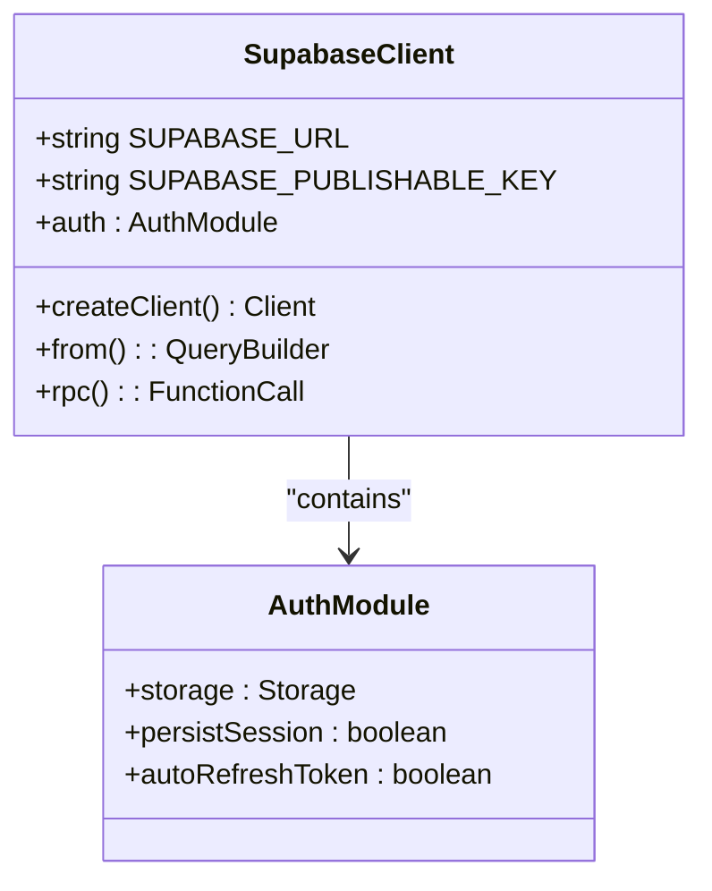
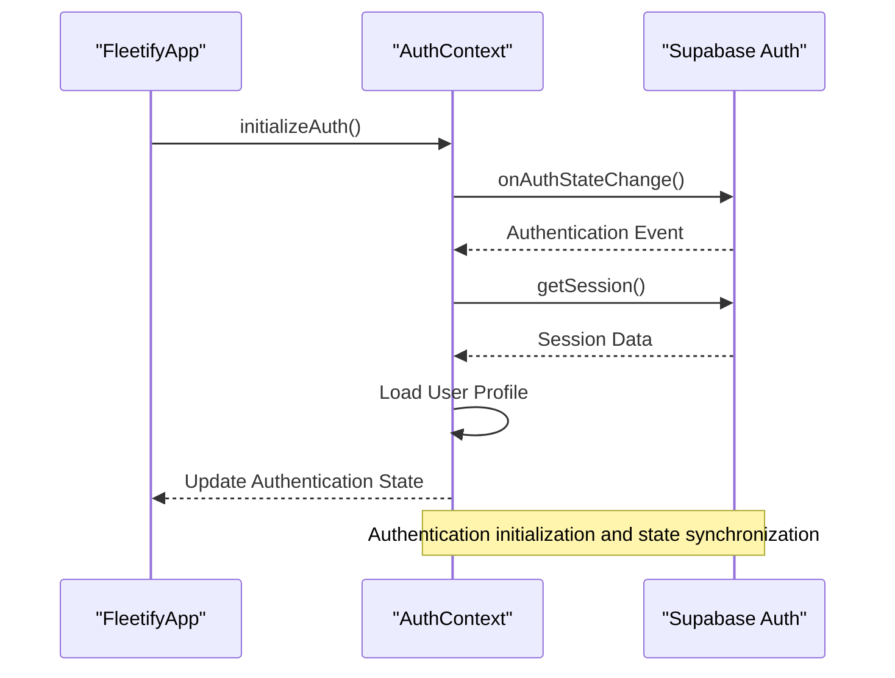
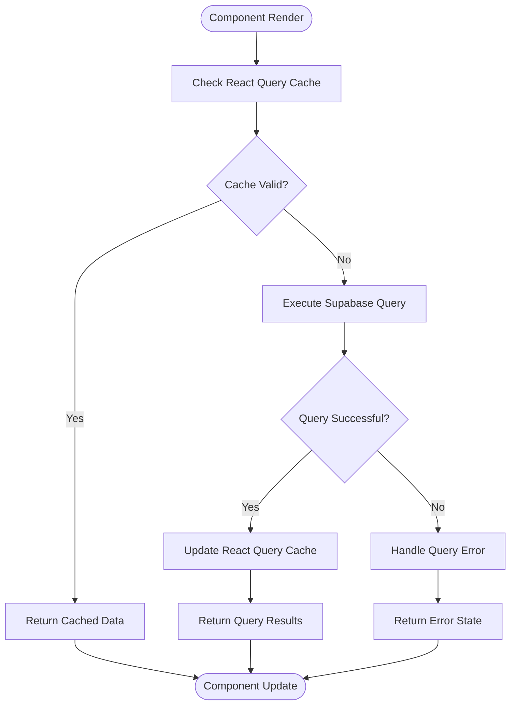
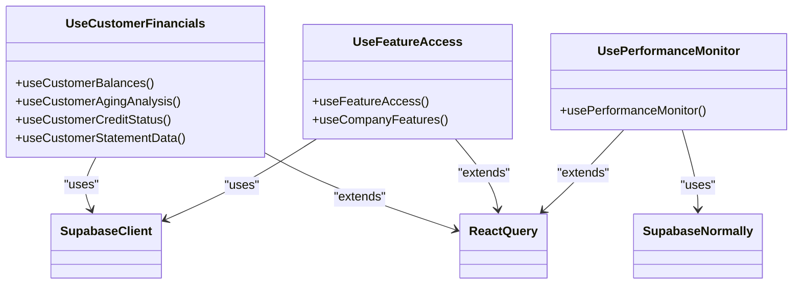
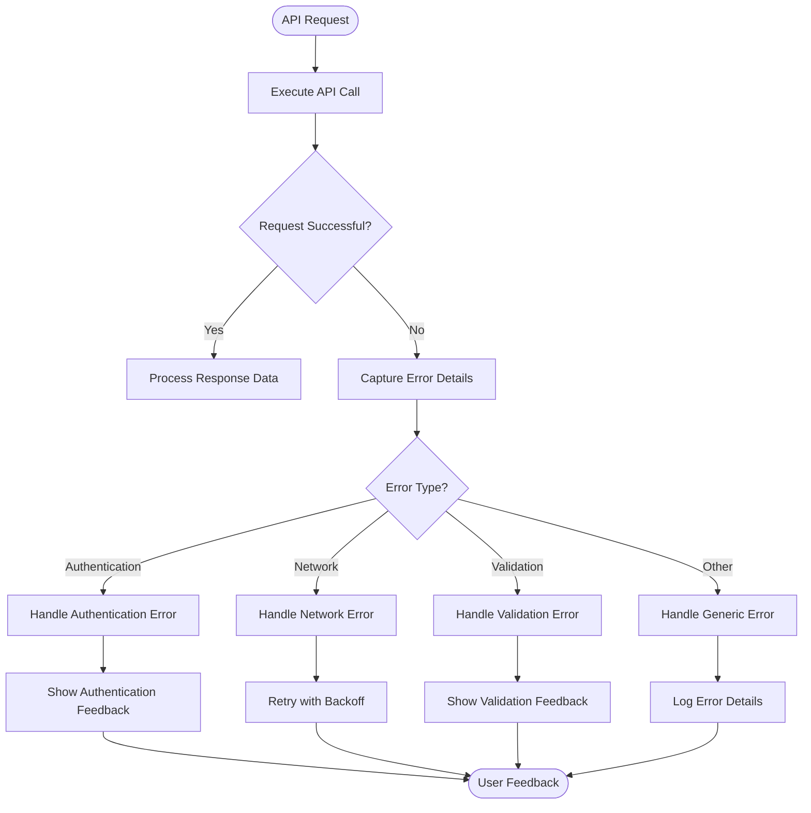

# API Integration

<cite>
**Referenced Files in This Document**   
- [client.ts](file://src/integrations/supabase/client.ts)
- [AuthContext.tsx](file://src/contexts/AuthContext.tsx)
- [useEnhancedCustomerFinancials.ts](file://src/hooks/useEnhancedCustomerFinancials.ts)
- [useFeatureAccess.ts](file://src/hooks/useFeatureAccess.ts)
- [utils.ts](file://src/lib/utils.ts)
</cite>

## Table of Contents
1. [Introduction](#introduction)
2. [API Client Configuration](#api-client-configuration)
3. [Authentication and Session Management](#authentication-and-session-management)
4. [Data Querying with React Query](#data-querying-with-react-query)
5. [Real-Time Subscriptions](#real-time-subscriptions)
6. [Custom Hooks Architecture](#custom-hooks-architecture)
7. [State Management Integration](#state-management-integration)
8. [Error Handling Strategies](#error-handling-strategies)
9. [API Rate Limiting and Performance](#api-rate-limiting-and-performance)
10. [Configuration and Usage Patterns](#configuration-and-usage-patterns)

## Introduction

The API integration system in FleetifyApp serves as the critical bridge between the frontend application and the Supabase backend, enabling seamless data exchange and real-time functionality. This system is designed to provide a robust, scalable, and maintainable approach to API communication, leveraging Supabase's powerful PostgreSQL-based backend and real-time capabilities. The integration architecture follows modern React patterns, utilizing React Query for data fetching and state management, custom hooks for encapsulation, and Supabase's authentication system for secure access control. This documentation provides comprehensive coverage of the API integration system, from foundational configuration to advanced usage patterns, catering to both beginners seeking conceptual understanding and experienced developers requiring technical implementation details.

## API Client Configuration

The foundation of the API integration system is the Supabase client configured in `client.ts`, which establishes the connection between the frontend application and the Supabase backend. This client is configured with the necessary environment variables, including the Supabase URL and publishable key, to enable secure communication with the database. The client is exported as a singleton instance, ensuring consistent configuration across the entire application. The configuration includes essential authentication settings such as localStorage persistence, session persistence, and automatic token refresh, which work together to maintain a seamless user experience. This centralized client configuration serves as the entry point for all API interactions, providing a unified interface for data querying, authentication, and real-time subscriptions. The client is strongly typed using the Database type from Supabase, ensuring type safety throughout the application and reducing the likelihood of runtime errors.

**Diagram sources**
- [client.ts](file://src/integrations/supabase/client.ts#L1-L16)

**Section sources**
- [client.ts](file://src/integrations/supabase/client.ts#L1-L16)

## Authentication and Session Management

Authentication in FleetifyApp is implemented through a comprehensive system that integrates Supabase's authentication capabilities with React's context API. The `AuthContext` provides a centralized state management solution for user authentication, handling session state, user profile data, and authentication events across the application. This context establishes an authentication state listener that responds to various authentication events such as sign-in, sign-out, and token refresh, ensuring that the application state remains synchronized with the authentication state. The system includes robust error handling for authentication failures, session expiration, and token refresh issues, providing appropriate user feedback and recovery mechanisms. The authentication flow is designed to be resilient, with safety timeouts to prevent infinite loading states and comprehensive logging of authentication events for auditing and debugging purposes.

**Diagram sources**
- [AuthContext.tsx](file://src/contexts/AuthContext.tsx#L0-L249)

**Section sources**
- [AuthContext.tsx](file://src/contexts/AuthContext.tsx#L0-L249)

## Data Querying with React Query

Data querying in FleetifyApp is implemented using React Query, a powerful state management library that simplifies data fetching, caching, and synchronization. The integration with Supabase enables efficient data retrieval through the client's query methods, which are wrapped in React Query hooks to provide automatic caching, background refetching, and stale data handling. This approach eliminates the need for manual state management and reduces boilerplate code, allowing developers to focus on business logic rather than data fetching mechanics. The system implements intelligent refetch intervals based on data volatility, with frequently changing data configured for more frequent updates and static data cached for longer periods. Query keys are carefully designed to include relevant parameters such as user ID and company ID, ensuring proper cache invalidation and data consistency across different user contexts.

**Section sources**
- [useEnhancedCustomerFinancials.ts](file://src/hooks/useEnhancedCustomerFinancials.ts#L0-L268)
- [useFeatureAccess.ts](file://src/hooks/useFeatureAccess.ts#L0-L82)

## Real-Time Subscriptions

The API integration system supports real-time data synchronization through Supabase's real-time capabilities, enabling instant updates across clients when data changes in the database. This feature is particularly valuable for collaborative environments where multiple users may be interacting with the same data simultaneously. The real-time subscription system is built on WebSockets, providing low-latency communication between the client and server. When a subscription is established, the client receives immediate notifications of changes, allowing the UI to update without requiring manual refreshes or polling. This architecture significantly improves user experience by providing instant feedback and maintaining data consistency across all connected clients. The system handles subscription lifecycle events such as connection establishment, reconnection after network interruptions, and graceful degradation when real-time capabilities are unavailable.

## Custom Hooks Architecture

The API integration system employs a custom hooks architecture in the `src/hooks/` directory to encapsulate API calls and data fetching logic, promoting code reuse and maintainability. These custom hooks abstract the complexity of direct API interactions, providing a clean, consistent interface for components to access data. Each hook is designed around specific business domains such as customer financials, feature access, and performance monitoring, following the single responsibility principle. The hooks leverage React Query's useQuery and useMutation hooks to handle data fetching, caching, and mutation operations, while adding domain-specific logic for error handling, data transformation, and side effects. This architectural approach enables components to remain focused on presentation logic while delegating data operations to specialized hooks, resulting in cleaner, more testable code.

**Diagram sources**
- [useEnhancedCustomerFinancials.ts](file://src/hooks/useEnhancedCustomerFinancials.ts#L0-L268)
- [useFeatureAccess.ts](file://src/hooks/useFeatureAccess.ts#L0-L82)
- [usePerformanceMonitor.ts](file://src/hooks/usePerformanceMonitor.ts#L0-L48)

**Section sources**
- [useEnhancedCustomerFinancials.ts](file://src/hooks/useEnhancedCustomerFinancials.ts#L0-L268)
- [useFeatureAccess.ts](file://src/hooks/useFeatureAccess.ts#L0-L82)
- [usePerformanceMonitor.ts](file://src/hooks/usePerformanceMonitor.ts#L0-L48)

## State Management Integration

The API integration system is tightly integrated with the application's state management architecture, creating a cohesive data flow from the backend to the UI. React Query serves as the primary state management solution for server state, handling data caching, synchronization, and updates automatically. This integration eliminates the need for traditional global state management solutions for server data, reducing complexity and potential sources of bugs. The system implements a clear separation between server state managed by React Query and client state managed by React's useState and context APIs. When data changes occur, whether through user interactions or real-time updates, the state management system ensures that all dependent components are updated efficiently. The integration also handles complex state transitions, such as loading states, error states, and optimistic updates, providing a smooth user experience during data operations.

## Error Handling Strategies

The API integration system implements comprehensive error handling strategies to ensure robustness and provide meaningful feedback to users. Errors are categorized and handled at multiple levels, from network-level issues to application-specific validation errors. The system captures detailed error information, including error codes, messages, and contextual data, which is used to provide appropriate user feedback and facilitate debugging. For authentication-related errors, the system provides specific guidance based on the error type, such as prompting users to check their credentials or informing them of session expiration. Network errors trigger automatic retry mechanisms with exponential backoff, improving resilience in unstable network conditions. The error handling system is integrated with the application's toast notification system, ensuring that users are informed of issues in a non-intrusive manner while maintaining application stability.

**Section sources**
- [useEnhancedCustomerFinancials.ts](file://src/hooks/useEnhancedCustomerFinancials.ts#L111-L149)
- [useFeatureAccess.ts](file://src/hooks/useFeatureAccess.ts#L0-L82)
- [utils.ts](file://src/lib/utils.ts)

## API Rate Limiting and Performance

The API integration system addresses performance considerations and potential rate limiting issues through several optimization strategies. The system implements intelligent caching with appropriate stale times and refetch intervals, reducing the number of redundant API calls and minimizing server load. For frequently accessed data, the system leverages React Query's built-in caching mechanisms to serve data from memory when possible, significantly improving response times. The integration also implements debouncing and throttling for user-triggered API calls, preventing excessive requests during rapid user interactions. For operations that may be rate-limited, such as bulk data updates, the system implements queuing mechanisms and batch processing to distribute load over time. These performance optimizations ensure that the application remains responsive and reliable, even under heavy usage conditions.

## Configuration and Usage Patterns

The API integration system follows consistent configuration and usage patterns that promote maintainability and developer productivity. Configuration options for API endpoints are centralized in the Supabase client, with environment-specific settings managed through configuration files. The system encourages the use of custom hooks for all API interactions, providing a standardized interface for data access across the application. Usage patterns emphasize the separation of concerns, with data fetching logic isolated from presentation components. The system also promotes the use of TypeScript interfaces to define data structures, ensuring type safety and improving code documentation. For efficient data loading, the system implements pagination, filtering, and selective field retrieval to minimize payload sizes and improve performance. These consistent patterns and best practices enable developers to quickly understand and extend the API integration system while maintaining code quality and reliability.