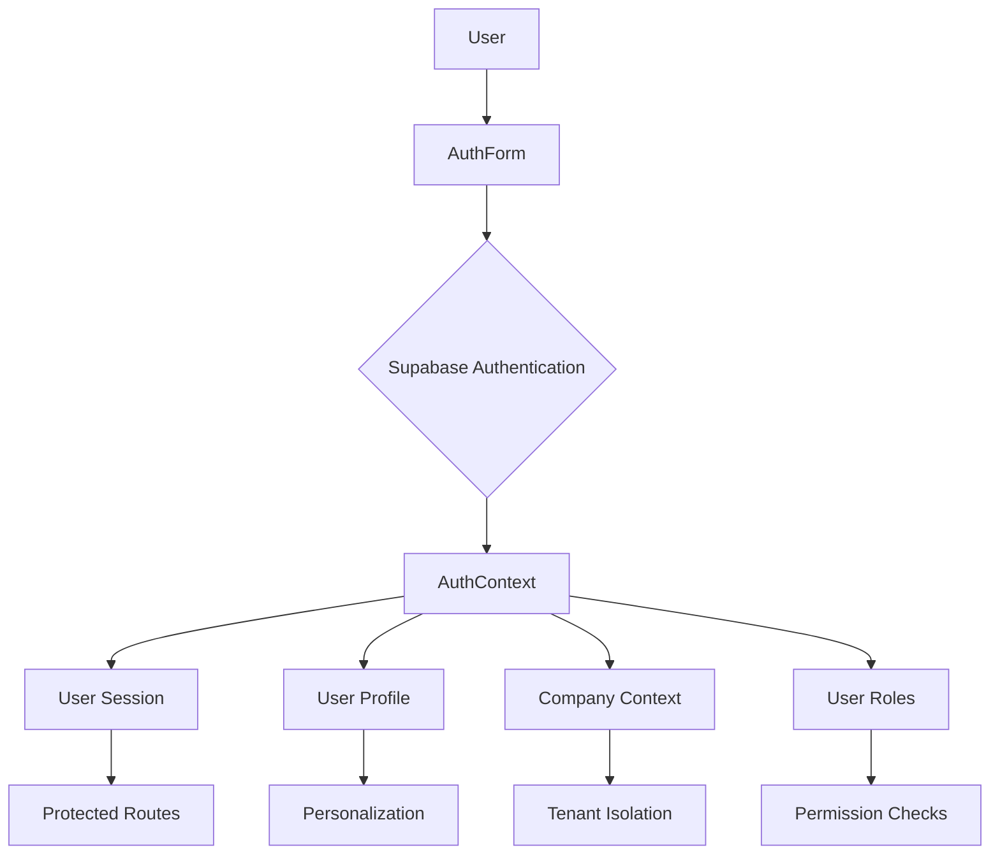
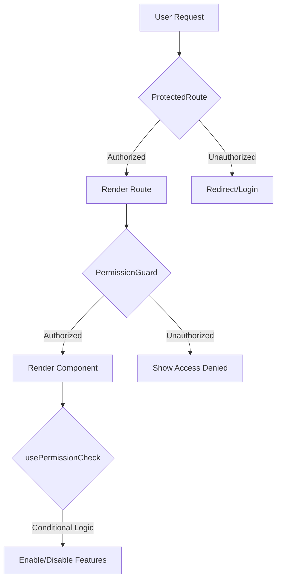
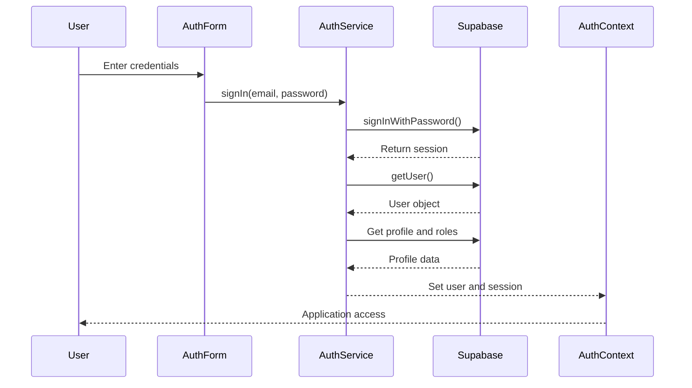
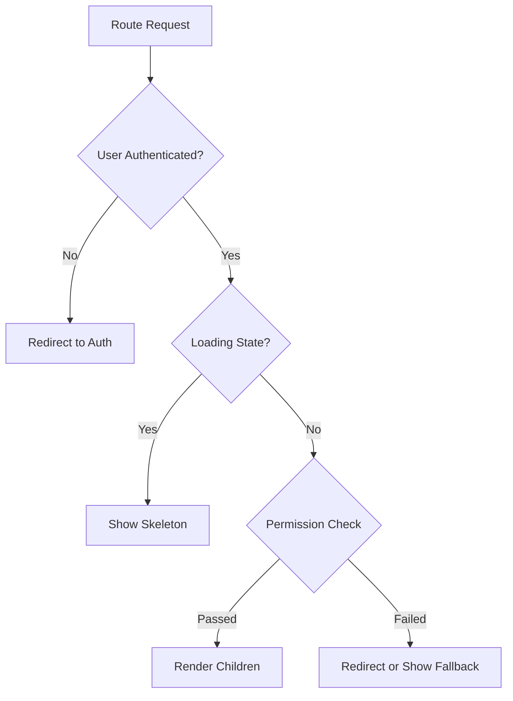
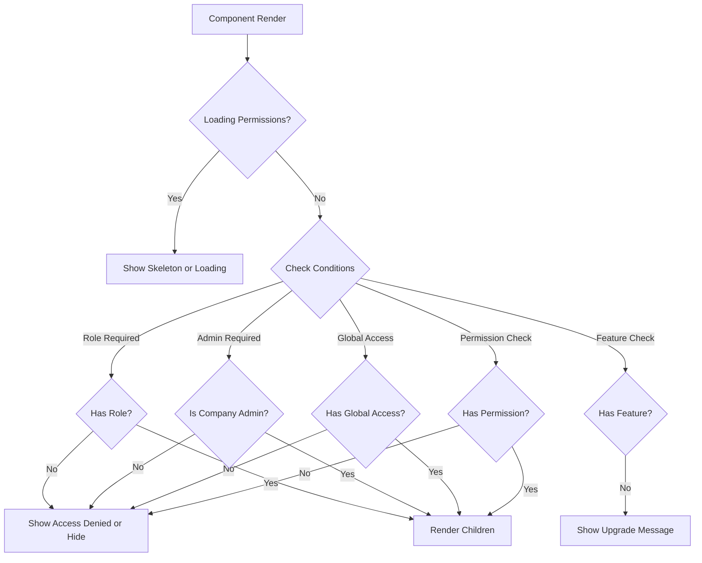
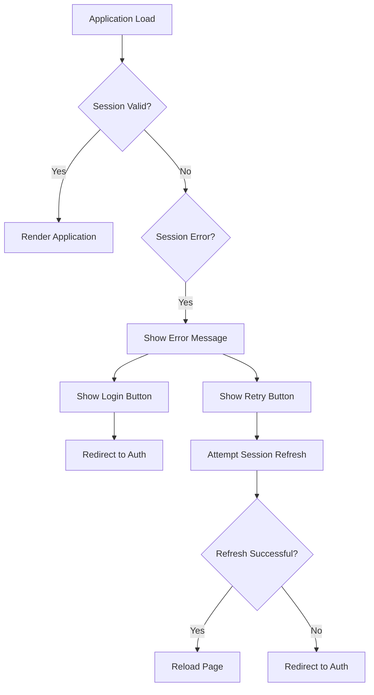

# Authentication & Authorization

<cite>
**Referenced Files in This Document**   
- [AuthContext.tsx](file://src/contexts/AuthContext.tsx)
- [auth.ts](file://src/lib/auth.ts)
- [ProtectedRoute.tsx](file://src/components/common/ProtectedRoute.tsx)
- [PermissionGuard.tsx](file://src/components/common/PermissionGuard.tsx)
- [usePermissionCheck.ts](file://src/hooks/usePermissionCheck.ts)
- [SessionValidator.tsx](file://src/components/auth/SessionValidator.tsx)
</cite>

## Table of Contents
1. [Introduction](#introduction)
2. [Authentication System Overview](#authentication-system-overview)
3. [Authorization Architecture](#authorization-architecture)
4. [Authentication Flow](#authentication-flow)
5. [Authorization Implementation](#authorization-implementation)
6. [Session Management and Validation](#session-management-and-validation)
7. [Role-Based Access Control](#role-based-access-control)
8. [Common Issues and Solutions](#common-issues-and-solutions)

## Introduction

The authentication and authorization system in FleetifyApp provides secure access control for a multi-tenant enterprise application. This system ensures that users can securely authenticate their identity and access only the resources and functionality appropriate to their roles and permissions. Built on Supabase Authentication, the system integrates with React Context for state management and implements a comprehensive permission system that supports both route-level and component-level protection.

The architecture separates authentication (verifying user identity) from authorization (determining access rights), providing a clear separation of concerns. This document explains both conceptual overviews for new developers and detailed technical implementation for experienced engineers working with the system.

**Section sources**
- [AuthContext.tsx](file://src/contexts/AuthContext.tsx#L1-L250)
- [auth.ts](file://src/lib/auth.ts#L1-L250)

## Authentication System Overview

FleetifyApp uses Supabase Authentication as its core identity management system, integrated through a custom AuthContext that manages the authentication state throughout the application. The system supports multi-tenant architecture by associating users with specific companies and enforcing tenant isolation at the data layer.

The authentication system handles user sign-up, sign-in, sign-out, profile management, and password changes. It also manages session validation and automatic token refreshing to maintain a seamless user experience while ensuring security. User roles and permissions are fetched upon authentication and used throughout the application for authorization decisions.

**Diagram sources**
- [AuthContext.tsx](file://src/contexts/AuthContext.tsx#L1-L250)
- [auth.ts](file://src/lib/auth.ts#L1-L250)

**Section sources**
- [AuthContext.tsx](file://src/contexts/AuthContext.tsx#L1-L250)
- [auth.ts](file://src/lib/auth.ts#L1-L250)

## Authorization Architecture

The authorization architecture in FleetifyApp implements a multi-layered approach to access control, combining role-based access control (RBAC) with fine-grained permission checking. The system uses a combination of route guards, component guards, and hooks to enforce authorization at different levels of the application.

The core components of the authorization system include:
- **ProtectedRoute**: For route-level protection
- **PermissionGuard**: For component-level protection
- **usePermissionCheck**: For programmatic permission checking in components
- **Role-based access**: For administrative hierarchies

This layered approach allows for flexible access control policies, from restricting entire pages to specific UI elements based on user permissions.

**Diagram sources**
- [ProtectedRoute.tsx](file://src/components/common/ProtectedRoute.tsx#L1-L100)
- [PermissionGuard.tsx](file://src/components/common/PermissionGuard.tsx#L1-L210)

**Section sources**
- [ProtectedRoute.tsx](file://src/components/common/ProtectedRoute.tsx#L1-L100)
- [PermissionGuard.tsx](file://src/components/common/PermissionGuard.tsx#L1-L210)
- [usePermissionCheck.ts](file://src/hooks/usePermissionCheck.ts#L1-L150)

## Authentication Flow

The authentication flow in FleetifyApp follows a standardized pattern using Supabase Authentication with additional application-specific logic for profile management and company context. When a user attempts to authenticate, the system performs the following steps:

1. The user submits credentials through the AuthForm component
2. The request is handled by the authService in auth.ts
3. Supabase Authentication validates the credentials
4. Upon successful authentication, the AuthContext initializes the user session
5. The system fetches the user's profile, roles, and company information
6. The authentication state is made available throughout the application via React Context

The system also handles edge cases such as profile creation for new users and error recovery during the authentication process.

**Diagram sources**
- [AuthContext.tsx](file://src/contexts/AuthContext.tsx#L1-L250)
- [auth.ts](file://src/lib/auth.ts#L1-L250)

**Section sources**
- [AuthContext.tsx](file://src/contexts/AuthContext.tsx#L1-L250)
- [auth.ts](file://src/lib/auth.ts#L1-L250)

## Authorization Implementation

The authorization implementation in FleetifyApp provides multiple mechanisms for enforcing access control, allowing developers to choose the appropriate method based on their use case.

### Route Protection with ProtectedRoute

The ProtectedRoute component guards access to entire routes based on user permissions, roles, or features. It can be configured with various parameters:

**Diagram sources**
- [ProtectedRoute.tsx](file://src/components/common/ProtectedRoute.tsx#L1-L100)

### Component Protection with PermissionGuard

The PermissionGuard component provides fine-grained control over UI elements, allowing conditional rendering based on permissions:

**Diagram sources**
- [PermissionGuard.tsx](file://src/components/common/PermissionGuard.tsx#L1-L210)

### Programmatic Permission Checking

The usePermissionCheck hook allows for programmatic permission checking within components, enabling dynamic UI behavior based on user permissions.

**Section sources**
- [ProtectedRoute.tsx](file://src/components/common/ProtectedRoute.tsx#L1-L100)
- [PermissionGuard.tsx](file://src/components/common/PermissionGuard.tsx#L1-L210)
- [usePermissionCheck.ts](file://src/hooks/usePermissionCheck.ts#L1-L150)

## Session Management and Validation

FleetifyApp implements robust session management to maintain user authentication state and handle session expiration gracefully. The system uses Supabase's built-in session management with additional application-level validation and error handling.

The SessionValidator component plays a crucial role in handling expired or invalid sessions by intercepting requests and prompting users to re-authenticate when necessary. It monitors the sessionError state from AuthContext and provides appropriate UI feedback and recovery options.

**Diagram sources**
- [SessionValidator.tsx](file://src/components/auth/SessionValidator.tsx#L1-L110)
- [AuthContext.tsx](file://src/contexts/AuthContext.tsx#L1-L250)

**Section sources**
- [SessionValidator.tsx](file://src/components/auth/SessionValidator.tsx#L1-L110)
- [AuthContext.tsx](file://src/contexts/AuthContext.tsx#L1-L250)

## Role-Based Access Control

The role-based access control system in FleetifyApp supports a hierarchical structure with multiple roles and fine-grained permissions. The system recognizes three primary roles:

- **super_admin**: Full system access across all tenants
- **company_admin**: Administrative access within a specific company/tenant
- **employee**: Standard user with limited permissions

The usePermissionCheck hook implements a comprehensive permission checking algorithm that considers the user's role, specific granted permissions, and employee status. Company administrators have broad permissions within their company scope but are restricted from system-level operations that require super admin privileges.

The system also checks employee status, ensuring that only active employees with system access can use the application, providing an additional layer of security beyond simple authentication.

**Section sources**
- [usePermissionCheck.ts](file://src/hooks/usePermissionCheck.ts#L1-L150)
- [auth.ts](file://src/lib/auth.ts#L1-L250)

## Common Issues and Solutions

Several common issues can occur in the authentication and authorization system, along with their solutions:

### Session Expiration
When a user's session expires, the system displays a clear error message and provides options to either retry the session validation or log in again. The SessionValidator component handles this scenario gracefully.

### Profile Loading Errors
If a user's profile cannot be loaded, the system attempts to create it using an edge function (create-super-admin-profile) and retries the profile fetch. This ensures that users can access the system even if their profile was not created properly.

### Permission Synchronization
The system uses React Query for permission checks, which provides automatic refetching and caching. This ensures that permission changes are reflected in the UI without requiring a full page refresh.

### Loading States
During authentication initialization, the system shows skeleton loaders to provide feedback while the authentication state is being determined, improving the user experience during the initial load.

**Section sources**
- [AuthContext.tsx](file://src/contexts/AuthContext.tsx#L1-L250)
- [auth.ts](file://src/lib/auth.ts#L1-L250)
- [SessionValidator.tsx](file://src/components/auth/SessionValidator.tsx#L1-L110)
- [usePermissionCheck.ts](file://src/hooks/usePermissionCheck.ts#L1-L150)