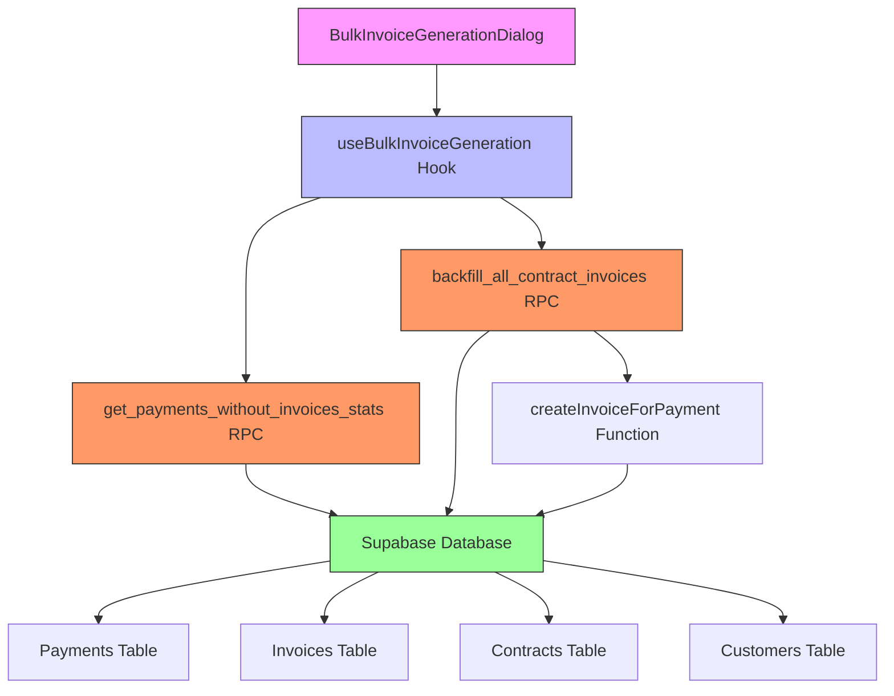
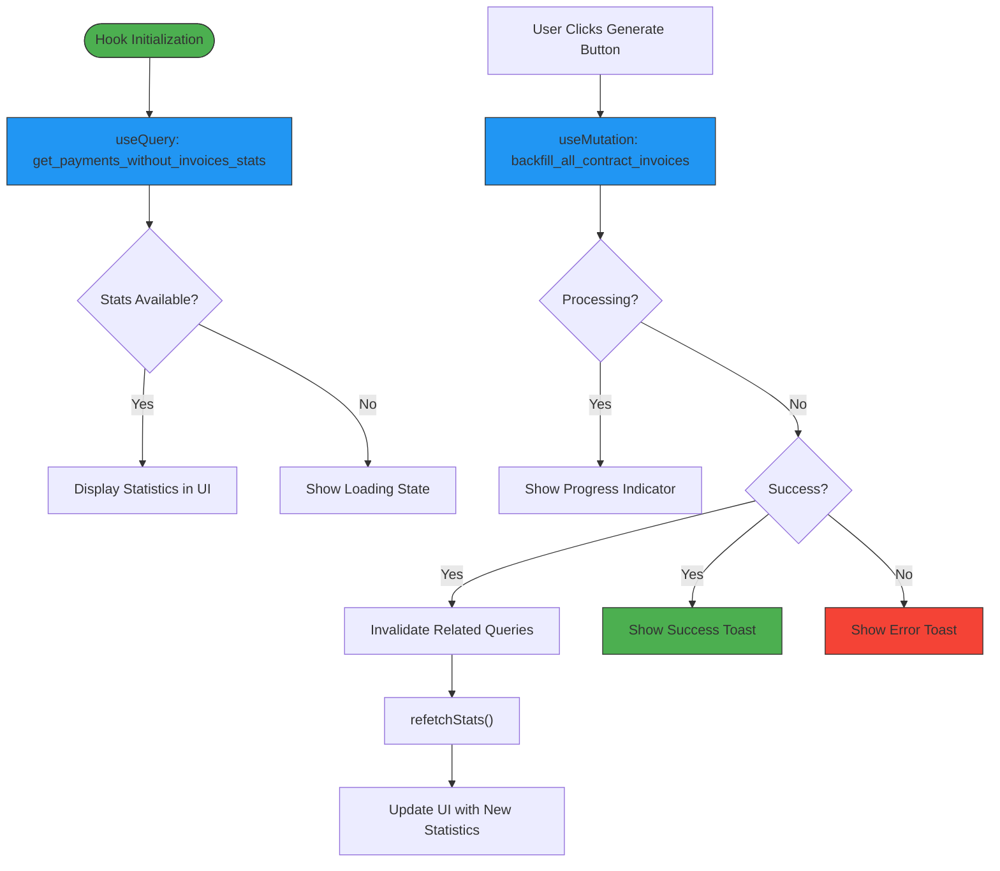

# Bulk Invoice Generation Hooks

<cite>
**Referenced Files in This Document**   
- [useBulkInvoiceGeneration.ts](file://src/hooks/useBulkInvoiceGeneration.ts)
- [BulkInvoiceGenerationDialog.tsx](file://src/components/contracts/BulkInvoiceGenerationDialog.tsx)
- [20250925124613_55db1b61-0c10-412c-9f4d-52100be0a42e.sql](file://supabase/migrations/20250925124613_55db1b61-0c10-412c-9f4d-52100be0a42e.sql)
- [20251011155237_6d753134-22cb-48ea-92de-d393cceb81f9.sql](file://supabase/migrations/20251011155237_6d753134-22cb-48ea-92de-d393cceb81f9.sql)
</cite>

## Table of Contents
1. [Introduction](#introduction)
2. [Core Components](#core-components)
3. [Architecture Overview](#architecture-overview)
4. [Detailed Component Analysis](#detailed-component-analysis)
5. [Integration Patterns](#integration-patterns)
6. [Practical Examples](#practical-examples)
7. [Troubleshooting Guide](#troubleshooting-guide)
8. [Conclusion](#conclusion)

## Introduction

The Bulk Invoice Generation Hooks system provides a comprehensive solution for automatically creating invoices for payments that lack corresponding invoice records. This system addresses data integrity issues by identifying completed payments linked to contracts that don't have associated invoices, then generating the missing invoices in bulk. The implementation combines React hooks for frontend state management with PostgreSQL functions for backend processing, creating a robust and user-friendly experience for financial reconciliation.

The system serves a critical function in maintaining accurate financial records by ensuring that every completed payment has a corresponding invoice, which is essential for proper accounting, reporting, and audit compliance. It is particularly valuable during data migration scenarios, system upgrades, or when addressing historical data inconsistencies.

**Section sources**
- [useBulkInvoiceGeneration.ts](file://src/hooks/useBulkInvoiceGeneration.ts#L29-L115)
- [BulkInvoiceGenerationDialog.tsx](file://src/components/contracts/BulkInvoiceGenerationDialog.tsx#L14-L196)

## Core Components

The Bulk Invoice Generation system consists of two primary components: a React hook (`useBulkInvoiceGeneration`) that manages the application state and API interactions, and a React component (`BulkInvoiceGenerationDialog`) that provides the user interface for initiating and monitoring the bulk invoice creation process. These components work together to provide a seamless experience for users to identify payments without invoices and generate the missing invoice records.

The system leverages React Query for data fetching and mutation management, ensuring optimal performance and automatic cache invalidation after successful operations. It also integrates with Supabase for database operations and authentication, maintaining consistency with the application's overall architecture.

**Section sources**
- [useBulkInvoiceGeneration.ts](file://src/hooks/useBulkInvoiceGeneration.ts#L29-L115)
- [BulkInvoiceGenerationDialog.tsx](file://src/components/contracts/BulkInvoiceGenerationDialog.tsx#L14-L196)

## Architecture Overview



**Diagram sources**
- [useBulkInvoiceGeneration.ts](file://src/hooks/useBulkInvoiceGeneration.ts#L29-L115)
- [BulkInvoiceGenerationDialog.tsx](file://src/components/contracts/BulkInvoiceGenerationDialog.tsx#L14-L196)
- [20250925124613_55db1b61-0c10-412c-9f4d-52100be0a42e.sql#L0-L146)

## Detailed Component Analysis

### useBulkInvoiceGeneration Hook Analysis

The `useBulkInvoiceGeneration` hook is the core logic provider for the bulk invoice generation system. It encapsulates two primary functions: retrieving statistics about payments without invoices and executing the bulk invoice creation process. The hook uses React Query's `useQuery` for fetching statistics and `useMutation` for the bulk generation operation, ensuring proper state management and error handling.



**Diagram sources**
- [useBulkInvoiceGeneration.ts](file://src/hooks/useBulkInvoiceGeneration.ts#L29-L115)

**Section sources**
- [useBulkInvoiceGeneration.ts](file://src/hooks/useBulkInvoiceGeneration.ts#L29-L115)

### BulkInvoiceGenerationDialog Component Analysis

The `BulkInvoiceGenerationDialog` component provides a user-friendly interface for the bulk invoice generation process. It displays comprehensive statistics about payments without invoices, including the total count and amount, broken down by contract. The dialog includes a warning message to inform users that the operation cannot be undone, promoting careful consideration before proceeding.

```mermaid
flowchart TD
A[Dialog Trigger] --> B[Open Dialog]
B --> C[refetchStats()]
C --> D[Load Statistics]
D --> E{Loading?}
E --> |Yes| F[Show Spinner]
E --> |No| G{Stats Available?}
G --> |No| H[Show No Data Message]
G --> |Yes| I[Display Statistics Grid]
I --> J{Payments Without Invoices > 0?}
J --> |Yes| K[Show Warning Card]
J --> |No| L[Show Success Badge]
K --> M[Enable Generate Button]
L --> N[Disable Generate Button]
M --> O[User Clicks Generate]
N --> P[User Clicks Close]
O --> Q[Call generateBulkInvoices()]
Q --> R[Show Processing Card]
R --> S[Show Progress Bar]
S --> T[Wait for Completion]
T --> U[Close Dialog]
P --> U
style A fill:#FF9800,stroke:#333
style F fill:#2196F3,stroke:#333
style H fill:#9E9E9E,stroke:#333
style K fill:#FF9800,stroke:#333
style M fill:#4CAF50,stroke:#333
style N fill:#9E9E9E,stroke:#333
style R fill:#2196F3,stroke:#333
```

**Diagram sources**
- [BulkInvoiceGenerationDialog.tsx](file://src/components/contracts/BulkInvoiceGenerationDialog.tsx#L14-L196)

**Section sources**
- [BulkInvoiceGenerationDialog.tsx](file://src/components/contracts/BulkInvoiceGenerationDialog.tsx#L14-L196)

## Integration Patterns

The Bulk Invoice Generation system follows a well-defined integration pattern between frontend and backend components. The React hook serves as an abstraction layer that isolates the UI components from the underlying API and database implementation details. This separation of concerns allows for independent development and testing of the user interface and business logic.

The system communicates with the backend through Supabase RPC (Remote Procedure Call) functions, which provide a secure and efficient way to execute database operations. The `get_payments_without_invoices_stats` function returns comprehensive statistics about payments without invoices, while the `backfill_all_contract_invoices` function performs the actual bulk creation of missing invoices.

```mermaid
sequenceDiagram
participant UI as BulkInvoiceGenerationDialog
participant Hook as useBulkInvoiceGeneration
participant Supabase as Supabase Client
participant DB as PostgreSQL Database
UI->>Hook : Initialize Hook
Hook->>Supabase : query(get_payments_without_invoices_stats)
Supabase->>DB : Execute Function
DB-->>Supabase : Return Statistics
Supabase-->>Hook : Return Data
Hook-->>UI : Update stats state
UI->>Hook : User clicks Generate
Hook->>Supabase : mutate(backfill_all_contract_invoices)
Supabase->>DB : Execute Function
DB->>DB : Loop through payments
DB->>DB : Call createInvoiceForPayment for each
DB-->>Supabase : Return Result
Supabase-->>Hook : Return Mutation Result
Hook->>Hook : Invalidate Queries
Hook-->>UI : Update UI State
UI->>UI : Show Success/Error Message
**Diagram sources**
- [useBulkInvoiceGeneration.ts](file : //src/hooks/useBulkInvoiceGeneration.ts#L29-L115)
- [20250925124613_55db1b61-0c10-412c-9f4d-52100be0a42e.sql#L0-L146)
```

## Practical Examples

### Example 1: Using the Hook in a Custom Component

```typescript
import { useBulkInvoiceGeneration } from '@/hooks/useBulkInvoiceGeneration';

const CustomInvoiceManager = () => {
  const { 
    stats, 
    isLoadingStats, 
    generateBulkInvoices, 
    isGenerating 
  } = useBulkInvoiceGeneration();

  const handleBulkGenerate = () => {
    if (window.confirm('هل أنت متأكد من إنشاء الفواتير؟ هذه العملية لا يمكن التراجع عنها.')) {
      generateBulkInvoices();
    }
  };

  return (
    <div>
      {isLoadingStats ? (
        <p>جاري تحميل الإحصائيات...</p>
      ) : (
        <div>
          <p>مدفوعات بدون فواتير: {stats?.total_payments_without_invoices}</p>
          <p>الإجمالي: {stats?.total_amount.toLocaleString()} د.ك</p>
        </div>
      )}
      <button 
        onClick={handleBulkGenerate}
        disabled={isGenerating || !stats || stats.total_payments_without_invoices === 0}
      >
        {isGenerating ? 'جاري المعالجة...' : 'إنشاء الفواتير'}
      </button>
    </div>
  );
};
```

### Example 2: Programmatic Access to Statistics

```typescript
import { useBulkInvoiceGeneration } from '@/hooks/useBulkInvoiceGeneration';

// This example shows how to use the hook to conditionally render UI
// based on the presence of payments without invoices
const SmartInvoiceButton = () => {
  const { stats, isLoadingStats } = useBulkInvoiceGeneration();
  
  // Only show the button if there are payments without invoices
  if (isLoadingStats || !stats || stats.total_payments_without_invoices === 0) {
    return null;
  }

  return (
    <button className="bg-blue-600 text-white px-4 py-2 rounded">
      إنشاء {stats.total_payments_without_invoices} فاتورة
    </button>
  );
};
```

**Section sources**
- [useBulkInvoiceGeneration.ts](file://src/hooks/useBulkInvoiceGeneration.ts#L29-L115)

## Troubleshooting Guide

### Common Issues and Solutions

| Issue | Possible Cause | Solution |
|------|---------------|----------|
| "No statistics available" message | User authentication issue or company ID not found | Ensure user is properly authenticated and has a valid company association in the profiles table |
| Generate button remains disabled | No payments without invoices found | Verify that there are completed payments with NULL invoice_id values in the payments table |
| Operation fails with error message | Individual payment processing errors | Check the error messages returned in the result for specific payment IDs that failed |
| Slow performance with large datasets | Processing too many records at once | The system includes a built-in delay every 50 records to prevent overload; consider breaking large operations into smaller batches |

### Database-Level Troubleshooting

When troubleshooting at the database level, verify the following:

1. **Function Availability**: Ensure the `backfill_all_contract_invoices` and `get_payments_without_invoices_stats` functions exist in the public schema:
```sql
SELECT proname FROM pg_proc WHERE proname IN ('backfill_all_contract_invoices', 'get_payments_without_invoices_stats');
```

2. **Data Integrity**: Check for payments that should have invoices but don't:
```sql
SELECT COUNT(*) FROM payments 
WHERE contract_id IS NOT NULL 
AND invoice_id IS NULL 
AND payment_status = 'completed';
```

3. **Permissions**: Verify the Supabase service role has execute permissions on these functions.

**Section sources**
- [20250925124613_55db1b61-0c10-412c-9f4d-52100be0a42e.sql#L0-L146)
- [20251011155237_6d753134-22cb-48ea-92de-d393cceb81f9.sql#L0-L64)

## Conclusion

The Bulk Invoice Generation Hooks system provides a robust solution for maintaining financial data integrity by automatically creating invoices for payments that lack corresponding invoice records. The system's architecture effectively separates concerns between the user interface and business logic, leveraging React hooks for state management and Supabase RPC functions for database operations.

The implementation demonstrates best practices in error handling, user experience design, and performance optimization, including proper loading states, confirmation warnings, and processing delays to prevent system overload. The comprehensive statistics display helps users understand the scope of the operation before proceeding, while detailed success and error messages provide clear feedback after execution.

This system serves as a model for similar data reconciliation tasks and can be extended or adapted for other bulk operations within the application.