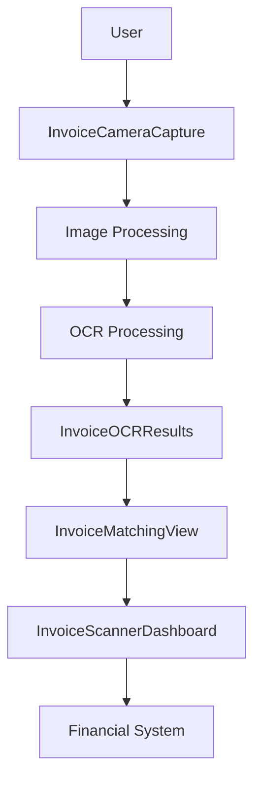
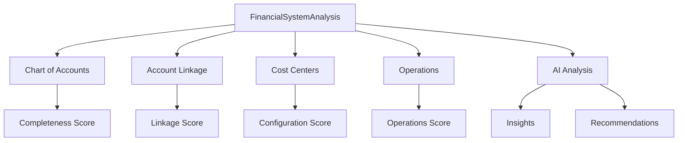
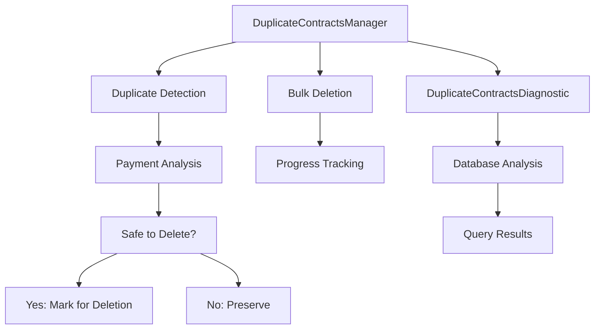

# Component Architecture

<cite>
**Referenced Files in This Document**   
- [ProtectedRoute.tsx](file://src/components/common/ProtectedRoute.tsx)
- [FeatureGate.tsx](file://src/components/common/FeatureGate.tsx)
- [EnhancedFeatureGate.tsx](file://src/components/common/EnhancedFeatureGate.tsx)
- [PermissionGuard.tsx](file://src/components/common/PermissionGuard.tsx)
- [AuthContext.tsx](file://src/contexts/AuthContext.tsx)
- [FeatureFlagsContext.tsx](file://src/contexts/FeatureFlagsContext.tsx)
- [button.tsx](file://src/components/ui/button.tsx)
- [card.tsx](file://src/components/ui/card.tsx)
- [ui](file://src/components/ui)
- [components](file://src/components)
- [InvoiceCameraCapture.tsx](file://src/components/invoices/InvoiceCameraCapture.tsx) - *Added in recent commit*
- [InvoiceOCRResults.tsx](file://src/components/invoices/InvoiceOCRResults.tsx) - *Added in recent commit*
- [InvoiceScannerDashboard.tsx](file://src/components/invoices/InvoiceScannerDashboard.tsx) - *Added in recent commit*
- [FinancialSystemAnalysis.tsx](file://src/pages/finance/settings/FinancialSystemAnalysis.tsx) - *Added in recent commit*
- [DuplicateContractsDiagnostic.tsx](file://src/components/contracts/DuplicateContractsDiagnostic.tsx) - *Added in recent commit*
- [DuplicateContractsManager.tsx](file://src/components/contracts/DuplicateContractsManager.tsx) - *Added in recent commit*
</cite>

## Update Summary
- Added documentation for new invoice scanning and OCR components
- Added documentation for Smart Financial System Analysis feature
- Added documentation for duplicate contract diagnosis and management components
- Updated component organization section to include new directories
- Added new sections for invoice processing and financial analysis features
- Added new section for contract duplication management

## Table of Contents
1. [Introduction](#introduction)
2. [Component Organization and Domain Structure](#component-organization-and-domain-structure)
3. [Core Architectural Patterns](#core-architectural-patterns)
4. [UI Component System](#ui-component-system)
5. [Context and State Management](#context-and-state-management)
6. [Access Control and Feature Management](#access-control-and-feature-management)
7. [Component Composition and Reuse](#component-composition-and-reuse)
8. [Configuration and Customization](#configuration-and-customization)
9. [Common Issues and Solutions](#common-issues-and-solutions)
10. [Invoice Processing and OCR System](#invoice-processing-and-ocr-system)
11. [Smart Financial System Analysis](#smart-financial-system-analysis)
12. [Contract Duplication Management](#contract-duplication-management)

## Introduction
The FleetifyApp component architecture is designed to support a scalable, maintainable, and reusable UI system. The architecture organizes over 100 components into domain-specific directories, enabling teams to develop features in isolation while maintaining consistency across the application. This document explains the architectural principles, implementation details, and practical usage patterns that make the component system effective for both beginners and experienced developers.

## Component Organization and Domain Structure
The component architecture follows a domain-driven organization pattern, with components grouped into functional directories based on business domains. This structure enhances maintainability by colocating related functionality and reducing cognitive load when navigating the codebase.

The primary domain directories include: admin, analytics, approval, auth, common, contracts, customers, dashboard, finance, fleet, hr, landing, layouts, navigation, notifications, properties, reports, settings, shared, subscription, super-admin, tenants, ui, vehicle-installments, and invoices. Each directory contains components specific to its domain, with the `ui` directory serving as the foundation for reusable primitive components.

This organization enables developers to quickly locate relevant components and understand their purpose within the application context. The domain-based structure also supports independent development and testing of features, reducing coupling between different parts of the application.

**Section sources**
- [components](file://src/components)

## Core Architectural Patterns
The component architecture implements several key patterns to ensure maintainability and reusability:

1. **Component Composition**: Components are designed to be composable, allowing higher-level components to be built from primitive UI elements. This pattern promotes consistency and reduces duplication.

2. **Provider Pattern**: Context components manage application state and provide it to consumers through the Provider pattern. This enables global state management without prop drilling.

3. **Modular Organization**: The domain-based directory structure supports modular development, allowing teams to work on specific features without affecting unrelated components.

4. **Separation of Concerns**: Components are organized by responsibility, with presentational components separated from logic and data-fetching concerns.

These patterns work together to create a robust architecture that scales with the application's complexity while maintaining developer productivity.

**Section sources**
- [components](file://src/components)
- [contexts](file://src/contexts)

## UI Component System
The UI component system is centered around the `src/components/ui` directory, which contains primitive components that serve as the building blocks for the entire application. These components include buttons, cards, forms, tables, and other fundamental UI elements.

The primitive components are designed with accessibility, responsiveness, and theming in mind. They use utility classes and variants to support different visual styles while maintaining consistent behavior. For example, the Button component supports multiple variants (default, destructive, outline, secondary, ghost, link, premium, success, warning) and sizes (default, sm, lg, icon).

Domain-specific components build upon these primitives, combining them to create more complex UI elements tailored to specific business needs. This approach ensures visual consistency across the application while allowing for domain-specific customization.

**Diagram sources**
- [ui](file://src/components/ui)
- [components](file://src/components)

**Section sources**
- [button.tsx](file://src/components/ui/button.tsx)
- [card.tsx](file://src/components/ui/card.tsx)

## Context and State Management
The application uses React Context for state management, with specialized context providers for different domains. The `AuthContext` manages authentication state, providing user information and authentication methods to components throughout the application. The `FeatureFlagsContext` enables feature toggling and A/B testing, allowing controlled rollout of new functionality.

Context components follow the Provider pattern, wrapping the application or specific sections to make state available to child components. Custom hooks like `useAuth` and `useFeatureFlags` provide a clean API for consuming context values, abstracting away the underlying implementation details.

This approach to state management reduces prop drilling and makes state changes predictable. The context system also supports server-side rendering and hydration, ensuring consistent behavior across different environments.

**Diagram sources**
- [AuthContext.tsx](file://src/contexts/AuthContext.tsx)
- [FeatureFlagsContext.tsx](file://src/contexts/FeatureFlagsContext.tsx)

**Section sources**
- [AuthContext.tsx](file://src/contexts/AuthContext.tsx)
- [FeatureFlagsContext.tsx](file://src/contexts/FeatureFlagsContext.tsx)

## Access Control and Feature Management
The component architecture includes a comprehensive system for access control and feature management. The `ProtectedRoute` component guards routes based on authentication status, permissions, and feature access. It displays loading states during authentication checks and redirects unauthorized users to appropriate destinations.

The `PermissionGuard` component provides fine-grained access control within components, supporting role-based access, permission checks, and feature gating. It renders fallback content or hides components entirely based on access rules. The `FeatureGate` component manages feature availability based on subscription plans, showing upgrade prompts when necessary.

These components work together to enforce security policies and business rules consistently across the application. They abstract away the complexity of access control, allowing developers to focus on feature implementation rather than security concerns.

**Diagram sources**
- [ProtectedRoute.tsx](file://src/components/common/ProtectedRoute.tsx)
- [PermissionGuard.tsx](file://src/components/common/PermissionGuard.tsx)
- [FeatureGate.tsx](file://src/components/common/FeatureGate.tsx)
- [AuthContext.tsx](file://src/contexts/AuthContext.tsx)
- [FeatureFlagsContext.tsx](file://src/contexts/FeatureFlagsContext.tsx)

**Section sources**
- [ProtectedRoute.tsx](file://src/components/common/ProtectedRoute.tsx)
- [PermissionGuard.tsx](file://src/components/common/PermissionGuard.tsx)
- [FeatureGate.tsx](file://src/components/common/FeatureGate.tsx)

## Component Composition and Reuse
The architecture promotes component composition and reuse through several mechanisms. Primitive UI components are designed to be highly configurable, supporting various props and variants to accommodate different use cases. Higher-level components combine these primitives to create domain-specific functionality.

The `EnhancedFeatureGate` component demonstrates composition by wrapping the `PermissionGuard` component, showing how existing components can be extended to create new functionality. Similarly, the `AdminRoute` and `SuperAdminRoute` components compose `ProtectedRoute` with specific configuration, reducing duplication and ensuring consistency.

Component composition follows the single responsibility principle, with each component focusing on a specific aspect of functionality. This approach makes components easier to test, maintain, and reuse across different parts of the application.

**Section sources**
- [EnhancedFeatureGate.tsx](file://src/components/common/EnhancedFeatureGate.tsx)
- [ProtectedRoute.tsx](file://src/components/common/ProtectedRoute.tsx)

## Configuration and Customization
Components support extensive configuration through props, allowing developers to customize appearance and behavior without modifying component code. The `ProtectedRoute` component, for example, accepts configuration options for permission requirements, feature checks, admin access, and redirect behavior.

UI components use variant systems to support different visual styles. The Button component's `variant` and `size` props allow selection from predefined styles, ensuring consistency while providing flexibility. These variants are defined using the `class-variance-authority` library, which generates optimized CSS classes at build time.

The context system also supports configuration through provider props. The `FeatureFlagsProvider` accepts an `initialFlags` prop, allowing feature flags to be set programmatically or based on environment variables.

**Section sources**
- [ProtectedRoute.tsx](file://src/components/common/ProtectedRoute.tsx)
- [button.tsx](file://src/components/ui/button.tsx)
- [FeatureFlagsContext.tsx](file://src/contexts/FeatureFlagsContext.tsx)

## Common Issues and Solutions
The component architecture addresses several common issues in component reuse:

1. **Prop Drilling**: Solved through context providers and custom hooks that make state available without passing props through intermediate components.

2. **Inconsistent Styling**: Addressed by the UI primitive system, which provides standardized components with consistent appearance and behavior.

3. **Access Control Complexity**: Simplified by the `ProtectedRoute` and `PermissionGuard` components, which encapsulate authentication and authorization logic.

4. **Feature Management**: Handled by the `FeatureGate` system, which enables controlled rollout of new features based on subscription plans or experimental flags.

5. **Loading States**: Managed by components that handle their own loading states, such as `ProtectedRoute` displaying skeletons during authentication checks.

These solutions create a robust foundation for component development, reducing common pain points and enabling teams to focus on delivering business value.

**Section sources**
- [ProtectedRoute.tsx](file://src/components/common/ProtectedRoute.tsx)
- [PermissionGuard.tsx](file://src/components/common/PermissionGuard.tsx)
- [FeatureGate.tsx](file://src/components/common/FeatureGate.tsx)

## Invoice Processing and OCR System
The invoice processing and OCR system provides a comprehensive solution for digitizing paper invoices and integrating them into the financial system. This system consists of several components that work together to capture, process, and validate invoice data.

The core components include:
- `InvoiceCameraCapture`: Allows users to capture invoice images using their device camera or select from the gallery
- `InvoiceOCRResults`: Displays extracted data from OCR processing with confidence indicators
- `InvoiceMatchingView`: Provides intelligent matching of invoices to customers and contracts
- `InvoiceScannerDashboard`: Orchestrates the complete invoice scanning workflow

The system uses a multi-step process:
1. Image capture and upload
2. OCR processing using Supabase edge functions
3. Data extraction and confidence scoring
4. Intelligent matching to existing customers and contracts
5. Manual review and confirmation
6. Storage and integration with financial records

This system significantly reduces manual data entry and improves accuracy through automated data extraction and validation.

**Diagram sources**
- [InvoiceCameraCapture.tsx](file://src/components/invoices/InvoiceCameraCapture.tsx)
- [InvoiceOCRResults.tsx](file://src/components/invoices/InvoiceOCRResults.tsx)
- [InvoiceMatchingView.tsx](file://src/components/invoices/InvoiceMatchingView.tsx)
- [InvoiceScannerDashboard.tsx](file://src/components/invoices/InvoiceScannerDashboard.tsx)

**Section sources**
- [InvoiceCameraCapture.tsx](file://src/components/invoices/InvoiceCameraCapture.tsx)
- [InvoiceOCRResults.tsx](file://src/components/invoices/InvoiceOCRResults.tsx)
- [InvoiceMatchingView.tsx](file://src/components/invoices/InvoiceMatchingView.tsx)
- [InvoiceScannerDashboard.tsx](file://src/components/invoices/InvoiceScannerDashboard.tsx)

## Smart Financial System Analysis
The Smart Financial System Analysis feature provides comprehensive analysis of the financial system's health and completeness. This feature is implemented through the `FinancialSystemAnalysis` component, which provides a detailed assessment of various aspects of the financial system.

Key features include:
- Overall financial health score
- Chart of accounts completeness analysis
- Account linkage verification
- Cost centers configuration assessment
- Operations and journal entries validation
- AI-powered insights and recommendations

The component uses a tabbed interface to organize different aspects of the analysis:
- Overview: Summary of key metrics and urgent issues
- Accounts: Detailed analysis of chart of accounts
- Linkage: Assessment of entity-account linkages
- Cost Centers: Evaluation of cost center configuration
- Operations: Validation of financial operations
- AI Insights: Intelligent analysis and recommendations

The system also provides actionable recommendations and one-click fixes for common issues, making it easier for users to maintain a healthy financial system.

**Diagram sources**
- [FinancialSystemAnalysis.tsx](file://src/pages/finance/settings/FinancialSystemAnalysis.tsx)

**Section sources**
- [FinancialSystemAnalysis.tsx](file://src/pages/finance/settings/FinancialSystemAnalysis.tsx)

## Contract Duplication Management
The contract duplication management system helps identify and resolve duplicate contracts in the system. This is implemented through two main components: `DuplicateContractsManager` and `DuplicateContractsDiagnostic`.

The `DuplicateContractsManager` provides a user interface for:
- Identifying duplicate contract groups
- Analyzing duplicate contracts based on contract number
- Determining safe-to-delete contracts (those without payments)
- Bulk deletion of duplicate contracts
- Filtering by recommended action type

The `DuplicateContractsDiagnostic` component provides detailed technical information about the duplicate contract detection process, including:
- Database query results
- Contract grouping analysis
- Duplicate detection algorithms
- Error diagnostics

The system uses a sophisticated algorithm to determine which contracts are safe to delete:
- Contracts without any payments are considered safe for deletion
- Contracts with payments are protected from deletion
- The system provides recommendations based on payment history
- Users can manually review and select contracts for deletion

This system helps maintain data integrity by preventing duplicate contracts from cluttering the database and causing financial discrepancies.

**Diagram sources**
- [DuplicateContractsManager.tsx](file://src/components/contracts/DuplicateContractsManager.tsx)
- [DuplicateContractsDiagnostic.tsx](file://src/components/contracts/DuplicateContractsDiagnostic.tsx)

**Section sources**
- [DuplicateContractsManager.tsx](file://src/components/contracts/DuplicateContractsManager.tsx)
- [DuplicateContractsDiagnostic.tsx](file://src/components/contracts/DuplicateContractsDiagnostic.tsx)