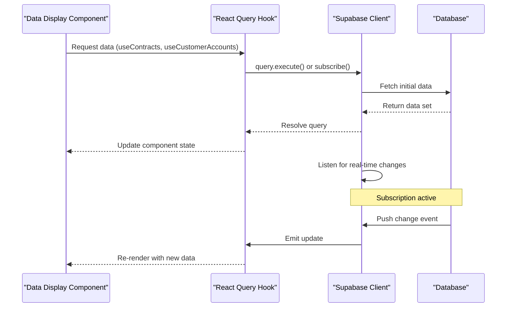
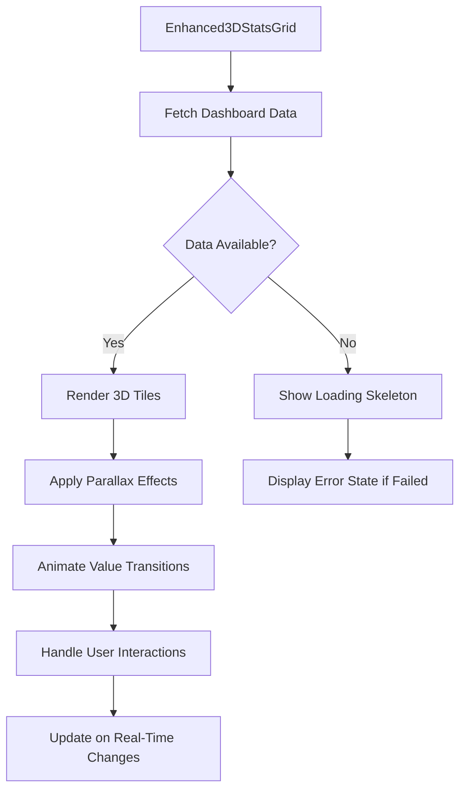
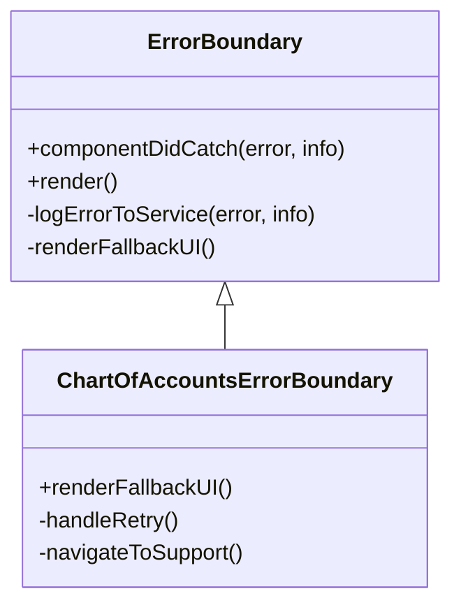
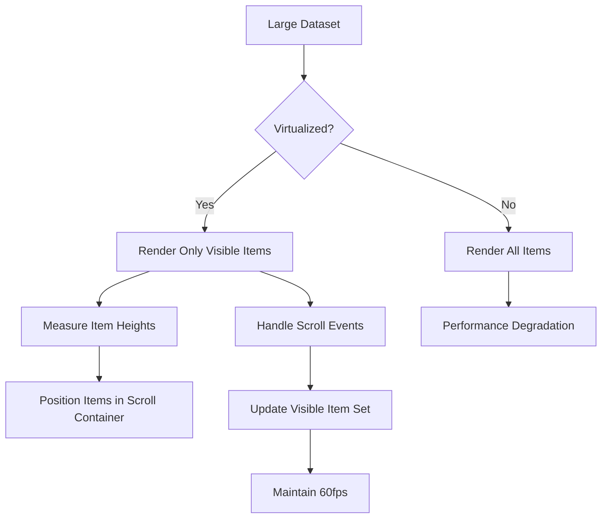

# Data Display Components

<cite>
**Referenced Files in This Document**   
- [ContractsList.tsx](file://src/components/contracts/ContractsList.tsx)
- [CustomerAccountsManager.tsx](file://src/components/customers/CustomerAccountsManager.tsx)
- [AccountsListWithActions.tsx](file://src/components/finance/AccountsListWithActions.tsx)
- [VehicleGrid.tsx](file://src/components/fleet/VehicleGrid.tsx)
- [ChartOfAccountsErrorBoundary.tsx](file://src/components/finance/ChartOfAccountsErrorBoundary.tsx)
- [SmartAnalyticsPanel.tsx](file://src/components/analytics/SmartAnalyticsPanel.tsx)
- [Enhanced3DStatsGrid.tsx](file://src/components/dashboard/Enhanced3DStatsGrid.tsx)
- [useContracts.ts](file://src/hooks/useContracts.ts)
- [useCustomerAccounts.ts](file://src/hooks/useCustomerAccounts.ts)
- [useVehiclesPaginated.ts](file://src/hooks/useVehiclesPaginated.ts)
- [client.ts](file://src/integrations/supabase/client.ts)
</cite>

## Table of Contents
1. [Introduction](#introduction)
2. [Core Data Display Components](#core-data-display-components)
3. [Data Fetching and Real-Time Updates](#data-fetching-and-real-time-updates)
4. [Visualization and Dashboard Components](#visualization-and-dashboard-components)
5. [Error Handling and Resilience](#error-handling-and-resilience)
6. [Filtering, Sorting, and Pagination](#filtering-sorting-and-pagination)
7. [Export and Customization Options](#export-and-customization-options)
8. [Performance Optimization](#performance-optimization)
9. [Conclusion](#conclusion)

## Introduction
FleetifyApp employs a robust suite of data display components designed to present financial, operational, and customer data in a clear, interactive, and performant manner. These components are built using React with TypeScript and leverage modern patterns such as React Query for data fetching, Supabase for real-time updates, and virtualized rendering for large datasets. This document details the implementation of key data display components including ContractsList, CustomerAccountsManager, AccountsListWithActions, and VehicleGrid, along with supporting visualization and error handling mechanisms.

## Core Data Display Components

### ContractsList
The ContractsList component renders a paginated, filterable table of contract records with support for sorting, status badges, and action buttons. It uses virtual scrolling to maintain performance with large datasets and integrates with the useContracts hook for data fetching. The component supports mobile-responsive layouts and includes bulk selection and export functionality.

**Section sources**
- [ContractsList.tsx](file://src/components/contracts/ContractsList.tsx#L1-L350)
- [useContracts.ts](file://src/hooks/useContracts.ts#L10-L80)

### CustomerAccountsManager
CustomerAccountsManager provides a comprehensive interface for viewing and managing customer financial accounts. It displays account balances, aging reports, and transaction history in a tabbed layout. The component uses the useCustomerAccounts hook to fetch data and supports real-time updates via Supabase subscriptions. It includes filtering by account status and search by customer name.

**Section sources**
- [CustomerAccountsManager.tsx](file://src/components/customers/CustomerAccountsManager.tsx#L1-L420)
- [useCustomerAccounts.ts](file://src/hooks/useCustomerAccounts.ts#L15-L90)

### AccountsListWithActions
AccountsListWithActions renders a hierarchical chart of accounts with expandable nodes, balance summaries, and contextual action buttons for editing, deleting, or creating journal entries. It supports drag-and-drop reorganization and displays account type indicators and level-based indentation. The component integrates with the ChartOfAccountsErrorBoundary for fault tolerance.

**Section sources**
- [AccountsListWithActions.tsx](file://src/components/finance/AccountsListWithActions.tsx#L1-L380)
- [useChartOfAccounts.ts](file://src/hooks/useChartOfAccounts.ts#L20-L100)

### VehicleGrid
VehicleGrid presents fleet vehicles in a responsive card-based grid layout with key metrics such as status, mileage, and next service date. Each card includes action buttons for editing, assigning, or viewing detailed reports. The component uses virtualized rendering for performance and supports filtering by vehicle type, status, and location.

**Section sources**
- [VehicleGrid.tsx](file://src/components/fleet/VehicleGrid.tsx#L1-L310)
- [useVehiclesPaginated.ts](file://src/hooks/useVehiclesPaginated.ts#L12-L75)

## Data Fetching and Real-Time Updates

**Diagram sources**
- [useContracts.ts](file://src/hooks/useContracts.ts#L25-L60)
- [client.ts](file://src/integrations/supabase/client.ts#L8-L30)
- [ContractsList.tsx](file://src/components/contracts/ContractsList.tsx#L45-L90)

The data display components utilize React Query hooks (e.g., useContracts, useCustomerAccounts) to manage data fetching, caching, and real-time synchronization. These hooks establish Supabase database subscriptions that push updates to the UI whenever underlying data changes, ensuring users always see current information without manual refresh.

## Visualization and Dashboard Components

### SmartAnalyticsPanel
SmartAnalyticsPanel renders interactive financial charts and KPIs using dynamic data from the useSmartAnalytics hook. It supports multiple chart types (bar, line, pie) and allows users to switch time ranges (monthly, quarterly, yearly). The component includes drill-down capabilities and tooltip-based data inspection.

**Section sources**
- [SmartAnalyticsPanel.tsx](file://src/components/analytics/SmartAnalyticsPanel.tsx#L1-L280)
- [useAdvancedFinancialAnalytics.ts](file://src/hooks/useAdvancedFinancialAnalytics.ts#L18-L85)

### Enhanced3DStatsGrid
Enhanced3DStatsGrid displays key performance indicators in a visually engaging 3D grid layout with parallax effects and animated transitions. Each tile represents a different metric (e.g., revenue, utilization rate, maintenance costs) and responds to hover interactions with expanded details. The component is optimized for both desktop and mobile viewing.

**Diagram sources**
- [Enhanced3DStatsGrid.tsx](file://src/components/dashboard/Enhanced3DStatsGrid.tsx#L15-L200)
- [useEnhancedDashboardStats.ts](file://src/hooks/useEnhancedDashboardStats.ts#L10-L60)

**Section sources**
- [Enhanced3DStatsGrid.tsx](file://src/components/dashboard/Enhanced3DStatsGrid.tsx#L1-L250)

## Error Handling and Resilience

### ChartOfAccountsErrorBoundary
ChartOfAccountsErrorBoundary implements a robust error containment strategy for financial data components. It wraps critical rendering sections and provides fallback UI when data fetching fails or parsing errors occur. The boundary logs errors to the system logger and offers users retry options or navigation alternatives.

**Diagram sources**
- [ChartOfAccountsErrorBoundary.tsx](file://src/components/finance/ChartOfAccountsErrorBoundary.tsx#L5-L120)
- [ErrorBoundary.tsx](file://src/components/ErrorBoundary.tsx#L1-L80)

**Section sources**
- [ChartOfAccountsErrorBoundary.tsx](file://src/components/finance/ChartOfAccountsErrorBoundary.tsx#L1-L150)

## Filtering, Sorting, and Pagination

Data display components implement consistent patterns for data manipulation:

- **Filtering**: Components accept filter configurations via props and maintain filter state using React context. Filters include date ranges, status types, and text search.
- **Sorting**: Users can sort by any column header, with visual indicators for sort direction. Sort state is preserved across sessions using localStorage.
- **Pagination**: Most list components support both cursor-based and offset-based pagination, with configurable page sizes (25, 50, 100 items).

These features are implemented through shared utility hooks like useDebounce for search inputs and usePagination for managing page state.

**Section sources**
- [ContractsList.tsx](file://src/components/contracts/ContractsList.tsx#L120-L200)
- [useDebounce.ts](file://src/hooks/useDebounce.ts#L1-L20)
- [usePagination.ts](file://src/hooks/usePagination.ts#L1-L35)

## Export and Customization Options

Data display components support multiple export formats including CSV, PDF, and Excel. The export functionality is implemented through the useReportExport hook, which handles data formatting and file generation. Users can customize displayed columns, choose date ranges, and apply filters before exporting.

Components also support presentation customization through props that control density (compact, normal, spacious), theme (light, dark, high-contrast), and data density (summary, detailed).

**Section sources**
- [ContractsList.tsx](file://src/components/contracts/ContractsList.tsx#L280-L320)
- [useReportExport.ts](file://src/hooks/useReportExport.ts#L1-L45)
- [CustomerAccountsManager.tsx](file://src/components/customers/CustomerAccountsManager.tsx#L350-L380)

## Performance Optimization

For rendering large datasets, FleetifyApp employs several optimization techniques:

- **Virtualization**: Long lists use react-window for rendering only visible items
- **Memoization**: Components use React.memo and useMemo to prevent unnecessary re-renders
- **Lazy Loading**: Images and non-critical data load on demand
- **Query Optimization**: React Query batches requests and uses intelligent caching

The VehicleGrid and ContractsList components demonstrate these optimizations, maintaining smooth 60fps performance even with thousands of records.

**Diagram sources**
- [VehicleGrid.tsx](file://src/components/fleet/VehicleGrid.tsx#L80-L150)
- [ContractsList.tsx](file://src/components/contracts/ContractsList.tsx#L200-L250)

**Section sources**
- [VehicleGrid.tsx](file://src/components/fleet/VehicleGrid.tsx#L1-L310)
- [useVehiclesPaginated.ts](file://src/hooks/useVehiclesPaginated.ts#L1-L100)

## Conclusion
FleetifyApp's data display components provide a comprehensive, performant, and user-friendly interface for managing complex financial and operational data. Through the use of React Query for data synchronization, Supabase for real-time updates, and thoughtful performance optimizations, these components deliver a responsive experience even with large datasets. The consistent design patterns for filtering, sorting, and error handling create a cohesive user experience across the application.