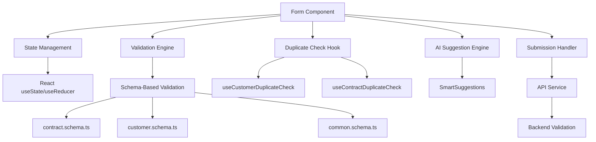
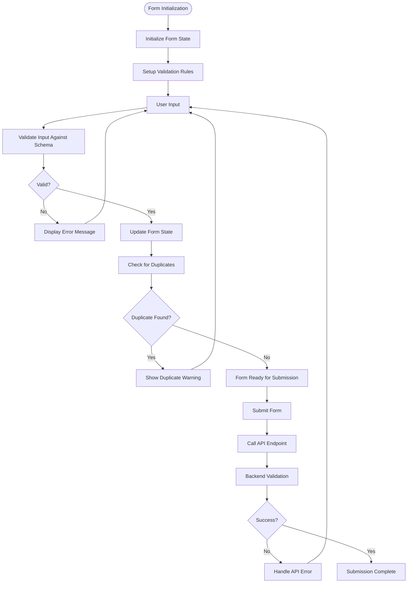
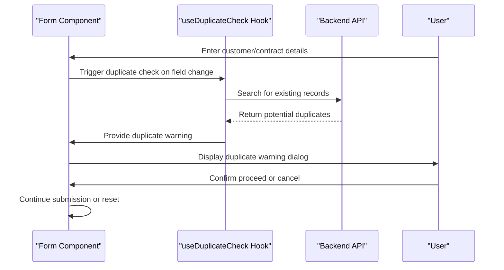
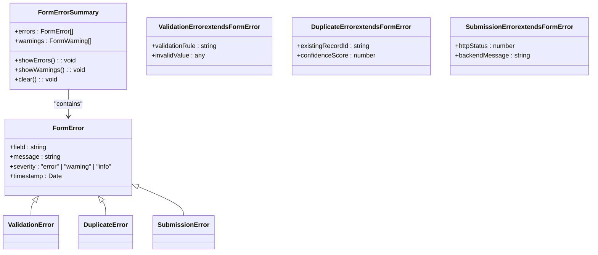
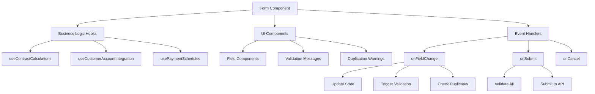
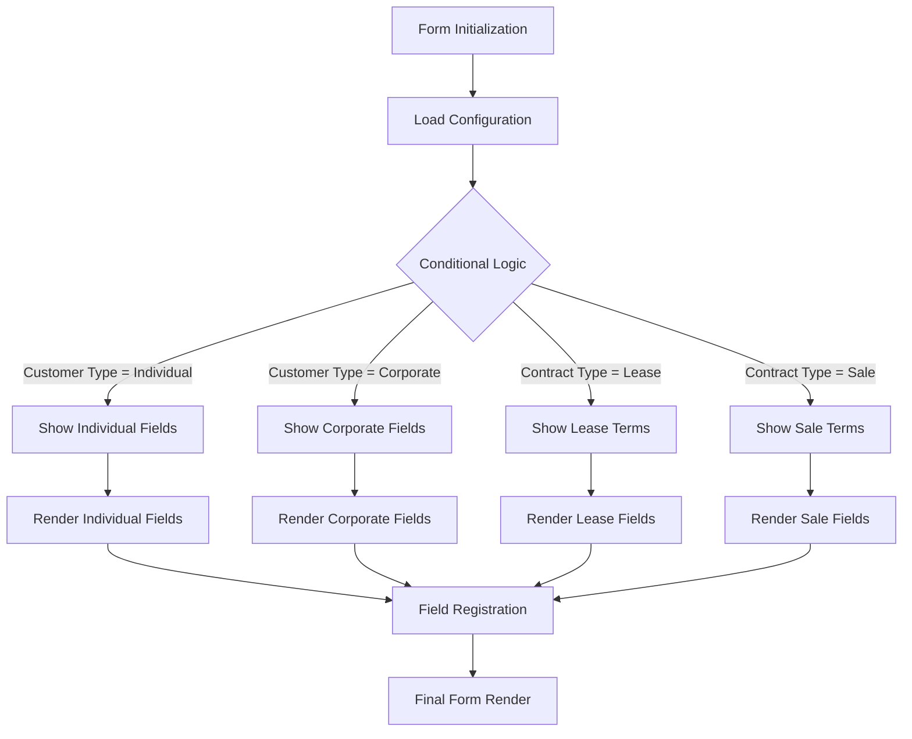
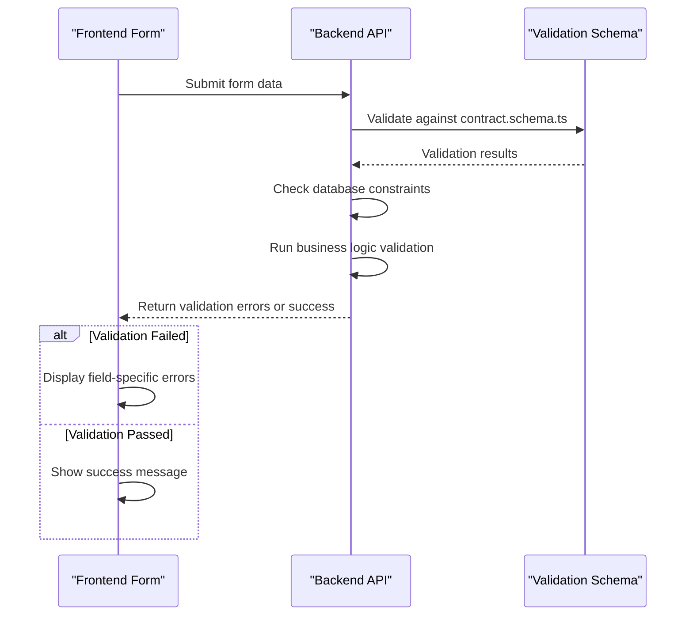
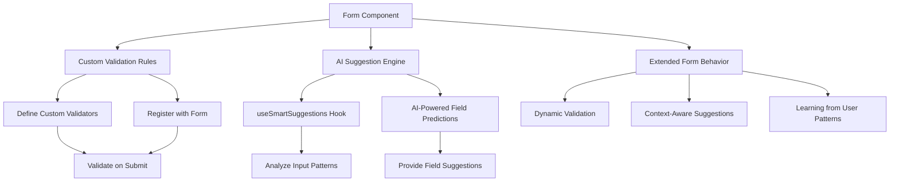
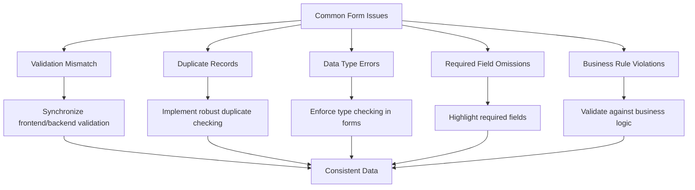

# Form Components

<cite>
**Referenced Files in This Document**   
- [ContractFormWithDuplicateCheck.tsx](file://src/components/contracts/ContractFormWithDuplicateCheck.tsx)
- [EnhancedCustomerForm.tsx](file://src/components/customers/EnhancedCustomerForm.tsx)
- [InvoiceForm.tsx](file://src/components/finance/InvoiceForm.tsx)
- [PropertyContractForm.tsx](file://src/components/properties/PropertyContractForm.tsx)
- [useContractFormValidation.ts](file://src/hooks/useContractFormValidation.ts)
- [useCustomerDuplicateCheck.ts](file://src/hooks/useCustomerDuplicateCheck.ts)
- [contract.schema.ts](file://src/schemas/contract.schema.ts)
- [customer.schema.ts](file://src/schemas/customer.schema.ts)
- [common.schema.ts](file://src/schemas/common.schema.ts)
- [EnhancedContractForm.tsx](file://src/components/contracts/EnhancedContractForm.tsx)
- [CustomerFormWithDuplicateCheck.tsx](file://src/components/customers/CustomerFormWithDuplicateCheck.tsx)
</cite>

## Table of Contents
1. [Introduction](#introduction)
2. [Form Architecture Overview](#form-architecture-overview)
3. [Core Form Components](#core-form-components)
4. [State Management and Validation Strategies](#state-management-and-validation-strategies)
5. [Duplicate Checking Mechanism](#duplicate-checking-mechanism)
6. [Error Handling Patterns](#error-handling-patterns)
7. [Form Composition and Business Logic Integration](#form-composition-and-business-logic-integration)
8. [Dynamic Field Rendering and Customization](#dynamic-field-rendering-and-customization)
9. [Backend Validation and Schema Integration](#backend-validation-and-schema-integration)
10. [Extending Forms with Custom Validation and AI Suggestions](#extending-forms-with-custom-validation-and-ai-suggestions)
11. [Common Issues and Data Consistency](#common-issues-and-data-consistency)
12. [Conclusion](#conclusion)

## Introduction
This document provides a comprehensive analysis of the form components within FleetifyApp, focusing on key implementations such as ContractFormWithDuplicateCheck, EnhancedCustomerForm, InvoiceForm, and PropertyContractForm. The documentation details the architectural patterns, validation mechanisms, state management strategies, and integration with backend systems. Special emphasis is placed on duplicate detection logic, error handling, and dynamic form behavior. The relationship between frontend forms and backend schema definitions is also explored, along with extensibility features for custom validation and AI-powered suggestions.

## Form Architecture Overview

**Diagram sources**
- [EnhancedCustomerForm.tsx](file://src/components/customers/EnhancedCustomerForm.tsx)
- [useContractFormValidation.ts](file://src/hooks/useContractFormValidation.ts)
- [contract.schema.ts](file://src/schemas/contract.schema.ts)

**Section sources**
- [EnhancedCustomerForm.tsx](file://src/components/customers/EnhancedCustomerForm.tsx)
- [useContractFormValidation.ts](file://src/hooks/useContractFormValidation.ts)

## Core Form Components

### ContractFormWithDuplicateCheck
This component implements a robust contract creation interface with real-time duplicate detection. It leverages the `useContractDuplicateCheck` hook to prevent creation of redundant contracts based on key fields such as contract number, customer ID, and date range. The form integrates with the contract validation schema to ensure data integrity before submission.

**Section sources**
- [ContractFormWithDuplicateCheck.tsx](file://src/components/contracts/ContractFormWithDuplicateCheck.tsx)
- [useContractDuplicateCheck.ts](file://src/hooks/useContractDuplicateCheck.ts)

### EnhancedCustomerForm
The EnhancedCustomerForm provides a comprehensive customer creation and editing interface with advanced validation and duplicate prevention. It utilizes the `useCustomerDuplicateCheck` hook to identify potential duplicate customers based on email, phone number, and tax ID. The form supports dynamic field rendering based on customer type and business rules.

**Section sources**
- [EnhancedCustomerForm.tsx](file://src/components/customers/EnhancedCustomerForm.tsx)
- [useCustomerDuplicateCheck.ts](file://src/hooks/useCustomerDuplicateCheck.ts)

### InvoiceForm
This component handles invoice creation with integrated validation against the payment schema. It includes features for line item management, tax calculation, and integration with customer accounts. The form validates against business rules such as payment terms, due dates, and amount consistency.

**Section sources**
- [InvoiceForm.tsx](file://src/components/finance/InvoiceForm.tsx)
- [payment.schema.ts](file://src/schemas/payment.schema.ts)

### PropertyContractForm
The PropertyContractForm manages real estate contract creation with specialized fields for property details, lease terms, and tenant information. It implements validation rules specific to property management, including rent calculation, deposit handling, and compliance with local regulations.

**Section sources**
- [PropertyContractForm.tsx](file://src/components/properties/PropertyContractForm.tsx)
- [contract.schema.ts](file://src/schemas/contract.schema.ts)

## State Management and Validation Strategies

**Diagram sources**
- [EnhancedContractForm.tsx](file://src/components/contracts/EnhancedContractForm.tsx)
- [useContractFormValidation.ts](file://src/hooks/useContractFormValidation.ts)
- [contract.schema.ts](file://src/schemas/contract.schema.ts)

**Section sources**
- [EnhancedContractForm.tsx](file://src/components/contracts/EnhancedContractForm.tsx)
- [useContractFormValidation.ts](file://src/hooks/useContractFormValidation.ts)

## Duplicate Checking Mechanism

**Diagram sources**
- [CustomerFormWithDuplicateCheck.tsx](file://src/components/customers/CustomerFormWithDuplicateCheck.tsx)
- [useCustomerDuplicateCheck.ts](file://src/hooks/useCustomerDuplicateCheck.ts)

**Section sources**
- [CustomerFormWithDuplicateCheck.tsx](file://src/components/customers/CustomerFormWithDuplicateCheck.tsx)
- [useCustomerDuplicateCheck.ts](file://src/hooks/useCustomerDuplicateCheck.ts)

## Error Handling Patterns

**Diagram sources**
- [FormErrorSummary.tsx](file://src/components/contracts/FormErrorSummary.tsx)
- [EnhancedCustomerForm.tsx](file://src/components/customers/EnhancedCustomerForm.tsx)

**Section sources**
- [FormErrorSummary.tsx](file://src/components/contracts/FormErrorSummary.tsx)
- [EnhancedCustomerForm.tsx](file://src/components/customers/EnhancedCustomerForm.tsx)

## Form Composition and Business Logic Integration

**Diagram sources**
- [EnhancedContractForm.tsx](file://src/components/contracts/EnhancedContractForm.tsx)
- [useContractCalculations.ts](file://src/hooks/useContractCalculations.ts)
- [useCustomerAccountIntegration.ts](file://src/hooks/useCustomerAccountIntegration.ts)

**Section sources**
- [EnhancedContractForm.tsx](file://src/components/contracts/EnhancedContractForm.tsx)
- [useContractCalculations.ts](file://src/hooks/useContractCalculations.ts)

## Dynamic Field Rendering and Customization

**Diagram sources**
- [EnhancedCustomerForm.tsx](file://src/components/customers/EnhancedCustomerForm.tsx)
- [EnhancedContractForm.tsx](file://src/components/contracts/EnhancedContractForm.tsx)

**Section sources**
- [EnhancedCustomerForm.tsx](file://src/components/customers/EnhancedCustomerForm.tsx)
- [EnhancedContractForm.tsx](file://src/components/contracts/EnhancedContractForm.tsx)

## Backend Validation and Schema Integration

**Diagram sources**
- [contract.schema.ts](file://src/schemas/contract.schema.ts)
- [customer.schema.ts](file://src/schemas/customer.schema.ts)
- [common.schema.ts](file://src/schemas/common.schema.ts)

**Section sources**
- [contract.schema.ts](file://src/schemas/contract.schema.ts)
- [customer.schema.ts](file://src/schemas/customer.schema.ts)

## Extending Forms with Custom Validation and AI Suggestions

**Diagram sources**
- [SmartSuggestions.tsx](file://src/components/contracts/SmartSuggestions.tsx)
- [useSmartSuggestions.ts](file://src/hooks/useSmartSuggestions.ts)
- [EnhancedCustomerForm.tsx](file://src/components/customers/EnhancedCustomerForm.tsx)

**Section sources**
- [SmartSuggestions.tsx](file://src/components/contracts/SmartSuggestions.tsx)
- [useSmartSuggestions.ts](file://src/hooks/useSmartSuggestions.ts)

## Common Issues and Data Consistency

**Diagram sources**
- [useContractFormValidation.ts](file://src/hooks/useContractFormValidation.ts)
- [useCustomerDuplicateCheck.ts](file://src/hooks/useCustomerDuplicateCheck.ts)
- [contract.schema.ts](file://src/schemas/contract.schema.ts)

**Section sources**
- [useContractFormValidation.ts](file://src/hooks/useContractFormValidation.ts)
- [useCustomerDuplicateCheck.ts](file://src/hooks/useCustomerDuplicateCheck.ts)

## Conclusion
The form components in FleetifyApp demonstrate a sophisticated architecture that balances user experience with data integrity. Through a combination of client-side validation, duplicate detection, and backend schema enforcement, the system ensures high-quality data entry while providing helpful feedback to users. The integration of AI-powered suggestions and dynamic field rendering enhances usability, while the modular design allows for easy extension and customization. By following the patterns documented here, developers can maintain consistency across form implementations and extend functionality as business requirements evolve.