# Layout Components

<cite>
**Referenced Files in This Document**   
- [AppSidebar.tsx](file://src/components/layouts/AppSidebar.tsx)
- [DashboardLayout.tsx](file://src/components/layouts/DashboardLayout.tsx)
- [ResponsiveDashboardLayout.tsx](file://src/components/layouts/ResponsiveDashboardLayout.tsx)
- [SuperAdminLayout.tsx](file://src/components/layouts/SuperAdminLayout.tsx)
- [CarRentalSidebar.tsx](file://src/components/navigation/CarRentalSidebar.tsx)
- [RealEstateSidebar.tsx](file://src/components/navigation/RealEstateSidebar.tsx)
- [ProtectedRoute.tsx](file://src/components/common/ProtectedRoute.tsx)
- [DynamicSidebar.tsx](file://src/modules/core/components/DynamicSidebar.tsx)
- [useAdaptiveLayout.ts](file://src/hooks/useAdaptiveLayout.ts)
- [useAdaptiveContent.ts](file://src/hooks/useAdaptiveContent.ts)
</cite>

## Table of Contents
1. [Introduction](#introduction)
2. [Core Layout Components](#core-layout-components)
3. [AppSidebar Implementation](#appsidebar-implementation)
4. [DashboardLayout Structure](#dashboardlayout-structure)
5. [ResponsiveDashboardLayout](#responsivedashboardlayout)
6. [SuperAdminLayout](#superadminlayout)
7. [Domain-Specific Sidebar Integration](#domain-specific-sidebar-integration)
8. [Responsive Design Patterns](#responsive-design-patterns)
9. [Layout Composition and Routing](#layout-composition-and-routing)
10. [Configuration and Customization](#configuration-and-customization)
11. [Common Rendering Issues](#common-rendering-issues)
12. [Authentication Integration](#authentication-integration)
13. [Conclusion](#conclusion)

## Introduction
The FleetifyApp employs a sophisticated layout system designed to provide an optimal user experience across various device types and business domains. This documentation details the implementation of key layout components that define the application's visual hierarchy and navigation structure. The system incorporates responsive design principles, adaptive layouts, and domain-specific variations to accommodate different user roles and screen sizes. The layout components work in conjunction with the application's authentication system to provide appropriate access and navigation options based on user permissions and company type.

## Core Layout Components
The FleetifyApp's layout system consists of several key components that work together to create a cohesive user interface. These components include AppSidebar, DashboardLayout, ResponsiveDashboardLayout, and SuperAdminLayout, each serving a specific purpose in the application's structure. The layout system is built with responsiveness in mind, adapting to different screen sizes and device types while maintaining consistent navigation patterns. The components leverage React's composition model to create flexible and reusable UI structures that can be easily extended and customized.

**Section sources**
- [AppSidebar.tsx](file://src/components/layouts/AppSidebar.tsx#L1-L567)
- [DashboardLayout.tsx](file://src/components/layouts/DashboardLayout.tsx#L1-L124)
- [ResponsiveDashboardLayout.tsx](file://src/components/layouts/ResponsiveDashboardLayout.tsx#L1-L138)
- [SuperAdminLayout.tsx](file://src/components/layouts/SuperAdminLayout.tsx#L1-L200)

## AppSidebar Implementation
The AppSidebar component serves as the primary navigation element for the application, providing users with access to various modules and features. Implemented as a right-aligned sidebar in the RTL layout, it features collapsible sections for different functional areas such as Fleet, Finance, HR, and Legal. The sidebar uses the UI library's Sidebar components with custom styling to match the application's design system.

The component dynamically renders navigation items based on the current route, with visual indicators for active sections. It includes special permission-based rendering through AdminOnly and SuperAdminOnly components, ensuring that users only see menu items they have access to. The sidebar header displays the Fleetify logo and application title, with conditional rendering based on the collapsed state.

**Diagram sources**
- [AppSidebar.tsx](file://src/components/layouts/AppSidebar.tsx#L1-L567)

**Section sources**
- [AppSidebar.tsx](file://src/components/layouts/AppSidebar.tsx#L1-L567)

## DashboardLayout Structure
The DashboardLayout component provides the standard layout structure for authenticated users in the application. It wraps the application content with essential UI elements including the AppSidebar, header with user controls, and main content area. The layout uses SidebarProvider to manage the sidebar state and integrates with the authentication context to handle unauthenticated access.

The header section includes multiple interactive elements such as the SidebarTrigger, CompanySelector, QuickSearch, UnifiedNotificationBell, and HeaderAttendanceButton. User information is displayed in a dropdown menu with options for profile, settings, and logout. The layout also incorporates the ForcePasswordChangeDialog to prompt users to update their passwords when required.

**Diagram sources**
- [DashboardLayout.tsx](file://src/components/layouts/DashboardLayout.tsx#L1-L124)

**Section sources**
- [DashboardLayout.tsx](file://src/components/layouts/DashboardLayout.tsx#L1-L124)

## ResponsiveDashboardLayout
The ResponsiveDashboardLayout component extends the basic DashboardLayout with enhanced responsiveness for different device types. It uses the useSimpleBreakpoint hook to detect the current device type (mobile, tablet, or desktop) and adapts the layout accordingly. For mobile devices, it replaces the standard sidebar with a MobileSidebar accessed via a sheet component, while maintaining the desktop sidebar for larger screens.

The layout includes a ResponsiveHeader component that adjusts its appearance based on the device type, and a ResponsiveContainer that manages content padding according to screen size. It also incorporates a MobileNavigation component for bottom navigation on mobile devices. The component implements a loading timeout mechanism to handle slow authentication checks, displaying a diagnostic screen if the loading process exceeds five seconds.

```mermaid
flowchart TD
A[ResponsiveDashboardLayout] --> B[Auth Check]
B --> C{User Authenticated?}
C --> |No| D[Navigate to /auth]
C --> |Yes| E[Check Loading Timeout]
E --> F{Timeout Exceeded?}
F --> |Yes| G[Show Diagnostic Screen]
F --> |No| H[Render Responsive Layout]
H --> I{Is Mobile?}
I --> |Yes| J[Mobile Sidebar Sheet]
I --> |No| K[Desktop Sidebar]
H --> L[ResponsiveHeader]
H --> M[ResponsiveContainer]
M --> N[Outlet]
H --> O[MobileNavigation if mobile]
H --> P[KeyboardShortcuts]
H --> Q[ForcePasswordChangeDialog]
```

**Diagram sources**
- [ResponsiveDashboardLayout.tsx](file://src/components/layouts/ResponsiveDashboardLayout.tsx#L1-L138)

**Section sources**
- [ResponsiveDashboardLayout.tsx](file://src/components/layouts/ResponsiveDashboardLayout.tsx#L1-L138)

## SuperAdminLayout
The SuperAdminLayout component provides a specialized layout for super administrators with elevated privileges. It features a distinct visual design with a crown icon and red accent colors to differentiate it from standard user interfaces. The layout includes a comprehensive navigation menu with super admin-specific functions such as company management, user administration, and system reports.

For desktop devices, the sidebar is fixed on the right side of the screen, while mobile devices use a sheet-based navigation pattern triggered by a menu button. The component validates user roles to ensure only users with the 'super_admin' role can access this layout, redirecting others to the standard dashboard. The layout's styling emphasizes its administrative nature with backdrop blur effects and subtle borders.

**Diagram sources**
- [SuperAdminLayout.tsx](file://src/components/layouts/SuperAdminLayout.tsx#L1-L200)

**Section sources**
- [SuperAdminLayout.tsx](file://src/components/layouts/SuperAdminLayout.tsx#L1-L200)

## Domain-Specific Sidebar Integration
The FleetifyApp implements domain-specific sidebar variations through the DynamicSidebar component, which selects the appropriate sidebar based on the company's business type. When a company is identified as a car rental business, the CarRentalSidebar is rendered; for real estate companies, the RealEstateSidebar is used. This allows for tailored navigation experiences that highlight the most relevant features for each business domain.

The DynamicSidebar component accesses the company context to determine the business type and conditionally renders the appropriate sidebar component. This approach enables the application to maintain a consistent layout structure while adapting the navigation to specific business needs. The domain-specific sidebars include specialized menu items and icons relevant to their respective industries.

**Diagram sources**
- [DynamicSidebar.tsx](file://src/modules/core/components/DynamicSidebar.tsx#L1-L37)
- [CarRentalSidebar.tsx](file://src/components/navigation/CarRentalSidebar.tsx#L1-L229)
- [RealEstateSidebar.tsx](file://src/components/navigation/RealEstateSidebar.tsx#L1-L290)

**Section sources**
- [DynamicSidebar.tsx](file://src/modules/core/components/DynamicSidebar.tsx#L1-L37)
- [CarRentalSidebar.tsx](file://src/components/navigation/CarRentalSidebar.tsx#L1-L229)
- [RealEstateSidebar.tsx](file://src/components/navigation/RealEstateSidebar.tsx#L1-L290)

## Responsive Design Patterns
The FleetifyApp employs a mobile-first responsive design approach, ensuring optimal user experience across various screen sizes. The layout system uses breakpoints to adapt the interface for mobile, tablet, and desktop devices. On mobile devices, navigation is optimized for touch interactions with larger tap targets and simplified layouts.

The responsive implementation leverages custom hooks such as useSimpleBreakpoint and useAdaptiveLayout to determine the current device type and apply appropriate styling and layout configurations. The application uses a combination of CSS grid, flexbox, and Tailwind's responsive utilities to create fluid layouts that adapt to different viewport sizes. Content density and information hierarchy are adjusted based on screen size, with more compact layouts on smaller devices.

**Section sources**
- [useAdaptiveLayout.ts](file://src/hooks/useAdaptiveLayout.ts#L1-L41)
- [useAdaptiveContent.ts](file://src/hooks/useAdaptiveContent.ts#L1-L217)
- [ResponsiveDashboardLayout.tsx](file://src/components/layouts/ResponsiveDashboardLayout.tsx#L1-L138)

## Layout Composition and Routing
The layout components in FleetifyApp are designed to work seamlessly with React Router for navigation and content rendering. Each layout component wraps an Outlet component, allowing nested routes to render their content within the established layout structure. The ProtectedRoute component ensures that only authenticated users can access protected routes, redirecting unauthenticated users to the login page.

The routing integration includes active state detection, where navigation items are highlighted based on the current route. The layouts also support dynamic content rendering through React's composition model, allowing different components to be rendered in the main content area based on the current route. The system handles navigation state persistence and scroll restoration for a smooth user experience.

**Diagram sources**
- [DashboardLayout.tsx](file://src/components/layouts/DashboardLayout.tsx#L1-L124)
- [ResponsiveDashboardLayout.tsx](file://src/components/layouts/ResponsiveDashboardLayout.tsx#L1-L138)
- [ProtectedRoute.tsx](file://src/components/common/ProtectedRoute.tsx#L1-L95)

**Section sources**
- [DashboardLayout.tsx](file://src/components/layouts/DashboardLayout.tsx#L1-L124)
- [ResponsiveDashboardLayout.tsx](file://src/components/layouts/ResponsiveDashboardLayout.tsx#L1-L138)
- [ProtectedRoute.tsx](file://src/components/common/ProtectedRoute.tsx#L1-L95)

## Configuration and Customization
The layout components offer various configuration options to support customization and adaptation to different use cases. The ResponsiveDashboardLayout accepts configuration through the useSimpleBreakpoint hook, which determines the current device type and enables appropriate layout adjustments. The AdaptiveLayout and AdaptiveContent hooks provide additional customization options for spacing, typography, and component sizing.

The sidebar components support collapsible sections with persistent state, allowing users to customize their navigation experience. The layout system also includes support for dynamic company branding, with the ability to customize logos and color schemes based on the current company context. Configuration options are exposed through component props and context providers, enabling both global and local customization.

**Section sources**
- [useAdaptiveLayout.ts](file://src/hooks/useAdaptiveLayout.ts#L1-L41)
- [useAdaptiveContent.ts](file://src/hooks/useAdaptiveContent.ts#L1-L217)
- [ResponsiveDashboardLayout.tsx](file://src/components/layouts/ResponsiveDashboardLayout.tsx#L1-L138)

## Common Rendering Issues
Several common rendering issues have been addressed in the layout implementation. The ResponsiveDashboardLayout includes a loading timeout mechanism to prevent indefinite loading states, displaying a diagnostic screen with retry options if authentication takes too long. The layout components handle authentication state changes gracefully, ensuring smooth transitions between authenticated and unauthenticated states.

For mobile devices, the layout system addresses potential performance issues by using optimized rendering patterns and minimizing re-renders. The sidebar components implement proper cleanup of event listeners and subscriptions to prevent memory leaks. The responsive implementation includes fallbacks for unsupported features and graceful degradation for older browsers.

**Section sources**
- [ResponsiveDashboardLayout.tsx](file://src/components/layouts/ResponsiveDashboardLayout.tsx#L1-L138)
- [DashboardLayout.tsx](file://src/components/layouts/DashboardLayout.tsx#L1-L124)

## Authentication Integration
The layout components are tightly integrated with the application's authentication system through the AuthContext and ProtectedRoute components. The layouts check authentication status on initialization and redirect unauthenticated users to the login page. The ProtectedRoute component provides a higher-level abstraction for route protection, handling both authentication and permission checks.

The integration includes support for forced password changes, with the ForcePasswordChangeDialog component displayed when required. The layout components also handle session validation and renewal, ensuring that users remain authenticated during extended sessions. User information from the authentication context is used to personalize the interface, including displaying the user's name and position in the header.

**Diagram sources**
- [ProtectedRoute.tsx](file://src/components/common/ProtectedRoute.tsx#L1-L95)
- [DashboardLayout.tsx](file://src/components/layouts/DashboardLayout.tsx#L1-L124)

**Section sources**
- [ProtectedRoute.tsx](file://src/components/common/ProtectedRoute.tsx#L1-L95)
- [DashboardLayout.tsx](file://src/components/layouts/DashboardLayout.tsx#L1-L124)

## Conclusion
The FleetifyApp's layout system demonstrates a comprehensive approach to responsive design and user interface architecture. By combining reusable components, adaptive layouts, and domain-specific variations, the system provides a flexible foundation for the application's user experience. The integration of authentication, responsive design, and customizable navigation creates a cohesive interface that adapts to different user roles, device types, and business domains. The implementation follows modern React patterns and best practices, ensuring maintainability and extensibility as the application evolves.