# UI Components

<cite>
**Referenced Files in This Document**   
- [button.tsx](file://src/components/ui/button.tsx)
- [card.tsx](file://src/components/ui/card.tsx)
- [dialog.tsx](file://src/components/ui/dialog.tsx)
- [form.tsx](file://src/components/ui/form.tsx)
- [table.tsx](file://src/components/ui/table.tsx)
- [navigation-menu.tsx](file://src/components/ui/navigation-menu.tsx)
- [tailwind.config.ts](file://tailwind.config.ts)
- [FeatureGate.tsx](file://src/components/common/FeatureGate.tsx)
- [PermissionGuard.tsx](file://src/components/common/PermissionGuard.tsx)
</cite>

## Table of Contents
1. [Introduction](#introduction)
2. [Design System and Theming](#design-system-and-theming)
3. [Core UI Components](#core-ui-components)
4. [Component States and Animations](#component-states-and-animations)
5. [Accessibility and ARIA Compliance](#accessibility-and-aria-compliance)
6. [Responsive Behavior and Mobile Optimization](#responsive-behavior-and-mobile-optimization)
7. [Stateful Components and Context Integration](#stateful-components-and-context-integration)
8. [Usage Examples and Composition](#usage-examples-and-composition)
9. [Performance Considerations](#performance-considerations)
10. [Cross-Browser Compatibility](#cross-browser-compatibility)

## Introduction

The FleetifyApp UI Components library provides a comprehensive set of reusable primitives that form the foundation of the application's user interface. Located in `src/components/ui`, these components are built with React, Radix UI primitives, and Tailwind CSS, following modern design system principles. The library includes essential elements such as buttons, cards, dialogs, forms, tables, and navigation components that ensure consistency, accessibility, and responsiveness across the application.

These components are designed to be composable, theme-aware, and accessible by default, with built-in support for dark mode, responsive layouts, and internationalization. The implementation leverages React hooks, compound components, and utility-first styling to create a flexible and maintainable UI system that can be easily extended and customized.

**Section sources**
- [button.tsx](file://src/components/ui/button.tsx#L1-L60)
- [card.tsx](file://src/components/ui/card.tsx#L1-L80)

## Design System and Theming

The UI components library is built on a robust design system powered by Tailwind CSS with extensive theming capabilities. The design system is configured in `tailwind.config.ts` and includes a comprehensive color palette, spacing system, typography hierarchy, and animation framework that ensures visual consistency across the application.

The theming system uses CSS variables to support dynamic theme switching, including light and dark modes. The configuration extends Tailwind's default theme with custom colors for primary, secondary, accent, success, warning, and destructive states, each with appropriate foreground and background variants. The system also includes mobile-specific colors and touch-friendly sizes to optimize the user experience on different devices.

**Diagram sources**
- [tailwind.config.ts](file://tailwind.config.ts#L1-L298)

**Section sources**
- [tailwind.config.ts](file://tailwind.config.ts#L1-L298)

## Core UI Components

### Button Component

The Button component is a versatile primitive that supports multiple variants, sizes, and states. It is implemented using the class-variance-authority (CVA) pattern for type-safe variant management and Radix UI's Slot component for seamless composition. The component supports various visual styles including default, destructive, outline, secondary, ghost, link, premium, success, and warning variants, each with appropriate hover and focus states.

**Diagram sources**
- [button.tsx](file://src/components/ui/button.tsx#L1-L60)

**Section sources**
- [button.tsx](file://src/components/ui/button.tsx#L1-L60)

### Card Component

The Card component provides a container for grouping related content with a consistent visual style. It is implemented as a compound component with subcomponents for header, title, description, content, footer, and actions. The card features a subtle border, shadow, and background that adapts to the current theme, with appropriate spacing and typography hierarchy.

**Diagram sources**
- [card.tsx](file://src/components/ui/card.tsx#L1-L80)

**Section sources**
- [card.tsx](file://src/components/ui/card.tsx#L1-L80)

### Dialog Component

The Dialog component provides a modal interface for displaying content that requires user attention. Built on Radix UI's Dialog primitive, it includes an overlay, content area, header, footer, title, and description with proper accessibility attributes. The dialog supports animations for entrance and exit, with different transitions for various screen sizes.

**Diagram sources**
- [dialog.tsx](file://src/components/ui/dialog.tsx#L1-L121)

**Section sources**
- [dialog.tsx](file://src/components/ui/dialog.tsx#L1-L121)

### Form Component

The Form component provides a robust system for building accessible and validated forms using react-hook-form. It is implemented as a compound component with subcomponents for form items, labels, controls, descriptions, and messages. The system integrates with React Context to provide error states and accessibility attributes to form elements.

**Diagram sources**
- [form.tsx](file://src/components/ui/form.tsx#L1-L177)

**Section sources**
- [form.tsx](file://src/components/ui/form.tsx#L1-L177)

### Table Component

The Table component provides a styled and accessible table structure with responsive behavior. It includes subcomponents for table, header, body, footer, rows, cells, and captions with appropriate styling and accessibility attributes. The implementation ensures proper keyboard navigation and screen reader support.

**Diagram sources**
- [table.tsx](file://src/components/ui/table.tsx#L1-L118)

**Section sources**
- [table.tsx](file://src/components/ui/table.tsx#L1-L118)

### Navigation Menu Component

The Navigation Menu component provides a hierarchical navigation system with support for dropdowns and viewport positioning. Built on Radix UI's NavigationMenu primitive, it includes triggers, content, links, and indicators with smooth animations and accessibility features.

**Diagram sources**
- [navigation-menu.tsx](file://src/components/ui/navigation-menu.tsx#L1-L129)

**Section sources**
- [navigation-menu.tsx](file://src/components/ui/navigation-menu.tsx#L1-L129)

## Component States and Animations

The UI components library implements a comprehensive system of states and animations to enhance user experience and provide visual feedback. States such as hover, focus, active, disabled, and loading are consistently applied across components with appropriate visual treatments.

The animation system is defined in `tailwind.config.ts` and includes keyframes and animation presets for common transitions such as accordion open/close, fade-in, scale-in, slide-up, and bubble-in effects. Mobile-specific animations like slide-in-bottom, slide-out-bottom, and swipe-reveal are also provided to optimize the touch interface experience.

**Diagram sources**
- [tailwind.config.ts](file://tailwind.config.ts#L1-L298)
- [button.tsx](file://src/components/ui/button.tsx#L1-L60)

**Section sources**
- [tailwind.config.ts](file://tailwind.config.ts#L1-L298)
- [button.tsx](file://src/components/ui/button.tsx#L1-L60)

## Accessibility and ARIA Compliance

The UI components library prioritizes accessibility with comprehensive ARIA attribute implementation and keyboard navigation support. Each component is designed to meet WCAG 2.1 AA standards and provides appropriate roles, states, and properties for screen readers and assistive technologies.

Buttons include proper type attributes and keyboard focus management. Forms implement aria-describedby to connect labels, descriptions, and error messages with their controls. Dialogs provide proper focus trapping and aria-modal attributes. Tables include appropriate header associations and navigation cues. Navigation menus support keyboard navigation with arrow keys and proper focus management.

**Section sources**
- [button.tsx](file://src/components/ui/button.tsx#L1-L60)
- [form.tsx](file://src/components/ui/form.tsx#L1-L177)
- [dialog.tsx](file://src/components/ui/dialog.tsx#L1-L121)

## Responsive Behavior and Mobile Optimization

The components are designed with responsive behavior as a core principle, adapting to different screen sizes and input methods. The responsive system is configured in `tailwind.config.ts` with breakpoints for mobile, tablet, and desktop views, including device-specific breakpoints for common mobile devices.

Mobile optimization includes touch-friendly target sizes (44px minimum), safe area insets for mobile browsers, and mobile-specific spacing and typography. The responsive-grid, responsive-container, and responsive-modal components provide layout primitives that automatically adapt to the viewport size.

```mermaid
graph TD
A[Viewport Size] --> B{Breakpoint}
B --> |Mobile| C[Apply Mobile Styles]
B --> |Tablet| D[Apply Tablet Styles]
B --> |Desktop| E[Apply Desktop Styles]
C --> F[Touch Targets ≥ 44px]
C --> G[Mobile Typography]
C --> H[Safe Area Insets]
C --> I[Vertical Layout]
D --> J[Medium Touch Targets]
D --> K[Tablet Typography]
D --> L[Grid Layout]
E --> M[Standard Target Sizes]
E --> N[Desktop Typography]
E --> O[Complex Layouts]
F --> P[Optimized UX]
G --> P
H --> P
I --> P
J --> P
K --> P
L --> P
M --> P
N --> P
O --> P
```

**Diagram sources**
- [tailwind.config.ts](file://tailwind.config.ts#L1-L298)

**Section sources**
- [tailwind.config.ts](file://tailwind.config.ts#L1-L298)

## Stateful Components and Context Integration

### FeatureGate Component

The FeatureGate component controls access to premium features based on subscription status. It integrates with the FeatureFlagsContext and useFeatureAccess hook to determine feature availability, displaying either the protected content or an upgrade prompt.

**Diagram sources**
- [FeatureGate.tsx](file://src/components/common/FeatureGate.tsx#L1-L67)

**Section sources**
- [FeatureGate.tsx](file://src/components/common/FeatureGate.tsx#L1-L67)

### PermissionGuard Component

The PermissionGuard component provides role-based and permission-based access control, integrating with multiple context systems including AuthContext, CompanyContext, and FeatureFlagsContext. It supports complex authorization scenarios with fallback rendering and loading states.

**Diagram sources**
- [PermissionGuard.tsx](file://src/components/common/PermissionGuard.tsx#L1-L207)

**Section sources**
- [PermissionGuard.tsx](file://src/components/common/PermissionGuard.tsx#L1-L207)

## Usage Examples and Composition

The UI components are designed to be easily composed to create complex interfaces. Common composition patterns include form layouts with card containers, dialog modals with form content, and navigation menus with dropdown content.

For example, a settings panel might compose a Card with a Form containing multiple FormItems, each with labels, controls, and descriptions. A data management interface might combine a Table with responsive behavior, filtering controls, and action buttons in a responsive layout.

The asChild prop pattern allows components to inherit the behavior of their children while applying consistent styling, enabling seamless integration with third-party components or custom elements.

**Section sources**
- [card.tsx](file://src/components/ui/card.tsx#L1-L80)
- [form.tsx](file://src/components/ui/form.tsx#L1-L177)
- [button.tsx](file://src/components/ui/button.tsx#L1-L60)

## Performance Considerations

The UI components library is optimized for performance with several key strategies. The implementation uses React.memo where appropriate to prevent unnecessary re-renders. The class-variance-authority library enables efficient conditional class name generation. The radix-ui primitives are designed for minimal re-renders and efficient state management.

The components avoid inline function creation in render methods and use stable callback references. The form system efficiently manages re-renders by only updating fields that have changed. The animation system uses CSS transitions and transforms for hardware-accelerated performance.

**Section sources**
- [button.tsx](file://src/components/ui/button.tsx#L1-L60)
- [form.tsx](file://src/components/ui/form.tsx#L1-L177)

## Cross-Browser Compatibility

The components are designed to work consistently across modern browsers including Chrome, Firefox, Safari, and Edge. The implementation relies on well-supported CSS features and progressive enhancement principles. For older browsers, the application includes compatibility checks and fallbacks through the CompatibilityManager in `src/lib/compatibilityManager.ts`.

The library uses standardized APIs and avoids browser-specific features, ensuring consistent behavior. The Tailwind CSS configuration targets modern browser versions, and the JavaScript code is transpiled to ensure compatibility with supported browser versions.

**Section sources**
- [compatibilityManager.ts](file://src/lib/compatibilityManager.ts#L1-L47)
- [tailwind.config.ts](file://tailwind.config.ts#L1-L298)