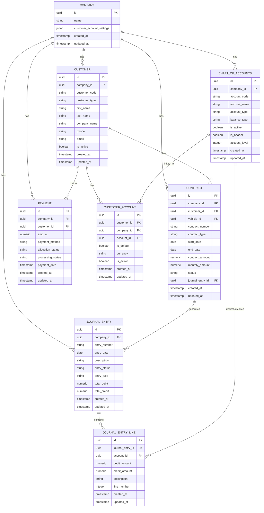
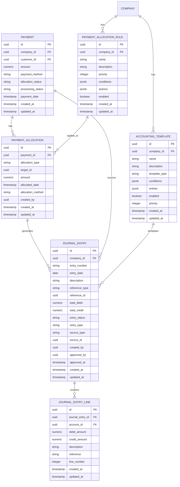
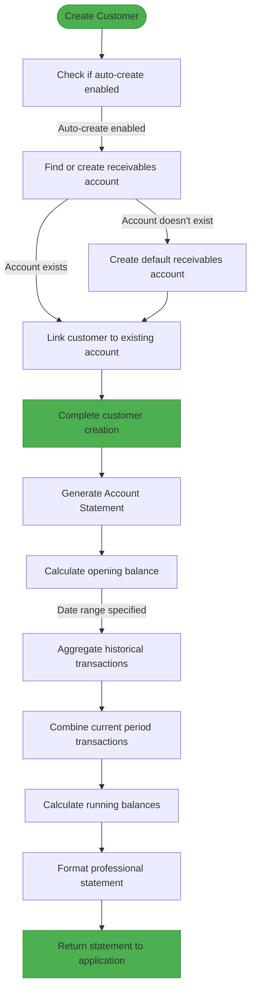
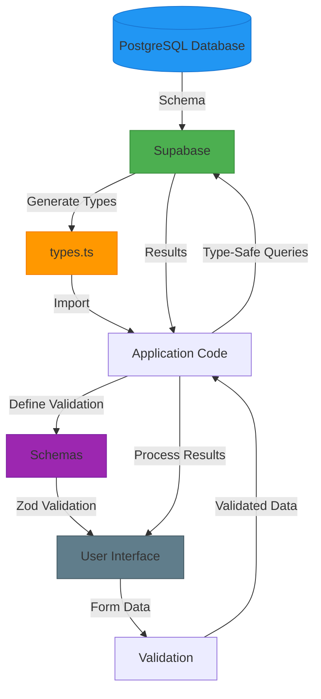
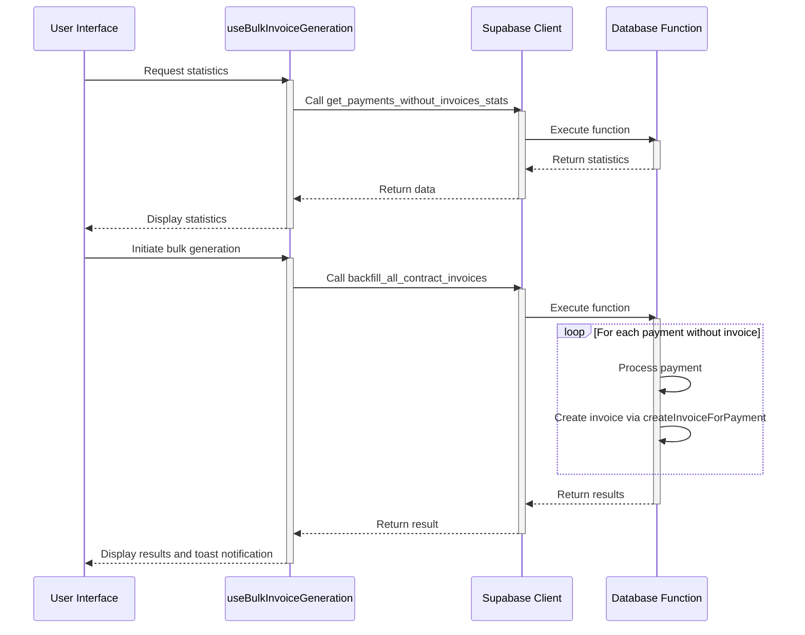
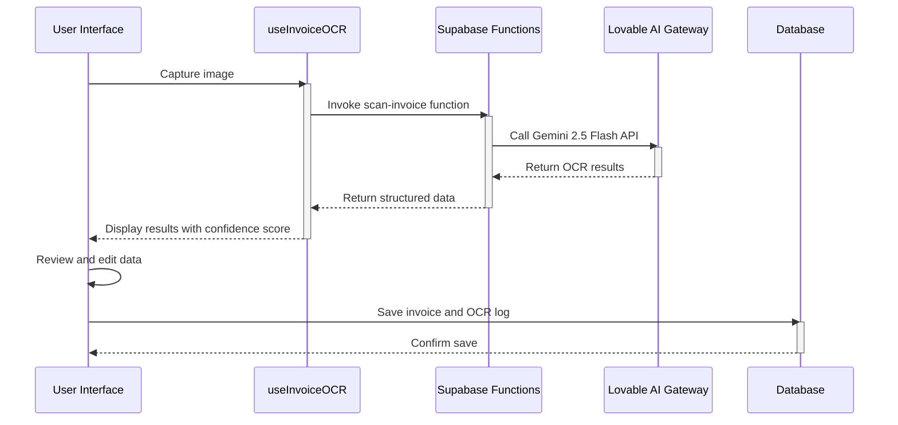
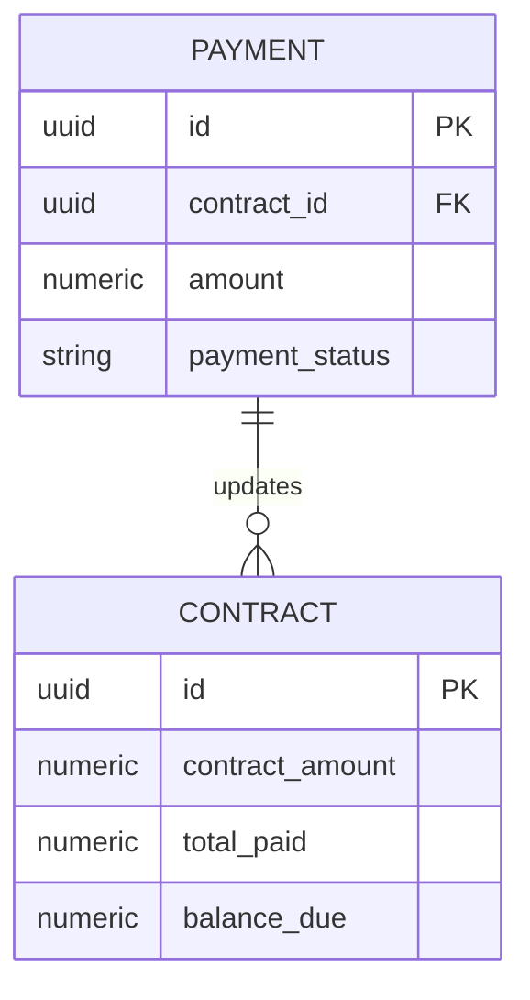

# Database Schema Design

<cite>
**Referenced Files in This Document**   
- [20250117000000_professional_payment_system.sql](file://supabase/migrations/20250117000000_professional_payment_system.sql)
- [20250829210000_final_contract_creation_fix.sql](file://supabase/migrations/20250829210000_final_contract_creation_fix.sql)
- [20250831000000_create_customer_account_statement_function.sql](file://supabase/migrations/20250831000000_create_customer_account_statement_function.sql)
- [20250830100000_create_auto_create_customer_accounts_function.sql](file://supabase/migrations/20250830100000_create_auto_create_customer_accounts_function.sql)
- [contract.schema.ts](file://src/schemas/contract.schema.ts)
- [customer.schema.ts](file://src/schemas/customer.schema.ts)
- [types.ts](file://src/integrations/supabase/types.ts)
- [20250925124613_55db1b61-0c10-412c-9f4d-52100be0a42e.sql](file://supabase/migrations/20250925124613_55db1b61-0c10-412c-9f4d-52100be0a42e.sql) - *Added in commit dea00f44ff6792398ad0383ab9bdc8b52cb8c3aa*
- [20251011155237_6d753134-22cb-48ea-92de-d393cceb81f9.sql](file://supabase/migrations/20251011155237_6d753134-22cb-48ea-92de-d393cceb81f9.sql) - *Added in commit 973ebdb560f0ed689880d88a5add238f358cef71*
- [20250919102842_303f6e68-fd76-4957-acc6-993601198310.sql](file://supabase/migrations/20250919102842_303f6e68-fd76-4957-acc6-993601198310.sql) - *Added in commit 109f4ac6c7aa455d17b73e8575b48139bd45cc62*
- [useBulkInvoiceGeneration.ts](file://src/hooks/useBulkInvoiceGeneration.ts) - *Added in commit dea00f44ff6792398ad0383ab9bdc8b52cb8c3aa*
- [BulkInvoiceGenerationDialog.tsx](file://src/components/contracts/BulkInvoiceGenerationDialog.tsx) - *Added in commit dea00f44ff6792398ad0383ab9bdc8b52cb8c3aa*
- [scan-invoice/index.ts](file://supabase/functions/scan-invoice/index.ts) - *Added in commit 973ebdb560f0ed689880d88a5add238f358cef71*
- [useInvoiceOCR.ts](file://src/hooks/useInvoiceOCR.ts) - *Added in commit 973ebdb560f0ed689880d88a5add238f358cef71*
- [invoiceOCR.ts](file://src/types/invoiceOCR.ts) - *Added in commit 973ebdb560f0ed689880d88a5add238f358cef71*
</cite>

## Update Summary
**Changes Made**   
- Added new section on Bulk Invoice Generation System to document the new schema changes and functionality
- Added new section on Invoice Scanning and OCR System to document the new AI-powered invoice processing features
- Added new section on Contract Payment Calculation Fix to document the trigger-based solution for maintaining accurate contract balances
- Updated the Table of Contents to include new sections
- Enhanced source tracking with new files and migration scripts from recent commits
- Added Mermaid diagrams for the new systems that visualize actual code structures

## Table of Contents
1. [Introduction](#introduction)
2. [Schema Architecture Overview](#schema-architecture-overview)
3. [Professional Payment System](#professional-payment-system)
4. [Contract Creation and Journal Entry Integration](#contract-creation-and-journal-entry-integration)
5. [Customer Account Management](#customer-account-management)
6. [Database Schema and Application Code Relationship](#database-schema-and-application-code-relationship)
7. [Migration Management and Evolution](#migration-management-and-evolution)
8. [Common Migration Issues and Solutions](#common-migration-issues-and-solutions)
9. [Bulk Invoice Generation System](#bulk-invoice-generation-system)
10. [Invoice Scanning and OCR System](#invoice-scanning-and-ocr-system)
11. [Contract Payment Calculation Fix](#contract-payment-calculation-fix)
12. [Conclusion](#conclusion)

## Introduction

The FleetifyApp database schema is a comprehensive PostgreSQL database managed through Supabase migrations that serves as the central persistence layer for enterprise data across fleet, finance, HR, property, and contract management domains. The schema is designed with a modular architecture that supports complex business operations while maintaining data integrity, security, and auditability. With over 100 migration files in the supabase/migrations/ directory, the database schema has evolved through a systematic approach that tracks structural changes over time, ensuring version control and reproducibility across environments.

The schema design follows enterprise-grade principles with a focus on financial accuracy, transactional integrity, and role-based security. It incorporates advanced features such as automated journal entry creation, payment allocation rules, approval workflows, and comprehensive audit logging. The database serves as the single source of truth for all application data, with strict referential integrity and constraints that prevent data inconsistencies. The schema is optimized for the specific business domains it supports, with specialized tables and relationships for contract management, customer accounting, vehicle fleet operations, and property management.

This documentation provides a comprehensive analysis of the database schema design, focusing on its architecture, key components, and the relationship between the database structure and application code. It covers the implementation details of critical systems such as the professional payment system, contract creation workflows, and customer account management, with practical examples from the actual codebase. The document also addresses configuration options for database connection, usage patterns for schema evolution, and solutions to common issues encountered in database migrations.

**Section sources**
- [20250117000000_professional_payment_system.sql](file://supabase/migrations/20250117000000_professional_payment_system.sql)
- [20250829210000_final_contract_creation_fix.sql](file://supabase/migrations/20250829210000_final_contract_creation_fix.sql)

## Schema Architecture Overview

The FleetifyApp database schema is organized around a central enterprise data model that integrates multiple business domains through a shared company-customer-contract structure. The architecture follows a normalized design with appropriate denormalization for performance-critical operations, balancing data integrity with query efficiency. The schema is divided into functional modules that correspond to the application's business capabilities, with clear separation of concerns between different domains while maintaining necessary integration points.

At the core of the schema is the companies table, which serves as the tenant identifier in this multi-tenant application. All data is scoped to a specific company, ensuring data isolation between organizations. The customers table represents the central entity for financial relationships, with foreign key relationships to contracts, invoices, payments, and account mappings. The contracts table acts as the primary agreement document, linking customers to vehicles or properties and defining the terms of service. This central hub-and-spoke model enables comprehensive tracking of financial obligations and revenue recognition across the enterprise.

The schema incorporates several architectural patterns to support complex business operations. Row Level Security (RLS) is implemented across all tables to enforce data access controls based on user roles and company affiliation. The security policies are defined in the migration files and leverage custom functions like get_user_company() and has_role() to determine access permissions. This approach ensures that users can only access data belonging to their organization and within their authorized scope, providing a robust security foundation without requiring application-level enforcement.

Data integrity is maintained through a comprehensive system of constraints, including primary keys, foreign keys, check constraints, and unique constraints. The schema uses UUIDs as primary keys to support distributed systems and prevent key collisions in multi-tenant environments. Check constraints are extensively used to enforce business rules at the database level, such as validating payment allocation types, journal entry statuses, and contract states. These constraints ensure data consistency even when data is modified through multiple application interfaces or direct database access.



**Diagram sources**
- [20250117000000_professional_payment_system.sql](file://supabase/migrations/20250117000000_professional_payment_system.sql)
- [20250829210000_final_contract_creation_fix.sql](file://supabase/migrations/20250829210000_final_contract_creation_fix.sql)

**Section sources**
- [20250117000000_professional_payment_system.sql](file://supabase/migrations/20250117000000_professional_payment_system.sql)
- [20250829210000_final_contract_creation_fix.sql](file://supabase/migrations/20250829210000_final_contract_creation_fix.sql)

## Professional Payment System

The professional payment system in FleetifyApp is a sophisticated financial processing engine implemented through a comprehensive set of database tables, functions, and constraints that enable automated payment allocation, journal entry creation, and financial reconciliation. The system is designed to handle complex payment scenarios across multiple business domains while maintaining strict accounting principles and auditability. The core of this system is defined in the 20250117000000_professional_payment_system.sql migration file, which creates the foundational tables and relationships.

The payment_allocations table serves as the central component for tracking how payments are distributed across various financial obligations. Each allocation record links a payment to a specific target (contract, invoice, obligation, or late fee) with a defined amount and allocation method (manual, auto, or proportional). The table includes constraints to ensure positive allocation amounts and proper referential integrity with the payments table. This design enables flexible payment application, allowing partial payments to be allocated across multiple contracts or invoices, which is essential for enterprise financial management.

Complementing the allocation system is the payment_allocation_rules table, which defines business rules for automated payment distribution. These rules are company-specific and can be prioritized to handle complex allocation scenarios. The rules are stored as JSONB objects containing conditions and actions, providing a flexible configuration system that can be extended without schema changes. This approach allows administrators to define sophisticated allocation logic, such as distributing payments first to overdue contracts, then proportionally to active contracts, or according to customer-specific agreements.

The accounting integration is implemented through the journal_entries and journal_entry_lines tables, which form a double-entry bookkeeping system. Each journal entry must be balanced (total_debit = total_credit) and is linked to its source (payment, invoice, contract, or manual entry). The journal_entry_lines table enforces the single-entry principle, ensuring that each line has either a debit or credit amount, but not both. This design provides a complete audit trail of all financial transactions and enables accurate financial reporting. The system also includes accounting_templates for automated journal entry creation based on transaction types, reducing manual data entry and ensuring consistency.



**Diagram sources**
- [20250117000000_professional_payment_system.sql](file://supabase/migrations/20250117000000_professional_payment_system.sql)

**Section sources**
- [20250117000000_professional_payment_system.sql](file://supabase/migrations/20250117000000_professional_payment_system.sql)

## Contract Creation and Journal Entry Integration

The contract creation system in FleetifyApp is designed to ensure seamless integration between contract management and financial accounting through automated journal entry creation. This integration is implemented through a series of database functions and migrations that have evolved to address various edge cases and business requirements. The system demonstrates a sophisticated approach to handling complex business transactions that span multiple domains while maintaining data consistency and integrity.

The evolution of the contract creation system is evident in the migration history, with multiple iterations addressing different aspects of the integration. The 20250829210000_final_contract_creation_fix.sql migration represents the culmination of this evolution, providing a unified function that handles all contract creation scenarios. This function, create_contract_with_journal_entry, encapsulates the entire contract creation workflow, including contract record creation, journal entry generation, and error handling. The function follows a transactional approach, ensuring that either both the contract and journal entry are created successfully, or both are rolled back in case of failure.

A key aspect of this system is its handling of account mapping, which bridges the gap between operational data (contracts) and financial data (journal entries). The function attempts to find appropriate accounts for receivables and revenue by querying the account_mappings table, which links business entities to specific chart of accounts entries. This design allows for company-specific accounting configurations while maintaining a consistent interface for contract creation. If the required accounts cannot be found, the function gracefully handles the situation by creating the contract but marking it for manual journal entry creation, preventing data loss while alerting users to the issue.

The system also incorporates comprehensive error handling and logging mechanisms. The function returns detailed JSONB responses that include success status, generated identifiers, warnings, and error messages. This structured response format enables the application to provide meaningful feedback to users and implement appropriate recovery strategies. The function includes validation for required parameters and handles various exception scenarios, ensuring robust operation even with incomplete or inconsistent data. The use of JSONB for structured data storage in related tables like account_mappings and company settings provides flexibility for future enhancements without requiring schema changes.

```mermaid
sequenceDiagram
participant App as Application
participant Func as create_contract_with_journal_entry
participant Contract as contracts table
participant Mapping as account_mappings table
participant Journal as journal_entries table
participant Lines as journal_entry_lines table
App->>Func : Call with contract data
activate Func
Func->>Func : Validate parameters
alt Parameters invalid
Func-->>App : Return error
deactivate Func
else Parameters valid
Func->>Contract : Insert contract record
activate Contract
Contract-->>Func : Return contract_id
deactivate Contract
alt Contract amount > 0
Func->>Mapping : Find receivables account
activate Mapping
Mapping-->>Func : Return account_id or null
deactivate Mapping
Func->>Mapping : Find revenue account
activate Mapping
Mapping-->>Func : Return account_id or null
deactivate Mapping
alt Accounts found
Func->>Journal : Insert journal entry
activate Journal
Journal-->>Func : Return journal_entry_id
deactivate Journal
Func->>Lines : Insert journal entry lines
activate Lines
Lines-->>Func : Confirm insertion
deactivate Lines
Func->>Contract : Update contract status to active
activate Contract
Contract-->>Func : Confirm update
deactivate Contract
else Accounts not found
Func->>Func : Set requires_manual_entry flag
Func->>Func : Add warning message
Func->>Contract : Keep contract status as draft
activate Contract
Contract-->>Func : Confirm update
deactivate Contract
end
Func->>Func : Build success response
else Contract amount = 0
Func->>Func : Build success response without journal entry
end
Func-->>App : Return result with contract details
deactivate Func
end
```

**Diagram sources**
- [20250829210000_final_contract_creation_fix.sql](file://supabase/migrations/20250829210000_final_contract_creation_fix.sql)

**Section sources**
- [20250829210000_final_contract_creation_fix.sql](file://supabase/migrations/20250829210000_final_contract_creation_fix.sql)

## Customer Account Management

The customer account management system in FleetifyApp is designed to handle the complex financial relationships between customers and the enterprise, providing automated account creation, comprehensive transaction tracking, and professional account statements. This system is implemented through a combination of database functions, triggers, and application logic that work together to maintain accurate financial records while minimizing manual intervention.

A key component of this system is the auto_create_customer_accounts function, defined in the 20250830100000_create_auto_create_customer_accounts_function.sql migration. This function automates the process of linking customers to their corresponding accounts in the chart of accounts, ensuring that every customer has appropriate accounting records from the moment they are created. The function follows a sophisticated decision-making process to determine the appropriate receivables account for a customer, first checking company settings for a configured default account, then searching for existing accounts with appropriate naming patterns, and finally creating a new default account if necessary.

The customer account statement functionality is implemented through the get_customer_account_statement_by_code function in the 20250831000000_create_customer_account_statement_function.sql migration. This comprehensive function generates professional financial statements that include opening balances, transaction histories, and running balances across multiple transaction types (invoices, payments, and journal entries). The function calculates the opening balance for a specified date range by aggregating historical transactions, providing an accurate starting point for the statement. It then combines current period transactions from invoices, payments, and journal entries into a unified timeline, calculating running balances that reflect the customer's current financial position.

The system incorporates several design patterns to ensure data consistency and integrity. The customer_accounts table serves as the bridge between operational customer data and financial accounting data, linking customers to specific accounts in the chart of accounts. This design enables flexible account management, allowing customers to have multiple accounts (e.g., for different currencies or business units) while maintaining clear relationships between entities. The system also includes comprehensive error handling and validation, with checks for customer existence, account validity, and permission requirements, ensuring that financial operations are performed only on valid and authorized data.



**Diagram sources**
- [20250830100000_create_auto_create_customer_accounts_function.sql](file://supabase/migrations/20250830100000_create_auto_create_customer_accounts_function.sql)
- [20250831000000_create_customer_account_statement_function.sql](file://supabase/migrations/20250831000000_create_customer_account_statement_function.sql)

**Section sources**
- [20250830100000_create_auto_create_customer_accounts_function.sql](file://supabase/migrations/20250830100000_create_auto_create_customer_accounts_function.sql)
- [20250831000000_create_customer_account_statement_function.sql](file://supabase/migrations/20250831000000_create_customer_account_statement_function.sql)

## Database Schema and Application Code Relationship

The relationship between the database schema and application code in FleetifyApp is characterized by a well-defined contract that ensures type safety, validation consistency, and seamless integration between the frontend and backend systems. This relationship is facilitated through several mechanisms, including TypeScript type definitions, Zod validation schemas, and Supabase-generated types that provide a single source of truth for data structures across the application.

The src/schemas/ directory contains Zod validation schemas that define the structure and validation rules for key business entities such as contracts and customers. These schemas serve as the application-level representation of the database schema, ensuring that data entered through the user interface meets the same constraints as those enforced at the database level. For example, the contract.schema.ts file defines validation rules for contract creation that mirror the constraints in the database, such as requiring a valid contract number, ensuring the end date is after the start date, and validating payment terms. This dual-layer validation approach provides immediate feedback to users while maintaining data integrity at the persistence layer.

The src/integrations/supabase/types.ts file contains TypeScript type definitions generated from the database schema, providing compile-time type safety for database operations. These types are automatically generated from the Supabase database structure and include interfaces for all tables, views, and functions. This approach ensures that any changes to the database schema are immediately reflected in the application code, reducing the risk of runtime errors due to schema mismatches. The types include detailed information about column types, relationships, and constraints, enabling developers to work with database entities in a type-safe manner.

The application code leverages these type definitions through the Supabase client, which provides a type-safe interface for database operations. When calling database functions or querying tables, the TypeScript compiler validates that the parameters and return values match the expected types, catching potential errors during development rather than at runtime. This integration is particularly important for complex operations like contract creation, where the application must pass parameters to the create_contract_with_journal_entry function and handle the returned JSONB response appropriately.



**Diagram sources**
- [contract.schema.ts](file://src/schemas/contract.schema.ts)
- [customer.schema.ts](file://src/schemas/customer.schema.ts)
- [types.ts](file://src/integrations/supabase/types.ts)

**Section sources**
- [contract.schema.ts](file://src/schemas/contract.schema.ts)
- [customer.schema.ts](file://src/schemas/customer.schema.ts)
- [types.ts](file://src/integrations/supabase/types.ts)

## Migration Management and Evolution

The migration management system in FleetifyApp demonstrates a mature approach to database schema evolution, with over 100 migration files that track the incremental changes to the database structure over time. The migrations follow a consistent naming convention that includes timestamps (e.g., 20250117000000_), ensuring that they are applied in the correct order regardless of when they were created. This approach provides a reliable and reproducible method for evolving the database schema across different environments (development, staging, production) while maintaining data integrity.

The migration files are organized in the supabase/migrations/ directory and represent a chronological history of schema changes. Each migration typically follows a pattern of creating or modifying database objects (tables, functions, indexes), adding constraints, and setting up Row Level Security (RLS) policies. The migrations are designed to be idempotent, meaning they can be safely applied multiple times without causing errors, which is essential for collaborative development and deployment automation. This is achieved through the use of IF NOT EXISTS clauses when creating objects and DROP FUNCTION IF EXISTS statements when replacing existing functions.

A notable aspect of the migration strategy is the use of both automated and manual migrations. The auto_generated_migration.sql files suggest that some migrations are generated automatically, likely through a database modeling tool or ORM, while others are hand-crafted to implement specific business logic or complex database functions. This hybrid approach allows for rapid development of basic schema changes while providing the flexibility to implement sophisticated database logic when needed. The presence of migration files with descriptive names (e.g., professional_payment_system.sql, final_contract_creation_fix.sql) indicates that the team prioritizes clarity and documentation in their migration process.

The migration system also incorporates best practices for database evolution, such as using UUIDs for primary keys to support distributed systems, implementing soft deletes through is_active flags rather than physical deletion, and using JSONB columns for flexible data storage when appropriate. The migrations include comprehensive comments in Arabic that explain the purpose and functionality of each change, providing valuable context for future maintenance. This documentation approach ensures that the rationale behind schema decisions is preserved, making it easier for new team members to understand the system's evolution.

**Section sources**
- [20250117000000_professional_payment_system.sql](file://supabase/migrations/20250117000000_professional_payment_system.sql)
- [20250829210000_final_contract_creation_fix.sql](file://supabase/migrations/20250829210000_final_contract_creation_fix.sql)
- [20250830100000_create_auto_create_customer_accounts_function.sql](file://supabase/migrations/20250830100000_create_auto_create_customer_accounts_function.sql)

## Common Migration Issues and Solutions

The FleetifyApp codebase demonstrates several patterns for addressing common issues encountered in database migrations, particularly those related to function conflicts, data consistency, and backward compatibility. These solutions reflect a mature understanding of database evolution challenges and provide practical approaches for maintaining a stable and reliable schema over time.

One common issue addressed in the migrations is function name conflicts, where multiple versions of the same function exist in the database. This is resolved through the use of DROP FUNCTION IF EXISTS statements with the CASCADE option, which removes the function and any dependent objects. For example, the 20250829210000_final_contract_creation_fix.sql migration begins with DROP FUNCTION IF EXISTS public.create_contract_with_journal_entry CASCADE, ensuring that any existing version of the function is removed before creating the new one. This approach prevents conflicts that could arise from having multiple functions with the same name but different signatures or implementations.

Another common issue is maintaining data consistency during schema changes, particularly when modifying functions that are critical to business operations. The migrations address this by implementing backward-compatible changes and providing fallback mechanisms. For instance, the create_contract_with_journal_entry function includes comprehensive error handling that allows the contract to be created even if the journal entry cannot be generated automatically. This graceful degradation ensures that core business functionality remains available even when secondary systems (like accounting integration) encounter issues, preventing complete transaction failure.

The migrations also demonstrate solutions for handling missing dependencies, such as when required accounts or configurations are not present. The auto_create_customer_accounts function includes logic to create default accounts when no suitable existing account is found, ensuring that the customer creation process can proceed even in incomplete configurations. This proactive approach to dependency management reduces the likelihood of runtime errors and provides a better user experience by handling edge cases gracefully.

Finally, the migration system addresses the challenge of evolving complex business logic through iterative improvements. The presence of multiple migration files related to contract creation and journal entry integration (e.g., fix_contract_journal_creation.sql, final_contract_creation_fix.sql) shows a pattern of incremental refinement, where each migration builds on the previous one to address specific issues or add new capabilities. This iterative approach allows the team to validate changes in production and make adjustments based on real-world usage, resulting in a more robust and reliable system over time.

**Section sources**
- [20250829210000_final_contract_creation_fix.sql](file://supabase/migrations/20250829210000_final_contract_creation_fix.sql)
- [20250830100000_create_auto_create_customer_accounts_function.sql](file://supabase/migrations/20250830100000_create_auto_create_customer_accounts_function.sql)
- [20250829220000_fix_contract_journal_creation.sql](file://supabase/migrations/20250829220000_fix_contract_journal_creation.sql)

## Bulk Invoice Generation System

The bulk invoice generation system in FleetifyApp addresses the need to create invoices for payments that were processed without corresponding invoice records. This system was implemented through the 20250925124613_55db1b61-0c10-412c-9f4d-52100be0a42e.sql migration and consists of two main components: a statistics function and a bulk processing function.

The get_payments_without_invoices_stats function provides a comprehensive overview of payments that lack invoice records, grouping them by contract and customer for better analysis. This function returns JSONB data containing the total count and amount of such payments, along with detailed breakdowns by contract. The statistics are used by the frontend to display the scope of the issue and help administrators make informed decisions about bulk processing.

The backfill_all_contract_invoices function implements the core bulk processing logic, iterating through all completed payments linked to contracts that don't have associated invoices. For each payment, it calls the createInvoiceForPayment RPC function to generate the appropriate invoice. The function includes robust error handling, transaction tracking, and performance optimizations such as periodic delays to prevent system overload. It returns detailed results including success counts, error messages, and processing time, providing full transparency into the operation.

The frontend implementation in BulkInvoiceGenerationDialog.tsx and useBulkInvoiceGeneration.ts provides a user-friendly interface for initiating and monitoring the bulk invoice generation process. The system includes safety features such as confirmation dialogs and processing indicators to prevent accidental execution. The integration between the database functions and application code ensures type safety through TypeScript interfaces that match the JSONB response structures.



**Diagram sources**
- [20250925124613_55db1b61-0c10-412c-9f4d-52100be0a42e.sql](file://supabase/migrations/20250925124613_55db1b61-0c10-412c-9f4d-52100be0a42e.sql)
- [useBulkInvoiceGeneration.ts](file://src/hooks/useBulkInvoiceGeneration.ts)
- [BulkInvoiceGenerationDialog.tsx](file://src/components/contracts/BulkInvoiceGenerationDialog.tsx)

**Section sources**
- [20250925124613_55db1b61-0c10-412c-9f4d-52100be0a42e.sql](file://supabase/migrations/20250925124613_55db1b61-0c10-412c-9f4d-52100be0a42e.sql)
- [useBulkInvoiceGeneration.ts](file://src/hooks/useBulkInvoiceGeneration.ts)
- [BulkInvoiceGenerationDialog.tsx](file://src/components/contracts/BulkInvoiceGenerationDialog.tsx)

## Invoice Scanning and OCR System

The invoice scanning and OCR system in FleetifyApp leverages AI-powered optical character recognition to automate the processing of paper or scanned invoices. This system was implemented through the 20251011155237_6d753134-22cb-48ea-92de-d393cceb81f9.sql migration and consists of a Supabase edge function, database schema changes, and frontend components.

The scan-invoice edge function, implemented in supabase/functions/scan-invoice/index.ts, uses the Lovable AI gateway to connect with Google's Gemini 2.5 Flash model for advanced OCR processing. The function accepts base64-encoded images and returns structured JSON data containing extracted invoice information such as invoice number, date, customer name, contract number, total amount, and line items. The system calculates a confidence score based on the completeness of extracted data, helping users assess the reliability of the results.

The database schema includes the invoice_ocr_logs table to store processing history, including the original image URL, extracted data, confidence scores, and processing status. This audit trail enables tracking of OCR operations and facilitates manual review when confidence scores are low. The system integrates with existing invoice and customer data to automatically match scanned invoices to appropriate records in the database.

The frontend implementation in InvoiceScannerDashboard.tsx provides a multi-step interface for capturing images, reviewing OCR results, matching to existing customers/contracts, and saving processed invoices. The useInvoiceOCR hook handles the communication with the edge function and provides loading states and error handling. The system includes visual indicators of OCR confidence and supports manual correction of extracted data before finalizing the invoice creation.



**Diagram sources**
- [20251011155237_6d753134-22cb-48ea-92de-d393cceb81f9.sql](file://supabase/migrations/20251011155237_6d753134-22cb-48ea-92de-d393cceb81f9.sql)
- [scan-invoice/index.ts](file://supabase/functions/scan-invoice/index.ts)
- [useInvoiceOCR.ts](file://src/hooks/useInvoiceOCR.ts)
- [invoiceOCR.ts](file://src/types/invoiceOCR.ts)

**Section sources**
- [20251011155237_6d753134-22cb-48ea-92de-d393cceb81f9.sql](file://supabase/migrations/20251011155237_6d753134-22cb-48ea-92de-d393cceb81f9.sql)
- [scan-invoice/index.ts](file://supabase/functions/scan-invoice/index.ts)
- [useInvoiceOCR.ts](file://src/hooks/useInvoiceOCR.ts)
- [invoiceOCR.ts](file://src/types/invoiceOCR.ts)

## Contract Payment Calculation Fix

The contract payment calculation fix addresses issues with maintaining accurate total_paid and balance_due values in the contracts table. This was implemented through the 20250919102842_303f6e68-fd76-4957-acc6-993601198310.sql migration, which introduces a database trigger that automatically updates contract financials whenever payments are modified.

The update_contract_total_paid function is a PostgreSQL trigger function that recalculates the total_paid amount for a contract whenever a payment is inserted, updated, or deleted. The function queries the payments table for all completed payments associated with the contract and sums their amounts to determine the new total_paid value. It then updates the contract's total_paid and balance_due fields accordingly, ensuring that these values are always consistent with the actual payment history.

The trigger, named payments_update_contract_totals, is attached to the payments table and executes after any INSERT, UPDATE, or DELETE operation. This ensures that contract financials are updated in real-time as payment records change, eliminating discrepancies that could occur from application-level updates. The trigger handles all payment operations, including partial payments, refunds, and payment cancellations, providing a comprehensive solution for maintaining accurate contract balances.

Additionally, the migration includes a one-time update to correct existing contract records, ensuring data consistency across the entire database. This batch update processes all contracts that have associated payments, recalculating their total_paid and balance_due values based on the current payment data. This comprehensive approach ensures that both new and existing data adhere to the same consistency rules.



**Diagram sources**
- [20250919102842_303f6e68-fd76-4957-acc6-993601198310.sql](file://supabase/migrations/20250919102842_303f6e68-fd76-4957-acc6-993601198310.sql)

**Section sources**
- [20250919102842_303f6e68-fd76-4957-acc6-993601198310.sql](file://supabase/migrations/20250919102842_303f6e68-fd76-4957-acc6-993601198310.sql)

## Conclusion

The database schema design of FleetifyApp represents a sophisticated and well-architected solution for enterprise data management across multiple business domains. The schema demonstrates a deep understanding of both database principles and business requirements, implementing a robust foundation for fleet, finance, HR, property, and contract management. Through a combination of normalized data structures, comprehensive constraints, and advanced features like automated journal entry creation, payment allocation rules, bulk invoice generation, and AI-powered OCR processing, the schema ensures data integrity, security, and auditability.

The evolution of the schema through over 100 migration files reflects a mature development process that values version control, reproducibility, and incremental improvement. Recent additions such as the bulk invoice generation system, invoice scanning OCR, and contract payment calculation fixes demonstrate the team's commitment to addressing real-world business challenges through robust database solutions. The migrations demonstrate best practices in database evolution, including the use of idempotent operations, comprehensive documentation, and careful handling of function conflicts and data consistency issues.

The integration between the database schema and application code is seamless, with TypeScript type definitions and Zod validation schemas providing a single source of truth that ensures type safety and validation consistency across the stack. The addition of AI-powered features like invoice OCR shows how the system is evolving to incorporate modern technologies while maintaining strong database fundamentals.

Key strengths of the schema design include its modular architecture, which allows for independent development of different business domains while maintaining necessary integration points; its robust security model, which leverages Row Level Security to enforce data access controls; and its comprehensive error handling, which ensures graceful degradation in the face of partial failures. The system's ability to handle complex financial operations, such as automated payment allocation, bulk invoice processing, and real-time contract balance calculations, demonstrates a sophisticated understanding of accounting principles and business requirements.

For future development, the schema provides a solid foundation that can be extended to support additional business domains or enhanced with new features. The use of JSONB columns for flexible data storage, the modular migration approach, and the integration of AI services suggest that the system is well-positioned to adapt to changing business requirements. Continued investment in documentation, automated testing, and performance optimization will ensure that the database remains a reliable and efficient component of the FleetifyApp ecosystem.

**Section sources**
- [20250117000000_professional_payment_system.sql](file://supabase/migrations/20250117000000_professional_payment_system.sql)
- [20250829210000_final_contract_creation_fix.sql](file://supabase/migrations/20250829210000_final_contract_creation_fix.sql)
- [20250831000000_create_customer_account_statement_function.sql](file://supabase/migrations/20250831000000_create_customer_account_statement_function.sql)
- [20250925124613_55db1b61-0c10-412c-9f4d-52100be0a42e.sql](file://supabase/migrations/20250925124613_55db1b61-0c10-412c-9f4d-52100be0a42e.sql)
- [20251011155237_6d753134-22cb-48ea-92de-d393cceb81f9.sql](file://supabase/migrations/20251011155237_6d753134-22cb-48ea-92de-d393cceb81f9.sql)
- [20250919102842_303f6e68-fd76-4957-acc6-993601198310.sql](file://supabase/migrations/20250919102842_303f6e68-fd76-4957-acc6-993601198310.sql)