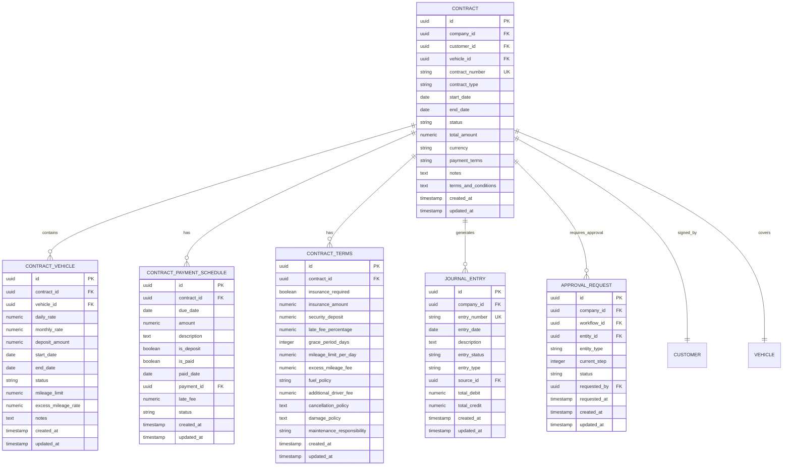
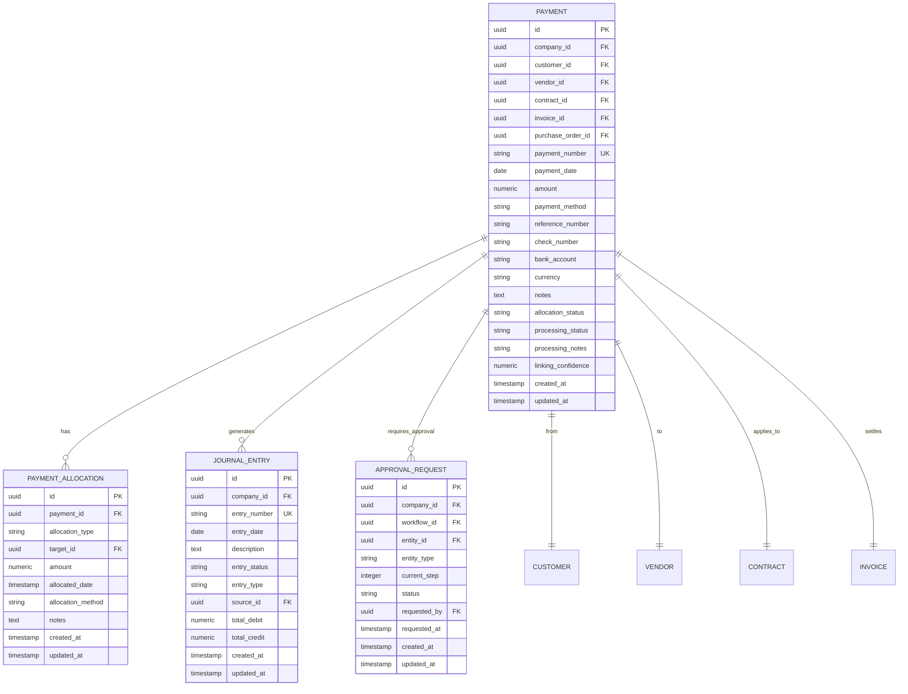

# Database Tables

<cite>
**Referenced Files in This Document**   
- [contract.schema.ts](file://src/schemas/contract.schema.ts)
- [customer.schema.ts](file://src/schemas/customer.schema.ts)
- [payment.schema.ts](file://src/schemas/payment.schema.ts)
- [types.ts](file://src/integrations/supabase/types.ts)
- [20250117000000_professional_payment_system.sql](file://supabase/migrations/20250117000000_professional_payment_system.sql)
- [20250829220100_fix_customer_accounts.sql](file://supabase/migrations/20250829220100_fix_customer_accounts.sql)
- [20250829220200_complete_customer_account_fix.sql](file://supabase/migrations/20250829220200_complete_customer_account_fix.sql)
- [20250829210000_final_contract_creation_fix.sql](file://supabase/migrations/20250829210000_final_contract_creation_fix.sql)
</cite>

## Table of Contents
1. [Introduction](#introduction)
2. [Core Entity Relationships](#core-entity-relationships)
3. [Contracts Table](#contracts-table)
4. [Customers Table](#customers-table)
5. [Vehicles Table](#vehicles-table)
6. [Properties Table](#properties-table)
7. [Financial Accounts Table](#financial-accounts-table)
8. [Employees Table](#employees-table)
9. [Payments Table](#payments-table)
10. [Data Validation and Business Rules](#data-validation-and-business-rules)
11. [Indexing and Performance Considerations](#indexing-and-performance-considerations)
12. [Data Lifecycle and Retention Policies](#data-lifecycle-and-retention-policies)
13. [Security and Access Control](#security-and-access-control)

## Introduction
This document provides comprehensive documentation for the core database tables in FleetifyApp, detailing entity relationships, field definitions, data types, constraints, and business rules implemented in the PostgreSQL schema via Supabase migrations. The system is designed to manage contracts, customers, vehicles, properties, financial accounts, employees, and payments with robust data validation, referential integrity, and security controls.

The database schema supports a multi-tenant architecture with company-level isolation and implements Row Level Security (RLS) policies to ensure data privacy. The system includes comprehensive audit logging, approval workflows, and automated accounting entries to support financial operations.

**Section sources**
- [types.ts](file://src/integrations/supabase/types.ts#L1-L100)

## Core Entity Relationships
The FleetifyApp database schema implements a normalized relational model with well-defined relationships between core entities. The primary entities include contracts, customers, vehicles, properties, financial accounts, employees, and payments, all organized within a company-based multi-tenant architecture.

**Diagram sources**
- [types.ts](file://src/integrations/supabase/types.ts#L1-L1000)
- [20250117000000_professional_payment_system.sql](file://supabase/migrations/20250117000000_professional_payment_system.sql#L1-L100)

## Contracts Table
The contracts table serves as the central entity for managing agreements between the company and customers, supporting various contract types including rental, lease, service, and maintenance agreements. Each contract is uniquely identified by a contract number and maintains comprehensive metadata about the agreement terms, financial details, and status.

The table enforces critical business rules through constraints and triggers, ensuring data integrity and consistency. Contracts are linked to customers, vehicles (for vehicle-related contracts), and financial records, creating a comprehensive audit trail of business transactions.

**Diagram sources**
- [contract.schema.ts](file://src/schemas/contract.schema.ts#L1-L50)
- [types.ts](file://src/integrations/supabase/types.ts#L1000-L2000)

**Section sources**
- [contract.schema.ts](file://src/schemas/contract.schema.ts#L1-L103)
- [20250829210000_final_contract_creation_fix.sql](file://supabase/migrations/20250829210000_final_contract_creation_fix.sql#L1-L100)

## Customers Table
The customers table manages customer information with support for both individual and corporate customers. The schema includes comprehensive contact details, identification information, and financial data such as credit limits. The table is designed to support multi-tenant operations with company-level isolation.

Customer records are linked to financial accounts through the customer_accounts table, enabling proper accounting integration. The system supports automatic creation of customer accounts based on company settings, ensuring consistent financial tracking across all customer transactions.

**Diagram sources**
- [customer.schema.ts](file://src/schemas/customer.schema.ts#L1-L50)
- [types.ts](file://src/integrations/supabase/types.ts#L2000-L3000)

**Section sources**
- [customer.schema.ts](file://src/schemas/customer.schema.ts#L1-L75)
- [20250829220200_complete_customer_account_fix.sql](file://supabase/migrations/20250829220200_complete_customer_account_fix.sql#L1-L100)

## Vehicles Table
The vehicles table manages vehicle inventory with comprehensive details about each vehicle's specifications, status, and maintenance history. Each vehicle record includes identification information, technical specifications, and operational status.

The table supports integration with contracts, enabling the system to track which vehicles are currently under agreement and their associated terms. Vehicle records are also linked to maintenance schedules and service history, providing a complete view of each vehicle's lifecycle.

**Diagram sources**
- [types.ts](file://src/integrations/supabase/types.ts#L3000-L4000)

## Properties Table
The properties table manages real estate assets with detailed information about each property's characteristics, location, and status. The schema supports various property types including residential, commercial, and industrial properties.

Property records are linked to contracts for lease agreements, enabling the system to track occupancy, rental terms, and payment schedules. The table also supports integration with maintenance requests and service history, providing comprehensive property management capabilities.

**Diagram sources**
- [types.ts](file://src/integrations/supabase/types.ts#L4000-L5000)

## Financial Accounts Table
The financial accounts table (chart_of_accounts) implements a comprehensive chart of accounts for financial management. The schema supports hierarchical account structures with multiple levels and various account types including assets, liabilities, equity, revenue, and expenses.

Accounts can be linked to customers, vendors, and other entities, enabling detailed financial tracking and reporting. The table includes attributes for account classification, balance type, and linking capabilities, supporting complex accounting requirements.

**Diagram sources**
- [types.ts](file://src/integrations/supabase/types.ts#L5000-L6000)

## Employees Table
The employees table manages employee information with comprehensive details about each employee's role, contact information, and employment status. The schema supports organizational hierarchy through manager relationships and department assignments.

Employee records are linked to various system functions including approvals, time tracking, and access control. The table includes fields for authentication, role-based access, and audit trails of employee activities.

**Diagram sources**
- [types.ts](file://src/integrations/supabase/types.ts#L6000-L7000)

## Payments Table
The payments table manages all financial transactions including customer receipts, vendor payments, and invoice settlements. The schema supports multiple payment methods and complex allocation rules for distributing payments across multiple contracts, invoices, or obligations.

The table includes comprehensive tracking of payment status, processing information, and audit trails. Payments are linked to journal entries for automated accounting integration and to approval workflows for financial controls.

**Diagram sources**
- [payment.schema.ts](file://src/schemas/payment.schema.ts#L1-L50)
- [20250117000000_professional_payment_system.sql](file://supabase/migrations/20250117000000_professional_payment_system.sql#L100-L200)

**Section sources**
- [payment.schema.ts](file://src/schemas/payment.schema.ts#L1-L88)
- [20250117000000_professional_payment_system.sql](file://supabase/migrations/20250117000000_professional_payment_system.sql#L1-L470)

## Data Validation and Business Rules
The FleetifyApp database implements comprehensive data validation and business rules through constraints, triggers, and application-level validation. These rules ensure data integrity, enforce business logic, and prevent invalid states across all core entities.

The system uses a combination of database constraints (CHECK, UNIQUE, NOT NULL), triggers for automated processes, and application-level validation schemas to provide robust data quality controls. Business rules are implemented in both the database layer and application layer to ensure consistency across all access methods.

**Diagram sources**
- [contract.schema.ts](file://src/schemas/contract.schema.ts#L50-L100)
- [customer.schema.ts](file://src/schemas/customer.schema.ts#L50-L75)
- [payment.schema.ts](file://src/schemas/payment.schema.ts#L50-L88)

**Section sources**
- [contract.schema.ts](file://src/schemas/contract.schema.ts#L1-L103)
- [customer.schema.ts](file://src/schemas/customer.schema.ts#L1-L75)
- [payment.schema.ts](file://src/schemas/payment.schema.ts#L1-L88)

## Indexing and Performance Considerations
The FleetifyApp database implements strategic indexing to optimize query performance for high-traffic tables and common access patterns. The indexing strategy balances read performance with write overhead, focusing on the most critical query paths.

Primary keys, foreign keys, and frequently queried columns are indexed to support efficient joins and filtering. Composite indexes are used for multi-column queries, and partial indexes are employed for filtered data access patterns. The system also uses functional indexes for case-insensitive searches and date-based queries.

```mermaid
erDiagram
INDEX_STRATEGY {
string table_name
string index_name
string column_list
string index_type
string usage_pattern
string performance_impact
}
TABLE_INDEX {
string table_name PK
string index_name PK
string columns
string type
boolean is_unique
boolean is_primary
text description
}
QUERY_PATTERN {
string pattern_id PK
string description
string example_query
string affected_tables
string recommended_indexes
numeric frequency
numeric impact_score
}
PERFORMANCE_METRIC {
string metric_id PK
string table_name
string index_name
numeric read_performance
numeric write_overhead
numeric storage_cost
timestamp measured_at
}
TABLE_INDEX ||--o{ INDEX_STRATEGY : "implements"
QUERY_PATTERN ||--o{ TABLE_INDEX : "benefits_from"
PERFORMANCE_METRIC ||--o{ TABLE_INDEX : "measures"
```

**Diagram sources**
- [20250117000000_professional_payment_system.sql](file://supabase/migrations/20250117000000_professional_payment_system.sql#L400-L470)
- [types.ts](file://src/integrations/supabase/types.ts#L7000-L8000)

## Data Lifecycle and Retention Policies
The FleetifyApp system implements comprehensive data lifecycle management with defined retention policies for each major entity. The policies balance legal requirements, business needs, and storage efficiency while ensuring data integrity and auditability.

Active records are maintained with full functionality, while historical records are preserved for reporting and compliance purposes. The system supports data archival and deletion workflows with proper approvals and audit trails to ensure compliance with data protection regulations.

**Diagram sources**
- [types.ts](file://src/integrations/supabase/types.ts#L8000-L9000)

## Security and Access Control
The FleetifyApp database implements robust security and access control through Row Level Security (RLS) policies, role-based access control, and comprehensive audit logging. The system ensures data isolation between companies in the multi-tenant architecture while providing granular control over data access within each organization.

All sensitive operations are logged in the audit_logs table, providing a complete trail of data modifications, access attempts, and system events. The system supports various user roles with different permission levels, from super administrators to read-only users.

**Diagram sources**
- [20250117000000_professional_payment_system.sql](file://supabase/migrations/20250117000000_professional_payment_system.sql#L300-L400)
- [types.ts](file://src/integrations/supabase/types.ts#L9000-L10000)

**Section sources**
- [20250117000000_professional_payment_system.sql](file://supabase/migrations/20250117000000_professional_payment_system.sql#L1-L470)
- [types.ts](file://src/integrations/supabase/types.ts#L1-L13339)