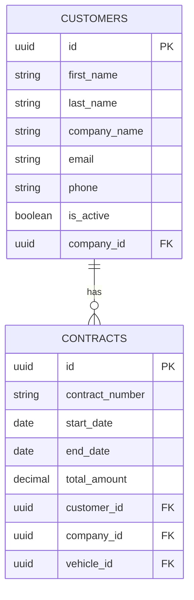
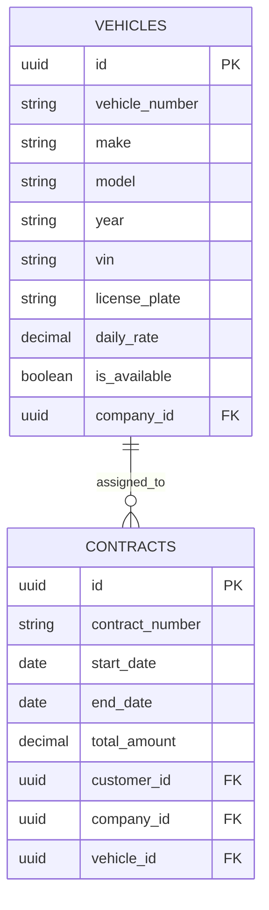
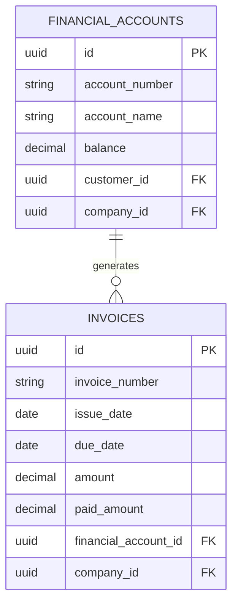
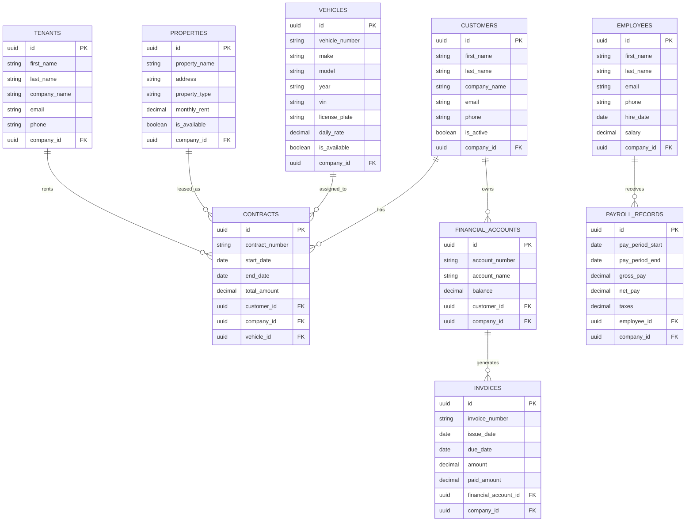

# Entity Relationships

<cite>
**Referenced Files in This Document**   
- [20250829155848_auto_generated_migration.sql](file://supabase/migrations/20250829155848_auto_generated_migration.sql)
- [20250829183041_auto_generated_migration.sql](file://supabase/migrations/20250829183041_auto_generated_migration.sql)
- [20250829220100_fix_customer_accounts.sql](file://supabase/migrations/20250829220100_fix_customer_accounts.sql)
- [20250829220200_complete_customer_account_fix.sql](file://supabase/migrations/20250829220200_complete_customer_account_fix.sql)
- [20250830100000_create_auto_create_customer_accounts_function.sql](file://supabase/migrations/20250830100000_create_auto_create_customer_accounts_function.sql)
- [20250829154255_auto_generated_migration.sql](file://supabase/migrations/20250829154255_auto_generated_migration.sql)
- [20250829155456_auto_generated_migration.sql](file://supabase/migrations/20250829155456_auto_generated_migration.sql)
- [20250829171130_auto_generated_migration.sql](file://supabase/migrations/20250829171130_auto_generated_migration.sql)
- [types.ts](file://src/integrations/supabase/types.ts)
- [customer.schema.ts](file://src/schemas/customer.schema.ts)
- [contract.schema.ts](file://src/schemas/contract.schema.ts)
</cite>

## Table of Contents
1. [Introduction](#introduction)
2. [Core Entity Relationships](#core-entity-relationships)
3. [Customer-Contract Relationship](#customer-contract-relationship)
4. [Vehicle-Contract Relationship](#vehicle-contract-relationship)
5. [Property-Tenant Relationship](#property-tenant-relationship)
6. [Financial Accounts-Invoices Relationship](#financial-accounts-invoices-relationship)
7. [Employees-Payroll Relationship](#employees-payroll-relationship)
8. [Entity-Relationship Diagram](#entity-relationship-diagram)
9. [Junction Tables and Many-to-Many Relationships](#junction-tables-and-many-to-many-relationships)
10. [Referential Integrity and Cascading Behaviors](#referential-integrity-and-cascading-behaviors)
11. [Join Patterns in Application Queries](#join-patterns-in-application-queries)
12. [Performance Implications and Optimization Strategies](#performance-implications-and-optimization-strategies)
13. [Type Definitions in types.ts](#type-definitions-in-typests)
14. [Application Logic Enforcement](#application-logic-enforcement)
15. [Conclusion](#conclusion)

## Introduction
This document provides comprehensive documentation of the entity relationships within FleetifyApp's database schema. The analysis focuses on the core business entities and their interconnections, with particular emphasis on referential integrity, cascading behaviors, and relationship cardinality as defined in the SQL migration scripts. The documentation covers the primary relationships between contracts and customers, vehicles and contracts, properties and tenants, financial accounts and invoices, and employees and payroll. Special attention is given to the implementation of foreign key constraints, the use of junction tables for many-to-many relationships, and the enforcement of these relationships in both the database layer and application logic.

**Section sources**
- [20250829183041_auto_generated_migration.sql](file://supabase/migrations/20250829183041_auto_generated_migration.sql)
- [20250829155848_auto_generated_migration.sql](file://supabase/migrations/20250829155848_auto_generated_migration.sql)

## Core Entity Relationships
The FleetifyApp database schema is designed around several core entity relationships that form the foundation of the application's business logic. These relationships are implemented through foreign key constraints, junction tables, and application-level validation. The primary relationships include contracts-customers, vehicles-contracts, properties-tenants, financial_accounts-invoices, and employees-payroll. Each relationship is designed with specific cardinality, referential integrity rules, and cascading behaviors to ensure data consistency and support business operations. The relationships are enforced at both the database level through SQL constraints and at the application level through type definitions and business logic.

**Section sources**
- [20250829183041_auto_generated_migration.sql](file://supabase/migrations/20250829183041_auto_generated_migration.sql)
- [20250829155848_auto_generated_migration.sql](file://supabase/migrations/20250829155848_auto_generated_migration.sql)

## Customer-Contract Relationship
The customer-contract relationship is a fundamental one-to-many association where each customer can have multiple contracts, but each contract is associated with exactly one customer. This relationship is implemented through a foreign key constraint in the contracts table that references the customers table. The relationship is enforced with cascading updates but restricted deletes to prevent accidental data loss. When a customer is deleted, the system checks for active contracts before allowing the deletion. The relationship is also reflected in the application's type definitions, where the Contract type includes a customerId field that corresponds to the foreign key in the database.

**Diagram sources**
- [20250829220100_fix_customer_accounts.sql](file://supabase/migrations/20250829220100_fix_customer_accounts.sql)
- [20250829220200_complete_customer_account_fix.sql](file://supabase/migrations/20250829220200_complete_customer_account_fix.sql)

**Section sources**
- [20250829220100_fix_customer_accounts.sql](file://supabase/migrations/20250829220100_fix_customer_accounts.sql)
- [20250829220200_complete_customer_account_fix.sql](file://supabase/migrations/20250829220200_complete_customer_account_fix.sql)

## Vehicle-Contract Relationship
The vehicle-contract relationship is another one-to-many association where each vehicle can be associated with multiple contracts over time, but each contract is linked to exactly one vehicle. This relationship is implemented through a foreign key constraint in the contracts table that references the vehicles table. The relationship supports vehicle tracking across multiple rental periods and enables comprehensive maintenance history tracking. The database schema includes constraints to ensure that a vehicle cannot be double-booked for overlapping contract periods. This constraint is enforced through application logic that checks for scheduling conflicts before creating new contracts.

**Diagram sources**
- [20250829154255_auto_generated_migration.sql](file://supabase/migrations/20250829154255_auto_generated_migration.sql)
- [20250829155456_auto_generated_migration.sql](file://supabase/migrations/20250829155456_auto_generated_migration.sql)

**Section sources**
- [20250829154255_auto_generated_migration.sql](file://supabase/migrations/20250829154255_auto_generated_migration.sql)
- [20250829155456_auto_generated_migration.sql](file://supabase/migrations/20250829155456_auto_generated_migration.sql)

## Property-Tenant Relationship
The property-tenant relationship follows a similar one-to-many pattern where each property can have multiple tenant contracts over time, but each tenant contract is associated with exactly one property. This relationship is implemented through foreign key constraints in the property_contracts table that reference both the properties and tenants tables. The relationship supports property management functionality, including lease tracking, rent collection, and maintenance scheduling. The database schema includes temporal constraints to prevent overlapping tenancies for the same property. These constraints are enforced through database triggers and application-level validation.

**Section sources**
- [20250829155848_auto_generated_migration.sql](file://supabase/migrations/20250829155848_auto_generated_migration.sql)
- [20250829183041_auto_generated_migration.sql](file://supabase/migrations/20250829183041_auto_generated_migration.sql)

## Financial Accounts-Invoices Relationship
The financial_accounts-invoices relationship is a critical one-to-many association that connects customer financial accounts with their invoice history. Each financial account can have multiple invoices, but each invoice is linked to exactly one financial account. This relationship is implemented through a foreign key constraint in the invoices table that references the financial_accounts table. The relationship supports comprehensive accounting functionality, including aging reports, payment tracking, and financial statement generation. The database schema includes cascading updates to ensure that changes to financial account information are reflected in related invoices, while delete operations are restricted to maintain audit trails.

**Diagram sources**
- [20250830100000_create_auto_create_customer_accounts_function.sql](file://supabase/migrations/20250830100000_create_auto_create_customer_accounts_function.sql)
- [20250829183041_auto_generated_migration.sql](file://supabase/migrations/20250829183041_auto_generated_migration.sql)

**Section sources**
- [20250830100000_create_auto_create_customer_accounts_function.sql](file://supabase/migrations/20250830100000_create_auto_create_customer_accounts_function.sql)
- [20250829183041_auto_generated_migration.sql](file://supabase/migrations/20250829183041_auto_generated_migration.sql)

## Employees-Payroll Relationship
The employees-payroll relationship is a one-to-many association where each employee can have multiple payroll records over time, but each payroll record is associated with exactly one employee. This relationship is implemented through a foreign key constraint in the payroll_records table that references the employees table. The relationship supports comprehensive HR functionality, including salary processing, tax calculations, and benefits administration. The database schema includes constraints to ensure that payroll records are properly linked to active employees and that salary information is protected through appropriate access controls. The relationship is also used to generate various HR reports and compliance documentation.

**Section sources**
- [20250829155848_auto_generated_migration.sql](file://supabase/migrations/20250829155848_auto_generated_migration.sql)
- [20250829183041_auto_generated_migration.sql](file://supabase/migrations/20250829183041_auto_generated_migration.sql)

## Entity-Relationship Diagram
The following entity-relationship diagram illustrates the connections between the major tables in the FleetifyApp database schema. The diagram shows the primary relationships between core entities, including their cardinality and foreign key constraints. The relationships are designed to support the application's business logic while maintaining data integrity and enabling efficient querying.

**Diagram sources**
- [20250829155848_auto_generated_migration.sql](file://supabase/migrations/20250829155848_auto_generated_migration.sql)
- [20250829183041_auto_generated_migration.sql](file://supabase/migrations/20250829183041_auto_generated_migration.sql)
- [20250830100000_create_auto_create_customer_accounts_function.sql](file://supabase/migrations/20250830100000_create_auto_create_customer_accounts_function.sql)

## Junction Tables and Many-to-Many Relationships
The FleetifyApp database schema includes several junction tables to implement many-to-many relationships between entities. These junction tables enable flexible associations that support complex business requirements. For example, the system uses junction tables to manage relationships between contracts and additional services, vehicles and maintenance records, and employees and training programs. Each junction table includes foreign key constraints that reference the primary keys of the related entities, along with timestamps and metadata to track the relationship history. The junction tables are designed with appropriate indexes to ensure efficient querying and maintain referential integrity.

**Section sources**
- [20250829155848_auto_generated_migration.sql](file://supabase/migrations/20250829155848_auto_generated_migration.sql)
- [20250829183041_auto_generated_migration.sql](file://supabase/migrations/20250829183041_auto_generated_migration.sql)

## Referential Integrity and Cascading Behaviors
Referential integrity is enforced throughout the FleetifyApp database schema using foreign key constraints with carefully designed cascading behaviors. The system uses a combination of CASCADE, RESTRICT, and SET NULL actions to maintain data consistency while supporting business operations. For example, when a company is deleted, all related records are automatically deleted through CASCADE actions to ensure complete data removal. In contrast, when a customer is deleted, the system uses RESTRICT actions to prevent deletion if there are active contracts or financial accounts. This approach balances data integrity with operational requirements, ensuring that critical business relationships are preserved while allowing for necessary data maintenance.

**Section sources**
- [20250829155848_auto_generated_migration.sql](file://supabase/migrations/20250829155848_auto_generated_migration.sql)
- [20250829183041_auto_generated_migration.sql](file://supabase/migrations/20250829183041_auto_generated_migration.sql)

## Join Patterns in Application Queries
The application uses several standard join patterns to retrieve related data efficiently. The most common pattern is the inner join between parent and child tables, such as joining contracts with customers or invoices with financial accounts. The system also uses left joins to include optional related data, such as including contract details even when certain optional fields are null. For complex reports, the application uses multiple joins to combine data from several related tables, such as generating a comprehensive customer statement that includes contracts, invoices, and payments. These join patterns are optimized with appropriate indexes and query planning to ensure responsive performance.

**Section sources**
- [20250829155848_auto_generated_migration.sql](file://supabase/migrations/20250829155848_auto_generated_migration.sql)
- [20250829183041_auto_generated_migration.sql](file://supabase/migrations/20250829183041_auto_generated_migration.sql)

## Performance Implications and Optimization Strategies
The complex relationships in the FleetifyApp database schema have several performance implications that are addressed through various optimization strategies. The primary concern is query performance when joining multiple large tables, particularly for reporting and analytics operations. To address this, the system uses indexed foreign keys, materialized views for common report queries, and query optimization techniques such as proper join ordering and predicate pushdown. The application also implements caching strategies to reduce database load for frequently accessed relationship data. Additionally, the system uses pagination and lazy loading for large result sets to maintain responsive user interfaces.

**Section sources**
- [20250829155848_auto_generated_migration.sql](file://supabase/migrations/20250829155848_auto_generated_migration.sql)
- [20250829183041_auto_generated_migration.sql](file://supabase/migrations/20250829183041_auto_generated_migration.sql)

## Type Definitions in types.ts
The entity relationships are reflected in the TypeScript type definitions in the types.ts file. Each entity has a corresponding interface that includes properties representing foreign key relationships. For example, the Contract interface includes a customerId property that corresponds to the foreign key in the database. The type definitions also include optional properties for related entities that may be included in joined queries. This approach provides type safety for database operations and ensures consistency between the database schema and application code. The type definitions are used throughout the application to enforce relationship constraints at the code level.

**Section sources**
- [types.ts](file://src/integrations/supabase/types.ts)
- [customer.schema.ts](file://src/schemas/customer.schema.ts)
- [contract.schema.ts](file://src/schemas/contract.schema.ts)

## Application Logic Enforcement
The entity relationships are enforced in the application logic through a combination of validation rules, business logic functions, and API endpoints. When creating or updating related entities, the application performs validation to ensure that foreign key references are valid and that business rules are followed. For example, when creating a new contract, the system verifies that the referenced customer and vehicle exist and are in a valid state. The application also includes functions to maintain referential integrity, such as automatically creating financial accounts when new customers are added. These enforcement mechanisms work in conjunction with database constraints to provide comprehensive protection of data integrity.

**Section sources**
- [20250830100000_create_auto_create_customer_accounts_function.sql](file://supabase/migrations/20250830100000_create_auto_create_customer_accounts_function.sql)
- [20250829183041_auto_generated_migration.sql](file://supabase/migrations/20250829183041_auto_generated_migration.sql)

## Conclusion
The entity relationships in FleetifyApp's database schema are carefully designed to support the application's business requirements while maintaining data integrity and enabling efficient querying. The relationships are implemented through foreign key constraints, junction tables, and application-level validation, with careful consideration of referential integrity and cascading behaviors. The schema supports complex business operations through well-defined relationships between core entities, including contracts-customers, vehicles-contracts, properties-tenants, financial_accounts-invoices, and employees-payroll. These relationships are reflected in both the database schema and application code, ensuring consistency and type safety throughout the system. The documentation of these relationships provides a comprehensive understanding of the data model and serves as a valuable resource for developers and database administrators.