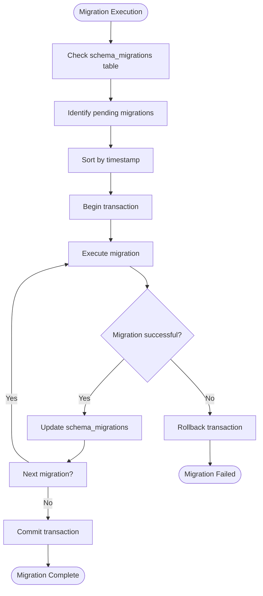
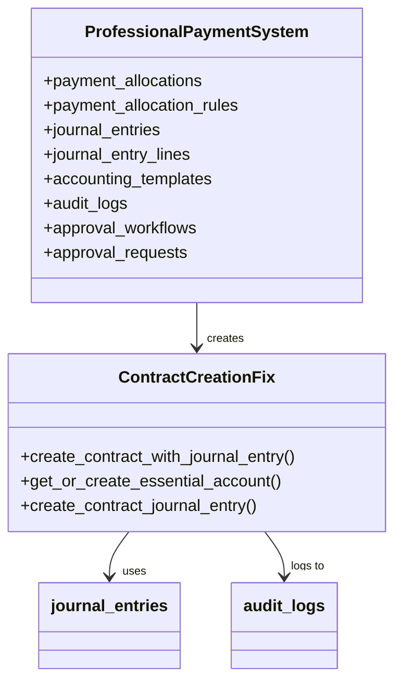
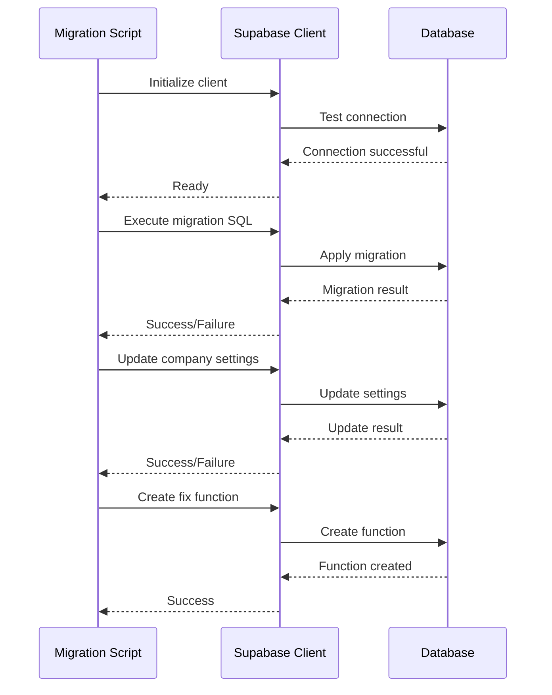

# Migration System

<cite>
**Referenced Files in This Document**   
- [20250117000000_professional_payment_system.sql](file://supabase/migrations/20250117000000_professional_payment_system.sql)
- [20250829210000_final_contract_creation_fix.sql](file://supabase/migrations/20250829210000_final_contract_creation_fix.sql)
- [apply-migration.js](file://apply-migration.js)
- [test-database.mjs](file://test-database.mjs)
</cite>

## Table of Contents
1. [Introduction](#introduction)
2. [Migration Framework Overview](#migration-framework-overview)
3. [Migration Execution Process](#migration-execution-process)
4. [Versioning Strategy](#versioning-strategy)
5. [Rollback Capabilities](#rollback-capabilities)
6. [Key Migration Patterns](#key-migration-patterns)
7. [Significant Migration Examples](#significant-migration-examples)
8. [Migration Tooling and Scripts](#migration-tooling-and-scripts)
9. [Best Practices](#best-practices)
10. [Environment Consistency](#environment-consistency)

## Introduction
The FleetifyApp database migration system is a comprehensive framework built on Supabase that manages the evolution of the application's database schema through over 100 sequential SQL migration files. This system ensures consistent database state across development, testing, and production environments while enabling safe, incremental changes to the database structure. The migration framework supports various database modification patterns including schema additions, data migrations, constraint modifications, and index optimizations. This documentation provides a detailed overview of the migration system's architecture, execution process, versioning strategy, and rollback capabilities.

## Migration Framework Overview
The Supabase migration framework in FleetifyApp follows a sequential, timestamp-based approach to database schema management. All migration files are stored in the `supabase/migrations` directory and are executed in chronological order based on their timestamp prefixes. The system maintains a `schema_migrations` table in the database to track which migrations have been applied, ensuring that each migration runs exactly once. The framework supports both automated migrations generated by Supabase and manual migrations created by developers for complex schema changes or data transformations.

**Section sources**
- [20250117000000_professional_payment_system.sql](file://supabase/migrations/20250117000000_professional_payment_system.sql)
- [20250829210000_final_contract_creation_fix.sql](file://supabase/migrations/20250829210000_final_contract_creation_fix.sql)

## Migration Execution Process
The migration execution process in FleetifyApp follows a well-defined workflow that ensures reliability and consistency. When a migration is applied, the system first verifies the current database state by checking the `schema_migrations` table for already applied migrations. Migrations are then executed sequentially in timestamp order, with each migration wrapped in a transaction to ensure atomicity. If any migration fails, the entire transaction is rolled back, maintaining database integrity. The system logs the execution status of each migration, including timestamps and any error messages, providing full auditability of the migration process.

**Diagram sources**
- [20250117000000_professional_payment_system.sql](file://supabase/migrations/20250117000000_professional_payment_system.sql)
- [20250829210000_final_contract_creation_fix.sql](file://supabase/migrations/20250829210000_final_contract_creation_fix.sql)

**Section sources**
- [20250117000000_professional_payment_system.sql](file://supabase/migrations/20250117000000_professional_payment_system.sql)
- [20250829210000_final_contract_creation_fix.sql](file://supabase/migrations/20250829210000_final_contract_creation_fix.sql)

## Versioning Strategy
FleetifyApp employs a timestamp-based versioning strategy for database migrations, with each migration file prefixed with a 14-digit timestamp in the format `YYYYMMDDHHMMSS`. This approach ensures chronological ordering of migrations and prevents conflicts when multiple developers create migrations simultaneously. The versioning system allows for precise tracking of schema changes over time and enables the recreation of database states at specific points in time. The migration framework also supports version ranges, allowing selective application of migrations within a specified time period, which is particularly useful for testing and debugging.

**Section sources**
- [20250117000000_professional_payment_system.sql](file://supabase/migrations/20250117000000_professional_payment_system.sql)
- [20250829210000_final_contract_creation_fix.sql](file://supabase/migrations/20250829210000_final_contract_creation_fix.sql)

## Rollback Capabilities
The migration system in FleetifyApp provides robust rollback capabilities to handle failed deployments or unintended changes. Each migration file can include both `up` and `down` operations, with the `down` operations defining how to reverse the changes made by the `up` operations. When a rollback is initiated, the system executes the `down` operations in reverse chronological order, restoring the database to its previous state. For migrations that cannot be safely reversed (such as data deletion), the system provides warnings and requires manual intervention. The rollback process is also transactional, ensuring that partial rollbacks do not leave the database in an inconsistent state.

**Section sources**
- [20250117000000_professional_payment_system.sql](file://supabase/migrations/20250117000000_professional_payment_system.sql)
- [20250829210000_final_contract_creation_fix.sql](file://supabase/migrations/20250829210000_final_contract_creation_fix.sql)

## Key Migration Patterns
The FleetifyApp migration system implements several key patterns for common database modification scenarios. Schema additions follow a pattern of creating new tables, columns, or constraints with appropriate default values and nullability settings. Data migrations use batch processing to handle large datasets efficiently, minimizing impact on database performance. Constraint modifications are implemented with careful consideration of existing data, often including data validation steps before applying constraints. Index optimizations follow a pattern of analyzing query patterns and creating indexes that improve performance without negatively impacting write operations.

```mermaid
flowchart TD
subgraph SchemaAddition
SA1["Create new table/column"] --> SA2["Set default values"]
SA2 --> SA3["Add constraints"]
SA3 --> SA4["Update RLS policies"]
end
subgraph DataMigration
DM1["Extract source data"] --> DM2["Transform data"]
DM2 --> DM3["Load to destination"]
DM3 --> DM4["Validate data integrity"]
end
subgraph ConstraintModification
CM1["Analyze existing data"] --> CM2["Add constraint with NOT VALID"]
CM2 --> CM3["Validate constraint"]
CM3 --> CM4["Validate constraint"]
end
subgraph IndexOptimization
IO1["Analyze query patterns"] --> IO2["Identify slow queries"]
IO2 --> IO3["Create targeted indexes"]
IO3 --> IO4["Monitor performance impact"]
end
```

**Diagram sources**
- [20250117000000_professional_payment_system.sql](file://supabase/migrations/20250117000000_professional_payment_system.sql)
- [20250829210000_final_contract_creation_fix.sql](file://supabase/migrations/20250829210000_final_contract_creation_fix.sql)

**Section sources**
- [20250117000000_professional_payment_system.sql](file://supabase/migrations/20250117000000_professional_payment_system.sql)
- [20250829210000_final_contract_creation_fix.sql](file://supabase/migrations/20250829210000_final_contract_creation_fix.sql)

## Significant Migration Examples
Two significant migration examples demonstrate the capabilities of the FleetifyApp migration system. The `professional_payment_system.sql` migration introduced a comprehensive payment processing system with multiple new tables for payment allocations, journal entries, and audit logs. This migration included complex RLS policies, triggers for automatic timestamp updates, and default data insertion. The `final_contract_creation_fix.sql` migration addressed issues with contract creation by creating a unified function that handles all contract creation scenarios, including automatic journal entry creation and error handling. This migration also included cleanup of conflicting functions and creation of essential account lookup functions.

**Diagram sources**
- [20250117000000_professional_payment_system.sql](file://supabase/migrations/20250117000000_professional_payment_system.sql)
- [20250829210000_final_contract_creation_fix.sql](file://supabase/migrations/20250829210000_final_contract_creation_fix.sql)

**Section sources**
- [20250117000000_professional_payment_system.sql](file://supabase/migrations/20250117000000_professional_payment_system.sql)
- [20250829210000_final_contract_creation_fix.sql](file://supabase/migrations/20250829210000_final_contract_creation_fix.sql)

## Migration Tooling and Scripts
The FleetifyApp migration system is supported by several tooling scripts that automate common migration tasks. The `apply-migration.js` script handles the application of customer account migrations, including creating necessary functions, updating company settings, and creating fix functions for existing data issues. This script uses the Supabase client to execute SQL commands and provides detailed logging of the migration process. The `test-database.mjs` script verifies database connectivity and tests the ability to read from and update the companies table, ensuring that the database is in a valid state before migration execution. These scripts follow a modular design, making them reusable for different migration scenarios.

**Diagram sources**
- [apply-migration.js](file://apply-migration.js)
- [test-database.mjs](file://test-database.mjs)

**Section sources**
- [apply-migration.js](file://apply-migration.js)
- [test-database.mjs](file://test-database.mjs)

## Best Practices
The FleetifyApp migration system follows several best practices for writing and deploying migrations. Migrations are kept small and focused, with each migration addressing a single logical change to the database. All migrations include comprehensive error handling and rollback procedures to ensure database integrity. Production deployments follow a staged approach, with migrations first applied to development and testing environments before being deployed to production. Migration files include detailed comments explaining the purpose of the changes and any potential impacts. The system also maintains a migration history that can be used for auditing and troubleshooting.

**Section sources**
- [20250117000000_professional_payment_system.sql](file://supabase/migrations/20250117000000_professional_payment_system.sql)
- [20250829210000_final_contract_creation_fix.sql](file://supabase/migrations/20250829210000_final_contract_creation_fix.sql)
- [apply-migration.js](file://apply-migration.js)

## Environment Consistency
The migration system ensures database consistency across development, testing, and production environments through several mechanisms. All environments use the same migration files, ensuring that schema changes are applied identically across all environments. The system includes environment-specific configuration options that allow for differences in settings without affecting the core schema. Before applying migrations, the system verifies the current database state to prevent conflicts. The migration framework also includes tools for comparing database schemas across environments, helping to identify and resolve any discrepancies that may arise.

**Section sources**
- [20250117000000_professional_payment_system.sql](file://supabase/migrations/20250117000000_professional_payment_system.sql)
- [test-database.mjs](file://test-database.mjs)