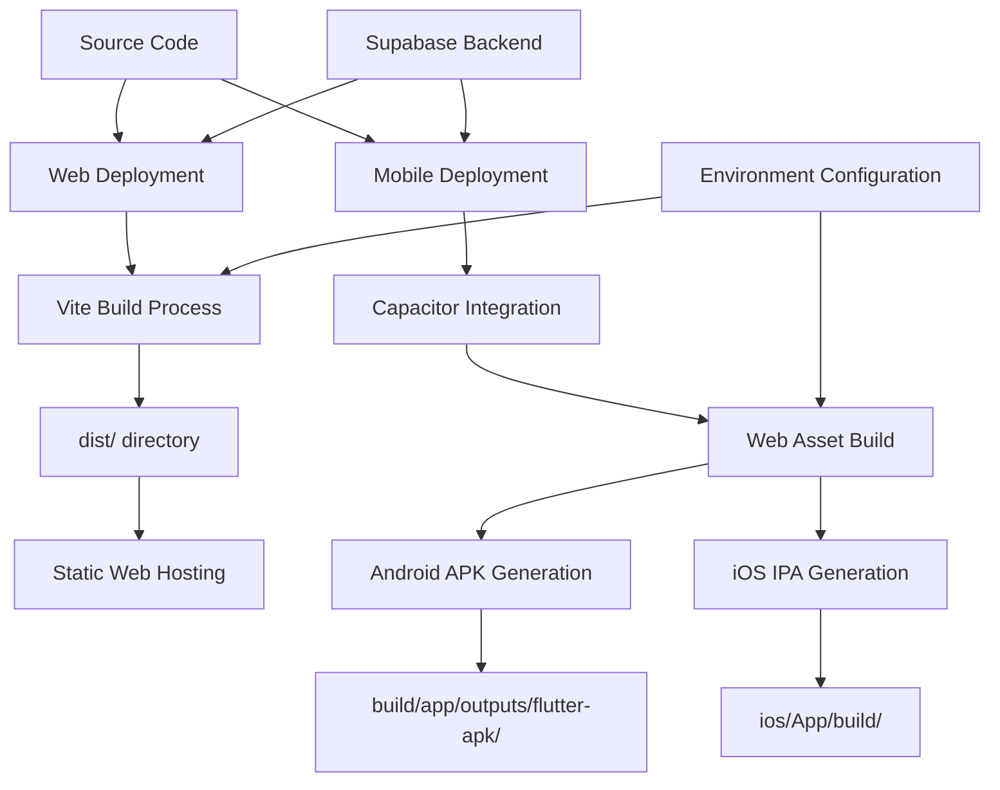
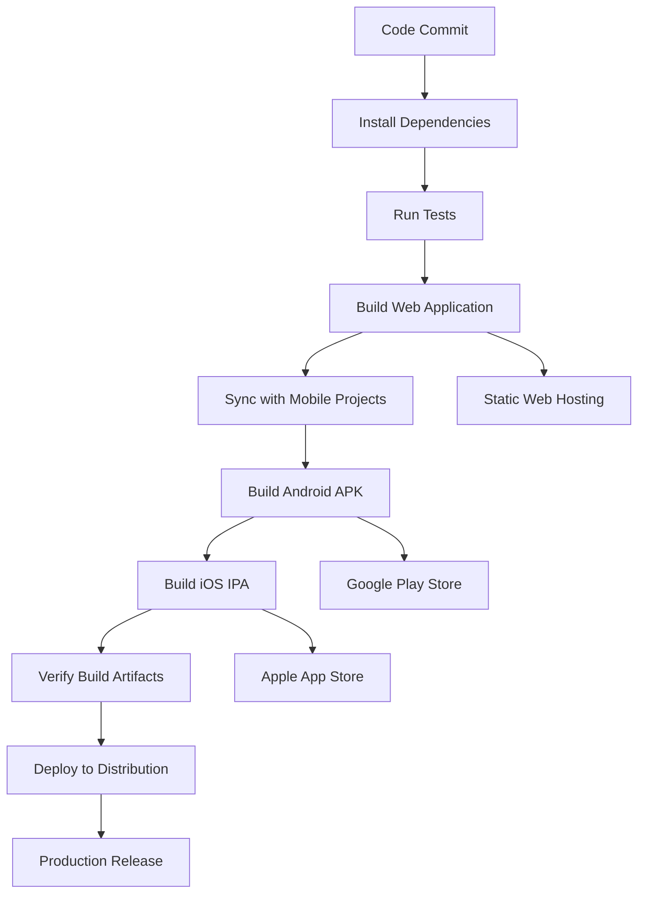

# Deployment Guide

<cite>
**Referenced Files in This Document**   
- [README.md](file://README.md)
- [vite.config.ts](file://vite.config.ts)
- [MOBILE_BUILD_GUIDE.md](file://MOBILE_BUILD_GUIDE.md)
- [build-apk.sh](file://build-apk.sh)
- [capacitor.config.ts](file://capacitor.config.ts)
</cite>

## Table of Contents
1. [Introduction](#introduction)
2. [Web Application Deployment](#web-application-deployment)
3. [Mobile Application Deployment](#mobile-application-deployment)
4. [Deployment Architecture](#deployment-architecture)
5. [Environment Configuration](#environment-configuration)
6. [Continuous Deployment Workflows](#continuous-deployment-workflows)
7. [Common Deployment Issues and Solutions](#common-deployment-issues-and-solutions)
8. [Best Practices for Production Deployment](#best-practices-for-production-deployment)

## Introduction
This guide provides comprehensive documentation for deploying FleetifyApp, an enterprise-grade application with both web and mobile platforms. The deployment process is designed to support developers and administrators in reliably deploying the application to production environments. The system leverages modern web technologies including Vite, React, and TypeScript for the frontend, with Capacitor enabling mobile app generation for Android and iOS platforms. This document covers both conceptual overviews for new team members and technical details for experienced developers, including configuration options, build optimization settings, and troubleshooting guidance.

## Web Application Deployment

The web application deployment process for FleetifyApp is configured through Vite, a modern frontend build tool that enables fast development and optimized production builds. The deployment configuration is primarily defined in `vite.config.ts`, which specifies build targets, optimization settings, and server configurations. The web application can be deployed through Lovable's publishing system or via standard web deployment methods to any static hosting service.

Key deployment commands for the web application include:
- `npm run dev`: Starts the development server with hot reloading
- `npm run build`: Creates an optimized production build in the `dist/` directory
- `npm run preview`: Serves the production build locally for testing

The Vite configuration optimizes the build process by targeting ES2020 JavaScript, implementing code splitting through manualChunks, and pre-bundling dependencies like React and Supabase. The server configuration listens on all network interfaces at port 8080, making it suitable for containerized deployments.

**Section sources**
- [vite.config.ts](file://vite.config.ts#L1-L49)
- [README.md](file://README.md#L60-L65)

## Mobile Application Deployment

Mobile application deployment for FleetifyApp utilizes Capacitor to wrap the React web application as a native mobile app for both Android and iOS platforms. The process involves building the web application, syncing assets with the native project, and generating platform-specific packages (APK for Android, IPA for iOS).

The primary method for Android APK generation is through the `build-apk.sh` script, which automates the entire build process:
1. Validates required tools (npm/npx) are installed
2. Creates the necessary build directory structure
3. Builds the production web application
4. Initializes the Capacitor Android project if needed
5. Syncs web assets with the native project
6. Builds the Android APK
7. Copies the APK to the expected output location

Alternative deployment methods include using npm scripts defined in the package.json, such as `npm run build:apk` for a complete APK build or `npm run android:run` to build and immediately run on a connected device.

**Section sources**
- [build-apk.sh](file://build-apk.sh#L1-L54)
- [MOBILE_BUILD_GUIDE.md](file://MOBILE_BUILD_GUIDE.md#L1-L157)

## Deployment Architecture

The deployment architecture for FleetifyApp follows a hybrid approach, with a shared codebase deployed to multiple platforms through different packaging methods. The architecture separates the web and mobile deployment processes while maintaining a unified codebase and configuration system.



**Diagram sources**
- [vite.config.ts](file://vite.config.ts#L1-L49)
- [capacitor.config.ts](file://capacitor.config.ts#L1-L21)
- [MOBILE_BUILD_GUIDE.md](file://MOBILE_BUILD_GUIDE.md#L1-L157)

## Environment Configuration

Environment configuration for FleetifyApp is managed through Vite's mode system and Capacitor's configuration file. The Vite configuration uses the `mode` parameter to differentiate between development and production environments, with specific plugins enabled only in development (such as componentTagger).

The web application's environment variables are defined in the `define` section of `vite.config.ts`, which injects `process.env.NODE_ENV` into the build. For mobile deployments, the configuration is managed in `capacitor.config.ts`, which specifies the app ID, name, web directory, and platform-specific settings.

Key configuration parameters include:
- `appId`: com.fleetify.app (used for Android package name and iOS bundle identifier)
- `appName`: Fleetify (display name for the mobile application)
- `webDir`: dist (output directory from Vite build)
- `android.buildOptions.releaseType`: APK (can be changed to AAB for Google Play Store)

The system is designed to use the same environment variables across web and mobile platforms, ensuring consistent behavior regardless of deployment target.

**Section sources**
- [vite.config.ts](file://vite.config.ts#L1-L49)
- [capacitor.config.ts](file://capacitor.config.ts#L1-L21)

## Continuous Deployment Workflows

FleetifyApp supports continuous deployment workflows through a combination of npm scripts and shell scripts that automate the build and packaging process. The system is designed to integrate with CI/CD pipelines for automated testing and deployment.

The primary continuous deployment scripts include:
- `build-apk.sh`: Complete automation script for Android APK generation
- `verify-build.sh`: Verification script that checks for successful APK creation
- npm scripts for various deployment stages (build, sync, mobile open)

For continuous integration, the workflow typically follows these steps:
1. Install dependencies (`npm install`)
2. Run tests (not explicitly shown but implied by standard practices)
3. Build the web application (`npm run build`)
4. Generate mobile packages (`npm run build:apk`)
5. Verify build artifacts (`npm run verify:apk`)
6. Deploy to appropriate distribution channels

The system also supports manual intervention points, such as opening the Android project in Android Studio (`npm run mobile:open:android`) or the iOS project in Xcode (`npm run mobile:open:ios`), allowing developers to make platform-specific adjustments when needed.



**Diagram sources**
- [build-apk.sh](file://build-apk.sh#L1-L54)
- [MOBILE_BUILD_GUIDE.md](file://MOBILE_BUILD_GUIDE.md#L1-L157)
- [package.json](file://package.json)

## Common Deployment Issues and Solutions

Several common issues may arise during the deployment process of FleetifyApp, particularly with mobile builds. This section documents the most frequent problems and their solutions.

### APK Not Found
When the APK is not generated in the expected location (`build/app/outputs/flutter-apk/app-release.apk`), verify:
1. Android Studio and SDK are properly installed
2. Java/JDK version is compatible (17+ required)
3. Android SDK licenses have been accepted (`sdkmanager --licenses`)
4. Environment variables (ANDROID_HOME, PATH) are correctly set

The build script includes fallback logic to copy debug APKs if release builds are not available, ensuring that some APK is always present for testing.

### Build Environment Prerequisites
Missing prerequisites are a common cause of deployment failures. The system requires:
- Node.js and npm for web and mobile build scripts
- Android Studio with SDK for Android builds
- Xcode for iOS builds (macOS only)
- JDK 17+ for Android compilation

### Capacitor Initialization Issues
If the Android project is not properly initialized:
1. Run `npx cap add android` to add the Android platform
2. Run `npx cap sync android` to synchronize web assets
3. Clean and rebuild if issues persist: `npx cap clean android && npx cap build android`

### Dependency and Version Conflicts
Update Capacitor components when encountering build errors:
```bash
npm update @capacitor/cli @capacitor/core @capacitor/android
```

The verification script (`verify-build.sh`) provides detailed diagnostics when builds fail, including searching for APK files in alternative locations and providing specific error messages to guide troubleshooting.

**Section sources**
- [build-apk.sh](file://build-apk.sh#L1-L54)
- [MOBILE_BUILD_GUIDE.md](file://MOBILE_BUILD_GUIDE.md#L1-L157)
- [verify-build.sh](file://verify-build.sh#L1-L49)

## Best Practices for Production Deployment

To ensure reliable and secure production deployments of FleetifyApp, follow these best practices:

### Web Deployment
- Always test the production build locally with `npm run preview` before deployment
- Implement proper caching strategies for static assets
- Use HTTPS for all production deployments
- Monitor bundle size and optimize dependencies regularly

### Mobile Deployment
- Configure proper signing keys for release builds (currently undefined in configuration)
- Test on multiple device types and Android versions
- Consider switching from APK to AAB (Android App Bundle) for Google Play Store distribution
- Update app icons and splash screens in the native projects

### Environment Management
- Maintain separate environment configurations for development, testing, and production
- Use environment variables for backend API endpoints and sensitive configuration
- Implement feature flags to control the rollout of new functionality

### Continuous Integration
- Automate the build and verification process in CI/CD pipelines
- Include automated testing before deployment
- Implement versioning and changelog management
- Establish rollback procedures for failed deployments

### Performance Optimization
- Leverage Vite's code splitting to reduce initial load time
- Optimize images and other static assets
- Implement lazy loading for non-critical components
- Monitor application performance in production

Following these practices will ensure smooth deployments and a reliable user experience across both web and mobile platforms.

**Section sources**
- [vite.config.ts](file://vite.config.ts#L1-L49)
- [MOBILE_BUILD_GUIDE.md](file://MOBILE_BUILD_GUIDE.md#L1-L157)
- [README.md](file://README.md#L1-L89)