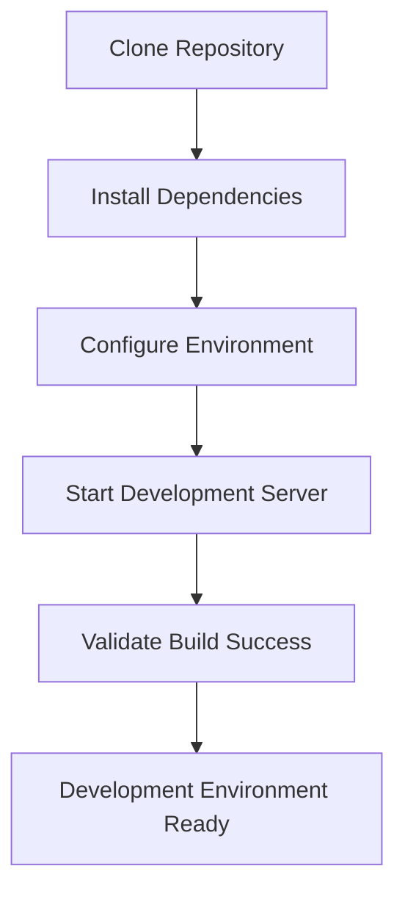
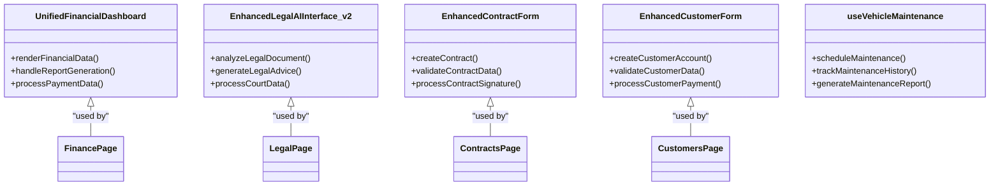
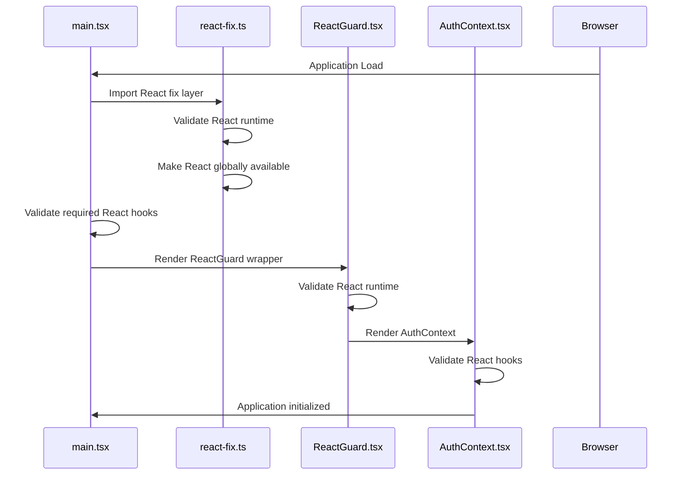
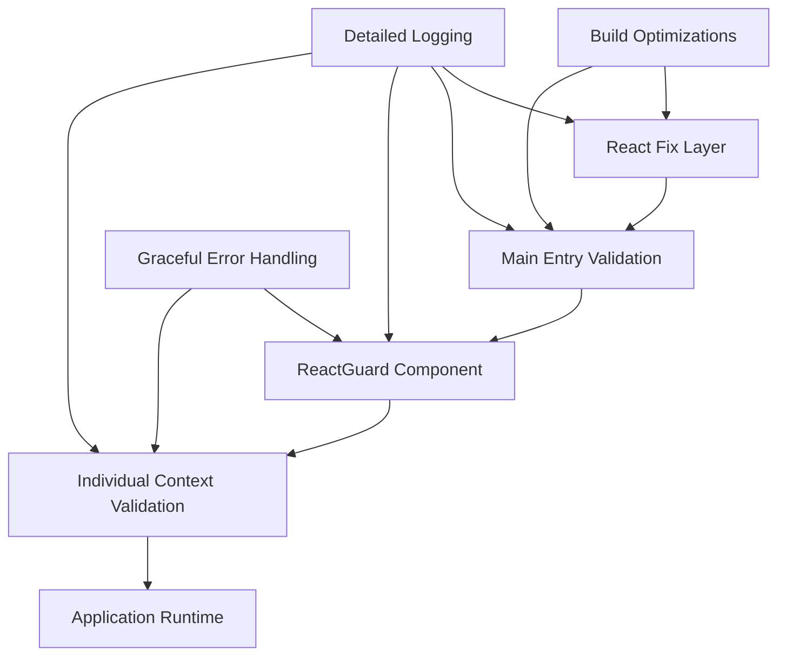
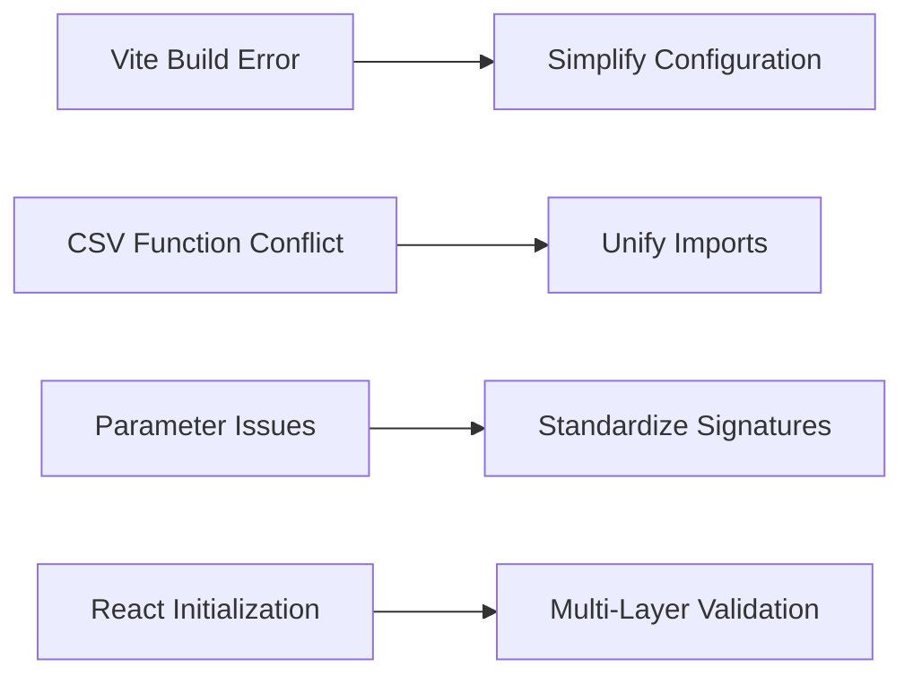

# Developer Guide

<cite>
**Referenced Files in This Document**   
- [DEVELOPER_GUIDE.md](file://DEVELOPER_GUIDE.md)
- [REACT_INITIALIZATION_FIX.md](file://REACT_INITIALIZATION_FIX.md)
- [FINAL_SYSTEM_FIXES.md](file://FINAL_SYSTEM_FIXES.md)
- [vite.config.ts](file://vite.config.ts)
- [src/main.tsx](file://src/main.tsx)
- [src/react-fix.ts](file://src/react-fix.ts)
- [src/components/ReactGuard.tsx](file://src/components/ReactGuard.tsx)
- [src/contexts/AuthContext.tsx](file://src/contexts/AuthContext.tsx)
- [src/hooks/usePaymentsCSVUpload.ts](file://src/hooks/usePaymentsCSVUpload.ts)
- [src/utils/csvHeaderMapping.ts](file://src/utils/csvHeaderMapping.ts)
</cite>

## Table of Contents
1. [Introduction](#introduction)
2. [Development Environment Setup](#development-environment-setup)
3. [Coding Standards and Architecture](#coding-standards-and-architecture)
4. [Contribution Process](#contribution-process)
5. [Development Workflows](#development-workflows)
6. [Debugging Practices](#debugging-practices)
7. [Code Quality and System Stability](#code-quality-and-system-stability)
8. [Common Development Challenges](#common-development-challenges)
9. [Development Tools Configuration](#development-tools-configuration)
10. [Troubleshooting Common Issues](#troubleshooting-common-issues)

## Introduction

This document provides comprehensive guidance for developers working on FleetifyApp, a unified fleet and enterprise management system built with React 18, TypeScript, Tailwind CSS, and Supabase. The guide covers onboarding procedures, development environment setup, coding standards, contribution processes, and solutions to common development challenges. It is designed to support both new developers joining the project and experienced developers seeking to understand the system's architecture and best practices.

The FleetifyApp system has been fully unified, eliminating duplicate components and establishing single points of entry for all major subsystems. This documentation explains the unified architecture and provides practical examples from the codebase to illustrate development patterns and best practices.

**Section sources**
- [DEVELOPER_GUIDE.md](file://DEVELOPER_GUIDE.md#L1-L470)

## Development Environment Setup

### Prerequisites
- Node.js (version 18 or higher)
- npm or yarn package manager
- Supabase account for database access
- Code editor with TypeScript support

### Initial Setup
1. Clone the repository
2. Install dependencies: `npm install`
3. Configure environment variables in `.env` file
4. Start development server: `npm run dev`

### Vite Configuration
The project uses Vite as the build tool with optimized configuration for React development. The `vite.config.ts` file includes:
- Proper module resolution with aliases
- Optimized dependency bundling
- Enhanced build target specification
- Rollup options for efficient module chunking



**Diagram sources**
- [vite.config.ts](file://vite.config.ts#L1-L50)
- [package.json](file://package.json#L1-L20)

**Section sources**
- [vite.config.ts](file://vite.config.ts#L1-L50)
- [package.json](file://package.json#L1-L20)

## Coding Standards and Architecture

### Unified Component Architecture
FleetifyApp follows a strict unified component architecture to prevent code duplication and ensure consistency across the application. The system has established single points of entry for all major subsystems:

| System | Single Entry Component | Status |
|--------|------------------------|--------|
| Financial | `UnifiedFinancialDashboard.tsx` | ✅ Ready |
| Legal | `EnhancedLegalAIInterface_v2.tsx` | ✅ Ready |
| Contracts | `EnhancedContractForm.tsx` | ✅ Ready |
| Customers | `EnhancedCustomerForm.tsx` | ✅ Ready |
| Maintenance | `useVehicleMaintenance` hook | ✅ Ready |

### Prohibited Patterns
The following patterns are strictly prohibited to maintain system unity:
- Creating duplicate files for existing functions
- Creating components with similar names (e.g., `AdvancedDashboard`, `EnhancedDashboard`)
- Creating duplicate hooks for existing functionality
- Creating multiple pages for the same purpose

### Required Checks Before Development
Before implementing any new feature, developers must:
1. Search for existing components in relevant directories
2. Check available hooks in `src/hooks/`
3. Review pages in `src/pages/`
4. Examine index.ts files for export points



**Diagram sources**
- [DEVELOPER_GUIDE.md](file://DEVELOPER_GUIDE.md#L50-L100)
- [src/components/finance/UnifiedFinancialDashboard.tsx](file://src/components/finance/UnifiedFinancialDashboard.tsx#L1-L50)
- [src/components/legal/EnhancedLegalAIInterface_v2.tsx](file://src/components/legal/EnhancedLegalAIInterface_v2.tsx#L1-L50)

**Section sources**
- [DEVELOPER_GUIDE.md](file://DEVELOPER_GUIDE.md#L1-L470)

## Contribution Process

### Adding New Features
When adding new features, developers must extend existing unified components rather than creating new ones:

#### For Financial System
```typescript
// ✅ Correct - Add to existing component
// In UnifiedFinancialDashboard.tsx
const addNewReport = () => {
  // Add new report functionality to unified component
};

// ❌ Incorrect - Creating separate component
// const NewFinancialReport = () => { ... };
```

#### For Legal System
```typescript
// ✅ Correct - Improve existing component
// In EnhancedLegalAIInterface_v2.tsx
const improveExistingFeature = () => {
  // Enhance existing legal features
};
```

#### For New Pages
```typescript
// ✅ Correct - Use unified components
import { UnifiedFinancialDashboard } from '@/components/finance';
import { EnhancedLegalAIInterface_v2 } from '@/components/legal';

const NewPage = () => {
  return (
    <div className="h-screen flex flex-col">
      <div className="flex-1">
        <UnifiedFinancialDashboard />
      </div>
    </div>
  );
};
```

### Code Review Checklist
Before submitting code for review, ensure:
- [ ] No duplicate components created
- [ ] Existing unified components used
- [ ] Proper naming conventions followed
- [ ] Semantic tokens used for styling
- [ ] Company ID included in all database queries for RLS
- [ ] Export added to index.ts if new functionality introduced

**Section sources**
- [DEVELOPER_GUIDE.md](file://DEVELOPER_GUIDE.md#L300-L400)

## Development Workflows

### React Initialization Workflow
The application implements a multi-layer validation system to ensure React is properly initialized before any component rendering:



**Diagram sources**
- [REACT_INITIALIZATION_FIX.md](file://REACT_INITIALIZATION_FIX.md#L1-L50)
- [src/main.tsx](file://src/main.tsx#L1-L30)
- [src/react-fix.ts](file://src/react-fix.ts#L1-L20)
- [src/components/ReactGuard.tsx](file://src/components/ReactGuard.tsx#L1-L25)
- [src/contexts/AuthContext.tsx](file://src/contexts/AuthContext.tsx#L1-L20)

**Section sources**
- [REACT_INITIALIZATION_FIX.md](file://REACT_INITIALIZATION_FIX.md#L1-L227)

## Debugging Practices

### Multi-Layer Validation Strategy
The system implements four layers of validation to prevent React initialization issues:

1. **Module Level**: React fix layer validates core functionality
2. **Entry Point**: Main file validates required hooks
3. **Component Level**: ReactGuard validates runtime before rendering
4. **Context Level**: Individual contexts validate hook availability

### Detailed Logging
Comprehensive logging is implemented at each validation step:
- React fix layer initialization messages
- React version information
- Hook availability verification
- Runtime validation status

Expected console output when working correctly:
```
🔧 [REACT_FIX] Initializing React fix layer...
🔧 [REACT_FIX] React version: 18.3.1
✅ [REACT_FIX] React core validation passed
✅ [REACT_FIX] React made available globally
🚀 [MAIN] Initializing application...
✅ [MAIN] All required React hooks are available
🛡️ [REACT_GUARD] Validating React runtime...
✅ [REACT_GUARD] React runtime validation successful
🔐 [AUTH_CONTEXT] Initializing AuthContext module...
✅ [AUTH_CONTEXT] All required React hooks are available
```

**Section sources**
- [REACT_INITIALIZATION_FIX.md](file://REACT_INITIALIZATION_FIX.md#L100-L150)

## Code Quality and System Stability

### Error Prevention Architecture
The system employs a comprehensive error prevention strategy with multiple layers of protection:



**Diagram sources**
- [REACT_INITIALIZATION_FIX.md](file://REACT_INITIALIZATION_FIX.md#L150-L200)
- [vite.config.ts](file://vite.config.ts#L1-L50)

**Section sources**
- [REACT_INITIALIZATION_FIX.md](file://REACT_INITIALIZATION_FIX.md#L1-L227)
- [FINAL_SYSTEM_FIXES.md](file://FINAL_SYSTEM_FIXES.md#L1-L122)

## Common Development Challenges

### Vite Build Issues
**Problem**: Build errors in Vite with message "1 error in chunk 1"
**Solution**: Simplified Vite configuration to remove conflicts

### CSV Function Conflicts
**Problem**: Conflict in using `normalizeCsvHeaders` function
**Solution**: Unified imports from `@/utils/csvHeaderMapping`

### Function Parameter Issues
**Problem**: Passing incorrect parameters to functions
**Solution**: Removed unnecessary parameters and standardized function signatures

### React Initialization Problems
**Problem**: "Cannot read properties of null (reading 'useState')"
**Root Cause**: React not properly initialized in module system
**Solution**: Implemented multi-layer validation system



**Diagram sources**
- [FINAL_SYSTEM_FIXES.md](file://FINAL_SYSTEM_FIXES.md#L1-L50)
- [REACT_INITIALIZATION_FIX.md](file://REACT_INITIALIZATION_FIX.md#L1-L50)

**Section sources**
- [FINAL_SYSTEM_FIXES.md](file://FINAL_SYSTEM_FIXES.md#L1-L122)
- [REACT_INITIALIZATION_FIX.md](file://REACT_INITIALIZATION_FIX.md#L1-L227)

## Development Tools Configuration

### Vite Configuration
The optimized `vite.config.ts` includes:

```typescript
export default defineConfig(({ mode }) => ({
  server: {
    host: "::",
    port: 8080,
  },
  plugins: [react()],
  resolve: {
    alias: {
      '@': path.resolve(__dirname, './src'),
    },
  },
  optimizeDeps: {
    include: [
      'react',
      'react-dom',
      'lucide-react',
      '@supabase/supabase-js'
    ],
  },
  build: {
    target: 'es2020',
    rollupOptions: {
      output: {
        manualChunks: {
          vendor: ['react', 'react-dom'],
        },
      },
    },
  },
  define: {
    'process.env.NODE_ENV': JSON.stringify(mode)
  }
}));
```

### ESLint Configuration
The project uses ESLint with custom rules to enforce coding standards and prevent common errors. The configuration ensures:
- Consistent code style
- Prevention of duplicate component creation
- Proper hook usage
- Security best practices

**Section sources**
- [vite.config.ts](file://vite.config.ts#L1-L50)
- [eslint.config.js](file://eslint.config.js#L1-L20)

## Troubleshooting Common Issues

### React Initialization Failure
If encountering React initialization errors:

1. **Clear Browser Cache**:
   - Hard refresh (Ctrl+F5 or Cmd+Shift+R)
   - Clear browser cache and cookies

2. **Clear Node Modules**:
   ```bash
   rm -rf node_modules package-lock.json
   npm install
   ```

3. **Check Console Logs**:
   - Look for specific error messages in validation steps
   - Identify which validation layer is failing

4. **Verify React Version**:
   - Ensure React 18.3.1 is properly installed
   - Check for version conflicts

### Build Failures
If experiencing build failures:

1. **Check Vite Configuration**:
   - Verify module resolution settings
   - Ensure proper alias configuration

2. **Validate Dependencies**:
   - Run `npm install` to ensure all dependencies are current
   - Check for conflicting package versions

3. **Test Payment Upload**:
   - Use test file `public/test-payments-enhanced.csv`
   - Verify field recognition and data processing

### Database Query Issues
When working with Supabase:

1. **Always Include Company ID**:
   ```typescript
   const { data, error } = await supabase
     .from('table_name')
     .select('*')
     .eq('company_id', companyId); // Required for RLS
   ```

2. **Check RLS Policies**:
   - Ensure user roles have appropriate permissions
   - Verify row-level security rules

**Section sources**
- [REACT_INITIALIZATION_FIX.md](file://REACT_INITIALIZATION_FIX.md#L200-L227)
- [FINAL_SYSTEM_FIXES.md](file://FINAL_SYSTEM_FIXES.md#L50-L100)
- [DEVELOPER_GUIDE.md](file://DEVELOPER_GUIDE.md#L200-L250)