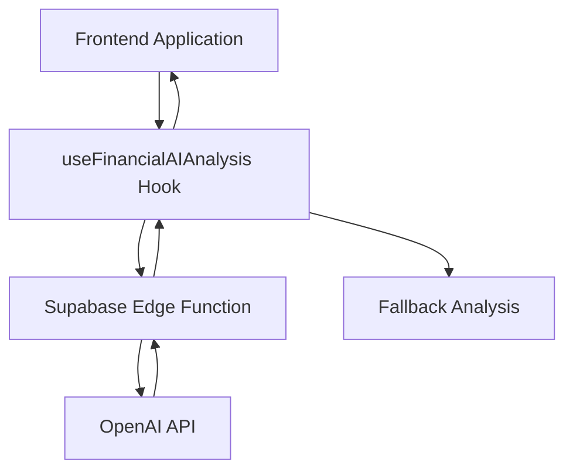
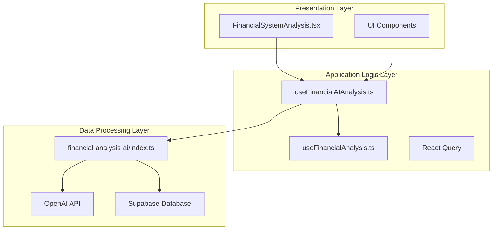
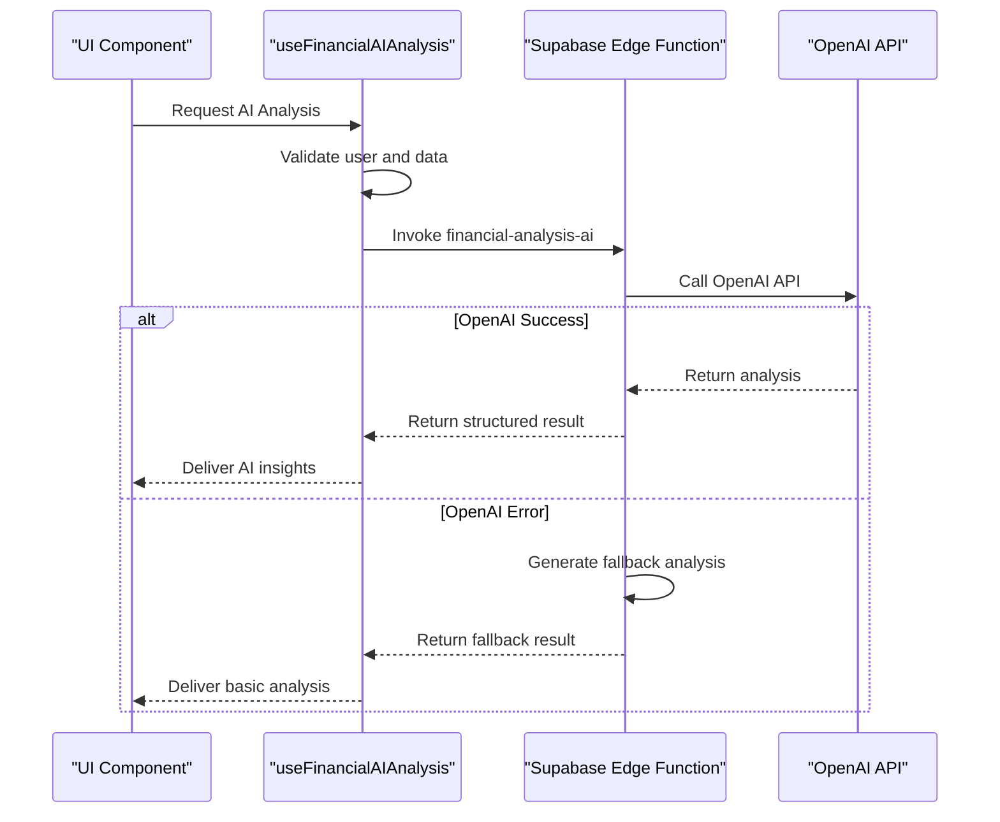
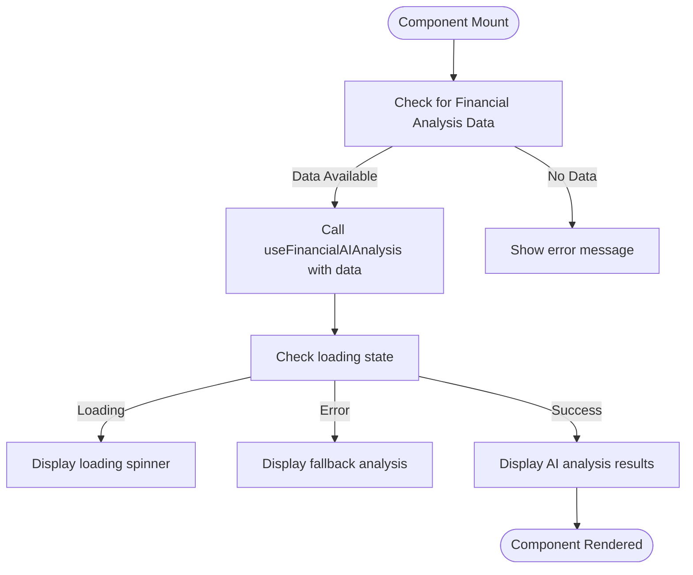
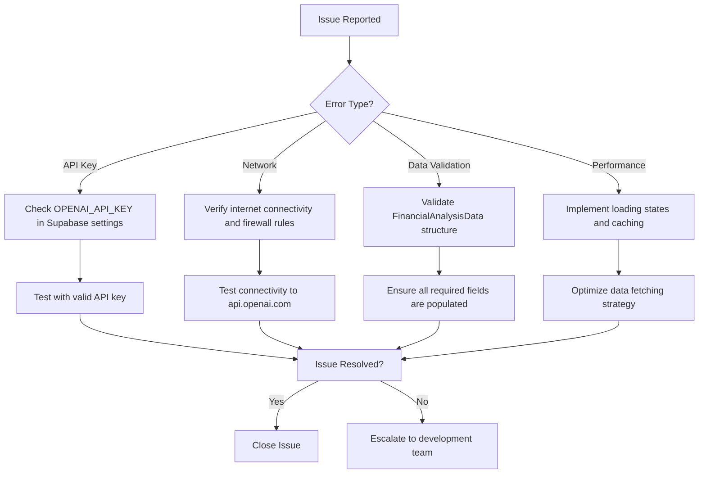

# Financial AI Analysis Hooks

<cite>
**Referenced Files in This Document**   
- [useFinancialAIAnalysis.ts](file://src/hooks/useFinancialAIAnalysis.ts)
- [financial-analysis-ai/index.ts](file://supabase/functions/financial-analysis-ai/index.ts)
- [useFinancialAnalysis.ts](file://src/hooks/useFinancialAnalysis.ts)
- [FinancialSystemAnalysis.tsx](file://src/pages/finance/settings/FinancialSystemAnalysis.tsx)
</cite>

## Table of Contents
1. [Introduction](#introduction)
2. [Core Components](#core-components)
3. [Architecture Overview](#architecture-overview)
4. [API Interfaces](#api-interfaces)
5. [Integration Patterns](#integration-patterns)
6. [Practical Examples](#practical-examples)
7. [Troubleshooting Guide](#troubleshooting-guide)
8. [Conclusion](#conclusion)

## Introduction

The Financial AI Analysis Hooks provide a sophisticated system for financial data analysis that combines traditional financial metrics with artificial intelligence-powered insights. This system enables organizations to gain comprehensive understanding of their financial health through automated analysis, risk assessment, and intelligent recommendations.

The core functionality revolves around the `useFinancialAIAnalysis` hook, which serves as the primary interface between the frontend application and the AI-powered financial analysis engine. This hook orchestrates the collection of financial data, communication with the AI service, and delivery of actionable insights to users.

The system is designed with a fallback mechanism to ensure reliability even when the AI service is unavailable, providing basic analysis based on predefined rules and thresholds. This dual approach ensures that users always receive valuable insights regardless of external service availability.

**Section sources**
- [useFinancialAIAnalysis.ts](file://src/hooks/useFinancialAIAnalysis.ts#L1-L145)

## Core Components

The Financial AI Analysis system consists of several interconnected components that work together to deliver comprehensive financial insights. The primary components include the frontend hook, the Supabase Edge Function, and supporting utility functions.

The `useFinancialAIAnalysis` hook is the central component that manages the entire analysis workflow. It handles authentication checks, data validation, API communication, error handling, and response processing. The hook is built on React Query, providing efficient caching and state management capabilities.

The Supabase Edge Function `financial-analysis-ai` serves as the backend processing engine, interfacing with OpenAI's API to generate sophisticated financial analysis. This serverless function processes the financial data and returns structured insights that can be easily consumed by the frontend.



**Diagram sources**
- [useFinancialAIAnalysis.ts](file://src/hooks/useFinancialAIAnalysis.ts#L1-L145)
- [financial-analysis-ai/index.ts](file://supabase/functions/financial-analysis-ai/index.ts#L1-L197)

**Section sources**
- [useFinancialAIAnalysis.ts](file://src/hooks/useFinancialAIAnalysis.ts#L1-L145)
- [financial-analysis-ai/index.ts](file://supabase/functions/financial-analysis-ai/index.ts#L1-L197)

## Architecture Overview

The Financial AI Analysis system follows a layered architecture that separates concerns and ensures maintainability. The architecture consists of three main layers: the presentation layer, the application logic layer, and the data processing layer.

The presentation layer contains the UI components that display the analysis results to users. These components consume the data provided by the hooks and render it in a user-friendly format. The `FinancialSystemAnalysis` page serves as the primary interface for users to interact with the analysis system.

The application logic layer is implemented through React hooks that manage the business logic and state. The `useFinancialAIAnalysis` hook orchestrates the entire analysis process, handling data fetching, caching, and error recovery. This layer also includes supporting hooks like `useFinancialAnalysis` that provide the foundational financial data needed for AI analysis.

The data processing layer consists of the Supabase Edge Function that interfaces with external AI services. This serverless function processes the financial data and generates comprehensive analysis using OpenAI's language models. The function includes built-in error handling and fallback mechanisms to ensure reliability.



**Diagram sources**
- [useFinancialAIAnalysis.ts](file://src/hooks/useFinancialAIAnalysis.ts#L1-L145)
- [financial-analysis-ai/index.ts](file://supabase/functions/financial-analysis-ai/index.ts#L1-L197)
- [useFinancialAnalysis.ts](file://src/hooks/useFinancialAnalysis.ts#L1-L457)
- [FinancialSystemAnalysis.tsx](file://src/pages/finance/settings/FinancialSystemAnalysis.tsx#L1-L721)

**Section sources**
- [useFinancialAIAnalysis.ts](file://src/hooks/useFinancialAIAnalysis.ts#L1-L145)
- [financial-analysis-ai/index.ts](file://supabase/functions/financial-analysis-ai/index.ts#L1-L197)
- [useFinancialAnalysis.ts](file://src/hooks/useFinancialAnalysis.ts#L1-L457)
- [FinancialSystemAnalysis.tsx](file://src/pages/finance/settings/FinancialSystemAnalysis.tsx#L1-L721)

## API Interfaces

The Financial AI Analysis system exposes several well-defined interfaces that enable seamless integration between components. These interfaces include TypeScript types, function signatures, and API contracts that ensure type safety and predictable behavior.

The primary interface is the `useFinancialAIAnalysis` hook, which accepts optional financial analysis data and returns a React Query result object containing the AI analysis. The hook's signature is designed to be flexible while maintaining strong typing:

```mermaid
classDiagram
class useFinancialAIAnalysis {
+analysisData : FinancialAnalysisData
+returns : UseQueryResult~AIAnalysisResult~
+queryKey : string[]
+enabled : boolean
+staleTime : number
+retry : number
}
class FinancialAnalysisData {
+totalAccounts : number
+chartOfAccountsScore : number
+linkageScore : number
+costCentersScore : number
+operationsScore : number
+overallScore : number
+linkedCustomers : number
+unlinkedCustomers : number
+linkedVehicles : number
+unlinkedVehicles : number
+linkedContracts : number
+unlinkedContracts : number
+activeCostCenters : number
+recentJournalEntries : number
+issues? : Array<{title : string; description : string}>
}
class AIAnalysisResult {
+analysis : string
+confidence : number
+recommendations : string[]
+riskLevel : 'low' | 'medium' | 'high' | 'critical'
+urgentActions : string[]
+timestamp : string
}
useFinancialAIAnalysis --> FinancialAnalysisData : "uses"
useFinancialAIAnalysis --> AIAnalysisResult : "returns"
```

**Diagram sources**
- [useFinancialAIAnalysis.ts](file://src/hooks/useFinancialAIAnalysis.ts#L1-L145)

**Section sources**
- [useFinancialAIAnalysis.ts](file://src/hooks/useFinancialAIAnalysis.ts#L1-L145)

## Integration Patterns

The Financial AI Analysis system employs several integration patterns that demonstrate best practices for connecting frontend applications with AI-powered backend services. These patterns ensure reliability, maintainability, and optimal user experience.

The primary integration pattern is the React Query-based data fetching approach, which provides automatic caching, background refetching, and error handling. The `useFinancialAIAnalysis` hook leverages React Query's capabilities to manage the asynchronous nature of AI analysis requests while providing a clean, synchronous interface to consuming components.

Another key pattern is the fallback analysis mechanism, which ensures that users always receive valuable insights even when the AI service is unavailable. When the OpenAI API call fails or returns an error, the system automatically generates a basic analysis based on predefined rules and thresholds. This pattern enhances system reliability and user satisfaction.

The system also implements a progressive enhancement pattern, where basic financial analysis is performed first, and AI-powered insights are added as an enhancement. This is evident in the integration between `useFinancialAnalysis` and `useFinancialAIAnalysis`, where the former provides the foundational data that the latter uses for AI processing.



**Diagram sources**
- [useFinancialAIAnalysis.ts](file://src/hooks/useFinancialAIAnalysis.ts#L1-L145)
- [financial-analysis-ai/index.ts](file://supabase/functions/financial-analysis-ai/index.ts#L1-L197)

**Section sources**
- [useFinancialAIAnalysis.ts](file://src/hooks/useFinancialAIAnalysis.ts#L1-L145)
- [financial-analysis-ai/index.ts](file://supabase/functions/financial-analysis-ai/index.ts#L1-L197)

## Practical Examples

The Financial AI Analysis system is designed to be easily integrated into various financial applications. The primary use case is demonstrated in the `FinancialSystemAnalysis` page, which provides a comprehensive dashboard for financial health monitoring.

To implement the hook in a new component, developers can follow this pattern:



The hook can be used in various contexts, such as financial dashboards, audit reports, and compliance monitoring systems. Its flexible design allows it to adapt to different financial domains by adjusting the input data structure and analysis parameters.

**Section sources**
- [FinancialSystemAnalysis.tsx](file://src/pages/finance/settings/FinancialSystemAnalysis.tsx#L1-L721)

## Troubleshooting Guide

When working with the Financial AI Analysis system, several common issues may arise. Understanding these issues and their solutions is crucial for maintaining system reliability and user satisfaction.

The most common issue is API key configuration. If the OpenAI API key is not properly configured in the Supabase environment variables, the AI analysis will fail and fall back to basic analysis. To resolve this, ensure that the `OPENAI_API_KEY` environment variable is set in the Supabase dashboard under Project Settings > API.

Another common issue is network connectivity problems between the Supabase Edge Function and the OpenAI API. This can be identified by error messages in the function logs indicating connection timeouts or failed requests. To troubleshoot this, verify that the Supabase project has internet access and that there are no firewall rules blocking outbound connections.

Data validation errors can occur when the financial analysis data structure is incomplete or malformed. The hook validates the input data and will throw an error if required fields are missing. To prevent this, ensure that all required fields in the `FinancialAnalysisData` interface are populated before calling the hook.

Performance issues may arise when analyzing large datasets, as the AI processing time increases with data complexity. To mitigate this, implement proper loading states and consider caching strategies to reduce the frequency of AI analysis requests.



**Diagram sources**
- [useFinancialAIAnalysis.ts](file://src/hooks/useFinancialAIAnalysis.ts#L1-L145)
- [financial-analysis-ai/index.ts](file://supabase/functions/financial-analysis-ai/index.ts#L1-L197)

**Section sources**
- [useFinancialAIAnalysis.ts](file://src/hooks/useFinancialAIAnalysis.ts#L1-L145)
- [financial-analysis-ai/index.ts](file://supabase/functions/financial-analysis-ai/index.ts#L1-L197)

## Conclusion

The Financial AI Analysis Hooks provide a robust and sophisticated system for financial data analysis that combines traditional financial metrics with artificial intelligence-powered insights. The system's architecture is well-designed, with clear separation of concerns and reliable fallback mechanisms.

Key strengths of the system include its type-safe interfaces, comprehensive error handling, and seamless integration between frontend and backend components. The use of React Query for state management ensures efficient data fetching and caching, while the Supabase Edge Function provides a scalable backend processing layer.

The system demonstrates best practices in several areas, including progressive enhancement, fallback mechanisms, and clean separation of concerns. These design principles ensure that the system remains reliable and maintainable as it evolves.

For future improvements, consider implementing more sophisticated data parsing in the Edge Function, adding support for multiple AI providers, and enhancing the fallback analysis with more detailed rules and heuristics.