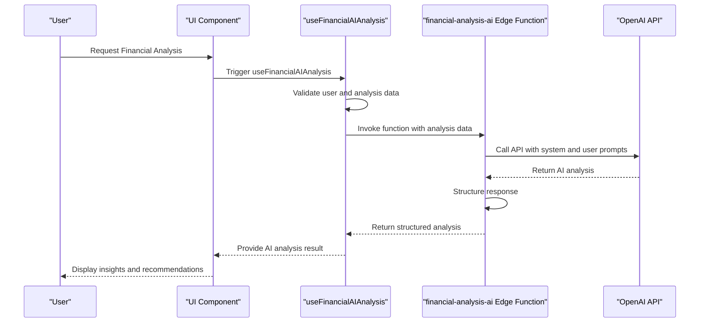
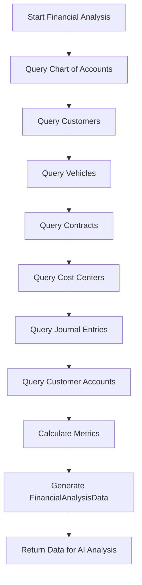
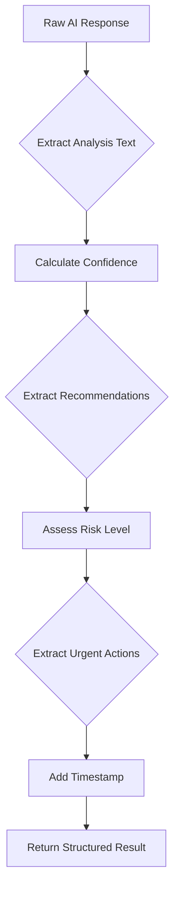
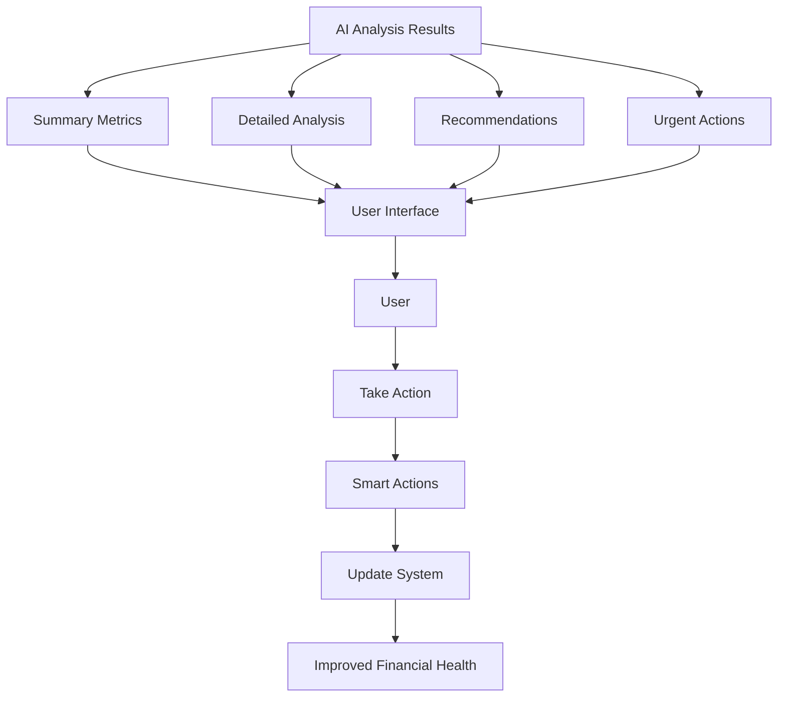
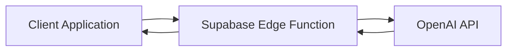
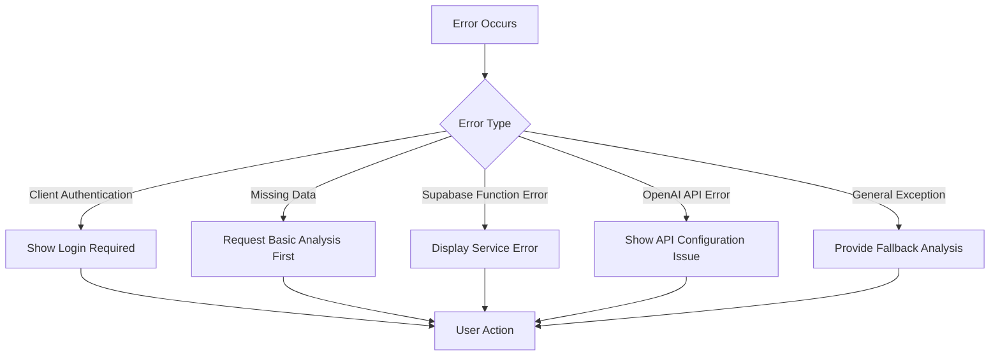
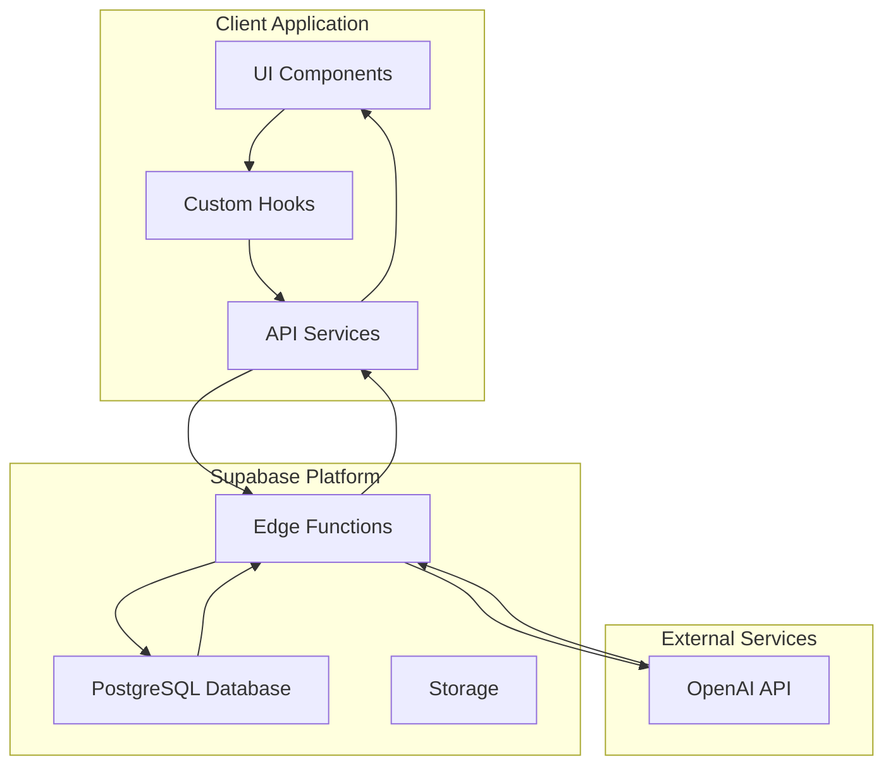

# Financial AI Analysis

<cite>
**Referenced Files in This Document**   
- [useFinancialAIAnalysis.ts](file://src/hooks/useFinancialAIAnalysis.ts)
- [index.ts](file://supabase/functions/financial-analysis-ai/index.ts)
- [FinancialSystemAnalysis.tsx](file://src/pages/finance/settings/FinancialSystemAnalysis.tsx)
- [useFinancialSystemAnalysis.ts](file://src/hooks/useFinancialSystemAnalysis.ts)
- [AI_INTEGRATION_GUIDE.md](file://AI_INTEGRATION_GUIDE.md)
</cite>

## Table of Contents
1. [Introduction](#introduction)
2. [AI Analysis Workflow](#ai-analysis-workflow)
3. [Data Inputs from Financial System Analysis](#data-inputs-from-financial-system-analysis)
4. [Prompt Engineering](#prompt-engineering)
5. [Response Parsing and Structuring](#response-parsing-and-structuring)
6. [Presentation of AI Insights](#presentation-of-ai-insights)
7. [OpenAI Integration](#openai-integration)
8. [Error Handling for API Failures](#error-handling-for-api-failures)
9. [User Actions on AI Recommendations](#user-actions-on-ai-recommendations)
10. [System Architecture Overview](#system-architecture-overview)

## Introduction
The Financial AI Analysis system provides intelligent insights into the financial health of vehicle rental/leasing businesses. This documentation details the complete workflow from data collection to AI-powered recommendations, including integration with OpenAI, error handling mechanisms, and user interaction patterns. The system analyzes financial data and provides actionable recommendations to improve accounting practices and operational efficiency.

## AI Analysis Workflow
The AI analysis workflow begins when a user requests a financial system analysis through the Financial System Analysis page. The process follows these steps:

1. **Basic Financial Analysis**: The system first performs a comprehensive analysis of the financial system using `useFinancialSystemAnalysis` hook, which evaluates chart of accounts, entity linkages, cost centers, and operational metrics.

2. **Data Preparation**: Once basic analysis is complete, relevant metrics are extracted and formatted into a structured `FinancialAnalysisData` object containing scores and metrics.

3. **AI Analysis Trigger**: The `useFinancialAIAnalysis` hook is triggered with the prepared data, initiating communication with the Supabase Edge Function.

4. **Edge Function Processing**: The `financial-analysis-ai` Edge Function receives the data and constructs a prompt for OpenAI.

5. **OpenAI Processing**: The Edge Function calls the OpenAI API with the constructed prompt and receives a natural language analysis.

6. **Response Structuring**: The AI response is parsed and structured into a standardized format with confidence scores, risk levels, recommendations, and urgent actions.

7. **Fallback Mechanism**: If the AI analysis fails, a fallback analysis is generated based on the original financial scores.

8. **Presentation**: The final analysis is presented to the user through the UI with visual indicators and actionable recommendations.



**Diagram sources**
- [useFinancialAIAnalysis.ts](file://src/hooks/useFinancialAIAnalysis.ts)
- [index.ts](file://supabase/functions/financial-analysis-ai/index.ts)

**Section sources**
- [useFinancialAIAnalysis.ts](file://src/hooks/useFinancialAIAnalysis.ts)
- [FinancialSystemAnalysis.tsx](file://src/pages/finance/settings/FinancialSystemAnalysis.tsx)

## Data Inputs from Financial System Analysis
The AI analysis system relies on comprehensive financial data collected from multiple sources within the application. The primary data inputs are provided through the `FinancialAnalysisData` interface and include:

- **Overall Financial Health**: Overall score percentage representing the financial system's health
- **Component Scores**: Individual scores for chart of accounts, linkage, cost centers, and operations
- **Entity Linkage Metrics**: Counts of linked and unlinked customers, vehicles, and contracts
- **Cost Center Information**: Number of active cost centers
- **Recent Activity**: Count of recent journal entries
- **Specific Issues**: List of identified financial issues with titles and descriptions

The data collection process involves querying multiple database tables to gather real-time information about the financial system:



The system evaluates four key dimensions of financial health:
- **Chart of Accounts Score**: Assesses completeness of the accounting structure
- **Linkage Score**: Measures how well entities are connected to accounting records
- **Cost Centers Score**: Evaluates the setup and utilization of cost centers
- **Operations Score**: Analyzes the quality and completeness of financial transactions

**Diagram sources**
- [useFinancialSystemAnalysis.ts](file://src/hooks/useFinancialSystemAnalysis.ts)

**Section sources**
- [useFinancialSystemAnalysis.ts](file://src/hooks/useFinancialSystemAnalysis.ts)
- [useFinancialAIAnalysis.ts](file://src/hooks/useFinancialAIAnalysis.ts)

## Prompt Engineering
The system employs sophisticated prompt engineering to ensure high-quality AI responses. The prompt structure consists of two main components: a system prompt that defines the AI's role and requirements, and a user prompt that provides specific financial data for analysis.

### System Prompt
The system prompt establishes the AI's role and expectations:
- Defines the AI as an expert financial and accounting analyst
- Specifies the required output components (comprehensive analysis, issue identification, improvement suggestions, risk assessment, and action plan)
- Emphasizes precision and specificity in the analysis
- Instructs the use of accounting best practices

The system uses language-specific prompts, with Arabic being the default language for the target market. The prompt is designed to elicit structured, actionable responses rather than generic advice.

### User Prompt
The user prompt contains the actual financial data to be analyzed, formatted in a clear, structured way:

- **Financial System Analysis Data**: Core metrics including total accounts and component scores
- **Detailed Metrics**: Specific linkage information for customers, vehicles, and contracts
- **Company Context**: Company type (Vehicle Rental/Leasing by default)
- **Current Issues**: List of identified problems from the basic analysis

The prompt structure ensures that all relevant information is presented to the AI in a consistent format, enabling reliable and comparable analyses across different companies and time periods.

```typescript
const userPrompt = `
Financial System Analysis Data:
- Total Accounts: ${analysisData.totalAccounts}
- Chart of Accounts Score: ${analysisData.chartOfAccountsScore}%
- Linkage Score: ${analysisData.linkageScore}%
- Cost Centers Score: ${analysisData.costCentersScore}%
- Operations Score: ${analysisData.operationsScore}%
- Overall Score: ${analysisData.overallScore}%

Detailed Metrics:
- Linked Customers: ${analysisData.linkedCustomers}/${analysisData.linkedCustomers + analysisData.unlinkedCustomers}
- Linked Vehicles: ${analysisData.linkedVehicles}/${analysisData.linkedVehicles + analysisData.unlinkedVehicles}
- Linked Contracts: ${analysisData.linkedContracts}/${analysisData.linkedContracts + analysisData.unlinkedContracts}
- Active Cost Centers: ${analysisData.activeCostCenters}
- Recent Journal Entries: ${analysisData.recentJournalEntries}

Company Type: ${companyType || 'Vehicle Rental/Leasing'}

Current Issues:
${analysisData.issues?.map((issue: any) => `- ${issue.title}: ${issue.description}`).join('\n') || 'No specific issues reported'}

Please provide a detailed analysis and actionable recommendations.
`
```

**Section sources**
- [index.ts](file://supabase/functions/financial-analysis-ai/index.ts)

## Response Parsing and Structuring
After receiving the AI response, the system parses and structures the output into a standardized format that can be reliably consumed by the frontend application. The structured response includes several key components:

### Structured Analysis Format
The AI response is transformed into a consistent structure defined by the `AIAnalysisResult` interface:

- **analysis**: Complete natural language analysis text
- **confidence**: Numerical confidence score (0-100) based on financial metrics
- **recommendations**: Array of specific improvement suggestions
- **riskLevel**: Categorized risk level (low, medium, high, critical)
- **urgentActions**: Array of immediate actions required
- **timestamp**: ISO timestamp of analysis completion

### Parsing Implementation
The system uses simple text processing to extract structured information from the AI's natural language response:



The parsing functions include:
- **calculateConfidence**: Computes confidence based on average of component scores
- **extractRecommendations**: Identifies lines containing recommendation keywords
- **assessRiskLevel**: Maps overall score to risk categories
- **extractUrgentActions**: Identifies lines with urgency indicators

In production, these simple extraction methods could be enhanced with more sophisticated NLP techniques to improve accuracy and reliability.

**Section sources**
- [index.ts](file://supabase/functions/financial-analysis-ai/index.ts)

## Presentation of AI Insights
The AI insights are presented to users through a comprehensive interface that makes the information accessible and actionable. The presentation layer is implemented in the `FinancialSystemAnalysis.tsx` component and includes several key elements:

### Summary Metrics
The interface displays key metrics in an easily digestible format:
- **Overall Health Score**: Large, prominent display of the overall financial score
- **Confidence Indicator**: Visual representation of analysis confidence
- **Risk Level Badge**: Color-coded badge indicating financial risk level
- **Recommendation Count**: Number of suggested improvements

### Analysis Details
The complete AI analysis is displayed in a dedicated section, preserving the natural language format while ensuring readability through proper text formatting.

### Actionable Recommendations
Recommendations are presented as a list of actionable items with checkmark indicators, making it easy for users to track implementation progress.

### Urgent Actions
Critical issues requiring immediate attention are highlighted in a separate section with warning indicators, ensuring they receive proper attention.

### Smart Actions
The system provides "Smart Actions" that allow users to automatically implement certain recommendations, such as:
- Setting up essential account mappings
- Copying default cost centers
- Creating customer accounts
- Linking unlinked contracts

These actions are implemented as mutations that can be executed with a single click, significantly reducing the effort required to address identified issues.



**Section sources**
- [FinancialSystemAnalysis.tsx](file://src/pages/finance/settings/FinancialSystemAnalysis.tsx)

## OpenAI Integration
The system integrates with OpenAI through a Supabase Edge Function, providing a secure intermediary between the client application and the OpenAI API. This architecture ensures that sensitive API keys are never exposed to the client side.

### Integration Architecture
The integration follows a server-side proxy pattern:



### Configuration
The integration is configured with the following parameters:
- **Model**: gpt-4o-mini for optimal balance of capability and cost
- **Temperature**: 0.3 for consistent, focused responses
- **Max Tokens**: 2000 to accommodate detailed analyses
- **Language**: Configurable, with Arabic as the default

### Security Measures
The system implements several security measures:
- OpenAI API key is stored as a server environment variable
- CORS headers are properly configured
- Input validation ensures data integrity
- Error handling prevents information leakage

### Request Structure
The OpenAI API request includes:
- System message defining the AI's role and requirements
- User message with structured financial data
- Configuration parameters for response generation

The Edge Function handles authentication, error management, and response formatting, providing a reliable interface for the client application.

**Section sources**
- [index.ts](file://supabase/functions/financial-analysis-ai/index.ts)

## Error Handling for API Failures
The system implements comprehensive error handling to ensure reliability and provide a good user experience even when external services fail.

### Client-Side Error Handling
The `useFinancialAIAnalysis` hook includes multiple layers of error handling:

1. **User Authentication Check**: Validates that a user is authenticated before proceeding
2. **Data Validation**: Ensures analysis data is available before making requests
3. **Supabase Function Error**: Handles errors from the Edge Function invocation
4. **AI Analysis Error**: Processes errors returned in the response body
5. **General Exception Handling**: Catches any unexpected errors during execution

When errors occur, the system provides appropriate feedback to users and falls back to a basic analysis.

### Server-Side Error Handling
The Edge Function implements robust error handling:

1. **CORS Pre-flight**: Handles OPTIONS requests for cross-origin security
2. **Input Validation**: Validates required parameters and data structure
3. **API Key Check**: Ensures OpenAI API key is configured
4. **OpenAI API Error**: Handles HTTP errors and response parsing issues
5. **General Exception**: Catches unexpected errors and returns structured error responses

### Fallback Analysis
When the AI analysis fails, the system generates a fallback analysis based on the original financial scores. This fallback includes:
- Basic interpretation of the overall score
- Identification of areas needing improvement based on component scores
- General recommendations for financial system improvement
- Appropriate risk level assessment

The fallback ensures that users always receive some form of analysis, even when the AI service is unavailable.

### User-Facing Error Messages
The UI presents user-friendly error messages that:
- Clearly indicate the nature of the problem
- Provide specific guidance for resolution (e.g., API key configuration)
- Offer retry options
- Suggest alternative actions when appropriate



**Section sources**
- [useFinancialAIAnalysis.ts](file://src/hooks/useFinancialAIAnalysis.ts)
- [index.ts](file://supabase/functions/financial-analysis-ai/index.ts)
- [FinancialSystemAnalysis.tsx](file://src/pages/finance/settings/FinancialSystemAnalysis.tsx)

## User Actions on AI Recommendations
The system enables users to act on AI recommendations through both direct implementation and automated "Smart Actions" that address common issues.

### Smart Actions Implementation
The `useFinancialFixes` hook provides several automated actions that users can execute with a single click:

- **Copy Default Cost Centers**: Creates standard cost centers for the company
- **Create Default Customer Accounts**: Sets up accounting links for customers
- **Ensure Essential Account Mappings**: Establishes critical accounting connections
- **Link Unlinked Contracts**: Connects contracts to appropriate revenue accounts
- **Run All Fixes**: Executes all available fixes in sequence

These actions are implemented as mutations with proper error handling and success feedback.

### Action Workflow
When a user initiates an action:

1. The mutation is triggered with appropriate parameters
2. The system calls the corresponding database function
3. Success or error responses are handled appropriately
4. The financial analysis is refreshed to reflect changes
5. User feedback is provided through toast notifications

### Error Handling in Actions
Each action includes comprehensive error handling that:
- Identifies specific error types (e.g., duplicate entries, missing columns)
- Provides user-friendly error messages in Arabic
- Suggests corrective actions
- Maintains system stability

### Success Feedback
When actions succeed:
- Toast notifications confirm success
- The financial analysis is automatically refreshed
- UI elements update to reflect the improved status
- Users can immediately see the impact of their actions

This closed-loop system enables users to continuously improve their financial setup based on AI recommendations.

**Section sources**
- [useFinancialFixes.ts](file://src/hooks/useFinancialFixes.ts)
- [FinancialSystemAnalysis.tsx](file://src/pages/finance/settings/FinancialSystemAnalysis.tsx)

## System Architecture Overview
The Financial AI Analysis system follows a modern, layered architecture that separates concerns and ensures maintainability.



The architecture consists of:
- **Client Layer**: React components and hooks that handle UI and user interaction
- **Service Layer**: Supabase Edge Functions that process requests and integrate with external services
- **Data Layer**: PostgreSQL database storing financial information
- **External Services**: OpenAI API for AI-powered analysis

This separation of concerns ensures that each component has a single responsibility, making the system easier to maintain and extend.

**Diagram sources**
- [useFinancialAIAnalysis.ts](file://src/hooks/useFinancialAIAnalysis.ts)
- [index.ts](file://supabase/functions/financial-analysis-ai/index.ts)

**Section sources**
- [useFinancialAIAnalysis.ts](file://src/hooks/useFinancialAIAnalysis.ts)
- [index.ts](file://supabase/functions/financial-analysis-ai/index.ts)