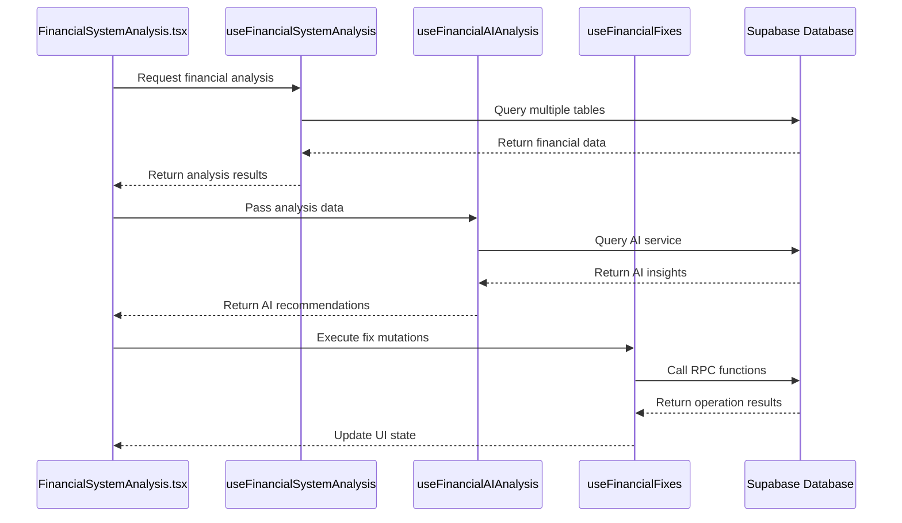

# Financial System Analysis Hooks

<cite>
**Referenced Files in This Document**   
- [useFinancialSystemAnalysis.ts](file://src/hooks/useFinancialSystemAnalysis.ts)
- [FinancialSystemAnalysis.tsx](file://src/pages/finance/settings/FinancialSystemAnalysis.tsx)
- [useFinancialFixes.ts](file://src/hooks/useFinancialFixes.ts)
</cite>

## Table of Contents
1. [Introduction](#introduction)
2. [Core Purpose and Functionality](#core-purpose-and-functionality)
3. [API Interface and Implementation](#api-interface-and-implementation)
4. [Integration Patterns](#integration-patterns)
5. [Practical Examples](#practical-examples)
6. [Troubleshooting Guidance](#troubleshooting-guidance)
7. [Conclusion](#conclusion)

## Introduction
The Financial System Analysis Hooks provide a comprehensive diagnostic framework for evaluating the health and completeness of a financial system within the Fleetify application. These hooks enable real-time assessment of accounting structures, entity linkages, cost center configurations, and operational integrity, delivering actionable insights through a sophisticated scoring mechanism and AI-powered recommendations.

**Section sources**
- [useFinancialSystemAnalysis.ts](file://src/hooks/useFinancialSystemAnalysis.ts#L4-L14)

## Core Purpose and Functionality
The primary purpose of the Financial System Analysis Hooks is to perform a holistic evaluation of the financial system's configuration and data integrity. The system analyzes multiple dimensions including chart of accounts completeness, entity linkage status, cost center utilization, and recent financial operations.

The analysis generates an overall health score (0-100%) based on weighted metrics across five key areas:
- Chart of Accounts Score (25% weight)
- Linkage Score (25% weight)
- Cost Centers Score (20% weight)
- Operations Score (20% weight)
- AI Score (10% weight, placeholder)

The hook identifies critical issues such as missing essential accounts, unlinked customers, or improperly configured cost centers like CC007 (Lease Financing Obligations center). It also provides actionable suggestions for improvement, including creating specialized vehicle accounts, expanding cost centers, and automating account linking processes.

**Section sources**
- [useFinancialSystemAnalysis.ts](file://src/hooks/useFinancialSystemAnalysis.ts#L49-L154)
- [useFinancialSystemAnalysis.ts](file://src/hooks/useFinancialSystemAnalysis.ts#L156-L321)

## API Interface and Implementation
The Financial System Analysis Hooks expose a clean and intuitive API interface through the `useFinancialSystemAnalysis` hook, which returns a structured analysis object containing scores, issues, suggestions, and metrics.

```mermaid
classDiagram
class FinancialSystemAnalysis {
+overallScore : number
+chartOfAccountsScore : number
+linkageScore : number
+costCentersScore : number
+operationsScore : number
+aiScore : number
+issues : FinancialIssue[]
+suggestions : FinancialSuggestion[]
+metrics : FinancialMetrics
}
class FinancialIssue {
+id : string
+type : 'critical' | 'warning' | 'info'
+category : 'accounts' | 'linkage' | 'cost_centers' | 'operations'
+title : string
+description : string
+impact : string
+resolution : string
}
class FinancialSuggestion {
+id : string
+type : 'improvement' | 'optimization' | 'compliance'
+title : string
+description : string
+priority : 'high' | 'medium' | 'low'
+estimatedImpact : string
}
class FinancialMetrics {
+totalAccounts : number
+linkedCustomers : number
+linkedVehicles : number
+linkedContracts : number
+activeCostCenters : number
+recentJournalEntries : number
+unlinkedEntities : {customers : number, vehicles : number, contracts : number}
}
FinancialSystemAnalysis --> FinancialIssue : "contains"
FinancialSystemAnalysis --> FinancialSuggestion : "contains"
FinancialSystemAnalysis --> FinancialMetrics : "contains"
```

**Diagram sources **
- [useFinancialSystemAnalysis.ts](file://src/hooks/useFinancialSystemAnalysis.ts#L4-L33)

The implementation leverages React Query for data fetching and caching, with a stale time of 5 minutes to balance freshness and performance. The hook queries multiple Supabase tables including chart_of_accounts, customers, vehicles, contracts, cost_centers, and journal_entries to gather comprehensive data for analysis.

**Section sources**
- [useFinancialSystemAnalysis.ts](file://src/hooks/useFinancialSystemAnalysis.ts#L49-L154)

## Integration Patterns
The Financial System Analysis Hooks integrate seamlessly with the application's financial settings interface and other supporting hooks. The primary integration pattern involves combining the analysis hook with AI analysis and financial fixes hooks to create a comprehensive diagnostic and remediation system.



**Diagram sources **
- [FinancialSystemAnalysis.tsx](file://src/pages/finance/settings/FinancialSystemAnalysis.tsx#L27-L602)
- [useFinancialFixes.ts](file://src/hooks/useFinancialFixes.ts#L5-L260)

The integration follows a pattern where the UI component first retrieves the basic financial analysis, then conditionally triggers AI analysis when sufficient data is available. The component also integrates with the `useFinancialFixes` hook to provide one-click remediation for identified issues through mutation functions like `copyDefaultCostCenters`, `createDefaultCustomerAccounts`, and `runAllFixes`.

**Section sources**
- [FinancialSystemAnalysis.tsx](file://src/pages/finance/settings/FinancialSystemAnalysis.tsx#L27-L602)

## Practical Examples
### Basic Usage
```typescript
import { useFinancialSystemAnalysis } from "@/hooks/useFinancialSystemAnalysis";

const FinancialDashboard = () => {
  const { data: analysis, isLoading, error } = useFinancialSystemAnalysis();
  
  if (isLoading) return <div>Loading analysis...</div>;
  if (error) return <div>Error: {error.message}</div>;
  
  return (
    <div>
      <h2>Financial Health Score: {analysis?.overallScore}%</h2>
      <p>Status: {analysis?.overallScore >= 80 ? 'Excellent' : 
                 analysis?.overallScore >= 60 ? 'Good' : 'Needs Improvement'}</p>
      
      {analysis?.issues.map(issue => (
        <div key={issue.id} className={issue.type}>
          <strong>{issue.title}</strong>: {issue.description}
        </div>
      ))}
    </div>
  );
};
```

### Advanced Integration with Remediation
```typescript
import { useFinancialSystemAnalysis } from "@/hooks/useFinancialSystemAnalysis";
import { useFinancialFixes } from "@/hooks/useFinancialFixes";

const AdvancedFinancialAnalyzer = () => {
  const { data: analysis } = useFinancialSystemAnalysis();
  const { runAllFixes } = useFinancialFixes();
  
  const handleFixAll = async () => {
    if (analysis?.overallScore < 80) {
      await runAllFixes.mutateAsync();
    }
  };
  
  return (
    <div>
      <div>Overall Score: {analysis?.overallScore}%</div>
      <button 
        onClick={handleFixAll}
        disabled={runAllFixes.isPending}
      >
        {runAllFixes.isPending ? 'Fixing...' : 'Apply All Fixes'}
      </button>
    </div>
  );
};
```

**Section sources**
- [FinancialSystemAnalysis.tsx](file://src/pages/finance/settings/FinancialSystemAnalysis.tsx#L27-L602)

## Troubleshooting Guidance
When encountering issues with the Financial System Analysis Hooks, consider the following troubleshooting steps:

1. **Authentication Issues**: Ensure the user is properly authenticated and has a valid company ID. The hook requires user authentication to function correctly.

2. **Data Loading Problems**: Verify that the necessary database tables (chart_of_accounts, customers, contracts, etc.) contain data for the current company. Empty tables may result in incomplete analysis.

3. **Score Calculation Anomalies**: Check that essential account types (assets, liabilities, equity, revenue, expenses) are present in the chart of accounts. Missing these types will significantly impact the chart of accounts score.

4. **Linkage Issues**: Investigate why entities might not be properly linked. Common causes include missing foreign key relationships or inactive status flags on related records.

5. **Performance Considerations**: The hook performs multiple parallel database queries. For large datasets, ensure appropriate database indexing on commonly queried fields like company_id and status.

6. **Error Handling**: The hook includes comprehensive error handling for database operations. Monitor console logs for detailed error messages when issues occur.

7. **Caching Behavior**: The analysis result is cached for 5 minutes. If real-time updates are required, consider manually invalidating the query cache after data modifications.

**Section sources**
- [useFinancialSystemAnalysis.ts](file://src/hooks/useFinancialSystemAnalysis.ts#L49-L154)
- [useFinancialFixes.ts](file://src/hooks/useFinancialFixes.ts#L5-L260)

## Conclusion
The Financial System Analysis Hooks provide a robust framework for evaluating and improving the financial system's health within the Fleetify application. By combining comprehensive data analysis with actionable insights and automated remediation capabilities, these hooks empower users to maintain a high standard of financial data integrity and system configuration. The modular design and clean API interface make it easy to integrate into various parts of the application, while the scoring system provides a clear, quantifiable measure of financial system quality.

The integration with AI analysis and automated fixes creates a powerful feedback loop that not only identifies problems but also provides intelligent recommendations and one-click solutions, significantly reducing the time and expertise required to maintain a healthy financial system.