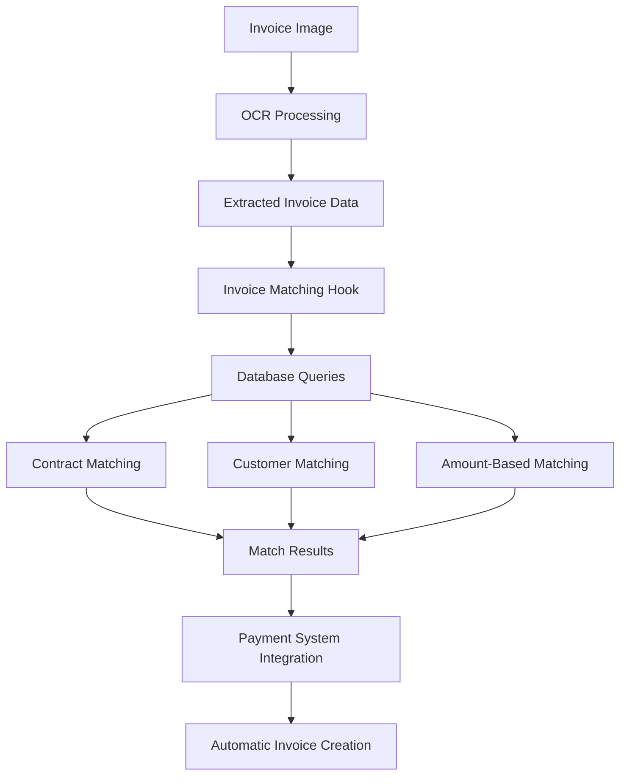
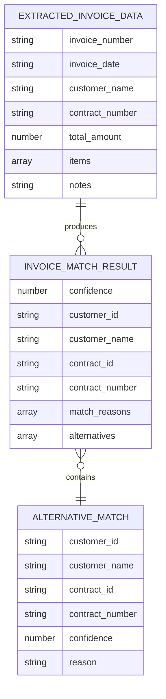
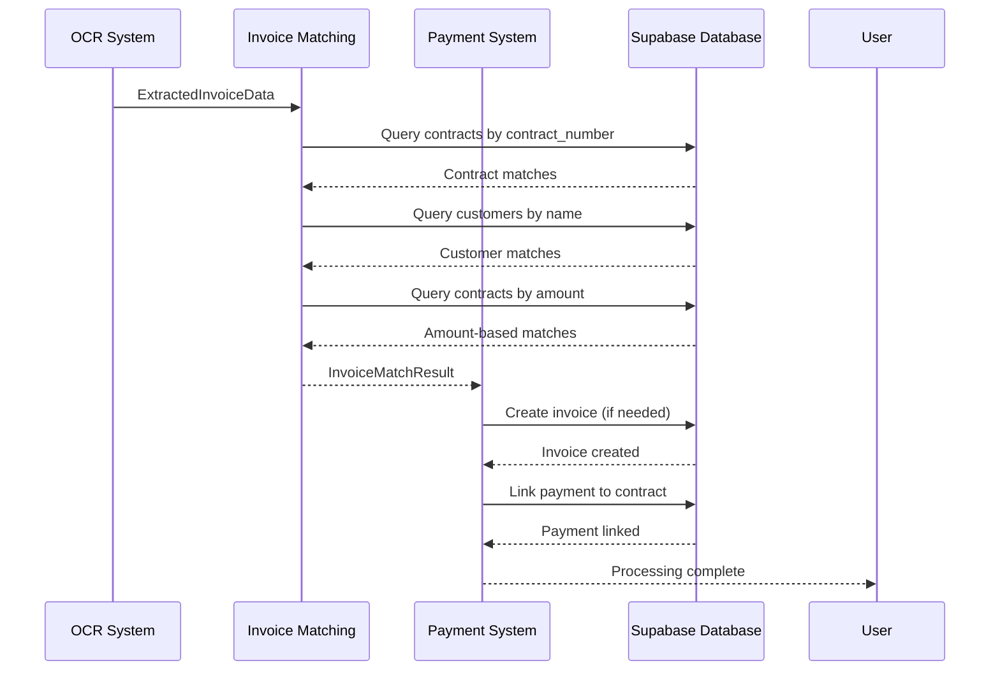

# Invoice Matching Hooks

<cite>
**Referenced Files in This Document**  
- [useInvoiceMatching.ts](file://src/hooks/useInvoiceMatching.ts)
- [invoiceOCR.ts](file://src/types/invoiceOCR.ts)
- [useInvoiceOCR.ts](file://src/hooks/useInvoiceOCR.ts)
- [createInvoiceForPayment.ts](file://src/utils/createInvoiceForPayment.ts)
- [PROFESSIONAL_PAYMENT_SYSTEM_COMPLETE.md](file://PROFESSIONAL_PAYMENT_SYSTEM_COMPLETE.md)
</cite>

## Table of Contents
1. [Introduction](#introduction)
2. [Core Components](#core-components)
3. [Architecture Overview](#architecture-overview)
4. [Detailed Component Analysis](#detailed-component-analysis)
5. [Integration Patterns](#integration-patterns)
6. [Practical Examples](#practical-examples)
7. [Troubleshooting Guide](#troubleshooting-guide)
8. [Conclusion](#conclusion)

## Introduction

The Invoice Matching Hooks system is a critical component of the FleetifyApp financial ecosystem, designed to automate the process of matching scanned invoice data with existing contracts and customers. This system leverages OCR technology and intelligent matching algorithms to reduce manual data entry and improve accuracy in financial operations. The primary purpose of this documentation is to provide comprehensive guidance on the implementation, usage, and integration of the invoice matching functionality.

**Section sources**
- [useInvoiceMatching.ts](file://src/hooks/useInvoiceMatching.ts)
- [PROFESSIONAL_PAYMENT_SYSTEM_COMPLETE.md](file://PROFESSIONAL_PAYMENT_SYSTEM_COMPLETE.md)

## Core Components

The Invoice Matching Hooks system consists of several interconnected components that work together to provide a seamless invoice processing experience. The core functionality is centered around the `useInvoiceMatching` hook, which provides the primary interface for matching extracted invoice data with existing contracts and customers in the system. This hook works in conjunction with the OCR processing system and the professional payment system to create a complete automated workflow for invoice processing and payment linking.

**Section sources**
- [useInvoiceMatching.ts](file://src/hooks/useInvoiceMatching.ts)
- [useInvoiceOCR.ts](file://src/hooks/useInvoiceOCR.ts)
- [createInvoiceForPayment.ts](file://src/utils/createInvoiceForPayment.ts)

## Architecture Overview

The invoice matching system follows a layered architecture that separates concerns and enables modular development and maintenance. At the highest level, the system consists of three main layers: the presentation layer (React components), the business logic layer (custom hooks), and the data access layer (Supabase integration). The `useInvoiceMatching` hook sits at the center of the business logic layer, coordinating between the OCR data extraction process and the database queries that find matching contracts and customers.



**Diagram sources**
- [useInvoiceMatching.ts](file://src/hooks/useInvoiceMatching.ts)
- [useInvoiceOCR.ts](file://src/hooks/useInvoiceOCR.ts)
- [createInvoiceForPayment.ts](file://src/utils/createInvoiceForPayment.ts)

## Detailed Component Analysis

### useInvoiceMatching Hook Analysis

The `useInvoiceMatching` hook is the central component of the invoice matching system, providing a clean API for finding matches between extracted invoice data and existing records in the database. The hook implements a multi-stage matching algorithm that attempts to find the best possible match using several criteria in order of priority.

#### Matching Algorithm Flowchart

```mermaid
flowchart TD
Start([Start Matching]) --> ContractMatch{"Contract Number Available?"}
ContractMatch --> |Yes| QueryContracts["Query contracts by contract_number"]
QueryContracts --> ContractsFound{"Contracts Found?"}
ContractsFound --> |Yes| SelectBestContract["Select best contract match"]
SelectBestContract --> SetConfidence90["Set confidence = 90"]
SetConfidence90 --> AddMatchReason["Add 'contract match' reason"]
AddMatchReason --> AddAlternatives["Add alternative contracts"]
AddAlternatives --> CustomerMatch
ContractsFound --> |No| CustomerMatch["Proceed to customer name matching"]
ContractMatch --> |No| CustomerMatch
CustomerMatch --> CustomerName{"Customer Name Available?"}
CustomerName --> |Yes| QueryCustomers["Query customers by customer_name"]
QueryCustomers --> CustomersFound{"Customers Found?"}
CustomersFound --> |Yes| SelectBestCustomer["Select best customer match"]
SelectBestCustomer --> SetConfidence70["Set confidence = 70"]
SetConfidence70 --> AddCustomerReason["Add 'customer match' reason"]
AddCustomerReason --> FindActiveContracts["Find active contracts for customer"]
FindActiveContracts --> ActiveContractsFound{"Active Contracts Found?"}
ActiveContractsFound --> |Yes| AddContractAlternatives["Add contract alternatives"]
ActiveContractsFound --> |No| AddOtherCustomers["Add other customer matches"]
AddOtherCustomers --> AmountMatch
AddContractAlternatives --> AmountMatch
CustomerName --> |No| AmountMatch["Proceed to amount-based matching"]
AmountMatch --> AmountAndDate{"Amount & Date Available?"}
AmountMatch --> |Yes| QueryByAmount["Query active contracts by amount range"]
QueryByAmount --> ContractsByAmountFound{"Contracts Found?"}
ContractsByAmountFound --> |Yes| ProcessAmountMatches["Process amount-based matches"]
ProcessAmountMatches --> SetConfidence65["Set confidence = 65 for best match"]
SetConfidence65 --> AddAmountReason["Add 'amount match' reason"]
AddAmountReason --> AddAmountAlternatives["Add alternative matches"]
AddAmountAlternatives --> End
ContractsByAmountFound --> |No| ReturnNoMatch["Return no match"]
ReturnNoMatch --> End
AmountMatch --> |No| ReturnNoMatch
End([Return match results])
style Start fill:#4CAF50,stroke:#388E3C
style End fill:#F44336,stroke:#D32F2F
```


**Diagram sources**
- [useInvoiceMatching.ts](file://src/hooks/useInvoiceMatching.ts#L4-L162)

**Section sources**
- [useInvoiceMatching.ts](file://src/hooks/useInvoiceMatching.ts#L4-L162)

### Data Structures Analysis

The invoice matching system relies on well-defined TypeScript interfaces to ensure type safety and clear data contracts between components. These interfaces define the structure of the data flowing through the system, from the initial OCR extraction to the final match results.

#### Invoice Matching Data Model


**Diagram sources**
- [invoiceOCR.ts](file://src/types/invoiceOCR.ts#L0-L40)

**Section sources**
- [invoiceOCR.ts](file://src/types/invoiceOCR.ts#L0-L40)

## Integration Patterns

The invoice matching system is designed to integrate seamlessly with other components of the financial management system, particularly the OCR processing and professional payment systems. This integration enables a complete automated workflow from invoice scanning to payment processing and accounting.

### Professional Payment System Integration

The invoice matching functionality is a key component of the broader Professional Payment System, which provides comprehensive financial management capabilities. The system uses the match results to automatically link payments to contracts and create corresponding invoices, reducing manual intervention and improving accuracy.



**Diagram sources**
- [useInvoiceMatching.ts](file://src/hooks/useInvoiceMatching.ts)
- [createInvoiceForPayment.ts](file://src/utils/createInvoiceForPayment.ts)
- [PROFESSIONAL_PAYMENT_SYSTEM_COMPLETE.md](file://PROFESSIONAL_PAYMENT_SYSTEM_COMPLETE.md)

**Section sources**
- [useInvoiceMatching.ts](file://src/hooks/useInvoiceMatching.ts)
- [createInvoiceForPayment.ts](file://src/utils/createInvoiceForPayment.ts)
- [PROFESSIONAL_PAYMENT_SYSTEM_COMPLETE.md](file://PROFESSIONAL_PAYMENT_SYSTEM_COMPLETE.md)

## Practical Examples

### Basic Usage Example

The `useInvoiceMatching` hook can be used in any React component to implement invoice matching functionality. The following example demonstrates how to integrate the hook into a component that processes scanned invoices:

```typescript
const InvoiceProcessor = () => {
  const { findMatches, isMatching } = useInvoiceMatching();
  
  const handleInvoiceScan = async (scannedData: ExtractedInvoiceData) => {
    const matches = await findMatches(scannedData, companyId);
    
    if (matches.confidence >= 90) {
      // High confidence match - auto-accept
      await autoLinkPayment(matches);
    } else if (matches.confidence >= 50) {
      // Medium confidence match - show for review
      setShowMatchReviewDialog(true);
    } else {
      // Low confidence match - manual entry required
      setShowManualEntryForm(true);
    }
  };
};
```

**Section sources**
- [useInvoiceMatching.ts](file://src/hooks/useInvoiceMatching.ts)

### Advanced Matching Configuration

The matching system can be enhanced with additional configuration options to fine-tune the matching behavior based on specific business requirements:

```typescript
// Example of extended matching configuration
const advancedMatchingConfig = {
  confidenceThresholds: {
    autoAccept: 90,
    requireReview: 50,
    manualEntry: 30
  },
  fuzzySearch: {
    enabled: true,
    customerNameThreshold: 0.8,
    contractNumberThreshold: 0.9
  },
  matchingStrategies: [
    'exactContractMatch',
    'fuzzyCustomerMatch',
    'amountRangeMatch',
    'dateProximityMatch'
  ],
  priorityOrder: [
    'contractNumber',
    'customerName',
    'invoiceAmount',
    'invoiceDate'
  ]
};
```

**Section sources**
- [useInvoiceMatching.ts](file://src/hooks/useInvoiceMatching.ts)
- [PROFESSIONAL_PAYMENT_SYSTEM_COMPLETE.md](file://PROFESSIONAL_PAYMENT_SYSTEM_COMPLETE.md)

## Troubleshooting Guide

### Common Issues and Solutions

When working with the invoice matching system, several common issues may arise. Understanding these issues and their solutions can help ensure smooth operation of the system.

#### Issue: Low Match Confidence
**Symptoms**: The system returns matches with low confidence scores (<50) even when clear matches exist in the database.

**Possible Causes**:
- OCR extraction errors in contract number or customer name
- Data formatting inconsistencies between scanned data and database records
- Missing or incomplete customer/contract data in the database

**Solutions**:
1. Verify the quality of the scanned invoice image
2. Check for consistent data formatting in the database
3. Implement fuzzy search capabilities to handle minor discrepancies
4. Ensure all relevant customer and contract data is complete and up-to-date

#### Issue: No Matches Found
**Symptoms**: The system returns no matches even when the contract or customer should exist in the system.

**Possible Causes**:
- Incorrect company ID context
- Database query limitations (e.g., limit of 5 results)
- Data isolation between companies in multi-tenant environment
- Contract status filters excluding valid matches

**Solutions**:
1. Verify the companyId parameter is correct
2. Check if the contract exists and is active in the database
3. Review the query conditions and remove overly restrictive filters
4. Ensure proper tenant isolation is maintained

#### Issue: Performance Problems
**Symptoms**: The matching process is slow, especially with large datasets.

**Possible Causes**:
- Multiple sequential database queries without optimization
- Lack of proper database indexing
- Network latency in Supabase queries
- Large result sets being processed

**Solutions**:
1. Implement database indexing on frequently queried fields
2. Optimize queries to retrieve only necessary data
3. Consider caching frequently accessed data
4. Implement pagination for large result sets

**Section sources**
- [useInvoiceMatching.ts](file://src/hooks/useInvoiceMatching.ts)
- [PROFESSIONAL_PAYMENT_SYSTEM_COMPLETE.md](file://PROFESSIONAL_PAYMENT_SYSTEM_COMPLETE.md)

## Conclusion

The Invoice Matching Hooks system provides a robust and flexible solution for automating the process of matching scanned invoices with existing contracts and customers. By implementing a multi-stage matching algorithm with configurable confidence thresholds, the system balances automation with accuracy, reducing manual data entry while maintaining data integrity. The integration with the professional payment system enables a complete automated workflow from invoice scanning to payment processing and accounting, significantly improving operational efficiency. With proper configuration and troubleshooting, this system can handle a wide variety of invoice matching scenarios while providing clear feedback and options for manual review when needed.