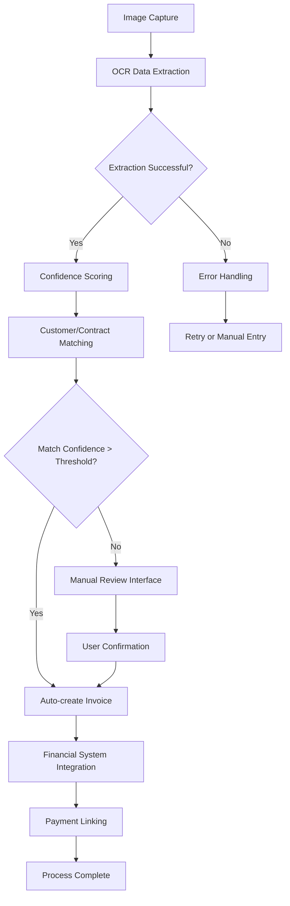
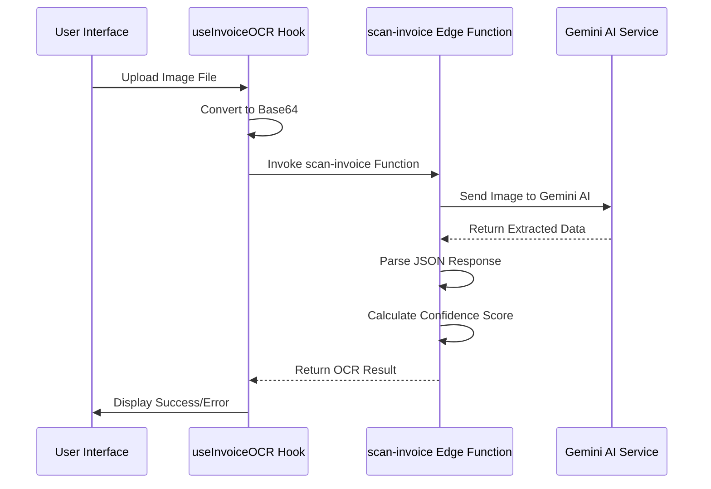
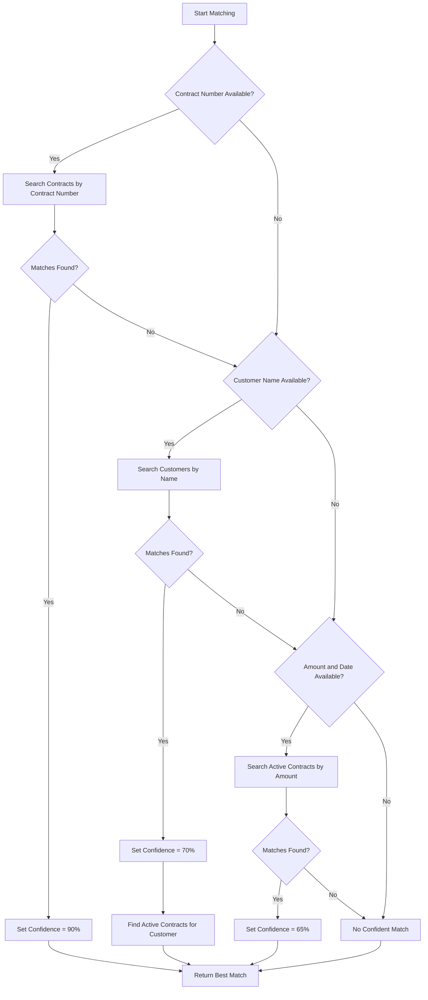
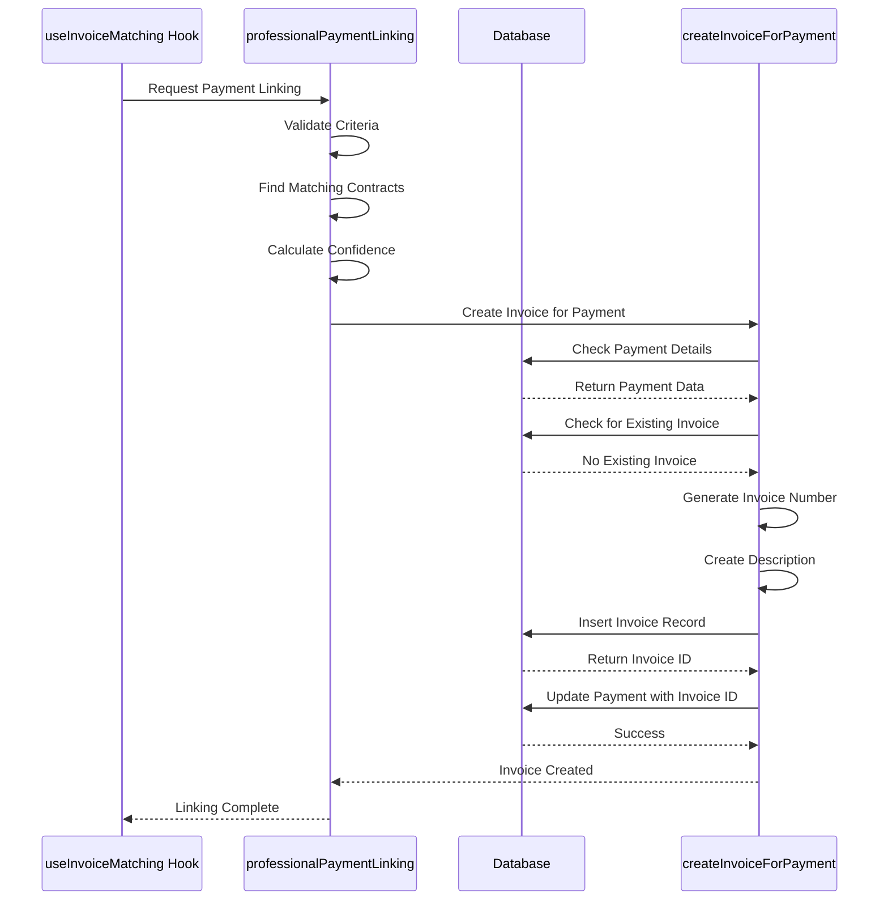
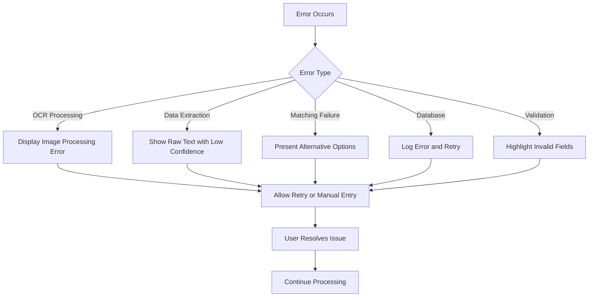
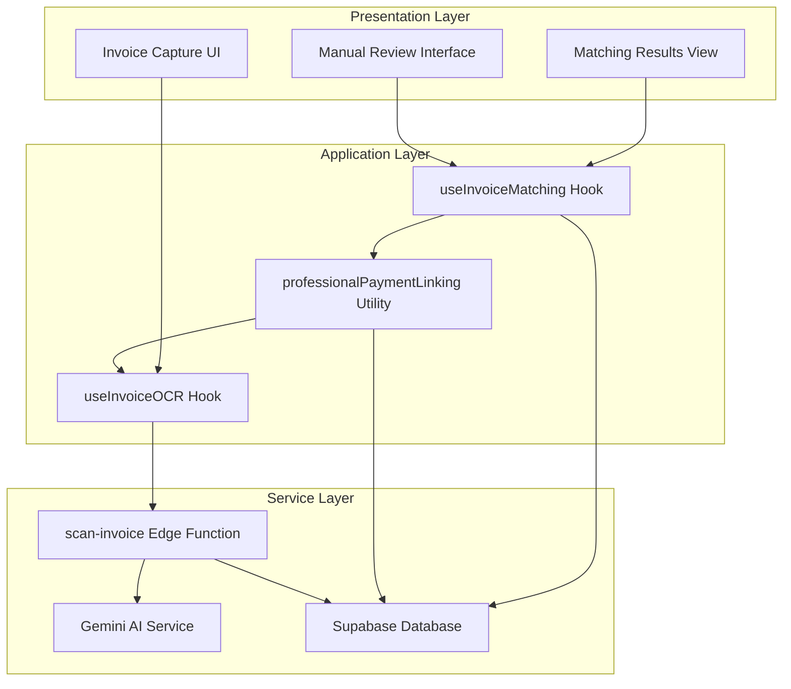

# Invoice Processing Workflow

<cite>
**Referenced Files in This Document**   
- [useInvoiceOCR.ts](file://src/hooks/useInvoiceOCR.ts)
- [invoiceOCR.ts](file://src/types/invoiceOCR.ts)
- [scan-invoice/index.ts](file://supabase/functions/scan-invoice/index.ts)
- [useInvoiceMatching.ts](file://src/hooks/useInvoiceMatching.ts)
- [InvoiceMatchingView.tsx](file://src/components/invoices/InvoiceMatchingView.tsx)
- [professionalPaymentLinking.ts](file://src/utils/professionalPaymentLinking.ts)
- [createInvoiceForPayment.ts](file://src/utils/createInvoiceForPayment.ts)
</cite>

## Table of Contents
1. [Introduction](#introduction)
2. [Invoice Processing Workflow](#invoice-processing-workflow)
3. [OCR Data Extraction](#ocr-data-extraction)
4. [Customer and Contract Matching](#customer-and-contract-matching)
5. [Invoice Creation and Financial Integration](#invoice-creation-and-financial-integration)
6. [Error Handling and Validation](#error-handling-and-validation)
7. [System Architecture](#system-architecture)

## Introduction

The invoice processing workflow is a comprehensive system designed to automate the extraction, validation, and integration of invoice data from physical or digital images into the financial management system. This document details the end-to-end process from image capture to invoice creation, focusing on the OCR data extraction, confidence scoring, customer/contract matching algorithms, and integration with the financial system.

The workflow leverages AI-powered optical character recognition to extract data from invoice images, applies intelligent matching algorithms to associate extracted data with existing customers and contracts, and automatically creates financial records in the system. The process is designed to minimize manual intervention while maintaining high accuracy through confidence scoring and alternative suggestions.

## Invoice Processing Workflow

The invoice processing workflow consists of a sequential process that transforms an image file into a fully integrated financial record. The workflow begins with image capture and ends with the creation of an invoice in the financial system, with multiple validation and matching steps in between.

**Diagram sources**
- [useInvoiceOCR.ts](file://src/hooks/useInvoiceOCR.ts)
- [useInvoiceMatching.ts](file://src/hooks/useInvoiceMatching.ts)
- [createInvoiceForPayment.ts](file://src/utils/createInvoiceForPayment.ts)

**Section sources**
- [useInvoiceOCR.ts](file://src/hooks/useInvoiceOCR.ts)
- [useInvoiceMatching.ts](file://src/hooks/useInvoiceMatching.ts)

## OCR Data Extraction

The OCR data extraction process converts image files of invoices into structured data that can be processed by the system. This process uses AI-powered optical character recognition to identify and extract key fields from invoice images, with built-in confidence scoring to assess the reliability of the extracted data.

The extraction process supports both printed and handwritten text in Arabic and English, and is designed to handle various invoice formats and layouts. The system extracts the following key fields from invoices:
- Invoice number
- Invoice date
- Customer name
- Contract number
- Total amount
- Line items (description, quantity, unit price, total)
- Additional notes

**Diagram sources**
- [useInvoiceOCR.ts](file://src/hooks/useInvoiceOCR.ts#L5-L74)
- [scan-invoice/index.ts](file://supabase/functions/scan-invoice/index.ts#L1-L183)

**Section sources**
- [useInvoiceOCR.ts](file://src/hooks/useInvoiceOCR.ts#L5-L74)
- [scan-invoice/index.ts](file://supabase/functions/scan-invoice/index.ts#L1-L183)
- [invoiceOCR.ts](file://src/types/invoiceOCR.ts#L0-L8)

## Customer and Contract Matching

The customer and contract matching algorithm intelligently associates extracted invoice data with existing customer and contract records in the system. The matching process uses a multi-tiered approach with different matching strategies, each contributing to an overall confidence score.

The algorithm employs three primary matching strategies in sequence, with each subsequent strategy only being applied if the previous strategy did not yield a sufficiently confident match:

1. **Contract Number Matching**: The system first attempts to match the extracted contract number with existing contracts in the database using case-insensitive pattern matching.
2. **Customer Name Matching**: If contract matching fails, the system searches for customers with names similar to the extracted customer name.
3. **Amount and Date Matching**: As a fallback, the system looks for active contracts with monthly amounts similar to the extracted total amount.

**Diagram sources**
- [useInvoiceMatching.ts](file://src/hooks/useInvoiceMatching.ts#L4-L162)
- [InvoiceMatchingView.tsx](file://src/components/invoices/InvoiceMatchingView.tsx#L0-L142)

**Section sources**
- [useInvoiceMatching.ts](file://src/hooks/useInvoiceMatching.ts#L4-L162)
- [invoiceOCR.ts](file://src/types/invoiceOCR.ts#L25-L40)

## Invoice Creation and Financial Integration

Once a customer and contract have been matched with sufficient confidence, the system automatically creates an invoice in the financial system and integrates it with the payment processing workflow. This process ensures that all relevant financial records are properly linked and that the accounting system remains consistent.

The invoice creation process includes several key steps:
- Generating a unique invoice number based on the current date and sequence
- Creating a descriptive invoice description that includes customer and contract information
- Setting the appropriate invoice status (typically "paid" for payment receipts)
- Linking the newly created invoice to the original payment record

**Diagram sources**
- [professionalPaymentLinking.ts](file://src/utils/professionalPaymentLinking.ts#L1-L427)
- [createInvoiceForPayment.ts](file://src/utils/createInvoiceForPayment.ts#L1-L290)

**Section sources**
- [professionalPaymentLinking.ts](file://src/utils/professionalPaymentLinking.ts#L1-L427)
- [createInvoiceForPayment.ts](file://src/utils/createInvoiceForPayment.ts#L1-L290)

## Error Handling and Validation

The invoice processing system includes comprehensive error handling and validation mechanisms to ensure data integrity and provide meaningful feedback to users when issues occur. The system handles errors at multiple levels, from image processing failures to database operation errors.

Key error handling features include:
- Graceful degradation when OCR fails to extract structured data
- Confidence-based decision making to avoid incorrect automatic matches
- Comprehensive logging for troubleshooting and audit purposes
- User-friendly error messages in Arabic
- Alternative suggestions when no confident match is found

The validation process occurs at multiple stages:
1. **Image Validation**: Ensuring the uploaded file is a valid image format
2. **Data Validation**: Checking that extracted data meets business rules
3. **Matching Validation**: Verifying that customer-contract relationships are valid
4. **Financial Validation**: Ensuring invoice amounts and dates are consistent with contracts

**Section sources**
- [useInvoiceOCR.ts](file://src/hooks/useInvoiceOCR.ts#L5-L74)
- [useInvoiceMatching.ts](file://src/hooks/useInvoiceMatching.ts#L4-L162)
- [createInvoiceForPayment.ts](file://src/utils/createInvoiceForPayment.ts#L1-L290)

## System Architecture

The invoice processing system follows a modular architecture with clear separation of concerns between frontend components, business logic, and backend services. The architecture is designed to be scalable and maintainable, with well-defined interfaces between components.

The system consists of three main architectural layers:
1. **Presentation Layer**: React components that provide the user interface for invoice processing
2. **Application Layer**: Custom hooks and utilities that contain business logic
3. **Service Layer**: Supabase edge functions and database operations that handle data processing

**Diagram sources**
- [useInvoiceOCR.ts](file://src/hooks/useInvoiceOCR.ts)
- [useInvoiceMatching.ts](file://src/hooks/useInvoiceMatching.ts)
- [professionalPaymentLinking.ts](file://src/utils/professionalPaymentLinking.ts)
- [scan-invoice/index.ts](file://supabase/functions/scan-invoice/index.ts)

**Section sources**
- [useInvoiceOCR.ts](file://src/hooks/useInvoiceOCR.ts)
- [useInvoiceMatching.ts](file://src/hooks/useInvoiceMatching.ts)
- [professionalPaymentLinking.ts](file://src/utils/professionalPaymentLinking.ts)
- [scan-invoice/index.ts](file://supabase/functions/scan-invoice/index.ts)