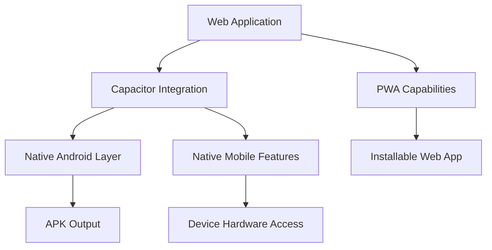
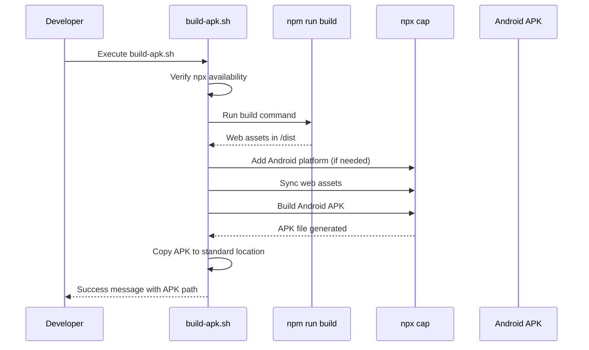

# Mobile Application

<cite>
**Referenced Files in This Document**   
- [capacitor.config.ts](file://capacitor.config.ts)
- [build-apk.sh](file://build-apk.sh)
- [PWAInstallPrompt.tsx](file://src/components/PWAInstallPrompt.tsx)
- [package.json](file://package.json)
- [vite.config.ts](file://vite.config.ts)
</cite>

## Table of Contents
1. [Introduction](#introduction)
2. [Mobile Architecture Overview](#mobile-architecture-overview)
3. [Capacitor Configuration](#capacitor-configuration)
4. [APK Build Process](#apk-build-process)
5. [Progressive Web App (PWA) Capabilities](#progressive-web-app-pwa-capabilities)
6. [Web and Mobile Integration](#web-and-mobile-integration)
7. [Mobile-Specific Features and Components](#mobile-specific-features-and-components)
8. [Build Configuration and Deployment Options](#build-configuration-and-deployment-options)
9. [Common Mobile Build Issues and Solutions](#common-mobile-build-issues-and-solutions)
10. [Conclusion](#conclusion)

## Introduction
FleetifyApp provides a unified enterprise management experience across web and mobile platforms through a hybrid mobile application architecture. The mobile solution enables users to access the full functionality of the enterprise system on Android devices while maintaining code consistency with the web application. Built using Capacitor, the mobile framework bridges the web application with native mobile capabilities, allowing for cross-platform deployment without sacrificing performance or user experience. This document details the implementation, configuration, and deployment processes for the Fleetify mobile application, covering both technical specifications for developers and conceptual understanding for stakeholders.

## Mobile Architecture Overview
The Fleetify mobile application follows a hybrid architecture pattern where the core application logic and UI are implemented as a web application, then wrapped and extended with native mobile capabilities through Capacitor. This approach enables code reuse while providing access to device-specific features such as camera, storage, and push notifications. The architecture consists of three main layers: the web application layer (React-based frontend), the Capacitor integration layer (providing web-to-native bridging), and the native Android layer (handling platform-specific operations and APK generation). The web application is built using Vite and React, then packaged into an Android APK through the Capacitor tooling chain. This architecture allows for simultaneous web and mobile deployment from a single codebase, reducing development overhead and ensuring feature parity across platforms.

**Diagram sources**
- [capacitor.config.ts](file://capacitor.config.ts)
- [vite.config.ts](file://vite.config.ts)

**Section sources**
- [capacitor.config.ts](file://capacitor.config.ts)
- [vite.config.ts](file://vite.config.ts)

## Capacitor Configuration
The mobile application is configured through capacitor.config.ts, which defines the essential parameters for the Capacitor build process. The configuration specifies the application identifier (com.fleetify.app), the display name (Fleetify), and the web directory (dist) where the compiled web assets are located. Security is maintained through HTTPS scheme enforcement on Android via the server.androidScheme setting. The Android build options are configured to generate APK files directly, with keystore parameters left undefined to support flexible signing configurations during deployment. This configuration enables a streamlined build process where the web application is automatically packaged into a native container without requiring extensive platform-specific modifications. The configuration also supports future expansion to iOS platforms through Capacitor's cross-platform capabilities.

**Section sources**
- [capacitor.config.ts](file://capacitor.config.ts#L1-L21)

## APK Build Process
The Android APK generation is automated through the build-apk.sh script, which orchestrates the complete build pipeline from source compilation to final APK output. The script begins by verifying the presence of required tools (npm/npx), then proceeds to build the web application using npm run build. If the Android project has not been initialized, the script automatically adds the Android platform using npx cap add android. The web assets are then synchronized with the mobile project through npx cap sync android, followed by the actual APK compilation via npx cap build android. The script implements robust error handling by checking for the presence of the generated APK in standard output locations and providing diagnostic information if the build fails. Successful builds result in the APK being copied to build/app/outputs/flutter-apk/app-release.apk, following Android convention despite not using Flutter, ensuring compatibility with standard deployment workflows.

**Diagram sources**
- [build-apk.sh](file://build-apk.sh#L1-L54)

**Section sources**
- [build-apk.sh](file://build-apk.sh#L1-L54)
- [package.json](file://package.json#L20-L21)

## Progressive Web App (PWA) Capabilities
FleetifyApp includes PWA functionality through the PWAInstallPrompt component, which enhances the web application with installable app capabilities. The PWAInstallPrompt.tsx component detects when the application is not running in standalone mode and displays a user-friendly installation prompt after a brief delay. This component listens for the beforeinstallprompt event, which is triggered by modern browsers when installation criteria are met. Users can then choose to install the application directly to their device home screen, enabling offline access and improved performance. The component also monitors the appinstalled event to update its state when installation is complete. The installation prompt is localized in Arabic, reflecting the application's regional focus, and includes dismiss functionality to prevent repeated prompts during the same browsing session. This PWA capability provides a seamless transition between web and native-like experiences, allowing users to choose their preferred access method.

**Section sources**
- [PWAInstallPrompt.tsx](file://src/components/PWAInstallPrompt.tsx#L1-L126)

## Web and Mobile Integration
The relationship between the web application and mobile packaging is designed for maximum code reuse and minimal divergence. The same React codebase serves as the foundation for both web and mobile experiences, with platform-specific adaptations handled through Capacitor's plugin system. The Vite build configuration (vite.config.ts) generates optimized assets in the /dist directory, which are then consumed by both the web server and the mobile packaging process. Environment variables and build modes allow for configuration differences between web and mobile deployments without requiring code changes. The package.json scripts provide convenient commands for both development (dev, build) and mobile-specific operations (build:mobile, android:build, build:apk), creating a unified workflow for developers. This integration approach ensures that new features and bug fixes are automatically available in both web and mobile versions, reducing maintenance overhead and ensuring consistent user experiences across platforms.

**Section sources**
- [vite.config.ts](file://vite.config.ts#L1-L49)
- [package.json](file://package.json#L1-L120)

## Mobile-Specific Features and Components
While the core application logic is shared between web and mobile, several components are optimized for mobile usage patterns. The PWAInstallPrompt component provides a tailored installation experience for mobile users, encouraging app adoption through persistent but non-intrusive prompts. Mobile-specific UI components such as MobileActionButtons, MobileContractsHeader, and MobileTabsNavigation (found in the components directory) adapt the interface for smaller screens and touch interactions. The use of responsive design principles ensures that the application layout adjusts appropriately across device sizes, from mobile phones to desktop monitors. Additionally, the application leverages Capacitor plugins to access native device features when needed, such as camera integration for document capture or geolocation for fleet tracking. These mobile-specific enhancements are implemented without creating separate codebases, maintaining the efficiency of the hybrid architecture.

**Section sources**
- [PWAInstallPrompt.tsx](file://src/components/PWAInstallPrompt.tsx#L1-L126)
- [MobileActionButtons.tsx](file://src/components/contracts/MobileActionButtons.tsx)
- [MobileContractsHeader.tsx](file://src/components/contracts/MobileContractsHeader.tsx)
- [MobileTabsNavigation.tsx](file://src/components/contracts/MobileTabsNavigation.tsx)

## Build Configuration and Deployment Options
The mobile build process offers multiple configuration options to support different deployment scenarios. The build-apk.sh script can generate both release and debug APKs, with fallback logic to use debug builds if release builds are not available. The package.json defines several npm scripts that provide granular control over the build process: build:mobile for asset preparation, android:build for direct Android compilation, and build:apk for the complete automated process. Developers can also use mobile:open:android to launch Android Studio for advanced configuration and debugging. The Capacitor configuration supports keystore customization through environment variables or direct parameter injection, allowing for integration with CI/CD pipelines and automated signing processes. These options provide flexibility for both development workflows and production deployments, accommodating various security requirements and distribution strategies.

**Section sources**
- [build-apk.sh](file://build-apk.sh#L1-L54)
- [package.json](file://package.json#L15-L25)
- [capacitor.config.ts](file://capacitor.config.ts#L1-L21)

## Common Mobile Build Issues and Solutions
Several common issues may arise during the mobile build process, with documented solutions available in the project ecosystem. Missing npm tools will cause the build script to fail immediately, requiring Node.js installation before proceeding. If the Android platform has not been initialized, the build script automatically adds it, but network issues may interrupt this process, requiring manual execution of npx cap add android. Asset synchronization problems between web and mobile projects can be resolved by running npx cap sync manually. APK location mismatches are handled by the script's search functionality, but custom Gradle configurations may require updating the output path detection logic. For keystore-related errors, developers should ensure that signing configuration is properly set in the Capacitor configuration or through environment variables. The verify-build.sh script (referenced in package.json) provides validation capabilities to confirm successful builds before deployment.

**Section sources**
- [build-apk.sh](file://build-apk.sh#L1-L54)
- [package.json](file://package.json#L26-L27)

## Conclusion
The Fleetify mobile application successfully implements a hybrid architecture that delivers enterprise management capabilities across both web and mobile platforms. By leveraging Capacitor and a well-structured build process, the application achieves code reuse while maintaining native-like performance on Android devices. The integration of PWA capabilities provides additional flexibility, allowing users to access the system through their preferred method. The automated build process, centered around the build-apk.sh script and supported by comprehensive npm scripts, enables reliable and repeatable APK generation for deployment. This mobile solution effectively extends the reach of the enterprise system to field workers and mobile users without compromising on functionality or user experience, demonstrating a robust approach to cross-platform application development.