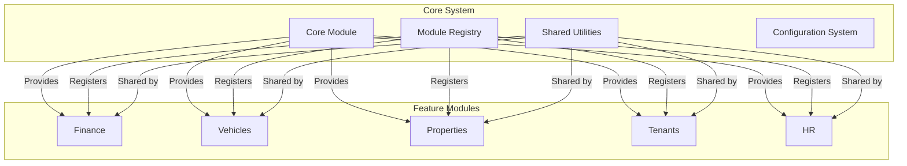
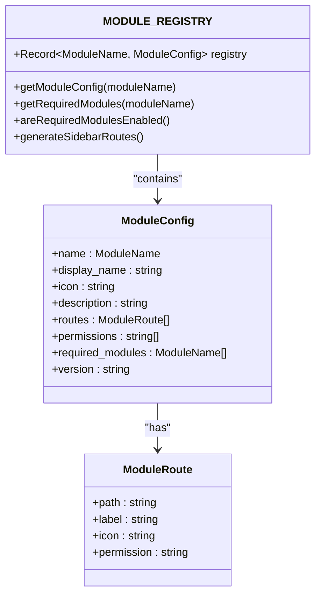
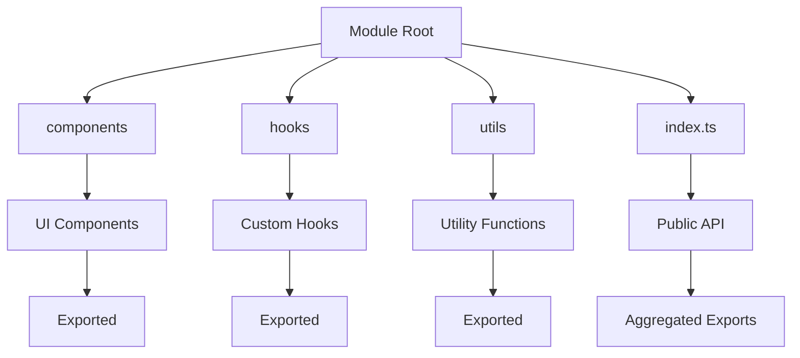
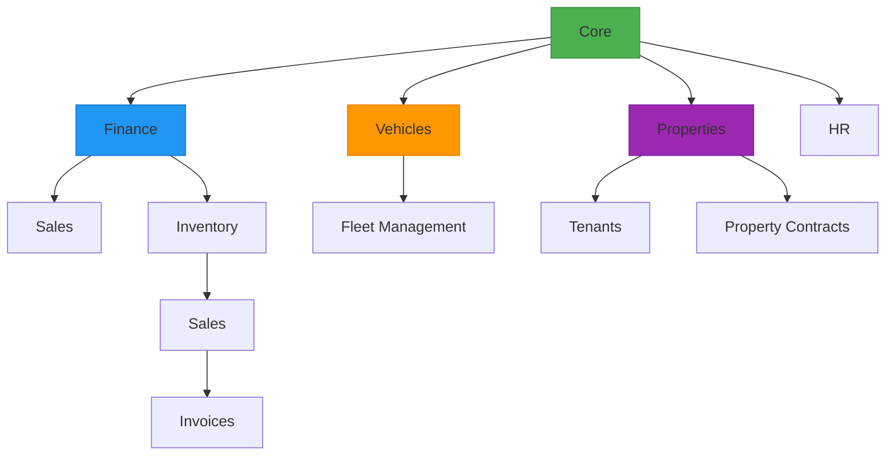
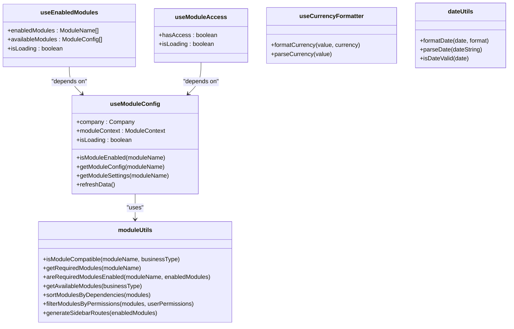
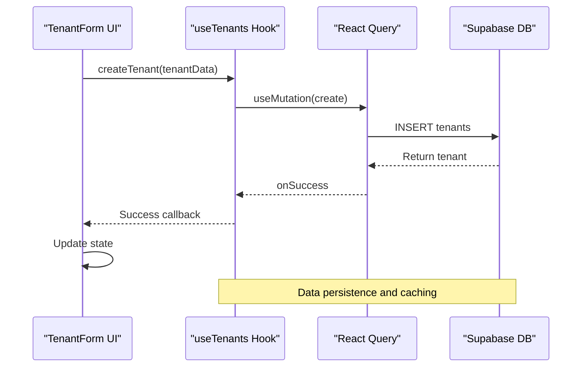

# Module Architecture

<cite>
**Referenced Files in This Document**   
- [moduleRegistry.ts](file://src/modules/moduleRegistry.ts)
- [index.ts](file://src/modules/index.ts)
- [useModuleConfig.ts](file://src/modules/core/hooks/useModuleConfig.ts)
- [moduleUtils.ts](file://src/modules/core/utils/moduleUtils.ts)
- [modules.ts](file://src/types/modules.ts)
- [TenantForm.tsx](file://src/modules/tenants/components/TenantForm.tsx)
- [Tenants.tsx](file://src/modules/tenants/pages/Tenants.tsx)
- [useTenants.ts](file://src/modules/tenants/hooks/useTenants.ts)
- [useFinancialSystemAnalysis.ts](file://src/hooks/useFinancialSystemAnalysis.ts) - *Added in recent commit*
- [useBulkDeleteDuplicateContracts.ts](file://src/hooks/useBulkDeleteDuplicateContracts.ts) - *Added in recent commit*
- [useDuplicateContracts.ts](file://src/hooks/useDuplicateContracts.ts) - *Added in recent commit*
</cite>

## Update Summary
**Changes Made**   
- Added documentation for new financial system analysis module
- Added documentation for duplicate contract management module
- Updated module integration examples to include new functionality
- Enhanced common issues section with new duplicate contract handling
- Added new diagram for financial system analysis workflow
- Updated referenced files list to include newly added hooks

## Table of Contents
1. [Introduction](#introduction)
2. [Core Architecture](#core-architecture)
3. [MODULE_REGISTRY Pattern](#module_registry-pattern)
4. [Core Module Structure](#core-module-structure)
5. [Module Relationships and Dependencies](#module-relationships-and-dependencies)
6. [Shared Hooks and Utilities](#shared-hooks-and-utilities)
7. [Module Configuration and Customization](#module-configuration-and-customization)
8. [Module Integration Examples](#module-integration-examples)
9. [Common Integration Issues and Solutions](#common-integration-issues-and-solutions)
10. [Conclusion](#conclusion)

## Introduction
The FleetifyApp modular architecture is designed to provide a flexible, extensible enterprise solution through a registry-based system. This architecture enables dynamic feature loading, inter-module dependencies, and business-type-specific configurations. The system supports various enterprise domains including finance, fleet management, human resources, property management, vehicle tracking, and tenant management. Each module operates as an independent unit with its own components, hooks, and utilities, while maintaining seamless integration with the core system through shared interfaces and utilities. This documentation provides comprehensive insights into the modular architecture, focusing on implementation details, configuration patterns, and practical usage examples.

## Core Architecture
The modular architecture of FleetifyApp is built around a centralized module registry system that enables dynamic feature loading and configuration. The architecture follows a feature-based organization pattern where each module represents a distinct business capability. The core system provides foundational services and utilities that are shared across all modules, ensuring consistency and reducing code duplication. Modules are organized as independent packages within the `src/modules` directory, each containing its own components, hooks, and utilities. The architecture supports business-type-specific configurations through the `BUSINESS_TYPE_MODULES` mapping, which defines the appropriate module combinations for different enterprise domains such as car rental, real estate, retail, medical, and construction.

**Diagram sources**
- [moduleRegistry.ts](file://src/modules/moduleRegistry.ts)
- [index.ts](file://src/modules/index.ts)

**Section sources**   
- [moduleRegistry.ts](file://src/modules/moduleRegistry.ts)
- [index.ts](file://src/modules/index.ts)

## MODULE_REGISTRY Pattern
The MODULE_REGISTRY pattern is the cornerstone of FleetifyApp's extensible architecture, providing a centralized configuration system for all available modules. Implemented as a `Record<ModuleName, ModuleConfig>` type, the registry contains comprehensive configuration for each module including name, display name, icon, description, routes, permissions, and version information. The registry also defines inter-module dependencies through the `required_modules` property, ensuring proper loading order and dependency resolution. This pattern enables dynamic feature discovery and conditional rendering based on business type and user permissions.

The registry is implemented in `moduleRegistry.ts` and exported as `MODULE_REGISTRY`, which serves as the single source of truth for module configuration. Each module entry includes localized display names and descriptions to support multilingual interfaces. The pattern supports enterprise scalability by allowing new modules to be added without modifying core system code, following the open/closed principle of software design.

**Diagram sources**
- [moduleRegistry.ts](file://src/modules/moduleRegistry.ts)
- [modules.ts](file://src/types/modules.ts)

**Section sources**
- [moduleRegistry.ts](file://src/modules/moduleRegistry.ts)

## Core Module Structure
The core modules in FleetifyApp follow a consistent organizational structure that promotes maintainability and discoverability. Each module resides in the `src/modules` directory and contains standardized subdirectories for components, hooks, and utilities. The architecture includes specialized modules for finance, fleet, HR, property, vehicles, and tenants, each with its own `index.ts` entry point that exports the module's public API. This structure enables clean imports and proper encapsulation of module functionality.

The finance module provides comprehensive financial management capabilities with routes for chart of accounts, journal entries, payments, and financial reports. The vehicles module handles fleet management with routes for fleet overview and maintenance tracking. The properties module supports real estate management with property listings, map views, and owner management. The tenants module focuses on tenant lifecycle management with dedicated forms and tables for tenant data. Each module's `index.ts` file serves as the entry point, exporting components, hooks, and utilities for external consumption.

**Diagram sources**
- [index.ts](file://src/modules/index.ts)
- [moduleRegistry.ts](file://src/modules/moduleRegistry.ts)

**Section sources**
- [index.ts](file://src/modules/index.ts)

## Module Relationships and Dependencies
The module architecture in FleetifyApp establishes clear relationships and dependencies between modules to ensure proper functionality and data flow. Dependencies are explicitly defined in the `MODULE_REGISTRY` through the `required_modules` property, creating a directed acyclic graph of module dependencies. For example, the vehicles module requires both core and finance modules, while the tenants module depends on core and properties modules. This dependency system ensures that prerequisite modules are loaded and initialized before dependent modules, preventing runtime errors and ensuring data consistency.

The architecture also supports business-type-specific module combinations through the `BUSINESS_TYPE_MODULES` mapping, which defines the appropriate module sets for different enterprise domains. This relationship system enables the application to dynamically configure itself based on the organization's business type, providing a tailored experience while maintaining architectural integrity. The dependency resolution is handled by the `moduleUtils.sortModulesByDependencies` function, which performs a topological sort to determine the correct loading order.

**Diagram sources**
- [moduleRegistry.ts](file://src/modules/moduleRegistry.ts)
- [moduleUtils.ts](file://src/modules/core/utils/moduleUtils.ts)

**Section sources**
- [moduleRegistry.ts](file://src/modules/moduleRegistry.ts)

## Shared Hooks and Utilities
The modular architecture leverages shared hooks and utilities to promote code reuse and maintain consistency across modules. The core module provides essential hooks such as `useModuleConfig`, `useEnabledModules`, and `useModuleAccess`, which enable modules to access configuration data and check module availability. These hooks abstract the complexity of module state management and provide a clean interface for module interaction.

The `moduleUtils` utility collection offers functions for dependency resolution, permission filtering, and sidebar route generation. Key utilities include `isModuleCompatible`, `getRequiredModules`, `areRequiredModulesEnabled`, and `generateSidebarRoutes`. These utilities enable modules to dynamically adapt to the current business context and user permissions. The architecture also includes shared formatting utilities like `useCurrencyFormatter` and `dateUtils`, which ensure consistent data presentation across all modules.

**Diagram sources**
- [useModuleConfig.ts](file://src/modules/core/hooks/useModuleConfig.ts)
- [moduleUtils.ts](file://src/modules/core/utils/moduleUtils.ts)

**Section sources**
- [useModuleConfig.ts](file://src/modules/core/hooks/useModuleConfig.ts)
- [moduleUtils.ts](file://src/modules/core/utils/moduleUtils.ts)

## Module Configuration and Customization
Module configuration in FleetifyApp is managed through a flexible system that supports both global and per-company customization. The `useModuleConfig` hook serves as the primary interface for accessing module configuration, retrieving data from both the `companies` table and `module_settings` table in the database. This dual-source approach allows for default configurations at the company level while supporting overrides through explicit module settings.

The configuration system supports business-type-specific defaults through the `BUSINESS_TYPE_MODULES` mapping, which determines the available modules for each business type. Companies can enable or disable modules based on their specific needs, with the `active_modules` field in the companies table serving as the primary control mechanism. The system also supports browse mode, which allows users to preview configurations for different companies without affecting their current session.

Configuration options include module enablement, version tracking, and custom settings stored in the `module_config` JSON field. The system provides utility functions like `filterModulesByPermissions` to ensure that users only see modules for which they have appropriate permissions. This comprehensive configuration system enables enterprise-grade customization while maintaining a consistent user experience.

**Section sources**
- [useModuleConfig.ts](file://src/modules/core/hooks/useModuleConfig.ts)
- [moduleRegistry.ts](file://src/modules/moduleRegistry.ts)

## Module Integration Examples
The modular architecture provides practical examples of module integration that demonstrate the system's extensibility and flexibility. The tenants module serves as an excellent example, with its `index.ts` file exporting the main `Tenants` page component along with supporting components like `TenantForm` and `TenantTable`. This export pattern enables clean imports in other parts of the application, such as the contracts module which uses `TenantSelector` to associate contracts with tenants.

The integration process follows a consistent pattern: first, the module is registered in `MODULE_REGISTRY` with its configuration; second, the module's entry point is exported in the main modules index; third, the module's components and hooks are made available through its own index file. This pattern ensures that new modules can be integrated seamlessly into the existing system without requiring changes to core functionality.

The architecture also demonstrates practical usage of shared utilities, such as the `useTenants` hook which provides CRUD operations for tenant data. This hook leverages the core query system to handle data fetching, mutation, and caching, ensuring consistent behavior across all modules. The integration examples highlight how the modular system enables rapid development of new features while maintaining architectural integrity.

**Diagram sources**
- [Tenants.tsx](file://src/modules/tenants/pages/Tenants.tsx)
- [TenantForm.tsx](file://src/modules/tenants/components/TenantForm.tsx)
- [useTenants.ts](file://src/modules/tenants/hooks/useTenants.ts)

**Section sources**
- [Tenants.tsx](file://src/modules/tenants/pages/Tenants.tsx)
- [TenantForm.tsx](file://src/modules/tenants/components/TenantForm.tsx)
- [useTenants.ts](file://src/modules/tenants/hooks/useTenants.ts)

## Common Integration Issues and Solutions
Module integration in FleetifyApp may encounter several common issues, each with established solutions. One frequent issue is missing dependency resolution, where a module is loaded without its required dependencies. This is addressed by the `areRequiredModulesEnabled` utility function, which checks for the presence of all required modules before allowing a module to activate.

Another common issue is permission-related access problems, where users cannot access modules despite them being enabled. This is resolved through the `filterModulesByPermissions` function, which ensures that only modules for which the user has appropriate permissions are displayed. The system also handles configuration loading delays through the `isLoading` state in the `useModuleConfig` hook, providing a smooth user experience during initialization.

Browse mode presents unique challenges, particularly with data caching and stale queries. The system addresses this through conditional caching settings in the `useQuery` configuration, disabling caching and enabling automatic refetching when in browse mode. This ensures that users always see the most current data when previewing different company configurations.

Finally, module version compatibility issues are mitigated through the version field in the `ModuleConfig` interface, allowing the system to detect and handle version mismatches appropriately. These solutions collectively ensure robust module integration and a reliable user experience across different deployment scenarios.

**Section sources**
- [useModuleConfig.ts](file://src/modules/core/hooks/useModuleConfig.ts)
- [moduleUtils.ts](file://src/modules/core/utils/moduleUtils.ts)

## Conclusion
The modular architecture of FleetifyApp provides a robust foundation for extensible enterprise functionality through its registry-based system. The MODULE_REGISTRY pattern enables dynamic feature loading and inter-module dependencies, while the consistent module structure promotes maintainability and discoverability. The architecture effectively balances flexibility with consistency, allowing for business-type-specific configurations while maintaining a unified user experience.

Key strengths of the system include its dependency resolution capabilities, comprehensive configuration options, and extensive shared utilities. The architecture supports enterprise scalability by enabling new modules to be added without modifying core system code. The integration examples demonstrate the practical application of the modular system, highlighting its effectiveness in real-world scenarios.

The shared hooks and utilities, particularly `useModuleConfig` and `moduleUtils`, provide powerful tools for module interaction and state management. These components abstract complexity and promote code reuse across the application. The system's approach to common integration issues demonstrates thoughtful design and robust error handling.

Overall, the modular architecture successfully achieves its goal of enabling extensible enterprise functionality while maintaining architectural integrity and developer productivity. The system provides a solid foundation for future growth and adaptation to evolving business requirements.