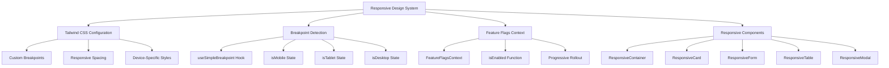
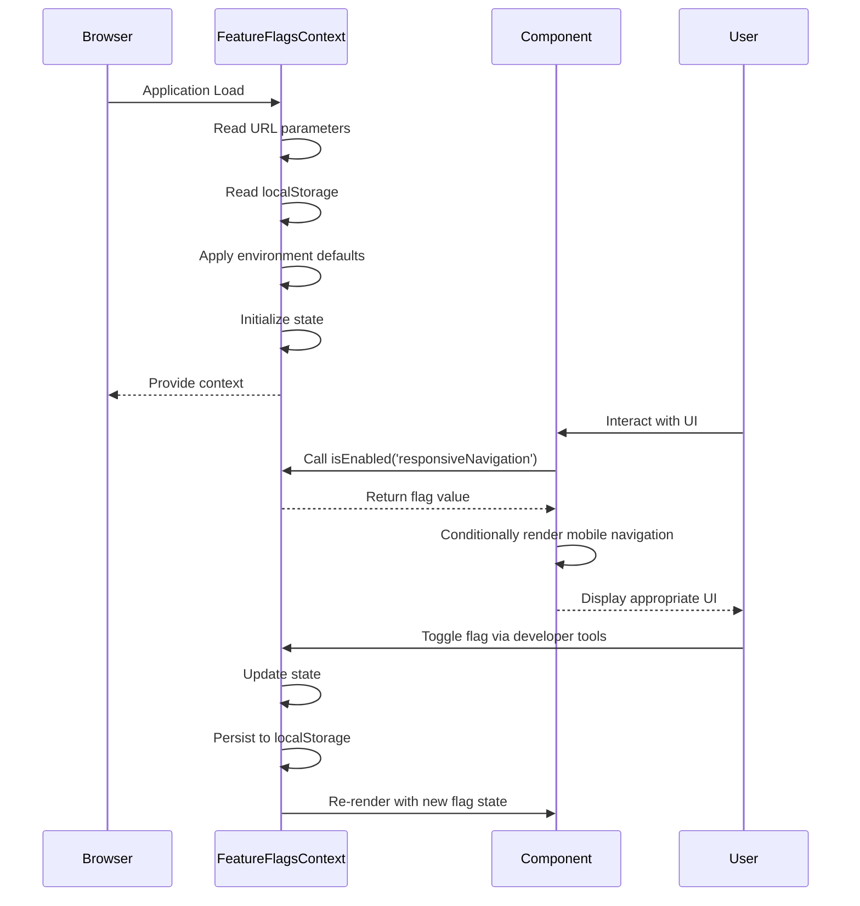
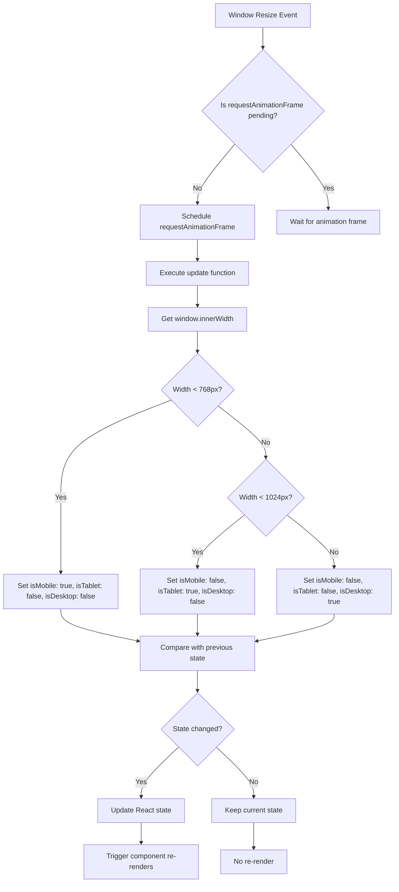
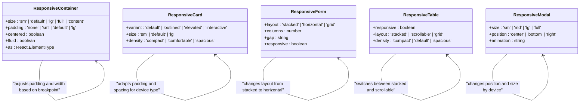
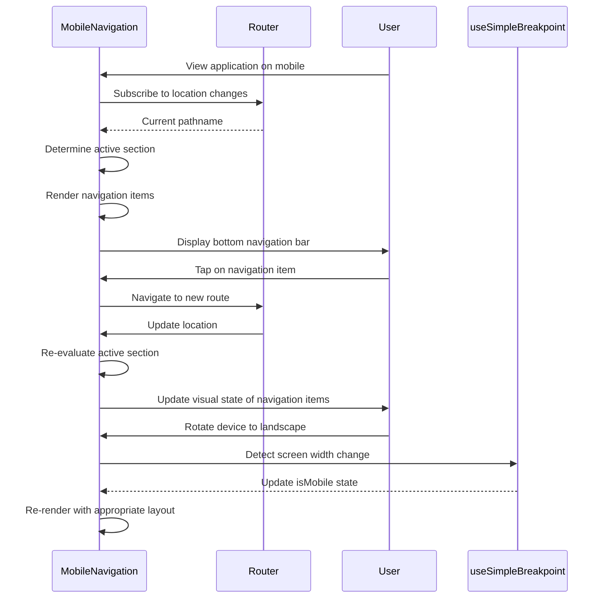
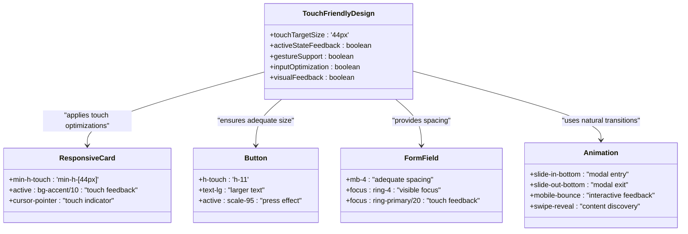
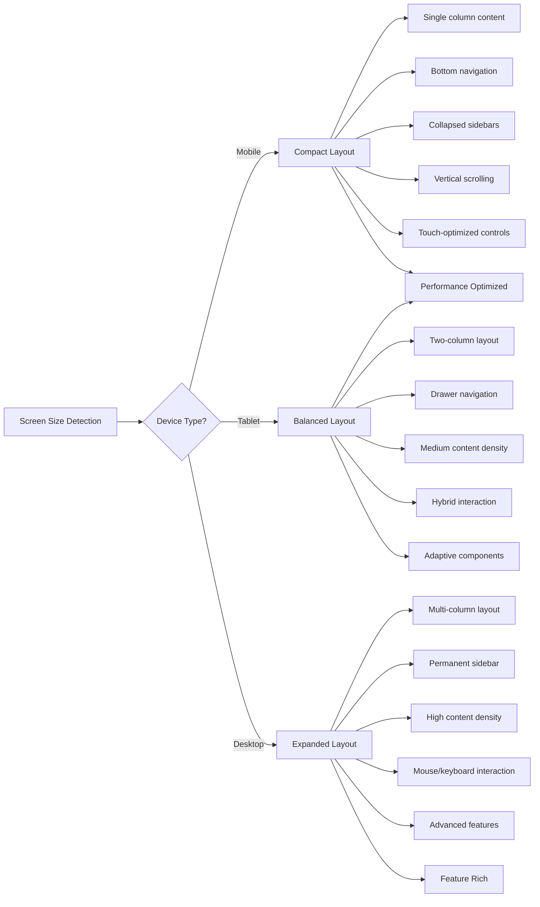

# Responsive Design

<cite>
**Referenced Files in This Document**   
- [tailwind.config.ts](file://tailwind.config.ts)
- [FeatureFlagsContext.tsx](file://src/contexts/FeatureFlagsContext.tsx)
- [use-mobile-simple.ts](file://src/hooks/use-mobile-simple.ts)
- [useResponsiveNavigation.ts](file://src/hooks/useResponsiveNavigation.ts)
- [useAdaptiveContent.ts](file://src/hooks/useAdaptiveContent.ts)
- [MobileNavigation.tsx](file://src/components/layouts/MobileNavigation.tsx)
- [responsive-container.tsx](file://src/components/ui/responsive-container.tsx)
- [responsive-card.tsx](file://src/components/ui/responsive-card.tsx)
- [responsive-form.tsx](file://src/components/ui/responsive-form.tsx)
- [responsive-table.tsx](file://src/components/ui/responsive-table.tsx)
- [responsive-modal.tsx](file://src/components/ui/responsive-modal.tsx)
- [responsive-grid.tsx](file://src/components/ui/responsive-grid.tsx)
- [responsive-page-actions.tsx](file://src/components/ui/responsive-page-actions.tsx)
- [responsive-components.tsx](file://src/components/ui/responsive-components.tsx)
</cite>

## Table of Contents
1. [Introduction](#introduction)
2. [Responsive Design Architecture](#responsive-design-architecture)
3. [Tailwind CSS Implementation](#tailwind-css-implementation)
4. [Feature Flags System](#feature-flags-system)
5. [Breakpoint Detection](#breakpoint-detection)
6. [Responsive Components](#responsive-components)
7. [Mobile Navigation Patterns](#mobile-navigation-patterns)
8. [Touch-Friendly Interfaces](#touch-friendly-interfaces)
9. [Adaptive Layouts](#adaptive-layouts)
10. [Responsive Forms](#responsive-forms)
11. [Cross-Device Compatibility](#cross-device-compatibility)
12. [Performance Considerations](#performance-considerations)
13. [Troubleshooting Guide](#troubleshooting-guide)

## Introduction
The FleetifyApp responsive design system ensures optimal user experience across desktop, tablet, and mobile devices through a comprehensive approach combining Tailwind CSS utility classes, feature flags, and specialized responsive components. This system adapts layouts, navigation patterns, and interface elements to different screen sizes and device capabilities, providing consistent functionality while optimizing for each platform's constraints and opportunities. The implementation leverages a mobile-first philosophy with progressive enhancement, ensuring accessibility and usability across the diverse range of devices used by FleetifyApp customers.

## Responsive Design Architecture
The responsive design architecture in FleetifyApp follows a layered approach that combines CSS utilities, React hooks, and context providers to create a cohesive system for adapting the user interface across different devices. The architecture is built on three core pillars: responsive styling through Tailwind CSS, dynamic behavior through React hooks, and feature management through the FeatureFlagsContext. This multi-layered approach allows for both visual adaptations and functional changes based on device characteristics.

The system employs a mobile-first design philosophy, where base styles are optimized for mobile devices and progressively enhanced for larger screens. This approach ensures that the application remains functional and accessible on lower-powered devices with limited bandwidth while providing richer experiences on more capable devices. The architecture supports multiple breakpoints that correspond to common device categories: mobile (below 768px), tablet (768px to 1024px), and desktop (1024px and above).



**Diagram sources**
- [tailwind.config.ts](file://tailwind.config.ts)
- [use-mobile-simple.ts](file://src/hooks/use-mobile-simple.ts)
- [FeatureFlagsContext.tsx](file://src/contexts/FeatureFlagsContext.tsx)
- [responsive-container.tsx](file://src/components/ui/responsive-container.tsx)

**Section sources**
- [tailwind.config.ts](file://tailwind.config.ts)
- [FeatureFlagsContext.tsx](file://src/contexts/FeatureFlagsContext.tsx)
- [use-mobile-simple.ts](file://src/hooks/use-mobile-simple.ts)

## Tailwind CSS Implementation
The Tailwind CSS configuration in FleetifyApp has been extensively customized to support the responsive design requirements of the application. The configuration defines a comprehensive set of breakpoints that go beyond the standard Tailwind breakpoints, including device-specific variants for popular mobile and tablet models. These breakpoints include 'mobile-sm' (375px) for iPhone SE, 'mobile-md' (414px) for iPhone 11 Pro, 'mobile-lg' (428px) for iPhone 12 Pro Max, and corresponding tablet variants.

The configuration extends Tailwind's theme with responsive-specific values for spacing, typography, and component sizing. Custom spacing values include 'touch' (44px), 'touch-lg' (48px), and 'touch-xl' (56px) to ensure adequate touch target sizes on mobile devices. The system also defines safe area insets using CSS environment variables to accommodate device notches and home indicators on modern smartphones.

Typography in the responsive design system adapts to screen size through mobile-specific font sizes such as 'mobile-xs', 'mobile-sm', 'mobile-base', 'mobile-lg', and 'mobile-xl'. These font sizes ensure text remains readable on small screens while scaling appropriately on larger displays. The configuration also includes responsive animations optimized for mobile devices, such as 'slide-in-bottom', 'slide-out-bottom', and 'mobile-bounce', which provide intuitive feedback for touch interactions.

```mermaid
classDiagram
class TailwindConfig {
+screens : Object
+spacing : Object
+fontSize : Object
+keyframes : Object
+animation : Object
+container : Object
}
class Breakpoints {
+xs : '320px'
+sm : '640px'
+md : '768px'
+lg : '1024px'
+xl : '1280px'
+'2xl' : '1536px'
+mobile-sm : '375px'
+mobile-md : '414px'
+mobile-lg : '428px'
+tablet-sm : '768px'
+tablet-md : '834px'
+tablet-lg : '1024px'
}
class ResponsiveSpacing {
+touch : '44px'
+touch-lg : '48px'
+touch-xl : '56px'
+mobile-safe-top : 'env(safe-area-inset-top)'
+mobile-safe-bottom : 'env(safe-area-inset-bottom)'
+mobile-header : '60px'
+mobile-bottom-nav : '68px'
}
class ResponsiveTypography {
+mobile-xs : ['0.75rem', { lineHeight : '1rem' }]
+mobile-sm : ['0.875rem', { lineHeight : '1.25rem' }]
+mobile-base : ['1rem', { lineHeight : '1.5rem' }]
+mobile-lg : ['1.125rem', { lineHeight : '1.75rem' }]
+mobile-xl : ['1.25rem', { lineHeight : '1.75rem' }]
}
TailwindConfig --> Breakpoints : "defines"
TailwindConfig --> ResponsiveSpacing : "includes"
TailwindConfig --> ResponsiveTypography : "includes"
```

**Diagram sources**
- [tailwind.config.ts](file://tailwind.config.ts)

**Section sources**
- [tailwind.config.ts](file://tailwind.config.ts)

## Feature Flags System
The FeatureFlagsContext provides a comprehensive system for managing responsive design features through feature flags, allowing for controlled rollout and testing of responsive components. The context exposes a set of boolean flags that control different aspects of the responsive design system, including responsiveDesign, responsiveNavigation, responsiveDashboard, responsiveForms, responsiveTables, mobileOptimizations, and tabletLayoutEnhancements.

The feature flags system supports multiple configuration methods, including URL parameters, localStorage persistence, and environment-based defaults. During development, certain responsive features are automatically enabled to facilitate testing, while in production they follow a more conservative rollout strategy. The system also includes developer tools that allow toggling flags during development and exporting/importing flag configurations for testing and debugging.

Feature flags can be consumed in components through the useFeatureFlags hook or the FeatureGate component, which conditionally renders children based on the flag state. The system also supports progressive rollouts based on user ID hashing, allowing features to be gradually introduced to a percentage of users. This approach enables A/B testing and risk mitigation when introducing new responsive design patterns.



**Diagram sources**
- [FeatureFlagsContext.tsx](file://src/contexts/FeatureFlagsContext.tsx)

**Section sources**
- [FeatureFlagsContext.tsx](file://src/contexts/FeatureFlagsContext.tsx)

## Breakpoint Detection
The breakpoint detection system in FleetifyApp is implemented through the useSimpleBreakpoint hook, which provides real-time information about the current device category. This hook returns an object with boolean properties isMobile, isTablet, and isDesktop, allowing components to adapt their behavior and rendering based on screen size. The hook is designed to be SSR-safe, providing a default mobile state during server-side rendering and updating when the application hydrates on the client.

The breakpoint detection uses standard CSS breakpoints with mobile defined as screens below 768px, tablet as screens from 768px to 1024px, and desktop as screens 1024px and above. These breakpoints align with the Tailwind CSS configuration to ensure consistency across the application. The hook uses requestAnimationFrame throttling to optimize performance during window resize events, preventing excessive re-renders while maintaining responsiveness.

Multiple higher-level hooks build upon useSimpleBreakpoint to provide more specialized responsive functionality. The useResponsiveNavigation hook, for example, determines the appropriate navigation mode (sidebar, bottom, or drawer) based on the current breakpoint. Similarly, useAdaptiveContent uses the breakpoint information to adjust content density, text sizes, and image loading strategies for optimal performance and readability on each device type.



**Diagram sources**
- [use-mobile-simple.ts](file://src/hooks/use-mobile-simple.ts)

**Section sources**
- [use-mobile-simple.ts](file://src/hooks/use-mobile-simple.ts)

## Responsive Components
FleetifyApp includes a library of responsive components in the src/components/ui directory that automatically adapt to different screen sizes. These components leverage the breakpoint detection system and Tailwind CSS utilities to provide consistent, device-appropriate experiences. Key responsive components include ResponsiveContainer, ResponsiveCard, ResponsiveForm, ResponsiveTable, ResponsiveModal, and ResponsiveGrid.

The ResponsiveContainer component provides a flexible wrapper that adjusts its maximum width and padding based on the current breakpoint. It supports different size variants (sm, default, lg, full) and responsive padding levels (sm, default, lg) that scale appropriately for mobile, tablet, and desktop views. The component also handles fluid layouts on mobile devices to maximize screen utilization.

ResponsiveCard adapts its padding, spacing, and visual density based on the device type, providing more compact layouts on mobile devices and more spacious designs on larger screens. The component also enhances touch targets on mobile devices by ensuring a minimum height and providing visual feedback on interaction. ResponsiveForm components adjust their layout from stacked single-column forms on mobile to multi-column layouts on desktop, optimizing the form-filling experience for each device type.



**Diagram sources**
- [responsive-container.tsx](file://src/components/ui/responsive-container.tsx)
- [responsive-card.tsx](file://src/components/ui/responsive-card.tsx)
- [responsive-form.tsx](file://src/components/ui/responsive-form.tsx)
- [responsive-table.tsx](file://src/components/ui/responsive-table.tsx)
- [responsive-modal.tsx](file://src/components/ui/responsive-modal.tsx)

**Section sources**
- [responsive-container.tsx](file://src/components/ui/responsive-container.tsx)
- [responsive-card.tsx](file://src/components/ui/responsive-card.tsx)

## Mobile Navigation Patterns
The mobile navigation system in FleetifyApp is implemented through the MobileNavigation component, which provides a bottom navigation bar optimized for touch interaction on mobile devices. This component displays key application sections with icon and text labels in a grid layout that maximizes accessibility and thumb reachability. The navigation bar is fixed to the bottom of the screen with appropriate safe area spacing to accommodate device notches and home indicators.

The MobileNavigation component uses the useLocation hook to determine the active route and highlight the corresponding navigation item. Active items receive visual emphasis through color changes, background highlights, and subtle scale transformations. A small indicator bar appears above active items to provide additional visual feedback. The component is conditionally rendered based on the responsiveNavigation feature flag and the current breakpoint.

For tablet and desktop devices, the navigation system switches to a sidebar or drawer pattern that provides more screen real estate for content. The useResponsiveNavigation hook manages this transition, determining the appropriate navigation mode based on screen size and user preferences. This adaptive approach ensures that navigation remains intuitive and accessible across all device types while optimizing screen utilization.



**Diagram sources**
- [MobileNavigation.tsx](file://src/components/layouts/MobileNavigation.tsx)
- [useResponsiveNavigation.ts](file://src/hooks/useResponsiveNavigation.ts)

**Section sources**
- [MobileNavigation.tsx](file://src/components/layouts/MobileNavigation.tsx)

## Touch-Friendly Interfaces
FleetifyApp implements several touch-friendly interface patterns to enhance usability on mobile devices. The responsive design system ensures adequate touch target sizes by adhering to the 44px minimum recommended size, with specific spacing values defined in the Tailwind configuration for touch targets ('touch', 'touch-lg', 'touch-xl'). Components like ResponsiveCard and buttons include minimum height constraints and enhanced active states to provide clear visual feedback during touch interactions.

The system incorporates mobile-specific animations and transitions that feel natural for touch interfaces. These include bottom-to-top slide animations for modals and drawers, swipe gestures for navigation, and subtle bounce effects for interactive elements. The useTouchInteraction hook (referenced in the project structure) likely provides utilities for handling common touch patterns like swipes, taps, and long presses.

Form elements and controls are optimized for touch input with appropriate spacing between interactive elements to prevent mis-taps. Input fields receive focus styling that is clearly visible on mobile screens, and form layouts are adjusted to minimize horizontal scrolling and zooming. The responsive-form.tsx component likely includes touch-specific optimizations such as larger input areas, appropriate keyboard types, and touch-friendly validation feedback.



**Diagram sources**
- [responsive-card.tsx](file://src/components/ui/responsive-card.tsx)
- [tailwind.config.ts](file://tailwind.config.ts)

**Section sources**
- [responsive-card.tsx](file://src/components/ui/responsive-card.tsx)

## Adaptive Layouts
The adaptive layout system in FleetifyApp dynamically adjusts the arrangement of content and components based on screen size and device capabilities. This system goes beyond simple responsive design by considering content density, information hierarchy, and user interaction patterns specific to each device type. The useAdaptiveContent hook provides utilities for adjusting content presentation based on the current breakpoint, allowing for truly adaptive rather than merely responsive layouts.

On mobile devices, the system prioritizes content density and vertical scrolling, collapsing sidebars and using bottom navigation to maximize screen real estate for primary content. Tablet layouts strike a balance between content density and spatial organization, often using two-column layouts or drawer patterns that can be toggled. Desktop layouts take advantage of available screen space with multi-column layouts, persistent sidebars, and more complex information architectures.

The adaptive layout system also considers performance implications, loading simplified versions of components on mobile devices and progressively enhancing them on more capable devices. This approach ensures fast load times and smooth interactions on lower-powered devices while providing richer experiences on desktop systems. The system can be controlled through feature flags, allowing for gradual rollout and A/B testing of different layout strategies.



**Diagram sources**
- [useAdaptiveContent.ts](file://src/hooks/useAdaptiveContent.ts)

**Section sources**
- [useAdaptiveContent.ts](file://src/hooks/useAdaptiveContent.ts)

## Responsive Forms
The responsive form system in FleetifyApp adapts form layouts and input behaviors to different screen sizes, ensuring optimal usability across devices. On mobile devices, forms use a stacked single-column layout with full-width inputs and adequate spacing between fields to accommodate touch input. As screen size increases, forms transition to multi-column layouts that make better use of available horizontal space.

Form validation and error messaging are optimized for mobile viewing, with error messages displayed immediately below the relevant field and visual indicators that are clearly visible on smaller screens. Input types are automatically adjusted based on the expected data, triggering appropriate virtual keyboards on mobile devices (e.g., numeric keypad for number inputs, email keyboard for email fields).

The responsive-form.tsx component likely includes features such as adaptive label positioning (stacked on mobile, left-aligned on desktop), touch-friendly select components, and optimized date pickers that work well with touch input. The system also handles form submission and loading states in a way that provides clear feedback on all device types, with appropriately sized loading indicators and success/error messages.

**Section sources**
- [responsive-form.tsx](file://src/components/ui/responsive-form.tsx)

## Cross-Device Compatibility
The responsive design system in FleetifyApp addresses cross-device compatibility through a combination of standardized breakpoints, device-specific optimizations, and graceful degradation. The system ensures consistent behavior across different mobile operating systems (iOS and Android) by accounting for platform-specific UI patterns such as safe areas, navigation bars, and status bars.

For older or less capable devices, the system provides fallbacks and simplified experiences that maintain core functionality while reducing visual complexity and performance demands. This approach ensures that users with older smartphones or tablets can still access and use the application effectively. The feature flags system enables controlled rollout of new responsive features, allowing the team to monitor performance and user feedback before full deployment.

The system also considers network conditions, with responsive image loading and content prioritization that adapts to connection speed. On slower connections typical of mobile networks, the system may load lower-resolution images or defer non-essential content to improve perceived performance. This holistic approach to cross-device compatibility ensures a consistent and reliable user experience regardless of the specific device or network conditions.

**Section sources**
- [tailwind.config.ts](file://tailwind.config.ts)
- [use-mobile-simple.ts](file://src/hooks/use-mobile-simple.ts)
- [FeatureFlagsContext.tsx](file://src/contexts/FeatureFlagsContext.tsx)

## Performance Considerations
The responsive design system in FleetifyApp incorporates several performance optimizations to ensure smooth operation across devices with varying capabilities. The useSimpleBreakpoint hook uses requestAnimationFrame throttling to minimize the performance impact of resize events, preventing excessive re-renders during window resizing. This optimization is particularly important on mobile devices where resize events can occur frequently during orientation changes.

The feature flags system enables performance mode, which can disable certain resource-intensive responsive features on lower-powered devices. This allows the application to maintain responsiveness and smooth animations even on older smartphones or tablets with limited processing power. The adaptive content system also contributes to performance by loading simplified versions of components on mobile devices and progressively enhancing them on more capable hardware.

Image loading is optimized through the useAdaptiveImages hook, which serves appropriately sized images based on screen resolution and device pixel ratio. This reduces bandwidth usage and improves load times, particularly on mobile networks. The system also implements code splitting and lazy loading for responsive components, ensuring that only the necessary code is loaded for the current device type and feature configuration.

**Section sources**
- [use-mobile-simple.ts](file://src/hooks/use-mobile-simple.ts)
- [FeatureFlagsContext.tsx](file://src/contexts/FeatureFlagsContext.tsx)
- [useAdaptiveContent.ts](file://src/hooks/useAdaptiveContent.ts)

## Troubleshooting Guide
When encountering issues with the responsive design system in FleetifyApp, several common problems and solutions should be considered. If responsive components are not adapting correctly to screen size, verify that the useSimpleBreakpoint hook is properly imported and that the component is re-rendering when the window is resized. Check the browser's developer tools to confirm that the correct breakpoints are being detected.

If feature flags are not controlling responsive behavior as expected, ensure that the FeatureFlagsProvider is properly wrapped around the application and that the specific flag is enabled. Feature flags can be debugged using the developer tools component, which provides a UI for toggling flags and exporting/importing configurations.

For layout issues on specific devices, check the Tailwind CSS configuration to ensure that the appropriate breakpoints are defined and that responsive utility classes are being applied correctly. Use the browser's device emulation tools to test different screen sizes and orientations. If touch interactions are not working properly, verify that touch target sizes meet the 44px minimum recommendation and that active states provide adequate visual feedback.

When performance issues occur on mobile devices, consider enabling performance mode through the feature flags system and reviewing the component hierarchy for unnecessary re-renders. Use browser performance profiling tools to identify bottlenecks in the responsive design system and optimize accordingly.

**Section sources**
- [FeatureFlagsContext.tsx](file://src/contexts/FeatureFlagsContext.tsx)
- [use-mobile-simple.ts](file://src/hooks/use-mobile-simple.ts)
- [tailwind.config.ts](file://tailwind.config.ts)