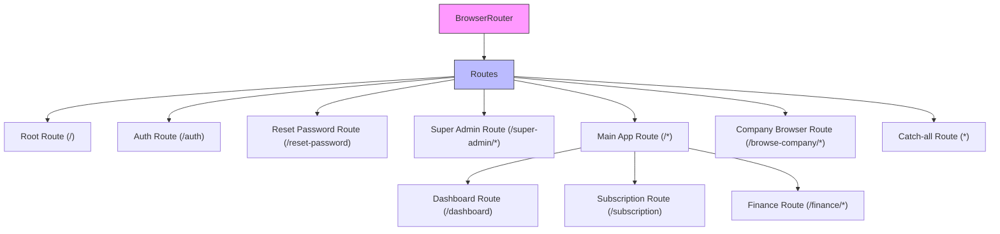
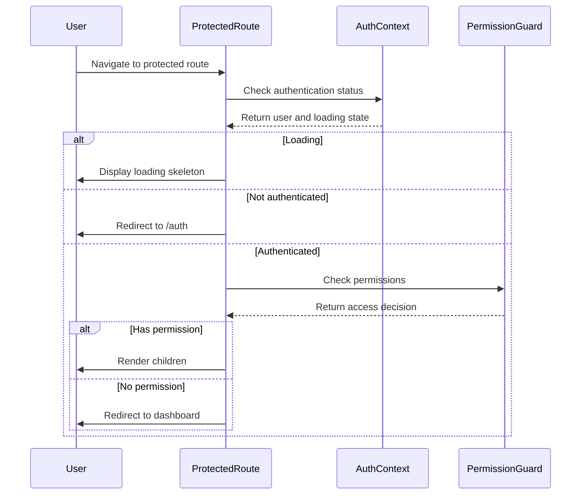
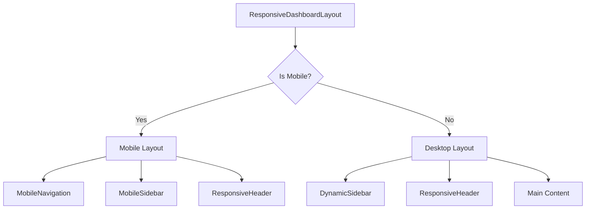
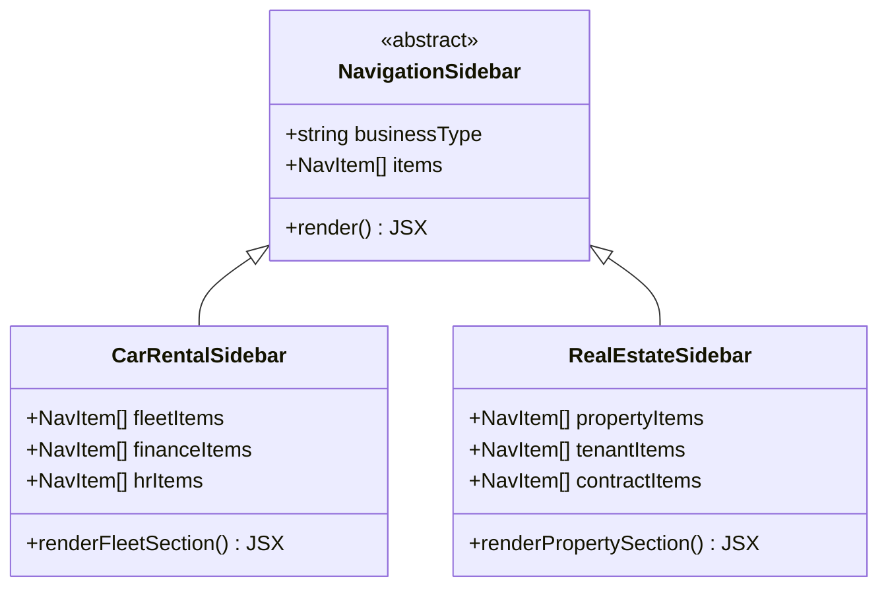

# Routing & Navigation

<cite>
**Referenced Files in This Document**   
- [App.tsx](file://src/App.tsx)
- [CarRentalSidebar.tsx](file://src/components/navigation/CarRentalSidebar.tsx)
- [RealEstateSidebar.tsx](file://src/components/navigation/RealEstateSidebar.tsx)
- [ProtectedRoute.tsx](file://src/components/common/ProtectedRoute.tsx)
- [ResponsiveDashboardLayout.tsx](file://src/components/layouts/ResponsiveDashboardLayout.tsx)
</cite>

## Table of Contents
1. [Introduction](#introduction)
2. [Routing System Architecture](#routing-system-architecture)
3. [Navigation Components](#navigation-components)
4. [Route Protection and Authorization](#route-protection-and-authorization)
5. [Layout and Responsive Design](#layout-and-responsive-design)
6. [Business-Specific Navigation](#business-specific-navigation)
7. [Navigation State Management](#navigation-state-management)
8. [Common Issues and Solutions](#common-issues-and-solutions)

## Introduction
The FleetifyApp routing and navigation system provides a seamless user experience across different modules and business types. Built on react-router-dom, the system enables intuitive navigation between application sections while maintaining proper authentication and authorization controls. This documentation explains the architecture, implementation details, and usage patterns of the routing system, covering both conceptual overviews for beginners and technical details for experienced developers.

**Section sources**
- [App.tsx](file://src/App.tsx#L1-L50)

## Routing System Architecture
The routing system is configured in App.tsx using react-router-dom's BrowserRouter, Routes, and Route components. The application implements a hierarchical routing structure with multiple layout levels and route protection mechanisms. The system supports both desktop and mobile interfaces with responsive navigation patterns.

The routing configuration includes:
- Main routes for top-level navigation
- Nested routes for module-specific functionality
- Legacy route redirects for backward compatibility
- Catch-all route for 404 handling

**Diagram sources**
- [App.tsx](file://src/App.tsx#L1-L420)

**Section sources**
- [App.tsx](file://src/App.tsx#L1-L420)

## Navigation Components
The navigation system consists of several key components that work together to provide a consistent user experience across different device types and business modules.

### AppSidebar
The AppSidebar component serves as the primary navigation interface on desktop and tablet devices. It provides access to all major application sections and maintains state for collapsed/expanded views.

### MobileNavigation
The MobileNavigation component provides bottom navigation for mobile devices, offering quick access to frequently used sections with icon-based navigation.

### ResponsiveHeader
The ResponsiveHeader component adapts to different screen sizes, providing appropriate navigation controls including menu toggles, search functionality, and user profile access.

### DynamicSidebar
The DynamicSidebar component renders the appropriate sidebar based on the user's business type, loading either CarRentalSidebar or RealEstateSidebar dynamically.

**Section sources**
- [ResponsiveDashboardLayout.tsx](file://src/components/layouts/ResponsiveDashboardLayout.tsx#L1-L138)

## Route Protection and Authorization
The routing system implements comprehensive protection mechanisms to ensure users can only access authorized content. The ProtectedRoute component and its variants provide different levels of access control.

### ProtectedRoute
The base ProtectedRoute component handles authentication and permission checking. It displays loading states during authentication and redirects unauthenticated users to the login page.

**Diagram sources**
- [ProtectedRoute.tsx](file://src/components/common/ProtectedRoute.tsx#L16-L60)

### Specialized Route Components
The system provides specialized route components for common authorization patterns:

- **AdminRoute**: Requires company administrator privileges
- **SuperAdminRoute**: Requires global super administrator access
- **FeatureRoute**: Requires specific feature access

These components wrap ProtectedRoute with predefined permission requirements, simplifying route configuration.

**Section sources**
- [ProtectedRoute.tsx](file://src/components/common/ProtectedRoute.tsx#L62-L95)

## Layout and Responsive Design
The application uses a responsive layout system that adapts to different screen sizes and device types. The ResponsiveDashboardLayout component orchestrates the navigation experience across devices.

### Desktop/Tablet Layout
On larger screens, the layout displays:
- Persistent sidebar navigation
- Top header with controls
- Main content area

### Mobile Layout
On mobile devices, the layout transforms to:
- Hidden sidebar accessible via sheet
- Bottom navigation bar
- Collapsible header

The system uses breakpoint detection to determine the appropriate layout and navigation patterns, ensuring optimal usability across all device types.

**Diagram sources**
- [ResponsiveDashboardLayout.tsx](file://src/components/layouts/ResponsiveDashboardLayout.tsx#L1-L138)

**Section sources**
- [ResponsiveDashboardLayout.tsx](file://src/components/layouts/ResponsiveDashboardLayout.tsx#L1-L138)

## Business-Specific Navigation
The application supports different business types through specialized sidebar components that reflect the unique requirements of each domain.

### CarRentalSidebar
The CarRentalSidebar provides navigation optimized for car rental operations, with primary sections for:
- Fleet management
- Vehicle maintenance
- Dispatch permits
- Traffic violations

### RealEstateSidebar
The RealEstateSidebar provides navigation tailored for real estate management, with primary sections for:
- Property management
- Tenant and owner management
- Lease contracts
- Property maintenance

Both sidebars share common elements like finance, HR, and reporting sections while emphasizing domain-specific functionality. The navigation structure reflects the workflow priorities of each business type.

**Diagram sources**
- [CarRentalSidebar.tsx](file://src/components/navigation/CarRentalSidebar.tsx#L1-L495)
- [RealEstateSidebar.tsx](file://src/components/navigation/RealEstateSidebar.tsx#L1-L542)

**Section sources**
- [CarRentalSidebar.tsx](file://src/components/navigation/CarRentalSidebar.tsx#L1-L495)
- [RealEstateSidebar.tsx](file://src/components/navigation/RealEstateSidebar.tsx#L1-L542)

## Navigation State Management
The navigation system manages state through several mechanisms to provide a consistent user experience.

### URL Parameters
The system uses URL parameters for dynamic content loading, such as:
- Property details: `/properties/:id`
- Report viewing: `/report/:moduleType/:reportId`
- Support tickets: `/support/ticket/:ticketId`

### Navigation History
The system preserves navigation history through react-router-dom's built-in history management, enabling proper back/forward navigation and browser history integration.

### State Persistence
Navigation state is persisted across sessions through:
- Authentication context
- Company context
- Local storage for UI preferences

This ensures users return to their previous state when navigating back to the application.

**Section sources**
- [App.tsx](file://src/App.tsx#L1-L420)

## Common Issues and Solutions
The routing system addresses several common navigation challenges through specific implementation patterns.

### Authentication Guarding
Issue: Unauthenticated users accessing protected routes
Solution: The ProtectedRoute component intercepts navigation and redirects to login when no user is authenticated, preserving the intended destination in location state.

### Dynamic Route Loading
Issue: Slow loading of navigation components on mobile devices
Solution: The system implements code splitting and lazy loading for sidebar components, with optimized loading states and timeout handling.

### Legacy Route Compatibility
Issue: Maintaining backward compatibility with old URLs
Solution: The system implements redirect routes for legacy URLs, mapping them to their modern equivalents while preserving query parameters.

### Permission-Based Navigation
Issue: Users seeing navigation options they cannot access
Solution: The AdminOnly component and PermissionGuard hide navigation items based on user permissions, preventing confusion and unnecessary clicks.

**Section sources**
- [App.tsx](file://src/App.tsx#L1-L420)
- [ProtectedRoute.tsx](file://src/components/common/ProtectedRoute.tsx#L1-L95)