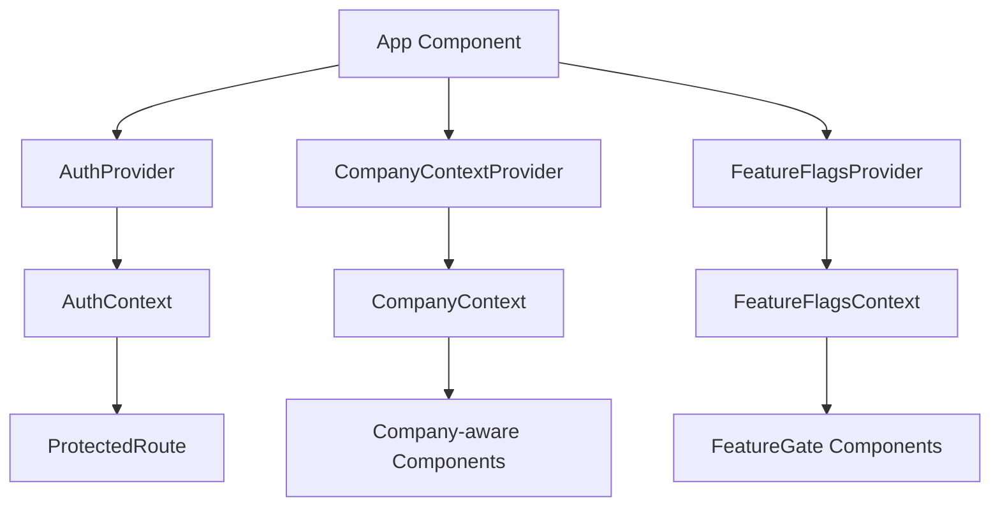
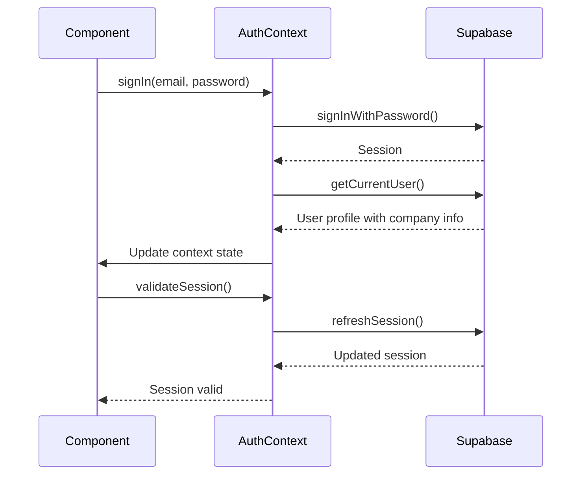
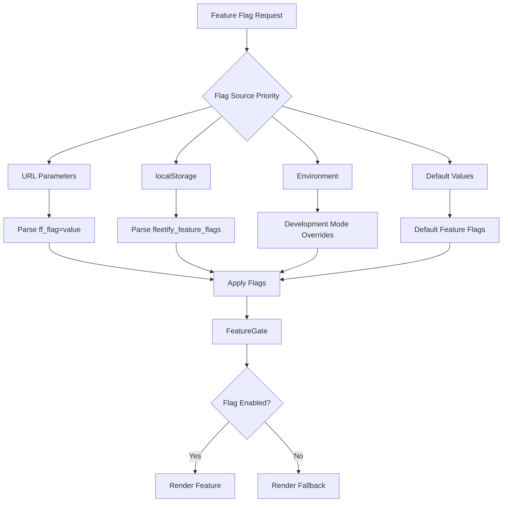
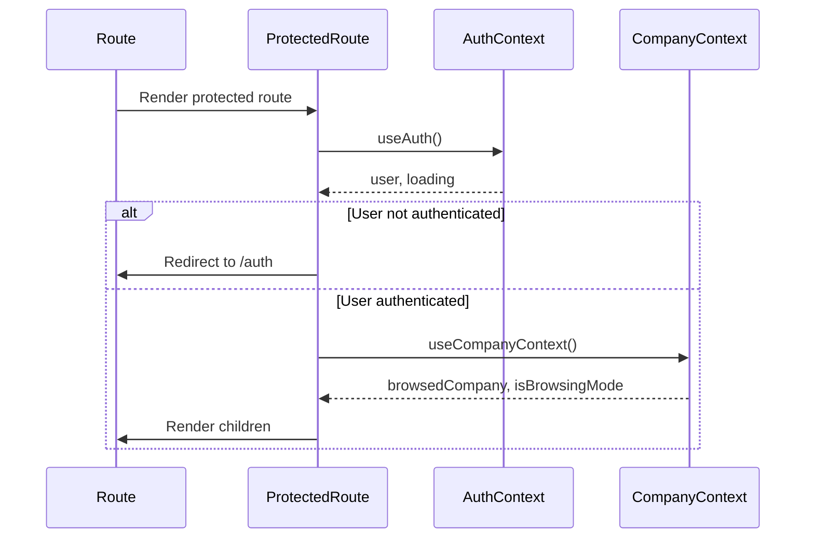

# Context API

<cite>
**Referenced Files in This Document**   
- [AuthContext.tsx](file://src/contexts/AuthContext.tsx)
- [CompanyContext.tsx](file://src/contexts/CompanyContext.tsx)
- [FeatureFlagsContext.tsx](file://src/contexts/FeatureFlagsContext.tsx)
- [App.tsx](file://src/App.tsx)
- [ProtectedRoute.tsx](file://src/components/common/ProtectedRoute.tsx)
- [auth.ts](file://src/lib/auth.ts)
- [useCompanies.ts](file://src/hooks/useCompanies.ts)
- [companyScope.ts](file://src/lib/companyScope.ts)
</cite>

## Table of Contents
1. [Introduction](#introduction)
2. [Context Providers Implementation](#context-providers-implementation)
3. [AuthContext: Authentication State Management](#authcontext-authentication-state-management)
4. [CompanyContext: Multi-Tenancy Support](#companycontext-multi-tenancy-support)
5. [FeatureFlagsContext: Dynamic Feature Toggling](#featureflagscontext-dynamic-feature-toggling)
6. [Context Consumer Usage](#context-consumer-usage)
7. [Best Practices and Performance](#best-practices-and-performance)
8. [Testing Context Consumers](#testing-context-consumers)

## Introduction
The FleetifyApp implements a comprehensive Context API architecture to manage global application state across authentication, company context, and feature flags. This system enables centralized state management while maintaining type safety through TypeScript and efficient re-renders through React's context mechanism. The implementation follows the provider pattern with dedicated context providers for each domain, allowing components throughout the application to access and respond to global state changes.

## Context Providers Implementation
The application's context providers are orchestrated in the App.tsx file, where multiple context providers are composed to create a unified state management system. The AuthProvider establishes authentication state, which is then used by the CompanyContextProvider to manage company-specific data. This composition allows for dependency between contexts while maintaining separation of concerns.



**Diagram sources**
- [App.tsx](file://src/App.tsx#L1-L420)
- [AuthContext.tsx](file://src/contexts/AuthContext.tsx#L1-L250)
- [CompanyContext.tsx](file://src/contexts/CompanyContext.tsx#L1-L81)

**Section sources**
- [App.tsx](file://src/App.tsx#L1-L420)

## AuthContext: Authentication State Management
The AuthContext provides a comprehensive authentication state management system that handles user login, logout, session validation, and token management. It integrates with Supabase for authentication services and maintains user profile information including company association and role-based permissions.

The context exposes methods for signing up, signing in, and signing out, along with utilities for updating user profiles and changing passwords. It implements automatic session validation and refresh mechanisms to ensure secure and uninterrupted user sessions. The context also handles error states and provides meaningful error messages to the user interface.



**Diagram sources**
- [AuthContext.tsx](file://src/contexts/AuthContext.tsx#L1-L250)
- [auth.ts](file://src/lib/auth.ts#L1-L249)

**Section sources**
- [AuthContext.tsx](file://src/contexts/AuthContext.tsx#L1-L250)
- [auth.ts](file://src/lib/auth.ts#L1-L249)

## CompanyContext: Multi-Tenancy Support
The CompanyContext enables multi-tenancy support by managing company-specific data and facilitating company switching for super administrators. It allows super admins to browse and manage multiple company accounts while maintaining proper data isolation for regular users.

The context tracks the currently browsed company and provides methods to set and clear the browsing mode. It implements role-based access control to ensure that only super administrators can switch between companies. The context also integrates with the unified company access system to provide consistent filtering and permission checks across the application.

```mermaid
classDiagram
class CompanyContext {
+browsedCompany : Company | null
+setBrowsedCompany(company : Company | null) : void
+isBrowsingMode : boolean
+exitBrowseMode() : void
}
class Company {
+id : string
+name : string
+name_ar? : string
+email? : string
+phone? : string
+subscription_status? : string
+subscription_plan? : string
+created_at? : string
+address? : string
+country? : string
+city? : string
}
class useUnifiedCompanyAccess {
+context : CompanyScopeContext
+companyId : string | null
+isSystemLevel : boolean
+hasGlobalAccess : boolean
+hasCompanyAdminAccess : boolean
+filter : { company_id? : string }
}
CompanyContext --> Company : "manages"
CompanyContext --> useUnifiedCompanyAccess : "integrates with"
useUnifiedCompanyAccess --> Company : "filters"
```

**Diagram sources**
- [CompanyContext.tsx](file://src/contexts/CompanyContext.tsx#L1-L81)
- [useCompanies.ts](file://src/hooks/useCompanies.ts#L1-L47)
- [companyScope.ts](file://src/lib/companyScope.ts#L1-L230)

**Section sources**
- [CompanyContext.tsx](file://src/contexts/CompanyContext.tsx#L1-L81)
- [useCompanies.ts](file://src/hooks/useCompanies.ts#L1-L47)
- [companyScope.ts](file://src/lib/companyScope.ts#L1-L230)

## FeatureFlagsContext: Dynamic Feature Toggling
The FeatureFlagsContext provides a robust system for dynamic feature toggling and A/B testing capabilities. It supports multiple configuration sources including URL parameters, localStorage, and environment-based overrides, allowing for flexible feature management across different deployment scenarios.

The context implements progressive rollouts based on user IDs, enabling controlled feature releases to specific percentages of users. It also provides A/B testing capabilities with consistent user assignment through hash-based distribution. The system includes developer tools for managing feature flags during development and supports importing/exporting flag configurations for team collaboration.



**Diagram sources**
- [FeatureFlagsContext.tsx](file://src/contexts/FeatureFlagsContext.tsx#L1-L378)

**Section sources**
- [FeatureFlagsContext.tsx](file://src/contexts/FeatureFlagsContext.tsx#L1-L378)

## Context Consumer Usage
Context consumers access state throughout the component tree using custom hooks that wrap the useContext API. The ProtectedRoute component demonstrates practical usage of AuthContext for route protection, checking authentication status and redirecting unauthenticated users to the login page.

Components use the CompanyContext to perform company-aware operations, ensuring data isolation and proper multi-tenancy support. The FeatureFlagsContext is consumed through the FeatureGate component, which conditionally renders content based on feature flag status. These patterns ensure consistent access to global state while maintaining clean component interfaces.



**Diagram sources**
- [ProtectedRoute.tsx](file://src/components/common/ProtectedRoute.tsx#L1-L96)
- [AuthContext.tsx](file://src/contexts/AuthContext.tsx#L1-L250)
- [CompanyContext.tsx](file://src/contexts/CompanyContext.tsx#L1-L81)

**Section sources**
- [ProtectedRoute.tsx](file://src/components/common/ProtectedRoute.tsx#L1-L96)

## Best Practices and Performance
The context implementation follows several best practices to ensure optimal performance and maintainability. Context values are memoized to prevent unnecessary re-renders, and state updates are batched where possible. The system avoids context nesting hell through context composition rather than deep nesting.

TypeScript interfaces ensure type safety across the application, with comprehensive type definitions for user, company, and feature flag data. The implementation includes error boundaries and safety timeouts to prevent infinite loading states. Performance monitoring is integrated to track context initialization and state changes.

To minimize re-renders, consumers should subscribe only to the specific state they need rather than the entire context value. The use of derived state and memoized selectors helps optimize performance, particularly for complex state calculations.

**Section sources**
- [AuthContext.tsx](file://src/contexts/AuthContext.tsx#L1-L250)
- [CompanyContext.tsx](file://src/contexts/CompanyContext.tsx#L1-L81)
- [FeatureFlagsContext.tsx](file://src/contexts/FeatureFlagsContext.tsx#L1-L378)

## Testing Context Consumers
Testing context consumers requires proper mocking of context providers to simulate different state scenarios. Unit tests should verify that components respond correctly to various context states, including loading, authenticated, and unauthenticated states.

Mocking libraries can be used to create test-specific context values, allowing for isolated testing of component behavior. Integration tests should validate that context providers properly initialize and propagate state changes throughout the component tree. The testing strategy should cover edge cases such as session expiration and company switching.

**Section sources**
- [AuthContext.tsx](file://src/contexts/AuthContext.tsx#L1-L250)
- [ProtectedRoute.tsx](file://src/components/common/ProtectedRoute.tsx#L1-L96)