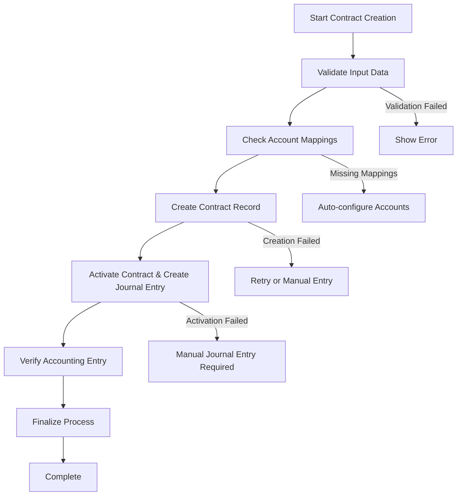
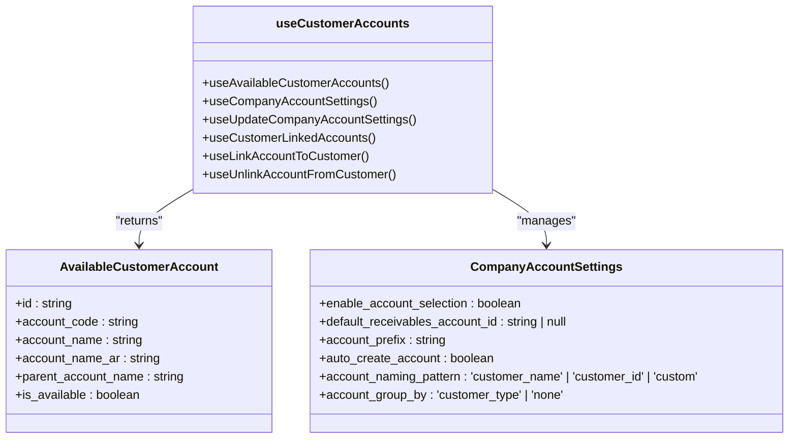
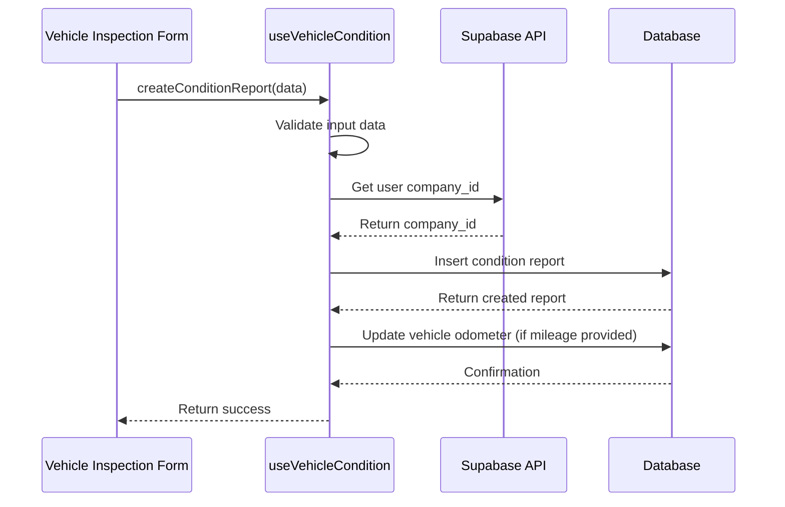
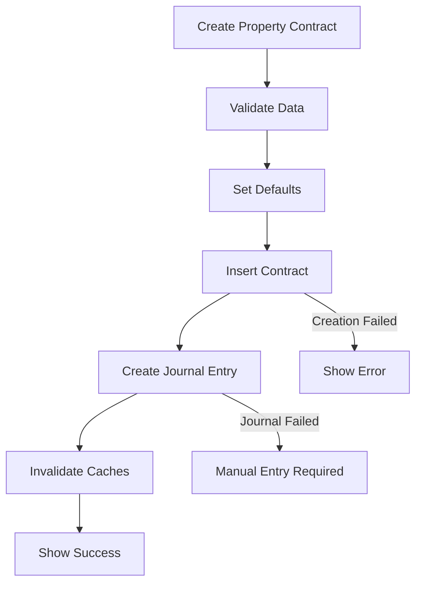
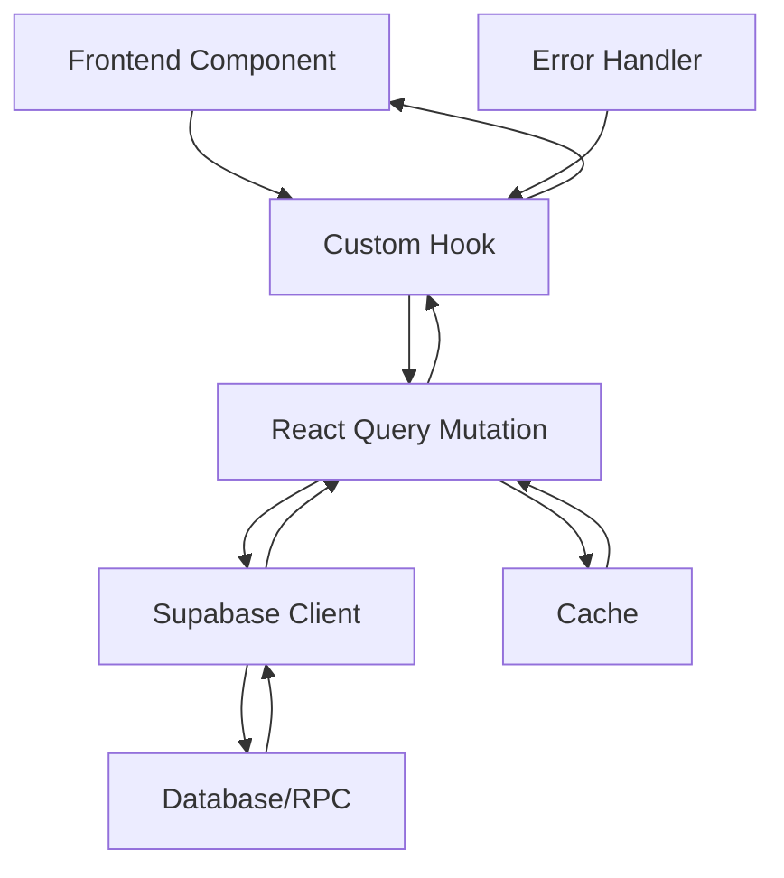

# Business Operations Hooks

<cite>
**Referenced Files in This Document**   
- [useContractCreation.ts](file://src/hooks/useContractCreation.ts)
- [useCustomerAccounts.ts](file://src/hooks/useCustomerAccounts.ts)
- [useVehicleCondition.ts](file://src/hooks/useVehicleCondition.ts)
- [usePropertyContracts.ts](file://src/modules/properties/hooks/usePropertyContracts.ts)
</cite>

## Table of Contents
1. [Introduction](#introduction)
2. [Core Business Operation Hooks](#core-business-operation-hooks)
3. [useContractCreation Hook](#usecontractcreation-hook)
4. [useCustomerAccounts Hook](#usecustomeraccounts-hook)
5. [useVehicleCondition Hook](#usevehiclecondition-hook)
6. [usePropertyContracts Hook](#usepropertycontracts-hook)
7. [Integration with Backend Services](#integration-with-backend-services)
8. [Common Issues and Solutions](#common-issues-and-solutions)
9. [Performance Considerations](#performance-considerations)
10. [Conclusion](#conclusion)

## Introduction
This document provides comprehensive documentation for the business operations custom hooks in FleetifyApp, focusing on core workflows such as contract creation, customer management, vehicle inspections, and property contracts. These hooks implement sophisticated state management patterns, integrate with backend services via React Query, and provide robust error handling and recovery mechanisms. The documentation covers implementation details, usage patterns, domain models, and performance optimizations for large forms and mobile interfaces.

## Core Business Operation Hooks
FleetifyApp implements a suite of custom React hooks designed to manage complex business operations with proper state management, validation, and backend integration. These hooks follow the React Query pattern for data fetching and mutation, providing optimized caching, error handling, and automatic refetching capabilities. The hooks are organized to handle specific business domains including contract management, customer lifecycle operations, vehicle condition reporting, and property contract workflows.

**Section sources**
- [useContractCreation.ts](file://src/hooks/useContractCreation.ts#L1-L702)
- [useCustomerAccounts.ts](file://src/hooks/useCustomerAccounts.ts#L1-L341)
- [useVehicleCondition.ts](file://src/hooks/useVehicleCondition.ts#L1-L302)
- [usePropertyContracts.ts](file://src/modules/properties/hooks/usePropertyContracts.ts#L1-L214)

## useContractCreation Hook
The `useContractCreation` hook manages the multi-step contract creation wizard with comprehensive state management, draft persistence, validation orchestration, and error recovery. It implements a step-by-step process for contract creation with detailed status tracking and user feedback.

**Diagram sources**
- [useContractCreation.ts](file://src/hooks/useContractCreation.ts#L50-L702)

The hook maintains a detailed state object that tracks the current step, overall processing status, and health status of the creation process. It implements automatic retry mechanisms and comprehensive error logging to ensure reliability. The state management includes draft persistence through Supabase storage, allowing users to resume interrupted creation processes.

**Section sources**
- [useContractCreation.ts](file://src/hooks/useContractCreation.ts#L50-L702)

## useCustomerAccounts Hook
The `useCustomerAccounts` hook handles customer lifecycle operations with integrated validation and duplicate detection. It manages the relationship between customers and their financial accounts, ensuring proper accounting integration.

**Diagram sources**
- [useCustomerAccounts.ts](file://src/hooks/useCustomerAccounts.ts#L1-L341)

The hook provides several sub-hooks for different aspects of customer account management, including retrieving available accounts, managing company settings, linking and unlinking accounts, and handling duplicate detection. It integrates with the chart of accounts system to ensure proper financial tracking and implements comprehensive cache invalidation to maintain data consistency.

**Section sources**
- [useCustomerAccounts.ts](file://src/hooks/useCustomerAccounts.ts#L1-L341)

## useVehicleCondition Hook
The `useVehicleCondition` hook manages vehicle inspection forms with conditional logic and media capture capabilities. It handles the complete lifecycle of vehicle condition reports from creation to updates.

**Diagram sources**
- [useVehicleCondition.ts](file://src/hooks/useVehicleCondition.ts#L1-L302)

The hook supports different inspection types (pre-dispatch, post-dispatch, contract inspection) and captures comprehensive vehicle condition data including photos, damage points, and condition items. It implements robust validation for mileage and fuel level inputs and automatically updates the vehicle's odometer reading when a new mileage is recorded.

**Section sources**
- [useVehicleCondition.ts](file://src/hooks/useVehicleCondition.ts#L1-L302)

## usePropertyContracts Hook
The `usePropertyContracts` hook handles real estate contract workflows with tenant integration. It manages the complete lifecycle of property contracts from creation to expiration tracking.

**Diagram sources**
- [usePropertyContracts.ts](file://src/modules/properties/hooks/usePropertyContracts.ts#L1-L214)

The hook provides comprehensive functionality for property contract management including creating, updating, and retrieving contracts with proper tenant and property relationships. It also includes specialized hooks for retrieving active contracts and contracts expiring within a specified timeframe, enabling proactive contract management.

**Section sources**
- [usePropertyContracts.ts](file://src/modules/properties/hooks/usePropertyContracts.ts#L1-L214)

## Integration with Backend Services
All business operation hooks integrate with backend services through Supabase, leveraging React Query for efficient data fetching and mutation. The hooks implement proper error handling, caching strategies, and automatic refetching to ensure data consistency.

**Diagram sources**
- [useContractCreation.ts](file://src/hooks/useContractCreation.ts#L1-L702)
- [useCustomerAccounts.ts](file://src/hooks/useCustomerAccounts.ts#L1-L341)
- [useVehicleCondition.ts](file://src/hooks/useVehicleCondition.ts#L1-L302)
- [usePropertyContracts.ts](file://src/modules/properties/hooks/usePropertyContracts.ts#L1-L214)

The integration pattern follows React Query best practices with proper query keys, cache invalidation, and error boundaries. Each hook implements comprehensive error handling with user-friendly toast notifications and detailed console logging for debugging.

**Section sources**
- [useContractCreation.ts](file://src/hooks/useContractCreation.ts#L1-L702)
- [useCustomerAccounts.ts](file://src/hooks/useCustomerAccounts.ts#L1-L341)
- [useVehicleCondition.ts](file://src/hooks/useVehicleCondition.ts#L1-L302)
- [usePropertyContracts.ts](file://src/modules/properties/hooks/usePropertyContracts.ts#L1-L214)

## Common Issues and Solutions
The business operation hooks address several common issues in complex form management and provide implemented solutions in the codebase.

### Form State Corruption
The hooks prevent form state corruption through proper React Query mutation patterns and state isolation. The `useContractCreation` hook maintains its state internally and only exposes a controlled interface to components.

### Network Failures
All hooks implement retry mechanisms with exponential backoff. The `useCustomerAccounts` hook has a retry configuration with up to 3 attempts and increasing delays between retries.

### Data Inconsistency
Cache invalidation is handled comprehensively across all hooks. After successful mutations, relevant queries are invalidated to ensure fresh data is fetched on subsequent requests.

### Validation Errors
Each hook implements domain-specific validation before communicating with the backend. The `useVehicleCondition` hook validates mileage and fuel level inputs, while `useContractCreation` validates contract dates and amounts.

**Section sources**
- [useContractCreation.ts](file://src/hooks/useContractCreation.ts#L1-L702)
- [useCustomerAccounts.ts](file://src/hooks/useCustomerAccounts.ts#L1-L341)
- [useVehicleCondition.ts](file://src/hooks/useVehicleCondition.ts#L1-L302)

## Performance Considerations
The business operation hooks include several performance optimizations for handling large forms and mobile interfaces.

### Large Form Optimization
The hooks implement lazy loading and selective data fetching to minimize payload size. The `useCustomerAccounts` hook only fetches necessary account levels (5 and 6) and filters by active status.

### Mobile Optimization
All hooks are designed to work efficiently on mobile devices with considerations for:
- Network reliability (retry mechanisms)
- Memory usage (proper cleanup)
- User experience (progress indicators)
- Offline capabilities (where applicable)

### Caching Strategy
The hooks implement appropriate caching with stale times and cache invalidation. The `useAvailableCustomerAccounts` hook uses a 5-minute stale time to balance freshness and performance.

**Section sources**
- [useContractCreation.ts](file://src/hooks/useContractCreation.ts#L1-L702)
- [useCustomerAccounts.ts](file://src/hooks/useCustomerAccounts.ts#L1-L341)
- [useVehicleCondition.ts](file://src/hooks/useVehicleCondition.ts#L1-L302)
- [usePropertyContracts.ts](file://src/modules/properties/hooks/usePropertyContracts.ts#L1-L214)

## Conclusion
The business operations hooks in FleetifyApp provide a robust foundation for managing complex workflows with proper state management, validation, and backend integration. By leveraging React Query and Supabase, these hooks offer reliable data handling with comprehensive error recovery and performance optimizations. The modular design allows for easy extension and maintenance, while the consistent patterns across hooks ensure a cohesive developer experience.