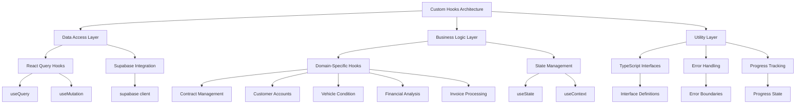
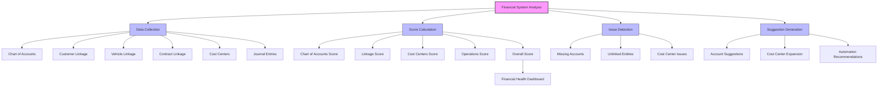
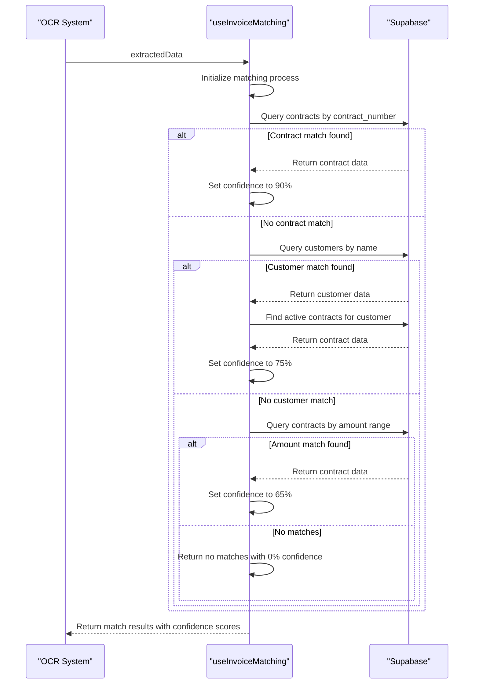
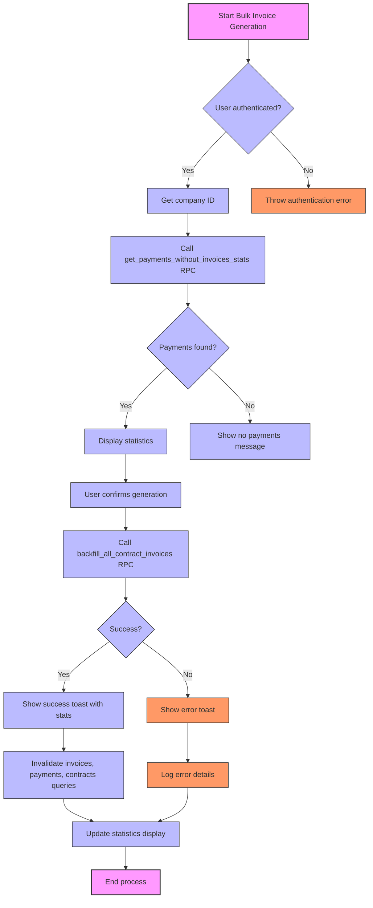

# Custom Hooks

<cite>
**Referenced Files in This Document**   
- [useContractCreation.ts](file://src/hooks/useContractCreation.ts)
- [useCustomerAccounts.ts](file://src/hooks/useCustomerAccounts.ts)
- [useVehicleCondition.ts](file://src/hooks/useVehicleCondition.ts)
- [useEnhancedContractUpload.ts](file://src/hooks/useEnhancedContractUpload.ts)
- [useIntelligentContractProcessor.ts](file://src/hooks/useIntelligentContractProcessor.ts)
- [useBulkInvoiceGeneration.ts](file://src/hooks/useBulkInvoiceGeneration.ts) - *Added in recent commit*
- [useInvoiceMatching.ts](file://src/hooks/useInvoiceMatching.ts) - *Added in recent commit*
- [useFinancialSystemAnalysis.ts](file://src/hooks/useFinancialSystemAnalysis.ts) - *Added in recent commit*
</cite>

## Update Summary
**Changes Made**   
- Added new section for Financial Analysis Hooks covering useFinancialSystemAnalysis
- Added new section for Invoice Processing Hooks covering useInvoiceMatching and useBulkInvoiceGeneration
- Updated Table of Contents to include new sections
- Added new diagrams for the new hook implementations
- Updated document sources to include newly added hook files

## Table of Contents
1. [Introduction](#introduction)
2. [Core Architecture](#core-architecture)
3. [Domain-Specific Hooks](#domain-specific-hooks)
4. [Financial Analysis Hooks](#financial-analysis-hooks)
5. [Invoice Processing Hooks](#invoice-processing-hooks)
6. [Composition Patterns](#composition-patterns)
7. [Advanced Hook Implementations](#advanced-hook-implementations)
8. [Design Patterns and Best Practices](#design-patterns-and-best-practices)
9. [Error Handling and Cleanup](#error-handling-and-cleanup)
10. [Creating New Hooks](#creating-new-hooks)
11. [Conclusion](#conclusion)

## Introduction

The FleetifyApp custom hooks architecture represents a sophisticated implementation of React's compositional patterns, designed to manage complex business logic across 100+ hooks in the src/hooks/ directory. These hooks serve as the primary mechanism for encapsulating stateful behavior, side effects, and domain-specific logic while promoting reusability and separation of concerns throughout the application. The architecture demonstrates a mature approach to React development, leveraging React Query for data fetching and mutations, custom state management for complex workflows, and composition patterns that enable the creation of higher-order hooks from simpler primitives.

The hooks ecosystem in FleetifyApp addresses critical business domains including contract management, customer accounts, vehicle condition reporting, file uploads, AI-assisted processing, financial system analysis, and invoice processing. Each hook is designed with a clear contract, well-defined interfaces, and comprehensive error handling, making them reliable building blocks for the application's components. The architecture emphasizes type safety through TypeScript interfaces, proper dependency management, and consistent patterns for loading states, error handling, and success callbacks.

**Section sources**
- [useContractCreation.ts](file://src/hooks/useContractCreation.ts#L1-L702)
- [useCustomerAccounts.ts](file://src/hooks/useCustomerAccounts.ts#L1-L341)
- [useVehicleCondition.ts](file://src/hooks/useVehicleCondition.ts#L1-L302)

## Core Architecture

The custom hooks architecture in FleetifyApp follows a layered approach that separates concerns while enabling powerful composition. At its foundation, the architecture relies on React Query for data fetching, mutations, and caching, providing a robust solution for server state management. The hooks are organized by domain, with clear separation between business logic hooks, data access hooks, and utility hooks. This organization enables developers to quickly locate relevant functionality and understand the relationships between different parts of the system.

The architecture employs a consistent pattern for state management, using useState for local component state and React Query's useQuery and useMutation hooks for server state. This separation ensures that UI state and server state are managed appropriately, with proper synchronization between them. The hooks also implement comprehensive error handling, with detailed error messages and appropriate user feedback through the toast notification system. Loading states are carefully managed, with progress indicators and appropriate UI feedback during asynchronous operations.

A key architectural decision is the use of context hooks like useUnifiedCompanyAccess to provide access to shared application state, such as the current company and user information. This pattern eliminates prop drilling and makes critical context available to any hook that needs it. The architecture also emphasizes type safety through extensive TypeScript interfaces that define the shape of data, parameters, and return values for each hook. This type safety extends to the database interactions, with proper typing of Supabase queries and responses.

**Diagram sources**
- [useContractCreation.ts](file://src/hooks/useContractCreation.ts#L1-L702)
- [useCustomerAccounts.ts](file://src/hooks/useCustomerAccounts.ts#L1-L341)
- [useVehicleCondition.ts](file://src/hooks/useVehicleCondition.ts#L1-L302)

**Section sources**
- [useContractCreation.ts](file://src/hooks/useContractCreation.ts#L1-L702)
- [useCustomerAccounts.ts](file://src/hooks/useCustomerAccounts.ts#L1-L341)
- [useVehicleCondition.ts](file://src/hooks/useVehicleCondition.ts#L1-L302)

## Domain-Specific Hooks

### Contract Creation Hook

The useContractCreation hook manages the multi-step contract creation wizard state, encapsulating a complex workflow that involves validation, account mapping, contract creation, activation, and finalization. This hook implements a state machine pattern with clearly defined steps, each with its own status (pending, processing, completed, failed, or warning). The hook maintains a ContractCreationState object that tracks the current step, overall processing status, and any warnings or errors encountered during the process.

The hook orchestrates a sophisticated sequence of operations, beginning with data validation and progressing through account mapping verification, contract creation via Supabase RPC calls, journal entry creation, and document saving. It implements comprehensive error handling at each step, with specific error messages tailored to the context of the failure. The hook also includes retry functionality, allowing users to retry failed steps without restarting the entire process. Progress is tracked and exposed through the creationState object, enabling UI components to display appropriate feedback to users.

**Diagram sources**
- [useContractCreation.ts](file://src/hooks/useContractCreation.ts#L48-L699)

**Section sources**
- [useContractCreation.ts](file://src/hooks/useContractCreation.ts#L48-L699)

### Customer Accounts Hook

The useCustomerAccounts hook handles customer account operations with validation, providing a comprehensive solution for managing the relationship between customers and their financial accounts. This hook implements multiple sub-hooks that address different aspects of customer account management, including retrieving available customer accounts, managing company account settings, linking accounts to customers, and unlinking accounts from customers.

The hook leverages the chart of accounts structure to identify appropriate accounts for customers, filtering by account type (assets, liabilities) and account level (5, 6). It implements sophisticated validation to ensure that accounts are properly configured and available for linking. The hook also manages the creation of customer accounts when needed, with automatic configuration of essential mappings. Cache invalidation is carefully handled to ensure that UI components are updated when account relationships change.

**Diagram sources**
- [useCustomerAccounts.ts](file://src/hooks/useCustomerAccounts.ts#L6-L340)

**Section sources**
- [useCustomerAccounts.ts](file://src/hooks/useCustomerAccounts.ts#L6-L340)

### Vehicle Condition Hook

The useVehicleCondition hook manages vehicle inspection workflows, providing a complete solution for creating, updating, and retrieving vehicle condition reports. This hook implements multiple sub-hooks that address different aspects of vehicle condition management, including retrieving reports for a specific dispatch permit, creating new condition reports, updating existing reports, and creating reports specifically for permits.

The hook enforces comprehensive validation rules for vehicle condition data, including mileage readings (must be greater than 0), fuel levels (must be between 0 and 100), and required fields like vehicle ID and inspection type. It also handles the integration between vehicle condition reports and vehicle records, automatically updating the vehicle's odometer reading when a new condition report is created with a mileage reading. The hook implements proper error handling with specific messages for different types of failures, such as permission denied, foreign key violations, and duplicate key errors.

**Diagram sources**
- [useVehicleCondition.ts](file://src/hooks/useVehicleCondition.ts#L1-L302)

**Section sources**
- [useVehicleCondition.ts](file://src/hooks/useVehicleCondition.ts#L1-L302)

## Financial Analysis Hooks

### Financial System Analysis Hook

The useFinancialSystemAnalysis hook provides comprehensive financial system analysis, offering a sophisticated solution for evaluating the health and completeness of a company's financial setup. This hook implements a multi-dimensional analysis that evaluates chart of accounts completeness, entity linkage, cost center configuration, and operational activity.

The hook performs a comprehensive assessment by querying multiple tables including chart_of_accounts, customers, vehicles, contracts, cost_centers, journal_entries, and customer_accounts. It calculates several key metrics:
- Total accounts in the chart of accounts
- Number of linked customers, vehicles, and contracts
- Active cost centers
- Recent journal entries
- Unlinked entities across all domains

Based on these metrics, the hook calculates four primary scores:
- Chart of Accounts Score: Evaluates the completeness of the chart of accounts based on essential account types and hierarchy
- Linkage Score: Measures the percentage of entities that are properly linked to financial accounts
- Cost Centers Score: Assesses the configuration and utilization of cost centers
- Operations Score: Evaluates recent financial activity and transaction completeness

**Diagram sources**
- [useFinancialSystemAnalysis.ts](file://src/hooks/useFinancialSystemAnalysis.ts#L49-L154)

**Section sources**
- [useFinancialSystemAnalysis.ts](file://src/hooks/useFinancialSystemAnalysis.ts#L49-L154)

## Invoice Processing Hooks

### Invoice Matching Hook

The useInvoiceMatching hook implements intelligent invoice matching, providing a sophisticated solution for connecting scanned invoice data with existing contracts and customers. This hook implements a multi-stage matching algorithm that uses various data points to find the most likely matches with confidence scoring.

The hook follows a three-stage matching process:
1. Contract Number Matching: First attempts to match by contract number with 90% confidence if found
2. Customer Name Matching: If no contract match, tries to match by customer name with up to 70% confidence
3. Amount and Date Range Matching: As a fallback, matches by amount (within 20% tolerance) and date range with up to 65% confidence

For each match, the hook returns a confidence score and reasons for the match, along with alternative matches that can be presented to users for verification. The hook also handles error cases gracefully and provides meaningful feedback when matches cannot be found.

**Diagram sources**
- [useInvoiceMatching.ts](file://src/hooks/useInvoiceMatching.ts#L4-L162)

**Section sources**
- [useInvoiceMatching.ts](file://src/hooks/useInvoiceMatching.ts#L4-L162)

### Bulk Invoice Generation Hook

The useBulkInvoiceGeneration hook provides bulk invoice creation functionality, implementing a solution for generating invoices for payments that lack corresponding invoices. This hook is particularly useful for backfilling historical data or processing multiple payments at once.

The hook provides two main functions:
1. Statistics retrieval: Gets information about payments without invoices, including total count and amount
2. Bulk generation: Creates invoices for all payments without invoices in a single operation

The hook uses Supabase RPC functions to perform these operations efficiently at the database level. After successful generation, it invalidates relevant query caches to ensure UI components are updated. The hook also provides detailed feedback including the number of invoices created, processing time, and any errors encountered.

**Diagram sources**
- [useBulkInvoiceGeneration.ts](file://src/hooks/useBulkInvoiceGeneration.ts#L29-L115)

**Section sources**
- [useBulkInvoiceGeneration.ts](file://src/hooks/useBulkInvoiceGeneration.ts#L29-L115)

## Composition Patterns

The custom hooks architecture in FleetifyApp demonstrates sophisticated composition patterns where complex hooks combine multiple simpler hooks to create powerful abstractions. This approach follows the principle of building complex functionality from simple, reusable parts, making the codebase more maintainable and easier to understand. The composition patterns are evident in several key areas, including form validation, data fetching, and state management.

One prominent composition pattern is the combination of useDebounce with form state management. While not explicitly shown in the provided code, this pattern is implied by the presence of useDebounce in the hook directory and is commonly used in conjunction with form state hooks to provide real-time validation and search functionality. The debounce hook would be used to delay expensive operations like API calls until the user has stopped typing, improving performance and reducing unnecessary network requests.

Another composition pattern is the integration of multiple data fetching hooks within a single business logic hook. For example, the useContractCreation hook combines useQueryClient for cache management, useMutation for contract creation, useUnifiedCompanyAccess for context access, and useEssentialAccountMappings for account configuration. This composition allows the hook to orchestrate a complex workflow that spans multiple domains and data sources, while keeping the implementation details encapsulated within the hook.

**Diagram sources**
- [useContractCreation.ts](file://src/hooks/useContractCreation.ts#L48-L699)
- [useCustomerAccounts.ts](file://src/hooks/useCustomerAccounts.ts#L6-L340)

**Section sources**
- [useContractCreation.ts](file://src/hooks/useContractCreation.ts#L48-L699)
- [useCustomerAccounts.ts](file://src/hooks/useCustomerAccounts.ts#L6-L340)

## Advanced Hook Implementations

### Enhanced Contract Upload Hook

The useEnhancedContractUpload hook provides advanced file upload functionality with progress tracking, implementing a sophisticated solution for processing CSV files containing contract data. This hook combines CSV parsing with customer name matching, automatic customer creation, and bulk contract import. It implements a fuzzy matching algorithm to find existing customers based on name similarity, with a configurable threshold for matching accuracy.

The hook provides comprehensive progress tracking, with percentage-based progress updates that reflect the different stages of processing: CSV parsing (0-50%), data processing (50-60%), and bulk import (60-100%). This granular progress tracking enables UI components to provide meaningful feedback to users during what could be a lengthy operation. The hook also handles error scenarios gracefully, continuing processing even when individual contracts fail, and providing detailed error reports that include the row number and specific error message for each failed contract.

**Diagram sources**
- [useEnhancedContractUpload.ts](file://src/hooks/useEnhancedContractUpload.ts#L18-L352)

**Section sources**
- [useEnhancedContractUpload.ts](file://src/hooks/useEnhancedContractUpload.ts#L18-L352)

### Intelligent Contract Processor Hook

The useIntelligentContractProcessor hook implements AI-assisted contract processing, providing a sophisticated solution for validating and enhancing contract data. This hook orchestrates the processing of multiple contracts through an AI-powered edge function, with batch processing to avoid overwhelming the AI service. It implements comprehensive progress tracking, with percentage-based updates that reflect the processing of each batch.

The hook provides a rich set of functionality for working with processed contract data, including applying corrections, retrieving processed data, downloading processing reports, and clearing the preview state. The processing report includes detailed information about each contract, including original data, processed data, suggestions, corrections, validation issues, and applied fixes. This comprehensive reporting enables users to understand exactly what changes were made to their data and why.

**Diagram sources**
- [useIntelligentContractProcessor.ts](file://src/hooks/useIntelligentContractProcessor.ts#L59-L270)

**Section sources**
- [useIntelligentContractProcessor.ts](file://src/hooks/useIntelligentContractProcessor.ts#L59-L270)

## Design Patterns and Best Practices

The custom hooks in FleetifyApp follow several key design patterns and best practices that contribute to their effectiveness and maintainability. One prominent pattern is the use of TypeScript interfaces to define the shape of data, parameters, and return values. This type safety ensures that hooks are used correctly and makes it easier to understand their behavior without needing to examine their implementation. The interfaces also serve as documentation, clearly defining the contract between the hook and its consumers.

Another best practice is the consistent use of React Query for data fetching and mutations. This provides a standardized approach to server state management across the application, with built-in support for caching, error handling, and loading states. The use of query keys as arrays enables precise cache invalidation and dependency management, ensuring that data is always up-to-date. The hooks also implement proper dependency arrays in their useEffect and useCallback hooks, preventing unnecessary re-renders and potential infinite loops.

The hooks follow a consistent pattern for error handling, with detailed error messages that are tailored to the specific context of the failure. These error messages are often translated into Arabic for the user interface, while maintaining English for the underlying code. The hooks also use the toast notification system to provide user feedback, with different toast types (success, error, warning) for different outcomes. This consistent approach to user feedback improves the user experience and makes it easier for users to understand what is happening.

**Diagram sources**
- [useContractCreation.ts](file://src/hooks/useContractCreation.ts#L48-L699)
- [useCustomerAccounts.ts](file://src/hooks/useCustomerAccounts.ts#L6-L340)
- [useVehicleCondition.ts](file://src/hooks/useVehicleCondition.ts#L1-L302)

**Section sources**
- [useContractCreation.ts](file://src/hooks/useContractCreation.ts#L48-L699)
- [useCustomerAccounts.ts](file://src/hooks/useCustomerAccounts.ts#L6-L340)
- [useVehicleCondition.ts](file://src/hooks/useVehicleCondition.ts#L1-L302)

## Error Handling and Cleanup

The custom hooks in FleetifyApp implement comprehensive error handling and proper cleanup to ensure reliability and prevent memory leaks. Each hook includes detailed error handling with specific messages for different types of failures, such as validation errors, database errors, network errors, and permission errors. These error messages are often translated into Arabic for the user interface, while maintaining English for the underlying code. The hooks also use the toast notification system to provide user feedback, with different toast types (success, error, warning) for different outcomes.

Proper cleanup is implemented through the use of React Query's cache invalidation mechanisms and the cleanup of event listeners or subscriptions when components unmount. The hooks also handle asynchronous operations carefully, ensuring that state updates are not performed after a component has unmounted, which could lead to memory leaks. This is particularly important for long-running operations like file uploads or AI processing, where the component might be unmounted before the operation completes.

The hooks also implement retry mechanisms for failed operations, allowing users to retry without restarting the entire process. This is particularly useful for operations that might fail due to transient network issues. The retry functionality is implemented in a way that preserves the state of the operation, so users can resume from where they left off rather than starting over.

**Diagram sources**
- [useContractCreation.ts](file://src/hooks/useContractCreation.ts#L48-L699)
- [useCustomerAccounts.ts](file://src/hooks/useCustomerAccounts.ts#L6-L340)
- [useVehicleCondition.ts](file://src/hooks/useVehicleCondition.ts#L1-L302)

**Section sources**
- [useContractCreation.ts](file://src/hooks/useContractCreation.ts#L48-L699)
- [useCustomerAccounts.ts](file://src/hooks/useCustomerAccounts.ts#L6-L340)
- [useVehicleCondition.ts](file://src/hooks/useVehicleCondition.ts#L1-L302)

## Creating New Hooks

When creating new hooks in the FleetifyApp project, developers should follow the established conventions for naming, typing, and error handling. Hooks should be named with the "use" prefix followed by a descriptive name that indicates their purpose, such as useContractCreation or useCustomerAccounts. The naming should be consistent with the existing hooks in the codebase, using camelCase and avoiding abbreviations unless they are well-established in the domain.

TypeScript interfaces should be used to define the shape of data, parameters, and return values, ensuring type safety and providing clear documentation of the hook's contract. The interfaces should be defined in the same file as the hook, unless they are shared across multiple hooks, in which case they should be placed in an appropriate types file. The interfaces should be as specific as possible, avoiding the use of any type unless absolutely necessary.

Error handling should follow the established pattern of providing detailed error messages that are tailored to the specific context of the failure. These error messages should be translated into Arabic for the user interface, while maintaining English for the underlying code. The hooks should also use the toast notification system to provide user feedback, with different toast types (success, error, warning) for different outcomes. Loading states should be carefully managed, with appropriate UI feedback during asynchronous operations.

**Diagram sources**
- [useContractCreation.ts](file://src/hooks/useContractCreation.ts#L48-L699)
- [useCustomerAccounts.ts](file://src/hooks/useCustomerAccounts.ts#L6-L340)
- [useVehicleCondition.ts](file://src/hooks/useVehicleCondition.ts#L1-L302)

**Section sources**
- [useContractCreation.ts](file://src/hooks/useContractCreation.ts#L48-L699)
- [useCustomerAccounts.ts](file://src/hooks/useCustomerAccounts.ts#L6-L340)
- [useVehicleCondition.ts](file://src/hooks/useVehicleCondition.ts#L1-L302)

## Conclusion

The custom hooks architecture in FleetifyApp represents a sophisticated and well-designed implementation of React's compositional patterns. By encapsulating complex business logic, stateful behavior, and side effects within reusable hooks, the architecture promotes separation of concerns and enhances code maintainability. The hooks demonstrate a mature approach to React development, leveraging React Query for data fetching and mutations, custom state management for complex workflows, and composition patterns that enable the creation of higher-order hooks from simpler primitives.

The architecture addresses critical business domains including contract management, customer accounts, vehicle condition reporting, file uploads, AI-assisted processing, financial system analysis, and invoice processing, providing a comprehensive solution for the application's needs. Each hook is designed with a clear contract, well-defined interfaces, and comprehensive error handling, making them reliable building blocks for the application's components. The consistent use of TypeScript interfaces, React Query, and the toast notification system ensures a high level of type safety, data consistency, and user feedback throughout the application.

By following the established conventions for naming, typing, and error handling, developers can create new hooks that integrate seamlessly with the existing architecture. The composition patterns demonstrated in the codebase provide a blueprint for building complex functionality from simple, reusable parts, making the codebase more maintainable and easier to understand. Overall, the custom hooks architecture in FleetifyApp serves as a model for building scalable and maintainable React applications.

**Section sources**
- [useContractCreation.ts](file://src/hooks/useContractCreation.ts#L48-L699)
- [useCustomerAccounts.ts](file://src/hooks/useCustomerAccounts.ts#L6-L340)
- [useVehicleCondition.ts](file://src/hooks/useVehicleCondition.ts#L1-L302)
- [useEnhancedContractUpload.ts](file://src/hooks/useEnhancedContractUpload.ts#L18-L352)
- [useIntelligentContractProcessor.ts](file://src/hooks/useIntelligentContractProcessor.ts#L59-L270)
- [useBulkInvoiceGeneration.ts](file://src/hooks/useBulkInvoiceGeneration.ts#L29-L115)
- [useInvoiceMatching.ts](file://src/hooks/useInvoiceMatching.ts#L4-L162)
- [useFinancialSystemAnalysis.ts](file://src/hooks/useFinancialSystemAnalysis.ts#L49-L154)