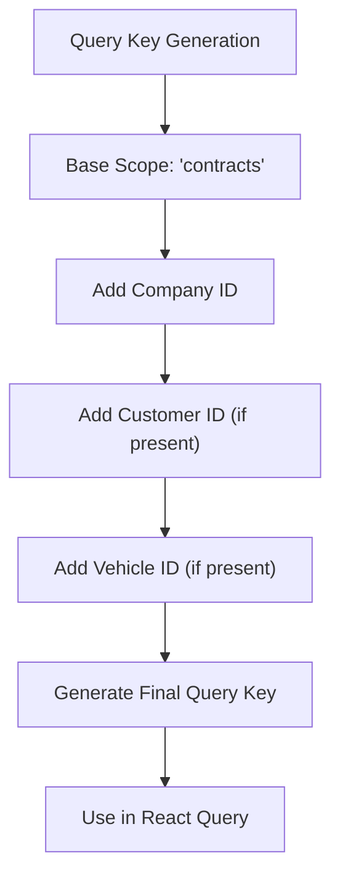
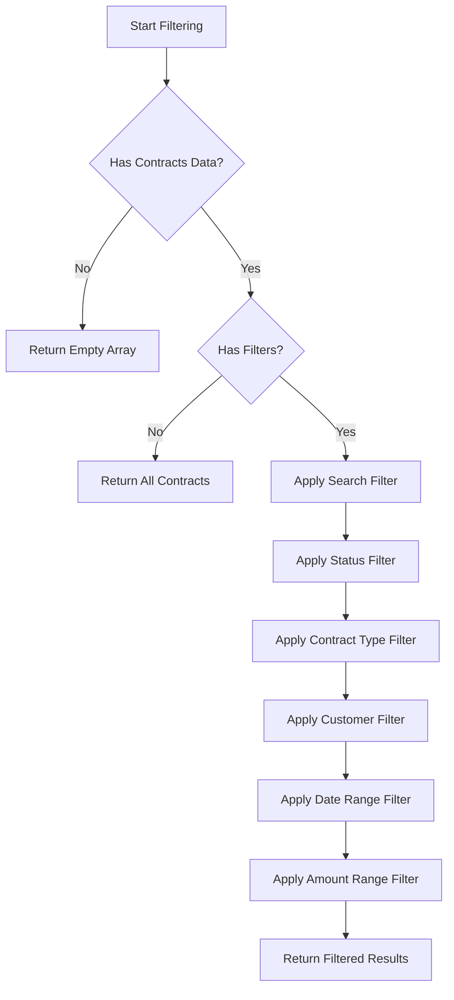
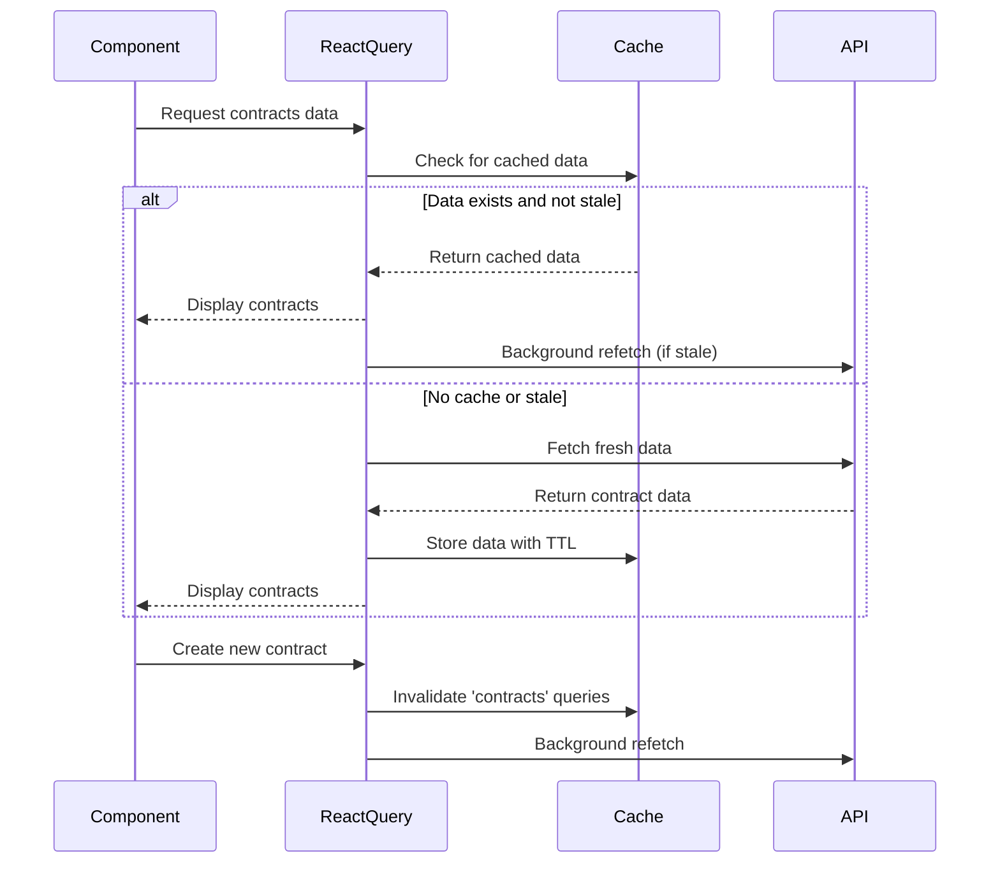
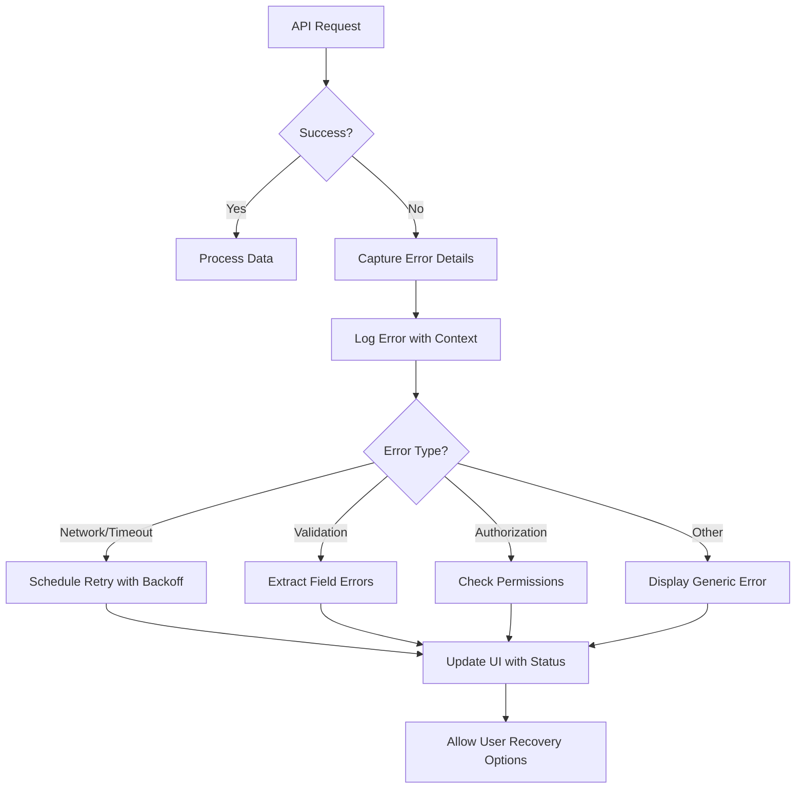
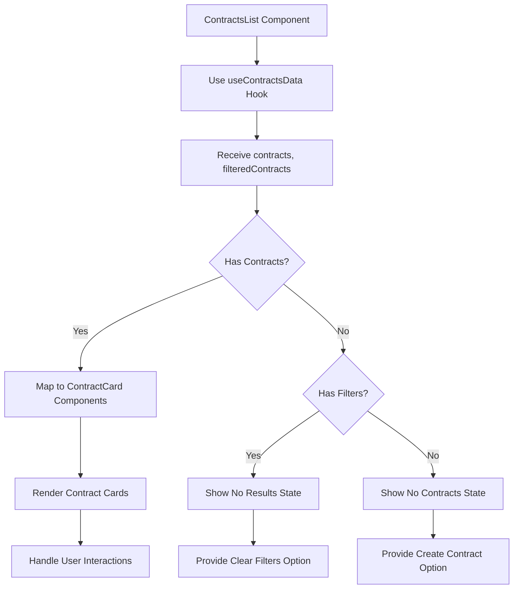

# Contracts Data Hooks

<cite>
**Referenced Files in This Document**   
- [useContracts.ts](file://src/hooks/useContracts.ts)
- [useContractsData.tsx](file://src/hooks/useContractsData.tsx)
- [contracts.ts](file://src/types/contracts.ts)
- [contract.schema.ts](file://src/schemas/contract.schema.ts)
- [ContractsList.tsx](file://src/components/contracts/ContractsList.tsx)
</cite>

## Table of Contents
1. [Introduction](#introduction)
2. [Core Components](#core-components)
3. [Query Key Structure](#query-key-structure)
4. [Filtering Mechanism](#filtering-mechanism)
5. [Cache Management](#cache-management)
6. [Error Handling](#error-handling)
7. [Usage Examples](#usage-examples)
8. [Performance Considerations](#performance-considerations)

## Introduction
This document provides comprehensive documentation for the contracts data fetching hooks in the Fleetify application. It details the implementation of `useContracts` and related hooks for retrieving contract data with advanced filtering capabilities, including status, date ranges, and customer-based filtering. The document covers integration with React Query for efficient data fetching and caching, pagination strategies, and error handling patterns. It also explains how these hooks are used within UI components to display contract information and handle user interactions.

## Core Components

The contract data fetching functionality is implemented through several key components and hooks that work together to provide a robust data access layer. The primary hook `useContracts` serves as the foundation for retrieving contract data from the Supabase backend, while `useContractsData` provides additional filtering and processing capabilities on the client side.

The implementation follows a modular approach where data retrieval is separated from data transformation and filtering logic. This separation of concerns allows for greater flexibility and reusability across different parts of the application. The hooks leverage React Query's powerful caching and background synchronization features to ensure optimal performance and user experience.

**Section sources**
- [useContracts.ts](file://src/hooks/useContracts.ts#L41-L128)
- [useContractsData.tsx](file://src/hooks/useContractsData.tsx#L110-L149)

## Query Key Structure

The query key structure for contract data fetching is designed to ensure proper cache invalidation and data consistency. The `getQueryKey` function generates unique query keys based on the scope and filter parameters, allowing React Query to effectively manage the cache for different contract views.

Query keys are constructed using a combination of static identifiers and dynamic parameters. For example, the "contracts" scope is combined with company ID, customer ID, and vehicle ID to create a unique identifier for each data set. This approach ensures that data for different companies or filtered views are cached separately, preventing data leakage between contexts.

The query key structure also supports override functionality, allowing specific company contexts to be targeted when needed. This is particularly useful in multi-tenant scenarios where users may need to access contract data across different company boundaries while maintaining proper access controls.

**Diagram sources**
- [useContracts.ts](file://src/hooks/useContracts.ts#L41-L87)

## Filtering Mechanism

The contract filtering mechanism provides comprehensive client-side filtering capabilities that work in conjunction with server-side queries. The `useContractsData` hook implements a sophisticated filtering system that supports multiple filter dimensions including search terms, status, contract type, customer, date ranges, and amount ranges.

The filtering process follows a sequential evaluation pattern where each filter condition is applied in a specific order. Search filtering operates on contract number, description, and terms fields using case-insensitive matching. Status and contract type filters use exact matching against predefined enum values. Date range filtering compares contract dates against specified start and end dates.

Amount-based filtering supports both minimum and maximum thresholds, allowing users to find contracts within specific financial ranges. The filtering system is optimized using React's `useMemo` hook to prevent unnecessary reprocessing when dependencies haven't changed, ensuring smooth performance even with large contract datasets.

**Diagram sources**
- [useContractsData.tsx](file://src/hooks/useContractsData.tsx#L110-L149)
- [useContractsData.tsx](file://src/hooks/useContractsData.tsx#L182-L209)

**Section sources**
- [useContractsData.tsx](file://src/hooks/useContractsData.tsx#L110-L209)

## Cache Management

Cache management for contract data is implemented using React Query's built-in caching mechanisms with carefully configured stale and garbage collection times. The `staleTime` is set to 5 minutes for general contract queries and 3 minutes for active contracts, balancing data freshness with performance.

The cache invalidation strategy is triggered by successful contract mutations, such as creation or updates. When a new contract is created, the system automatically invalidates queries with the 'contracts' key, prompting React Query to refetch the latest data in the background. This ensures that users always see up-to-date contract information without requiring manual page refreshes.

The cache configuration also includes proper dependency management through the `enabled` parameter, which prevents queries from executing when required dependencies like company ID are not available. This prevents unnecessary API calls and potential errors in contexts where the user doesn't have appropriate access rights.

**Diagram sources**
- [useContracts.ts](file://src/hooks/useContracts.ts#L41-L87)
- [useContractCreationOptimized.ts](file://src/hooks/useContractCreationOptimized.ts#L193-L231)

## Error Handling

Error handling in the contract data hooks follows a comprehensive approach that addresses both expected and unexpected failure scenarios. When API requests fail, the system captures and logs detailed error information while presenting user-friendly messages through the UI components.

Network-related errors and API failures are handled gracefully, allowing the application to maintain functionality even when temporary connectivity issues occur. The error handling system includes retry logic for transient failures, automatically attempting to re-establish connections with exponential backoff patterns.

For validation errors during contract creation or modification, the system provides specific feedback about which fields or requirements failed validation. This detailed error reporting helps users correct issues efficiently without requiring technical knowledge of the underlying system architecture.

**Diagram sources**
- [useContracts.ts](file://src/hooks/useContracts.ts#L84-L128)
- [useContractValidation.ts](file://src/hooks/useContractValidation.ts#L76-L116)

**Section sources**
- [useContracts.ts](file://src/hooks/useContracts.ts#L84-L128)
- [useContractValidation.ts](file://src/hooks/useContractValidation.ts#L76-L116)

## Usage Examples

The contract data hooks are consumed by various UI components throughout the application, with the `ContractsList` component being a primary consumer. This component uses the filtered contract data to render a grid of `ContractCard` components, providing users with a visual overview of their contracts.

When no contracts match the current filters, the system displays an appropriate empty state with options to clear filters or create new contracts. This user-friendly approach guides users through the contract management process and reduces confusion when expected data doesn't appear.

The hooks expose essential properties like `isLoading`, `refetch`, and `statistics` that enable rich user interactions. Loading states are properly handled to provide feedback during data retrieval, while the refetch function allows users to manually refresh data when needed. The statistics object provides aggregated information about the contract dataset for display in dashboards and summary views.

**Diagram sources**
- [ContractsList.tsx](file://src/components/contracts/ContractsList.tsx#L0-L43)

**Section sources**
- [ContractsList.tsx](file://src/components/contracts/ContractsList.tsx#L0-L66)

## Performance Considerations

The contract data fetching implementation includes several performance optimizations to handle large datasets efficiently. The combination of server-side filtering for basic queries and client-side filtering for complex conditions minimizes network traffic while maintaining responsive UI interactions.

Data processing is optimized using React's memoization hooks to prevent unnecessary recalculations during rendering cycles. The filtering operations are designed to short-circuit as early as possible, returning false at the first failing condition rather than evaluating all criteria for every contract.

For very large contract datasets, the system could be extended to implement true infinite scrolling with cursor-based pagination, reducing initial load times and memory usage. The current implementation loads all contracts for a company and filters client-side, which works well for moderate dataset sizes but may require server-side pagination for enterprises with tens of thousands of contracts.

The caching strategy balances data freshness with performance, using appropriate stale times that prevent excessive API calls while ensuring users aren't working with outdated information for extended periods. The automatic cache invalidation on mutations ensures data consistency without requiring full page reloads.

**Section sources**
- [useContracts.ts](file://src/hooks/useContracts.ts#L41-L128)
- [useContractsData.tsx](file://src/hooks/useContractsData.tsx#L110-L209)