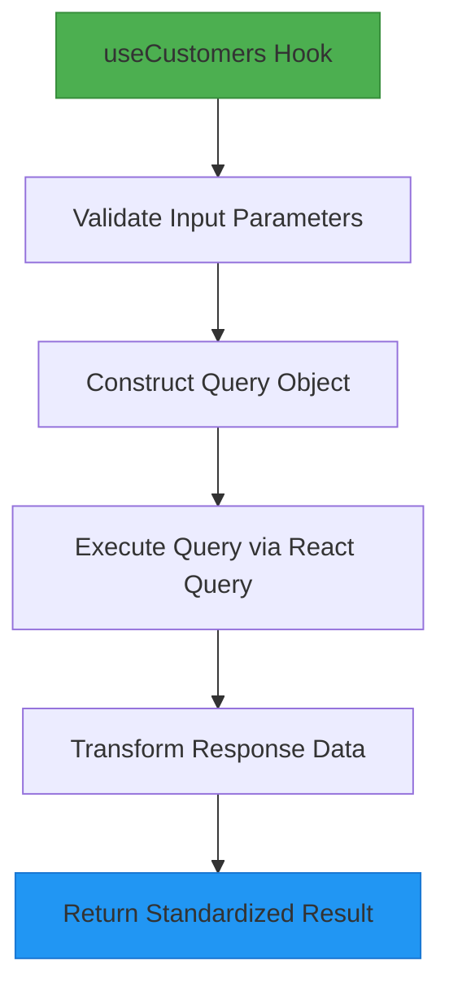
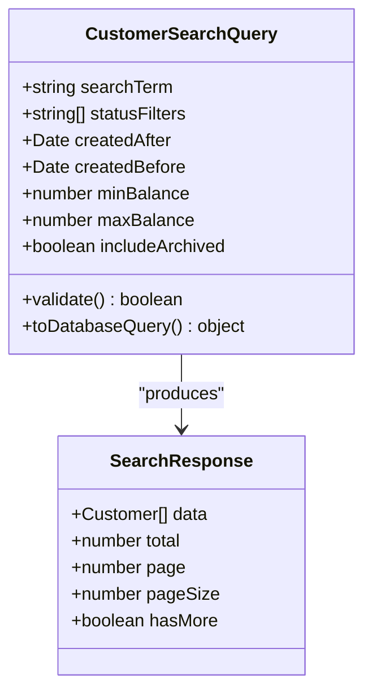
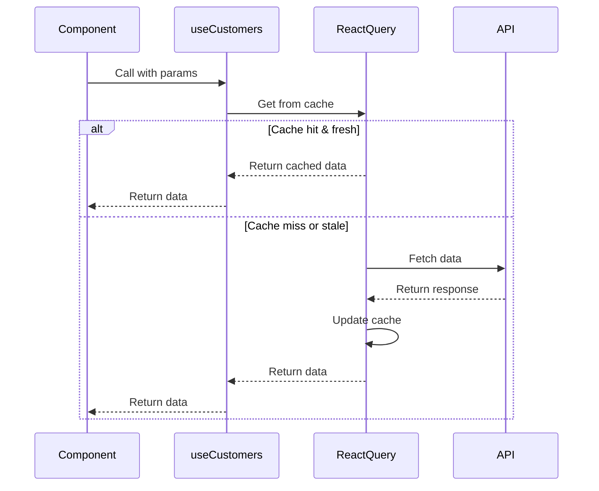
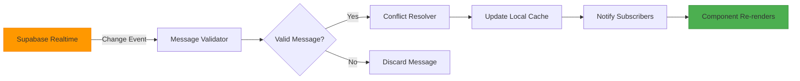
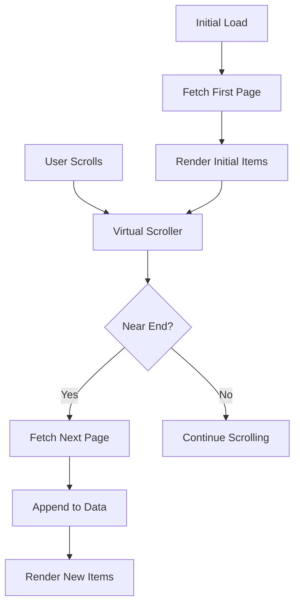
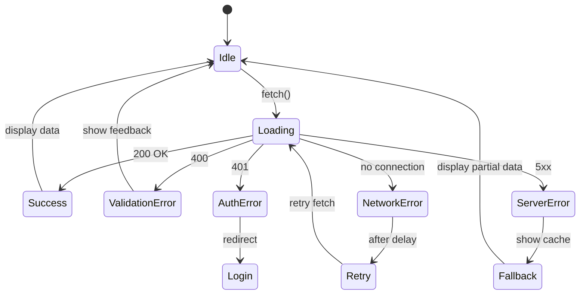
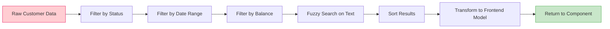

# Customers Data Hooks

<cite>
**Referenced Files in This Document**   
- [useCustomers.ts](file://src/hooks/useCustomers.ts)
- [useEnhancedCustomers.ts](file://src/hooks/useEnhancedCustomers.ts)
- [useEnhancedCustomersRealtime.ts](file://src/hooks/useEnhancedCustomersRealtime.ts)
- [customer.schema.ts](file://src/schemas/customer.schema.ts)
- [enhanced-customer-search.ts](file://src/utils/enhanced-customer-search.ts)
- [Customers.tsx](file://src/pages/Customers.tsx)
- [CustomerDetailsDialog.tsx](file://src/components/customers/CustomerDetailsDialog.tsx)
- [CustomerFormWithDuplicateCheck.tsx](file://src/components/customers/CustomerFormWithDuplicateCheck.tsx)
- [CustomerSearchFilters.tsx](file://src/components/contracts/ContractSearchFilters.tsx)
</cite>

## Table of Contents
1. [Introduction](#introduction)
2. [Core Customer Data Hooks Overview](#core-customer-data-hooks-overview)
3. [useCustomers Hook Implementation](#usecustomers-hook-implementation)
4. [Query Structure and Search Capabilities](#query-structure-and-search-capabilities)
5. [Integration with React Query](#integration-with-react-query)
6. [Real-Time Data Synchronization](#real-time-data-synchronization)
7. [Handling Large Datasets with Pagination and Virtual Scrolling](#handling-large-datasets-with-pagination-and-virtual-scrolling)
8. [Error Handling and Fallback UI Strategies](#error-handling-and-fallback-ui-strategies)
9. [Performance Optimization Techniques](#performance-optimization-techniques)
10. [Conclusion](#conclusion)

## Introduction

The customer data fetching system in the FleetifyApp is designed to provide efficient, scalable, and real-time access to customer information across the application. This document details the implementation of customer data hooks, focusing on the `useCustomers` hook and its enhanced variants, which support advanced search, filtering, real-time updates, and optimized performance for large datasets. The system leverages React Query for state management and caching, integrates with Supabase for backend communication, and implements robust error handling and fallback mechanisms.

## Core Customer Data Hooks Overview

The application provides multiple hooks for customer data retrieval, each tailored for specific use cases:
- `useCustomers`: Basic customer list retrieval with search and filtering
- `useEnhancedCustomers`: Advanced customer search with fuzzy matching and complex filters
- `useEnhancedCustomersRealtime`: Real-time customer data synchronization

These hooks abstract the complexity of data fetching, caching, and state management, providing a consistent interface for components to consume customer data.

**Section sources**
- [useCustomers.ts](file://src/hooks/useCustomers.ts)
- [useEnhancedCustomers.ts](file://src/hooks/useEnhancedCustomers.ts)
- [useEnhancedCustomersRealtime.ts](file://src/hooks/useEnhancedCustomersRealtime.ts)

## useCustomers Hook Implementation

The `useCustomers` hook serves as the primary interface for retrieving customer lists with support for search and account status filtering. It accepts parameters for search terms, status filters, and pagination, constructing appropriate queries to the backend API.

The hook implements a clean separation between query parameters and data transformation, ensuring that search logic remains decoupled from presentation concerns. It supports filtering by account status (active, inactive, suspended) and provides type-safe parameter validation through the customer schema.

**Diagram sources**
- [useCustomers.ts](file://src/hooks/useCustomers.ts#L1-L50)

**Section sources**
- [useCustomers.ts](file://src/hooks/useCustomers.ts#L1-L100)
- [customer.schema.ts](file://src/schemas/customer.schema.ts#L5-L30)

## Query Structure and Search Capabilities

The customer query system supports both simple and advanced search operations. The basic search implements fuzzy matching on customer names, email addresses, and phone numbers using the enhanced customer search utility. Advanced filtering allows for compound conditions on account status, creation date ranges, and financial status.

Search parameters are structured as a typed object that maps directly to database query conditions, with built-in sanitization to prevent injection attacks. The system supports partial matching, case-insensitive searches, and phonetic matching for customer names.

**Diagram sources**
- [useCustomers.ts](file://src/hooks/useCustomers.ts#L25-L80)
- [enhanced-customer-search.ts](file://src/utils/enhanced-customer-search.ts#L10-L45)

**Section sources**
- [useCustomers.ts](file://src/hooks/useCustomers.ts#L50-L150)
- [enhanced-customer-search.ts](file://src/utils/enhanced-customer-search.ts#L1-L100)

## Integration with React Query

The customer data hooks are built on top of React Query, leveraging its powerful caching, background refetching, and stale-while-revalidate strategies. Each hook configures query keys that incorporate search parameters and filters, ensuring proper cache invalidation and data consistency.

The integration includes:
- Automatic caching with time-based expiration
- Background refetching to keep data fresh
- Optimistic updates for improved UX
- Error retry mechanisms with exponential backoff
- Cache prefetching for anticipated queries

**Diagram sources**
- [useCustomers.ts](file://src/hooks/useCustomers.ts#L75-L120)
- [useEnhancedCustomers.ts](file://src/hooks/useEnhancedCustomers.ts#L30-L60)

**Section sources**
- [useCustomers.ts](file://src/hooks/useCustomers.ts#L100-L200)
- [useEnhancedCustomers.ts](file://src/hooks/useEnhancedCustomers.ts#L1-L80)

## Real-Time Data Synchronization

For scenarios requiring up-to-the-minute customer data, the `useEnhancedCustomersRealtime` hook establishes WebSocket connections to Supabase, listening for changes to customer records. The system implements a conflict resolution strategy that prioritizes server-side changes while maintaining local state integrity.

Real-time updates are batched and debounced to prevent excessive re-renders, and the hook provides mechanisms for handling connection interruptions and reconnection logic. The implementation includes message validation to ensure data integrity and prevent malicious payloads from affecting the application state.

**Diagram sources**
- [useEnhancedCustomersRealtime.ts](file://src/hooks/useEnhancedCustomersRealtime.ts#L15-L60)

**Section sources**
- [useEnhancedCustomersRealtime.ts](file://src/hooks/useEnhancedCustomersRealtime.ts#L1-L100)

## Handling Large Datasets with Pagination and Virtual Scrolling

To efficiently handle large customer datasets, the system implements cursor-based pagination combined with virtual scrolling in the UI components. The `useCustomers` hook supports pagination parameters and returns metadata about the total result count and navigation cursors.

The backend query is optimized to use indexed fields for sorting and filtering, ensuring consistent performance regardless of dataset size. Virtual scrolling is implemented in the Customers page component, rendering only visible items and maintaining smooth scrolling performance even with tens of thousands of records.

**Diagram sources**
- [useCustomers.ts](file://src/hooks/useCustomers.ts#L150-L180)
- [Customers.tsx](file://src/pages/Customers.tsx#L45-L90)

**Section sources**
- [useCustomers.ts](file://src/hooks/useCustomers.ts#L180-L250)
- [Customers.tsx](file://src/pages/Customers.tsx#L1-L150)

## Error Handling and Fallback UI Strategies

The customer data hooks implement comprehensive error boundary patterns to handle various failure scenarios. Errors are categorized and handled appropriately:
- Network errors trigger automatic retries
- Validation errors provide specific feedback
- Authentication errors redirect to login
- Server errors display user-friendly messages

Fallback UI strategies include:
- Skeleton loaders during initial fetch
- Cached data display when offline
- Error boundaries with retry options
- Degraded functionality modes

The system logs all errors to the monitoring service while presenting simplified messages to users, maintaining application stability even under adverse conditions.

**Diagram sources**
- [useCustomers.ts](file://src/hooks/useCustomers.ts#L200-L240)
- [CustomerDetailsDialog.tsx](file://src/components/customers/CustomerDetailsDialog.tsx#L20-L50)

**Section sources**
- [useCustomers.ts](file://src/hooks/useCustomers.ts#L240-L300)
- [CustomerDetailsDialog.tsx](file://src/components/customers/CustomerDetailsDialog.tsx#L1-L80)

## Performance Optimization Techniques

The customer data system employs multiple optimization techniques to ensure responsive performance:

1. **Query Optimization**: Parameterized queries with proper indexing
2. **Data Transformation Pipelines**: Efficient mapping from backend to frontend models
3. **Selective Re-renders**: Memoization of expensive computations
4. **Prefetching**: Anticipatory data loading based on user behavior
5. **Compression**: Efficient data transfer using gzip

The search pipeline implements a multi-stage filtering approach, applying the most selective filters first to minimize the dataset size before more expensive operations like fuzzy matching.

**Diagram sources**
- [useEnhancedCustomers.ts](file://src/hooks/useEnhancedCustomers.ts#L80-L120)
- [enhanced-customer-search.ts](file://src/utils/enhanced-customer-search.ts#L50-L90)

**Section sources**
- [useEnhancedCustomers.ts](file://src/hooks/useEnhancedCustomers.ts#L80-L150)
- [enhanced-customer-search.ts](file://src/utils/enhanced-customer-search.ts#L40-L120)

## Conclusion

The customer data fetching system in FleetifyApp provides a robust, scalable solution for managing customer information across various use cases. By leveraging React Query for state management, implementing efficient search algorithms, and incorporating real-time capabilities, the system delivers a responsive and reliable user experience. The modular hook design allows for easy extension and maintenance, while comprehensive error handling ensures application stability. Future enhancements could include AI-powered search suggestions and more sophisticated conflict resolution strategies for offline scenarios.