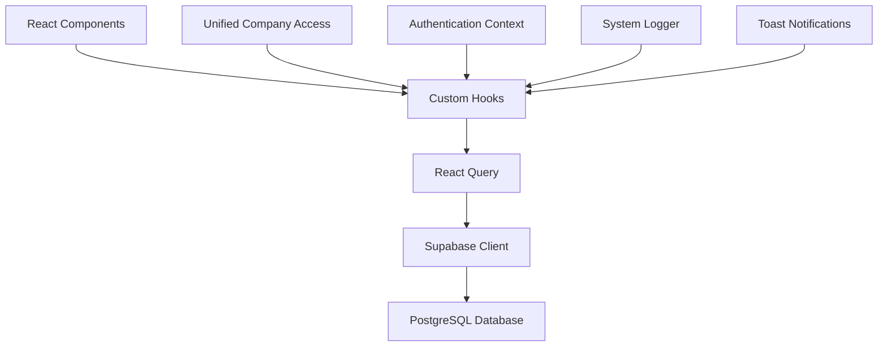

# Data Fetching Hooks

<cite>
**Referenced Files in This Document**   
- [useContracts.ts](file://src/hooks/useContracts.ts)
- [useCustomers.ts](file://src/hooks/useCustomers.ts)
- [useVehicles.ts](file://src/hooks/useVehicles.ts)
- [useProperties.ts](file://src/modules/properties/hooks/useProperties.ts)
</cite>

## Table of Contents
1. [Introduction](#introduction)
2. [Core Data Fetching Architecture](#core-data-fetching-architecture)
3. [useContracts Hook](#usecontracts-hook)
4. [useCustomers Hook](#usecustomers-hook)
5. [useVehicles Hook](#usevehicles-hook)
6. [useProperties Hook](#useproperties-hook)
7. [Query Key Organization](#query-key-organization)
8. [Cache Invalidation and Data Freshness](#cache-invalidation-and-data-freshness)
9. [Error Handling and Loading States](#error-handling-and-loading-states)
10. [Performance Considerations](#performance-considerations)
11. [Common Issues and Solutions](#common-issues-and-solutions)

## Introduction
This document provides comprehensive documentation for the React Query-based custom hooks used in FleetifyApp for data fetching operations. The hooks are designed to retrieve and cache domain-specific data efficiently across different modules including contracts, customers, vehicles, and properties. Each hook follows a consistent pattern of implementation while addressing specific business requirements such as filtering, sorting, and advanced search capabilities. The documentation covers implementation details, usage patterns, performance optimizations, and solutions to common issues encountered in data fetching operations.

## Core Data Fetching Architecture
FleetifyApp implements a robust data fetching architecture using React Query as the primary state management solution for server state. The architecture follows a modular approach where each domain has dedicated custom hooks that encapsulate data fetching logic, error handling, and cache management. The hooks leverage Supabase as the backend service for data persistence and retrieval. A unified company access system ensures proper data isolation between different companies within the multi-tenant architecture. The implementation emphasizes performance optimization through strategic caching, selective refetching, and efficient query construction.

**Diagram sources**
- [useContracts.ts](file://src/hooks/useContracts.ts)
- [useCustomers.ts](file://src/hooks/useCustomers.ts)
- [useVehicles.ts](file://src/hooks/useVehicles.ts)
- [useProperties.ts](file://src/modules/properties/hooks/useProperties.ts)

**Section sources**
- [useContracts.ts](file://src/hooks/useContracts.ts)
- [useCustomers.ts](file://src/hooks/useCustomers.ts)
- [useVehicles.ts](file://src/hooks/useVehicles.ts)
- [useProperties.ts](file://src/modules/properties/hooks/useProperties.ts)

## useContracts Hook
The useContracts hook provides functionality for retrieving contract data with support for filtering by customer and vehicle. It implements a flexible query system that allows for targeted data retrieval based on specific criteria. The hook includes specialized variants like useActiveContracts for retrieving only active contracts with appropriate filtering logic. The implementation includes comprehensive error handling with detailed logging and user feedback mechanisms. The hook integrates with the unified company access system to ensure data isolation and proper permission validation.

**Section sources**
- [useContracts.ts](file://src/hooks/useContracts.ts#L1-L129)

## useCustomers Hook
The useCustomers hook implements advanced customer search capabilities with comprehensive filtering options. It supports searching across multiple fields including name, phone, email, and national ID with case-insensitive matching. The hook provides filtering by customer type, blacklist status, and active/inactive status. It integrates with the unified company access system to handle multi-tenant data isolation, supporting both regular users and super administrators with appropriate access controls. The hook includes mutation functions for creating, updating, and managing customer blacklist status with optimistic updates and cache invalidation.

**Section sources**
- [useCustomers.ts](file://src/hooks/useCustomers.ts#L1-L676)

## useVehicles Hook
The useVehicles hook provides comprehensive fleet data retrieval with status filtering capabilities. It supports retrieving all vehicles, available vehicles, and vehicles with specific statuses. The hook includes specialized functions for vehicle pricing, insurance, and maintenance data retrieval. The implementation includes robust validation and error handling with specific error messages for common issues like duplicate plate numbers or missing required fields. The hook integrates with the company access system to ensure users can only access vehicles belonging to their company.

**Section sources**
- [useVehicles.ts](file://src/hooks/useVehicles.ts#L1-L1226)

## useProperties Hook
The useProperties hook enables real estate portfolio management with advanced filtering and map integration capabilities. It supports comprehensive property search with filters for property type, status, price range, area, number of rooms, and ownership status. The hook includes specialized functions for retrieving property statistics and analytics. The implementation supports both Arabic and English property names and addresses, with appropriate filtering logic. The hook integrates property data with owner information through relational queries, providing a complete view of property ownership.

**Section sources**
- [useProperties.ts](file://src/modules/properties/hooks/useProperties.ts#L1-L157)

## Query Key Organization
The application follows a consistent pattern for query key organization to ensure predictable caching behavior and efficient cache invalidation. Query keys are structured as arrays with the primary entity type as the first element, followed by relevant parameters and filters. The useUnifiedCompanyAccess hook provides a standardized method for generating query keys that include company context, ensuring proper data isolation. This approach prevents cache collisions between different companies and enables targeted cache invalidation when data changes.

**Section sources**
- [useContracts.ts](file://src/hooks/useContracts.ts#L35-L37)
- [useCustomers.ts](file://src/hooks/useCustomers.ts#L23-L24)
- [useVehicles.ts](file://src/hooks/useVehicles.ts#L122-L123)
- [useProperties.ts](file://src/modules/properties/hooks/useProperties.ts#L10-L11)

## Cache Invalidation and Data Freshness
The application implements a comprehensive cache management strategy to balance data freshness with performance. Each hook specifies appropriate staleTime and gcTime values based on the volatility of the data. Frequently changing data has shorter stale times, while relatively static data has longer caching periods. Mutation operations implement optimistic updates to provide immediate user feedback, followed by cache invalidation to ensure data consistency. The queryClient is used to invalidate related queries after mutations, ensuring that dependent data is refreshed appropriately.

**Section sources**
- [useContracts.ts](file://src/hooks/useContracts.ts#L117-L118)
- [useCustomers.ts](file://src/hooks/useCustomers.ts#L107-L108)
- [useVehicles.ts](file://src/hooks/useVehicles.ts#L124-L125)
- [useCustomers.ts](file://src/hooks/useCustomers.ts#L188-L198)

## Error Handling and Loading States
The hooks implement comprehensive error handling with detailed logging and user-friendly error messages. All data fetching operations include try-catch blocks with appropriate error reporting to the console and user interface. The useSystemLogger hook is used to log significant operations for audit and debugging purposes. Loading states are managed automatically by React Query, with components able to check the isLoading, isError, and isSuccess states to provide appropriate user feedback. Toast notifications are used to communicate success and error messages to users in a non-intrusive manner.

**Section sources**
- [useContracts.ts](file://src/hooks/useContracts.ts#L78-L82)
- [useCustomers.ts](file://src/hooks/useCustomers.ts#L88-L92)
- [useVehicles.ts](file://src/hooks/useVehicles.ts#L138-L142)
- [useCustomers.ts](file://src/hooks/useCustomers.ts#L208-L218)

## Performance Considerations
The data fetching implementation includes several performance optimizations for handling large datasets. Pagination is implicitly supported through the limit parameter in the useCustomers hook, allowing for controlled data retrieval. The hooks apply filters at the database level rather than in memory, reducing the amount of data transferred over the network. Selective querying with only necessary fields minimizes payload size. The caching strategy reduces redundant network requests, with staleTime values tuned to balance freshness and performance. For large datasets, the application could be extended to include explicit pagination with cursor-based or offset-based approaches.

**Section sources**
- [useCustomers.ts](file://src/hooks/useCustomers.ts#L74-L76)
- [useVehicles.ts](file://src/hooks/useVehicles.ts#L130-L132)
- [useProperties.ts](file://src/modules/properties/hooks/useProperties.ts#L24-L26)

## Common Issues and Solutions
The implementation addresses several common issues in data fetching applications. Stale data is mitigated through appropriate staleTime settings and cache invalidation after mutations. Network race conditions are handled by React Query's built-in deduplication and request cancellation mechanisms. The unified company access system prevents data leakage between companies in the multi-tenant environment. Error boundaries and comprehensive error handling prevent application crashes due to failed requests. The optimistic update pattern provides a responsive user experience while ensuring data consistency through subsequent cache invalidation.

**Section sources**
- [useContracts.ts](file://src/hooks/useContracts.ts#L35-L37)
- [useCustomers.ts](file://src/hooks/useCustomers.ts#L188-L198)
- [useVehicles.ts](file://src/hooks/useVehicles.ts#L358-L378)
- [useCustomers.ts](file://src/hooks/useCustomers.ts#L23-L24)