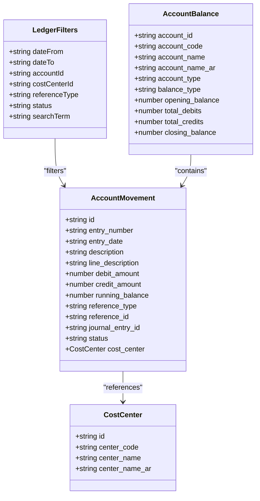
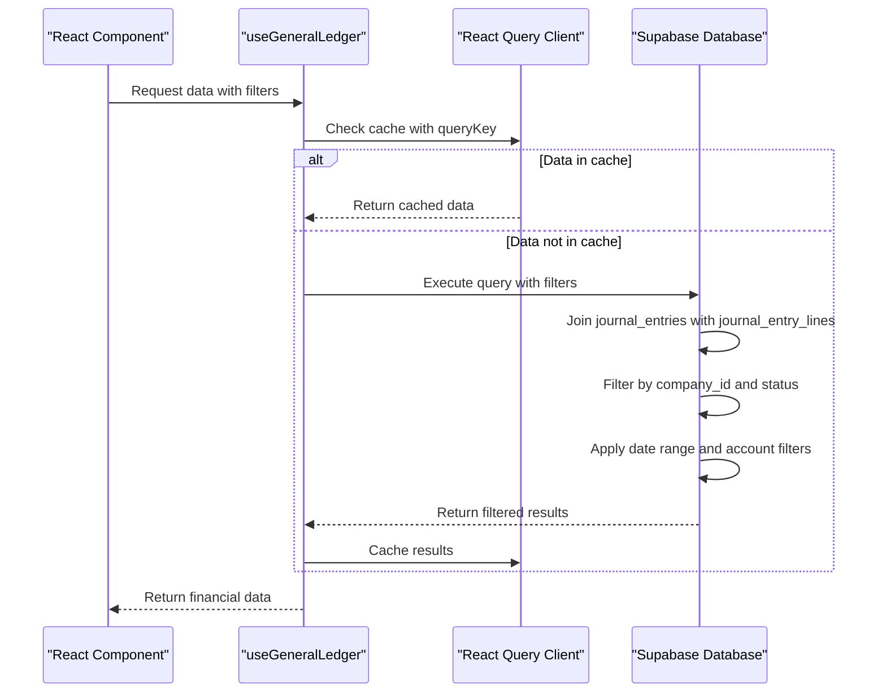
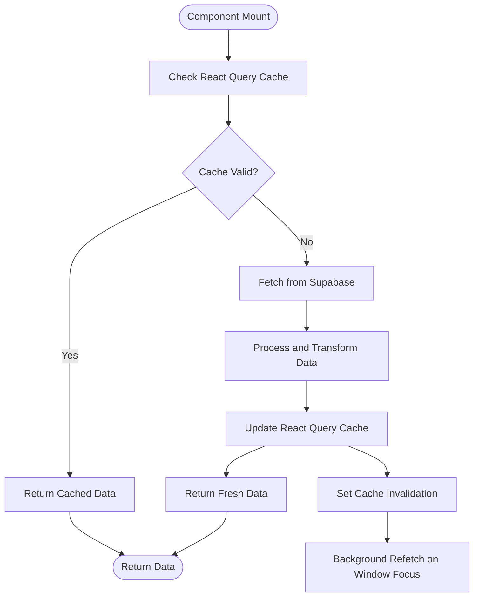
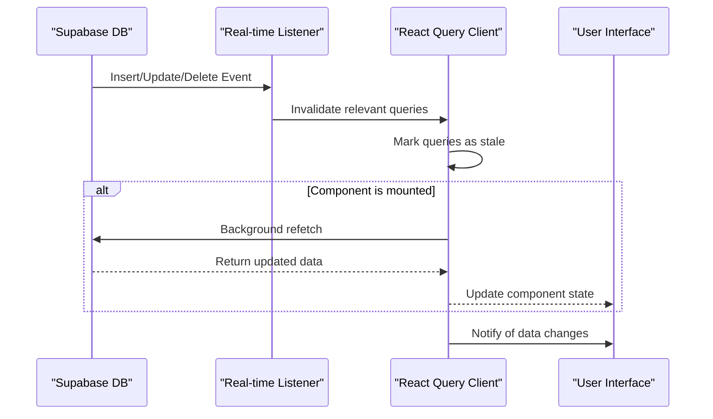
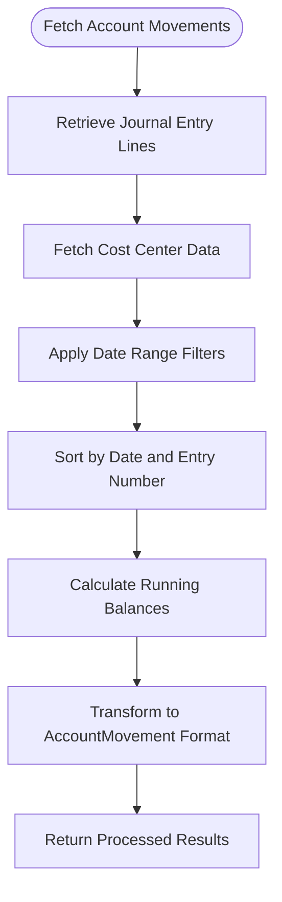
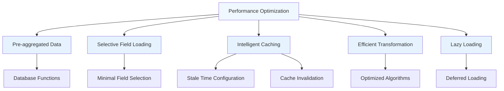

# Financial Data Hooks

<cite>
**Referenced Files in This Document**   
- [useGeneralLedger.ts](file://src/hooks/useGeneralLedger.ts)
- [useAccountStatement.ts](file://src/hooks/useAccountStatement.ts)
- [useEnhancedFinancialReports.ts](file://src/hooks/useEnhancedFinancialReports.ts)
- [useUnifiedCompanyAccess.ts](file://src/hooks/useUnifiedCompanyAccess.ts)
</cite>

## Table of Contents
1. [Introduction](#introduction)
2. [Core Financial Data Hooks](#core-financial-data-hooks)
3. [useGeneralLedger Implementation](#usegeneralledger-implementation)
4. [Query Structure and Data Filtering](#query-structure-and-data-filtering)
5. [React Query Integration and Caching Strategy](#react-query-integration-and-caching-strategy)
6. [Real-time Financial Data Updates](#real-time-financial-data-updates)
7. [Pagination and Aggregation for Large Data Volumes](#pagination-and-aggregation-for-large-data-volumes)
8. [Performance Considerations and Optimization Techniques](#performance-considerations-and-optimization-techniques)
9. [Conclusion](#conclusion)

## Introduction
This document provides comprehensive documentation for financial data fetching hooks in the Fleetify application, with a primary focus on the `useGeneralLedger` hook implementation. The system enables robust financial reporting capabilities with advanced filtering, real-time updates, and efficient data retrieval patterns. The hooks are designed to support complex accounting operations including general ledger queries, trial balance calculations, financial summaries, and detailed account statements with date range filtering and account-level breakdowns.

**Section sources**
- [useGeneralLedger.ts](file://src/hooks/useGeneralLedger.ts#L1-L825)
- [useEnhancedFinancialReports.ts](file://src/hooks/useEnhancedFinancialReports.ts#L1-L366)

## Core Financial Data Hooks
The financial data layer in Fleetify consists of several specialized hooks that provide different levels of financial data access and reporting capabilities. These hooks are built on top of React Query and Supabase integration, providing a consistent interface for financial data operations across the application.

The primary hooks include:
- `useGeneralLedger`: Comprehensive general ledger data retrieval with filtering capabilities
- `useAccountStatement`: Detailed account statement generation with running balances
- `useTrialBalance`: Trial balance calculation for accounting period verification
- `useFinancialSummary`: High-level financial summary data for dashboard displays
- `useEnhancedFinancialReports`: Advanced financial reporting with multi-dimensional analysis

These hooks follow a consistent pattern of using the `useUnifiedCompanyAccess` hook for company context and authentication, ensuring that all financial data queries are properly scoped to the current user's company and permissions.

**Section sources**
- [useGeneralLedger.ts](file://src/hooks/useGeneralLedger.ts#L1-L825)
- [useAccountStatement.ts](file://src/hooks/useAccountStatement.ts#L1-L263)

## useGeneralLedger Implementation
The `useGeneralLedger` hook provides comprehensive access to accounting data with robust filtering capabilities for date ranges, account levels, and transaction types. It serves as the primary interface for retrieving general ledger information across the application.

The hook exports several key interfaces that define the structure of financial data:
- `LedgerFilters`: Configuration object for filtering ledger entries by date range, account, cost center, reference type, status, and search terms
- `AccountBalance`: Structure for account balance information including opening and closing balances
- `AccountMovement`: Detailed transaction data with running balance calculations
- `TrialBalanceItem`: Trial balance entry with debit and credit amounts by account

The implementation leverages Supabase's real-time database capabilities to fetch journal entries and their associated lines, providing a complete view of financial transactions. The hook supports both detailed transaction views and aggregated financial reports, making it suitable for various financial reporting requirements.

**Diagram sources**
- [useGeneralLedger.ts](file://src/hooks/useGeneralLedger.ts#L1-L825)

**Section sources**
- [useGeneralLedger.ts](file://src/hooks/useGeneralLedger.ts#L1-L825)

## Query Structure and Data Filtering
The financial data hooks implement a sophisticated query structure that supports complex financial reporting requirements and multi-dimensional filtering. The system allows users to filter data across multiple dimensions including time periods, account hierarchies, cost centers, and transaction types.

The `LedgerFilters` interface enables comprehensive filtering of financial data:
- Date range filtering with `dateFrom` and `dateTo` parameters
- Account-specific filtering through `accountId`
- Cost center analysis with `costCenterId`
- Transaction type filtering via `referenceType`
- Status-based filtering for draft, posted, or reversed entries
- Text search across entry descriptions and numbers

The query implementation uses Supabase's powerful filtering capabilities to efficiently retrieve data from the database. For journal entries, the system queries the `journal_entries` table with appropriate joins to related tables such as `journal_entry_lines` and `chart_of_accounts`. The queries are optimized to include only necessary fields and relationships, reducing payload size and improving performance.

For trial balance calculations, the system leverages a database function `get_trial_balance` that performs server-side aggregation, ensuring accurate and efficient balance calculations across all accounts. This approach offloads complex calculations from the client to the database server, improving overall system performance.

**Diagram sources**
- [useGeneralLedger.ts](file://src/hooks/useGeneralLedger.ts#L1-L825)

**Section sources**
- [useGeneralLedger.ts](file://src/hooks/useGeneralLedger.ts#L1-L825)

## React Query Integration and Caching Strategy
The financial data hooks leverage React Query for efficient data fetching, caching, and state management. This integration provides several key benefits for financial reporting views, including automatic caching, background refetching, and optimized data synchronization.

The caching strategy is designed around query keys that incorporate relevant parameters to ensure proper cache invalidation and data consistency:
- Company ID is included in all query keys to scope data to the current company
- Filter parameters are included to create unique cache entries for different views
- Timestamp-based staleness configuration prevents excessive refetching

The `useGeneralLedger` hook implements a comprehensive caching strategy with the following characteristics:
- Query keys include company ID, filter parameters, and component context
- `staleTime` is configured to balance data freshness with performance
- Automatic cache invalidation occurs when related data changes
- Error handling with retry mechanisms for network resilience

Cache invalidation is particularly important for financial data, as changes to journal entries or account balances must be reflected across all related views. The system uses React Query's `invalidateQueries` method to clear relevant caches when mutations occur, such as posting or reversing journal entries.

**Diagram sources**
- [useGeneralLedger.ts](file://src/hooks/useGeneralLedger.ts#L1-L825)
- [useAccountStatement.ts](file://src/hooks/useAccountStatement.ts#L1-L263)

**Section sources**
- [useGeneralLedger.ts](file://src/hooks/useGeneralLedger.ts#L1-L825)
- [useAccountStatement.ts](file://src/hooks/useAccountStatement.ts#L1-L263)

## Real-time Financial Data Updates
The financial data system supports real-time updates through Supabase's real-time capabilities and React Query's cache management. When financial data changes occur, such as posting journal entries or updating account balances, the system ensures that all relevant views are updated immediately.

The real-time update mechanism works through the following process:
1. Database changes trigger Supabase real-time events
2. The application listens for relevant events (insert, update, delete)
3. When an event is received, the corresponding React Query caches are invalidated
4. Components automatically refetch updated data or receive the new data directly

For journal entry operations, the system implements mutation hooks (`usePostJournalEntry`, `useReverseJournalEntry`, `useDeleteJournalEntry`) that handle both the database operation and cache invalidation. After a successful mutation, these hooks invalidate all related queries to ensure data consistency across the application.

The `useAccountStatement` hook demonstrates sophisticated real-time capabilities by calculating running balances based on transaction order and date. When new transactions are added or existing ones modified, the entire running balance calculation is updated to reflect the changes accurately.

**Diagram sources**
- [useGeneralLedger.ts](file://src/hooks/useGeneralLedger.ts#L1-L825)
- [useAccountStatement.ts](file://src/hooks/useAccountStatement.ts#L1-L263)

**Section sources**
- [useGeneralLedger.ts](file://src/hooks/useGeneralLedger.ts#L1-L825)
- [useAccountStatement.ts](file://src/hooks/useAccountStatement.ts#L1-L263)

## Pagination and Aggregation for Large Data Volumes
The financial data hooks are designed to handle large volumes of financial transactions efficiently through strategic pagination and aggregation techniques. For general ledger data, the system implements server-side filtering and sorting to minimize data transfer, while client-side processing handles running balance calculations and data transformation.

The `useAccountMovements` hook demonstrates an effective approach to handling detailed transaction data:
- Initial query retrieves journal entry lines for the specified account
- Cost center data is fetched separately to avoid complex joins
- Client-side filtering applies date range constraints
- Transactions are sorted by date and entry number
- Running balances are calculated sequentially

For high-level reporting views, the system employs pre-aggregated data retrieval through database functions like `get_trial_balance`. This approach significantly reduces the amount of data transferred and processed on the client side, improving performance for large datasets.

The account statement functionality supports both detailed and summary views, allowing users to choose the appropriate level of granularity. The summary view groups transactions by operation type (invoices, payments, discounts), providing a consolidated view of financial activity while still maintaining accurate running balances.

**Diagram sources**
- [useGeneralLedger.ts](file://src/hooks/useGeneralLedger.ts#L1-L825)
- [useAccountStatement.ts](file://src/hooks/useAccountStatement.ts#L1-L263)

**Section sources**
- [useGeneralLedger.ts](file://src/hooks/useGeneralLedger.ts#L1-L825)
- [useAccountStatement.ts](file://src/hooks/useAccountStatement.ts#L1-L263)

## Performance Considerations and Optimization Techniques
The financial data hooks implement several optimization techniques to ensure responsive performance even with large datasets and complex reporting requirements. These optimizations balance data freshness, network efficiency, and user experience.

Key performance optimizations include:
- **Pre-aggregated data retrieval**: Using database functions like `get_trial_balance` to perform server-side aggregation
- **Selective field loading**: Querying only necessary fields to reduce payload size
- **Intelligent caching**: Configuring appropriate stale times and cache invalidation strategies
- **Efficient data transformation**: Minimizing client-side processing through optimized algorithms
- **Lazy loading**: Deferring non-essential data loading until needed

The system also implements error handling and fallback mechanisms to maintain usability during network issues or database errors. For example, the `useFinancialSummary` hook includes a fallback calculation method that uses current balances from the chart of accounts when journal entry queries fail, ensuring that users still receive financial data even in degraded conditions.

Network efficiency is further improved through React Query's built-in features like request deduplication, which prevents multiple identical requests from being sent simultaneously. The system also leverages Supabase's efficient query execution and indexing to minimize database load.

**Diagram sources**
- [useGeneralLedger.ts](file://src/hooks/useGeneralLedger.ts#L1-L825)
- [useEnhancedFinancialReports.ts](file://src/hooks/useEnhancedFinancialReports.ts#L1-L366)

**Section sources**
- [useGeneralLedger.ts](file://src/hooks/useGeneralLedger.ts#L1-L825)
- [useEnhancedFinancialReports.ts](file://src/hooks/useEnhancedFinancialReports.ts#L1-L366)

## Conclusion
The financial data hooks in Fleetify provide a robust foundation for financial reporting and accounting operations. The `useGeneralLedger` hook, in particular, offers comprehensive capabilities for retrieving and analyzing accounting data with sophisticated filtering, real-time updates, and performance optimizations.

By leveraging React Query for state management and caching, Supabase for database operations, and well-structured TypeScript interfaces, the system delivers a reliable and efficient solution for financial data access. The modular design allows for easy extension and maintenance, while the focus on performance ensures a responsive user experience even with large datasets.

Future enhancements could include additional reporting views, more advanced filtering options, and improved real-time collaboration features. The current architecture provides a solid foundation for these extensions while maintaining data integrity and system performance.