# Properties Data Hooks

<cite>
**Referenced Files in This Document**   
- [useProperties.ts](file://src/modules/properties/hooks/useProperties.ts)
- [types/index.ts](file://src/modules/properties/types/index.ts)
- [PropertiesMap.tsx](file://src/pages/PropertiesMap.tsx)
- [PropertyFilters.tsx](file://src/modules/properties/components/PropertyFilters.tsx)
</cite>

## Table of Contents
1. [Introduction](#introduction)
2. [Core Implementation](#core-implementation)
3. [Query Structure and Filtering](#query-structure-and-filtering)
4. [Integration with React Query](#integration-with-react-query)
5. [Map Integration and Location-Based Filtering](#map-integration-and-location-based-filtering)
6. [Data Synchronization and Conflict Resolution](#data-synchronization-and-conflict-resolution)
7. [Leasing and Maintenance Data Handling](#leasing-and-maintenance-data-handling)
8. [Performance Optimization](#performance-optimization)
9. [Data Transformation Patterns](#data-transformation-patterns)

## Introduction
The `useProperties` hook provides a comprehensive solution for fetching and managing real estate portfolio data within the Fleetify application. This documentation details the implementation of property data retrieval with advanced filtering capabilities, map integration, and efficient data handling patterns. The system supports complex queries for property type, status, and financial performance, while leveraging React Query for optimal data caching across various property views and dashboards.

## Core Implementation
The `useProperties` hook serves as the primary interface for retrieving property data from the Supabase backend. It implements a robust query system that supports multiple filtering parameters and returns structured property data with related owner information.

**Diagram sources**
- [useProperties.ts](file://src/modules/properties/hooks/useProperties.ts#L1-L39)

**Section sources**
- [useProperties.ts](file://src/modules/properties/hooks/useProperties.ts#L1-L156)

## Query Structure and Filtering
The hook supports a comprehensive filtering system through the `PropertySearchFilters` interface, enabling precise data retrieval based on multiple criteria including property type, status, location, and financial parameters.

**Diagram sources**
- [types/index.ts](file://src/modules/properties/types/index.ts#L1-L356)

The filtering system implements the following query patterns:
- **Text search**: Uses `ilike` operator with wildcards across property name, Arabic name, and property code
- **Type filtering**: Supports both single values and arrays via `eq` and `in` operators
- **Status filtering**: Implements array support for multiple status values
- **Price ranges**: Applies `gte` and `lte` conditions for minimum and maximum rent
- **Area ranges**: Uses `gte` and `lte` for minimum and maximum area in square meters
- **Boolean filters**: Handles furnished status and parking availability

**Section sources**
- [useProperties.ts](file://src/modules/properties/hooks/useProperties.ts#L10-L85)

## Integration with React Query
The implementation leverages React Query for efficient data caching, automatic refetching, and state management across the application's property views and dashboards.

**Diagram sources**
- [useProperties.ts](file://src/modules/properties/hooks/useProperties.ts#L3-L156)

The React Query integration provides several key benefits:
- **Automatic caching**: Data is cached based on the query key, which includes the filter parameters
- **Deduplication**: Multiple components requesting the same data with identical filters share the same query
- **Background refetching**: Stale data is automatically refreshed in the background
- **Error handling**: Built-in error states and retry mechanisms
- **Loading states**: Automatic management of loading and success states

**Section sources**
- [useProperties.ts](file://src/modules/properties/hooks/useProperties.ts#L3-L156)

## Map Integration and Location-Based Filtering
The system integrates with Leaflet for interactive map visualization of properties, enabling location-based filtering and spatial data representation.

```mermaid
flowchart TD
A["PropertiesMap Component"] --> B["useProperties Hook"]
B --> C["Property Data with Coordinates"]
C --> D["Map Data Transformation"]
D --> E["Filtered Properties"]
E --> F["Leaflet Map Rendering"]
F --> G["Custom Markers"]
G --> H["Status-Based Colors"]
H --> I["Selected Property Highlighting"]
F --> J["Popup Information"]
J --> K["Property Details"]
J --> L["Rental Information"]
A --> M["Filter Controls"]
M --> N["Type Filter"]
M --> O["Status Filter"]
M --> P["Text Search"]
N --> B
O --> B
P --> B
```

**Diagram sources**
- [PropertiesMap.tsx](file://src/pages/PropertiesMap.tsx#L0-L480)

The map integration features:
- **Dynamic marker rendering**: Properties are displayed as custom markers with status-based colors
- **Interactive filtering**: Users can filter properties by type, status, and text search
- **Property selection**: Clicking on markers or list items highlights the selected property
- **Popup information**: Detailed property information is displayed in interactive popups
- **Legend display**: Visual legend explains marker colors and property statuses

**Section sources**
- [PropertiesMap.tsx](file://src/pages/PropertiesMap.tsx#L25-L63)

## Data Synchronization and Conflict Resolution
The system implements robust data synchronization patterns to ensure consistency between the frontend and backend, with appropriate conflict resolution strategies.

While the current implementation focuses on data retrieval, the architecture supports future synchronization features through:
- **Query key invalidation**: Strategic cache invalidation patterns for data consistency
- **Error boundaries**: Comprehensive error handling for failed requests
- **Retry mechanisms**: Automatic retry of failed queries
- **Data validation**: Type safety through TypeScript interfaces

**Section sources**
- [useProperties.ts](file://src/modules/properties/hooks/useProperties.ts#L100-L120)

## Leasing and Maintenance Data Handling
The property data system supports leasing operations and maintenance tracking through integrated data structures and related entities.

**Diagram sources**
- [types/index.ts](file://src/modules/properties/types/index.ts#L1-L356)

The system supports leasing operations through:
- **Contract integration**: Properties are linked to lease contracts with tenants
- **Payment tracking**: Rental payments are associated with specific properties
- **Maintenance workflows**: Properties can have multiple maintenance records
- **Owner management**: Properties are assigned to specific owners

**Section sources**
- [types/index.ts](file://src/modules/properties/types/index.ts#L1-L356)

## Performance Optimization
The implementation includes several performance optimization techniques to handle large property portfolios efficiently.

**Diagram sources**
- [useProperties.ts](file://src/modules/properties/hooks/useProperties.ts#L1-L156)

Key performance optimizations include:
- **Efficient queries**: Selective field retrieval and proper indexing
- **Caching**: React Query's intelligent caching with filter-based keys
- **Client-side filtering**: Initial server filtering followed by client-side refinement
- **Memoization**: Cached computations for derived data
- **Connection pooling**: Supabase connection management

**Section sources**
- [useProperties.ts](file://src/modules/properties/hooks/useProperties.ts#L10-L85)

## Data Transformation Patterns
The system implements consistent data transformation patterns from backend APIs to UI components, ensuring type safety and predictable data structures.

**Diagram sources**
- [PropertiesMap.tsx](file://src/pages/PropertiesMap.tsx#L25-L63)

The data transformation pipeline includes:
- **Type safety**: Comprehensive TypeScript interfaces for all property data
- **Null handling**: Graceful handling of optional fields
- **Currency formatting**: Integration with currency formatter hook
- **Status mapping**: Translation of status codes to display labels
- **Search optimization**: Text search across multiple property fields
- **Relationship loading**: Eager loading of related owner data

**Section sources**
- [PropertiesMap.tsx](file://src/pages/PropertiesMap.tsx#L25-L63)