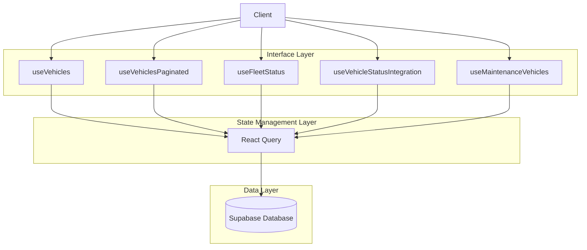
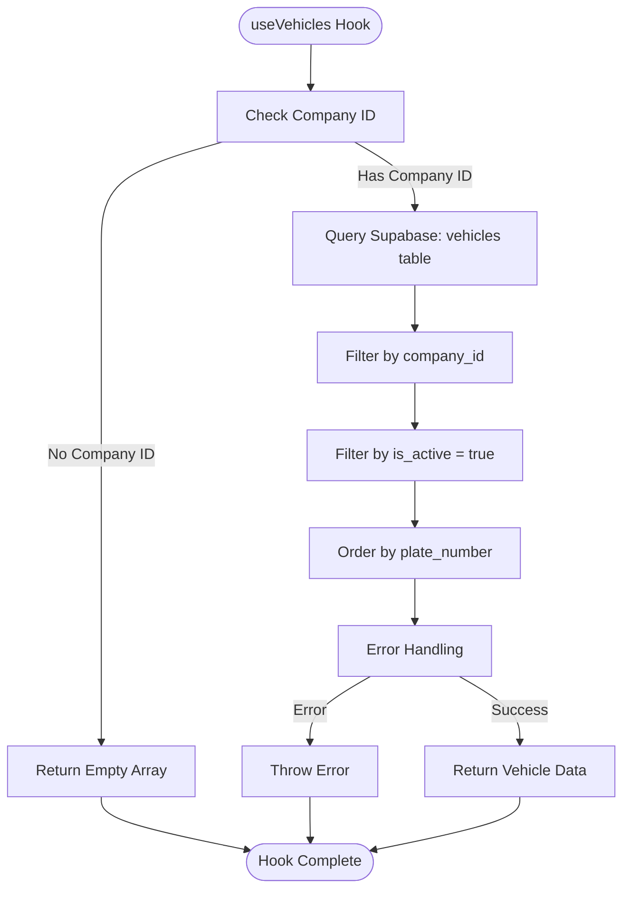
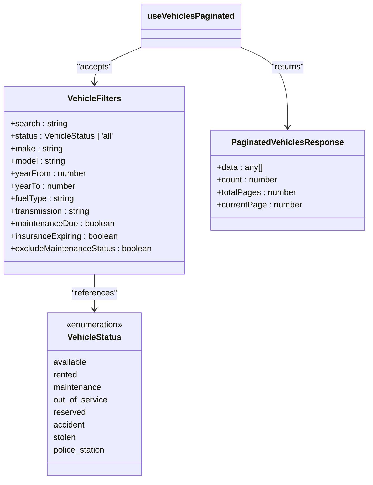
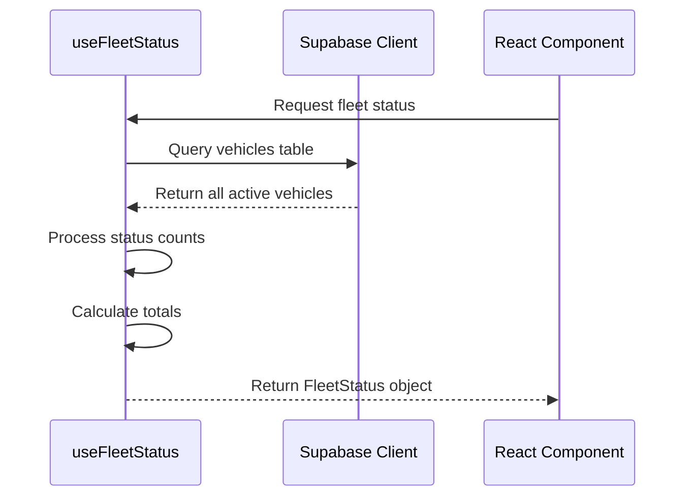
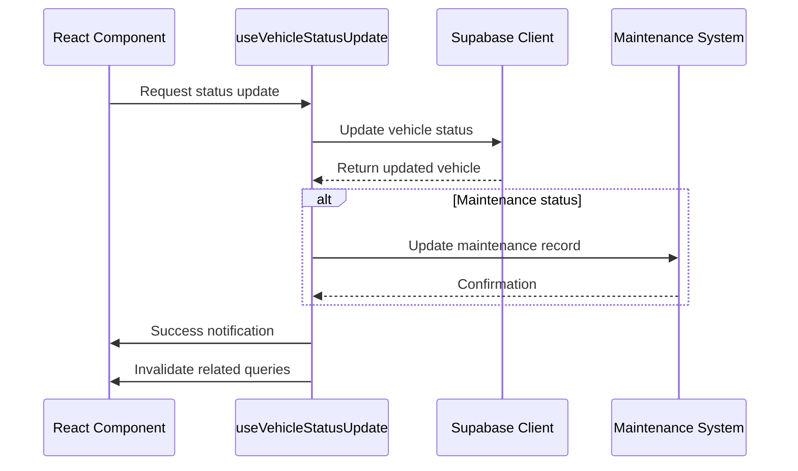
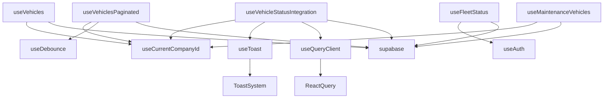

# Vehicles Data Hooks

<cite>
**Referenced Files in This Document**   
- [useVehicles.ts](file://src/hooks/useVehicles.ts)
- [useVehiclesPaginated.ts](file://src/hooks/useVehiclesPaginated.ts)
- [useFleetStatus.ts](file://src/hooks/useFleetStatus.ts)
- [useVehicleStatusIntegration.ts](file://src/hooks/useVehicleStatusIntegration.ts)
- [useMaintenanceVehicles.ts](file://src/hooks/useMaintenanceVehicles.ts)
</cite>

## Table of Contents
1. [Introduction](#introduction)
2. [Core Components](#core-components)
3. [Architecture Overview](#architecture-overview)
4. [Detailed Component Analysis](#detailed-component-analysis)
5. [Dependency Analysis](#dependency-analysis)
6. [Performance Considerations](#performance-considerations)
7. [Troubleshooting Guide](#troubleshooting-guide)
8. [Conclusion](#conclusion)

## Introduction
This document provides a comprehensive analysis of the vehicle data fetching hooks in the Fleetify application. It details the implementation of data retrieval mechanisms for fleet management, focusing on status filtering, location-based queries, integration with React Query for caching, real-time status updates, and performance optimization strategies for handling large vehicle datasets.

## Core Components

The vehicle data hooks ecosystem consists of several specialized React hooks that provide different levels of functionality for accessing and manipulating vehicle data. The primary components include `useVehicles` for basic fleet retrieval, `useVehiclesPaginated` for filtered and paginated access, `useFleetStatus` for fleet analytics, and various status integration hooks for managing vehicle state transitions.

**Section sources**
- [useVehicles.ts](file://src/hooks/useVehicles.ts)
- [useVehiclesPaginated.ts](file://src/hooks/useVehiclesPaginated.ts)
- [useFleetStatus.ts](file://src/hooks/useFleetStatus.ts)
- [useVehicleStatusIntegration.ts](file://src/hooks/useVehicleStatusIntegration.ts)
- [useMaintenanceVehicles.ts](file://src/hooks/useMaintenanceVehicles.ts)

## Architecture Overview

The vehicle data hooks architecture follows a layered approach with clear separation of concerns. At the foundation is Supabase as the data source, with React Query providing the caching and state management layer. The hooks themselves serve as the interface layer, abstracting complex data operations into simple, reusable functions.

**Diagram sources**
- [useVehicles.ts](file://src/hooks/useVehicles.ts)
- [useVehiclesPaginated.ts](file://src/hooks/useVehiclesPaginated.ts)
- [useFleetStatus.ts](file://src/hooks/useFleetStatus.ts)
- [useVehicleStatusIntegration.ts](file://src/hooks/useVehicleStatusIntegration.ts)
- [useMaintenanceVehicles.ts](file://src/hooks/useMaintenanceVehicles.ts)

## Detailed Component Analysis

### useVehicles Hook Analysis

The `useVehicles` hook provides the fundamental functionality for retrieving all active vehicles for a company. It leverages React Query's caching mechanism to optimize performance and reduce redundant API calls.

#### Core Implementation

**Diagram sources**
- [useVehicles.ts](file://src/hooks/useVehicles.ts#L100-L125)

**Section sources**
- [useVehicles.ts](file://src/hooks/useVehicles.ts#L100-L125)

### useVehiclesPaginated Hook Analysis

The `useVehiclesPaginated` hook extends the basic vehicle retrieval functionality with advanced filtering, pagination, and search capabilities. It supports comprehensive filtering options for fleet management operations.

#### Query Parameter Structure

**Diagram sources**
- [useVehiclesPaginated.ts](file://src/hooks/useVehiclesPaginated.ts#L5-L50)

**Section sources**
- [useVehiclesPaginated.ts](file://src/hooks/useVehiclesPaginated.ts#L5-L50)

### useFleetStatus Hook Analysis

The `useFleetStatus` hook provides aggregated analytics data about the current state of the fleet, categorizing vehicles by their operational status.

#### Data Processing Flow

**Diagram sources**
- [useFleetStatus.ts](file://src/hooks/useFleetStatus.ts#L10-L60)

**Section sources**
- [useFleetStatus.ts](file://src/hooks/useFleetStatus.ts#L10-L60)

### useVehicleStatusIntegration Hook Analysis

The `useVehicleStatusIntegration` hook manages vehicle status transitions with proper integration between fleet operations and maintenance workflows.

#### Status Update Sequence

**Diagram sources**
- [useVehicleStatusIntegration.ts](file://src/hooks/useVehicleStatusIntegration.ts#L10-L100)

**Section sources**
- [useVehicleStatusIntegration.ts](file://src/hooks/useVehicleStatusIntegration.ts#L10-L100)

## Dependency Analysis

The vehicle data hooks have a well-defined dependency structure that ensures proper data flow and state consistency across the application.

**Diagram sources**
- [useVehicles.ts](file://src/hooks/useVehicles.ts)
- [useVehiclesPaginated.ts](file://src/hooks/useVehiclesPaginated.ts)
- [useFleetStatus.ts](file://src/hooks/useFleetStatus.ts)
- [useVehicleStatusIntegration.ts](file://src/hooks/useVehicleStatusIntegration.ts)
- [useMaintenanceVehicles.ts](file://src/hooks/useMaintenanceVehicles.ts)

**Section sources**
- [useVehicles.ts](file://src/hooks/useVehicles.ts)
- [useVehiclesPaginated.ts](file://src/hooks/useVehiclesPaginated.ts)
- [useFleetStatus.ts](file://src/hooks/useFleetStatus.ts)
- [useVehicleStatusIntegration.ts](file://src/hooks/useVehicleStatusIntegration.ts)
- [useMaintenanceVehicles.ts](file://src/hooks/useMaintenanceVehicles.ts)

## Performance Considerations

The vehicle data hooks implement several performance optimization techniques to handle large fleets efficiently.

### Caching Strategy
The hooks leverage React Query's caching mechanism with appropriate stale times based on data volatility:
- **useVehicles**: Default caching behavior
- **useVehiclesPaginated**: 2-minute stale time for paginated data
- **useFleetStatus**: 5-minute stale time for analytics data
- **useMaintenanceVehicles**: 30-second stale time for real-time maintenance tracking

### Selective Field Retrieval
The hooks optimize database queries by retrieving only necessary fields:
- **useMaintenanceVehicles**: Selects only essential fields for maintenance view
- **useVehicleMakes/Models**: Retrieves only make/model data for filter dropdowns
- **useFleetStatus**: Only queries status field for aggregation

### Delta Updates
The system implements delta updates through React Query's invalidation mechanism:
- Status changes trigger targeted query invalidation
- Related data views are automatically refreshed
- Batch operations minimize redundant network requests

**Section sources**
- [useVehiclesPaginated.ts](file://src/hooks/useVehiclesPaginated.ts#L70-L100)
- [useFleetStatus.ts](file://src/hooks/useFleetStatus.ts#L30-L40)
- [useMaintenanceVehicles.ts](file://src/hooks/useMaintenanceVehicles.ts#L30-L40)

## Troubleshooting Guide

### Common Issues and Solutions

| Issue | Possible Cause | Solution |
|------|---------------|----------|
| Vehicles not loading | Missing company ID | Ensure user has valid company association |
| Filter not working | Search term too short | Wait for debounce completion (300ms) |
| Status not updating | Cache stale | Check query invalidation logic |
| Pagination incorrect | Count mismatch | Verify Supabase exact count parameter |

### Error Handling Patterns
The hooks implement comprehensive error handling:
- Input validation with descriptive error messages
- Database error code mapping to user-friendly messages
- Toast notifications for user feedback
- Console logging for debugging purposes

**Section sources**
- [useVehicles.ts](file://src/hooks/useVehicles.ts#L150-L250)
- [useVehicleStatusIntegration.ts](file://src/hooks/useVehicleStatusIntegration.ts#L100-L150)

## Conclusion

The vehicle data hooks in the Fleetify application provide a robust, scalable solution for fleet data management. By leveraging React Query for caching and state management, the system efficiently handles vehicle data retrieval, filtering, and status updates. The modular hook design allows for specialized functionality while maintaining code reusability and testability. Performance optimizations such as selective field retrieval, appropriate caching strategies, and efficient query invalidation ensure the system can handle large fleets effectively. The integration between fleet operations and maintenance workflows demonstrates a thoughtful approach to real-world business requirements.