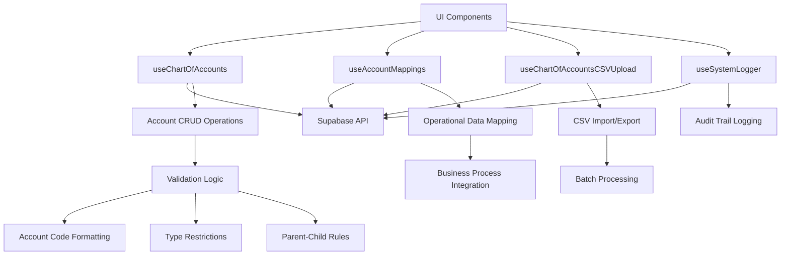
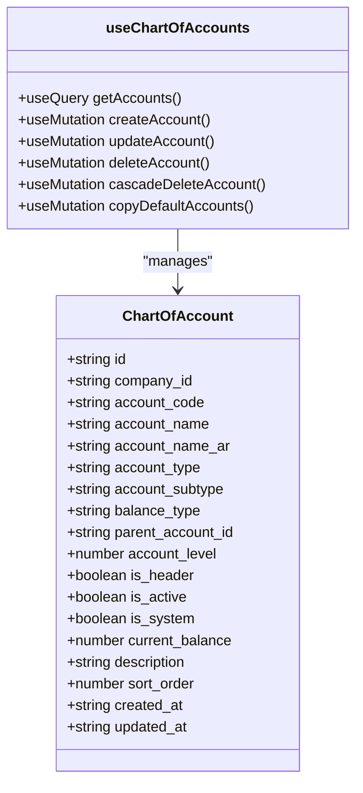
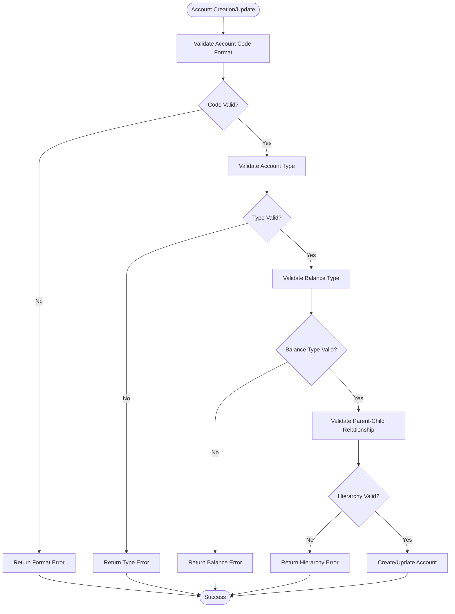
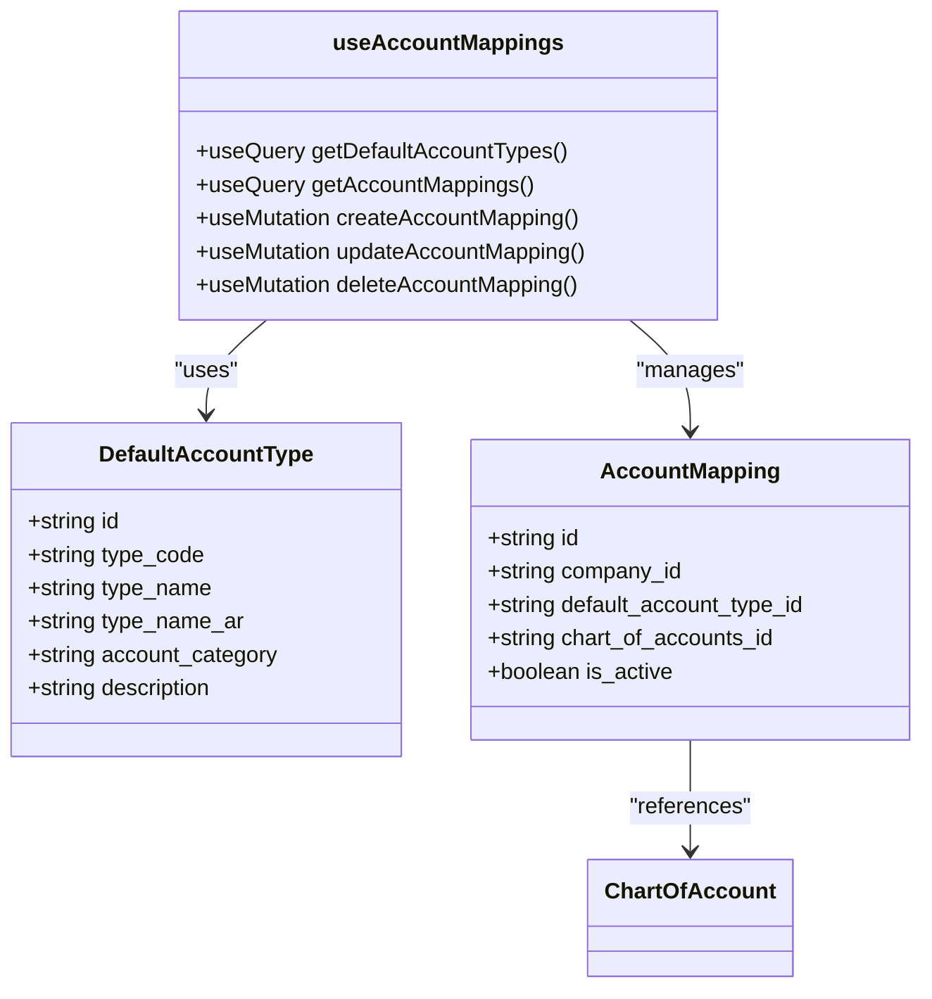
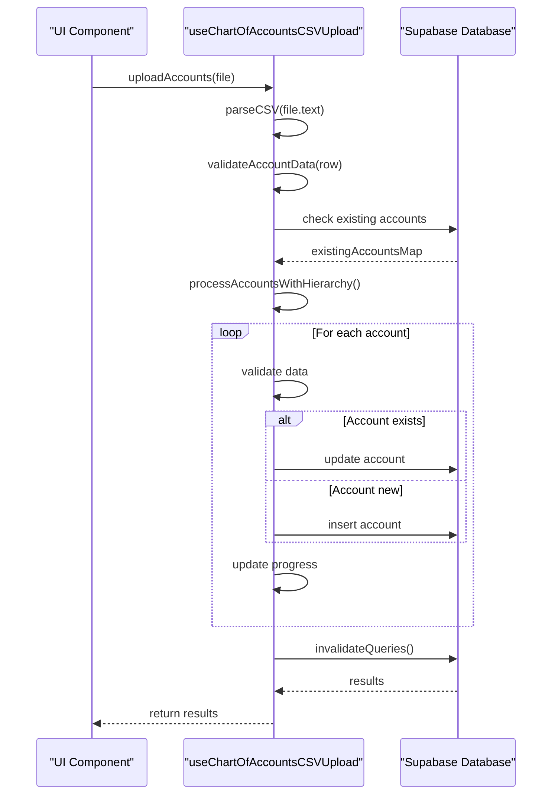
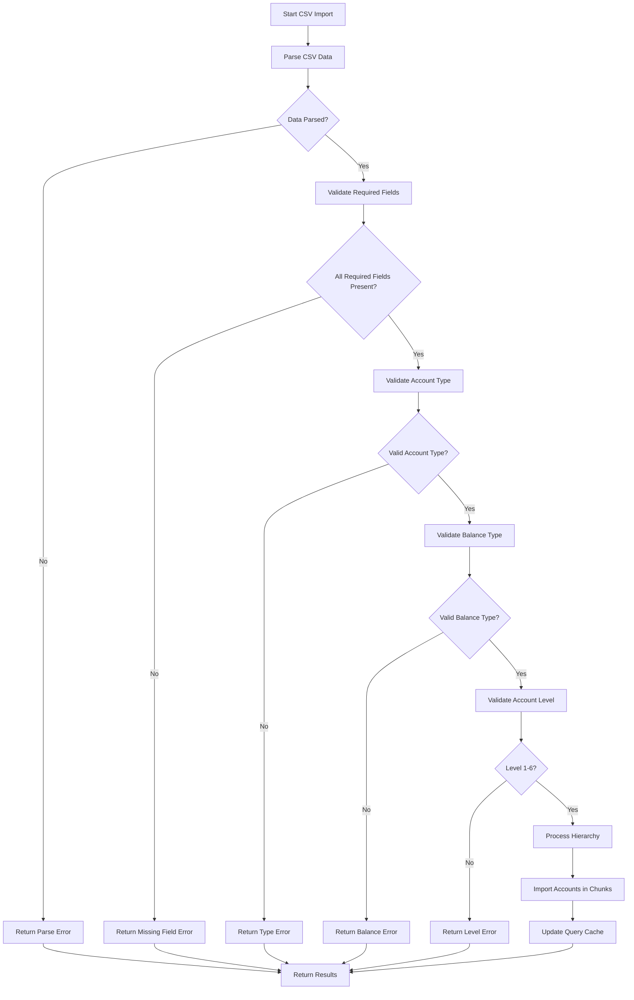
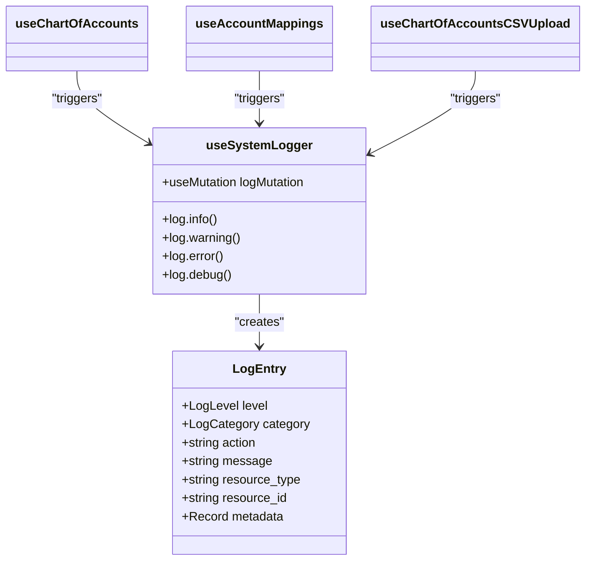
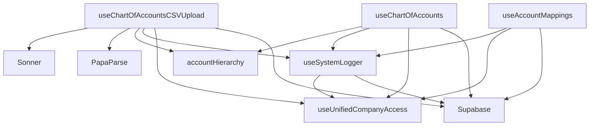

# Chart of Accounts Hooks

<cite>
**Referenced Files in This Document**   
- [useChartOfAccounts.ts](file://src/hooks/useChartOfAccounts.ts)
- [useAccountMappings.ts](file://src/hooks/useAccountMappings.ts)
- [useChartOfAccountsCSVUpload.ts](file://src/hooks/useChartOfAccountsCSVUpload.ts)
- [useSystemLogger.ts](file://src/hooks/useSystemLogger.ts)
- [accountHierarchy.ts](file://src/utils/accountHierarchy.ts)
</cite>

## Table of Contents
1. [Introduction](#introduction)
2. [Core Components](#core-components)
3. [Architecture Overview](#architecture-overview)
4. [Detailed Component Analysis](#detailed-component-analysis)
5. [Dependency Analysis](#dependency-analysis)
6. [Performance Considerations](#performance-considerations)
7. [Troubleshooting Guide](#troubleshooting-guide)
8. [Conclusion](#conclusion)

## Introduction
This document provides comprehensive documentation for the chart of accounts management system in the Fleetify application. The system enables financial account management with hierarchical tree structure support, validation rules, and integration with operational data mapping. It covers CRUD operations, account validation, batch import functionality, and audit logging mechanisms.

## Core Components

The chart of accounts system consists of several key hooks that manage different aspects of financial account management. These include account creation and modification, account mappings to operational data, CSV-based bulk import functionality, and system logging for audit trails.

**Section sources**
- [useChartOfAccounts.ts](file://src/hooks/useChartOfAccounts.ts#L1-L422)
- [useAccountMappings.ts](file://src/hooks/useAccountMappings.ts#L1-L190)
- [useChartOfAccountsCSVUpload.ts](file://src/hooks/useChartOfAccountsCSVUpload.ts#L1-L544)
- [useSystemLogger.ts](file://src/hooks/useSystemLogger.ts#L1-L100)

## Architecture Overview

The chart of accounts system follows a modular architecture with distinct responsibilities separated across different hooks. The system integrates with Supabase for data persistence and uses React Query for state management. It supports hierarchical account structures with parent-child relationships and provides comprehensive validation at multiple levels.

**Diagram sources**
- [useChartOfAccounts.ts](file://src/hooks/useChartOfAccounts.ts#L1-L422)
- [useAccountMappings.ts](file://src/hooks/useAccountMappings.ts#L1-L190)
- [useChartOfAccountsCSVUpload.ts](file://src/hooks/useChartOfAccountsCSVUpload.ts#L1-L544)
- [useSystemLogger.ts](file://src/hooks/useSystemLogger.ts#L1-L100)

## Detailed Component Analysis

### useChartOfAccounts Hook Analysis

The `useChartOfAccounts` hook provides comprehensive CRUD operations for managing financial accounts with hierarchical structure support. It implements validation logic for account creation, updates, and deletion while maintaining data integrity.

#### CRUD Operations Implementation

**Diagram sources**
- [useChartOfAccounts.ts](file://src/hooks/useChartOfAccounts.ts#L1-L422)

**Section sources**
- [useChartOfAccounts.ts](file://src/hooks/useChartOfAccounts.ts#L1-L422)

#### Account Validation Logic
The system implements comprehensive validation for account creation and modification:

- **Account Code Formatting**: Validates that account codes follow proper numeric formatting
- **Type Restrictions**: Enforces valid account types (assets, liabilities, equity, revenue, expenses)
- **Balance Type Validation**: Ensures balance type is either 'debit' or 'credit'
- **Parent-Child Relationship Rules**: Prevents circular references and maintains hierarchical integrity

**Diagram sources**
- [useChartOfAccounts.ts](file://src/hooks/useChartOfAccounts.ts#L1-L422)
- [accountHierarchy.ts](file://src/utils/accountHierarchy.ts#L1-L48)

**Section sources**
- [useChartOfAccounts.ts](file://src/hooks/useChartOfAccounts.ts#L1-L422)
- [accountHierarchy.ts](file://src/utils/accountHierarchy.ts#L1-L48)

### useAccountMappings Hook Analysis

The `useAccountMappings` hook enables integration between operational data and accounting codes, allowing business processes to be linked to specific financial accounts.

#### Integration with Operational Data

**Diagram sources**
- [useAccountMappings.ts](file://src/hooks/useAccountMappings.ts#L1-L190)

**Section sources**
- [useAccountMappings.ts](file://src/hooks/useAccountMappings.ts#L1-L190)

### useChartOfAccountsCSVUpload Hook Analysis

The `useChartOfAccountsCSVUpload` hook provides batch import functionality for chart of accounts data, supporting hierarchical structure preservation and comprehensive validation.

#### Batch Import Validation Process

**Diagram sources**
- [useChartOfAccountsCSVUpload.ts](file://src/hooks/useChartOfAccountsCSVUpload.ts#L1-L544)

**Section sources**
- [useChartOfAccountsCSVUpload.ts](file://src/hooks/useChartOfAccountsCSVUpload.ts#L1-L544)

#### CSV Validation Rules
The system enforces the following validation rules during CSV import:

- **Required Fields**: Account code, name, type, and balance type are mandatory
- **Account Type Validation**: Must be one of: assets, liabilities, equity, revenue, expenses
- **Balance Type Validation**: Must be either 'debit' or 'credit'
- **Level Validation**: Account level must be between 1 and 6
- **Header Flag Validation**: is_header must be boolean (true/false, 1/0, نعم/لا)

**Diagram sources**
- [useChartOfAccountsCSVUpload.ts](file://src/hooks/useChartOfAccountsCSVUpload.ts#L1-L544)

**Section sources**
- [useChartOfAccountsCSVUpload.ts](file://src/hooks/useChartOfAccountsCSVUpload.ts#L1-L544)

### useSystemLogger Hook Analysis

The `useSystemLogger` hook provides audit trail logging for all chart of accounts operations, ensuring complete traceability of changes.

#### Audit Trail Implementation

**Diagram sources**
- [useSystemLogger.ts](file://src/hooks/useSystemLogger.ts#L1-L100)

**Section sources**
- [useSystemLogger.ts](file://src/hooks/useSystemLogger.ts#L1-L100)

## Dependency Analysis

The chart of accounts system has well-defined dependencies between components, ensuring separation of concerns while maintaining integration where necessary.

**Diagram sources**
- [useChartOfAccounts.ts](file://src/hooks/useChartOfAccounts.ts#L1-L422)
- [useAccountMappings.ts](file://src/hooks/useAccountMappings.ts#L1-L190)
- [useChartOfAccountsCSVUpload.ts](file://src/hooks/useChartOfAccountsCSVUpload.ts#L1-L544)
- [useSystemLogger.ts](file://src/hooks/useSystemLogger.ts#L1-L100)
- [accountHierarchy.ts](file://src/utils/accountHierarchy.ts#L1-L48)

**Section sources**
- [useChartOfAccounts.ts](file://src/hooks/useChartOfAccounts.ts#L1-L422)
- [useAccountMappings.ts](file://src/hooks/useAccountMappings.ts#L1-L190)
- [useChartOfAccountsCSVUpload.ts](file://src/hooks/useChartOfAccountsCSVUpload.ts#L1-L544)
- [useSystemLogger.ts](file://src/hooks/useSystemLogger.ts#L1-L100)
- [accountHierarchy.ts](file://src/utils/accountHierarchy.ts#L1-L48)

## Performance Considerations

The system implements several performance optimizations to handle large datasets efficiently:

- **Chunked Processing**: CSV imports process data in chunks of 20 records to prevent UI freezing
- **Query Caching**: React Query is used to cache results and minimize database calls
- **Progressive Updates**: Progress indicators provide feedback during long-running operations
- **Debounced Operations**: Small delays between operations maintain UI responsiveness
- **Selective Invalidation**: Only relevant queries are invalidated after mutations

The system also implements retry logic with exponential backoff for failed operations, ensuring reliability in unstable network conditions.

## Troubleshooting Guide

### Conflict Detection When Moving Accounts
When moving accounts in the hierarchy, the system detects potential circular references using the `wouldCreateCircularReference` function from `accountHierarchy.ts`. This prevents users from creating invalid parent-child relationships that would break the tree structure.

**Section sources**
- [accountHierarchy.ts](file://src/utils/accountHierarchy.ts#L1-L48)

### Handling Protected System Accounts
System accounts (is_system: true) receive special handling during deletion operations. The system distinguishes between soft deletion (deactivation) and permanent deletion, with appropriate safeguards to prevent accidental removal of critical system accounts.

**Section sources**
- [useChartOfAccounts.ts](file://src/hooks/useChartOfAccounts.ts#L1-L422)

### Floating-Point Precision in Account Balances
While the documentation mentions decimal.js integration for floating-point precision, the current implementation uses standard JavaScript numbers for current_balance. This could potentially lead to precision issues in financial calculations. A future enhancement would be to integrate decimal.js or a similar library to ensure precise financial calculations.

### Custom Account Templates
The system supports account templates through the `copyDefaultAccounts` mutation, which copies a predefined set of accounts to a company. This provides a starting point for companies setting up their chart of accounts.

**Section sources**
- [useChartOfAccounts.ts](file://src/hooks/useChartOfAccounts.ts#L1-L422)

### Permissions-Based Access Control
Access to chart of accounts functionality is controlled through the `useUnifiedCompanyAccess` hook, which validates company access before allowing operations. This ensures users can only modify accounts within their authorized company scope.

**Section sources**
- [useChartOfAccounts.ts](file://src/hooks/useChartOfAccounts.ts#L1-L422)
- [useAccountMappings.ts](file://src/hooks/useAccountMappings.ts#L1-L190)
- [useChartOfAccountsCSVUpload.ts](file://src/hooks/useChartOfAccountsCSVUpload.ts#L1-L544)

## Conclusion

The chart of accounts management system provides a comprehensive solution for financial account management with hierarchical structure support. It offers robust CRUD operations, validation rules, batch import capabilities, and audit logging. The system is well-structured with clear separation of concerns and integrates effectively with the broader application ecosystem. Future enhancements could include improved floating-point precision handling and expanded template functionality.