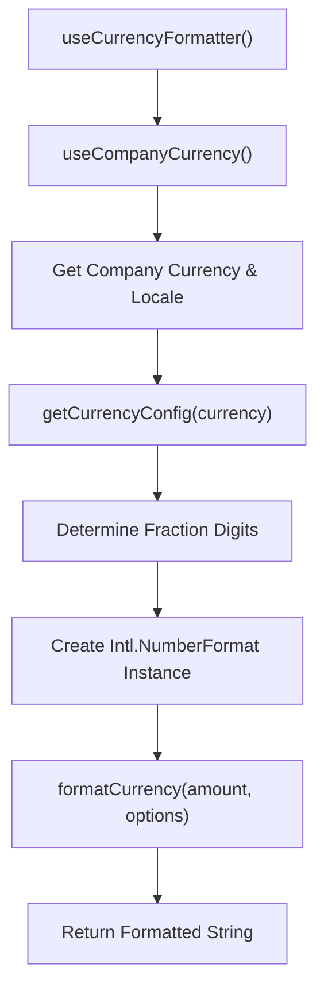
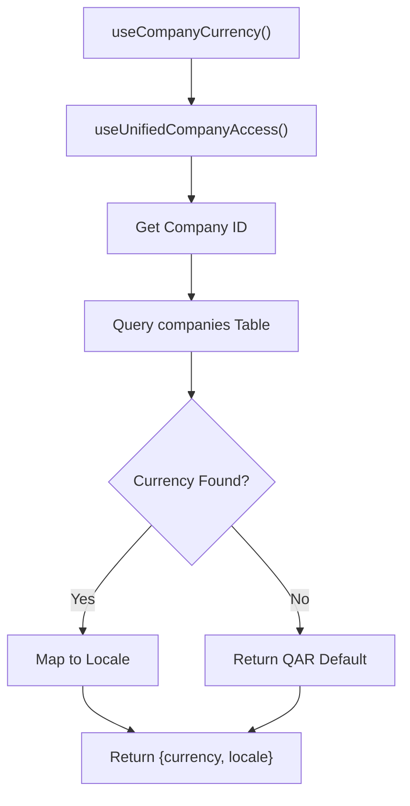
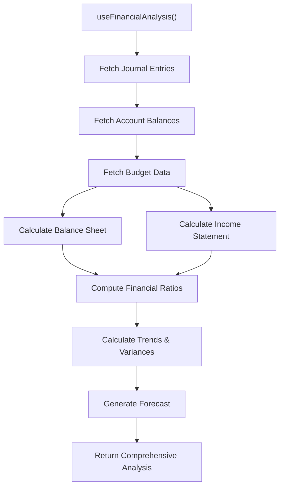
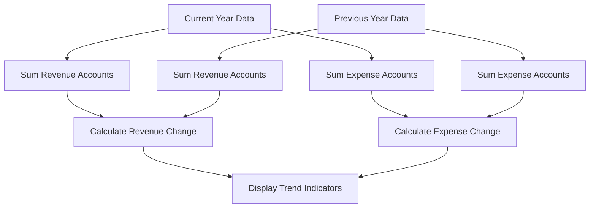

# Financial Data Validation and Formatting Hooks

<cite>
**Referenced Files in This Document**   
- [useCurrencyFormatter.ts](file://src/hooks/useCurrencyFormatter.ts)
- [useCompanyCurrency.ts](file://src/hooks/useCompanyCurrency.ts)
- [useFinancialAnalysis.ts](file://src/hooks/useFinancialAnalysis.ts)
- [currencyFormatter.ts](file://src/utils/currencyFormatter.ts)
- [currencyConfig.ts](file://src/utils/currencyConfig.ts)
</cite>

## Table of Contents
1. [Introduction](#introduction)
2. [Currency Formatting System](#currency-formatting-system)
3. [Company-Level Currency Settings](#company-level-currency-settings)
4. [Financial Analysis Metrics](#financial-analysis-metrics)
5. [Multi-Currency Transaction Handling](#multi-currency-transaction-handling)
6. [Period-over-Period Comparisons](#period-over-period-comparisons)
7. [Precision and Arithmetic Safety](#precision-and-arithmetic-safety)
8. [Customization for Financial Statements](#customization-for-financial-statements)
9. [Troubleshooting Common Issues](#troubleshooting-common-issues)
10. [Conclusion](#conclusion)

## Introduction
This document provides comprehensive documentation for the financial data formatting and validation hooks within the Fleetify application. It details the implementation of `useCurrencyFormatter` for consistent monetary display, integration with company-level currency settings via `useCompanyCurrency`, and the `useFinancialAnalysis` hook for calculating key financial metrics. The system supports multi-currency operations, period-over-period comparisons, and ensures precision in financial calculations through robust formatting and decimal handling.

## Currency Formatting System

The `useCurrencyFormatter` hook provides a standardized way to format monetary values across the application, ensuring consistency in display and handling of financial data. It leverages the browser's `Intl.NumberFormat` API while enforcing application-specific rules for currency presentation.

The hook integrates with company-specific settings to determine the appropriate currency and locale, then creates a memoized formatter instance that maintains consistent decimal precision based on the currency type. All formatted output uses English digits regardless of locale to ensure compatibility with downstream systems and reporting requirements.

**Diagram sources**
- [useCurrencyFormatter.ts](file://src/hooks/useCurrencyFormatter.ts#L1-L58)
- [currencyConfig.ts](file://src/utils/currencyConfig.ts#L1-L56)

**Section sources**
- [useCurrencyFormatter.ts](file://src/hooks/useCurrencyFormatter.ts#L1-L58)
- [currencyConfig.ts](file://src/utils/currencyConfig.ts#L1-L56)

## Company-Level Currency Settings

The `useCompanyCurrency` hook retrieves the currency configuration for the current company from the database, providing both the ISO currency code and appropriate locale for formatting purposes. This ensures that all financial data is displayed according to the company's regional settings.

The hook uses a mapping system to associate currency codes with their corresponding locales, particularly for Gulf Cooperation Council (GCC) currencies which use Arabic locales. The configuration includes default fallback behavior to QAR (Qatari Riyal) if no currency is specified or if an error occurs during retrieval.

**Diagram sources**
- [useCompanyCurrency.ts](file://src/hooks/useCompanyCurrency.ts#L1-L57)
- [useUnifiedCompanyAccess.ts](file://src/hooks/useUnifiedCompanyAccess.ts#L1-L20)

**Section sources**
- [useCompanyCurrency.ts](file://src/hooks/useCompanyCurrency.ts#L1-L57)

## Financial Analysis Metrics

The `useFinancialAnalysis` hook calculates key financial ratios and metrics by querying journal entries, account balances, and budget data from the Supabase database. It provides real-time analysis of financial health through several key indicators:

- **Current Ratio**: Current assets divided by current liabilities
- **Debt-to-Equity Ratio**: Total liabilities divided by total equity
- **Profit Margins**: Net income as a percentage of revenue
- **Return on Assets**: Net income divided by total assets
- **Return on Equity**: Net income divided by total equity

The hook also calculates period-over-period changes and compares actual performance against budgeted amounts, providing variance analysis for both revenue and expenses.

**Diagram sources**
- [useFinancialAnalysis.ts](file://src/hooks/useFinancialAnalysis.ts#L1-L457)

**Section sources**
- [useFinancialAnalysis.ts](file://src/hooks/useFinancialAnalysis.ts#L1-L457)

## Multi-Currency Transaction Handling

While the primary system operates with company-level currency settings, the formatting system supports multi-currency transactions through optional parameters in the `formatCurrency` function. Users can specify a different currency than the company default for specific use cases such as international invoices or foreign currency accounts.

The system maintains consistency by applying the appropriate fraction digits and symbol positioning based on the target currency's configuration, regardless of the company's primary currency setting. This allows for accurate display of foreign currency amounts while maintaining the application's formatting standards.

When handling exchange rate fluctuations, the system relies on external services to provide current rates, while the formatting layer ensures that converted amounts are displayed with the correct precision for the target currency.

**Section sources**
- [useCurrencyFormatter.ts](file://src/hooks/useCurrencyFormatter.ts#L1-L58)
- [currencyConfig.ts](file://src/utils/currencyConfig.ts#L1-L56)

## Period-over-Period Comparisons

The financial analysis system implements period-over-period comparisons by querying journal entries from both the current and previous fiscal years. This enables trend analysis and performance measurement across multiple dimensions:

- Revenue growth or decline
- Expense management effectiveness
- Net income trajectory
- Balance sheet composition changes

The comparison logic calculates both absolute and percentage changes between periods, providing context for the direction and magnitude of financial movements. This data powers dashboard visualizations and executive reporting features.

**Diagram sources**
- [useFinancialAnalysis.ts](file://src/hooks/useFinancialAnalysis.ts#L1-L457)

## Precision and Arithmetic Safety

To address floating-point arithmetic errors in financial calculations, the system employs several strategies:

1. **Fixed Decimal Precision**: Currency formatting enforces consistent decimal places based on currency type (e.g., 3 for KWD, 2 for SAR)
2. **String-Based Parsing**: The `parseCurrency` utility safely extracts numeric values from formatted strings
3. **Integer Arithmetic**: Where possible, amounts are stored and calculated in the smallest currency unit (e.g., fils rather than dinars)
4. **Validation Layer**: Input validation prevents invalid numeric entries

The `currencyConfig.ts` utility provides centralized configuration of fraction digits for each currency, ensuring consistent precision across the application. This prevents rounding errors that could accumulate in financial reports.

**Section sources**
- [currencyFormatter.ts](file://src/utils/currencyFormatter.ts#L1-L19)
- [currencyConfig.ts](file://src/utils/currencyConfig.ts#L1-L56)

## Customization for Financial Statements

The formatting system supports customization for different financial statements and user preferences through optional parameters in the `formatCurrency` function. Users can override the default fraction digits or currency type for specific contexts such as:

- Consolidated financial statements showing multiple currencies
- Budget vs. actual comparisons
- Forecast reports with different precision requirements
- Regulatory filings with specific formatting rules

The system maintains a balance between consistency and flexibility, ensuring that while formatting follows company standards, special reporting needs can be accommodated without compromising data integrity.

**Section sources**
- [useCurrencyFormatter.ts](file://src/hooks/useCurrencyFormatter.ts#L1-L58)

## Troubleshooting Common Issues

### Floating-Point Precision Errors
When encountering unexpected decimal precision in calculations:
1. Ensure all monetary values are processed through the `formatCurrency` utility
2. Verify that database storage uses appropriate decimal types
3. Check that arithmetic operations occur before formatting, not after

### Incorrect Currency Display
If currency symbols or decimal places appear incorrect:
1. Validate the company's currency setting in the database
2. Confirm that `useCompanyCurrency` returns the expected values
3. Check that the currency code matches one of the configured options in `CURRENCY_CONFIGS`

### Performance Issues in Financial Reports
For slow-loading financial analysis data:
1. Ensure proper indexing on journal_entries table (company_id, entry_date, status)
2. Verify that chart_of_accounts has indexes on company_id and is_active
3. Consider implementing caching strategies for frequently accessed reports

**Section sources**
- [useCurrencyFormatter.ts](file://src/hooks/useCurrencyFormatter.ts#L1-L58)
- [useCompanyCurrency.ts](file://src/hooks/useCompanyCurrency.ts#L1-L57)
- [useFinancialAnalysis.ts](file://src/hooks/useFinancialAnalysis.ts#L1-L457)

## Conclusion
The financial data formatting and validation system in Fleetify provides a robust foundation for accurate and consistent financial reporting. By centralizing currency formatting through `useCurrencyFormatter`, integrating with company-level settings via `useCompanyCurrency`, and providing comprehensive analysis through `useFinancialAnalysis`, the system ensures data integrity across all financial operations. The architecture supports multi-currency transactions, precise calculations, and customizable reporting while maintaining performance and reliability.