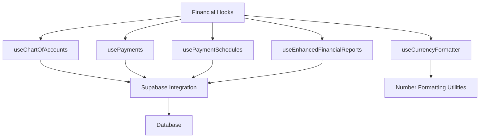
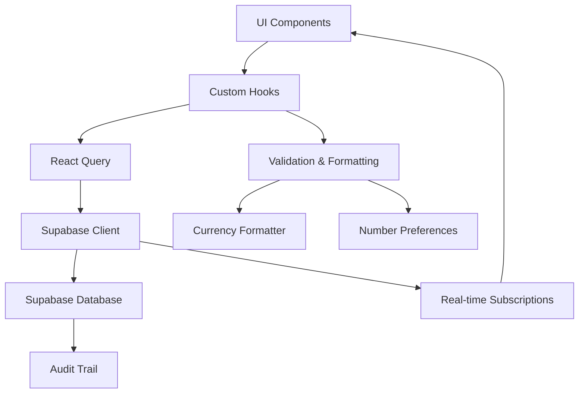
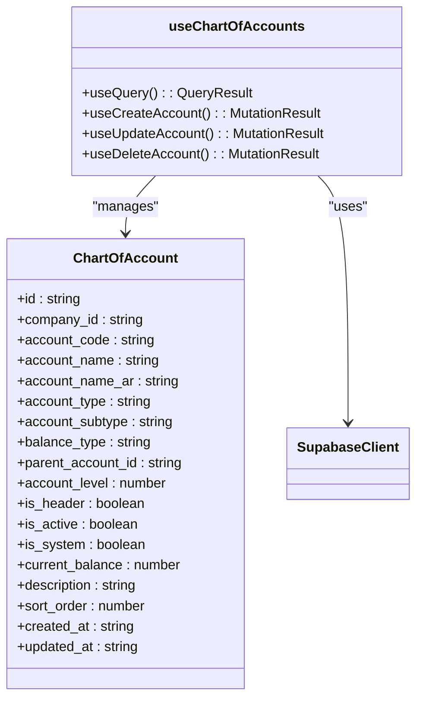
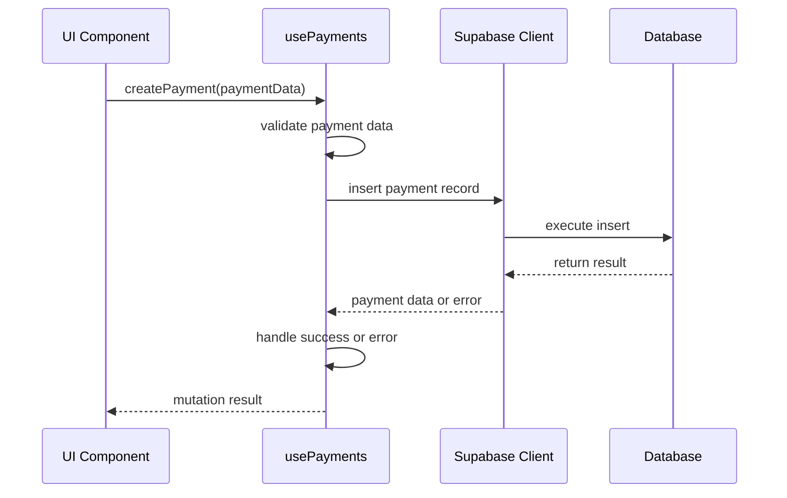
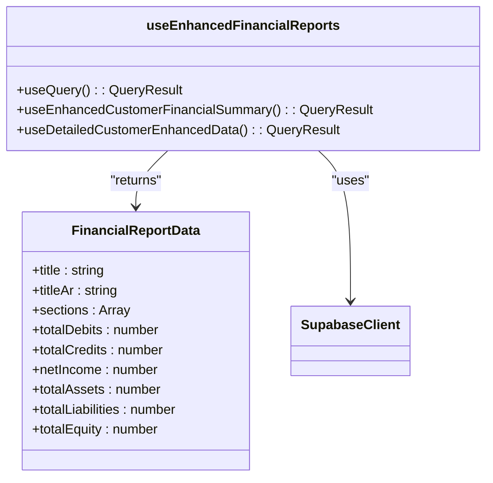
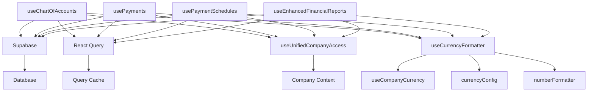

# Financial Operations Hooks

<cite>
**Referenced Files in This Document**   
- [useChartOfAccounts.ts](file://src/hooks/useChartOfAccounts.ts)
- [usePayments.ts](file://src/hooks/usePayments.ts)
- [usePaymentSchedules.ts](file://src/hooks/usePaymentSchedules.ts)
- [useEnhancedFinancialReports.ts](file://src/hooks/useEnhancedFinancialReports.ts)
- [useCurrencyFormatter.ts](file://src/hooks/useCurrencyFormatter.ts)
- [client.ts](file://src/integrations/supabase/client.ts)
- [useFinancialAnalysis.ts](file://src/hooks/useFinancialAnalysis.ts)
</cite>

## Table of Contents
1. [Introduction](#introduction)
2. [Project Structure](#project-structure)
3. [Core Components](#core-components)
4. [Architecture Overview](#architecture-overview)
5. [Detailed Component Analysis](#detailed-component-analysis)
6. [Dependency Analysis](#dependency-analysis)
7. [Performance Considerations](#performance-considerations)
8. [Troubleshooting Guide](#troubleshooting-guide)
9. [Conclusion](#conclusion)

## Introduction
This document provides comprehensive documentation for the financial operations custom hooks in FleetifyApp, focusing on accounting, payments, and financial reporting functionality. The system is designed to handle complex financial operations with robust validation, real-time updates, and integration with Supabase for data persistence. The hooks implement sophisticated financial logic while maintaining user-friendly interfaces and ensuring data integrity through comprehensive error handling and audit trails.

## Project Structure
The financial operations hooks are organized within the src/hooks directory, with specialized hooks for chart of accounts management, payment processing, payment schedules, and financial reporting. These hooks integrate with Supabase for database operations and leverage React Query for state management and data fetching. The structure follows a modular approach, with each hook responsible for a specific financial domain while maintaining loose coupling through standardized interfaces.

**Diagram sources**
- [useChartOfAccounts.ts](file://src/hooks/useChartOfAccounts.ts)
- [usePayments.ts](file://src/hooks/usePayments.ts)
- [usePaymentSchedules.ts](file://src/hooks/usePaymentSchedules.ts)
- [useEnhancedFinancialReports.ts](file://src/hooks/useEnhancedFinancialReports.ts)
- [useCurrencyFormatter.ts](file://src/hooks/useCurrencyFormatter.ts)

**Section sources**
- [src/hooks](file://src/hooks)

## Core Components
The financial operations system in FleetifyApp consists of four primary custom hooks that handle distinct aspects of financial management: useChartOfAccounts for managing the accounting hierarchy, usePayments for processing transactions, usePaymentSchedules for managing recurring payments, and useEnhancedFinancialReports for generating comprehensive financial statements. These hooks are built on React Query for efficient data fetching and caching, with comprehensive error handling and loading state management.

**Section sources**
- [useChartOfAccounts.ts](file://src/hooks/useChartOfAccounts.ts#L0-L43)
- [usePayments.ts](file://src/hooks/usePayments.ts#L0-L43)
- [usePaymentSchedules.ts](file://src/hooks/usePaymentSchedules.ts#L0-L43)
- [useEnhancedFinancialReports.ts](file://src/hooks/useEnhancedFinancialReports.ts#L0-L43)

## Architecture Overview
The financial operations architecture follows a clean separation of concerns, with custom hooks encapsulating business logic and data access patterns. Each hook provides a consistent interface with query functions for data retrieval and mutation functions for data modification. The architecture leverages Supabase as the backend service for data persistence, with real-time capabilities enabled for immediate financial updates. The hooks are designed to be composable, allowing multiple financial operations to be coordinated within components.

**Diagram sources**
- [client.ts](file://src/integrations/supabase/client.ts#L0-L16)
- [useChartOfAccounts.ts](file://src/hooks/useChartOfAccounts.ts)
- [usePayments.ts](file://src/hooks/usePayments.ts)

## Detailed Component Analysis

### Chart of Accounts Management
The useChartOfAccounts hook provides comprehensive functionality for managing hierarchical account structures in the financial system. It implements validation to prevent circular references and conflict detection to ensure data integrity. The hook retrieves account data from Supabase with proper filtering and sorting, maintaining the hierarchical relationships between parent and child accounts.

**Diagram sources**
- [useChartOfAccounts.ts](file://src/hooks/useChartOfAccounts.ts#L43-L104)

**Section sources**
- [useChartOfAccounts.ts](file://src/hooks/useChartOfAccounts.ts#L0-L104)

### Payment Processing
The usePayments hook handles the complete lifecycle of payment transactions, from creation and validation to reconciliation and error handling. It implements robust error handling with user-friendly messages and provides loading states for all operations. The hook integrates with Supabase to persist payment data and supports filtering capabilities for retrieving specific payment records.

**Diagram sources**
- [usePayments.ts](file://src/hooks/usePayments.ts#L122-L160)

**Section sources**
- [usePayments.ts](file://src/hooks/usePayments.ts#L0-L160)

### Payment Schedules Management
The usePaymentSchedules hook manages recurring payment plans with sophisticated date calculations and automatic invoice generation. It supports various installment plans (monthly, quarterly, semi-annual, annual) and handles the creation of multiple payment schedules with associated invoices. The hook implements comprehensive validation for installment counts and payment dates.

**Diagram sources**
- [usePaymentSchedules.ts](file://src/hooks/usePaymentSchedules.ts#L83-L126)

**Section sources**
- [usePaymentSchedules.ts](file://src/hooks/usePaymentSchedules.ts#L0-L195)

### Financial Reporting
The useEnhancedFinancialReports hook enables the generation of complex financial statements with filtering and export capabilities. It supports multiple report types including income statements, balance sheets, and trial balances. The hook provides a standardized interface for retrieving financial data with proper internationalization support for Arabic and English labels.

**Diagram sources**
- [useEnhancedFinancialReports.ts](file://src/hooks/useEnhancedFinancialReports.ts#L0-L43)

**Section sources**
- [useEnhancedFinancialReports.ts](file://src/hooks/useEnhancedFinancialReports.ts#L0-L365)

## Dependency Analysis
The financial operations hooks have a well-defined dependency structure, with each hook depending on core services like Supabase for data persistence and React Query for state management. The hooks are designed to be independent but can be composed together in components that require multiple financial capabilities. The dependency graph shows a clean separation of concerns with minimal circular dependencies.

**Diagram sources**
- [useChartOfAccounts.ts](file://src/hooks/useChartOfAccounts.ts)
- [usePayments.ts](file://src/hooks/usePayments.ts)
- [usePaymentSchedules.ts](file://src/hooks/usePaymentSchedules.ts)
- [useEnhancedFinancialReports.ts](file://src/hooks/useEnhancedFinancialReports.ts)
- [useCurrencyFormatter.ts](file://src/hooks/useCurrencyFormatter.ts)

**Section sources**
- [src/hooks](file://src/hooks)

## Performance Considerations
The financial operations hooks are optimized for performance with several key considerations. React Query's caching mechanism prevents unnecessary database queries by storing results and automatically handling cache invalidation when data changes. The hooks implement proper loading states and error boundaries to maintain UI responsiveness. For large financial datasets, the hooks support filtering and pagination to minimize data transfer. The system also handles offline operations by queuing mutations and synchronizing when connectivity is restored.

**Section sources**
- [useChartOfAccounts.ts](file://src/hooks/useChartOfAccounts.ts)
- [usePayments.ts](file://src/hooks/usePayments.ts)
- [usePaymentSchedules.ts](file://src/hooks/usePaymentSchedules.ts)
- [useEnhancedFinancialReports.ts](file://src/hooks/useEnhancedFinancialReports.ts)

## Troubleshooting Guide
Common issues in the financial operations system typically relate to data validation, connectivity problems, or permission errors. The hooks implement comprehensive logging to aid in troubleshooting, with detailed console messages for each operation. For financial calculations, the system addresses floating-point precision issues by using appropriate decimal arithmetic in the database layer. Error messages are designed to be user-friendly while providing sufficient detail for developers to diagnose issues.

**Section sources**
- [useChartOfAccounts.ts](file://src/hooks/useChartOfAccounts.ts)
- [usePayments.ts](file://src/hooks/usePayments.ts)
- [usePaymentSchedules.ts](file://src/hooks/usePaymentSchedules.ts)
- [useEnhancedFinancialReports.ts](file://src/hooks/useEnhancedFinancialReports.ts)

## Conclusion
The financial operations custom hooks in FleetifyApp provide a robust and comprehensive solution for accounting, payments, and financial reporting. The system's modular architecture, with well-defined hooks for specific financial domains, enables maintainable and scalable financial functionality. Integration with Supabase ensures data persistence and real-time updates, while the use of React Query optimizes performance through efficient data fetching and caching. The hooks implement comprehensive validation, error handling, and user feedback mechanisms to ensure data integrity and a positive user experience.