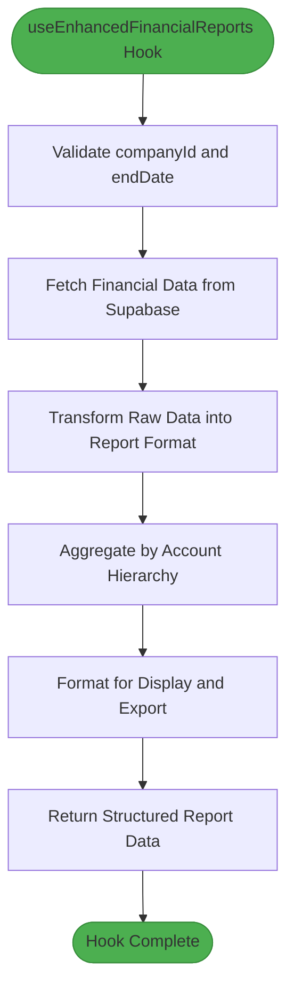
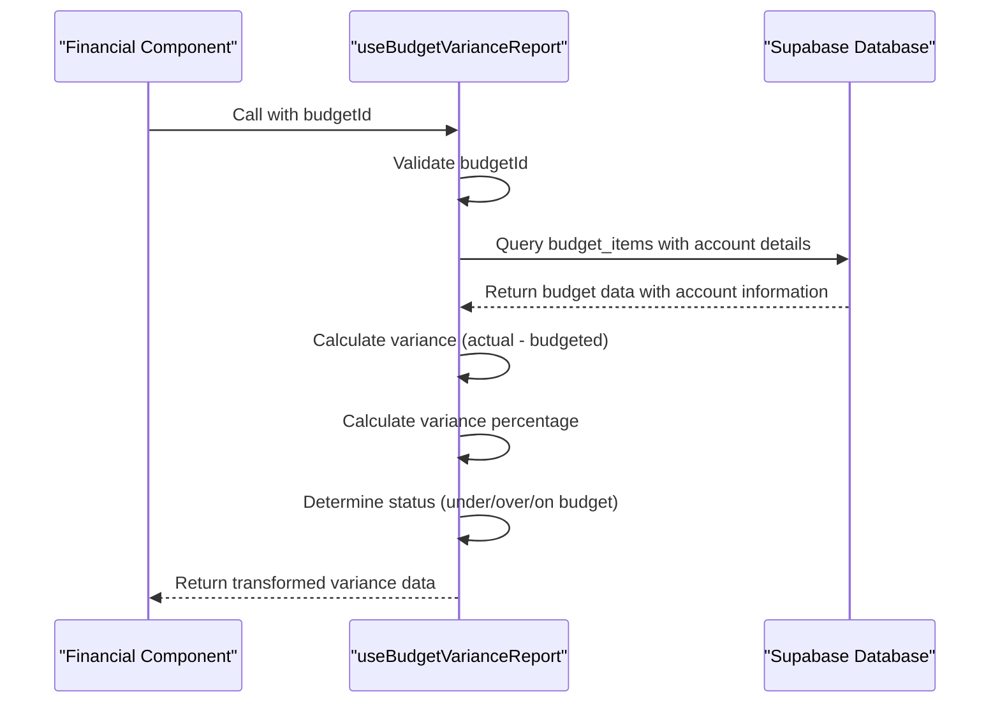
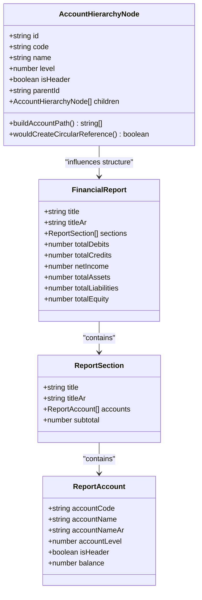
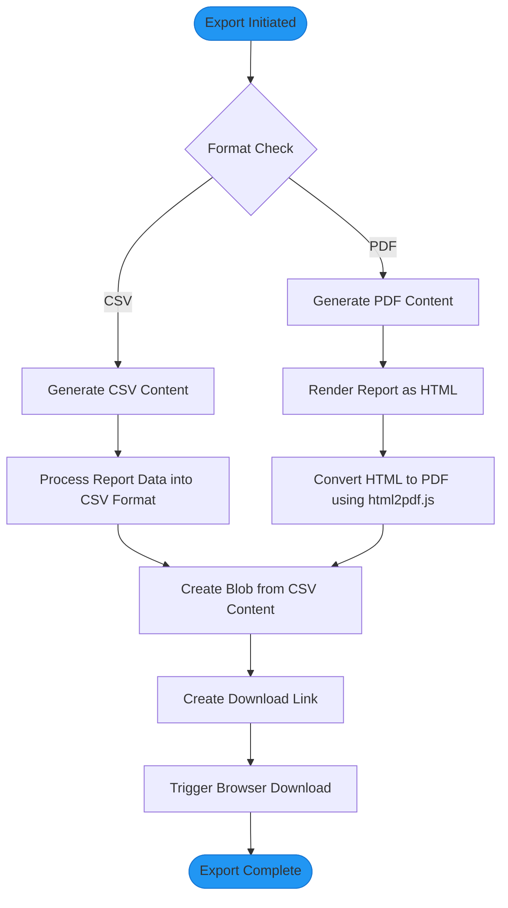
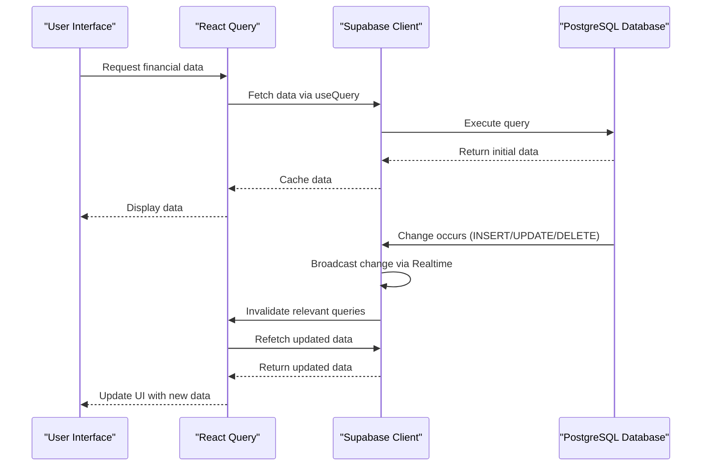
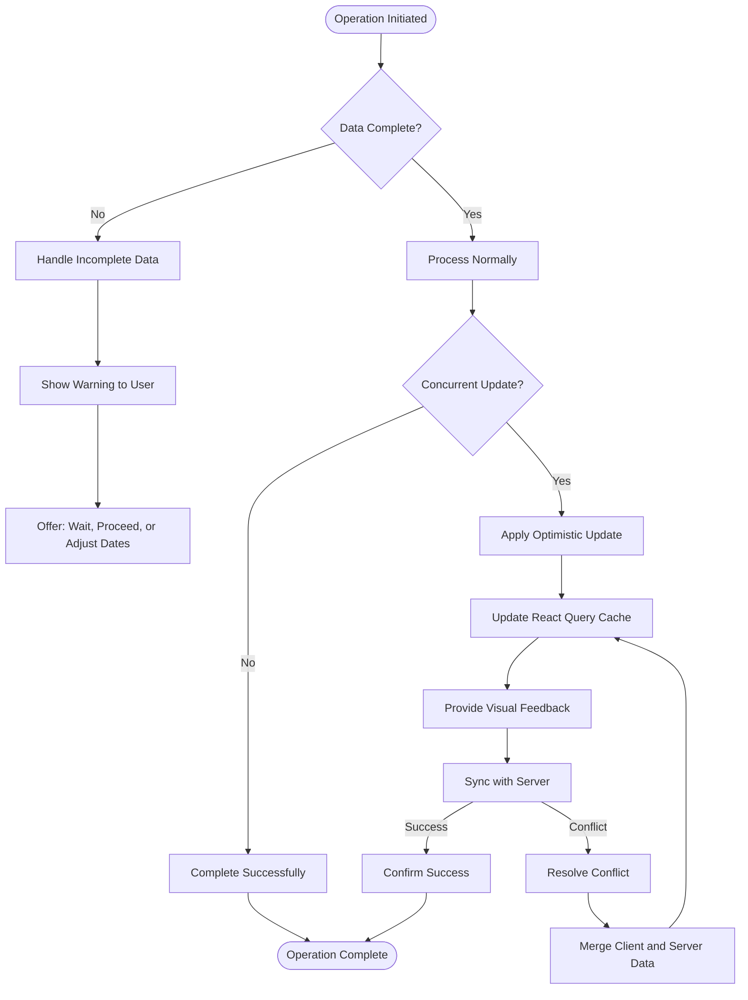
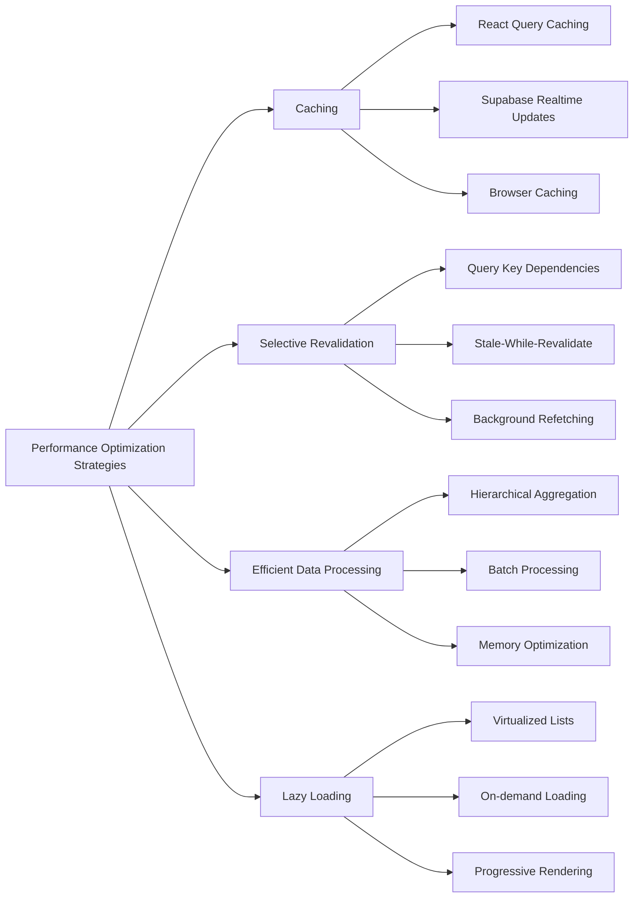

# Financial Reports Hooks

<cite>
**Referenced Files in This Document**   
- [useEnhancedFinancialReports.ts](file://src/hooks/useEnhancedFinancialReports.ts)
- [useBudgetVarianceReport.ts](file://src/hooks/useBudgetVarianceReport.ts)
- [EnhancedFinancialReportsViewer.tsx](file://src/components/finance/EnhancedFinancialReportsViewer.tsx)
- [CustomerAccountStatement.tsx](file://src/components/customers/CustomerAccountStatement.tsx)
- [useUnifiedReports.ts](file://src/hooks/useUnifiedReports.ts)
- [client.ts](file://src/integrations/supabase/client.ts)
- [useEnhancedCustomersRealtime.ts](file://src/hooks/useEnhancedCustomersRealtime.ts)
- [accountHierarchy.ts](file://src/utils/accountHierarchy.ts)
- [csv.ts](file://src/utils/csv.ts)
</cite>

## Table of Contents
1. [Introduction](#introduction)
2. [Core Financial Reporting Hook](#core-financial-reporting-hook)
3. [Budget Variance Reporting](#budget-variance-reporting)
4. [Report Data Transformation and Aggregation](#report-data-transformation-and-aggregation)
5. [Export Functionality](#export-functionality)
6. [Real-time Data Streaming](#real-time-data-streaming)
7. [Error Handling and Data Consistency](#error-handling-and-data-consistency)
8. [Performance Optimization](#performance-optimization)
9. [Conclusion](#conclusion)

## Introduction
The FleetifyApp financial reporting system provides comprehensive hooks for generating key financial statements including Profit & Loss (P&L), balance sheets, and cash flow statements. These hooks support dynamic filtering by date range, account hierarchy, and cost centers, with integration to export functionality and real-time data streaming via Supabase. This document details the implementation of financial reporting hooks, focusing on data transformation, currency conversion, hierarchical aggregations, error handling, and performance optimization strategies.

## Core Financial Reporting Hook

The `useEnhancedFinancialReports` hook serves as the primary interface for generating financial statements in FleetifyApp. It supports multiple report types including income statements, balance sheets, and trial balances with dynamic date filtering capabilities.

**Diagram sources**
- [useEnhancedFinancialReports.ts](file://src/hooks/useEnhancedFinancialReports.ts#L282-L325)

**Section sources**
- [useEnhancedFinancialReports.ts](file://src/hooks/useEnhancedFinancialReports.ts#L282-L325)
- [EnhancedFinancialReportsViewer.tsx](file://src/components/finance/EnhancedFinancialReportsViewer.tsx#L30-L109)

## Budget Variance Reporting

The `useBudgetVarianceReport` hook enables comparison of actual versus budgeted expenses with visual indicators and variance analysis. It retrieves budget items with associated account details and calculates variance metrics including amount and percentage differences.

**Diagram sources**
- [useBudgetVarianceReport.ts](file://src/hooks/useBudgetVarianceReport.ts#L13-L58)
- [useBudgetIntegration.ts](file://src/hooks/useBudgetIntegration.ts#L198-L235)

**Section sources**
- [useBudgetVarianceReport.ts](file://src/hooks/useBudgetVarianceReport.ts#L13-L58)
- [useBudgetIntegration.ts](file://src/hooks/useBudgetIntegration.ts#L198-L235)

## Report Data Transformation and Aggregation

Financial reports in FleetifyApp handle complex data transformations including hierarchical account aggregations and currency conversion across multiple entities. The system processes raw transaction data into structured financial statements with proper account hierarchy representation.

**Diagram sources**
- [accountHierarchy.ts](file://src/utils/accountHierarchy.ts#L0-L48)
- [useEnhancedFinancialReports.ts](file://src/hooks/useEnhancedFinancialReports.ts#L282-L325)

**Section sources**
- [accountHierarchy.ts](file://src/utils/accountHierarchy.ts#L0-L48)
- [csv.ts](file://src/utils/csv.ts#L358-L394)
- [useEnhancedFinancialReports.ts](file://src/hooks/useEnhancedFinancialReports.ts#L282-L325)

## Export Functionality

The financial reporting system includes robust export capabilities to CSV and PDF formats, allowing users to download and share financial statements. The export functionality is integrated directly into the reporting components and supports both financial reports and customer account statements.

**Diagram sources**
- [EnhancedFinancialReportsViewer.tsx](file://src/components/finance/EnhancedFinancialReportsViewer.tsx#L30-L109)
- [CustomerAccountStatement.tsx](file://src/components/customers/CustomerAccountStatement.tsx#L77-L113)
- [ExportAccountsUtility.tsx](file://src/components/finance/charts/ExportAccountsUtility.tsx#L41-L79)

**Section sources**
- [EnhancedFinancialReportsViewer.tsx](file://src/components/finance/EnhancedFinancialReportsViewer.tsx#L30-L109)
- [CustomerAccountStatement.tsx](file://src/components/customers/CustomerAccountStatement.tsx#L77-L113)
- [ExportAccountsUtility.tsx](file://src/components/finance/charts/ExportAccountsUtility.tsx#L0-L42)

## Real-time Data Streaming

FleetifyApp implements real-time data streaming for financial reports using Supabase's realtime capabilities. The system establishes subscriptions to database changes and updates the UI optimistically using React Query, ensuring users see the most current data without manual refreshes.

**Diagram sources**
- [client.ts](file://src/integrations/supabase/client.ts#L0-L16)
- [useEnhancedCustomersRealtime.ts](file://src/hooks/useEnhancedCustomersRealtime.ts#L0-L104)
- [supabase_realtime.sql](file://supabase/migrations/20250903105717_6b93ccf4-20d9-463b-aff1-c4a3656b58a0.sql#L0-L4)

**Section sources**
- [client.ts](file://src/integrations/supabase/client.ts#L0-L16)
- [useEnhancedCustomersRealtime.ts](file://src/hooks/useEnhancedCustomersRealtime.ts#L0-L104)
- [supabase/migrations/20250903105717_6b93ccf4-20d9-463b-aff1-c4a3656b58a0.sql](file://supabase/migrations/20250903105717_6b93ccf4-20d9-463b-aff1-c4a3656b58a0.sql#L0-L4)

## Error Handling and Data Consistency

The financial reporting system implements comprehensive error handling for scenarios such as incomplete data periods and concurrent updates. It uses optimistic UI patterns with React Query to maintain data consistency while providing a responsive user experience during data modifications.

**Section sources**
- [useEnhancedFinancialReports.ts](file://src/hooks/useEnhancedFinancialReports.ts#L282-L325)
- [EnhancedFinancialReportsViewer.tsx](file://src/components/finance/EnhancedFinancialReportsViewer.tsx#L64-L109)
- [useEnhancedCustomersRealtime.ts](file://src/hooks/useEnhancedCustomersRealtime.ts#L68-L104)

## Performance Optimization

The financial reporting system employs several performance optimization strategies including data caching, selective revalidation, and efficient data processing. These optimizations ensure responsive report generation even with large datasets and complex hierarchical structures.

**Section sources**
- [useEnhancedFinancialReports.ts](file://src/hooks/useEnhancedFinancialReports.ts#L282-L325)
- [useUnifiedReports.ts](file://src/hooks/useUnifiedReports.ts#L105-L143)
- [useEnhancedCustomersRealtime.ts](file://src/hooks/useEnhancedCustomersRealtime.ts#L0-L104)

## Conclusion
The financial reporting hooks in FleetifyApp provide a robust foundation for generating P&L statements, balance sheets, and cash flow statements with advanced features including dynamic filtering, hierarchical aggregations, and real-time data streaming. The integration with Supabase enables seamless data synchronization across clients, while the export functionality supports both CSV and PDF formats for external sharing. Through careful implementation of error handling and performance optimization techniques, the system delivers reliable and responsive financial reporting capabilities that meet the needs of modern fleet management operations.