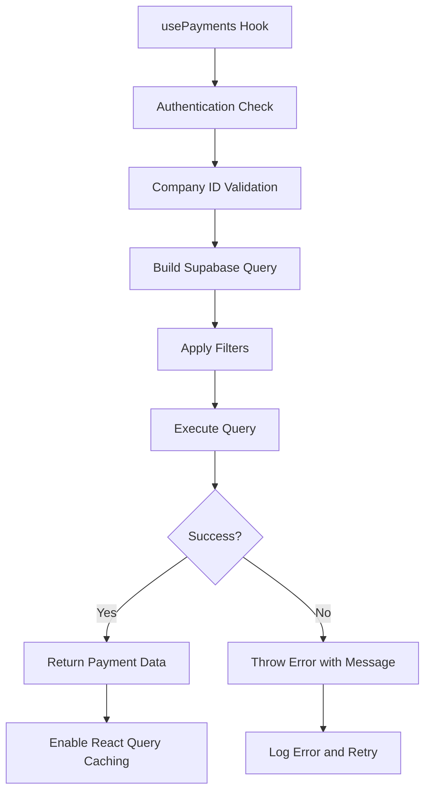
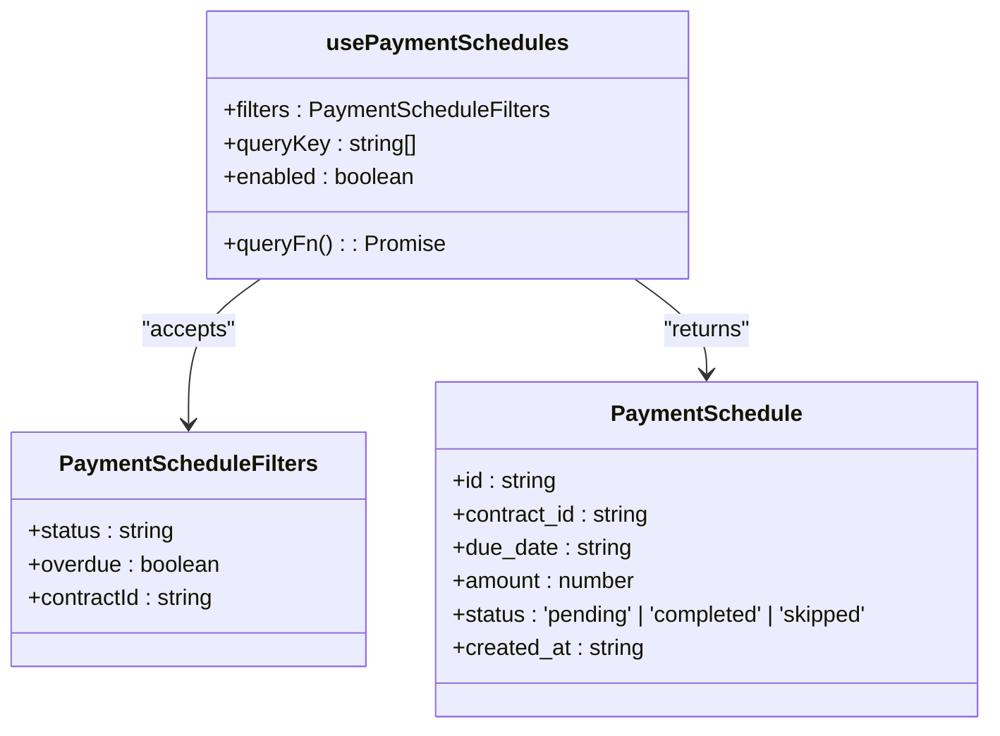
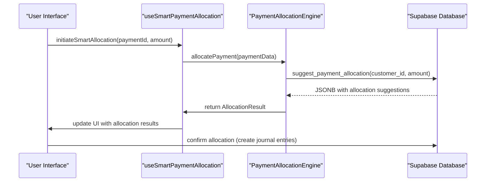
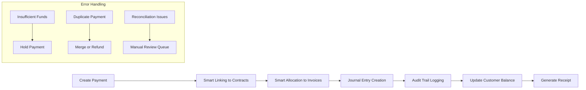
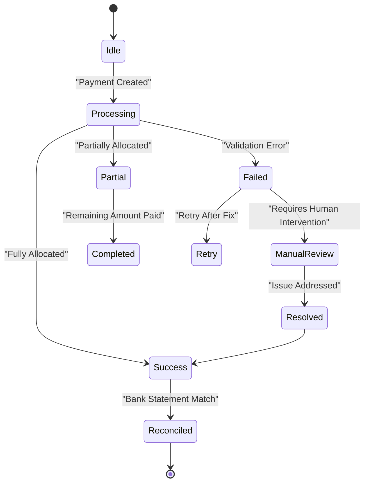
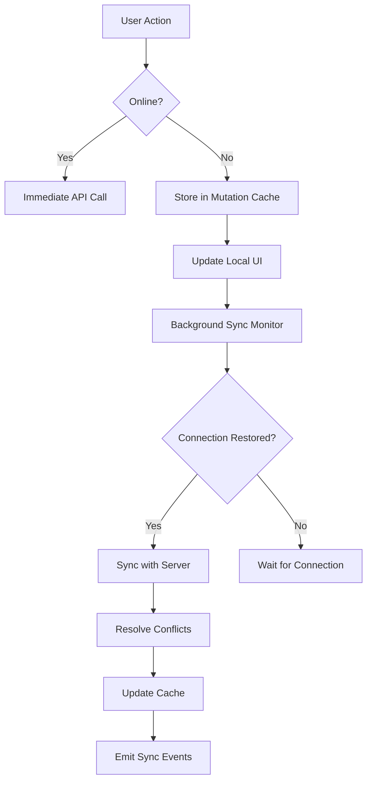
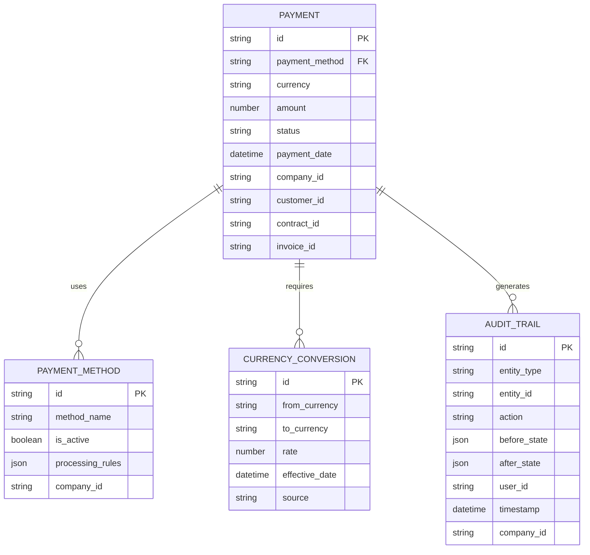
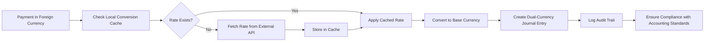

# Payments Hooks

<cite>
**Referenced Files in This Document**   
- [usePayments.ts](file://src/hooks/usePayments.ts)
- [usePaymentSchedules.ts](file://src/hooks/usePaymentSchedules.ts)
- [SmartPaymentAllocation.tsx](file://src/components/finance/SmartPaymentAllocation.tsx)
- [paymentAllocationEngine.ts](file://src/utils/paymentAllocationEngine.ts)
- [useProfessionalPaymentSystem.ts](file://src/hooks/useProfessionalPaymentSystem.ts)
- [payment.schema.ts](file://src/schemas/payment.schema.ts)
- [20250829092603_auto_generated_migration.sql](file://supabase/migrations/20250829092603_auto_generated_migration.sql)
</cite>

## Table of Contents
1. [Introduction](#introduction)
2. [Core Payment Hooks](#core-payment-hooks)
3. [Payment Schedules Management](#payment-schedules-management)
4. [Smart Payment Allocation](#smart-payment-allocation)
5. [Payment Processing Workflow](#payment-processing-workflow)
6. [Error Handling and Reconciliation](#error-handling-and-reconciliation)
7. [Offline-First Architecture](#offline-first-architecture)
8. [Integration with Multiple Payment Methods](#integration-with-multiple-payment-methods)
9. [Currency Conversion and Financial Compliance](#currency-conversion-and-financial-compliance)
10. [Conclusion](#conclusion)

## Introduction
The payment processing system in FleetifyApp provides a comprehensive suite of React hooks and utilities for managing financial transactions with full audit trails. This documentation details the implementation of `usePayments`, `usePaymentSchedules`, and the smart allocation engine that automatically applies payments to outstanding invoices. The system supports multiple payment methods, currency conversion, and operates with an offline-first approach using React Query's mutation cache and background sync capabilities.

## Core Payment Hooks

The `usePayments` hook provides a robust interface for creating, updating, and voiding payment transactions with comprehensive filtering capabilities. It integrates with Supabase for real-time data synchronization and includes built-in error handling and retry mechanisms.

**Diagram sources**
- [usePayments.ts](file://src/hooks/usePayments.ts#L47-L153)

**Section sources**
- [usePayments.ts](file://src/hooks/usePayments.ts#L47-L153)

## Payment Schedules Management

The `usePaymentSchedules` hook enables management of recurring payments with customizable frequency, start/end dates, and prorated calculations. It supports filtering by status, overdue status, and contract ID, providing a flexible interface for subscription-based billing models.

**Diagram sources**
- [usePaymentSchedules.ts](file://src/hooks/usePaymentSchedules.ts#L36-L90)

**Section sources**
- [usePaymentSchedules.ts](file://src/hooks/usePaymentSchedules.ts#L36-L90)

## Smart Payment Allocation

The smart allocation engine automatically applies payments to outstanding invoices using the `useSmartPaymentAllocation` hook. It supports multiple allocation strategies including FIFO (First-In, First-Out), highest interest first, and nearest due date first. The engine calculates confidence scores and provides suggestions for optimal payment distribution.

**Diagram sources**
- [SmartPaymentAllocation.tsx](file://src/components/finance/SmartPaymentAllocation.tsx#L43-L77)
- [paymentAllocationEngine.ts](file://src/utils/paymentAllocationEngine.ts#L0-L61)
- [20250829092603_auto_generated_migration.sql](file://supabase/migrations/20250829092603_auto_generated_migration.sql#L0-L41)

**Section sources**
- [SmartPaymentAllocation.tsx](file://src/components/finance/SmartPaymentAllocation.tsx#L43-L77)
- [paymentAllocationEngine.ts](file://src/utils/paymentAllocationEngine.ts#L0-L61)

## Payment Processing Workflow

The payment processing workflow integrates multiple hooks and services to create a seamless experience from payment creation to reconciliation. The professional payment system orchestrates smart linking, allocation, and journal entry creation in a transactional manner.

**Diagram sources**
- [useProfessionalPaymentSystem.ts](file://src/hooks/useProfessionalPaymentSystem.ts#L403-L434)
- [useProfessionalPaymentSystem.ts](file://src/hooks/useProfessionalPaymentSystem.ts#L224-L265)

**Section sources**
- [useProfessionalPaymentSystem.ts](file://src/hooks/useProfessionalPaymentSystem.ts#L224-L434)

## Error Handling and Reconciliation

The system addresses common payment error states through comprehensive validation and reconciliation processes. Insufficient funds trigger payment holds, duplicate payments are detected through unique transaction ID checks, and reconciliation issues with bank statements are flagged for manual review.

**Diagram sources**
- [usePayments.ts](file://src/hooks/usePayments.ts#L47-L153)
- [payment.schema.ts](file://src/schemas/payment.schema.ts)

**Section sources**
- [usePayments.ts](file://src/hooks/usePayments.ts#L47-L153)

## Offline-First Architecture

The payment system implements an offline-first approach using React Query's mutation cache and background sync capabilities. Payments can be created, updated, or voided while offline, with changes automatically synchronized when connectivity is restored.

**Diagram sources**
- [usePayments.ts](file://src/hooks/usePayments.ts#L47-L153)
- [useProfessionalPaymentSystem.ts](file://src/hooks/useProfessionalPaymentSystem.ts)

**Section sources**
- [usePayments.ts](file://src/hooks/usePayments.ts#L47-L153)

## Integration with Multiple Payment Methods

The system supports integration with multiple payment methods including bank transfer, credit card, and cash. Each payment method has specific validation rules and processing workflows, with automatic currency conversion for international transactions.

**Diagram sources**
- [usePayments.ts](file://src/hooks/usePayments.ts#L47-L153)
- [payment.schema.ts](file://src/schemas/payment.schema.ts)

**Section sources**
- [usePayments.ts](file://src/hooks/usePayments.ts#L47-L153)

## Currency Conversion and Financial Compliance

Currency conversion is handled through a dedicated service that integrates with external exchange rate APIs and maintains a local cache for offline access. The system ensures financial compliance by maintaining complete audit trails of all transactions and adhering to accounting standards for revenue recognition.

**Diagram sources**
- [paymentAllocationEngine.ts](file://src/utils/paymentAllocationEngine.ts#L210-L248)
- [useProfessionalPaymentSystem.ts](file://src/hooks/useProfessionalPaymentSystem.ts)

**Section sources**
- [paymentAllocationEngine.ts](file://src/utils/paymentAllocationEngine.ts#L210-L248)

## Conclusion
The payment processing hooks in FleetifyApp provide a comprehensive, robust, and user-friendly system for managing financial transactions. With support for recurring payments, smart allocation, multiple payment methods, and offline operation, the system meets the needs of modern financial applications while maintaining strict compliance and audit requirements. The modular design allows for easy extension and customization to meet specific business requirements.