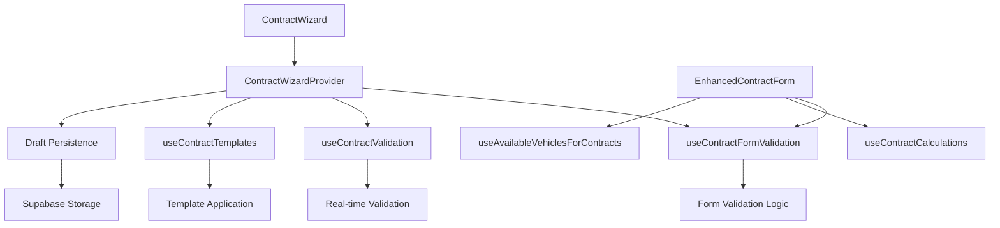
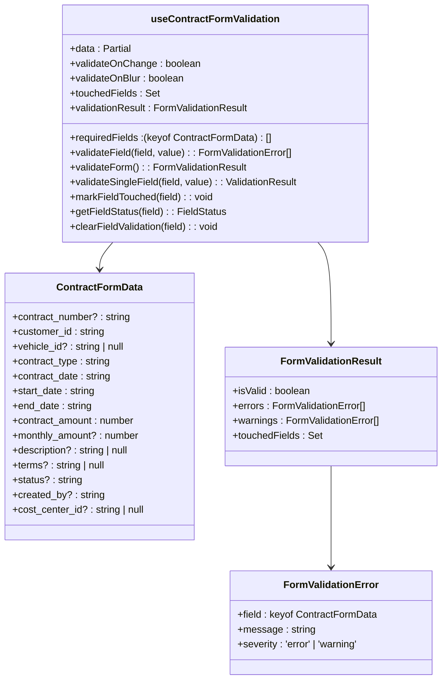
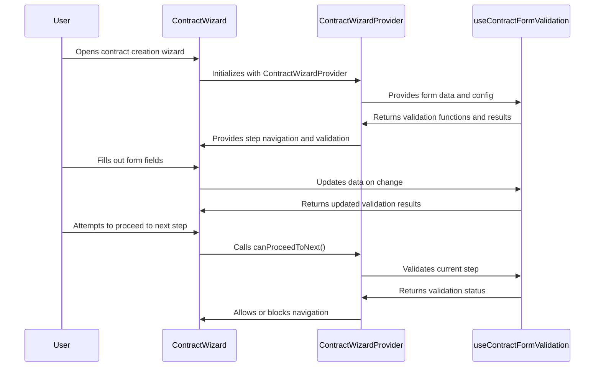
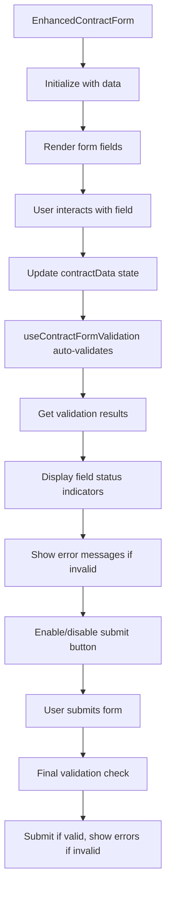
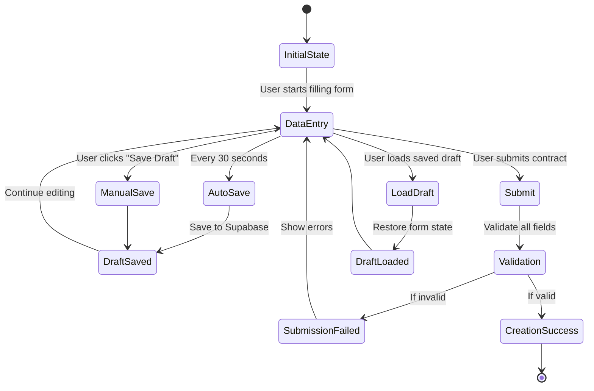
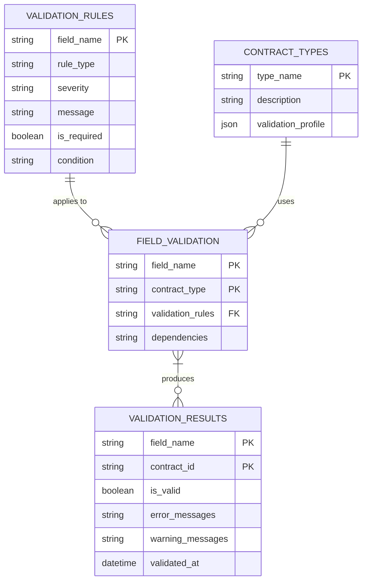
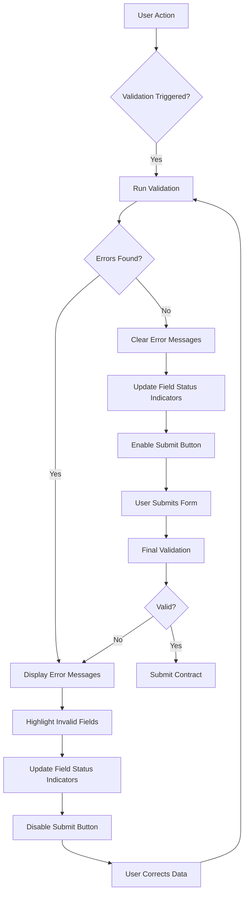
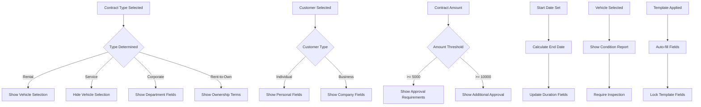
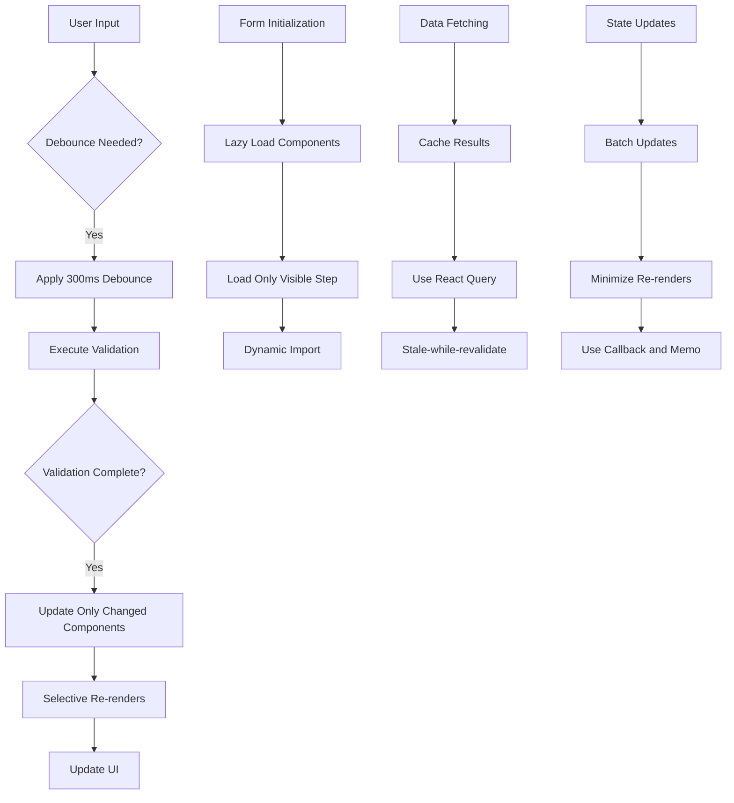
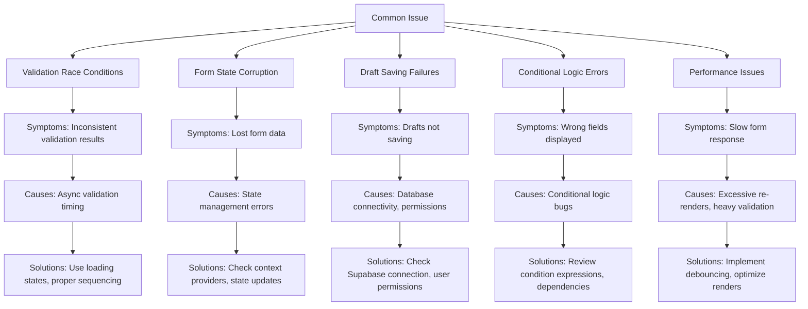

# Contract Form Hooks

<cite>
**Referenced Files in This Document**   
- [useContractFormValidation.ts](file://src/hooks/useContractFormValidation.ts)
- [ContractWizard.tsx](file://src/components/contracts/ContractWizard.tsx)
- [ContractWizardProvider.tsx](file://src/components/contracts/ContractWizardProvider.tsx)
- [EnhancedContractForm.tsx](file://src/components/contracts/EnhancedContractForm.tsx)
- [ContractWizardSteps.tsx](file://src/components/contracts/ContractWizardSteps.tsx)
</cite>

## Table of Contents
1. [Introduction](#introduction)
2. [Core Components and Architecture](#core-components-and-architecture)
3. [useContractFormValidation Hook Implementation](#usecontractformvalidation-hook-implementation)
4. [Integration with ContractWizard](#integration-with-contractwizard)
5. [Integration with EnhancedContractForm](#integration-with-enhancedcontractform)
6. [State Management and Persistence](#state-management-and-persistence)
7. [Validation Strategies](#validation-strategies)
8. [Error Handling and User Feedback](#error-handling-and-user-feedback)
9. [Conditional Logic and Field Rendering](#conditional-logic-and-field-rendering)
10. [Performance Optimization](#performance-optimization)
11. [Troubleshooting Common Issues](#troubleshooting-common-issues)
12. [Conclusion](#conclusion)

## Introduction

The Contract Form Hooks documentation provides a comprehensive overview of the state management and validation system for multi-step contract creation workflows in the Fleetify application. This system centers around the `useContractFormValidation` hook, which manages form state, validation, and user interaction across complex contract creation processes. The documentation covers integration with key components like ContractWizard and EnhancedContractForm, detailing how validation rules adapt based on contract type and business logic. It also explores state persistence, draft saving, recovery mechanisms, and advanced validation strategies for financial calculations, date ranges, and document attachments. The system supports conditional field rendering, real-time validation feedback, and submission state management, with performance optimizations like debounced validation and selective re-renders.

## Core Components and Architecture

The contract form state management system consists of several interconnected components that work together to provide a robust contract creation experience. The architecture follows a provider pattern with specialized hooks for validation and state management.

**Diagram sources**
- [ContractWizard.tsx](file://src/components/contracts/ContractWizard.tsx#L1-L192)
- [ContractWizardProvider.tsx](file://src/components/contracts/ContractWizardProvider.tsx#L1-L664)
- [useContractFormValidation.ts](file://src/hooks/useContractFormValidation.ts#L1-L314)

**Section sources**
- [ContractWizard.tsx](file://src/components/contracts/ContractWizard.tsx#L1-L192)
- [ContractWizardProvider.tsx](file://src/components/contracts/ContractWizardProvider.tsx#L1-L664)
- [useContractFormValidation.ts](file://src/hooks/useContractFormValidation.ts#L1-L314)

## useContractFormValidation Hook Implementation

The `useContractFormValidation` hook is the core validation mechanism for contract forms, providing comprehensive validation capabilities for multi-step contract creation workflows. It implements a sophisticated validation system that handles both required field validation and field-specific business rules.

**Diagram sources**
- [useContractFormValidation.ts](file://src/hooks/useContractFormValidation.ts#L1-L314)

**Section sources**
- [useContractFormValidation.ts](file://src/hooks/useContractFormValidation.ts#L1-L314)

The hook accepts the contract form data and configuration options for validation timing. It maintains two key state variables: `touchedFields` to track which fields have been interacted with, and `validationResult` to store the current validation state. The validation system includes required field configuration for critical fields like customer_id, contract_type, start_date, end_date, contract_amount, and contract_date.

The validation logic is implemented through several key functions:
- `validateField`: Performs field-specific validation with business rules
- `validateForm`: Validates all fields and returns comprehensive results
- `validateSingleField`: Validates individual fields for real-time feedback
- `getFieldStatus`: Provides detailed status for any field including errors and warnings
- `markFieldTouched`: Tracks user interaction with fields

The hook automatically validates the form when data changes if `validateOnChange` is enabled, providing immediate feedback to users. It also supports onBlur validation when configured.

## Integration with ContractWizard

The `useContractFormValidation` hook is deeply integrated with the `ContractWizard` component, enabling a seamless multi-step contract creation experience. The integration allows for step-by-step validation while maintaining form state across the entire workflow.

**Diagram sources**
- [ContractWizard.tsx](file://src/components/contracts/ContractWizard.tsx#L1-L192)
- [ContractWizardProvider.tsx](file://src/components/contracts/ContractWizardProvider.tsx#L1-L664)
- [useContractFormValidation.ts](file://src/hooks/useContractFormValidation.ts#L1-L314)

**Section sources**
- [ContractWizard.tsx](file://src/components/contracts/ContractWizard.tsx#L1-L192)
- [ContractWizardProvider.tsx](file://src/components/contracts/ContractWizardProvider.tsx#L1-L664)

The `ContractWizard` component uses the `ContractWizardProvider` to manage the overall state of the multi-step process. Within each step component, the `useContractFormValidation` hook is used to validate the fields specific to that step. For example, in the `BasicInfoStep`, the hook validates the contract type and contract date, while in the `DatesStep`, it validates the start and end dates and ensures the end date is after the start date.

The wizard's navigation is controlled by the `canProceedToNext` function in the `ContractWizardProvider`, which uses the validation results from `useContractFormValidation` to determine if the user can move to the next step. This ensures that users cannot proceed with invalid data while providing clear feedback on what needs to be corrected.

## Integration with EnhancedContractForm

The `useContractFormValidation` hook is also integrated with the `EnhancedContractForm` component, providing a streamlined contract creation experience with advanced validation and real-time feedback. This integration enables comprehensive validation for all contract fields in a single form interface.

**Diagram sources**
- [EnhancedContractForm.tsx](file://src/components/contracts/EnhancedContractForm.tsx#L1-L569)
- [useContractFormValidation.ts](file://src/hooks/useContractFormValidation.ts#L1-L314)

**Section sources**
- [EnhancedContractForm.tsx](file://src/components/contracts/EnhancedContractForm.tsx#L1-L569)

In the `EnhancedContractForm`, the hook is used to validate all contract fields including customer selection, vehicle selection, dates, and financial amounts. The form displays real-time validation feedback through visual indicators and error messages. For example, when a user selects a customer, the form validates that the customer is active and not blacklisted. When entering financial amounts, it validates that the contract amount is positive and that the monthly amount is appropriate for the contract duration.

The integration also handles conditional validation based on contract type. For instance, when creating a rental contract, the vehicle field becomes conditionally required, and the validation rules adjust accordingly. The form also integrates with financial calculations, automatically updating the monthly amount based on the contract amount and duration, with validation ensuring consistency between these values.

## State Management and Persistence

The contract form system implements robust state management and persistence mechanisms to ensure data integrity and provide a reliable user experience. This includes both client-side state management and server-side draft persistence.

**Diagram sources**
- [ContractWizardProvider.tsx](file://src/components/contracts/ContractWizardProvider.tsx#L1-L664)

**Section sources**
- [ContractWizardProvider.tsx](file://src/components/contracts/ContractWizardProvider.tsx#L1-L664)

The state management system uses React's useState and useContext hooks to maintain form data across components. The `ContractWizardProvider` serves as the central state container, storing all contract data and providing it to child components through context. This ensures that form state persists as users navigate between steps in the wizard.

For persistence, the system implements automatic draft saving every 30 seconds using a setInterval timer in the `ContractWizardProvider`. This ensures that user progress is not lost in case of accidental navigation away from the page or browser crashes. Users can also manually save drafts by clicking the "Save Draft" button. Drafts are stored in the Supabase database with metadata including the current step, last saved timestamp, and created by user.

The system also supports draft recovery, allowing users to load previously saved drafts and continue editing. When loading a draft, the form state is completely restored, including all field values and the current step in the wizard. This enables users to start a contract, save it as a draft, and return to complete it later without losing any progress.

## Validation Strategies

The contract form validation system implements comprehensive validation strategies for required fields, date ranges, financial calculations, and document attachments. These strategies ensure data integrity and enforce business rules throughout the contract creation process.

**Diagram sources**
- [useContractFormValidation.ts](file://src/hooks/useContractFormValidation.ts#L1-L314)
- [ContractWizardSteps.tsx](file://src/components/contracts/ContractWizardSteps.tsx#L1-L799)

**Section sources**
- [useContractFormValidation.ts](file://src/hooks/useContractFormValidation.ts#L1-L314)
- [ContractWizardSteps.tsx](file://src/components/contracts/ContractWizardSteps.tsx#L1-L799)

The validation system employs several key strategies:

**Required Field Validation**: Critical fields like customer_id, contract_type, start_date, end_date, and contract_amount are marked as required. The system checks for empty values, empty strings, or zero/negative values for numeric fields.

**Date Range Validation**: The system ensures that the end date is after the start date and that neither date is in the past. It also validates that date ranges do not conflict with existing contracts for the same customer or vehicle.

**Financial Calculation Validation**: The system validates that contract amounts are positive and reasonable (not excessively large). It also ensures that monthly amounts are consistent with the total contract amount and duration. For long-term contracts, it verifies that monthly amounts are provided.

**Conditional Validation**: Validation rules adapt based on contract type and user input. For example, vehicle selection becomes conditionally required for rental contracts but optional for service contracts. Similarly, certain financial fields may be required only for high-value contracts that need approval.

**Document Attachment Validation**: When document attachments are required, the system validates that the necessary documents have been uploaded and are in the correct format. It also checks file size limits and validates document metadata.

The validation system also implements approval workflows for high-value contracts. Contracts with amounts over 5,000 require manager approval, while those over 10,000 require company administration approval. These rules are enforced during validation, preventing submission until the appropriate approvals are obtained.

## Error Handling and User Feedback

The contract form system implements comprehensive error handling and user feedback mechanisms to guide users through the contract creation process and help them correct any issues.

**Diagram sources**
- [useContractFormValidation.ts](file://src/hooks/useContractFormValidation.ts#L1-L314)
- [ContractWizardSteps.tsx](file://src/components/contracts/ContractWizardSteps.tsx#L1-L799)

**Section sources**
- [useContractFormValidation.ts](file://src/hooks/useContractFormValidation.ts#L1-L314)
- [ContractWizardSteps.tsx](file://src/components/contracts/ContractWizardSteps.tsx#L1-L799)

The system provides multiple layers of user feedback:

**Real-time Validation Feedback**: As users interact with form fields, the system provides immediate feedback on field validity. This includes visual indicators like color-coded borders (red for errors, yellow for warnings) and icons that show the validation status.

**Error Messages**: When validation fails, the system displays clear, user-friendly error messages that explain what is wrong and how to fix it. Messages are localized to Arabic for the primary interface but could be extended to support multiple languages.

**Field Status Indicators**: Each field has a status indicator that shows whether it is valid, has errors, or has warnings. This includes whether the field is required and whether it has been touched by the user.

**Form Summary**: The system provides a summary of validation issues, listing all errors and warnings in one place. This helps users understand the complete set of issues that need to be addressed before submission.

**Progressive Disclosure**: For complex validation issues, the system uses progressive disclosure, showing basic error messages initially and providing more detailed information when users interact with the error.

**Toast Notifications**: The system uses toast notifications to provide feedback on actions like saving drafts or encountering validation errors. These notifications are non-intrusive but ensure users are aware of important events.

**Approval Workflows**: For contracts requiring approval, the system clearly indicates the approval requirements and steps needed. This includes showing which roles need to approve the contract and providing status updates on the approval process.

## Conditional Logic and Field Rendering

The contract form system implements sophisticated conditional logic for field rendering and validation based on user input and contract type. This dynamic behavior ensures that users only see and interact with relevant fields for their specific contract.

**Diagram sources**
- [ContractWizardSteps.tsx](file://src/components/contracts/ContractWizardSteps.tsx#L1-L799)
- [EnhancedContractForm.tsx](file://src/components/contracts/EnhancedContractForm.tsx#L1-L569)

**Section sources**
- [ContractWizardSteps.tsx](file://src/components/contracts/ContractWizardSteps.tsx#L1-L799)
- [EnhancedContractForm.tsx](file://src/components/contracts/EnhancedContractForm.tsx#L1-L569)

The conditional logic system operates on several levels:

**Contract Type-based Rendering**: The system adapts the form based on the selected contract type. For rental contracts, vehicle selection fields are shown and made conditionally required. For service contracts, these fields are hidden. Corporate contracts show additional fields for department and cost center information.

**Customer-based Logic**: When a customer is selected, the system adapts based on customer type. Individual customers show personal information fields, while business customers show company information fields. The system also checks customer status, preventing contracts with blacklisted or inactive customers.

**Financial-based Conditions**: The system implements conditions based on contract value. Contracts over 5,000 require manager approval, while those over 10,000 require additional company administration approval. These conditions affect both validation and UI, showing approval requirements and potentially requiring additional documentation.

**Date-based Calculations**: When start and end dates are set, the system automatically calculates the contract duration and updates related fields. It also validates that the date range does not conflict with existing contracts for the same customer or vehicle.

**Template-based Behavior**: When a contract template is applied, the system auto-fills fields from the template and may lock certain fields to prevent modification. This ensures consistency with organizational standards while allowing flexibility where needed.

**Vehicle-based Requirements**: When a vehicle is selected, the system requires a vehicle condition report and may show additional fields for vehicle-specific terms and conditions.

## Performance Optimization

The contract form system implements several performance optimization techniques to ensure a responsive user experience, particularly for complex validation and large forms.

**Diagram sources**
- [useContractFormValidation.ts](file://src/hooks/useContractFormValidation.ts#L1-L314)
- [ContractWizardProvider.tsx](file://src/components/contracts/ContractWizardProvider.tsx#L1-L664)

**Section sources**
- [useContractFormValidation.ts](file://src/hooks/useContractFormValidation.ts#L1-L314)
- [ContractWizardProvider.tsx](file://src/components/contracts/ContractWizardProvider.tsx#L1-L664)

The system employs the following optimization techniques:

**Debounced Validation**: The system uses debounced validation to prevent excessive validation calls during rapid user input. This is particularly important for fields that trigger expensive validation operations, such as customer or vehicle selection. The debounce delay is typically set to 300 milliseconds, balancing responsiveness with performance.

**Selective Re-renders**: The system minimizes re-renders by using React's useCallback, useMemo, and React.memo to memoize functions, values, and components. This ensures that only components affected by state changes are re-rendered, rather than the entire form.

**Lazy Loading**: The multi-step wizard implements lazy loading of step components, only rendering the currently active step. This reduces initial load time and memory usage, especially for wizards with many steps.

**Efficient State Management**: The system uses optimized state updates, batching related updates and minimizing the frequency of state changes. The ContractWizardProvider carefully manages state updates to avoid unnecessary re-renders of child components.

**Caching**: The system implements caching for frequently accessed data, such as customer lists, vehicle inventories, and contract templates. This reduces database queries and improves response times for repeated operations.

**Code Splitting**: The application uses code splitting to load only the necessary code for the current view, reducing initial bundle size and improving load times.

**Optimized Validation**: The validation system is optimized to only validate fields that have changed or are relevant to the current context. This prevents unnecessary validation of untouched fields or fields not applicable to the current contract type.

## Troubleshooting Common Issues

This section addresses common issues that may arise when working with the contract form state management system, providing guidance for diagnosis and resolution.

**Diagram sources**
- [useContractFormValidation.ts](file://src/hooks/useContractFormValidation.ts#L1-L314)
- [ContractWizardProvider.tsx](file://src/components/contracts/ContractWizardProvider.tsx#L1-L664)

**Section sources**
- [useContractFormValidation.ts](file://src/hooks/useContractFormValidation.ts#L1-L314)
- [ContractWizardProvider.tsx](file://src/components/contracts/ContractWizardProvider.tsx#L1-L664)

**Validation Race Conditions**: These occur when multiple validation operations are triggered simultaneously, leading to inconsistent results. Symptoms include validation messages appearing and disappearing rapidly or validation state not reflecting the current form data. To resolve this, ensure that validation operations are properly sequenced and use loading states to indicate when validation is in progress. The system should also use the most recent validation results and discard outdated ones.

**Form State Corruption**: This occurs when form data becomes inconsistent or is lost unexpectedly. Common causes include improper state management, context provider issues, or errors in state update functions. To troubleshoot, verify that the ContractWizardProvider is properly wrapping all components that need access to form state and that state updates are using the correct update functions. Check for any direct state mutations that bypass the provided update mechanisms.

**Draft Saving Failures**: When drafts fail to save, check the Supabase connection and ensure the user has the necessary permissions to write to the contract_drafts table. Verify that the draft data structure is correct and that required fields like company_id and created_by are properly populated. Also check for any network connectivity issues that might prevent the save operation.

**Conditional Logic Errors**: These occur when fields are not properly shown or hidden based on conditions, or when validation rules don't adapt correctly to context. Review the conditional expressions in the code to ensure they are correctly formulated and that all dependencies are properly accounted for. Use console logging to trace the evaluation of conditions and verify they produce the expected results.

**Performance Issues**: If the form is slow to respond, check for excessive re-renders by using React DevTools to monitor component updates. Implement or verify debouncing on validation operations, and ensure that only necessary components are re-rendering. Optimize expensive operations like database queries by implementing caching and efficient data fetching patterns.

## Conclusion

The contract form state management system in the Fleetify application provides a robust, user-friendly solution for multi-step contract creation. Centered around the `useContractFormValidation` hook, the system offers comprehensive validation capabilities that adapt to contract type and business logic. The integration with `ContractWizard` and `EnhancedContractForm` components enables both multi-step and single-form contract creation workflows with consistent validation and state management.

Key strengths of the system include its sophisticated validation strategies for required fields, date ranges, financial calculations, and document attachments. The system provides excellent user feedback through real-time validation, clear error messages, and visual indicators. Conditional logic ensures that users only interact with relevant fields based on their selections, while performance optimizations like debounced validation and selective re-renders maintain responsiveness.

The state persistence mechanisms, including automatic draft saving and recovery, ensure that user progress is not lost. The system also supports complex business requirements like approval workflows for high-value contracts and integration with customer and account data.

For future improvements, consider enhancing the error handling to provide more specific guidance for resolving validation issues, expanding the template system to support more contract types, and implementing additional performance optimizations for very large forms. The system provides a solid foundation for contract management that can be extended to support additional business requirements as needed.