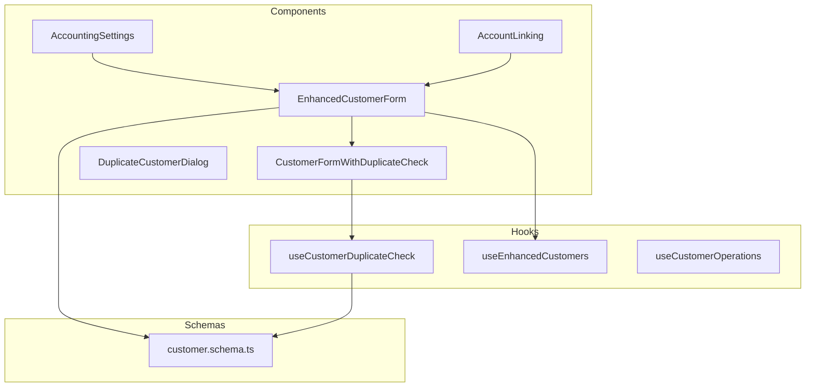
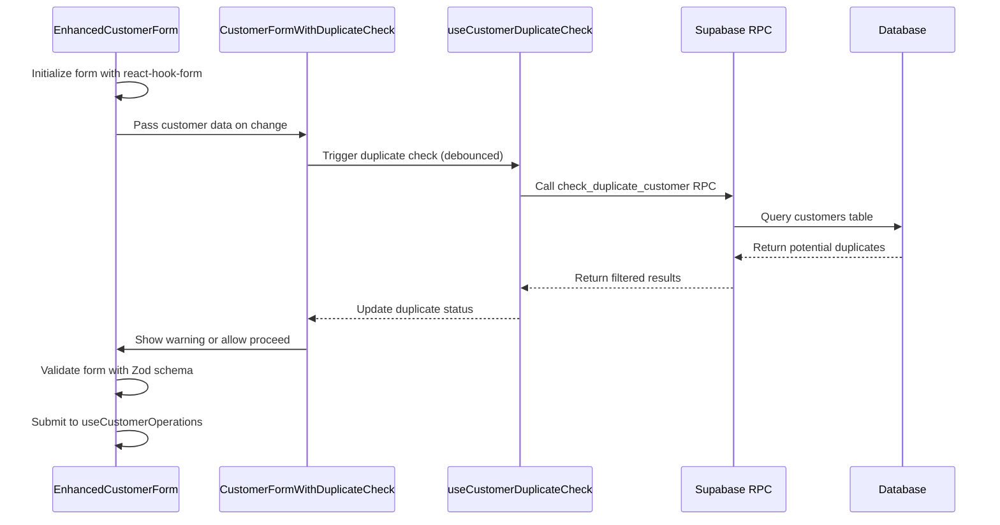
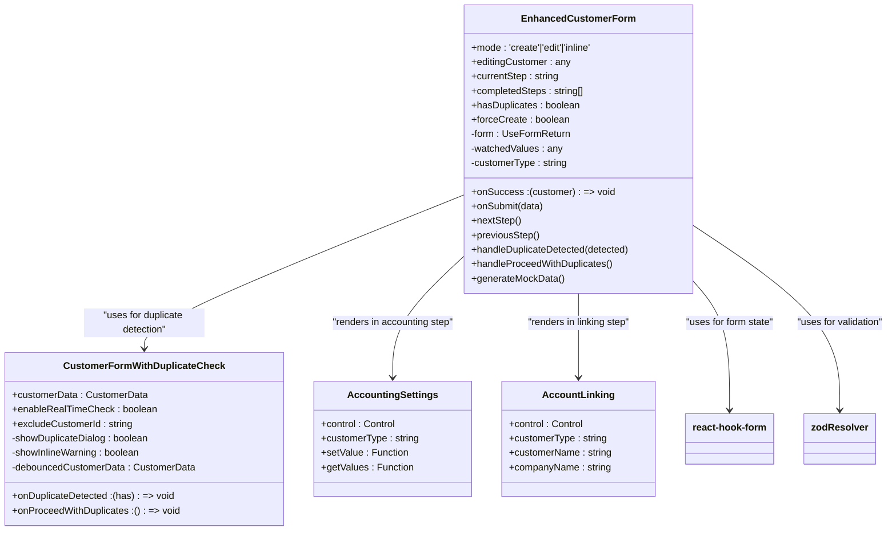
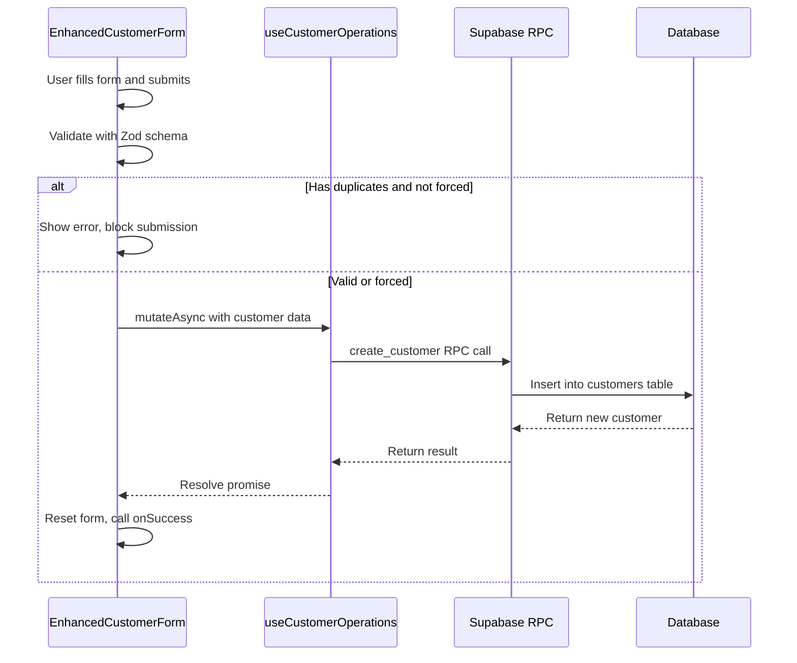
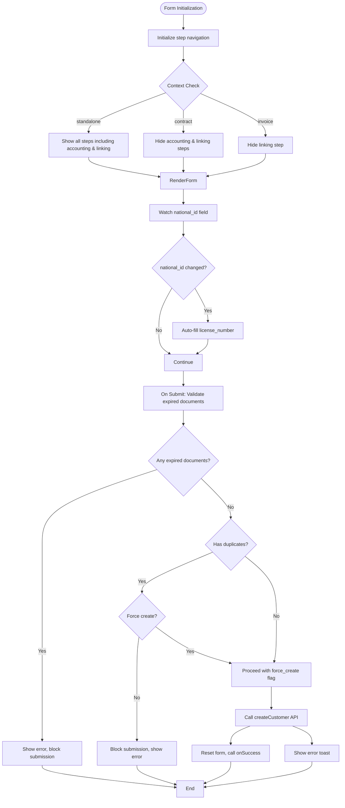
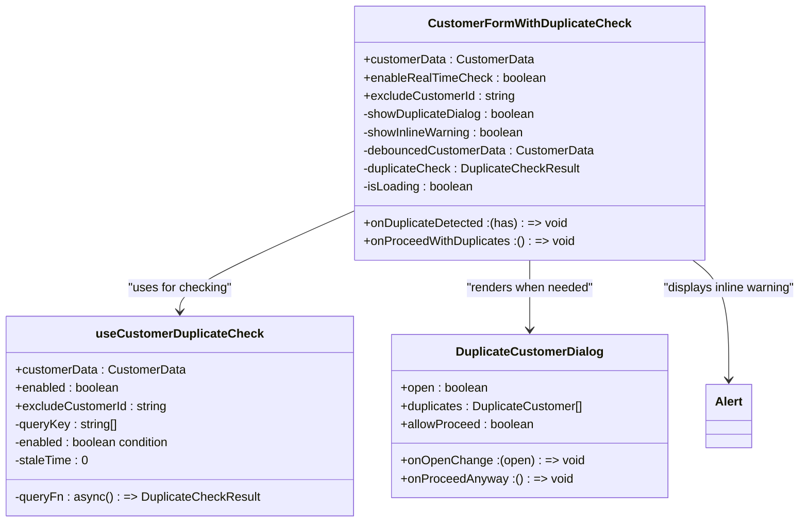
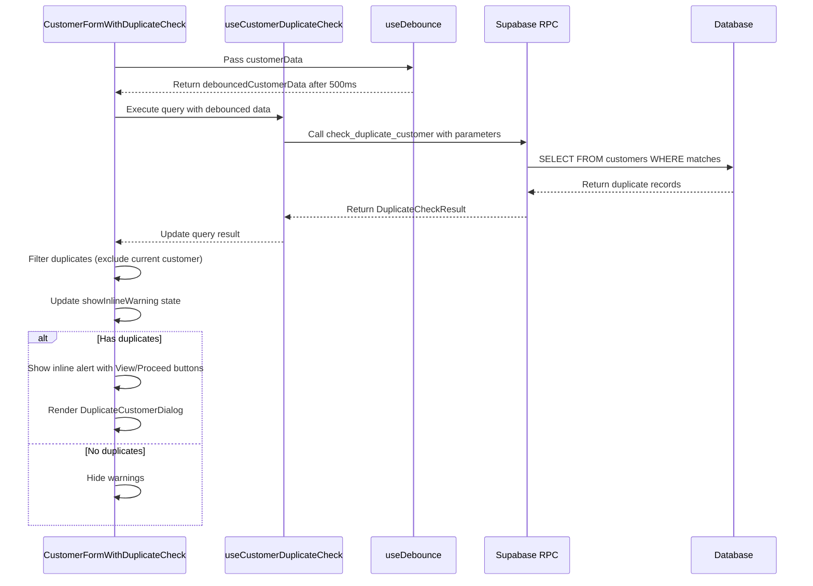
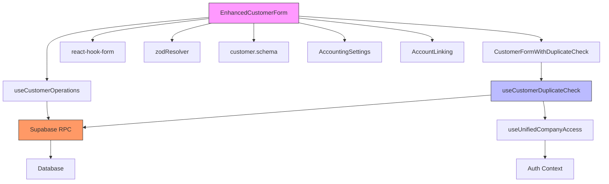

# Customer Form Hooks

<cite>
**Referenced Files in This Document**   
- [CustomerFormWithDuplicateCheck.tsx](file://src/components/customers/CustomerFormWithDuplicateCheck.tsx)
- [EnhancedCustomerForm.tsx](file://src/components/customers/EnhancedCustomerForm.tsx)
- [customer.schema.ts](file://src/schemas/customer.schema.ts)
- [useCustomerDuplicateCheck.ts](file://src/hooks/useCustomerDuplicateCheck.ts)
</cite>

## Table of Contents
1. [Introduction](#introduction)
2. [Project Structure](#project-structure)
3. [Core Components](#core-components)
4. [Architecture Overview](#architecture-overview)
5. [Detailed Component Analysis](#detailed-component-analysis)
6. [Dependency Analysis](#dependency-analysis)
7. [Performance Considerations](#performance-considerations)
8. [Troubleshooting Guide](#troubleshooting-guide)
9. [Conclusion](#conclusion)

## Introduction
This document provides a comprehensive analysis of the customer form state management system, focusing on the `useCustomerFormValidation` implementation through integrated hooks and components. The system supports customer creation and editing workflows with real-time duplicate detection, automatic account creation, and robust validation logic. It integrates deeply with business rules for customer identification, contact information, tax details, and financial settings while ensuring accessibility and performance at scale.

## Project Structure
The customer form ecosystem is organized under the `src/components/customers/` directory, with supporting hooks in `src/hooks/` and schema definitions in `src/schemas/`. The architecture follows a modular pattern separating concerns between UI presentation, state management, validation logic, and backend integration.

**Diagram sources**
- [CustomerFormWithDuplicateCheck.tsx](file://src/components/customers/CustomerFormWithDuplicateCheck.tsx)
- [EnhancedCustomerForm.tsx](file://src/components/customers/EnhancedCustomerForm.tsx)
- [customer.schema.ts](file://src/schemas/customer.schema.ts)
- [useCustomerDuplicateCheck.ts](file://src/hooks/useCustomerDuplicateCheck.ts)

**Section sources**
- [src/components/customers](file://src/components/customers)
- [src/hooks](file://src/hooks)
- [src/schemas](file://src/schemas)

## Core Components
The customer form system centers around two primary components: `EnhancedCustomerForm` as the main interface and `CustomerFormWithDuplicateCheck` as the duplicate detection wrapper. These are supported by validation schemas and custom hooks that manage state, validation, and side effects.

**Section sources**
- [EnhancedCustomerForm.tsx](file://src/components/customers/EnhancedCustomerForm.tsx)
- [CustomerFormWithDuplicateCheck.tsx](file://src/components/customers/CustomerFormWithDuplicateCheck.tsx)
- [customer.schema.ts](file://src/schemas/customer.schema.ts)

## Architecture Overview
The customer form architecture implements a layered approach combining React Hook Form for state management, Zod for schema validation, and React Query for asynchronous operations. The system uses a step-based wizard pattern with conditional rendering based on customer type and context.

**Diagram sources**
- [EnhancedCustomerForm.tsx](file://src/components/customers/EnhancedCustomerForm.tsx#L1-L792)
- [CustomerFormWithDuplicateCheck.tsx](file://src/components/customers/CustomerFormWithDuplicateCheck.tsx#L1-L135)
- [useCustomerDuplicateCheck.ts](file://src/hooks/useCustomerDuplicateCheck.ts#L1-L122)

## Detailed Component Analysis

### EnhancedCustomerForm Analysis
The `EnhancedCustomerForm` component implements a multi-step wizard for customer creation and editing. It supports different contexts (standalone, contract, invoice) and adapts its workflow accordingly. The form uses react-hook-form with Zod resolver for validation and includes mock data generation for testing.

#### For Object-Oriented Components:

**Diagram sources**
- [EnhancedCustomerForm.tsx](file://src/components/customers/EnhancedCustomerForm.tsx#L1-L792)
- [CustomerFormWithDuplicateCheck.tsx](file://src/components/customers/CustomerFormWithDuplicateCheck.tsx#L1-L135)

#### For API/Service Components:

**Diagram sources**
- [EnhancedCustomerForm.tsx](file://src/components/customers/EnhancedCustomerForm.tsx#L1-L792)
- [useCustomerOperations.ts](file://src/hooks/business/useCustomerOperations.ts)

#### For Complex Logic Components:

**Diagram sources**
- [EnhancedCustomerForm.tsx](file://src/components/customers/EnhancedCustomerForm.tsx#L1-L792)
- [customer.schema.ts](file://src/schemas/customer.schema.ts#L1-L74)

**Section sources**
- [EnhancedCustomerForm.tsx](file://src/components/customers/EnhancedCustomerForm.tsx#L1-L792)
- [customer.schema.ts](file://src/schemas/customer.schema.ts#L1-L74)

### CustomerFormWithDuplicateCheck Analysis
The `CustomerFormWithDuplicateCheck` component provides real-time duplicate detection functionality that wraps around customer forms. It uses debounced input checking to minimize API calls and displays both inline warnings and modal dialogs for duplicate records.

#### For Object-Oriented Components:

**Diagram sources**
- [CustomerFormWithDuplicateCheck.tsx](file://src/components/customers/CustomerFormWithDuplicateCheck.tsx#L1-L135)
- [useCustomerDuplicateCheck.ts](file://src/hooks/useCustomerDuplicateCheck.ts#L1-L122)

#### For API/Service Components:

**Diagram sources**
- [CustomerFormWithDuplicateCheck.tsx](file://src/components/customers/CustomerFormWithDuplicateCheck.tsx#L1-L135)
- [useCustomerDuplicateCheck.ts](file://src/hooks/useCustomerDuplicateCheck.ts#L1-L122)

**Section sources**
- [CustomerFormWithDuplicateCheck.tsx](file://src/components/customers/CustomerFormWithDuplicateCheck.tsx#L1-L135)
- [useCustomerDuplicateCheck.ts](file://src/hooks/useCustomerDuplicateCheck.ts#L1-L122)

## Dependency Analysis
The customer form system has well-defined dependencies between components, hooks, and external services. The architecture ensures separation of concerns while maintaining tight integration where needed.

**Diagram sources**
- [EnhancedCustomerForm.tsx](file://src/components/customers/EnhancedCustomerForm.tsx)
- [useCustomerDuplicateCheck.ts](file://src/hooks/useCustomerDuplicateCheck.ts)
- [customer.schema.ts](file://src/schemas/customer.schema.ts)

**Section sources**
- [EnhancedCustomerForm.tsx](file://src/components/customers/EnhancedCustomerForm.tsx)
- [useCustomerDuplicateCheck.ts](file://src/hooks/useCustomerDuplicateCheck.ts)
- [customer.schema.ts](file://src/schemas/customer.schema.ts)

## Performance Considerations
The system implements several performance optimizations to handle large customer databases and network latency:

1. **Debounced duplicate checking**: Uses `useDebounce` hook with 500ms delay to prevent excessive API calls during typing
2. **Conditional querying**: Only enables duplicate check when relevant fields have values
3. **Fresh data policy**: Sets `staleTime: 0` to ensure always fresh duplicate checks
4. **Server-side filtering**: Leverages Supabase RPC function `check_duplicate_customer` to minimize data transfer
5. **Client-side filtering**: Filters results to current company and excludes current customer ID
6. **Efficient rendering**: Uses React.memo and proper dependency arrays to prevent unnecessary re-renders

The system is designed to scale to large customer databases by pushing filtering logic to the database layer and minimizing payload size. Network latency is mitigated through debouncing and optimistic UI patterns.

**Section sources**
- [CustomerFormWithDuplicateCheck.tsx](file://src/components/customers/CustomerFormWithDuplicateCheck.tsx#L1-L135)
- [useCustomerDuplicateCheck.ts](file://src/hooks/useCustomerDuplicateCheck.ts#L1-L122)

## Troubleshooting Guide
Common issues and their solutions in the customer form system:

1. **Duplicate warnings not appearing**: Verify that `enableRealTimeCheck` is true and required fields (national_id, phone, email, company_name) have values
2. **False duplicate positives**: Check that `excludeCustomerId` is properly passed in edit mode
3. **Performance issues with large databases**: Ensure the database has proper indexes on search fields (national_id, phone, email, company_name)
4. **Validation errors not displaying**: Confirm Zod schema refinements are correctly configured for customer type requirements
5. **Account creation not triggering**: Verify context is set to 'standalone' and autoCreateAccounts flag is enabled
6. **Expired document validation failing**: Check date comparison logic handles timezone differences correctly

Edge cases like merging duplicate records are handled through the `DuplicateCustomerDialog` component, while legacy data import considerations are managed through the `force_create` flag in the creation schema.

**Section sources**
- [EnhancedCustomerForm.tsx](file://src/components/customers/EnhancedCustomerForm.tsx#L1-L792)
- [CustomerFormWithDuplicateCheck.tsx](file://src/components/customers/CustomerFormWithDuplicateCheck.tsx#L1-L135)
- [useCustomerDuplicateCheck.ts](file://src/hooks/useCustomerDuplicateCheck.ts#L1-L122)

## Conclusion
The customer form state management system provides a robust, scalable solution for customer creation and editing with integrated duplicate detection and account creation workflows. By combining React Hook Form, Zod validation, and React Query with a well-structured component hierarchy, the system delivers a seamless user experience while maintaining data integrity. The architecture supports real-time validation, accessibility features, and performance optimizations for large datasets, making it suitable for enterprise-level applications.