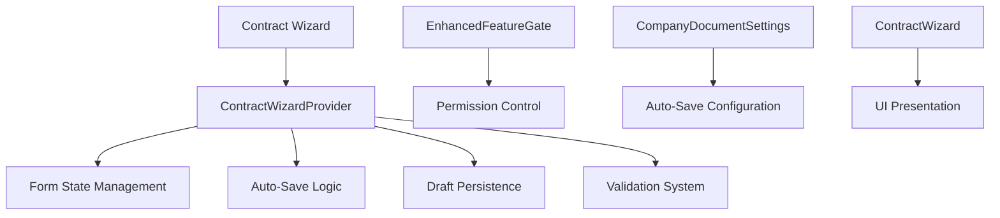
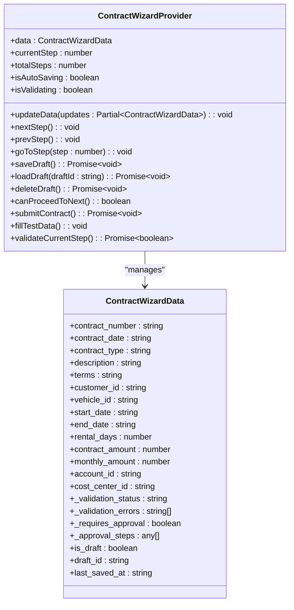
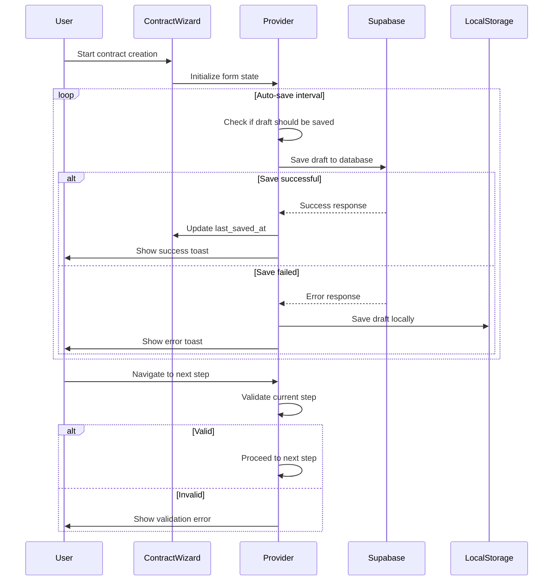
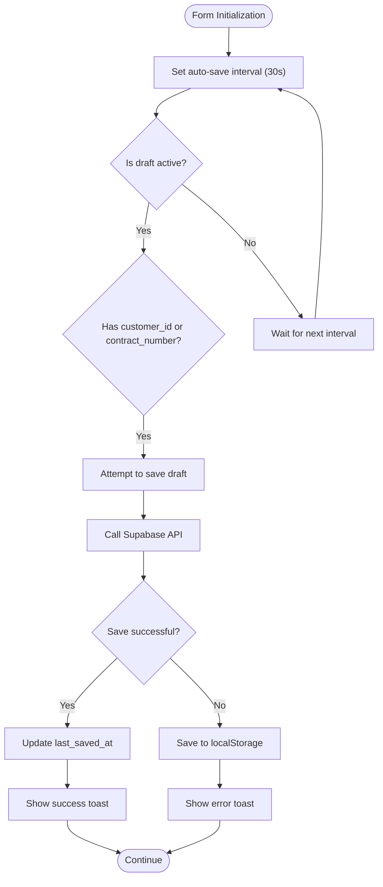
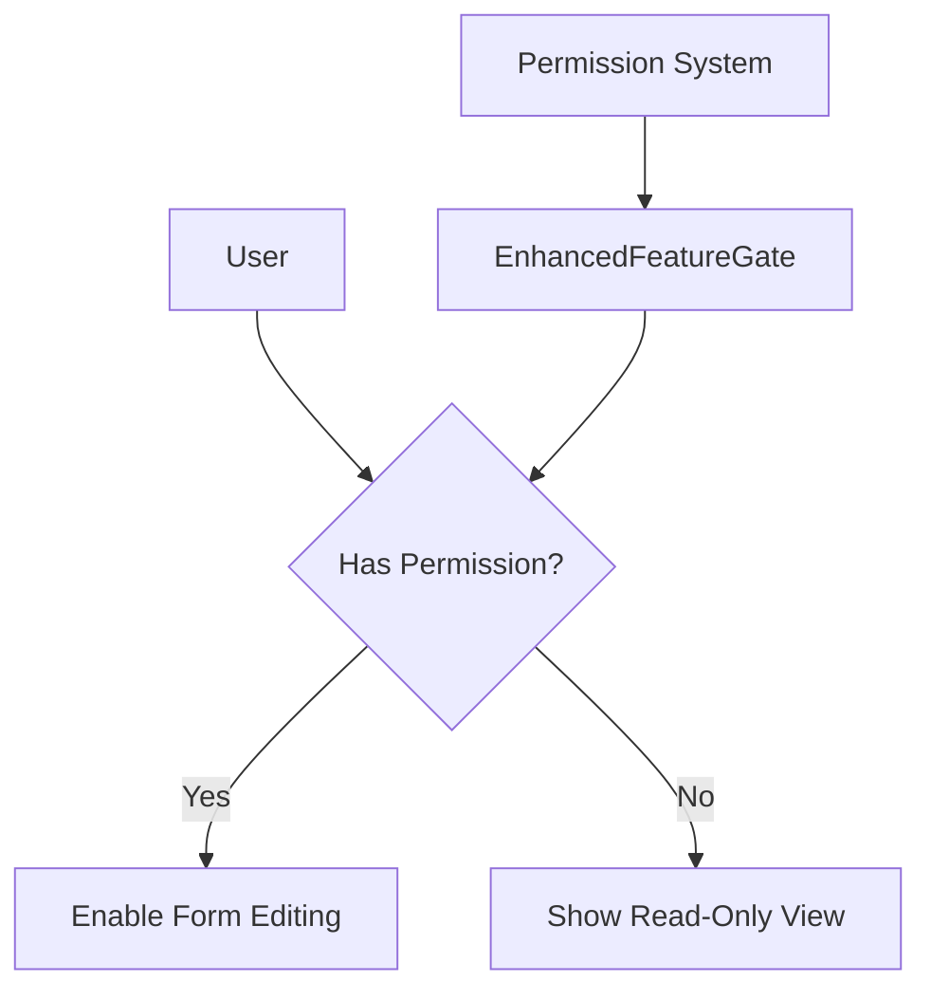
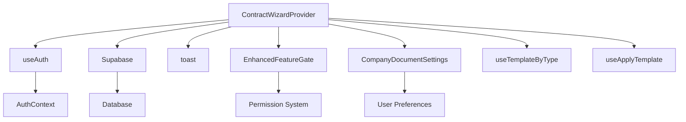

# Enhanced Form Hooks

<cite>
**Referenced Files in This Document**   
- [ContractWizardProvider.tsx](file://src/components/contracts/ContractWizardProvider.tsx)
- [ContractWizardProvider_fixed.tsx](file://src/components/contracts/ContractWizardProvider_fixed.tsx)
- [ContractWizardProvider_backup.tsx](file://src/components/contracts/ContractWizardProvider_backup.tsx)
- [EnhancedFeatureGate.tsx](file://src/components/common/EnhancedFeatureGate.tsx)
- [ContractWizard.tsx](file://src/components/contracts/ContractWizard.tsx)
- [CompanyDocumentSettings.tsx](file://src/components/contracts/CompanyDocumentSettings.tsx)
</cite>

## Table of Contents
1. [Introduction](#introduction)
2. [Project Structure](#project-structure)
3. [Core Components](#core-components)
4. [Architecture Overview](#architecture-overview)
5. [Detailed Component Analysis](#detailed-component-analysis)
6. [Dependency Analysis](#dependency-analysis)
7. [Performance Considerations](#performance-considerations)
8. [Troubleshooting Guide](#troubleshooting-guide)
9. [Conclusion](#conclusion)

## Introduction
This document provides comprehensive documentation for the enhanced form state management system within the Fleetify application. The system centers around advanced form handling capabilities, particularly in contract creation workflows, with robust features for draft auto-saving, change tracking, and form state recovery. The implementation integrates with permission systems through EnhancedFeatureGate and supports complex form lifecycle management. This documentation details the technical architecture, implementation patterns, and integration points for these enhanced form capabilities.

## Project Structure
The enhanced form functionality is primarily organized within the contracts module, with core logic implemented in the ContractWizardProvider component and supporting utilities. The structure follows a provider pattern for state management, with dedicated components for UI presentation and feature gating.



**Diagram sources**
- [ContractWizardProvider.tsx](file://src/components/contracts/ContractWizardProvider.tsx)
- [EnhancedFeatureGate.tsx](file://src/components/common/EnhancedFeatureGate.tsx)
- [CompanyDocumentSettings.tsx](file://src/components/contracts/CompanyDocumentSettings.tsx)

**Section sources**
- [ContractWizardProvider.tsx](file://src/components/contracts/ContractWizardProvider.tsx)
- [ContractWizard.tsx](file://src/components/contracts/ContractWizard.tsx)

## Core Components
The core of the enhanced form system consists of the ContractWizardProvider, which manages form state, implements auto-saving, and handles draft persistence. The provider exposes methods for saving, loading, and deleting drafts, while maintaining real-time form state. The system integrates with Supabase for cloud-based draft storage and falls back to localStorage for offline scenarios. Form state includes tracking of the current step, validation status, and last saved timestamp, enabling comprehensive state recovery.

**Section sources**
- [ContractWizardProvider.tsx](file://src/components/contracts/ContractWizardProvider.tsx)
- [ContractWizardProvider_fixed.tsx](file://src/components/contracts/ContractWizardProvider_fixed.tsx)

## Architecture Overview
The enhanced form architecture follows a React Context-based state management pattern, with the ContractWizardProvider serving as the single source of truth for contract creation forms. The architecture supports both online and offline operation, with automatic synchronization when connectivity is restored. The system implements a hybrid persistence strategy, using Supabase for cloud storage and localStorage as a fallback. Form state changes trigger automatic saving at configurable intervals, with visual indicators showing save status to users.

```mermaid
graph TB
subgraph "Frontend"
A[ContractWizard] --> B[ContractWizardProvider]
B --> C[Form State]
B --> D[Auto-Save Timer]
B --> E[Validation Engine]
end
subgraph "Persistence"
F[Supabase Database] < --> B
G[LocalStorage] < --> B
end
subgraph "Features"
H[EnhancedFeatureGate] --> B
I[CompanyDocumentSettings] --> B
end
A --> J[UI Components]
B --> K[Toast Notifications]
```

**Diagram sources**
- [ContractWizardProvider.tsx](file://src/components/contracts/ContractWizardProvider.tsx)
- [ContractWizard.tsx](file://src/components/contracts/ContractWizard.tsx)

## Detailed Component Analysis

### Contract Wizard Provider Analysis
The ContractWizardProvider implements a comprehensive form state management system with advanced features for draft handling and auto-saving. The provider maintains form data, current step, and save status, exposing methods for navigation and persistence.

#### For Object-Oriented Components:


**Diagram sources**
- [ContractWizardProvider.tsx](file://src/components/contracts/ContractWizardProvider.tsx)
- [ContractWizardProvider_fixed.tsx](file://src/components/contracts/ContractWizardProvider_fixed.tsx)

#### For API/Service Components:


**Diagram sources**
- [ContractWizardProvider.tsx](file://src/components/contracts/ContractWizardProvider.tsx)
- [ContractWizard.tsx](file://src/components/contracts/ContractWizard.tsx)

#### For Complex Logic Components:


**Diagram sources**
- [ContractWizardProvider.tsx](file://src/components/contracts/ContractWizardProvider.tsx)
- [ContractWizardProvider_fixed.tsx](file://src/components/contracts/ContractWizardProvider_fixed.tsx)

**Section sources**
- [ContractWizardProvider.tsx](file://src/components/contracts/ContractWizardProvider.tsx)
- [ContractWizardProvider_backup.tsx](file://src/components/contracts/ContractWizardProvider_backup.tsx)

### Enhanced Feature Gate Integration
The form system integrates with EnhancedFeatureGate to control access to form editing capabilities based on user roles and permissions. This ensures that only authorized users can create or modify contracts.



**Diagram sources**
- [EnhancedFeatureGate.tsx](file://src/components/common/EnhancedFeatureGate.tsx)

**Section sources**
- [EnhancedFeatureGate.tsx](file://src/components/common/EnhancedFeatureGate.tsx)

## Dependency Analysis
The enhanced form system has dependencies on authentication, persistence, and notification systems. The ContractWizardProvider depends on the useAuth hook for user information, Supabase for cloud persistence, and toast notifications for user feedback. The system also depends on the EnhancedFeatureGate for permission control and the CompanyDocumentSettings for auto-save configuration.



**Diagram sources**
- [ContractWizardProvider.tsx](file://src/components/contracts/ContractWizardProvider.tsx)
- [EnhancedFeatureGate.tsx](file://src/components/common/EnhancedFeatureGate.tsx)
- [CompanyDocumentSettings.tsx](file://src/components/contracts/CompanyDocumentSettings.tsx)

**Section sources**
- [ContractWizardProvider.tsx](file://src/components/contracts/ContractWizardProvider.tsx)
- [EnhancedFeatureGate.tsx](file://src/components/common/EnhancedFeatureGate.tsx)

## Performance Considerations
The auto-save functionality is optimized to minimize performance impact by using a 30-second interval and only saving when the form is in draft state with identifying information. The implementation avoids unnecessary re-renders through proper useEffect dependency management and uses memoization where appropriate. For large forms, the system could be further optimized by implementing differential saving, only transmitting changed fields rather than the entire form state.

## Troubleshooting Guide
Common issues with the enhanced form system include auto-save failures, draft loading problems, and permission-related access issues. When auto-save fails, the system falls back to localStorage, but users should be advised to check their internet connection. If drafts cannot be loaded, clearing the browser's localStorage for the contract_draft key may resolve the issue. Permission issues are typically resolved by ensuring the user has the appropriate role and feature access configured in the EnhancedFeatureGate system.

**Section sources**
- [ContractWizardProvider.tsx](file://src/components/contracts/ContractWizardProvider.tsx)
- [EnhancedFeatureGate.tsx](file://src/components/common/EnhancedFeatureGate.tsx)

## Conclusion
The enhanced form hooks implementation provides a robust foundation for complex form management in the Fleetify application. By combining auto-saving, draft persistence, and permission-based access control, the system ensures data integrity while providing a seamless user experience. The architecture supports both online and offline operation, making it resilient to connectivity issues. Future enhancements could include version comparison, rollback capabilities, and more sophisticated conflict resolution for concurrent editing scenarios.