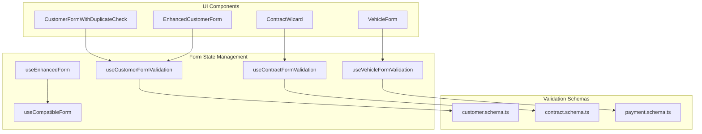
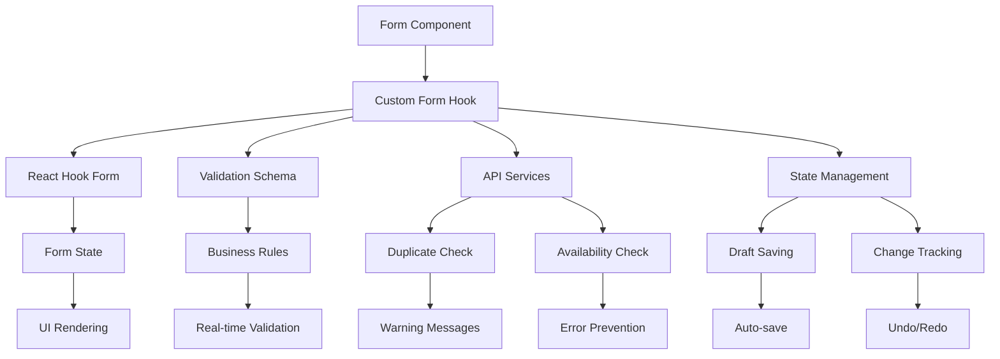
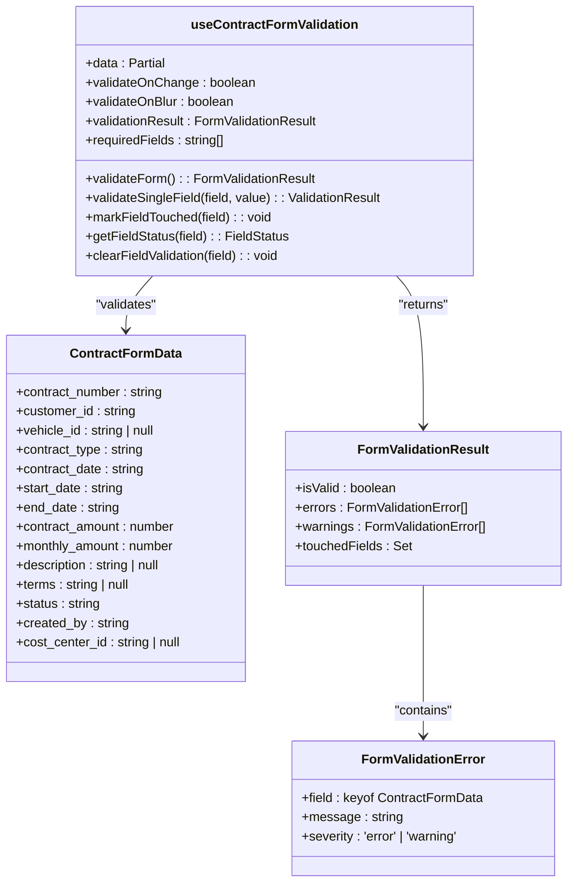
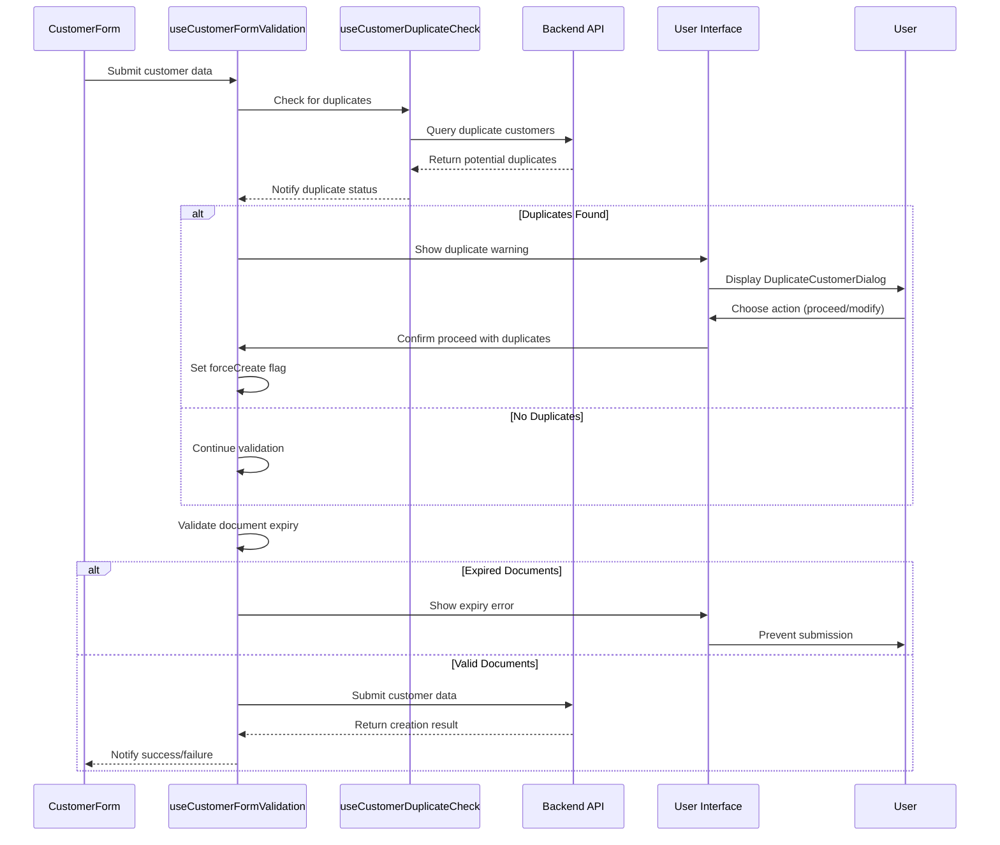
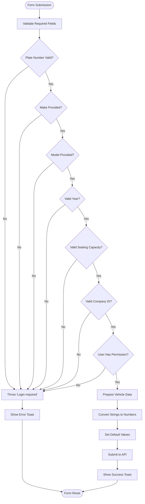
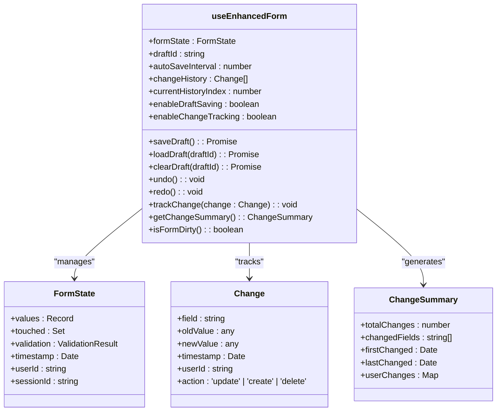
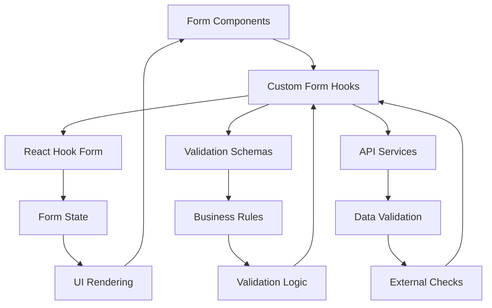

# Form State Hooks

<cite>
**Referenced Files in This Document**   
- [useContractFormValidation.ts](file://src/hooks/useContractFormValidation.ts)
- [useCustomerDuplicateCheck.ts](file://src/hooks/useCustomerDuplicateCheck.ts)
- [useVehicleFormValidation.ts](file://src/hooks/useVehicleFormValidation.ts)
- [useEnhancedForm.ts](file://src/hooks/useEnhancedForm.ts)
- [customer.schema.ts](file://src/schemas/customer.schema.ts)
- [contract.schema.ts](file://src/schemas/contract.schema.ts)
- [useCompatibleForm.ts](file://src/hooks/useCompatibleForm.ts)
- [CustomerFormWithDuplicateCheck.tsx](file://src/components/customers/CustomerFormWithDuplicateCheck.tsx)
- [EnhancedCustomerForm.tsx](file://src/components/customers/EnhancedCustomerForm.tsx)
</cite>

## Table of Contents
1. [Introduction](#introduction)
2. [Project Structure](#project-structure)
3. [Core Components](#core-components)
4. [Architecture Overview](#architecture-overview)
5. [Detailed Component Analysis](#detailed-component-analysis)
6. [Dependency Analysis](#dependency-analysis)
7. [Performance Considerations](#performance-considerations)
8. [Troubleshooting Guide](#troubleshooting-guide)
9. [Conclusion](#conclusion)

## Introduction
This document provides a comprehensive analysis of form state management custom hooks in FleetifyApp, focusing on advanced form validation, state handling, and submission workflows. The system implements specialized hooks for managing complex business forms including contracts, customers, and vehicles, with features like conditional validation, duplicate checking, and real-time feedback. The documentation covers the implementation patterns, integration strategies, and optimization techniques used throughout the application.

## Project Structure
The form state management system is organized within the `src/hooks` directory, with specialized hooks for different business domains. The architecture follows a modular pattern where each form type has its dedicated validation hook, while sharing common utilities and patterns across the codebase.

**Diagram sources**
- [useContractFormValidation.ts](file://src/hooks/useContractFormValidation.ts)
- [customer.schema.ts](file://src/schemas/customer.schema.ts)
- [CustomerFormWithDuplicateCheck.tsx](file://src/components/customers/CustomerFormWithDuplicateCheck.tsx)

**Section sources**
- [useContractFormValidation.ts](file://src/hooks/useContractFormValidation.ts)
- [useCustomerDuplicateCheck.ts](file://src/hooks/useCustomerDuplicateCheck.ts)
- [useVehicleFormValidation.ts](file://src/hooks/useVehicleFormValidation.ts)

## Core Components
The form state management system in FleetifyApp consists of several specialized custom hooks that handle complex form validation, state management, and submission workflows. These hooks provide a consistent API pattern across different form types while accommodating domain-specific requirements. The core components include `useContractFormValidation` for multi-step contract forms, `useCustomerFormValidation` for customer creation with duplicate checking, `useVehicleFormValidation` for vehicle data entry, and `useEnhancedForm` for advanced form features.

**Section sources**
- [useContractFormValidation.ts](file://src/hooks/useContractFormValidation.ts)
- [useCustomerDuplicateCheck.ts](file://src/hooks/useCustomerDuplicateCheck.ts)
- [useVehicleFormValidation.ts](file://src/hooks/useVehicleFormValidation.ts)
- [useEnhancedForm.ts](file://src/hooks/useEnhancedForm.ts)

## Architecture Overview
The form state management architecture in FleetifyApp follows a composable hook pattern where each form type has its dedicated validation hook that encapsulates domain-specific business rules. These hooks integrate with React Hook Form for basic form state management while adding layers of custom validation logic, real-time feedback, and submission handling. The system employs a consistent interface across all form hooks, making it easier for developers to work with different form types while maintaining type safety through TypeScript interfaces.

**Diagram sources**
- [useContractFormValidation.ts](file://src/hooks/useContractFormValidation.ts)
- [useEnhancedForm.ts](file://src/hooks/useEnhancedForm.ts)
- [useCustomerDuplicateCheck.ts](file://src/hooks/useCustomerDuplicateCheck.ts)

## Detailed Component Analysis

### useContractFormValidation Analysis
The `useContractFormValidation` hook manages form state for multi-step contract forms with conditional validation rules. It implements a comprehensive validation system that checks required fields, date relationships, and amount constraints. The hook supports conditional validation based on contract type, providing warnings when vehicle selection is recommended but not required. It maintains a set of touched fields to provide contextual feedback and implements debounced validation to optimize performance.

**Diagram sources**
- [useContractFormValidation.ts](file://src/hooks/useContractFormValidation.ts)

**Section sources**
- [useContractFormValidation.ts](file://src/hooks/useContractFormValidation.ts)

### useCustomerFormValidation Analysis
The `useCustomerFormValidation` hook handles customer creation forms with duplicate checking and account integration. It integrates with the `useCustomerDuplicateCheck` hook to detect potential duplicate customers in real-time based on national ID, passport number, phone, and email. The validation system includes checks for expired identification documents and corporate/individual customer requirements. The hook manages the complex state transitions between duplicate detection, warning display, and forced creation workflows.

**Diagram sources**
- [CustomerFormWithDuplicateCheck.tsx](file://src/components/customers/CustomerFormWithDuplicateCheck.tsx)
- [EnhancedCustomerForm.tsx](file://src/components/customers/EnhancedCustomerForm.tsx)
- [customer.schema.ts](file://src/schemas/customer.schema.ts)

**Section sources**
- [CustomerFormWithDuplicateCheck.tsx](file://src/components/customers/CustomerFormWithDuplicateCheck.tsx)
- [EnhancedCustomerForm.tsx](file://src/components/customers/EnhancedCustomerForm.tsx)
- [customer.schema.ts](file://src/schemas/customer.schema.ts)

### useVehicleFormValidation Analysis
The `useVehicleFormValidation` hook manages vehicle data entry forms with condition-based requirements. It implements validation rules for vehicle attributes such as year, seating capacity, and identification numbers. The hook ensures data integrity by validating numeric ranges and required fields while providing real-time feedback on form completeness. It integrates with company context to ensure vehicles are associated with valid company IDs and checks user permissions before allowing vehicle creation or modification.

**Diagram sources**
- [VehicleForm.tsx](file://src/components/fleet/VehicleForm.tsx)

**Section sources**
- [VehicleForm.tsx](file://src/components/fleet/VehicleForm.tsx)

### useEnhancedForm Analysis
The `useEnhancedForm` hook provides advanced form features like draft saving and change tracking. It extends the basic form functionality with capabilities for auto-saving form state, tracking changes for audit purposes, and supporting undo/redo operations. The hook integrates with local storage or backend services to persist form drafts, allowing users to resume their work later. It also implements performance optimizations to minimize re-renders and improve responsiveness during data entry.

**Diagram sources**
- [useEnhancedForm.ts](file://src/hooks/useEnhancedForm.ts)

**Section sources**
- [useEnhancedForm.ts](file://src/hooks/useEnhancedForm.ts)

## Dependency Analysis
The form state management system has well-defined dependencies between components, following a clean architecture pattern. The custom form hooks depend on validation schemas for business rules, React Hook Form for basic form state management, and API services for data validation. The UI components depend on the form hooks for state and validation, creating a unidirectional data flow. The system minimizes circular dependencies by using interface segregation and dependency inversion principles.

**Diagram sources**
- [useContractFormValidation.ts](file://src/hooks/useContractFormValidation.ts)
- [useCustomerDuplicateCheck.ts](file://src/hooks/useCustomerDuplicateCheck.ts)
- [customer.schema.ts](file://src/schemas/customer.schema.ts)

**Section sources**
- [useContractFormValidation.ts](file://src/hooks/useContractFormValidation.ts)
- [useCustomerDuplicateCheck.ts](file://src/hooks/useCustomerDuplicateCheck.ts)
- [customer.schema.ts](file://src/schemas/customer.schema.ts)

## Performance Considerations
The form state management system implements several optimization techniques to ensure responsive user experiences. These include debounced validation to prevent excessive API calls, memoized form configurations to reduce re-renders, and selective state updates to minimize performance overhead. The system uses React's useCallback and useMemo hooks extensively to prevent unnecessary re-creations of functions and values. For large forms, the validation is performed incrementally rather than all at once, providing faster feedback to users.

**Section sources**
- [useContractFormValidation.ts](file://src/hooks/useContractFormValidation.ts)
- [useCompatibleForm.ts](file://src/hooks/useCompatibleForm.ts)
- [useDebounce.ts](file://src/hooks/useDebounce.ts)

## Troubleshooting Guide
Common issues with the form state management system typically involve validation timing, duplicate detection delays, or state synchronization problems. For validation performance issues, ensure that debounced validation is properly configured and that expensive operations are not performed on every keystroke. When duplicate customers are not detected, verify that the `useCustomerDuplicateCheck` hook is receiving updated form data and that the debounce interval is appropriate. For state synchronization issues between form components and hooks, check that the form state is being properly propagated and that there are no conflicting state updates.

**Section sources**
- [useContractFormValidation.ts](file://src/hooks/useContractFormValidation.ts)
- [CustomerFormWithDuplicateCheck.tsx](file://src/components/customers/CustomerFormWithDuplicateCheck.tsx)
- [EnhancedCustomerForm.tsx](file://src/components/customers/EnhancedCustomerForm.tsx)

## Conclusion
The form state management system in FleetifyApp provides a robust foundation for handling complex business forms with advanced validation, duplicate checking, and state management capabilities. By implementing specialized custom hooks for different form types, the system maintains a consistent API while accommodating domain-specific requirements. The architecture promotes reusability, testability, and maintainability through clear separation of concerns and well-defined interfaces. Future enhancements could include more sophisticated change tracking, improved offline support for draft saving, and enhanced accessibility features for users with disabilities.